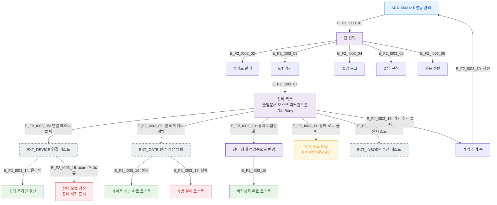

# F2 메인 인터랙션 플로우 — SCR-I003 IoT 연동 관리

## 목적
장비 목록 조회, 상태 확인, 원격 제어, 장애 처리 정상 흐름을 정의한다.

## 다이어그램

## TC 후보
| TC ID | 타입 | Given | When | Then |
|-------|------|-------|------|------|
| TC-I003-F2-01 | positive | owner | 연결 테스트 클릭 | 온라인 상태 갱신 |
| TC-I003-F2-02 | positive | owner | 원격 게이트 개방 | 개방 완료 토스트 |
| TC-I003-F2-03 | positive | owner | 장비 비활성화 | 점검중 상태 변경 |
| TC-I003-F2-04 | negative | owner | 오프라인 장비 연결 테스트 | 오류 상태 갱신, 장애 배지 |
