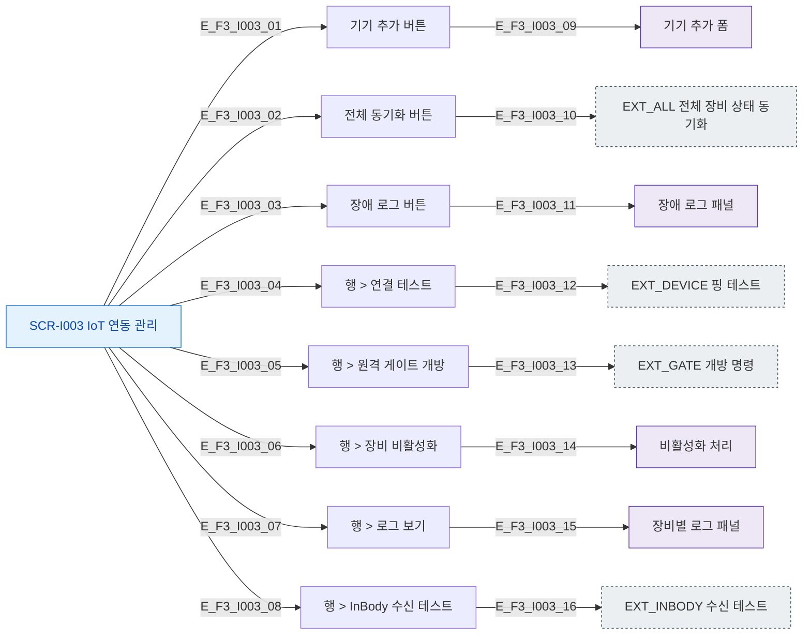

# F3 버튼/액션 매핑 플로우 — SCR-I003 IoT 연동 관리

## 다이어그램

## TC 후보
| TC ID | 타입 | Given | When | Then |
|-------|------|-------|------|------|
| TC-I003-F3-01 | positive | owner | 기기 추가 버튼 | 기기 추가 폼 표시 |
| TC-I003-F3-02 | positive | owner | 전체 동기화 버튼 | 모든 장비 상태 동기화 |
| TC-I003-F3-03 | positive | owner | InBody 수신 테스트 | 수신 테스트 실행 |
