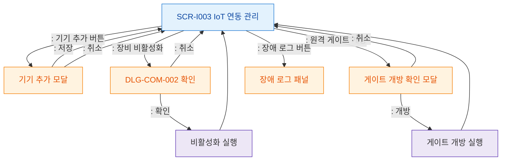

# F5 모달 트리거 트리 — SCR-I003 IoT 연동 관리

## 다이어그램

## TC 후보
| TC ID | 타입 | Given | When | Then | |-------|------|-------|------|------| | TC-I003-F5-01 | positive | owner | 기기 추가 버튼 | 기기 추가 모달 열림 | | TC-I003-F5-02 | positive | owner | 원격 게이트 개방 | 게이트 개방 확인 모달 열림 | | TC-I003-F5-03 | positive | owner | 장비 비활성화 | DLG-COM-002 열림 |
