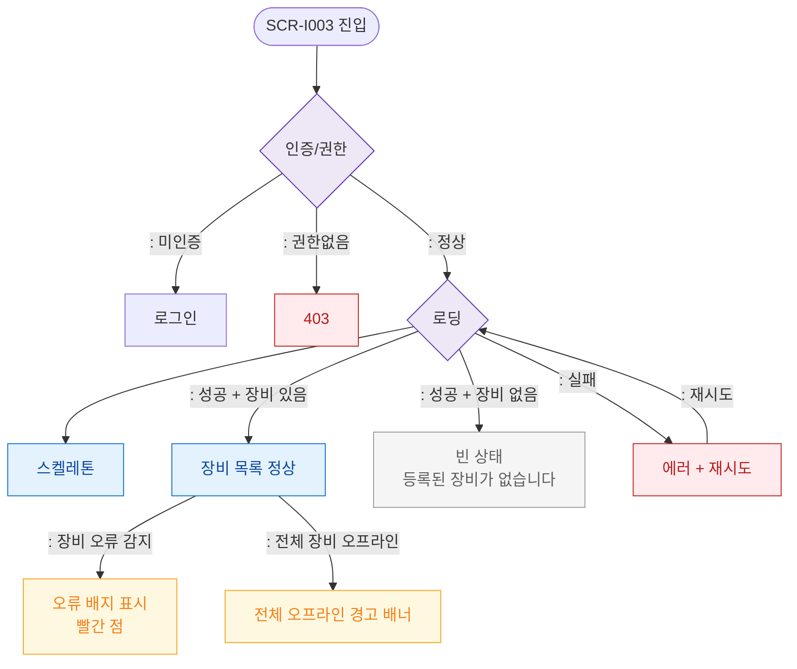

# F6 상태별 화면 플로우 — SCR-I003 IoT 연동 관리

## 다이어그램

## TC 후보
| TC ID | 타입 | Given | When | Then | |-------|------|-------|------|------| | TC-I003-F6-01 | positive | owner | 장비 있음 | 장비 목록 정상 표시 | | TC-I003-F6-02 | positive | owner | 장비 없음 | 빈 상태 메시지 | | TC-I003-F6-03 | negative | owner | 장비 오류 상태 | 오류 배지 표시 |
