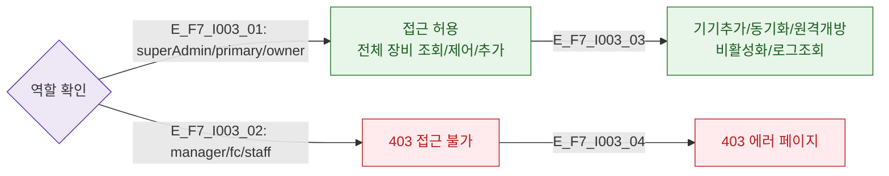

# F7 권한(RBAC) 분기 플로우 — SCR-I003 IoT 연동 관리

## 다이어그램

## TC 후보
| TC ID | 타입 | Given | When | Then |
|-------|------|-------|------|------|
| TC-I003-F7-01 | positive | owner | IoT 연동 관리 진입 | 전체 액션 허용 |
| TC-I003-F7-02 | negative | manager | /settings/iot 접근 | 403 에러 |
