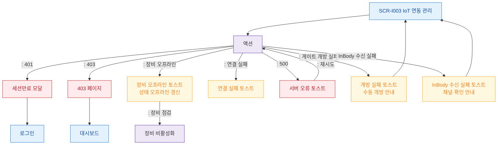

# F8 에러/예외/복구 플로우 — SCR-I003 IoT 연동 관리

## 다이어그램

## TC 후보
| TC ID | 타입 | Given | When | Then | |-------|------|-------|------|------| | TC-I003-F8-01 | negative | owner | 장비 오프라인 연결 테스트 | 오프라인 토스트, 상태 갱신 | | TC-I003-F8-02 | negative | owner | 원격 게이트 개방 실패 | 개방 실패 토스트 | | TC-I003-F8-03 | negative | owner | InBody 수신 테스트 실패 | 수신 실패 토스트 |
