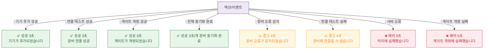

# F9 토스트/피드백 플로우 — SCR-I003 IoT 연동 관리

## 다이어그램

## TC 후보
| TC ID | 타입 | Given | When | Then | |-------|------|-------|------|------| | TC-I003-F9-01 | positive | owner | 게이트 개방 성공 | 성공 토스트 3초 | | TC-I003-F9-02 | negative | owner | 연결 테스트 실패 | 경고 토스트 4초 |
