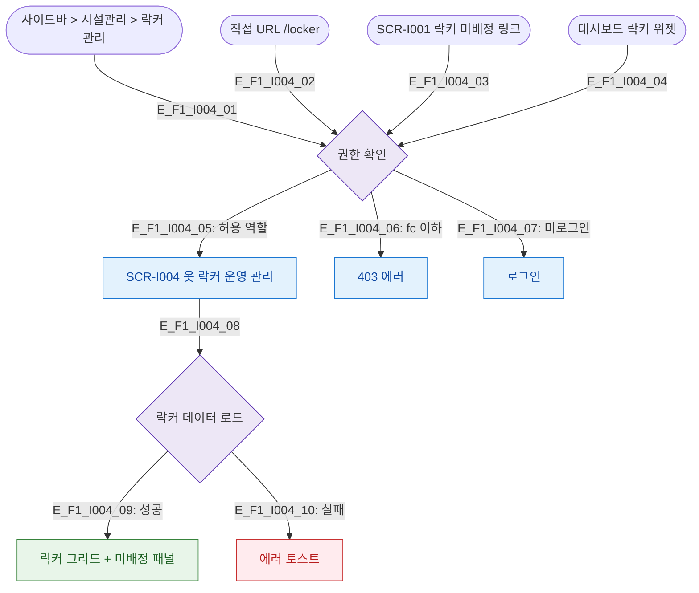

# F1 진입 플로우 — SCR-I004 옷 락커 운영 관리

## 다이어그램

## TC 후보
| TC ID | 타입 | Given | When | Then |
|-------|------|-------|------|------|
| TC-I004-F1-01 | positive | staff | 사이드바 > 시설관리 > 락커 관리 | 옷 락커 운영 관리 진입 |
| TC-I004-F1-02 | negative | fc | /locker 직접 접근 | 403 에러 |
| TC-I004-F1-03 | positive | manager | SCR-I001 미배정 링크 클릭 | 옷 락커 운영 관리 진입 |
