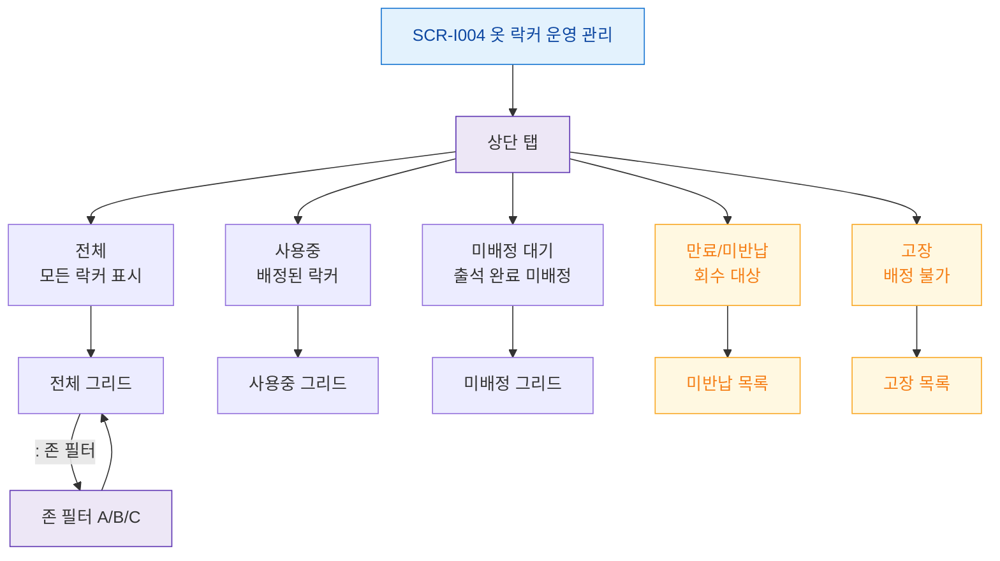

# F4 필터/탭 전환 플로우 — SCR-I004 옷 락커 운영 관리

## 다이어그램

## TC 후보
| TC ID | 타입 | Given | When | Then | |-------|------|-------|------|------| | TC-I004-F4-01 | positive | staff | 미배정 대기 탭 클릭 | 출석 완료 미배정 락커만 표시 | | TC-I004-F4-02 | positive | manager | 만료/미반납 탭 클릭 | 회수 대상 목록 표시 | | TC-I004-F4-03 | positive | staff | 존 필터 A 선택 | A존 락커만 그리드 표시 |
