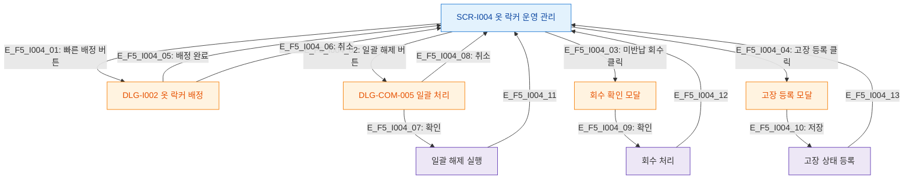

# F5 모달 트리거 트리 — SCR-I004 옷 락커 운영 관리

## 다이어그램

## TC 후보
| TC ID | 타입 | Given | When | Then |
|-------|------|-------|------|------|
| TC-I004-F5-01 | positive | staff | 빠른 배정 버튼 | DLG-I002 열림 |
| TC-I004-F5-02 | positive | manager | 일괄 해제 버튼 | DLG-COM-005 열림 |
| TC-I004-F5-03 | positive | manager | 미반납 회수 클릭 | 회수 확인 모달 열림 |
