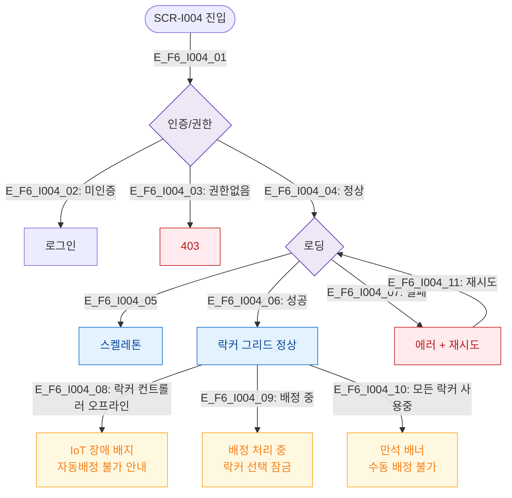

# F6 상태별 화면 플로우 — SCR-I004 옷 락커 운영 관리

## 다이어그램

## TC 후보
| TC ID | 타입 | Given | When | Then |
|-------|------|-------|------|------|
| TC-I004-F6-01 | positive | staff | 정상 진입 | 락커 그리드 표시 |
| TC-I004-F6-02 | negative | staff | 락커 컨트롤러 오프라인 | IoT 장애 배지 표시 |
| TC-I004-F6-03 | negative | staff | 모든 락커 사용중 | 만석 배너 표시 |
