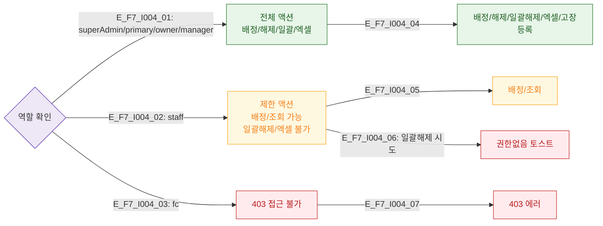

# F7 권한(RBAC) 분기 플로우 — SCR-I004 옷 락커 운영 관리

## 다이어그램

## TC 후보
| TC ID | 타입 | Given | When | Then |
|-------|------|-------|------|------|
| TC-I004-F7-01 | positive | manager | 락커 배정 | 배정 가능 |
| TC-I004-F7-02 | positive | staff | 락커 배정 | 배정 가능 |
| TC-I004-F7-03 | negative | staff | 일괄 해제 시도 | 권한없음 토스트 |
| TC-I004-F7-04 | negative | fc | /locker 접근 | 403 에러 |
