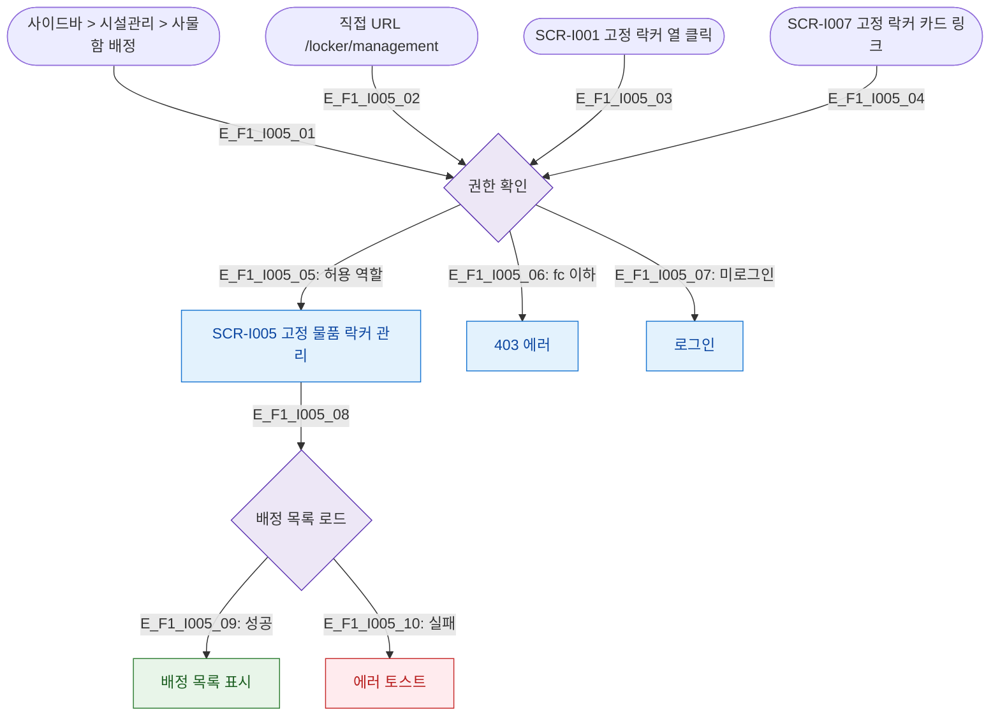

# F1 진입 플로우 — SCR-I005 고정 물품 락커 관리

## 다이어그램

## TC 후보
| TC ID | 타입 | Given | When | Then |
|-------|------|-------|------|------|
| TC-I005-F1-01 | positive | staff | 사이드바 > 사물함 배정 | 고정 물품 락커 관리 진입 |
| TC-I005-F1-02 | negative | fc | /locker/management 접근 | 403 에러 |
