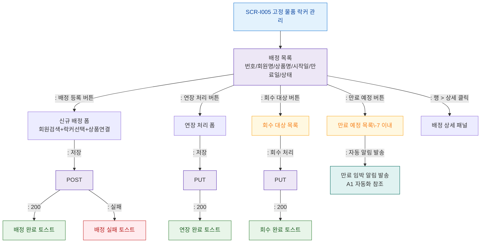

# F2 메인 인터랙션 플로우 — SCR-I005 고정 물품 락커 관리

## 목적
신규 배정, 연장, 회수, 만료 예정 처리 정상 흐름을 정의한다.

## 다이어그램

## TC 후보
| TC ID | 타입 | Given | When | Then | |-------|------|-------|------|------| | TC-I005-F2-01 | positive | manager | 신규 배정 저장 | 배정 완료 토스트, 목록 갱신 | | TC-I005-F2-02 | positive | manager | 연장 처리 저장 | 연장 완료 토스트 | | TC-I005-F2-03 | positive | manager | 회수 처리 | 회수 완료 토스트 | | TC-I005-F2-04 | positive | manager | 만료 예정 > 자동 알림 발송 | 알림 발송 (A1 참조) |
