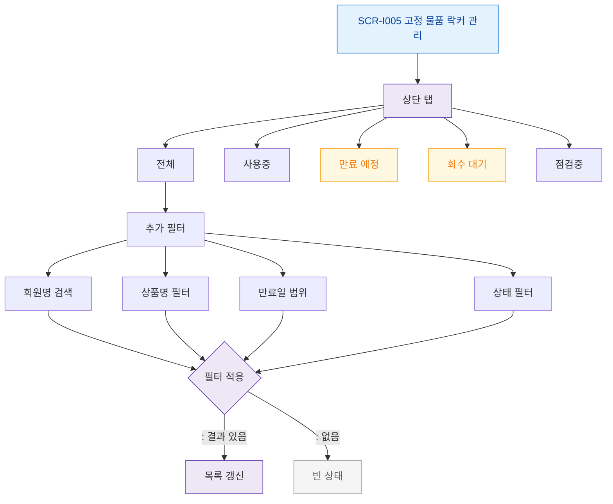

# F4 필터/검색 플로우 — SCR-I005 고정 물품 락커 관리

## 다이어그램

## TC 후보
| TC ID | 타입 | Given | When | Then | |-------|------|-------|------|------| | TC-I005-F4-01 | positive | manager | 만료 예정 탭 | D-7 이내 목록 | | TC-I005-F4-02 | positive | manager | 회원명 검색 | 해당 회원 락커만 표시 | | TC-I005-F4-03 | positive | manager | 회수 대기 탭 | 회수 대상 목록 |
