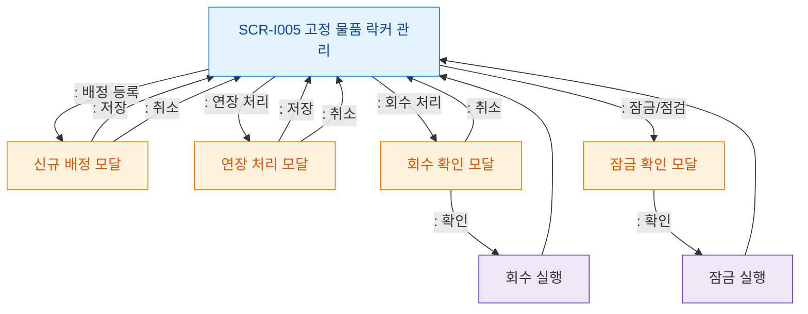

# F5 모달 트리거 트리 — SCR-I005 고정 물품 락커 관리

## 다이어그램

## TC 후보
| TC ID | 타입 | Given | When | Then | |-------|------|-------|------|------| | TC-I005-F5-01 | positive | manager | 배정 등록 버튼 | 신규 배정 모달 열림 | | TC-I005-F5-02 | positive | manager | 연장 처리 버튼 | 연장 처리 모달 열림 | | TC-I005-F5-03 | positive | manager | 회수 처리 클릭 | 회수 확인 모달 열림 |
