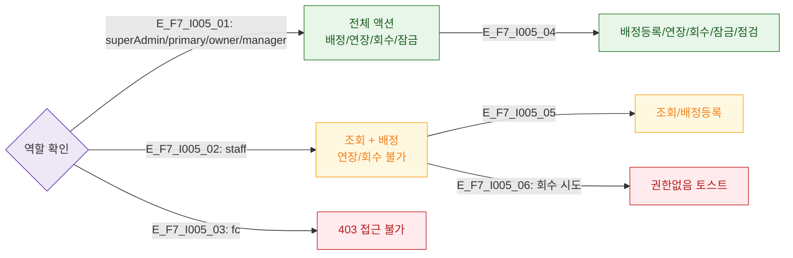

# F7 권한(RBAC) 분기 — SCR-I005 고정 물품 락커 관리

## 다이어그램

## TC 후보
| TC ID | 타입 | Given | When | Then |
|-------|------|-------|------|------|
| TC-I005-F7-01 | positive | manager | 회수 처리 | 회수 가능 |
| TC-I005-F7-02 | negative | staff | 회수 처리 시도 | 권한없음 토스트 |
| TC-I005-F7-03 | negative | fc | 접근 시도 | 403 |
