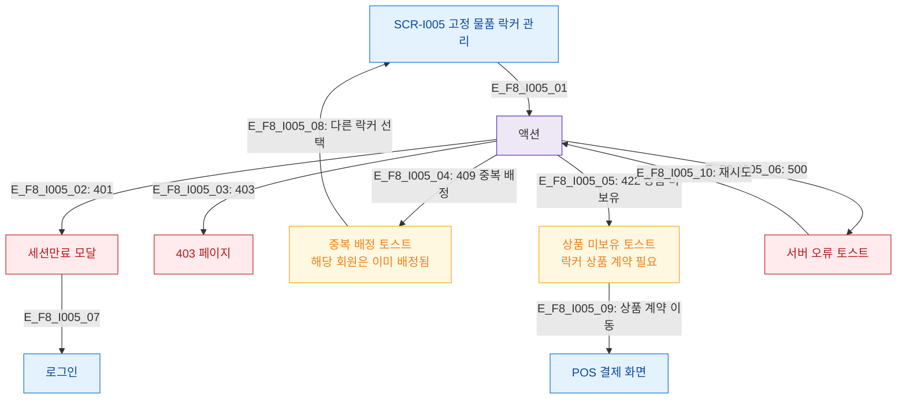

# F8 에러/예외/복구 플로우 — SCR-I005 고정 물품 락커 관리

## 다이어그램

## TC 후보
| TC ID | 타입 | Given | When | Then |
|-------|------|-------|------|------|
| TC-I005-F8-01 | negative | manager | 이미 배정된 회원 재배정 | 409 중복 배정 토스트 |
| TC-I005-F8-02 | negative | manager | 락커 상품 미보유 회원 배정 | 422 상품 미보유 토스트 |
