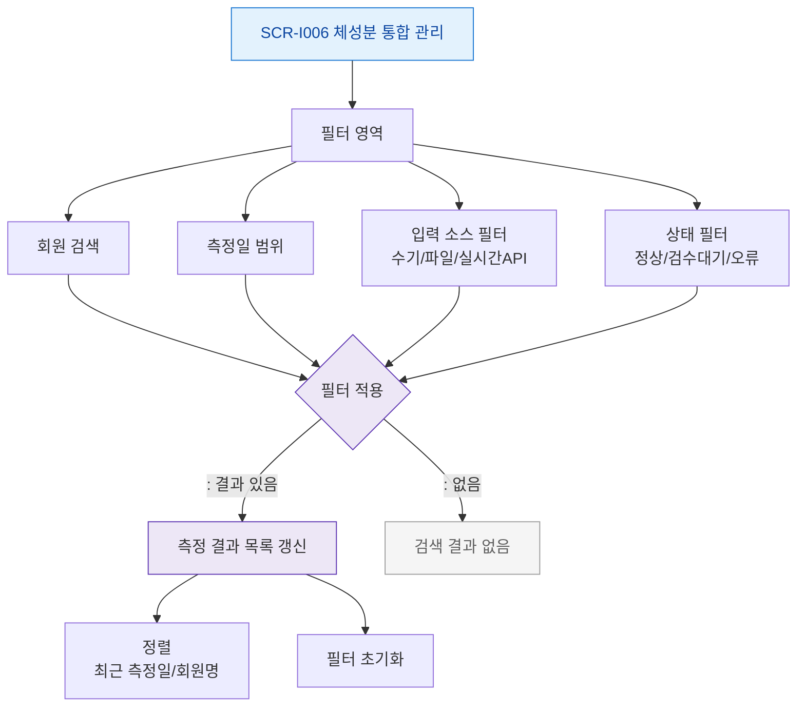

# F4 필터/검색 플로우 — SCR-I006 체성분 통합 관리

## 다이어그램

## TC 후보
| TC ID | 타입 | Given | When | Then | |-------|------|-------|------|------| | TC-I006-F4-01 | positive | fc | 입력 소스 = InBody API 필터 | API 수신 데이터만 표시 | | TC-I006-F4-02 | positive | fc | 상태 = 검수대기 필터 | 검수 대기 데이터만 표시 | | TC-I006-F4-03 | positive | fc | 회원명 검색 | 해당 회원 체성분만 표시 |
