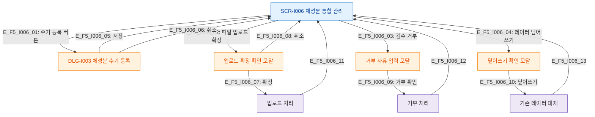

# F5 모달 트리거 트리 — SCR-I006 체성분 통합 관리

## 다이어그램

## TC 후보
| TC ID | 타입 | Given | When | Then |
|-------|------|-------|------|------|
| TC-I006-F5-01 | positive | fc | 수기 등록 버튼 | DLG-I003 열림 |
| TC-I006-F5-02 | positive | fc | 파일 업로드 확정 | 업로드 확정 모달 열림 |
| TC-I006-F5-03 | positive | fc | 동일 날짜 데이터 덮어쓰기 | 덮어쓰기 확인 모달 열림 |
