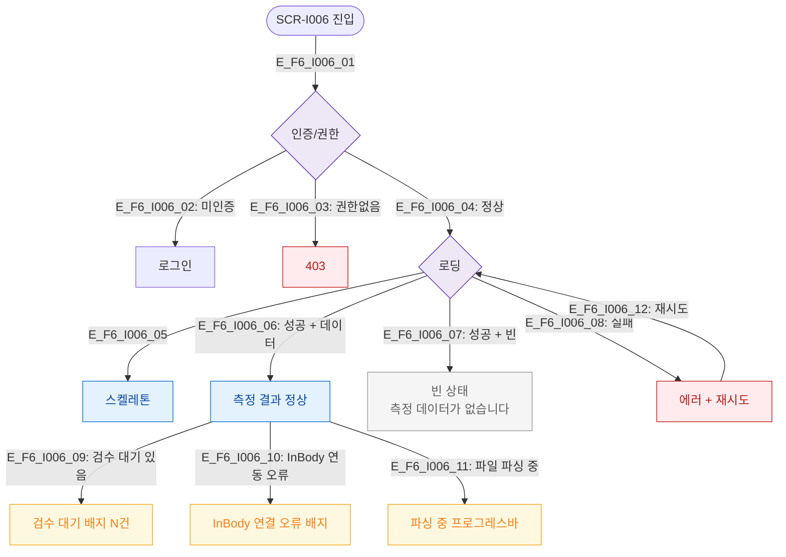

# F6 상태별 화면 플로우 — SCR-I006 체성분 통합 관리

## 다이어그램

## TC 후보
| TC ID | 타입 | Given | When | Then |
|-------|------|-------|------|------|
| TC-I006-F6-01 | positive | fc | 검수 대기 있음 | 검수 대기 배지 표시 |
| TC-I006-F6-02 | negative | fc | InBody 연동 오류 | 연결 오류 배지 표시 |
| TC-I006-F6-03 | negative | staff | /body-composition 접근 | 403 |
