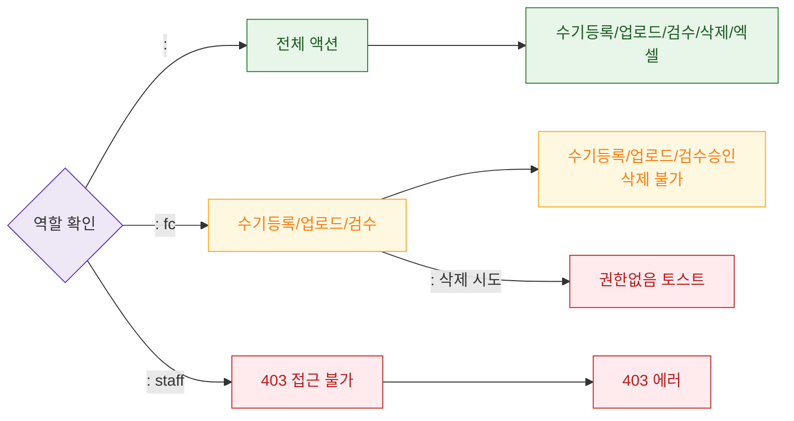

# F7 권한(RBAC) 분기 — SCR-I006 체성분 통합 관리

## 다이어그램

## TC 후보
| TC ID | 타입 | Given | When | Then | |-------|------|-------|------|------| | TC-I006-F7-01 | positive | fc | 수기 등록 | 등록 가능 | | TC-I006-F7-02 | negative | fc | 체성분 데이터 삭제 시도 | 권한없음 토스트 | | TC-I006-F7-03 | negative | staff | 접근 시도 | 403 |
