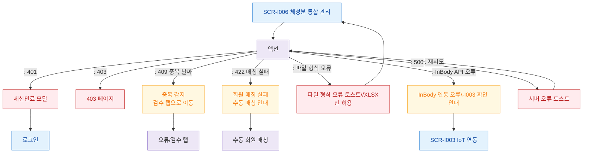

# F8 에러/예외/복구 플로우 — SCR-I006 체성분 통합 관리

## 다이어그램

## TC 후보
| TC ID | 타입 | Given | When | Then | |-------|------|-------|------|------| | TC-I006-F8-01 | negative | fc | 동일 날짜 중복 파일 업로드 | 409 검수 탭으로 이동 | | TC-I006-F8-02 | negative | fc | 회원 매칭 안 되는 데이터 | 422 수동 매칭 안내 | | TC-I006-F8-03 | negative | fc | 잘못된 파일 형식 | 파일 형식 오류 토스트 | | TC-I006-F8-04 | negative | fc | InBody API 연동 오류 | 연동 오류 토스트 + SCR-I003 링크 |
