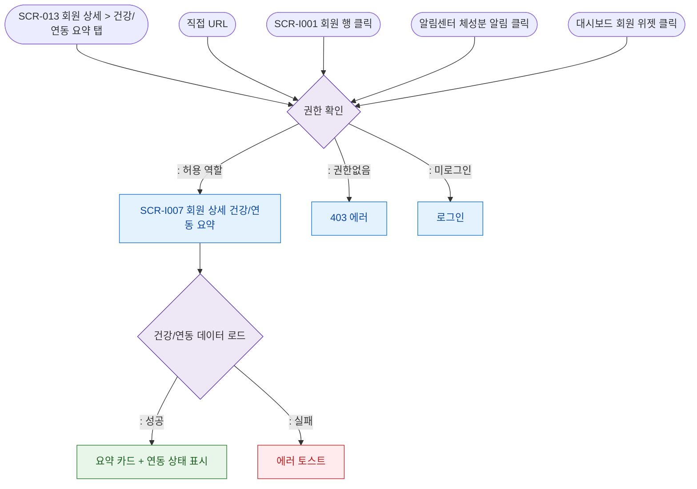

# F1 진입 플로우 — SCR-I007 회원 상세 건강/연동 요약

## 다이어그램

## TC 후보
| TC ID | 타입 | Given | When | Then | |-------|------|-------|------|------| | TC-I007-F1-01 | positive | fc | 회원 상세 > 건강/연동 요약 탭 | 건강/연동 요약 표시 | | TC-I007-F1-02 | positive | staff | SCR-I001 회원 행 클릭 | 회원 상세 진입 | | TC-I007-F1-03 | negative | 미로그인 | 접근 | 로그인 리다이렉트 |
