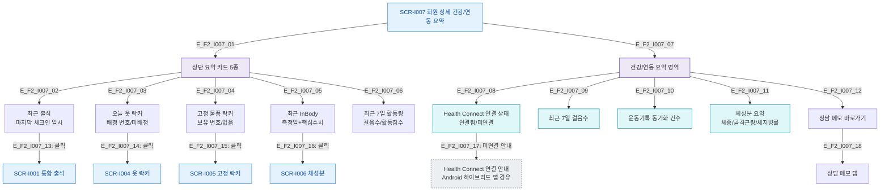

# F2 메인 인터랙션 플로우 — SCR-I007 회원 상세 건강/연동 요약

## 목적
5개 요약 카드(출석/옷락커/고정락커/InBody/활동량) 조회 및 각 카드별 상세 이동 흐름을 정의한다.

## 다이어그램

## TC 후보
| TC ID | 타입 | Given | When | Then |
|-------|------|-------|------|------|
| TC-I007-F2-01 | positive | fc | 최근 출석 카드 클릭 | SCR-I001 통합 출석 이동 |
| TC-I007-F2-02 | positive | fc | 최근 InBody 카드 클릭 | SCR-I006 체성분 이동 |
| TC-I007-F2-03 | positive | fc | Health Connect 미연결 | 연결 안내 표시 |
| TC-I007-F2-04 | positive | fc | 상담 메모 바로가기 | 상담 메모 탭 이동 |
