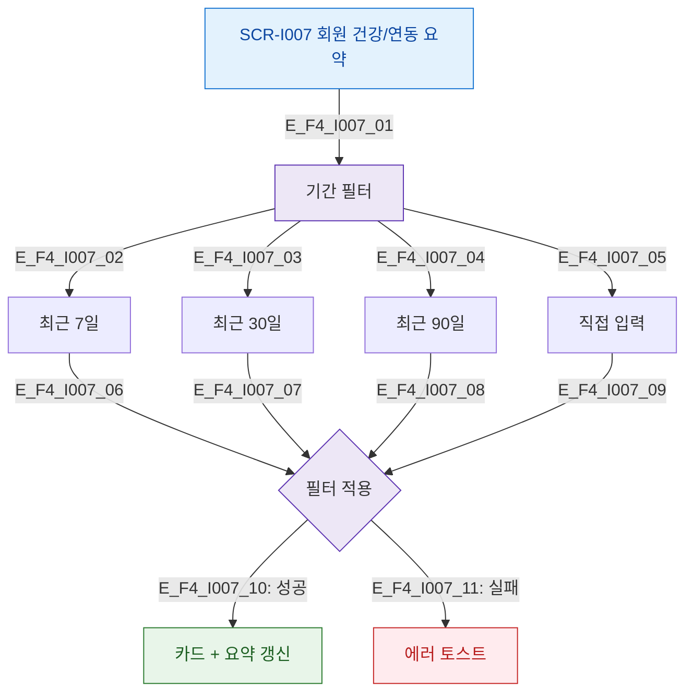

# F4 기간 필터 플로우 — SCR-I007 회원 상세 건강/연동 요약

## 다이어그램

## TC 후보
| TC ID | 타입 | Given | When | Then |
|-------|------|-------|------|------|
| TC-I007-F4-01 | positive | fc | 최근 30일 필터 | 30일 기준 활동량/출석 갱신 |
| TC-I007-F4-02 | positive | fc | 직접 기간 입력 | 해당 기간 데이터 표시 |
