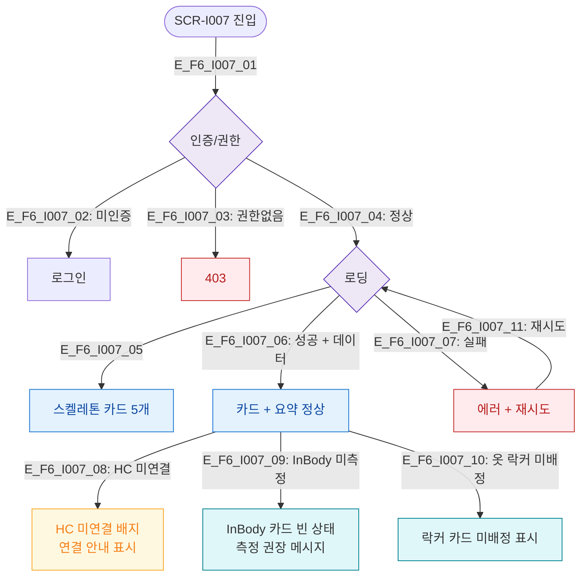

# F6 상태별 화면 플로우 — SCR-I007 회원 상세 건강/연동 요약

## 다이어그램

## TC 후보
| TC ID | 타입 | Given | When | Then |
|-------|------|-------|------|------|
| TC-I007-F6-01 | positive | fc | 정상 회원 | 카드 5종 정상 표시 |
| TC-I007-F6-02 | positive | fc | HC 미연결 회원 | HC 미연결 배지 표시 |
| TC-I007-F6-03 | positive | fc | InBody 미측정 회원 | 측정 권장 메시지 |
| TC-I007-F6-04 | positive | fc | 옷 락커 미배정 | 미배정 표시 |
