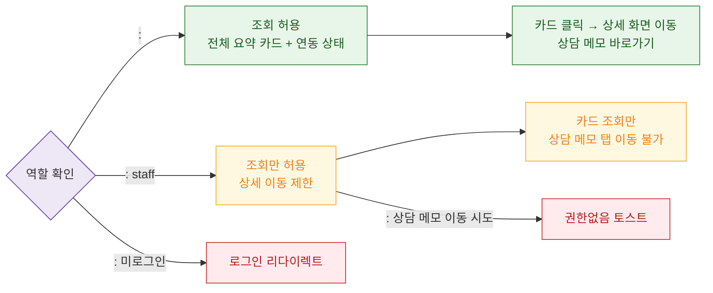

# F7 권한(RBAC) 분기 — SCR-I007 회원 상세 건강/연동 요약

## 다이어그램

## TC 후보
| TC ID | 타입 | Given | When | Then | |-------|------|-------|------|------| | TC-I007-F7-01 | positive | fc | 건강/연동 요약 조회 | 전체 카드 + 상세 이동 가능 | | TC-I007-F7-02 | positive | staff | 건강/연동 요약 조회 | 카드 조회만 가능 | | TC-I007-F7-03 | negative | staff | 상담 메모 바로가기 클릭 | 권한없음 토스트 |
