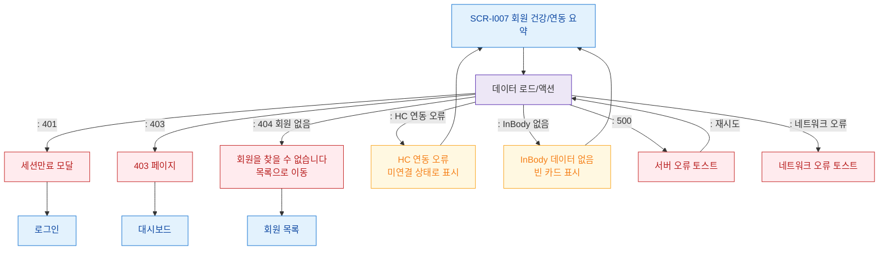

# F8 에러/예외/복구 플로우 — SCR-I007 회원 상세 건강/연동 요약

## 다이어그램

## TC 후보
| TC ID | 타입 | Given | When | Then | |-------|------|-------|------|------| | TC-I007-F8-01 | negative | fc | 존재하지 않는 회원 ID | 404 토스트 + 회원 목록 이동 | | TC-I007-F8-02 | negative | fc | HC 연동 오류 | 미연결 상태로 표시 | | TC-I007-F8-03 | negative | fc | InBody 미측정 회원 | 빈 카드 표시 |
