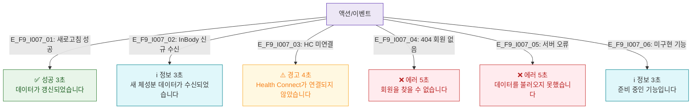

# F9 토스트/피드백 플로우 — SCR-I007 회원 상세 건강/연동 요약

## 다이어그램

## TC 후보
| TC ID | 타입 | Given | When | Then |
|-------|------|-------|------|------|
| TC-I007-F9-01 | positive | fc | 새로고침 성공 | 성공 토스트 3초 |
| TC-I007-F9-02 | positive | fc | InBody 신규 수신 | 정보 토스트 3초 |
| TC-I007-F9-03 | negative | fc | HC 미연결 | 경고 토스트 4초 |
