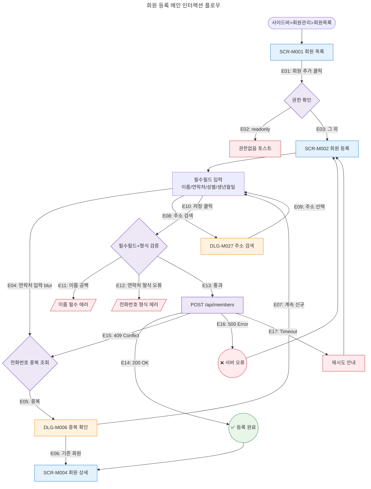
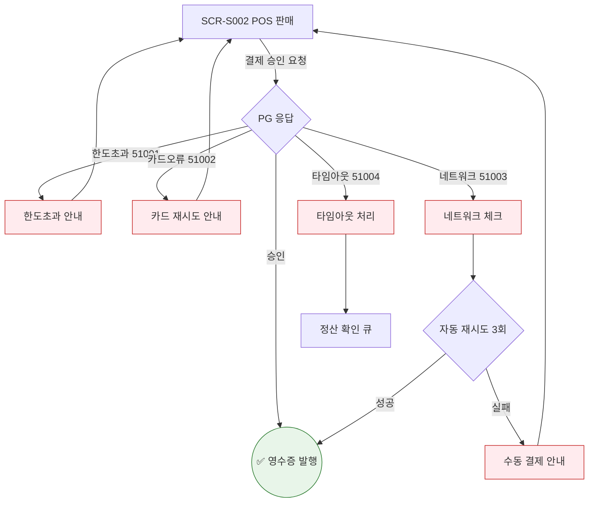
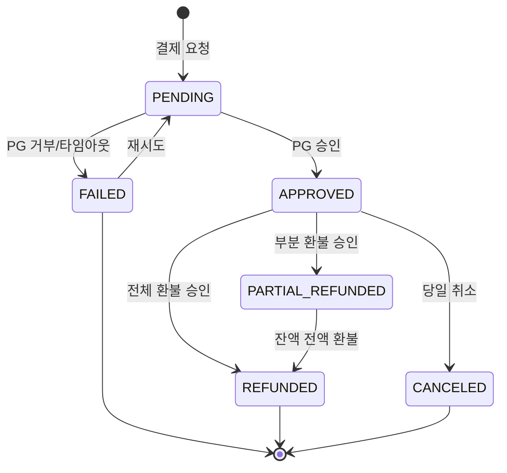
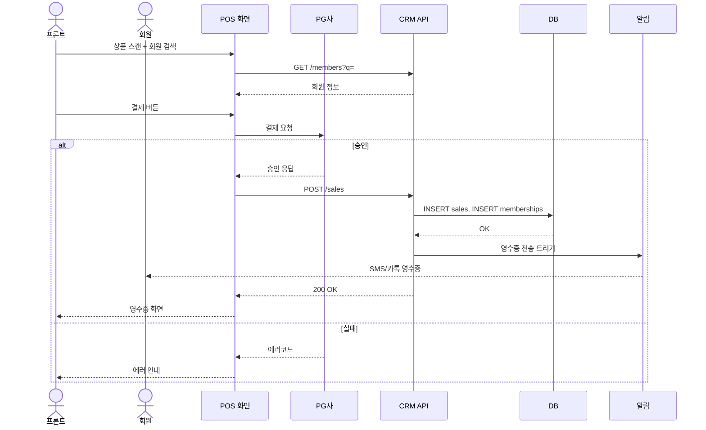

# FitGenie CRM — 유저플로우 기반 Mermaid 다이어그램 마스터 플랜 (TC/QA 원천)

> **문서 버전**: v2.0 (확장판)
> **작성일**: 2026-04-20
> **작성자**: 기획팀
> **목적**: 화면설계서(11개 도메인, SCR 80+개, DLG 60+개, 총 16,146줄)의 **모든** 디스크립션을 유저플로우 관점의 Mermaid 다이어그램으로 전환하여, 이후 **TC(Test Case) 작성 및 QA 검증의 단일 진실 공급원(SSoT)** 으로 활용
> **예상 산출물 규모**: Mermaid 다이어그램 **약 600~900개**, MD 파일 **약 120~150개**

---

## 0. 개정 이력

| 버전 | 일자 | 변경 내용 |
|------|------|-----------|
| v1.0 | 2026-04-20 | 초안 (도메인 11개 수준) |
| **v2.0** | **2026-04-20** | **TC/QA 대응 확장: SCR당 9종 다이어그램, DLG당 전 생명주기, 에러/권한/자동화 카탈로그 추가** |

---

## 1. 배경 및 문제 정의

### 1.1 현황 진단
- 화면설계서는 **정적 텍스트/표** 중심 → 흐름이 안 보임
- 화면 간 이동, 모달 트리거, 상태 전이, 권한 분기, 에러 복구가 **암묵지** 상태
- 이 상태로 TC를 작성하면 **분기 누락**이 필연 → QA 커버리지 미달

### 1.2 왜 다이어그램이 TC의 원천인가
| 다이어그램 요소 | → TC 대응 |
|-----------------|-----------|
| **노드(상태/화면)** | TC 전제조건(Given) |
| **엣지(액션/이벤트)** | TC 행위(When) |
| **분기 라벨(조건)** | TC 입력값/데이터 |
| **종료 노드(결과/토스트)** | TC 기대결과(Then) |
| **에러 분기** | 예외 TC / 네거티브 TC |
| **권한 분기** | RBAC TC |
| **상태 전이** | 상태기반 TC (state-based testing) |
| **subgraph(그룹)** | TC 스위트 단위 |

### 1.3 성공 기준 (클라이언트/QA 수용 조건)
1. 다이어그램만 보고 **모든 TC 케이스 도출 가능**
2. 각 엣지는 **고유 ID**를 갖고 TC ID와 1:N 매핑
3. 모든 화면의 **진입 → 인터랙션 → 모달 → 결과 → 이탈 → 복구**가 끊김 없이 이어짐
4. 🆕 미구현 기능도 **기획 기준**으로 완전히 반영 (TC는 미구현 항목도 검증 대상)
5. GitHub/Notion/VSCode 프리뷰에서 100% 렌더링
6. SCR/DLG ID가 화면설계서와 **비트 단위 일치**

---

## 2. 범위 — 완전판

### 2.1 대상 화면 전수 목록

#### 2.1.1 공통/인증/대시보드 (D1)
- SCR-100 로그인
- SCR-101 대시보드 (통합)
- SCR-102 사이드바/네비게이션
- SCR-103 글로벌 검색
- SCR-104 알림 센터
- SCR-105 프로필/계정
- SCR-106 비밀번호 재설정
- SCR-107 화면설계서 오버레이(📋)
- SCR-108 에러 페이지 (404/500/권한없음)
- SCR-109 로그아웃

#### 2.1.2 회원관리 (D2) — SCR 10 + 15탭 + DLG 30
- SCR-M001 회원 목록
- SCR-M002 회원 등록
- SCR-M003 회원 수정
- SCR-M004 회원 상세 (+ 15개 탭: M004-01~15)
  - 회원정보/이용권/출석이력/결제이력/결제내역/예약내역/상세내역/체성분/상담메모/레슨/신체정보/종합평가/상담이력/운동프로그램/운동이력
- SCR-M005 회원 이관
- SCR-M006 체성분 관리
- SCR-M007 회원 병합 🆕
- SCR-M008 가족 회원 관리 🆕
- SCR-M009 등급 관리 🆕
- SCR-M010 세그먼트 관리 🆕
- DLG-M001~030 (상태변경, 삭제, 홀딩등록, 홀딩해제, 탈퇴, 중복확인, 취소확인, 초기화, 메모추가/삭제, 상담등록/삭제, 환불처리, 결제상세, 체성분등록/덮어쓰기, 목표설정🆕, 연장등록, 양도🆕, 쿠폰적용🆕, 마일리지조정🆕, 수동출석, 이관확인, 종합평가등록, 운동프로그램배정, 운동이력등록, 주소검색, 병합확인🆕, 가족연결🆕, 등급변경🆕)

#### 2.1.3 매출관리 (D3) — SCR 12 + 탭 7 + DLG 다수
- SCR-S001 매출 현황 (7개 서브탭: 매출내역/기간별/상품별/결제수단별/담당자별/환불/미납)
- SCR-S002 POS 판매
- SCR-S003 결제 처리
- SCR-S004 매출 통계
- SCR-S005 통계관리
- SCR-S006 선수익금 조회
- SCR-S007 환불 관리
- SCR-S008 미수금 관리
- SCR-S009 할부 결제 관리 🆕
- SCR-S010 세금계산서 발행 🆕
- SCR-S011 매출 예측 🆕
- SCR-S012 결제 취소/부분환불 🆕
- DLG-S001~ (매출상세, 구매자검색, 결제확인, 환불확인, 세금계산서 발행확인 등)

#### 2.1.4 수업관리 (D4) — SCR 15 + DLG 16+
- SCR-C001 수업/캘린더
- SCR-C002 수업 관리
- SCR-C003 시간표 일괄 등록
- SCR-C004 그룹수업 템플릿 관리
- SCR-C005 그룹수업 현황
- SCR-C006 강사 근무 현황
- SCR-C007 횟수 관리
- SCR-C008 페널티 관리
- SCR-C009 일정 요청 처리
- SCR-C010 운동 프로그램 관리
- SCR-C011 유효 수업 목록
- SCR-C012 대기열 관리 🆕
- SCR-C013 수업 평가/피드백 🆕
- SCR-C014 출석 QR 체크인 🆕
- SCR-C015 수업 녹화 관리 🆕
- DLG-C001~C016 (수업등록/수정, 일정상세, 일괄변경, 수업기록상세, 서명, 노쇼/취소정책, 일괄생성확인, 템플릿등록, 강사상세, 세션상세, 횟수조정, 차감이력, 페널티등록, 자동페널티정책, 대안일정제시 등)

#### 2.1.5 상품관리 (D5) — SCR 8 + DLG
- SCR-P001~P008 (관리, 등록/수정, 상세패널, 할인설정, 카탈로그🆕, 비교🆕, 재고🆕, 시즌가격🆕)
- DLG: 가격이력, 할인적용, 상품복제, 삭제확인 등

#### 2.1.6 시설관리 (D6) — SCR 6
- SCR-050 락커 관리
- SCR-051 사물함 배정 관리
- SCR-052 밴드/카드 관리
- SCR-053 운동룸 관리
- SCR-054 골프 타석 관리
- SCR-055 운동복 관리

#### 2.1.7 직원관리 (D7) — SCR 6
- SCR-060 직원 목록
- SCR-061 직원 등록/수정
- SCR-062 직원 퇴사 처리
- SCR-063 직원 근태 관리
- SCR-064 급여 관리
- SCR-065 급여 명세서

#### 2.1.8 마케팅 (D8) — SCR 6
- SCR-070 리드 관리
- SCR-071 메시지 발송
- SCR-072 자동 알림 설정
- SCR-073 쿠폰 관리
- SCR-074 마일리지 관리
- SCR-075 전자계약

#### 2.1.9 설정관리 (D9) — SCR 7
- SCR-080 센터 설정
- SCR-081 권한 설정
- SCR-082 키오스크 설정
- SCR-083 IoT/출입 관리
- SCR-084 구독/결제 관리
- SCR-085 공지사항 관리
- SCR-086 출석 관리(회원)

#### 2.1.10 본사관리 (D10) — SCR 10
- SCR-090~099 (본사 대시보드, 슈퍼 대시보드, 지점 관리, 지점 성과 리포트, KPI 대시보드, KPI 프리뷰, 온보딩, 감사로그, 오늘의할일, 리포트 생성)

#### 2.1.11 통합운영/IoT/헬스 (D11) — SCR 7
- SCR-I001~I007 (통합 출석, 키오스크 설정, IoT 연동, 옷 락커 운영, 고정물품 락커, 체성분 통합, 회원 건강/연동 요약)

**총계**: SCR 약 **100개** (탭 포함), DLG 약 **80~100개**

---

## 3. 다이어그램 타입 매트릭스 (SCR당 9종 + 보조)

### 3.1 SCR 단위 표준 다이어그램 세트 (9종)

각 SCR은 아래 **9종 다이어그램**을 모두 산출한다. (= SCR 100개 × 9 = **900개** 상한)

| # | 다이어그램 이름 | Mermaid 타입 | 목적 / TC 대응 |
|---|-----------------|:------------:|----------------|
| **F1** | **진입 플로우** | flowchart TD | 어디서 진입 가능한지(사이드바/URL/타화면/알림/검색/딥링크) → 진입 TC |
| **F2** | **메인 인터랙션 플로우** | flowchart TD | 정상 시나리오 Happy Path → 메인 TC |
| **F3** | **버튼/액션 매핑 플로우** | flowchart LR | 모든 버튼 노드화 → 버튼별 동작 TC |
| **F4** | **필터/검색/정렬/페이지네이션 플로우** | flowchart TD | 필터 조합/검색/정렬/페이지 이동 → 쿼리 TC |
| **F5** | **모달 트리거 트리** | flowchart TD | SCR → DLG → 하위 DLG 트리 → 모달 진입 TC |
| **F6** | **상태별 화면 플로우** | flowchart TD | 로딩/빈/에러/권한없음/오프라인/로딩실패 → UI 상태 TC |
| **F7** | **권한(RBAC) 분기 플로우** | flowchart LR | 6개 역할별 접근/액션 가능 범위 → RBAC TC |
| **F8** | **에러/예외/복구 플로우** | flowchart TD | 각 에러코드별 분기, 재시도/로그아웃/리다이렉트 → 네거티브 TC |
| **F9** | **토스트/피드백 플로우** | flowchart TD | 성공/경고/에러/정보 토스트 발생 조건 → 피드백 TC |

### 3.2 DLG 단위 표준 다이어그램 세트 (3종)

각 모달은 아래 **3종**을 산출. (= DLG 80개 × 3 = **240개**)

| # | 다이어그램 | 타입 | 목적 |
|---|-----------|:----:|------|
| **M1** | 모달 생명주기 | flowchart TD | 트리거 → 열림 → 입력 → 검증 → 저장/취소 → 닫힘 |
| **M2** | 필드 검증 플로우 | flowchart TD | 각 필드의 필수/형식/중복/범위 검증 분기 |
| **M3** | 성공/실패 결과 분기 | flowchart TD | API 응답별 토스트/후속 동작/부모 화면 갱신 |

### 3.3 엔티티 상태 전이 다이어그램 (15개 이상)

`stateDiagram-v2` — 상태를 가진 모든 엔티티

| # | 엔티티 | 예상 상태 수 | 소스 |
|---|--------|:----:|------|
| S1 | MemberStatus (회원) | 8 | 상태전이도.md |
| S2 | MembershipStatus (이용권) | 6 | 회원관리 |
| S3 | PaymentStatus (결제) | 7 | 매출관리 |
| S4 | RefundStatus (환불) | 5 | 매출관리 |
| S5 | LessonStatus (수업) | 6 | 수업관리 |
| S6 | ReservationStatus (예약) | 6 | 수업관리 |
| S7 | LeadStatus (리드) | 7 | 마케팅 |
| S8 | EmployeeStatus (직원) | 5 | 직원관리 |
| S9 | ContractStatus (계약) | 6 | 마케팅 |
| S10 | CouponStatus (쿠폰) | 5 | 마케팅 |
| S11 | LockerStatus (락커) | 6 | 시설 |
| S12 | NoticeStatus (공지) | 4 | 설정 |
| S13 | AttendanceStatus (근태) | 5 | 직원 |
| S14 | NotificationStatus (알림) | 4 | 공통 |
| S15 | InvoiceStatus (세금계산서) 🆕 | 5 | 매출 |
| S16 | PenaltyStatus (페널티) | 4 | 수업 |

### 3.4 크로스도메인 시퀀스 다이어그램 (30개 이상)

`sequenceDiagram` — 실제 업무 시나리오

<details>
<summary>30개 시나리오 목록 (펼쳐보기)</summary>

| # | 시나리오 | 액터 |
|---|----------|------|
| X01 | 신규 리드 → 상담 → 가입 → PT 결제 | 리드, FC, 매니저, 시스템 |
| X02 | 회원 재등록 + 이용권 연장 + 쿠폰 적용 | 회원, 매니저 |
| X03 | 수업 노쇼 → 페널티 발생 → 알림 발송 | 강사, 시스템, 회원 |
| X04 | 체성분 측정 → IoT 자동 전송 → FC 알림 | 회원, InBody, FC |
| X05 | POS 결제 → 영수증 → 이용권 자동 개시 | 프론트, 회원 |
| X06 | 환불 요청 → 매니저 승인 → 정산 반영 | 회원, 매니저, 회계 |
| X07 | 락커 만료 임박 → 자동 알림 → 연장 결제 | 회원, 시스템 |
| X08 | 직원 근태 체크인 → 급여 자동 계산 → 명세서 발송 | 직원, 시스템 |
| X09 | 지점 → 본사 KPI 롤업 → 주간 리포트 자동 발행 | 본사, 시스템 |
| X10 | 리드 유입 → 자동 메시지 → 상담 예약 | 리드, 마케팅 자동화 |
| X11 | 회원 탈퇴 → 개인정보 마스킹 → 감사로그 적재 | 회원, 시스템 |
| X12 | 그룹수업 일괄 생성 → 수강 오픈 → 만석 처리 | 매니저, 회원 |
| X13 | 전자계약 발송 → 서명 → 이용권 자동 개시 | 매니저, 회원, 전자계약사 |
| X14 | IoT 밴드 출입 → 출석 기록 → 대시보드 반영 | 회원, IoT, 대시보드 |
| X15 | 공지사항 발행 → 전지점 전파 → 읽음 집계 | 본사, 직원 |
| X16 | 선수익금 이연 → 월말 매출 인식 | 시스템, 회계 |
| X17 | 미수금 발생 → 자동 독촉 → 결제 완료 | 시스템, 회원 |
| X18 | 할부 결제 → 매월 자동승인 → 완료 🆕 | 회원, PG, 시스템 |
| X19 | 회원 이관 → 타지점 승인 → 이력 동기화 | 회원, 원지점, 타지점 |
| X20 | 회원 병합 🆕 → 이력/결제/예약 통합 | 매니저, 시스템 |
| X21 | 홀딩 등록 → 자동 만료일 연장 → 해제 | 회원, 시스템 |
| X22 | 체성분 임계치 초과 → 자동 상담 트리거 | IoT, FC, 매니저 |
| X23 | 키오스크 체크인 → 출입문 개방 → 출석 | 회원, 키오스크, IoT |
| X24 | 급여 지급일 → 자동 명세서 → 직원 수신 | 시스템, 직원 |
| X25 | 쿠폰 발행 → 배포 → 사용 → 만료 회수 | 마케팅, 회원 |
| X26 | 대기열 등록 → 자리 발생 → 자동 배정 🆕 | 회원, 시스템 |
| X27 | 수업 서명 → 횟수 차감 → 이력 기록 | 강사, 회원 |
| X28 | 세금계산서 발행 🆕 → 국세청 전송 → 상태 업데이트 | 매니저, 세금서비스 |
| X29 | 로그인 → 2FA → 세션 생성 → 대시보드 | 사용자, 인증서버 |
| X30 | 알림 센터 클릭 → 해당 화면 이동 → 읽음 처리 | 사용자, 시스템 |

</details>

### 3.5 권한/RBAC 시각화 (8개)

| # | 다이어그램 | 타입 | 대상 |
|---|-----------|:----:|------|
| R1 | 역할 × 화면 매트릭스 | flowchart LR (subgraph) | 전체 |
| R2 | primary 권한 여정 | journey | primary |
| R3 | owner 권한 여정 | journey | owner |
| R4 | manager 권한 여정 | journey | manager |
| R5 | fc 권한 여정 | journey | fc |
| R6 | staff 권한 여정 | journey | staff |
| R7 | readonly 권한 여정 | journey | readonly |
| R8 | 권한 위임/위계 | flowchart TD | primary→owner→manager→... |

### 3.6 IA/네비게이션 (6개)

| # | 다이어그램 | 타입 |
|---|-----------|:----:|
| N1 | 전체 사이트맵 (라우트 67개) | flowchart LR (subgraph 도메인) |
| N2 | 도메인별 사이트맵 (11개) | flowchart LR × 11 |
| N3 | 사이드바 계층 트리 | flowchart TD |
| N4 | 딥링크/URL 패턴 맵 | flowchart LR |
| N5 | 브레드크럼 계층 | flowchart TD |
| N6 | 빈 화면/404/500/권한없음 복귀 경로 | flowchart TD |

### 3.7 자동화/크론/백그라운드 (12개)

시스템이 자동 수행하는 프로세스 — **TC의 "Given 자동화" 상태를 검증하기 위해 필요**

| # | 자동화 프로세스 | 주기 |
|---|----------------|------|
| A1 | 만료 임박 알림 발송 | 매일 00:00 |
| A2 | 휴면 전환 (90일 미방문) | 매일 |
| A3 | 이용권 자동 만료 처리 | 매일 |
| A4 | 홀딩 자동 연장 계산 | 매일 |
| A5 | 자동 페널티 발생 | 이벤트 기반 |
| A6 | 주간/월간 리포트 생성 | 주/월 1회 |
| A7 | 선수익금 월말 인식 | 매월 말 |
| A8 | 할부 자동 승인 🆕 | 매월 지정일 |
| A9 | 근태 집계 → 급여 계산 | 매월 |
| A10 | 공지 읽음률 집계 | 주기적 |
| A11 | 캠페인 자동 발송 | 조건 기반 |
| A12 | 감사로그 아카이빙 | 월별 |

### 3.8 에러/예외 카탈로그 (20개+)

`docs/에러코드정의서.md` 기반으로 **에러코드별 플로우** 개별 다이어그램 — TC 네거티브 케이스 원천

### 3.9 데이터 흐름 (참고, 10개)

`erDiagram` + flowchart — 폼→API→DB→캐시→UI 데이터 파이프라인 (주요 10개 엔티티)

---

## 4. 집계 — 최종 산출물 규모

| 카테고리 | 단위 | 수량 | 다이어그램 수 |
|----------|------|:----:|:----:|
| SCR 표준 9종 세트 | SCR 100개 × 9 | 100 | **900** |
| DLG 표준 3종 세트 | DLG 80개 × 3 | 80 | **240** |
| 엔티티 상태전이 | stateDiagram-v2 | 16 | **16** |
| 크로스도메인 시퀀스 | sequenceDiagram | 30 | **30** |
| 권한/RBAC | 혼합 | 8 | **8** |
| IA/네비게이션 | flowchart | 6 | **6** |
| 자동화/크론 | flowchart | 12 | **12** |
| 에러/예외 | flowchart | 20 | **20** |
| 데이터 흐름 | erDiagram | 10 | **10** |
| **합계** | | | **≈ 1,242개 다이어그램** |

> **현실 조정**: 일부 SCR은 세트 내 일부 다이어그램만 필요할 수 있음 → 실사용 범위 **약 900~1,000개**로 운영.

---

## 5. 파일 구조 — 완전판

```
docs/
  다이어그램/
    README.md                                     # 인덱스 + Mermaid 컨벤션 + TC 매핑 규칙
    00_전체_사이트맵.md                            # N1~N7
    10_권한매트릭스/
      README.md
      10-1_역할화면_매트릭스.md                   # R1
      10-2_primary_journey.md                     # R2
      10-3_owner_journey.md                       # R3
      10-4_manager_journey.md                     # R4
      10-5_fc_journey.md                          # R5
      10-6_staff_journey.md                       # R6
      10-7_readonly_journey.md                    # R7
      10-8_권한위계.md                             # R8
    20_상태전이도/
      README.md
      20-01_MemberStatus.md
      20-02_MembershipStatus.md
      20-03_PaymentStatus.md
      20-04_RefundStatus.md
      20-05_LessonStatus.md
      20-06_ReservationStatus.md
      20-07_LeadStatus.md
      20-08_EmployeeStatus.md
      20-09_ContractStatus.md
      20-10_CouponStatus.md
      20-11_LockerStatus.md
      20-12_NoticeStatus.md
      20-13_AttendanceStatus.md
      20-14_NotificationStatus.md
      20-15_InvoiceStatus.md
      20-16_PenaltyStatus.md
    30_시나리오_시퀀스/
      README.md
      30-01_신규가입_PT결제.md
      30-02_재등록_연장_쿠폰.md
      ... (X01~X33)
    40_자동화_크론/
      README.md
      40-01_만료임박_알림.md
      ... (A1~A12)
    50_에러_예외/
      README.md
      50-01_인증실패.md
      50-02_권한없음.md
      50-03_결제실패.md
      ... (에러코드 기준)
    60_데이터흐름/
      README.md
      60-01_회원_데이터흐름.md
      ... (엔티티 10개)
    D01_공통/
      README.md
      SCR-100_로그인/
        F1_진입.md
        F2_메인.md
        F3_버튼액션.md
        F4_필터.md
        F5_모달트리거.md
        F6_상태별.md
        F7_권한.md
        F8_에러.md
        F9_토스트.md
      SCR-101_대시보드/ ...
      ... (SCR-100~109)
      DLG/
        DLG-000_세션만료/
          M1_생명주기.md
          M2_필드검증.md
          M3_결과분기.md
    D02_회원관리/
      README.md
      SCR-M001_회원목록/ (F1~F9)
      SCR-M002_회원등록/ (F1~F9)
      ...
      SCR-M004_회원상세/
        README.md
        (상세 전용 9종)
        Tab01_회원정보/ (F2, F6, F7)
        Tab02_이용권/ (F2, F3, F5, F6, F7)
        ... (15개 탭)
      DLG/
        DLG-M001_상태변경/ (M1~M3)
        ... (DLG-M001~M030)
    D03_매출관리/
    D04_수업관리/
    D05_상품관리/
    D06_시설관리/
    D07_직원관리/
    D08_마케팅/
    D09_설정관리/
    D10_본사관리/
    D11_통합운영/
    99_TC_매핑/
      README.md
      TC_트레이서빌리티_매트릭스.csv           # 엣지ID → TC ID 매핑
      TC_커버리지_리포트.md
```

**예상 파일 수**: 약 **120~150개 MD 파일**

---

## 6. 다이어그램 작성 규칙 (TC 호환)

### 6.1 노드/엣지 ID 체계 (필수)

TC와 매핑 가능하도록 **모든 엣지에 ID 부여**.

```
노드 ID 패턴: {SCR|DLG|STATE|ACTION}_{도메인}_{번호}
예: SCR_M001, DLG_M006, STATE_ACTIVE, ACTION_SAVE

엣지 ID 패턴: E_{출발노드}_{도착노드}_{번호}
예: E_SCR_M001_SCR_M002_01

라벨 규칙:
- 엣지: |사용자액션 [조건]|
- 예: |저장 클릭 [필수필드 충족]|
```

### 6.2 스타일 클래스 (전 파일 통일)

```
classDef screen       fill:#E3F2FD,stroke:#1976D2,color:#0D47A1
classDef modal        fill:#FFF3E0,stroke:#F57C00,color:#E65100
classDef newFeature   fill:#F3E5F5,stroke:#9C27B0,stroke-dasharray:5 5
classDef error        fill:#FFEBEE,stroke:#C62828,color:#B71C1C
classDef success      fill:#E8F5E9,stroke:#2E7D32,color:#1B5E20
classDef warning      fill:#FFF8E1,stroke:#F9A825,color:#F57F17
classDef info         fill:#E0F7FA,stroke:#00838F
classDef system       fill:#EDE7F6,stroke:#5E35B2
classDef external     fill:#ECEFF1,stroke:#455A64,stroke-dasharray:3 3
classDef cron         fill:#E0F2F1,stroke:#00695C
classDef rbacBlocked  fill:#F5F5F5,stroke:#9E9E9E,color:#616161
```

### 6.3 다이어그램 헤더 메타데이터 (MD 파일 최상단 필수)

```markdown
---
diagramId: F2_SCR-M002
title: 회원 등록 메인 인터랙션 플로우
type: flowchart
scope: SCR-M002
dependencies: [DLG-M006, DLG-M027]
actors: [manager, staff]
tcMappings: [TC-M002-01, TC-M002-02, TC-M002-05]
lastUpdated: 2026-04-20
---
```

### 6.4 분기 규칙 (TC 네거티브 케이스 원천)

**모든** 액션 노드는 최소 3갈래로 분기:
- ✅ **성공 분기** — 정상 결과
- ❌ **검증 실패 분기** — 입력값/권한/상태 검증 실패
- ⚠️ **시스템 에러 분기** — API/네트워크/타임아웃

### 6.5 누락 금지 요소 (QA 체크 대상)

SCR 다이어그램 세트에 **반드시 포함**:

- [ ] 진입 출처 5종 이상 (사이드바/URL/타화면링크/알림/검색/대시보드위젯/딥링크)
- [ ] 초기 로딩 → 데이터 로드 → 빈/정상 분기
- [ ] 권한 검증 → 6개 역할별 분기
- [ ] 모든 버튼 노드화 (와이어프레임의 버튼 수와 일치)
- [ ] 모든 모달 트리거 경로
- [ ] 필터/검색/정렬/페이지네이션 각 액션
- [ ] 상태별 화면 분기 (빈/로딩/에러/권한없음/오프라인)
- [ ] 에러 분기 (에러코드 정의서 참조)
- [ ] 토스트 4종 (성공/경고/에러/정보)
- [ ] 키보드 단축키 동작
- [ ] 이탈 경로 (뒤로가기/다른 화면/로그아웃/세션만료)
- [ ] 🆕 미구현 기능은 점선 보라 스타일

---

## 7. TC 매핑 규칙 (핵심)

### 7.1 엣지 → TC 1:N 매핑

| 다이어그램 요소 | TC 필드 |
|-----------------|---------|
| 출발 노드(전제상태) | TC.given |
| 엣지 라벨(액션/조건) | TC.when |
| 분기 조건값 | TC.testData |
| 도착 노드/토스트 | TC.expected |
| 엣지 ID | TC.traceId (양방향 추적) |

### 7.2 TC 트레이서빌리티 매트릭스 (99_TC_매핑)

`TC_트레이서빌리티_매트릭스.csv` 스키마:

```csv
edgeId, diagramId, fromNode, toNode, label, tcId, tcType, priority, automated
E_SCR_M002_DLG_M006_01, F2_SCR-M002, SCR_M002, DLG_M006, "저장 [중복]", TC-M002-05, negative, P1, Y
E_SCR_M002_Toast_OK_01, F2_SCR-M002, Valid_OK, Toast_Success, "", TC-M002-01, positive, P0, Y
```

### 7.3 TC 커버리지 공식

```
TC 커버리지 = (매핑된 엣지 수 / 전체 엣지 수) × 100
목표: ≥ 95%
```

### 7.4 자동 검증 스크립트 (부록 C)

`scripts/verify-diagram-tc-mapping.js` — 모든 `.md` 파일의 Mermaid 블록 파싱 → 엣지 추출 → CSV 대조 → 미매핑 엣지 리포트

---

## 8. 단계별 작성 워크플로우 (3~4주)

### Phase 1 — 규칙/샘플 확립 (2일)
- [ ] 디렉토리 구조 생성
- [ ] `README.md` 작성 (전체 인덱스, 컨벤션, TC 매핑 규칙)
- [ ] **레퍼런스 샘플** 작성: SCR-M002 회원등록의 9종 세트 + DLG-M006의 3종 세트 → 클라이언트 사전 리뷰
- [ ] classDef 템플릿 확정
- [ ] GitHub 프리뷰 검증

### Phase 2 — 공통 기반 (3일)
- [ ] IA 다이어그램 N1~N7 (7개)
- [ ] 권한 다이어그램 R1~R8 (8개)
- [ ] 상태전이도 S1~S17 (17개)
- [ ] 자동화/크론 A1~A12 (12개)
- [ ] 에러/예외 카탈로그 (약 20개)
- [ ] 데이터 흐름 (10개)
  - **소계**: 약 72개

### Phase 3 — SCR 표준 9종 세트 (12일, 병렬 가능)
> 도메인당 평균 1.5~2일

| Day | 도메인 | SCR 수 | 예상 다이어그램 |
|-----|--------|:------:|:------:|
| D1~2 | D1 공통 + D2 회원관리(목록/등록/수정) | 10 + 3 | 117 |
| D3~4 | D2 회원관리(상세 15탭 포함) + 회원기타 | 15 + 6 | 189 |
| D5~6 | D4 수업관리 | 15 | 135 |
| D7 | D3 매출관리 | 12 | 108 |
| D8 | D5 상품 + D6 시설 | 8 + 6 | 126 |
| D9 | D7 직원 + D8 마케팅 | 6 + 6 | 108 |
| D10 | D9 설정 + D10 본사 | 7 + 10 | 153 |
| D11 | D11 통합운영(IoT/헬스) | 7 | 63 |
| D12 | 버퍼 / 보강 | - | - |

**소계**: 약 **900개**

### Phase 4 — DLG 세트 3종 (4일)
- DLG 약 80개 × 3 = **240개**
- 도메인별로 병렬 작성

### Phase 5 — 크로스도메인 시나리오 (3일)
- 시퀀스 다이어그램 X01~X33 (33개)
- 각 시나리오는 참여 SCR 링크 포함

### Phase 6 — TC 매핑 (3일)
- 모든 엣지에 ID 부여
- TC_트레이서빌리티_매트릭스.csv 초안 작성
- 자동 검증 스크립트 구동
- 커버리지 95% 달성 확인

### Phase 7 — 검증 및 납품 (2일)
- 최종 렌더링 검증 (GitHub/Notion/VSCode)
- 파일 구조 일관성 체크
- 클라이언트 최종 리뷰
- 피드백 반영

**총 예상 기간: 약 29일 (영업일 기준 ≈ 6주)**
**단축 시나리오**: 2~3명 병렬 작업 시 **약 3주**

---

## 9. 품질 체크리스트 (Phase 7 전수)

### 9.1 구조
- [ ] 전 도메인 디렉토리 존재 (D01~D11)
- [ ] SCR당 9종 파일 존재 (누락된 건 사유 명시)
- [ ] DLG당 3종 파일 존재
- [ ] 공통(00/10/20/30/40/50/60/99) 디렉토리 모두 채워짐
- [ ] 각 파일 최상단 메타데이터 헤더 존재

### 9.2 일관성
- [ ] 모든 SCR/DLG ID가 화면설계서 원본과 완전 일치 (grep 자동 검증)
- [ ] 노드 ID 규칙(SCR_/DLG_/STATE_/ACTION_) 일관 적용
- [ ] classDef가 전 파일 공통
- [ ] 🆕 미구현 기능은 점선 보라
- [ ] 엣지 ID가 모든 엣지에 부여됨

### 9.3 렌더링
- [ ] GitHub 프리뷰 전수 통과
- [ ] VSCode Mermaid Preview 에러 0건
- [ ] 노드 30개 초과 다이어그램 없음 (있으면 분할됨)

### 9.4 TC 호환성
- [ ] TC 트레이서빌리티 매트릭스 커버리지 ≥ 95%
- [ ] 네거티브 엣지(실패/에러) 비율 ≥ 30%
- [ ] 모든 권한 역할(6개) 최소 1회 이상 노드에 등장
- [ ] 자동화 프로세스(A1~A12) 각 SCR에서 참조 링크로 연결

### 9.5 내용 (클라이언트 관점)
- [ ] 화면설계서만 보고 다이어그램 찾기 가능 (상호 링크)
- [ ] 다이어그램만 보고 TC 도출 가능
- [ ] 모든 주요 모달 트리거 출발점이 명시됨
- [ ] 성공/실패/에러 분기 명시
- [ ] 토스트/리다이렉트가 종료 노드로 표현됨

---

## 10. 리스크 및 완화책

| 리스크 | 영향 | 확률 | 완화 방안 |
|--------|:---:|:---:|-----------|
| 다이어그램 1,000개 규모 압도 | 高 | 高 | 병렬 작업 + Phase 1 샘플로 템플릿 재사용 + AI 보조 생성 |
| 노드 폭발로 가독성 저하 | 高 | 高 | 30노드 룰 + 시나리오 분할 + subgraph + 상세는 별도 다이어그램 |
| SCR/DLG ID 불일치 | 高 | 中 | Phase 7에 grep 자동 검증 스크립트 |
| Mermaid 버전 호환 이슈 | 中 | 低 | v10.x 기준 Phase 1에서 사전 테스트 |
| TC 매핑 커버리지 미달 | 高 | 中 | 엣지 ID 강제 + 자동 검증 + Phase 6 전담 |
| 🆕 미구현 기능 설계 모호 | 中 | 中 | 점선 표기 + "기획 초안" 주석 + 기능명세서 기반 |
| 도메인 간 중복 시나리오 | 低 | 高 | 크로스도메인 섹션으로 일원화 |
| 클라이언트 추가 요구 | 中 | 高 | Phase 7 후 1주 예비 버퍼 |
| 퍼블/개발 진행과 동기화 실패 | 高 | 中 | 주 1회 sync 미팅 + 변경점 diff 문서 |
| 문서만 방대하고 실제 TC 작성 안 됨 | 高 | 中 | Phase 6의 자동 매핑 스크립트로 강제 |

---

## 11. 산출물 샘플 (레퍼런스)

### 11.1 F2 메인 인터랙션 — SCR-M002 회원 등록



**→ 도출 TC 예시**
| TC ID | 타입 | Given | When | Then |
|-------|:----:|-------|------|------|
| TC-M002-01 | P0 positive | 매니저 로그인, 회원 목록 | 신규 회원 정보 입력 후 저장 | 200 OK, 토스트 "등록 완료", 상세 페이지로 이동 |
| TC-M002-02 | P0 negative | readonly 로그인 | 회원 추가 버튼 클릭 | 권한없음 토스트, 페이지 이동 안 됨 |
| TC-M002-05 | P1 negative | 매니저, 이미 등록된 연락처 | 동일 연락처로 저장 시도 | DLG-M006 모달 표시 |
| TC-M002-08 | P2 exception | API 500 응답 | 저장 시도 | 에러 토스트, 폼 데이터 유지 |

### 11.2 F8 에러/예외 — SCR-S002 POS 판매



### 11.3 S3 PaymentStatus 상태전이



### 11.4 X05 시퀀스 — POS 결제 → 이용권 자동 개시



---

## 12. 다음 액션 (승인 후 즉시 착수)

1. **이 계획서 클라이언트 리뷰** → 범위/우선순위 확정
2. **Phase 1 샘플 1세트 작성** (SCR-M002 9종 + DLG-M006 3종) → 사전 리뷰
3. 샘플 승인 후 Phase 2~7 본격 진행
4. 주 1회 진행 리뷰 + diff 보고
5. Phase 6에서 **TC 매트릭스 인계** → QA팀 TC 작성 착수

---

## 부록 A. 참조 문서 전수

| 문서 | 경로 | 활용 섹션 |
|------|------|-----------|
| 화면설계서 11개 | `docs/화면설계서/*.md` | SCR/DLG 원천 |
| 기능명세서 11개 | `docs/기능명세서/*.md` | 비즈니스 규칙 |
| 상태전이도 | `docs/상태전이도.md` | 20 상태전이 |
| 슈퍼관리자 유저케이스 | `docs/슈퍼관리자_유저케이스_유저플로우.md` | UC-001~045 |
| 시스템 모듈 정의서 | `docs/시스템_모듈_정의서.md` | 도메인 경계 |
| 에러코드 정의서 | `docs/에러코드정의서.md` | 50 에러 카탈로그 |
| KPI 정의서 | `docs/KPI_정의서.md` | 대시보드 지표 |
| 회원앱 기획 | `docs/회원앱/**` | D11 통합운영 |
| 상태전이도(신) | `docs/상태전이도.md` | 20 상태 |

## 부록 B. Mermaid 치트시트

```
flowchart TD | LR | BT | RL
stateDiagram-v2
sequenceDiagram
  participant A
  A->>B: 요청
  B-->>A: 응답
  Note over A,B: 메모
  alt 조건
    A->>B: ...
  else
    A->>B: ...
  end
  loop N회
    A->>B: ...
  end
journey
  title 제목
  section 섹션
    태스크: 5: 액터

erDiagram
  회원 ||--o{ 이용권 : 보유
  이용권 ||--o{ 결제 : 연결

노드 모양:
  [사각]  (둥근)  ([스타디움])  ((원))  {다이아}  {{육각}}  [[서브루틴]]
  [/평행사변형/]  [\평행사변형\]  [/사다리꼴\]

엣지:
  -->  ---  -.->  ==>  -- 라벨 -->  -.라벨.->  ==라벨==>

스타일:
  classDef name fill:#hex,stroke:#hex,stroke-dasharray:5 5
  class Node1,Node2 name
  style Node1 fill:#hex
```

## 부록 C. 자동 검증 스크립트 명세

### C.1 `scripts/verify-diagram-tc-mapping.js`
- 입력: `docs/다이어그램/**/*.md`, `99_TC_매핑/TC_트레이서빌리티_매트릭스.csv`
- 처리:
  1. Mermaid 블록 전수 파싱
  2. 엣지 ID 추출 (`E_xxx_xxx_xx` 정규식)
  3. CSV와 대조
  4. 미매핑 엣지, 누락 헤더, 존재하지 않는 노드 참조 리포트
- 출력: `docs/다이어그램/99_TC_매핑/검증리포트.md`

### C.2 `scripts/verify-scr-dlg-consistency.js`
- 입력: 화면설계서 원본 + 다이어그램 MD
- 처리: SCR/DLG ID grep 후 교차 대조
- 출력: 불일치 리포트

### C.3 `scripts/diagram-coverage.js`
- SCR 100개 × 9종 = 900 슬롯 중 채워진 비율 리포트

---

## 부록 D. 우선순위 제안 (클라이언트 협의용)

범위가 크므로 단계적 납품이 현실적. 우선순위는 **QA 리스크 × 사용 빈도**:

| 우선순위 | 범위 | 근거 |
|----------|------|------|
| **P0 (1주차)** | D2 회원관리 전체 + D3 매출관리(POS/결제/환불) + 상태전이 16개 | 회원/결제는 핵심 수익 흐름 — 불량시 치명 |
| **P1 (2주차)** | D4 수업관리 + D8 마케팅(리드/쿠폰) + 권한 매트릭스 | 운영 빈도 높음 |
| **P2 (3주차)** | D1 공통 + D5 상품 + D6 시설 + D7 직원 + 자동화/에러 | 보조 기능 |
| **P3 (4주차)** | D9 설정 + D10 본사 + D11 통합운영 + TC 매핑 완성 | 관리자/본사 기능 |

**문서 끝.**
