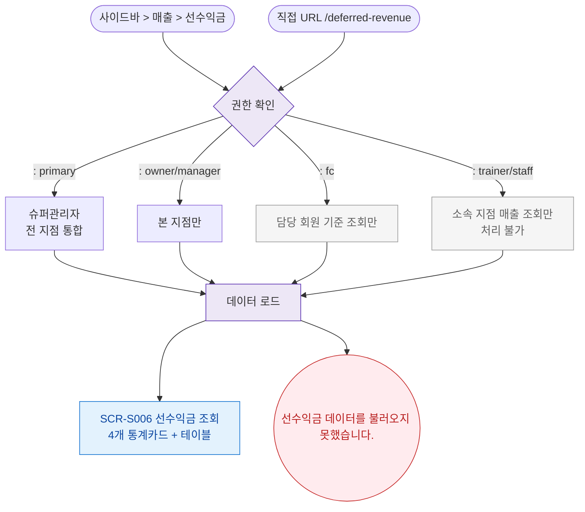

## 1. 목적
SCR-S006 선수익금 조회 화면의 진입 경로와 권한 분기를 표현한다.

## 2. 전제조건
- 로그인 완료

## 3. 다이어그램

## 4. 엣지 설명

| 출발 | 도착 | 설명 |
|------|------|------|
| AUTH | FC_LIMITED | FC 담당 회원 기준 조회 |
| AUTH | READ_ONLY | 트레이너/스태프 조회만 |
