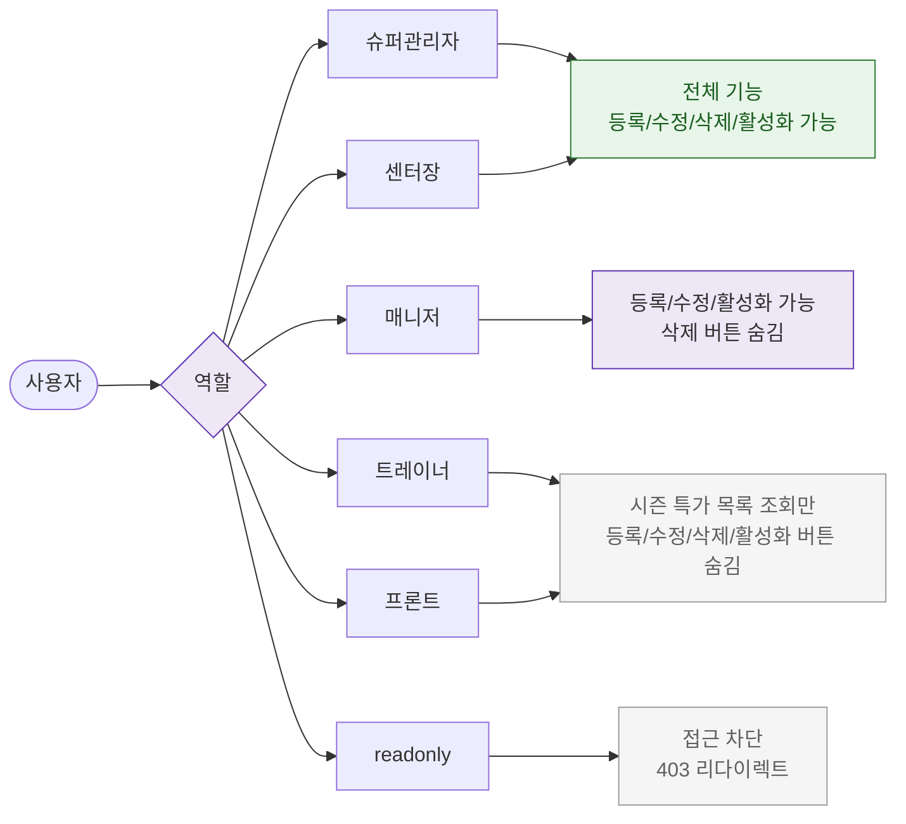

# F7 권한(RBAC) 분기 플로우 — SCR-P008 시즌 가격 관리 🆕

## 다이어그램

## TC 후보

| TC ID | 타입 | Given | When | Then |
|-------|------|-------|------|------|
| TC-P008-F7-01 | positive | manager | 시즌 가격 관리 진입 | 등록/수정 가능, 삭제 버튼 숨김 |
| TC-P008-F7-02 | positive | front | 시즌 가격 관리 진입 | 시즌 특가 목록 조회만 가능, 등록/수정/삭제/활성화 버튼 숨김 |
