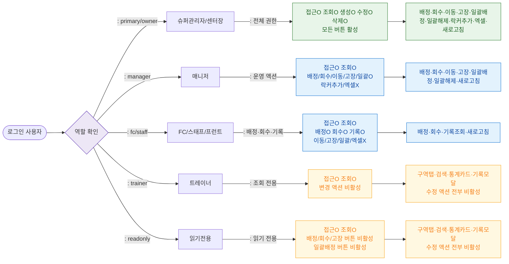

# F7 권한(RBAC) 분기 플로우 — SCR-050 락커 관리

## 1. 목적
7개 기본 역할별 접근 가능 범위와 버튼 활성화 조건을 정의한다.

## 2. 전제조건
- 로그인 상태, /locker 접근 시도

## 3. 다이어그램

## 4. 엣지 설명

| 역할 | 접근 수준 |
|------|-----------|
| primary/owner | 전체 CRUD + 락커추가 |
| manager | 배정·회수·이동·고장·일괄 가능, 락커추가·엑셀 불가 |
| fc/staff/front | 배정·회수·기록 조회, 이동·고장·일괄·엑셀 불가 |
| trainer | 조회만, 수정 버튼 비활성 |
| readonly | 조회만, 수정 버튼 비활성 |
