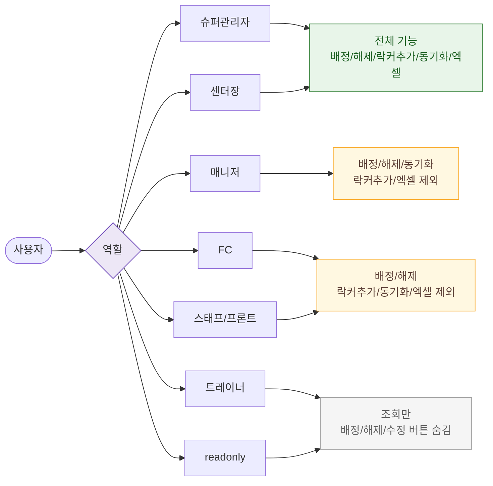

# F7 권한(RBAC) 분기 플로우 — SCR-051 사물함 배정 관리

## 다이어그램

## TC 후보

| TC ID | 타입 | Given | When | Then |
|-------|------|-------|------|------|
| TC-051-005 | negative | trainer | 배정하기 버튼 클릭 | 버튼 숨김, 조회만 가능 |
| TC-051-006 | positive | fc/staff/front | 배정/해제 처리 | 성공, 락커추가·동기화·엑셀 버튼 숨김 |
