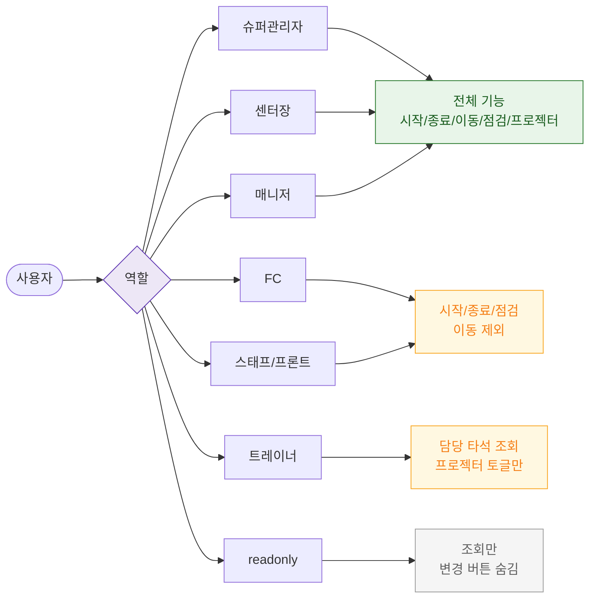

# F7 권한(RBAC) 분기 플로우 — SCR-054 골프 타석 관리

## 다이어그램

## TC 후보

| TC ID | 타입 | Given | When | Then |
|-------|------|-------|------|------|
| TC-054-F7-001 | positive | trainer | 담당 타석 진입 | 담당 타석 현황 조회, 프로젝터 토글만 가능 |
