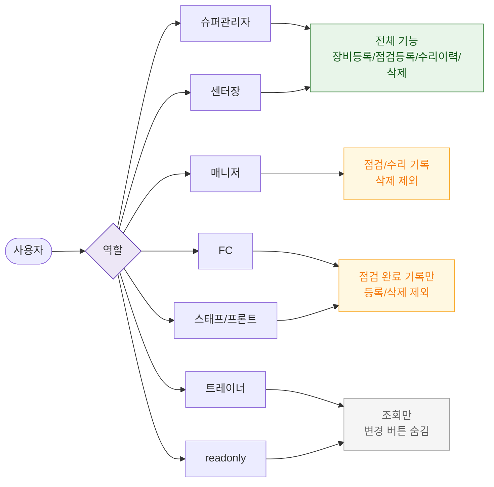

# F7 권한(RBAC) 분기 플로우 — SCR-056 장비 점검 일정 🆕

## 다이어그램

## TC 후보

| TC ID | 타입 | Given | When | Then |
|-------|------|-------|------|------|
| TC-056-F7-001 | positive | trainer | SCR-056 진입 | 현황 조회만 가능, 점검/수리/등록/삭제 버튼 숨김 |
