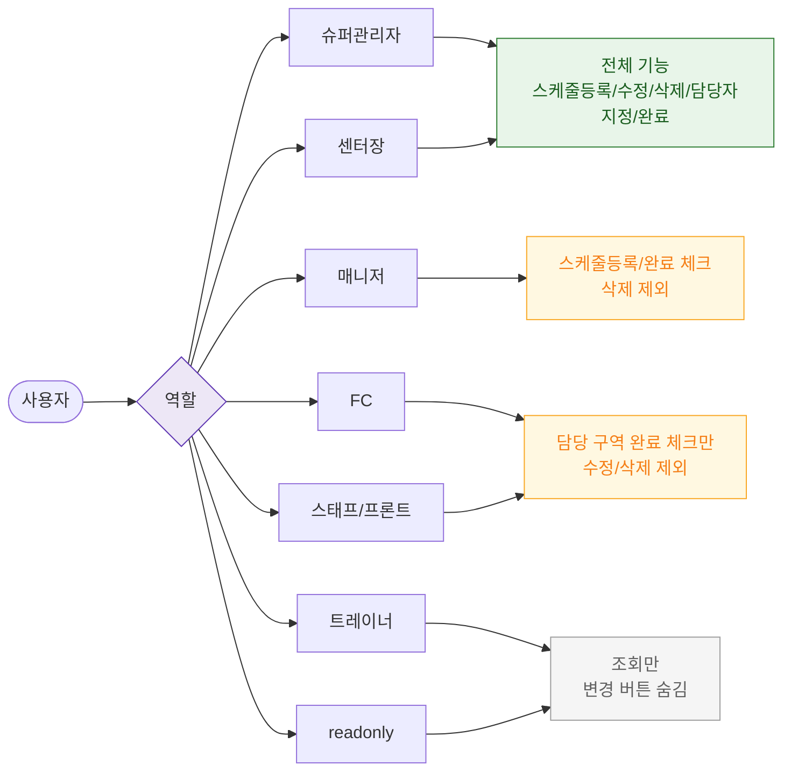

# F7 권한(RBAC) 분기 플로우 — SCR-058 청소 스케줄 🆕

## 다이어그램

## TC 후보

| TC ID | 타입 | Given | When | Then |
|-------|------|-------|------|------|
| TC-058-F7-001 | positive | trainer | SCR-058 진입 | 청소 현황 조회만 가능, 완료/등록/수정/삭제 버튼 숨김 |
