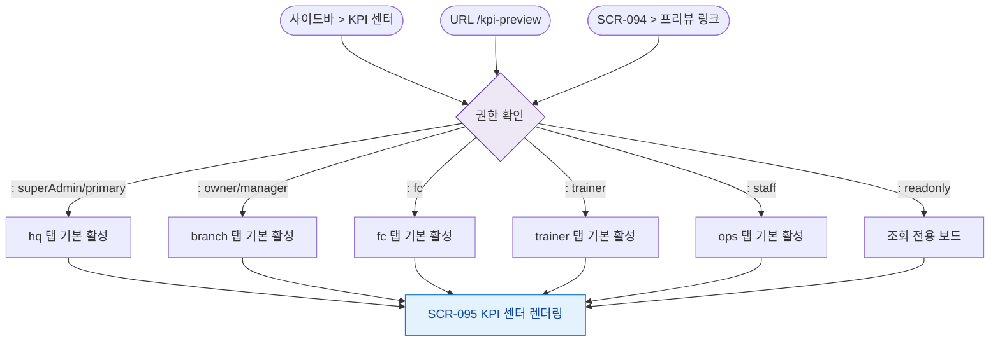

# F1 진입 플로우 — SCR-095 KPI 센터

## TC 후보

| TC ID | 타입 | Given | When | Then |
|-------|:----:|-------|------|------|
| TC-095-F1-001 | P0 positive | primary | /kpi-preview | hq 탭 기본 활성 |
| TC-095-F1-002 | P1 positive | fc | /kpi-preview | fc 탭 기본 활성 |
| TC-095-F1-003 | P1 positive | trainer | /kpi-preview | trainer 탭 기본 활성 |
