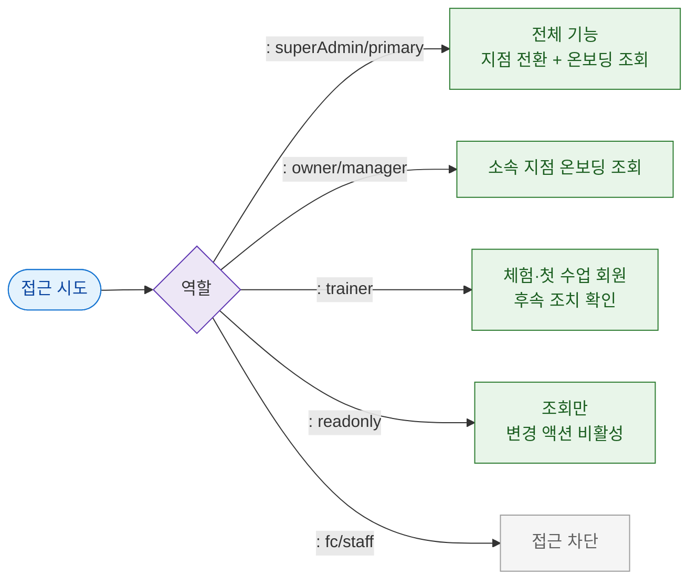

# F7 권한(RBAC) 분기 플로우 — SCR-096 온보딩 대시보드

## TC 후보

| TC ID | 타입 | Given | When | Then |
|-------|:----:|-------|------|------|
| TC-096-F7-001 | P0 positive | manager | /onboarding | 소속 지점 온보딩 현황 조회 |
| TC-096-F7-002 | P1 positive | trainer | /onboarding | 체험·첫 수업 회원 후속 조치 확인 |
