# FitGenie CRM — 슈퍼관리자 유저케이스 & 유저플로우

> **문서 버전**: v1.0  
> **작성일**: 2026-04-10  
> **대상 사용자**: 슈퍼관리자 (본사 운영 총괄)  
> **문서 목적**: 슈퍼관리자가 시스템에서 수행하는 모든 업무 시나리오와 화면 흐름을 정의  
> **범위**: 현재 기능 + 향후 필요 기능(🆕 표시)

---

## 1. 사용자 페르소나

### 슈퍼관리자 — "김본부장"

| 항목 | 내용 |
|------|------|
| **직책** | 본사 운영총괄 본부장 |
| **책임** | 전 지점 경영 성과 관리, 지점 신규 오픈/폐점, 인력 운영, 정책 수립 |
| **일상 업무** | 전 지점 매출·회원 현황 점검, 부진 지점 원인 파악, 직원 인사 관리, 월말 정산 |
| **핵심 니즈** | "한눈에 전 지점 상황을 파악하고, 이상 징후를 즉시 감지하고 싶다" |
| **Pain Point** | 지점마다 따로 로그인해서 확인하는 게 번거롭다, 지점 간 비교가 어렵다 |
| **IT 숙련도** | 중상 — 엑셀·ERP 사용 경험 풍부, 별도 교육 없이 새 시스템 적응 가능 |

---

## 2. 역할 권한 요약

슈퍼관리자는 **시스템 내 최상위 권한**을 가지며, 모든 지점·모든 메뉴에 제한 없이 접근할 수 있습니다.

| 구분 | 슈퍼관리자 | 최고관리자 | 센터장 | 매니저 | 코치 | 스태프 |
|------|:---:|:---:|:---:|:---:|:---:|:---:|
| 전 지점 통합 조회 | ○ | — | — | — | — | — |
| 지점 간 전환 | ○ | — | — | — | — | — |
| 지점 생성/폐점 | ○ | ○ | — | — | — | — |
| 지점 비교 리포트 | ○ | — | — | — | — | — |
| 감사 로그 | ○ | ○ | ○ | — | — | — |
| 구독/과금 관리 | ○ | ○ | — | — | — | — |
| 회원 삭제 | ○ | ○ | ○ | — | — | — |
| 환불 처리 | ○ | ○ | ○ | — | — | — |
| 급여 관리 | ○ | ○ | ○ | — | — | — |
| 상품 등록/수정 | ○ | ○ | ○ | — | — | — |
| 권한/설정 변경 | ○ | ○ | ○ | — | — | — |
| 메시지/쿠폰 | ○ | ○ | ○ | ○ | — | — |
| 회원 조회/수정 | ○ | ○ | ○ | ○ | ○ | ○ |

---

## 3. 메뉴 구조 (슈퍼관리자 시점)

슈퍼관리자 로그인 시 사이드바는 **"본사 관리"** 전용 섹션이 최상단에 추가되고, 그 아래 일반 메뉴가 모두 표시됩니다.

```
┌─────────────────────────────────┐
│  FitGenie CRM                   │
├─────────────────────────────────┤
│  지점 전환 [드롭다운 ▾]          │
│  ┌ 전체 지점 (통합)             │
│  ├ 강남점                       │
│  ├ 홍대점                       │
│  └ 분당점                       │
├─────────────────────────────────┤
│  ■ 본사 관리                    │
│    통합 대시보드                 │
│    지점 관리                    │
│    지점 비교 리포트              │
│    전체 직원 관리               │
│    감사 로그                    │
│    구독 관리                    │
│  ─────────────────              │
│  ■ 대시보드                     │
│  ■ KPI 센터                    │
│  ■ Today Tasks                 │
│  ■ 회원 ▸                      │
│  ■ 수업/캘린더 ▸                │
│  ■ 매출 ▸                      │
│  ■ 상품 ▸                      │
│  ■ 시설 ▸                      │
│  ■ 급여 ▸                      │
│  ■ 영업/마케팅 ▸                │
│  ■ 설정 ▸                      │
│  ■ 공지사항                     │
├─────────────────────────────────┤
│  [본사] 김본부장                 │
│  슈퍼관리자                     │
│  [로그아웃]                     │
└─────────────────────────────────┘
```

---

## 4. 유저케이스 상세

---

### UC-001. 로그인

| 항목 | 내용 |
|------|------|
| **목적** | 시스템에 접속하여 본사 관리 업무를 시작한다 |
| **선행 조건** | 슈퍼관리자 계정이 사전에 등록되어 있어야 한다 |
| **결과** | 로그인 성공 시 대시보드 화면으로 이동, 사이드바에 본사 관리 메뉴 노출 |

**정상 시나리오**:
1. 로그인 화면에서 이메일과 비밀번호를 입력한다
2. [로그인] 버튼을 누른다
3. 인증 성공 → 대시보드(/) 화면으로 이동한다
4. 사이드바 상단에 "지점 전환" 드롭다운과 "본사 관리" 메뉴가 나타난다
5. 하단 프로필 영역에 `[본사] 김본부장 / 슈퍼관리자` 로 표시된다

**예외 시나리오**:
- 비밀번호 오류 → "이메일 또는 비밀번호가 올바르지 않습니다" 안내
- 5회 연속 실패 → 🆕 계정 잠금 + "본사 IT팀에 문의하세요" 안내
- 세션 만료 → 자동으로 로그인 화면으로 이동

---

### UC-002. 지점 전환

| 항목 | 내용 |
|------|------|
| **목적** | 특정 지점의 데이터만 따로 확인하거나, 다시 전체 지점 통합 뷰로 돌아온다 |
| **선행 조건** | 슈퍼관리자로 로그인된 상태 |
| **결과** | 선택한 지점의 데이터 기준으로 모든 화면이 갱신된다 |

**정상 시나리오**:
1. 사이드바 상단 "지점 전환" 드롭다운을 클릭한다
2. 등록된 전체 지점 목록이 나타난다 (최상단에 "전체 지점 (통합)")
3. 원하는 지점을 선택한다 (예: "강남점")
4. 화면 하단 토스트: "강남점으로 전환되었습니다"
5. 현재 보고 있는 페이지의 데이터가 강남점 기준으로 새로고침된다

**예외 시나리오**:
- 폐점 상태 지점 선택 → 🆕 "폐점된 지점입니다. 조회만 가능합니다" 안내

**🆕 개선 사항**:
- 최근 접속 지점 3개를 드롭다운 상단에 "최근" 영역으로 노출
- 지점 검색 기능 (지점 수가 10개 이상일 때 유용)

---

### UC-003. 통합 대시보드 조회

| 항목 | 내용 |
|------|------|
| **목적** | 전 지점의 핵심 경영 지표를 한눈에 파악한다 |
| **화면** | 본사 관리 > 통합 대시보드 |
| **선행 조건** | 지점이 1개 이상 등록되어 있어야 한다 |

**화면 구성**:

```
┌──────────────────────────────────────────────────────────────┐
│  통합 대시보드                     갱신: 09:32  [↻ 새로고침]  │
│  전체 지점 현황을 한눈에 확인하세요   [슈퍼관리자 모드]        │
├──────────────────────────────────────────────────────────────┤
│                                                              │
│  ┌──────────┐ ┌──────────┐ ┌──────────┐ ┌──────────┐       │
│  │ 전체 회원 │ │ 전체 매출 │ │ 오늘 출석 │ │ 전체 직원 │       │
│  │  1,247명  │ │ 8,420만원 │ │   183명   │ │   32명   │       │
│  │ ▲ +4%    │ │ ▲ +12%   │ │ ▼ -3%    │ │  변동없음 │       │
│  └──────────┘ └──────────┘ └──────────┘ └──────────┘       │
│                                                              │
│  ┌──────────┐ ┌──────────┐ ┌──────────┐                    │
│  │신규 회원  │ │만료 예정  │ │만료 회원  │                    │
│  │  47명    │ │  23명    │ │  89명    │                    │
│  └──────────┘ └──────────┘ └──────────┘                    │
│                                                              │
│  ── 지점별 현황 (3개 지점) ──────────── [지점 관리 →]        │
│                                                              │
│  ┌─────────────┐ ┌─────────────┐ ┌─────────────┐           │
│  │ 🟢 강남점    │ │ 🟢 홍대점    │ │ 🟡 분당점    │           │
│  │ 서울 강남구  │ │ 서울 마포구  │ │ 경기 성남시  │           │
│  │             │ │             │ │ (임시휴업)   │           │
│  │ 회원 520명  │ │ 회원 412명  │ │ 회원 315명  │           │
│  │ 직원  14명  │ │ 직원  11명  │ │ 직원   7명  │           │
│  │ 매출 3,800만│ │ 매출 2,920만│ │ 매출 1,700만│           │
│  │             │ │             │ │             │           │
│  │ [상세 보기→]│ │ [상세 보기→]│ │ [상세 보기→]│           │
│  └─────────────┘ └─────────────┘ └─────────────┘           │
│                                                              │
│  ── 최근 활동 (감사 로그) ──────────── [전체 보기 →]         │
│                                                              │
│  09:28  김매니저  🟢로그인        —                          │
│  09:15  박코치    🔵생성     회원 #1248                      │
│  09:02  이센터장  🟡수정     상품 #45                        │
│  08:45  김본부장  🟣지점전환  강남점→홍대점                   │
│  08:30  최스태프  🔴삭제     예약 #892                       │
│                                                              │
└──────────────────────────────────────────────────────────────┘
```

**정상 시나리오**:
1. 좌측 메뉴에서 "통합 대시보드"를 클릭한다
2. 전 지점 합산 KPI 카드 7개를 확인한다 (회원, 매출, 출석, 직원, 신규, 만료예정, 만료)
3. 지점별 현황 카드에서 각 지점의 상태(운영중/휴업/폐점)와 주요 수치를 확인한다
4. 특정 지점의 [상세 보기]를 누르면 해당 지점으로 전환되어 지점 대시보드로 이동한다
5. 하단 감사 로그에서 최근 10건의 활동을 확인한다
6. [전체 보기]를 누르면 감사 로그 전체 화면으로 이동한다

**🆕 추가 필요 기능**:
- 지점별 매출 순위 바 차트 (어느 지점이 잘하고 있는지 시각적으로 비교)
- 위험 신호 알림 카드 ("분당점 이번주 매출 전주 대비 -30%", "강남점 만료예정 회원 급증")
- 지점 현황 카드에서 지역별/상태별 필터
- 자동 새로고침 (30초~1분 간격, 토글 ON/OFF)

---

### UC-004. 지점 관리

| 항목 | 내용 |
|------|------|
| **목적** | 지점을 추가·수정·폐점하고, 지점 간 통합 통계를 비교한다 |
| **화면** | 본사 관리 > 지점 관리 |

**정상 시나리오 — 신규 지점 추가**:
1. [지점 추가] 버튼을 누른다
2. 등록 폼이 열린다:
   - **기본 정보**: 지점명(필수), 지점 코드, 상태, 대표자명
   - **위치/운영**: 주소, 전화번호, 운영시간, 최대 정원
   - **추가 설정**: 메모
3. 필수 항목을 모두 입력하고 [저장]을 누른다
4. "지점이 등록되었습니다" 안내 → 목록에 새 지점 추가

**정상 시나리오 — 지점 폐점**:
1. 해당 지점의 상태를 "폐점"으로 변경한다
2. 🆕 경고 안내: "이 지점에 활성 회원 315명, 재직 직원 7명이 있습니다"
3. 🆕 회원 이관 대상 지점을 선택한다
4. 🆕 직원 재배치 또는 퇴직 처리를 진행한다
5. 최종 확인 후 폐점 처리 완료

**화면에서 확인할 수 있는 정보**:
- 지점 현황 목록: 지점명, 상태, 주소, 전화, 대표자, 회원 수, 직원 수, 월매출
- 지점별 통합 통계: 활성 회원, 만료 회원, 이번달 매출, 직원 수, 출석률
- 회원 지점 이동 이력: 날짜, 회원명, 이전 지점 → 이동 지점, 처리자
- 각 테이블별 엑셀 다운로드 가능

**🆕 추가 필요 기능**:
- 지점 오픈 체크리스트 (필수 설정 항목이 모두 완료되었는지 안내)
- 기존 지점의 상품/정책을 복사해서 새 지점에 적용하는 "설정 복사" 기능
- 지점별 운영시간을 평일/주말/공휴일 구분 설정

---

### UC-005. 지점 비교 리포트

| 항목 | 내용 |
|------|------|
| **목적** | 지점 간 성과를 비교하여 우수 지점/부진 지점을 파악한다 |
| **화면** | 본사 관리 > 지점 비교 리포트 |

**정상 시나리오**:
1. 비교 기간을 선택한다 (이번달 / 지난달 / 분기 / 커스텀)
2. 비교 대상 지점을 선택한다 (전체 또는 특정 지점 복수 선택)
3. 비교 결과가 표와 차트로 표시된다:
   - 매출 비교 (막대 그래프)
   - 회원 수 추이 (꺾은선 그래프)
   - 신규 등록 / 이탈 비교
   - 출석률 비교
4. 엑셀 다운로드 가능

**🆕 추가 필요 기능**:
- 지점 랭킹 보드 (매출 TOP, 회원 증가율 TOP, 출석률 TOP)
- 지점별 목표 매출 대비 달성률 게이지
- "이 지점은 왜 잘하고 있는가?" 인사이트 코멘트 (🆕 AI 분석)

---

### UC-006. 감사 로그 조회

| 항목 | 내용 |
|------|------|
| **목적** | 누가, 언제, 어떤 작업을 했는지 추적하여 보안과 운영 투명성을 확보한다 |
| **화면** | 본사 관리 > 감사 로그 |

**필터 옵션**:

| 필터 | 유형 | 선택지 |
|------|------|--------|
| 기간 | 날짜 범위 | 시작일 ~ 종료일 |
| 액션 유형 | 드롭다운 | 전체 / 로그인 / 로그아웃 / 로그인 실패 / 생성 / 수정 / 삭제 / 지점 전환 / 권한 변경 / 퇴직 / 이동 / 휴직 시작 / 휴직 종료 / 회원 이적 / 회원 탈퇴 / 환불 / 내보내기 / 설정 변경 / 지점 생성 / 지점 폐점 / 슈퍼관리자 권한 부여/회수 |
| 사용자 | 텍스트 검색 | 사용자 이름 |
| 지점 | 드롭다운 | 전체 / 등록된 지점 목록 |

**테이블 컬럼**:
- 시간 (font-mono), 사용자, 지점, 액션(색상 배지: 로그인🟢/생성🔵/수정🟡/삭제🔴/지점전환🟣), 대상(유형 + ID), 상세

**액션 배지 색상 규칙**:

| 액션 | 배지 색상 |
|------|----------|
| 로그인 | 초록 |
| 로그아웃 | 회색 |
| 로그인 실패 | 빨강 |
| 생성 | 파랑 |
| 수정 | 노랑 |
| 삭제 | 빨강 |
| 지점 전환 | 보라 |
| 기타 | 회색 |

**정상 시나리오**:
1. 감사 로그 화면에 접속한다
2. 전체 활동 로그가 최신순으로 나열된다
3. 필터를 적용한다 (기간, 액션 유형, 사용자, 지점)
4. 페이지를 넘기며 과거 기록을 확인한다 (페이지네이션)

**언제 사용하나?**:
- 회원이 "내가 신청 안 했는데 환불 처리 됐다" 문의 → 환불 처리자와 시점 확인
- 직원이 실수로 데이터를 삭제했을 때 → 삭제자와 삭제 시점 파악
- 보안 이슈 의심 시 → 비정상 로그인 시도 패턴 확인

**🆕 추가 필요 기능**:
- 엑셀 다운로드
- 특정 회원 ID로 필터 → 해당 회원 관련 모든 활동만 모아보기
- 이상 행위 자동 감지 알림 (예: 한 사용자가 30분 내 회원 50명 삭제)
- IP 주소, 접속 기기 정보 표시

---

### UC-007. 구독 관리

| 항목 | 내용 |
|------|------|
| **목적** | FitGenie CRM 서비스 이용 플랜과 결제를 관리한다 |
| **화면** | 본사 관리 > 구독 관리 |

**정상 시나리오**:
1. 현재 구독 플랜 정보를 확인한다 (플랜명, 이용 기간, 다음 결제일)
2. 사용량 현황을 확인한다 (지점 수 3/5, 직원 수 32/50, 회원 수 1,247/2,000)
3. 결제 이력을 확인한다
4. 필요 시 플랜 업그레이드를 진행한다

**🆕 추가 필요 기능**:
- 플랜별 기능 비교표
- 결제 수단 변경 (카드 교체)
- 인보이스(세금계산서) 다운로드
- 구독 갱신일 D-7 알림

---

### UC-008. 대시보드 (지점별)

| 항목 | 내용 |
|------|------|
| **목적** | 특정 지점으로 전환한 후, 해당 지점의 오늘 운영 현황을 한눈에 파악한다 |
| **화면** | 대시보드 (/) |

**화면에서 확인할 수 있는 정보**:
- **KPI 카드**: 전체 회원, 활성 회원, 만료 예정, 만료 회원, 오늘 출석, 이번달 매출, 미수금, 환불
- **회원 분포 차트**: 성별 비율 (도넛), 연령대 분포 (막대)
- **매출 추이**: 최근 6개월 월별 매출 (꺾은선)
- **출석 패턴**: 요일별 출석 수 (막대)
- **뉴스피드**: 최근 활동 타임라인 (신규 등록, 결제, 출석 등)
- **오늘의 생일 회원**: 생일인 회원 목록 (축하 메시지 발송 유도)
- **만료 임박 회원**: 7일 이내 만료 회원 목록 (재등록 상담 유도)

**🆕 추가 필요 기능**:
- 현재 센터 이용 중 인원 실시간 표시
- 오늘의 주요 일정 요약 (Today Tasks 연계)
- 대시보드 위젯 순서/표시 여부 커스터마이징

---

### UC-009. KPI 센터

| 항목 | 내용 |
|------|------|
| **목적** | 역할별로 중요한 핵심 성과 지표를 모아서 확인한다 |
| **화면** | KPI 센터 |

**본사(슈퍼관리자) 레벨 KPI**:
- 전 지점 매출 합계 / 목표 대비 달성률
- 전 지점 회원 증감률
- 전 지점 출석률 평균
- 지점별 KPI 순위

**지점장 레벨 KPI**:
- 해당 지점 매출 / 목표 대비
- 신규 회원 수 / 만료 회원 수
- 상담 전환율
- PT 소진율

**트레이너 레벨 KPI**:
- 담당 회원 수 / 출석률
- PT 완료율 / 노쇼율
- 회원 만족도

**🆕 추가 필요 기능**:
- 슈퍼관리자가 지점별 월간 목표를 설정하는 기능
- KPI 달성 시 알림/뱃지 보상
- KPI 추이 차트 (지난 6개월)

---

### UC-010. Today Tasks (오늘의 할 일)

| 항목 | 내용 |
|------|------|
| **목적** | 오늘 해야 할 업무를 자동 생성하고 진행 상태를 관리한다 |
| **화면** | Today Tasks |

**자동 생성되는 태스크 예시 (본사 레벨)**:
- 전 지점 KPI 현황 점검
- 만료 예정 회원 30명 — 재등록 캠페인 확인
- 미수금 120만원 — 회수 현황 점검
- 부진 지점(분당점) 매출 전주 대비 -25% — 원인 파악

**정상 시나리오**:
1. Today Tasks 화면에 접속한다
2. 상단에 전체/대기/진행중/완료 건수가 표시된다
3. 각 태스크를 확인하고 상태를 변경한다 (대기 → 진행중 → 완료)
4. 필요 시 수동으로 태스크를 추가한다
5. 카테고리(상담/재등록/출석회복/PT관리/운영/매출/수업)와 우선순위(긴급/높음/보통)로 필터링한다

**🆕 추가 필요 기능**:
- 본사에서 지점장에게 태스크 배정하는 기능
- 태스크에 기한 설정 및 미완료 시 알림
- 태스크 완료율을 KPI로 추적

---

### UC-011. 회원 목록 조회 & 검색

| 항목 | 내용 |
|------|------|
| **목적** | 회원을 검색하고, 상태별로 필터링하여 관리 대상을 파악한다 |
| **화면** | 회원 > 회원 목록 |

**상단 탭 (1차 분류)**:

| 탭 | 설명 |
|----|------|
| 회원 전체 | 전체 회원 목록 (기본) |
| 보유상품별 | 상품(회원권/PT 등) 기준 그룹핑 |
| 이용권 목록 | 이용권별 현황 |

**상태 탭 (2차 분류)**:

| 탭 | 설명 |
|----|------|
| 전체 | 모든 상태의 회원 |
| 활성 | 현재 이용 중인 회원 |
| 만료 | 회원권이 만료된 회원 |
| 미등록 | 정보만 등록되고 상품 미구매 |
| 홀딩 | 일시정지 중인 회원 |
| 정지 | 이용 정지된 회원 |

**필터 옵션**:

| 필터 | 유형 | 선택지 |
|------|------|--------|
| 계약상품 | 드롭다운 | 전체 / PT / 헬스 / 요가 / 필라테스 |
| 성별 | 드롭다운 | 전체 / 남 / 여 |
| 최종만료일 | 날짜 범위 | 시작일 ~ 종료일 |
| 최근방문일 | 날짜 범위 | 시작일 ~ 종료일 |
| 회원구분 | 드롭다운 | 전체 / 일반 / VIP / 법인 등 |
| 유입경로 | 드롭다운 | 전체 / SNS / 소개 / 방문 등 |

**추가 필터 (체크박스)**:
- ☐ 만료 상품 숨기기
- ☐ 관심회원만 보기 (⭐ 즐겨찾기)
- ☐ 미방문 N일 이상 (7일 / 14일 / 30일)

**정렬**: 이름, 등록일, 만료일, 최근방문일 기준 오름차순/내림차순 클릭 정렬

**테이블 컬럼**:
- ☐ (체크박스, 다중 선택), ⭐ (즐겨찾기), 이름, 전화번호, 상태 배지, 회원권, 등록일, 만료일, 담당코치, 잔여횟수

**일괄 액션 (다중 선택 시)**:
- 상태 일괄 변경 모달 → 상태 선택 드롭다운 → 확인
- 메시지 일괄 발송

**정상 시나리오**:
1. 회원 목록 화면에 접속한다
2. 상단 탭과 상태 탭으로 1차·2차 분류를 선택한다
3. 필요 시 필터 드롭다운(계약상품, 성별, 날짜 범위 등)을 적용한다
4. 이름이나 전화번호로 검색한다
5. 컬럼 헤더를 클릭하여 정렬한다
6. 엑셀 다운로드로 전체 데이터를 내보낸다
7. 회원 행을 클릭하면 회원 상세 화면으로 이동한다
8. 체크박스로 다중 선택 후 일괄 액션을 수행한다
9. 페이지네이션으로 페이지를 이동한다 (기본 20건/페이지)

---

### UC-012. 회원 등록

| 항목 | 내용 |
|------|------|
| **목적** | 신규 회원의 정보를 시스템에 등록한다 |
| **화면** | 회원 > 회원 등록 |

**입력 항목**:

| 구분 | 항목 | 필수 | 비고 |
|------|------|:---:|------|
| 기본 인적사항 | 이름 | ✓ | |
| | 전화번호 | ✓ | 중복 체크 🆕 |
| | 성별 | | |
| | 생년월일 | | 생일 축하 메시지 자동 발송 연계 |
| | 키 / 체중 | | 체성분 초기값 |
| | 주소 | | |
| 관리 정보 | 회원 유형 | | 일반/VIP/법인/가족 |
| | 회원권 종류 | | 상품 목록에서 선택 |
| | 시작일 / 만료일 | | 회원권에 따라 자동 계산 |
| | 담당 코치 | | 직원 목록에서 선택 |
| 추가 연락 | 이메일 | | |
| | 비상 연락처 | | |
| | 추천인 | | 리퍼럴 프로그램 연계 🆕 |
| 기타 | 메모 | | 자유 기재 |
| | 태그 | | 세그먼트 분류용 🆕 |

**🆕 추가 필요 기능**:
- 동일 전화번호 등록 시 "이미 등록된 회원입니다" 알림
- 등록 완료 시 환영 메시지 자동 발송 (카카오톡/SMS)
- 법인 회원 일괄 등록 (엑셀 업로드)

---

### UC-013. 회원 상세 조회 & 관리

| 항목 | 내용 |
|------|------|
| **목적** | 특정 회원의 모든 정보를 한 화면에서 확인하고 관리한다 |
| **화면** | 회원 상세 |

**화면 구성**:

```
┌─────────────────────────────────────────────────────────┐
│  ← 회원 목록     김회원 (010-1234-5678)                  │
│                  🟢 활성  |  PT 6개월권  |  잔여 12회    │
│                  등록: 2026-01-15  만료: 2026-07-15      │
│                  담당: 박코치                            │
│                                                         │
│  [수정]  [홀딩]  [탈퇴]  [삭제]  [지점이관]              │
├─────────────────────────────────────────────────────────┤
│  결제내역 | 예약 | 상담이력 | 체성분 | 평가 |             │
│  운동프로그램 | 운동일지 | 변경이력 | 상세이력            │
├─────────────────────────────────────────────────────────┤
│                                                         │
│  (선택한 탭의 내용이 여기에 표시됩니다)                   │
│                                                         │
└─────────────────────────────────────────────────────────┘
```

**각 탭의 역할**:

| 탭 | 목적 | 주요 내용 | 가능한 행동 |
|----|------|----------|------------|
| 결제 내역 | 이 회원의 모든 결제 기록 확인 | 결제일, 상품명, 금액, 결제수단, 상태 | 환불 처리, 영수증 조회 |
| 예약 | PT/GX 예약 현황과 출석 이력 | 날짜, 수업명, 강사, 출결 상태 | 예약 등록, 취소, 노쇼 처리 |
| 상담 이력 | 상담 기록 관리 | 일자, 유형(상담/OT/체험/재등록), 채널(방문/전화/카카오톡/DM/SNS), 상태, 결과 | 상담 등록, 수정, 삭제 |
| 체성분 | InBody 등 체성분 측정 기록 | 날짜, 체중, 골격근량, 체지방률, BMI | 측정 데이터 등록, 추이 그래프 확인 |
| 평가 | 체력 평가 기록 | 평가 항목, 점수, 날짜 | 평가 등록 |
| 운동 프로그램 | 배정된 운동 루틴 | 프로그램명, 구성 운동, 난이도 | 프로그램 배정/변경 |
| 운동 일지 | 일별 운동 기록 | 날짜, 운동 내용, 세트/횟수, 무게 | 일지 작성 |
| 변경 이력 | 회원 정보 변경 히스토리 | 변경일, 변경 항목, 이전값 → 변경값, 처리자 | 조회만 가능 |
| 상세 이력 | 전체 활동 타임라인 | 모든 활동(등록, 결제, 출석, 상담 등) 시간순 | 조회만 가능 |

**회원 상태 변경 시나리오**:
- **홀딩**: [홀딩] 클릭 → 사유, 시작일, 예상 복귀일 입력 → 홀딩 처리 (회원권 일시정지)
- **홀딩 해제**: 홀딩 중인 회원 > [홀딩 해제] → 남은 기간만큼 만료일 연장
- **탈퇴**: [탈퇴] 클릭 → 사유 입력, 환불 여부 확인 → 탈퇴 처리
- **삭제**: [삭제] 클릭 → "이 회원의 모든 데이터가 삭제됩니다" 최종 확인

**🆕 추가 필요 기능**:
- 회원 Before/After 사진 관리 (체형 변화 기록)
- 회원에게 바로 메시지 보내기 버튼
- 회원 메모/태그 빠른 편집

---

### UC-014. 회원 지점 이관

| 항목 | 내용 |
|------|------|
| **목적** | 회원을 다른 지점으로 이관한다 (이사, 지점 폐점 등) |
| **화면** | 회원 > 회원 이관 |

**정상 시나리오**:
1. 이관할 회원을 검색·선택한다
2. 현재 소속 지점이 표시된다
3. 이관 대상 지점을 선택한다
4. 이관 사유를 입력한다 (이사, 본인 요청, 지점 폐점 등)
5. [이관 처리] → 확인 다이얼로그 → 완료
6. 회원의 소속 지점이 변경되고, 이력이 기록된다

---

### UC-015. 출석 관리

| 항목 | 내용 |
|------|------|
| **목적** | 회원의 출석을 확인하고, 수동 체크인/아웃 처리를 한다 |
| **화면** | 회원 > 출석 관리 |

**필터 옵션**:

| 필터 | 유형 | 선택지 |
|------|------|--------|
| 출석 유형 | 드롭다운 | 전체 / 일반 출석 / PT / GX |
| 체크인 방법 | 드롭다운 | 전체 / RFID / QR / 수동 |
| 날짜 | 날짜 선택 | 특정 날짜 조회 |

**테이블 컬럼**:
- 회원명, 체크인 시간, 체크아웃 시간, 이용 시간, 체크인 방법(배지), 출석 유형

**정상 시나리오**:
1. 오늘 날짜 기준 출석 현황을 확인한다
2. 체크인 수, 체크아웃 수, 현재 이용 중 인원을 확인한다
3. 출석 유형/체크인 방법 필터를 적용한다
4. 출석 목록 테이블에서 각 회원의 체크인/아웃 시간을 확인한다
5. 필요 시 수동으로 체크인/아웃을 처리한다 (시스템 장애, RFID 미인식 등)
6. 날짜를 변경하여 과거 출석 이력을 조회한다

---

### UC-016. 캘린더 & 수업 관리

| 항목 | 내용 |
|------|------|
| **목적** | PT/GX 수업 일정을 등록하고, 예약·출결을 관리한다 |
| **화면** | 수업/캘린더 > 캘린더 |

**정상 시나리오 — 수업 등록**:
1. 캘린더 뷰(일간/주간/월간)에서 빈 시간대를 클릭한다
2. 수업 등록 폼이 열린다:
   - 수업명, 강사, 시작/종료 시간, 정원, 색상, 장소(룸)
   - 반복 설정 (매주 월/수/금 등)
3. [저장] → 캘린더에 수업 블록 추가

**정상 시나리오 — 예약/출결 처리**:
1. 수업 블록을 클릭한다
2. 참여자 목록과 출결 상태를 확인한다
3. 출결 처리: 출석 / 지각 / 노쇼 / 취소
4. 수업 완료 시 회원 서명을 받는다 (태블릿 서명패드)

**관련 하위 화면**:
- **일정 요청**: 회원/트레이너가 요청한 일정 변경을 승인/거절
- **수업 관리**: 수업 목록 CRUD, 일괄 변경, 노쇼/취소 정책 설정
- **횟수 관리**: 회원별 잔여 수업 횟수 조회/조정
- **페널티 관리**: 노쇼 페널티 부과/취소
- **유효 수업 목록**: 기간 내 유효한 수업만 필터
- **수업 템플릿**: 반복되는 수업 패턴을 템플릿으로 저장
- **시간표 등록**: 주간 시간표 일괄 등록

---

### UC-017. 수업 현황 & 강사 현황

| 항목 | 내용 |
|------|------|
| **목적** | 수업 운영 성과와 강사별 실적을 파악한다 |

**수업 현황**:
- 기간별 수업 통계 (총 수업 수, 출석률, 노쇼율, 취소율)
- 수업별 / 강사별 / 시간대별 분석
- 차트 시각화

**강사 현황**:
- 강사별 카드: 이름, 담당 수업 수, 담당 회원 수, 이번달 완료 세션, 노쇼 수, 매출 기여
- 강사 클릭 → 수업 상세 이력 모달
- 기간 필터

**🆕 추가 필요 기능**:
- 강사 성과 랭킹
- 강사별 수업 만족도 (회원 피드백 연계)
- 강사 스케줄 최적화 제안 (빈 시간대 활용)

---

### UC-018. 매출 현황

| 항목 | 내용 |
|------|------|
| **목적** | 기간별 매출 데이터를 조회하고, 결제 건별 상세를 확인한다 |
| **화면** | 매출 > 매출 현황 |

**상단 KPI 카드**:
- 전체 매출 합계, 카드 매출, 현금 매출, 미수금

**기간 프리셋 버튼**: [오늘] [이번주] [이번달] + 커스텀 날짜 범위 (시작일~종료일)

**탭 (매출 유형)**:

| 탭 | 설명 |
|----|------|
| 전체 | 모든 매출 |
| 신규 | 신규 회원 매출 |
| 재등록 | 기존 회원 재등록 매출 |
| 종목추가 | 기존 회원이 다른 종목 추가 |
| 업그레이드 | 상위 상품으로 변경 |

**필터 옵션**:

| 필터 | 유형 | 선택지 |
|------|------|--------|
| 매출 유형 | 다중 선택 | 신규 / 재등록 / 휴면복귀 / 종목추가 / 업그레이드 |
| 상태 | 다중 선택 | 완료 / 환불 / 미납 |
| 기간 | 날짜 범위 | 시작일 ~ 종료일 |

**테이블 컬럼**:
- No, 구매일, 유형, 상품명, 담당자, 구매자, 구분(배지: 신규/재등록/휴면복귀/종목추가/업그레이드)
- 수량, 정가, 판매가, 할인, 결제방법, 카드/현금/마일리지 각각 금액
- 카드사, 카드번호, 승인번호, 미수금, 서비스일수/횟수/포인트
- 상태 배지(완료🟢/환불🔴/미납🟡), 메모

**정렬**: 구매일, 판매가, 상품명 기준 클릭 정렬

**액션**: 엑셀 다운로드, 행 클릭 → 회원 상세 이동

**정상 시나리오**:
1. 이번달 매출 KPI 카드를 확인한다
2. 기간 프리셋 또는 커스텀 날짜로 조회 기간을 설정한다
3. 탭으로 매출 유형을 필터링한다
4. 필터 드롭다운으로 상태·유형을 세부 필터링한다
5. 이름이나 상품명으로 검색한다
6. 컬럼 헤더를 클릭하여 정렬한다
7. 엑셀 다운로드로 데이터를 내보낸다

---

### UC-019. 매출 통계 & KPI 대시보드

| 항목 | 내용 |
|------|------|
| **목적** | 매출 추세를 분석하고, 경영 의사결정에 필요한 핵심 지표를 확인한다 |

**매출 통계 화면에서 제공하는 분석**:
- 일별/주별/월별 매출 추이 (꺾은선 차트)
- 상품별 매출 비중 (파이 차트)
- 결제 방법별 비중
- 시간대별 결제 패턴
- 전월 대비 비교 모드

**KPI 대시보드에서 제공하는 지표** (총 24개):

| 카테고리 | 지표 |
|----------|------|
| 회원 현황 | 전체 회원, 활성 회원, 활성 비율, 이번달 신규, 만료 예정, 만료 회원 |
| 매출 | 이번달 매출, 전월 매출, MoM 성장률, 신규 회원 MoM |
| 상담/전환 | 이번달 상담 수, 상담 완료 수, 상담 완료율, 일평균 출석 |
| PT 수업 | PT 세션 수, PT 완료 수, PT 완료율, PT 노쇼율 |
| GX 수업 | 수업 수, 예약 수, 출석 수, 수업 출석률 |

**향후 추가 예정 KPI** (정책/인프라 확정 후):
- 재등록률, 이탈률, NPS(고객추천지수), LTV(회원생애가치)
- CAC(획득비용), 영업이익률, 직원 생산성 지수
- 회원 만족도, Today Tasks 완료율

---

### UC-020. POS 결제 & 현장 판매

| 항목 | 내용 |
|------|------|
| **목적** | 상품을 판매하고 결제를 처리한다 |
| **화면** | 매출 > POS 결제 / 현장 판매 |

**POS 결제 화면 구성 (2단 레이아웃)**:

```
┌──────────────────────────────┬─────────────────────┐
│  좌측: 상품 선택 영역         │  우측: 장바구니       │
│                              │                     │
│  카테고리 탭:                 │  구매자: [회원 검색]  │
│  [이용권] [PT] [GX] [기타]   │                     │
│                              │  ┌─────────────────┐│
│  [🔍 상품 검색]              │  │ PT 20회  80만원  ││
│                              │  │ [현금▾] [수량:1] ││
│  ┌────┐ ┌────┐ ┌────┐      │  │ [🗑 삭제]        ││
│  │이용권│ │PT  │ │GX  │      │  ├─────────────────┤│
│  │3개월│ │10회│ │요가│      │  │ 락커 3개월 5만원 ││
│  │30만 │ │50만│ │15만│      │  │ [카드▾] [수량:1] ││
│  │     │ │    │ │    │      │  │ [🗑 삭제]        ││
│  └────┘ └────┘ └────┘      │  └─────────────────┘│
│  ┌────┐ ┌────┐ ┌────┐      │                     │
│  │락커│ │프로틴│ │음료│      │  합계: 850,000원    │
│  │5만 │ │3만  │ │2천 │      │                     │
│  │재고5│ │재고3│ │품절│      │  [결제하기]          │
│  └────┘ └────┘ └────┘      │                     │
└──────────────────────────────┴─────────────────────┘
```

**좌측 — 상품 선택**:
- 카테고리 탭: 이용권 / PT / GX / 기타 (동적 카테고리)
- 상품명 검색
- 상품 카드 그리드: 상품명, 타입 배지, 현금가/카드가, 기간/횟수, 재고(일반상품)
- 품절 상품은 비활성 (클릭 불가)
- 재고 5개 이하 "재고 부족" 경고 표시
- 상품 카드 클릭 → 장바구니에 추가

**우측 — 장바구니 & 결제**:
- 구매자 연결: [회원 검색] → 회원 검색 모달 (이름/전화번호) → 선택
- 장바구니 항목별:
  - 상품명, 가격
  - 결제 유형 드롭다운: 현금 / 카드
  - 수량 조절 (+/-)
  - [삭제🗑] 버튼
- 합계 금액 자동 계산
- [결제하기] 버튼 → 결제 확인 → 매출 기록 생성 → 토스트 안내

**현장 판매** (`/pos/payment`):
- 비회원 대상 간편 결제 (음료, 보조식품, 용품 등)
- 회원 연결 없이 바로 결제 가능

---

### UC-021. 환불 & 미수금 관리

| 항목 | 내용 |
|------|------|
| **목적** | 환불을 처리하고, 미수금을 추적·회수한다 |

**환불 관리 화면**:

*상단 KPI 카드*:
- 환불 총액, 환불 건수, 평균 환불 금액

*테이블 컬럼*:
- No, 환불일, 회원명, 상품명, 환불 금액, 환불 방법(배지: 카드/현금/계좌이체/마일리지), 환불 사유, 처리자, 상태 배지(완료🟢/처리중🟡/거절🔴)

*환불 사유 프리셋*: 단순 변심 / 결제 오류 / 회원 요청 / 중복 결제 / 서비스 불만

*액션*: 엑셀 다운로드, 행 클릭 → 회원 상세 이동

**환불 처리 시나리오**:
1. 환불 관리 화면에서 환불 목록을 확인한다
2. 대상 결제 건을 선택한다
3. 환불 사유를 프리셋에서 선택하거나 직접 입력한다
4. 환불 금액을 계산한다 (전액 또는 부분 환불, 위약금 적용)
5. 환불 방법을 선택한다 (카드 / 현금 / 계좌이체)
6. [환불 처리] → 확인 → 완료

---

**미수금 관리 화면**:

*상단 KPI 카드*:
- 미수금 총액, 미결제 건수, 연체 건수, 회수 완료 금액

*탭*:

| 탭 | 설명 |
|----|------|
| 전체 | 모든 미수금 |
| 미결제 | 아직 결제하지 않은 건 |
| 일부결제 | 일부만 결제된 건 |
| 연체 | 납부 기한 30일 초과 |
| 완료 | 회수 완료된 건 |

*테이블 컬럼*:
- No, 회원명, 상품명, 미수금 금액, 납부기한, 경과일, 상태 배지(미결제/일부결제🟡/연체🔴/완료🟢), 메모, [수정✏️]

*액션*: 엑셀 다운로드, 행 클릭 → 회원 상세 이동

**미수금 관리 시나리오**:
1. 상단 KPI 카드에서 미수금 총액과 연체 건수를 확인한다
2. 탭으로 상태별 필터링한다
3. 미수금 목록에서 대상을 확인한다
4. 회원에게 알림을 발송한다 (SMS/카카오톡)
5. 미수금 회수 시 [수정✏️] → 상태 변경 (일부결제/완료) + 메모 기록
6. 납부기한 30일 초과 시 자동으로 "연체" 상태 전환

---

### UC-022. 상품 관리 — 전체 개요

| 항목 | 내용 |
|------|------|
| **목적** | 센터에서 판매하는 모든 상품(이용권, PT/GX 수강권, 대여권, 일반 상품)과 분류·할인 정책을 통합 관리한다 |
| **화면** | 상품 > 상품 관리 |
| **구성** | 상품 목록(마스터-디테일) / 분류 관리 / 할인 설정 (3개 화면) |

상품 관리는 센터 매출의 근간이 되는 화면입니다. 슈퍼관리자는 전 지점의 상품 체계를 표준화하고, 각 지점이 동일한 가격 정책과 분류 구조를 유지하도록 관리합니다.

---

### UC-022a. 상품 목록 조회 & 필터링

| 항목 | 내용 |
|------|------|
| **목적** | 등록된 전체 상품을 한눈에 파악하고, 조건별로 빠르게 찾는다 |

**화면 구성**:

```
┌──────────────────────────────────────────────────────────────┐
│  상품 관리                                                    │
│  센터에서 판매하는 이용권, PT, GX 및 기타 상품을 관리합니다     │
│                                                              │
│  [상품 목록 | 분류 관리]          [+ 상품 등록]  [Excel]       │
├──────────────────────────────────────────────────────────────┤
│                                                              │
│  ┌──────────┐ ┌──────────┐ ┌──────────┐ ┌──────────┐       │
│  │ 전체 상품 │ │ 활성 상품 │ │  비활성   │ │카테고리 수│       │
│  │   24개   │ │   20개   │ │   4개    │ │   5개    │       │
│  └──────────┘ └──────────┘ └──────────┘ └──────────┘       │
│                                                              │
│  타입: [전체] [회원권] [수강권] [대여권] [일반]               │
│  분류: [전체] [이용권(8)] [PT(6)] [GX(4)] [기타(3)] [골프(3)]│
│  종목: [전체] [헬스] [필라테스] [요가] [수영] [복싱] ...      │
│                                          [🔍 상품명 검색]    │
│                                                              │
│  ┌────────────────────────────────┬───────────────────────┐  │
│  │  좌측: 상품 목록 (마스터)       │  우측: 상세 패널       │  │
│  │                                │  (디테일)             │  │
│  │  상품명   현금가  카드가  기간  │                       │  │
│  │  ─────────────────────────── │  [상품 종류: 레슨 ▾]   │  │
│  │  🟦회원권 3개월   30만  33만 90일│  [이용 구분: 횟수 ▾]   │  │
│  │  🟩수강 PT 20회  80만  88만  -  │                       │  │
│  │  🟧대여 락커 3개월 5만  5만  90일│  가격/기간/횟수/정책   │  │
│  │  🔲일반 프로틴    3만   3만   -  │  요일별 이용 제한     │  │
│  │                                │  예약/일시정지 규칙    │  │
│  │  + 요일별 ✓/✗ + 시간 +        │                       │  │
│  │    홀딩/양도/포인트 표시        │  [저장] [삭제]         │  │
│  └────────────────────────────────┴───────────────────────┘  │
└──────────────────────────────────────────────────────────────┘
```

**정상 시나리오**:
1. 상품 관리 화면에 접속한다
2. 상단 통계 카드에서 전체/활성/비활성 상품 수와 카테고리 수를 확인한다
3. 3단계 필터로 원하는 상품을 빠르게 찾는다:
   - **1단계 — 상품 타입**: 전체 / 회원권 / 수강권 / 대여권 / 일반
   - **2단계 — 분류(카테고리)**: 이용권 / PT / GX / 기타 등 (동적으로 추가 가능)
   - **3단계 — 종목**: 전체 / 헬스 / 필라테스 / 요가 / 수영 / 복싱 / 크로스핏 / 기타
4. 상품명으로 텍스트 검색을 한다
5. 목록에서 각 상품의 핵심 정보를 한눈에 확인한다:
   - 상품명 + 타입 배지(회원권/수강권/대여권/일반)
   - 현금가, 카드가
   - 이용 기간(일), 이용 횟수
   - **요일별 이용 가능 여부** (월~일 각각 ✓/✗ 표시)
   - **이용 가능 시간대** (예: 06:00~22:00 또는 "전체")
   - 홀딩 가능 ✓/✗, 양도 가능 ✓/✗, 포인트 적립 ✓/✗
   - 상태 (사용/미사용)
6. 상품 행을 클릭하면 우측에 상세 패널이 열린다 (마스터-디테일 레이아웃)
7. 엑셀 다운로드로 상품 목록을 내보낸다

---

### UC-022b. 상품 등록 (신규)

| 항목 | 내용 |
|------|------|
| **목적** | 새로운 상품을 등록하여 POS 판매 및 회원 연결에 사용할 수 있게 한다 |
| **권한** | 슈퍼관리자, 최고관리자, 센터장만 가능 |

**상품 등록 화면 구성**:

```
┌─────────────────────────────────────────────────────────────────┐
│  상품등록                                              ✕      │
├─────────────────────────────────────────────────────────────────┤
│                                                                 │
│  상품구분  ◉ 레슨  ○ 이용  ○ 락커  ○ 판매    사용인원 [1  ]  │
│                                                                 │
│  상품명  [                                               ]     │
│                                                                 │
│  금액 [        ] 원   레슨시간 [선택 ▾]   레슨유효기간 [선택 ▾] │
│                                                                 │
│  수업구분  ◉ 개인  ○ 정규클래스          태그 [             ]  │
│  이용구분  ◉ 기간  ○ 횟수  ○ 포인트     기간 [             ]  │
│  횟수제한  □ [1회 ▾]                     설명 [             ]  │
│                                                                 │
│  ┌─── 요일 / 시간설정 (10분 단위) ─────┐  ┌─── 옵션 ──────┐  │
│  │                                     │  │                │  │
│  │  □ 월  [09:00 ▾] - [18:00 ▾]      │  │  □ 예약 가능    │  │
│  │  □ 화  [9:00  ▾] - [18:00 ▾]      │  │  □ 시설 이용 가능│  │
│  │  □ 수  [9:00  ▾] - [18:00 ▾]      │  │  □ 홀딩 가능    │  │
│  │  □ 목  [9:00  ▾] - [18:00 ▾]      │  │  □ 양도 가능    │  │
│  │  □ 금  [9:00  ▾] - [18:00 ▾]      │  │  ☑ 포인트 적립  │  │
│  │  □ 토  [9:00  ▾] - [18:00 ▾]      │  │  □ 회원 직접 휴회│  │
│  │  □ 일  [9:00  ▾] - [18:00 ▾]      │  │  ☑ 키오스크 노출 │  │
│  │                                     │  │  ☑ 활성 상태    │  │
│  └─────────────────────────────────────┘  └────────────────┘  │
│                                                                 │
│  □ 시설이용가능  [기본     ▾]   □ 시설예약가능  [당일    ▾]    │
│  □ 회원직접휴회가능 [선택  ▾]                                   │
│  예약시간간격  [10분 ▾]   휴회기간  [선택 ▾]   판매유형 [전체 ▾]│
│                                                                 │
│  [🔍 상품정보가져오기]                    [닫기]  [📋 등록]     │
│                                                                 │
└─────────────────────────────────────────────────────────────────┘
```

**입력 항목 상세**:

| 구분 | 항목 | 필수 | 선택지 / 설명 |
|------|------|:---:|---------------|
| **기본 정보** | 상품구분 | ✓ | 레슨 / 이용 / 락커 / 판매 (라디오 선택) |
| | 사용인원 | | 숫자 직접 입력 (기본값 1) — 그룹 레슨 시 2~4명 등 |
| | 상품명 | ✓ | 자유 입력 |
| | 수업구분 | | **개인** / **정규클래스** — 1:1 PT인지 다인원 정규반인지 구분 |
| | 이용구분 | ✓ | **기간** / **횟수** / **포인트** (라디오 선택) |
| | 태그 | | 자유 입력 (검색·그룹핑용) |
| **가격/기간** | 금액 | ✓ | 원 단위 입력 |
| | 기간 | | 일 단위 입력 (예: 30, 90, 365) — 이용구분이 "기간"일 때 |
| | 횟수제한 | | 체크 시 횟수 드롭다운 활성 (1회/2회/3회/5회/10회) |
| | 설명 | | 자유 텍스트 (고객·직원 안내용) |
| **레슨 전용** | 레슨시간 | | 10분~120분 (10분 단위 드롭다운) |
| | 레슨유효기간 | | 1개월 / 3개월 / 6개월 / 12개월 |
| **요일/시간설정** | 요일별 이용 시간 | | 월~일 **각각** 체크 + **개별 시작·종료 시간** 설정 (10분 단위) |
| | | | 예: 월 09:00~18:00, 토 10:00~14:00, 일 미체크(이용불가) |
| | | | → 요일마다 다른 시간대 제한이 가능 |
| **옵션 (체크박스)** | 예약 가능 | | 체크 시 이 상품으로 수업 예약 허용 |
| | 시설 이용 가능 | | 체크 시 시설(운동룸, 장비 등) 이용 허용 |
| | 홀딩 가능 | | 체크 시 일시정지(홀딩) 허용 |
| | 양도 가능 | | 체크 시 다른 회원에게 양도 허용 |
| | 포인트 적립 | | 체크 시 결제 시 마일리지 적립 (기본 ON) |
| | 회원 직접 휴회 | | 체크 시 회원이 앱에서 직접 휴회 신청 가능 |
| | 키오스크 노출 | | 체크 시 키오스크 화면에 이 상품 표시 (기본 ON) |
| | 활성 상태 | | 체크 해제 시 비활성 → POS/키오스크에서 숨김 (기본 ON) |
| **하단 설정** | 시설이용가능 | | 기본 / 오전 / 오후 / 종일 — 시설 이용 범위 |
| | 시설예약가능 | | 당일 / 1일 전 / 3일 전 / 7일 전 / 14일 전 / 30일 전 |
| | 회원직접휴회가능 | | 선택 / 1회 / 2회 / 3회 — 회원이 직접 가능한 휴회 횟수 |
| | 예약시간간격 | | 10분 / 20분 / 30분 / 40분 / 50분 / 60분 |
| | 휴회기간 | | 선택 / 3일 / 7일 / 15일 / 30일 / 60일 |
| | 판매유형 | | 전체 / 현장 / 키오스크 / 앱 |
| **하단 버튼** | 상품정보가져오기 | | 기존 등록된 상품의 정보를 복사해서 불러오기 (빠른 등록) |

**정상 시나리오**:
1. [+ 상품 등록] 버튼을 클릭한다
2. 상품 등록 패널이 열린다
3. **상품구분**을 먼저 선택한다 → 종류에 따라 입력 폼이 달라진다:
   - **레슨**: 레슨시간, 레슨유효기간, 수업구분(개인/정규클래스), 사용인원 필드 활성
   - **이용**: 기간/횟수 중심 필드
   - **락커**: 기간 + 위치 관련 필드
   - **판매**: 금액만 (일반 물품)
4. **이용구분**(기간/횟수/포인트)을 선택한다 → 기간이면 기간 입력, 횟수면 횟수 입력
5. 금액을 입력한다
6. **요일/시간설정**에서 이용 가능한 요일을 체크하고, 요일마다 시작·종료 시간을 설정한다
7. **옵션** 체크박스에서 예약/시설이용/홀딩/양도/포인트/회원직접휴회/키오스크노출/활성 상태를 설정한다
8. 하단 설정에서 시설이용범위, 예약시점, 휴회횟수, 예약간격, 휴회기간, 판매유형을 설정한다
9. [등록] 클릭 → "상품이 등록되었습니다" 안내
10. 목록에 즉시 반영된다

**빠른 등록 — 상품정보가져오기**:
1. 하단 [상품정보가져오기] 버튼을 클릭한다
2. 기존 등록된 상품 목록이 검색 모달로 열린다
3. 복사할 상품을 선택한다
4. 해당 상품의 모든 정보가 폼에 자동 채워진다
5. 상품명과 금액만 변경하고 [등록] → 빠르게 유사 상품 추가

**예외 시나리오**:
- 상품명 미입력 → "상품명을 입력하세요" 안내
- 금액 미입력 → "금액을 입력하세요" 안내
- 🆕 동일 상품명 중복 등록 시도 → "같은 이름의 상품이 이미 있습니다" 경고

---

### UC-022c. 상품 상세 조회 & 수정

| 항목 | 내용 |
|------|------|
| **목적** | 기존 상품의 정보를 확인하고, 가격·정책 등을 수정한다 |
| **권한** | 조회는 모든 역할, 수정은 슈퍼관리자/최고관리자/센터장만 가능 |

**정상 시나리오**:
1. 상품 목록에서 상품 행을 클릭한다
2. 우측 상세 패널에 해당 상품의 모든 정보가 표시된다
3. 필요한 항목을 수정한다
4. [저장] 클릭 → "상품이 수정되었습니다" 안내
5. 목록에 변경 사항 즉시 반영

**주의 사항**:
- 🆕 이미 판매된 상품의 가격 변경 시 → "기존 결제 건에는 영향을 주지 않습니다" 안내
- 🆕 가격 변경 이력을 자동 기록 (언제, 누가, 얼마에서 얼마로 변경했는지)

---

### UC-022d. 상품 삭제

| 항목 | 내용 |
|------|------|
| **목적** | 더 이상 판매하지 않는 상품을 삭제한다 |
| **권한** | 슈퍼관리자, 최고관리자, 센터장만 가능 |

**정상 시나리오**:
1. 상세 패널에서 [삭제] 버튼을 클릭한다
2. 확인 다이얼로그: "이 상품을 삭제하시겠습니까?"
3. 확인 → 삭제 완료 → 목록에서 제거

**예외 시나리오**:
- 🆕 현재 이용 중인 회원이 있는 상품 삭제 시도 → "이 상품을 이용 중인 회원이 N명 있습니다. '미사용'으로 전환하시겠습니까?" 안내 → 삭제 대신 비활성화 유도

---

### UC-022e. 상품 분류(카테고리) 관리

| 항목 | 내용 |
|------|------|
| **목적** | 상품을 분류할 카테고리를 자유롭게 추가·수정·삭제한다 |
| **화면** | 상품 관리 > [분류 관리] 탭 |

센터마다 취급하는 종목이 다릅니다 (헬스+필라테스 vs 골프+수영). 분류 관리를 통해 **해당 센터에 맞는 상품 카테고리를 자유롭게 구성**할 수 있습니다.

**정상 시나리오**:
1. 상품 관리 화면 상단에서 [분류 관리] 탭을 클릭한다
2. 현재 등록된 분류 목록이 테이블로 표시된다:
   - 분류명, 정렬순서, 상태(활성/비활성)
3. 새 분류를 추가한다:
   - 분류명(필수) 입력
   - 정렬순서 입력 (숫자가 작을수록 앞에 표시)
   - 활성 여부 토글
4. [등록] 클릭 → 목록에 추가
5. 기존 분류 수정: [수정 아이콘] → 폼에 기존값 채움 → [수정 저장]
6. 분류 삭제: [삭제 아이콘] → 확인 → 삭제

**분류 예시**:

| 순서 | 분류명 | 상태 | 용도 |
|:---:|--------|:---:|------|
| 1 | 이용권 | 활성 | 기본 센터 이용권 (1개월, 3개월, 6개월, 12개월) |
| 2 | PT | 활성 | 개인 트레이닝 수강권 |
| 3 | GX | 활성 | 그룹 운동 수강권 (요가, 필라테스 등) |
| 4 | 골프 | 활성 | 골프 타석 이용권 |
| 5 | 락커 | 활성 | 사물함 대여 상품 |
| 6 | 운동복 | 활성 | 운동복 대여 상품 |
| 7 | 판매 | 활성 | 보충제, 음료, 용품 등 일반 물품 |

**🆕 추가 필요 기능**:
- 분류별 아이콘/색상 지정 (시각적 구분)
- 🆕 본사에서 "표준 분류 세트"를 만들어 전 지점에 일괄 배포
- 분류 삭제 시 해당 분류에 속한 상품이 있으면 경고

---

### UC-022f. 할인 정책 관리

| 항목 | 내용 |
|------|------|
| **목적** | 상품 판매 시 적용할 수 있는 할인 정책을 등록·관리한다 |
| **화면** | 설정 > 할인 설정 |

**정상 시나리오**:
1. 할인 설정 화면에 접속한다
2. 등록된 할인 정책 목록이 표시된다:
   - 정책명, 할인 유형(정률/정액), 할인값, 최소 등록 기간, 최대 할인 한도, 상태
3. [할인 추가] 버튼 클릭 → 모달:
   - **정책명**: 예) "조기등록 10% 할인", "가족 2만원 할인"
   - **할인 유형**: 정률(%) / 정액(원)
   - **할인값**: 10(%) 또는 20,000(원)
   - **최소 등록 기간**: 이 기간 이상 등록해야 적용 (예: 3개월 이상)
   - **최대 할인 한도**: 정률 할인 시 최대 금액 캡 (예: 최대 5만원)
   - **활성 여부**: ON/OFF
4. [저장] → 목록에 추가
5. POS 결제 시 이 정책 목록에서 선택하여 적용

**할인 정책 활용 예시**:

| 정책명 | 유형 | 값 | 조건 | 한도 |
|--------|:---:|:---:|------|:---:|
| 조기등록 할인 | 정률 | 10% | 3개월 이상 등록 | 5만원 |
| 가족 할인 | 정액 | 2만원 | — | — |
| 법인 할인 | 정률 | 15% | 6개월 이상 등록 | 10만원 |
| 재등록 감사 할인 | 정률 | 5% | — | 3만원 |
| 오픈 프로모션 | 정액 | 5만원 | — | — |

**🆕 추가 필요 기능**:
- 할인 정책에 유효기간 설정 (프로모션 기간 한정)
- 할인 정책 적용 대상 상품/카테고리 지정 (전체 or 특정 상품만)
- 중복 할인 규칙 (쿠폰 + 할인 정책 동시 적용 가능 여부)
- 할인 적용 이력 추적 (어떤 정책이 얼마나 사용되었는지)

---

### UC-022g. 상품과 다른 기능의 연계 관계

상품은 센터 운영의 중심에 있으며, 다음과 같이 여러 기능과 연결됩니다:

```
                         ┌─────────────┐
                         │   상품 관리   │
                         └──────┬──────┘
                                │
        ┌───────────┬───────────┼───────────┬───────────┐
        │           │           │           │           │
  ┌─────▼────┐ ┌────▼─────┐ ┌──▼──────┐ ┌──▼──────┐ ┌──▼──────┐
  │ POS 결제  │ │ 회원 등록 │ │ 쿠폰     │ │ 할인 설정│ │ 매출 통계│
  │ 상품 선택 │ │ 회원권   │ │ 적용 대상│ │ 적용    │ │ 상품별  │
  │ → 결제   │ │ 연결     │ │ 상품    │ │ 상품    │ │ 분석    │
  └──────────┘ └──────────┘ └─────────┘ └─────────┘ └─────────┘
        │           │
  ┌─────▼────┐ ┌────▼─────┐
  │ 환불 관리 │ │ 선수익금 │
  │ 상품 기준 │ │ 상품별   │
  │ 환불 계산 │ │ 인식     │
  └──────────┘ └──────────┘
```

| 연계 기능 | 관계 | 설명 |
|----------|------|------|
| POS 결제 | 상품 → 매출 | 상품 목록에서 선택하여 결제 처리 |
| 회원 등록 | 상품 → 회원권 | 회원 등록 시 상품을 선택하면 기간/횟수 자동 설정 |
| 캘린더/수업 | 상품 → 예약 | 수강권 상품의 잔여 횟수에 따라 예약 가능 |
| 쿠폰 | 상품 ← 쿠폰 | 쿠폰 생성 시 적용 대상 상품/카테고리 지정 |
| 할인 정책 | 상품 ← 할인 | POS 결제 시 해당 상품에 할인 정책 적용 |
| 환불 | 상품 → 환불 | 환불 시 상품 가격·이용 기간 기준으로 환불금 계산 |
| 매출 통계 | 상품 → 분석 | 상품별/카테고리별 매출 비중 분석 |
| 선수익금 | 상품 → 재무 | 기간 상품의 미소진 금액을 선수익금으로 관리 |
| 키오스크 | 상품 → 노출 | 키오스크 노출 ON인 상품만 키오스크 화면에 표시 |
| 온보딩 | 상품 → 추적 | 신규 회원이 어떤 상품으로 시작했는지 추적 |

---

### UC-022h. 상품 관리 — 향후 필요 기능 종합

| 기능 | 우선순위 | 설명 |
|------|:---:|------|
| 🆕 상품 패키지(묶음 상품) | P0 | 회원권 + PT 20회 + 락커 3개월을 하나의 패키지로 묶어 할인 판매 |
| 🆕 가격 변경 이력 | P0 | 상품 가격 변경 시 자동 기록 (변경일, 이전가, 변경가, 변경자) |
| 🆕 상품별 판매 통계 | P1 | 상품별 판매 건수, 매출 합계, 인기 순위, 월별 추이 |
| ✅ 상품정보가져오기(복사) | 구현완료 | 기존 상품을 복사하여 이름/가격만 변경 후 빠르게 등록 |
| 🆕 상품 일괄 가격 변경 | P1 | 다중 선택 → 정률/정액 일괄 인상/인하 (예: 전 상품 5% 인상) |
| 🆕 본사 표준 상품 | P0 | 슈퍼관리자가 "표준 상품 세트"를 만들어 전 지점에 배포·동기화 |
| 🆕 상품 유효기간 | P2 | 프로모션 상품에 판매 시작일/종료일 설정 (기간 외 자동 비활성) |
| 🆕 상품 사진/이미지 | P2 | 상품 이미지 업로드 (키오스크, 회원앱에서 표시) |
| 🆕 상품 비교 뷰 | P2 | 2~3개 상품을 나란히 놓고 가격·조건 비교 (상담 시 활용) |
| 🆕 재고 관리 연동 | P2 | 일반 판매 상품(보충제, 음료 등)의 재고 수량 추적 |
| 🆕 상품 정렬 순서 | P1 | 드래그 앤 드롭으로 POS/키오스크에서의 노출 순서 지정 |
| 🆕 상품 이용 현황 | P1 | 현재 이 상품을 이용 중인 회원 수, 잔여 횟수 합계 |
| 🆕 지점 간 상품 비교 | P1 | 같은 상품이 지점별로 가격이 다른지 비교 (슈퍼관리자 전용) |

---

### 상품 관리 유저플로우 — 신규 상품 기획부터 판매까지

```
  ┌──────────────┐     ┌──────────────┐     ┌──────────────┐
  │ ① 분류 확인   │ ──→ │ ② 상품 등록   │ ──→ │ ③ 이용 제한   │
  │ 필요한 분류가 │     │ 상품 종류 선택 │     │ 요일/시간/횟수 │
  │ 없으면 추가   │     │ 기본 정보 입력 │     │ 설정          │
  └──────────────┘     └──────────────┘     └──────┬───────┘
                                                    │
  ┌──────────────┐     ┌──────────────┐     ┌──────▼───────┐
  │ ⑥ POS에서    │ ←── │ ⑤ 할인 정책   │ ←── │ ④ 예약/홀딩   │
  │ 판매 시작!   │     │ 연결 (선택)   │     │ 규칙 설정     │
  │              │     │              │     │              │
  │ 키오스크에도  │     │ 조기등록/가족 │     │ 예약 가능 시점 │
  │ 자동 노출    │     │ 등 할인 적용  │     │ 일시정지 횟수  │
  └──────────────┘     └──────────────┘     └──────────────┘
```

### 상품 관리 유저플로우 — 슈퍼관리자의 전 지점 상품 표준화 (🆕)

```
  ┌──────────────┐     ┌──────────────┐     ┌──────────────┐
  │ ① 표준 분류   │ ──→ │ ② 표준 상품   │ ──→ │ ③ 표준 할인   │
  │ 세트 정의     │     │ 세트 정의     │     │ 정책 정의     │
  │ (본사 기준)   │     │ (본사 기준)   │     │ (본사 기준)   │
  └──────────────┘     └──────────────┘     └──────┬───────┘
                                                    │
  ┌──────────────┐     ┌──────────────┐     ┌──────▼───────┐
  │ ⑥ 정기 점검   │ ←── │ ⑤ 지점별     │ ←── │ ④ 전 지점    │
  │ 지점 간 상품  │     │ 커스터마이징  │     │ 일괄 배포     │
  │ 가격 비교     │     │ 허용 (±10%)  │     │              │
  └──────────────┘     └──────────────┘     └──────────────┘
```

---

### UC-023. 시설 관리 (락커·사물함·밴드·운동룸·골프타석·운동복)

| 항목 | 내용 |
|------|------|
| **목적** | 센터 시설물의 배정, 회수, 상태를 관리한다 |

**락커 관리**:

*구역 탭*: A구역 / B구역 / C구역 (탭 전환)

*뷰 모드*: 4×8 그리드 뷰 (시각적 현황판)

*범례 (색상 코딩)*:

| 색상 | 상태 | 설명 |
|------|------|------|
| 회색 | 빈 락커 | 배정 가능 |
| 파랑 | 사용중 | 회원 배정됨 (회원명, D-day 표시) |
| 노랑 | 만료임박 | D-7 이내 만료 예정 |
| 빨강 | 고장 | 사용 불가 |

*락커 클릭 → 상세 모달*:
- 락커 번호, 상태, 비밀번호, 메모
- 배정 회원 정보 (이름, 연락처, 배정일, 만료일)
- 이용 이력 테이블

*액션 모달들*:

| 모달 | 트리거 | 내용 |
|------|--------|------|
| 이력 보기 | 🕐 아이콘 | 해당 락커의 배정/회수 이력 테이블 + 비밀번호/메모 수정 폼 |
| 번호 이동 | ↔ 아이콘 | 이동할 대상 번호 입력 → 확인 |
| 락커 회수 | 🗑 아이콘 | 확인 다이얼로그: "N번 락커를 회수하시겠습니까? 배정된 회원 정보가 초기화됩니다." |
| 회원 배정 | 👤+ 아이콘 | 회원 검색(이름/전화) → 선택 → 만료일 입력 → 배정 |
| 고장 처리 | ⚠ 아이콘 | 확인 다이얼로그: "N번 락커를 고장 처리하시겠습니까?" / 고장 해제도 동일 |
| 일괄 배정 | 상단 버튼 | 빈 락커 다중 선택 → 회원 매칭 → 일괄 배정 |
| 만료임박 일괄 해제 | 상단 버튼 | 확인 다이얼로그 → 만료임박 락커 일괄 회수 |

- 회원 배정, 회수, 번호 이동, 고장 처리, 이력 조회
- 만료임박 락커 일괄 해제

**밴드/카드(RFID) 관리**:

*필터*: 검색(카드번호/회원명), 상태 필터(전체/사용중/분실/미배정)

*테이블 컬럼*:
- 카드 번호, 유형(밴드/카드 배지), 연결 회원명, 연락처, 배정일, 상태 배지

*행 우측 액션 버튼*:
- [이력 보기🕐] → 이력 모달: 배정/회수/분실 이력 테이블
- [분실 처리⚠️] → 확인 다이얼로그
- [수정✏️] → 수정 모달
- [삭제🗑] → 확인 다이얼로그

*카드 이력 모달*: 날짜, 액션(배정/회수/분실), 회원명 테이블

- 카드 등록(회원 연결), 분실 처리, 수정/삭제, 이력 조회

**운동룸 관리**:

*뷰*: 카드 그리드 뷰

*룸 카드*: 룸명, 정원, 상태 배지(사용가능🟢/점검중🟡/비활성🔴), 시간대별 예약률 히트맵

*행 액션*: [상태전환 ▾] 드롭다운, [수정✏️], [삭제🗑 → 확인 다이얼로그]

*룸 등록/수정 모달 필드*: 룸명(필수), 정원(필수), 위치/층, 운영시간, 메모

**골프 타석 관리**:
- 타석 현황 그리드, 배정/회수, 이용 시간 관리

**운동복 관리**:

*상단 KPI 카드*: 전체 운동복 수, 대기(대여 가능), 대여중, 세탁중

*상태 탭*:

| 탭 | 설명 |
|----|------|
| 전체 | 모든 운동복 |
| 대기 | 대여 가능 (AVAILABLE) |
| 대여중 | 회원에게 대여된 상태 (RENTED) |
| 세탁중 | 세탁 보낸 상태 (WASHING) |
| 파손 | 사용 불가 (DAMAGED) |

*테이블 컬럼*:
- 번호, QR코드, 사이즈(S/M/L/XL/XXL), 종류(배지: 상의/하의/세트), 상태 배지(대기🟢/대여중🟡/세탁중⚪/파손🔴), 대여 회원명, 대여일, 반납 예정일, 메모

*운동복 등록 모달*:

| 항목 | 필수 | 비고 |
|------|:---:|------|
| 번호 | ✓ | 운동복 관리번호 |
| 사이즈 | ✓ | 드롭다운: S/M/L/XL/XXL |
| 종류 | ✓ | 드롭다운: 상의/하의/세트 |
| 메모 | | 텍스트 |

QR코드는 등록 시 자동 생성

*QR 코드 스캔 모달* (빠른 대여/반납):
1. [QR 스캔] 버튼 클릭 → QR 스캔 모달 열림
2. QR코드 또는 번호 입력
3. 해당 운동복 정보 표시
4. 현재 상태에 따라 자동 액션:
   - 대기 상태 → [대여 처리] (회원 검색 → 선택)
   - 대여중 → [반납 처리] (즉시 반납)
5. 상태 변경 완료 토스트

*대여/반납 처리*: 행 클릭 → 상태 변경 (대기↔대여중↔세탁중)
*엑셀 다운로드*: 전체 목록 내보내기

---

### UC-024. 급여 관리

| 항목 | 내용 |
|------|------|
| **목적** | 직원 급여를 산정하고, 명세서를 발급한다 |
| **화면** | 급여 > 급여 관리, 급여 명세서 |

**급여 관리 — 필터 & 정렬**:

| 필터 | 유형 | 선택지 |
|------|------|--------|
| 월 선택 | 드롭다운 | 2026-01 ~ 현재월 |
| 상태 | 드롭다운 | 전체 / 미확정 / 확정 / 지급완료 |

**정렬**: 이름, 기본급, 인센티브, 실지급액 기준 클릭 정렬 (▲▼ 토글)

**테이블 컬럼**:
- 이름, 직급, 기본급, PT 인센티브, 수당, 공제, 실지급액, 상태 배지

**급여 관리 시나리오**:
1. 해당 월을 선택한다
2. 직원별 급여 내역을 확인한다:
   - 기본급, PT 인센티브(수업 횟수 기반 자동 계산), 수당, 공제, 실지급액
3. 필요 시 수당/공제 항목을 수동 조정한다
4. [급여 확정] → 전 직원 급여 일괄 확정
5. 엑셀 다운로드로 급여 데이터를 내보낸다

**급여 명세서 시나리오**:
1. 직원/월 선택 → 명세서 상세 표시
2. PDF 다운로드
3. 🆕 카카오톡/이메일로 직원에게 발송

**🆕 추가 필요 기능**:
- 4대보험, 소득세 자동 계산
- 연봉 계약서 관리
- 퇴직금 자동 산정

---

### UC-025. 직원 관리 & 근태

| 항목 | 내용 |
|------|------|
| **목적** | 직원의 등록/수정/퇴사 처리와 근태 관리를 한다 |

**직원 목록 — 필터 & 정렬**:

| 필터 | 유형 | 선택지 |
|------|------|--------|
| 역할 | 드롭다운 | 전체 / 최고관리자 / 센터장 / 매니저 / FC / 트레이너 / 스태프 / 프론트 |
| 상태 | 드롭다운 | 전체 / 재직 / 퇴사 |

**정렬**: 이름, 역할, 입사일, 상태 기준 클릭 정렬 (▲▼ 토글)

**테이블 컬럼**:
- ☐ (체크박스), 이름, 역할(색상 배지), 연락처, 입사일, 상태 배지(재직🟢/퇴사🔴)

**일괄 액션**: 다중 선택 → 일괄 퇴사 처리 (확인 다이얼로그)

**직원 등록 폼** (`/staff/new`):

| 구분 | 항목 | 필수 | 비고 |
|------|------|:---:|------|
| 기본 정보 | 이름 | ✓ | |
| | 역할 | ✓ | 드롭다운: 센터장/매니저/FC/트레이너/스태프 |
| | 전화번호 | ✓ | |
| | 입사일 | | 날짜 선택 |
| | 기본급 | | 원 단위 |
| 추가 정보 | 이메일 | | |
| | 메모 | | 자유 기재 |

**퇴사 처리** (`/staff/resignation`):
1. 퇴사 대상 직원 선택
2. 퇴사 폼:
   - 퇴사 사유(필수), 퇴사일(필수)
   - 담당 회원 재배정 대상 선택
   - 잔여 급여 정산 정보
3. 확인 다이얼로그 → 처리 완료

**직원 근태 시나리오**:
1. 날짜를 선택한다
2. 직원별 출퇴근 기록을 확인한다 (출근 시간, 퇴근 시간, 근무 시간, 상태)
3. 수동으로 출퇴근을 기록한다 (시스템 장애 시)
4. 월별 근태 요약을 확인한다 (출근일수, 지각, 결근, 연차 사용)

---

### UC-026. 리드(잠재 고객) 관리

| 항목 | 내용 |
|------|------|
| **목적** | 아직 회원이 아닌 잠재 고객을 관리하고, 회원 전환을 추적한다 |
| **화면** | 영업/마케팅 > 리드 관리 |

**테이블 컬럼**:
- 이름, 연락처, 유입경로, 관심상품, 상태(배지), 담당자, 등록일, 메모
- 행 우측: [수정✏️] [삭제🗑] 아이콘 버튼

**리드 등록/수정 모달**:

| 항목 | 필수 | 비고 |
|------|:---:|------|
| 이름 | ✓ | |
| 연락처 | ✓ | 전화번호 |
| 유입 경로 | | 드롭다운: SNS / 블로그 / 소개 / 방문 / 전화 / 기타 |
| 관심 상품 | | 드롭다운: 상품 목록에서 선택 |
| 상태 | | 드롭다운: 신규 / 상담예약 / 상담완료 / 등록완료 / 보류 / 이탈 |
| 담당자 | | 드롭다운: 직원 목록에서 선택 |
| 메모 | | 자유 텍스트 |

모달 하단: [취소] [저장] 버튼

**삭제**: [삭제🗑] 클릭 → 확인 다이얼로그: "이 리드를 삭제하시겠습니까?" → [삭제] 확인

**정상 시나리오**:
1. 리드 목록을 확인한다
2. [리드 추가] 클릭 → 등록 모달 → 정보 입력 → [저장]
3. 기존 리드 [수정✏️] 클릭 → 수정 모달 (기존값 pre-fill) → 수정 → [저장]
4. 리드에게 연락 후 상태를 변경한다 (신규 → 상담예약 → 상담완료)
5. 상담 후 등록 결정 시 → 회원 등록으로 연결 (리드 정보 자동 채움)

**🆕 추가 필요 기능**:
- 리드 파이프라인 칸반 보드 (접수 → 상담예약 → 상담완료 → 등록의향 → 등록완료)
- 리드 자동 할당 (라운드 로빈 방식으로 담당자 배정)
- 리드 후속 조치 알림 (접수 후 D+1, D+3, D+7에 자동 리마인드)
- 유입 경로별 전환율 분석 (어떤 채널에서 온 리드가 회원으로 가장 많이 전환되는지)

---

### UC-027. 메시지 발송 & 자동 알림 & 쿠폰

| 항목 | 내용 |
|------|------|
| **목적** | 회원에게 메시지를 보내고, 자동 알림을 설정하고, 쿠폰을 배포한다 |

**메시지 발송 화면**:

*발송 채널*:

| 채널 | 글자수 한도 | 건당 비용 | 비고 |
|------|:---:|:---:|------|
| 알림톡 (카카오) | 1,000자 | 8원 | 템플릿 기반, 가장 저렴 |
| SMS/LMS | 90자(SMS) / 2,000자(LMS) | 30원 | 90자 초과 시 자동 LMS 전환 |
| 앱 푸시 | 500자 | 무료 | 회원앱 설치 회원만 |

*수신자 선택 모달*:
- 회원 검색 (이름/전화번호)
- 전체 회원 선택 체크박스
- 조건 필터 (상태별, 회원권별, 만료일별)
- 선택된 회원 목록 (이름, 전화번호, 그룹)
- 선택 수 표시 ("23명 선택됨")
- [취소] [확인] 버튼

*메시지 작성 폼*:

| 항목 | 설명 |
|------|------|
| 채널 선택 | 알림톡 / SMS·LMS / 앱 푸시 (탭 전환) |
| 수신자 | [수신자 선택] 버튼 → 모달 → 선택 완료 시 "N명" 표시 |
| 제목 | SMS/LMS일 때만 입력 |
| 메시지 내용 | 텍스트 에디터, 잔여 글자수 실시간 표시 |
| 치환 변수 | {이름}, {만료일}, {잔여횟수} 등 삽입 버튼 |
| 발송 시점 | 즉시 발송 / 예약 발송 (날짜+시간 선택) |
| 비용 안내 | "예상 비용: 23명 × 8원 = 184원" 자동 계산 |

*발송 이력 탭*:
- 테이블: 발송일, 채널, 제목, 수신자 수, 성공/실패 건수, 상태 배지
- 엑셀 다운로드

**정상 시나리오**:
1. 채널을 선택한다 (알림톡/SMS/푸시)
2. [수신자 선택] → 수신자 모달에서 회원을 검색·선택한다
3. 메시지를 작성한다 (치환 변수 삽입 가능)
4. 발송 시점을 선택한다 (즉시 또는 예약)
5. 예상 비용을 확인하고 [발송] 클릭
6. 확인 다이얼로그 → 발송 완료 토스트
7. 발송 이력 탭에서 결과를 확인한다

---

**자동 알림 설정 화면**:

*알림 규칙 카드 (13종)*:

| 분류 | 규칙명 | 기본 채널 | 기본 상태 | 설정값 |
|------|--------|:---:|:---:|------|
| 고객 | 만료 D-7 알림 | 알림톡 | ON | N일 전 설정 가능 |
| 고객 | 만료 D-3 알림 | 알림톡 | ON | N일 전 설정 가능 |
| 고객 | 만료 D-1 알림 | SMS | OFF | N일 전 설정 가능 |
| 고객 | 생일 축하 알림 | 알림톡 | ON | 당일 오전 9시 |
| 고객 | 장기 미출석 알림 | SMS | OFF | N일 이상 설정 가능 |
| 고객 | 신규 회원 환영 | 알림톡 | ON | 등록 즉시 |
| 고객 | 홀딩 만료 알림 | 알림톡 | OFF | 복귀일 D-3 |
| 상품 | PT 잔여 횟수 부족 | 알림톡 | ON | N회 이하 시 |
| 상품 | 수업 예약 리마인드 | 푸시 | ON | 수업 1시간 전 |
| 상품 | 예약 확정 안내 | 알림톡 | ON | 예약 즉시 |
| 상품 | 예약 취소 안내 | SMS | ON | 취소 즉시 |
| 상품 | 쿠폰 만료 안내 | 알림톡 | OFF | 만료 D-3 |
| 상품 | 결제 완료 안내 | 알림톡 | ON | 결제 즉시 |

각 규칙 카드에 **ON/OFF 토글**, 규칙 카드 클릭 → **규칙 설정 모달**:

*규칙 설정 모달*:

| 항목 | 설명 |
|------|------|
| 규칙명 | 표시 전용 |
| 발송 채널 | 알림톡 / SMS / 푸시 선택 |
| 발송 시점 | "N일 전" / "즉시" / "N회 이하" 등 규칙별 설정 |
| 발송 대상 | 전체 회원 / 특정 조건 |
| 메시지 템플릿 | 편집 가능 텍스트 (치환 변수: {이름}, {만료일}, {잔여횟수} 등) |
| 미리보기 | 실제 발송될 메시지 미리보기 |

모달 하단: [취소] [저장]

**쿠폰 관리**:

*탭*: 쿠폰 목록 / 발급 이력

*쿠폰 목록 — 필터*:

| 필터 | 유형 | 선택지 |
|------|------|--------|
| 상태 | 드롭다운 | 전체 / 활성 / 만료 / 소진 |
| 유형 | 드롭다운 | 전체 / 정액 / 정률 |

*발급 이력 — 필터*:

| 필터 | 유형 | 선택지 |
|------|------|--------|
| 상태 | 드롭다운 | 전체 / 미사용 / 사용완료 / 만료 |
| 쿠폰 | 드롭다운 | 등록된 쿠폰 목록에서 선택 |

*쿠폰 생성/수정 모달*:

| 항목 | 필수 | 비고 |
|------|:---:|------|
| 쿠폰명 | ✓ | |
| 할인 유형 | ✓ | 라디오: 정액(원) / 정률(%) |
| 할인값 | ✓ | 숫자 입력 |
| 유효기간 (시작) | | 날짜 선택 |
| 유효기간 (종료) | | 날짜 선택 |
| 최소 결제 금액 | | 원 단위 |
| 발급 수량 한도 | | 숫자 |
| 1인당 사용 한도 | | 숫자 |
| 적용 대상 상품 | | 드롭다운: 전체 / 특정 카테고리 |
| 메모 | | 자유 텍스트 |

모달 하단: [취소] [저장]

1. 쿠폰을 생성한다 (모달 폼)
2. 대상을 선택하여 배포한다
3. 발급 이력 탭에서 사용 현황을 추적한다

**🆕 추가 필요 기능**:
- 메시지 발송 비용 관리 (잔여 건수 표시, 충전)
- 자동 알림 A/B 테스트 (어떤 문구가 재등록률이 높은지)
- 쿠폰 사용률 분석

---

### UC-028. 설정 관리

| 항목 | 내용 |
|------|------|
| **목적** | 센터 운영 정책, 권한, 장비 등을 설정한다 |

**센터 설정 화면 — 4개 탭**:

*탭 1: 기본 정보*

| 항목 | 필수 | 비고 |
|------|:---:|------|
| 센터명 | ✓ | |
| 센터 소개 | | 텍스트 |
| 주소 | | |
| 사업자번호 | | |
| 전화번호 | | |
| 평일 운영시간 | | 시작시간 [09:00] ~ 종료시간 [22:00] |
| 주말 운영시간 | | 시작시간 [09:00] ~ 종료시간 [20:00] |
| 운영 종목 | | 체크박스: 헬스/필라테스/요가/수영/복싱/크로스핏 등 |

[저장] 버튼

*탭 2: 알림 설정*

| 항목 | 유형 | 기본값 |
|------|:---:|:---:|
| 입장 알림 (푸시) | 토글 | OFF |
| 만료 알림 (푸시) | 토글 | OFF |
| 결제 알림 (푸시) | 토글 | OFF |
| 예약 알림 (푸시) | 토글 | OFF |
| 주간 리포트 (이메일) | 토글 | OFF |
| 만료 안내 (이메일) | 토글 | OFF |
| 결제 안내 (SMS) | 토글 | OFF |
| 만료 안내 (SMS) | 토글 | OFF |

*탭 3: 테마 설정*

| 항목 | 선택지 |
|------|--------|
| 테마 모드 | 라이트 / 다크 / 시스템 (아이콘 토글) |
| 메인 컬러 | 컬러 피커 |
| 강조 컬러 | 컬러 피커 |
| 폰트 크기 | 작게 / 보통 / 크게 |

*탭 4: 소모품 관리*
- 소모품 목록 (이름, 재고, 최소 수량, 단가)
- 🆕 재고 부족 알림

---

**권한 설정**:
- 역할별(최고관리자/센터장/매니저/코치/스태프/조회전용) 접근 가능 메뉴와 기능을 체크박스 매트릭스로 관리
- 행: 메뉴/기능 항목, 열: 역할
- 각 셀: ☑/☐ 체크박스
- [저장] 버튼 → 확인 다이얼로그
- 🆕 커스텀 역할 생성 기능

---

**할인 설정**:
→ UC-022f 참조 (상품 관리 섹션에 상세 기술)

---

**운동 프로그램 관리**:

*필터*: 카테고리 버튼 (전체 / 근력 / 유산소 / 유연성 / 재활)

*테이블 컬럼*:
- 프로그램명, 카테고리(배지: 근력🔵/유산소🟡/유연성🟢/재활⚪), 난이도(배지: 초급🟢/중급🟡/고급🔴), 구성 운동 수, [수정✏️] [삭제🗑]

*등록/수정 모달*:

| 항목 | 필수 | 비고 |
|------|:---:|------|
| 프로그램명 | ✓ | |
| 카테고리 | ✓ | 드롭다운: 근력/유산소/유연성/재활 |
| 난이도 | ✓ | 드롭다운: 초급/중급/고급 |
| 설명 | | 텍스트 |
| 구성 운동 목록 | | 동적 행 추가 (아래 참조) |

*구성 운동 — 행 단위 입력 (동적 추가/삭제)*:

| 항목 | 비고 |
|------|------|
| 운동명 | 텍스트 입력 |
| 세트 수 | 숫자 |
| 횟수 | 숫자 |
| 무게(kg) | 숫자 |
| 시간(분) | 숫자 |
| 메모 | 텍스트 |
| [➕ 운동 추가] [🗑 삭제] | 행 추가/제거 버튼 |

모달 하단: [취소] [저장]
*삭제*: 확인 다이얼로그 → "이 프로그램을 삭제하시겠습니까?"

---

**키오스크 설정**:

*탭*: 체크인 설정 / 화면 설정 / 기능 설정

*체크인 설정*:
- 체크인 방법 토글: QR코드 / RFID카드 / 전화번호 입력
- 체크인 확인 화면 표시 시간 (초)

*화면 설정*:
- 로고 이미지 업로드
- 배경 이미지 업로드
- 환영 메시지 텍스트 입력
- 슬라이드 배너 이미지 관리

*기능 설정*:
- 운동복 대여 ON/OFF
- 사물함 배정 ON/OFF
- 출석 랭킹 표시 ON/OFF
- 프로모션 팝업 ON/OFF

---

**출입문/IoT 설정**:

*탭*: 게이트 관리 / 자동 전원 스케줄 / 출입 규칙 / 출입 로그

*게이트 목록 테이블*:
- 게이트명, 유형(출입문/주차장 등), IP주소, 상태 배지(온라인🟢/오프라인🔴), [수정✏️] [원격개방🔓] [삭제🗑]

*게이트 등록/수정 모달*:

| 항목 | 필수 | 비고 |
|------|:---:|------|
| 게이트명 | ✓ | |
| 유형 | ✓ | 드롭다운: 출입문/주차장/비상구 |
| IP 주소 | | |
| 포트 | | |
| 메모 | | |

*자동 전원 스케줄*:
- 요일별 장비 ON/OFF 시간 설정 (월~일 각각)
- 장비 목록: 조명/에어컨/난방/환풍기/음향 등 체크박스 + 시간

*출입 규칙*:
- 게이트별 허용 요일 체크 (월~일)
- 허용 시간대 (시작~종료)
- 대상 회원 그룹 (전체/특정 회원권 보유자)

*출입 로그*:
- 테이블: 시간, 게이트명, 회원명, 카드번호, 결과(성공🟢/실패🔴)
- 필터: 기간, 게이트, 결과

---

### UC-029. 공지사항 관리

| 항목 | 내용 |
|------|------|
| **목적** | 전 지점 또는 특정 지점에 공지를 등록·관리한다 |
| **화면** | 공지사항 |

**테이블 컬럼**:
- 📌 (고정 아이콘), 제목, 작성자, 작성일, 공개여부(공개👁/비공개🔒), [수정✏️] [삭제🗑]

**공지 등록/수정 모달**:

| 항목 | 필수 | 비고 |
|------|:---:|------|
| 제목 | ✓ | 텍스트 |
| 내용 | ✓ | 텍스트 에디터 (여러 줄) |
| 상단 고정 | | 체크박스 (☐ 고정) → 목록 최상단에 📌 표시 |
| 공개 여부 | | 체크박스 (☑ 공개, 기본 ON) |

모달 하단: [취소] [저장]

**삭제**: [삭제🗑] 클릭 → 확인 다이얼로그: "이 공지를 삭제하시겠습니까?"

**공지 상세 보기**: 행 클릭 → 상세 모달 (제목, 작성자, 작성일, 본문 전체)

**정상 시나리오**:
1. 공지 목록을 확인한다 (고정 공지가 최상단)
2. [공지 등록] 클릭 → 등록 모달 → 제목/내용 입력
3. 상단 고정 필요 시 체크 → [저장]
4. 수정: [수정✏️] → 수정 모달 (기존값 pre-fill) → [저장]
5. 삭제: [삭제🗑] → 확인 다이얼로그 → 삭제
6. 행 클릭 → 상세 모달에서 전문 확인

**🆕 추가 필요 기능**:
- 읽음 확인 (누가 읽었는지, 읽지 않은 사람 수)
- 첨부파일 지원
- 푸시 알림 연동
- 🆕 대상 선택 (전체 지점 / 특정 지점 / 특정 역할)

---

## 5. 주요 유저플로우 (End-to-End)

---

### Flow-01. 슈퍼관리자 하루 일과

```
                    ┌─────────────┐
                    │   출근/로그인  │
                    └──────┬──────┘
                           │
                    ┌──────▼──────┐
                    │  통합 대시보드  │ ← 전 지점 KPI 한눈에 확인
                    │  확인         │
                    └──────┬──────┘
                           │
                    ┌──────▼──────┐
                    │ Today Tasks  │ ← 오늘 해야 할 업무 확인
                    │ 확인          │
                    └──────┬──────┘
                           │
              ┌────────────┼────────────┐
              │            │            │
      ┌───────▼──────┐ ┌──▼──────┐ ┌──▼────────┐
      │ 이상 징후     │ │ 감사 로그 │ │ 공지사항   │
      │ 지점 점검     │ │ 확인     │ │ 등록       │
      │ (지점 전환)   │ └─────────┘ └───────────┘
      └───────┬──────┘
              │
      ┌───────▼──────┐
      │  해당 지점     │
      │  대시보드 확인  │ ← 매출, 회원, 출석 상세 확인
      └───────┬──────┘
              │
      ┌───────▼──────┐
      │  원인 파악 &   │
      │  조치          │ ← 지점장에게 업무 전달 🆕
      └───────┬──────┘
              │
      ┌───────▼──────┐
      │  전체 지점으로  │
      │  복귀          │
      └──────────────┘
```

---

### Flow-02. 신규 고객 유입부터 첫 수업까지

```
  ┌──────────┐     ┌──────────┐     ┌──────────┐
  │ 잠재 고객  │ ──→ │ 리드 등록  │ ──→ │ 상담 예약  │
  │ 유입       │     │ (리드관리) │     │ (캘린더)  │
  └──────────┘     └──────────┘     └─────┬────┘
                                          │
  ┌──────────┐     ┌──────────┐     ┌─────▼────┐
  │ 온보딩    │ ←── │ 회원 등록  │ ←── │ 상담 진행  │
  │ 시작      │     │ (회원관리) │     │ (상담이력) │
  └─────┬────┘     └──────────┘     └──────────┘
        │               ↕                 ↕
  ┌─────▼────┐     ┌──────────┐     ┌──────────┐
  │ 체성분    │     │ POS 결제  │     │ 전자계약  │
  │ 측정      │     │           │     │ 서명      │
  └─────┬────┘     └──────────┘     └──────────┘
        │
  ┌─────▼────┐     ┌──────────┐     ┌──────────┐
  │ 운동프로그 │ ──→ │ 락커 배정  │ ──→ │ RFID카드  │
  │ 램 배정   │     │           │     │ 발급      │
  └─────┬────┘     └──────────┘     └──────────┘
        │
  ┌─────▼────┐     ┌──────────┐
  │ OT 예약   │ ──→ │  첫 수업   │
  │ (캘린더)  │     │  완료!     │
  └──────────┘     └──────────┘
```

---

### Flow-03. 회원권 만료 → 재등록 유도

```
  ┌──────────────┐
  │ 만료 D-30     │ ← 시스템이 자동 감지
  │ 자동 알림 발송 │
  └──────┬───────┘
         │
  ┌──────▼───────┐     ┌──────────┐
  │ Today Tasks  │ ──→ │ 담당자가  │
  │ "재등록 상담" │     │ 회원 연락 │
  └──────────────┘     └─────┬────┘
                             │
                    ┌────────┼────────┐
                    │                 │
            ┌───────▼──────┐  ┌──────▼───────┐
            │  재등록 결정   │  │  미결정       │
            └───────┬──────┘  └──────┬───────┘
                    │                │
            ┌───────▼──────┐  ┌──────▼───────┐
            │ 상품 선택     │  │ D-7, D-1     │
            │ 쿠폰 적용    │  │ 추가 알림     │
            │ POS 결제     │  └──────┬───────┘
            │ 만료일 연장   │        │
            └──────────────┘  ┌──────▼───────┐
                              │ 만료 → EXPIRED│
                              │              │
                              │ 🆕 이탈 사유  │
                              │    기록       │
                              │ 🆕 D+30 재유입│
                              │    캠페인     │
                              └──────────────┘
```

---

### Flow-04. 신규 지점 오픈

```
  ┌─────────────┐     ┌─────────────┐     ┌─────────────┐
  │ ① 지점 등록  │ ──→ │ ② 센터 설정  │ ──→ │ ③ 상품 등록  │
  │ (지점 관리)  │     │ (운영정책)   │     │ 🆕 기존 복사  │
  └─────────────┘     └─────────────┘     └──────┬──────┘
                                                  │
  ┌─────────────┐     ┌─────────────┐     ┌──────▼──────┐
  │ ⑥ 영업 시작  │ ←── │ ⑤ 직원 등록  │ ←── │ ④ 시설 설정  │
  │  리드 입력   │     │  역할 배정   │     │ 락커/IoT    │
  │  프로모션    │     │  급여 설정   │     │ 키오스크    │
  │  공지사항    │     │  권한 설정   │     │             │
  └─────────────┘     └─────────────┘     └─────────────┘
```

---

### Flow-05. 월말 정산

```
  ┌─────────────┐     ┌─────────────┐     ┌─────────────┐
  │ ① 매출 확인  │ ──→ │ ② 미수금    │ ──→ │ ③ 환불 처리  │
  │  매출 통계   │     │  알림 발송   │     │ (있을 경우)  │
  │  지점 비교   │     │  회수 기록   │     │              │
  └─────────────┘     └─────────────┘     └──────┬──────┘
                                                  │
  ┌─────────────┐     ┌─────────────┐     ┌──────▼──────┐
  │ ⑥ 리포트    │ ←── │ ⑤ 명세서    │ ←── │ ④ 급여 산정  │
  │  KPI 확인   │     │  PDF 발급   │     │  인센티브    │
  │  🆕 월간    │     │  🆕 발송    │     │  수당/공제   │
  │  자동 리포트 │     │             │     │  확정        │
  └─────────────┘     └─────────────┘     └─────────────┘
```

---

## 6. 향후 필요 기능 (우선순위별 정리)

### P0 — 반드시 필요 (핵심 기능 완성도)

| 기능 | 설명 | 관련 화면 |
|------|------|----------|
| 알림 센터 | 인앱 실시간 알림 허브 (미읽음 배지, 알림 설정) | 전체 |
| 매출 목표 설정 | 지점별/월별 매출 목표 설정 & 달성 추적 | KPI, 통합대시보드 |
| 자동 리포트 | 일간/주간/월간 자동 리포트 생성 (이메일/카카오 발송) | 보고 |
| 리드 파이프라인 | 칸반 보드 형태의 리드 전환 과정 시각화 | 리드 관리 |
| 회원 중복 체크 | 동일 전화번호 등록 방지 | 회원 등록 |

### P1 — 있으면 좋은 (운영 효율화)

| 기능 | 설명 | 관련 화면 |
|------|------|----------|
| 통합대시보드 차트 | 지점별 매출 순위, 회원 추이 차트 | 통합 대시보드 |
| 위험 신호 알림 | 매출 급감, 이탈률 급증 지점 자동 감지 | 통합 대시보드 |
| 태스크 배정 | 본사→지점장 업무 배정 기능 | Today Tasks |
| 이탈 예측 | 이탈 위험 회원 조기 감지 | 회원 관리 |
| 코호트 분석 | 등록 시기별 유지율 분석 | KPI |
| 퍼널 분석 | 리드→상담→등록→재등록 전환율 | 매출 통계 |
| 모바일 반응형 | 태블릿/모바일 핵심 기능 사용 | 전체 |
| 비용 관리 | 임대료, 인건비 등 비용 입력 & 손익 계산 | 매출 |
| 마케팅 캠페인 | 캠페인 생성, 대상 설정, 성과 추적 | 영업/마케팅 |
| 리퍼럴 프로그램 | 추천인 보상 자동화 | 회원, 마케팅 |

### P2 — 향후 확장 (차별화 기능)

| 기능 | 설명 |
|------|------|
| 커스텀 대시보드 빌더 | 위젯 드래그&드롭 배치 |
| 설문 조사 (NPS) | 만족도 조사 생성/발송/집계 |
| 가족 회원 연결 | 가족 관계 설정, 가족 할인 자동 적용 |
| 법인 회원 관리 | 단체 관리, 법인 청구서 |
| 인앱 채팅 | 본사 ↔ 지점장 실시간 소통 |
| 다크 모드 | 테마 전환 |
| 예측 분석 | 매출/회원수 시계열 예측 |

### P3 — 장기 로드맵

| 기능 | 설명 |
|------|------|
| 회원 모바일 앱 연동 | 회원 전용 앱과 데이터 동기화 |
| 얼굴 인식 출입 | IoT 연동 |
| AI 인사이트 | 부진 원인 자동 분석, 개선 제안 |
| 다국어 지원 | 영어/일본어 |
| 소셜 미디어 연동 | SNS 게시물 관리 |

---

---

## 부록 A. 문서에서 약술된 화면 상세 보충

---

### A-1. 전자계약 위자드 (`/contracts/new`)

5단계 위자드 스텝 바: **① 회원 선택 → ② 상품 선택 → ③ 기간/금액 → ④ 결제 → ⑤ 확인**

**Step 1: 회원 선택**
- 회원 검색 (이름/전화번호)
- 검색 결과 테이블: 이름, 전화번호, 상태, 보유 회원권
- 행 클릭 → 회원 선택 → 선택된 회원 정보 카드 표시
- [← 이전] [다음 단계 →] 버튼

**Step 2: 상품 선택**
- 카테고리 탭: 시설이용 / PT / GX / 옵션
- 상품 테이블: 상품명, 가격, 기간, 횟수
- 체크박스로 다중 선택 가능 (패키지 구성)
- 선택된 상품 목록 하단 표시

**Step 3: 기간/금액 설정**

| 항목 | 비고 |
|------|------|
| 시작일 | 날짜 선택 (기본: 오늘) |
| 종료일 | 자동 계산 (시작일 + 상품 기간) 또는 수동 변경 |
| 정가 합계 | 자동 계산 |
| 할인 유형 | 드롭다운: 재등록 / 신규 / 이벤트 / 관리자 재량 |
| 할인 금액 | 숫자 입력 |
| 최종 결제 금액 | 자동 계산 (정가 - 할인) |
| 서비스 일수 | 추가 서비스 일수 입력 |
| 서비스 횟수 | 추가 서비스 횟수 입력 |
| 담당 직원 | 드롭다운: 직원 목록 |
| 메모 | 텍스트 |

**Step 4: 결제**
- 결제 방법 아이콘 버튼: 💳 카드 / 💵 현금 / 🪙 마일리지 / 🏦 계좌이체
- 혼합 결제 가능 (방법별 금액 분배 입력)
- 중복 결제 감지 → 확인 다이얼로그: "유사한 결제가 이미 존재합니다. 계속하시겠습니까?"

**Step 5: 확인 & 서명**
- 계약 내용 전체 요약 (회원, 상품, 기간, 금액, 결제방법)
- **전자 서명 패드** (터치/마우스로 서명 그리기)
- [서명 초기화] [계약 완료] 버튼
- 계약 완료 → 매출 기록 생성 + 회원권 기간 갱신 + 마일리지 자동 적립

🆕 추가 필요: 계약서 PDF 다운로드, 이메일/카카오 발송, 서명 계약서 보관함

---

### A-2. 마일리지 관리 (`/mileage`)

**상단 KPI 카드**: 총 발행, 총 사용, 현재 잔액 합계, 이번달 적립

**탭**: 회원별 잔액 / 적립·사용 이력 / 정책 설정

*회원별 잔액 탭*:
- 검색: 회원명/전화번호
- 테이블: 회원명, 연락처, 현재 잔액, 총 적립, 총 사용, 만료 예정, [수동 조정]

*수동 조정 모달*:

| 항목 | 비고 |
|------|------|
| 회원명 | 표시 전용 |
| 조정 유형 | 라디오: ➕적립 / ➖차감 |
| 금액 | 숫자 입력 (원) |
| 사유 | 텍스트 (예: "이벤트 보상", "오류 정정") |

모달 하단: [취소] [확인] → 확인 다이얼로그

*적립·사용 이력 탭*:
- 필터: 유형(전체/적립/사용/만료), 기간(시작~종료)
- 테이블: 날짜, 회원명, 유형(배지: 적립🟢/사용🔵/만료🔴), 금액, 잔액, 사유
- 엑셀 다운로드

*정책 설정 탭*:

| 항목 | 기본값 | 비고 |
|------|:---:|------|
| 적립률 | 5% | 결제 금액 대비 |
| 유효기간 | 12개월 | 적립일로부터 |
| 최소 사용 금액 | 1,000원 | |
| 1회 최대 사용 | 50,000원 | |

[저장] 버튼

---

### A-3. 체성분 관리 (`/body-composition`)

**화면 진입**: 회원 상세 > 체성분 탭 또는 회원 > 체성분 직접 접근

**상단**: 회원 선택 (검색) → 선택된 회원 정보 표시

**탭**: 추이 차트 / 측정 히스토리

*추이 차트 탭*:
- 꺾은선 그래프: 체중, 골격근량, 체지방률, BMI 추이
- X축: 측정일, Y축: 수치
- 항목별 ON/OFF 토글 (보고 싶은 지표만 선택)

*측정 히스토리 탭*:
- DataTable: 측정일, 체중(kg), 골격근량(kg), 체지방률(%), BMI, 체수분(%), 기초대사량(kcal)
- 행 클릭 → 상세 보기

*새 측정 등록 모달*:

| 항목 | 필수 | 비고 |
|------|:---:|------|
| 측정일 | ✓ | 날짜 선택 (기본: 오늘) |
| 체중 | ✓ | kg |
| 골격근량 | | kg |
| 체지방률 | | % |
| BMI | | 자동 계산 또는 수동 |
| 체수분 | | % |
| 기초대사량 | | kcal |
| 내장지방 레벨 | | 숫자 |
| 메모 | | 자유 텍스트 |

동일 날짜 기록 존재 시 → 확인 다이얼로그: "같은 날짜에 이미 기록이 있습니다. 덮어쓸까요?"

---

### A-4. 직원 근태 관리 (`/staff-attendance`)

**상단**: 날짜 선택 (달력)

**KPI 카드**: 출근 인원, 지각, 결근, 연차 사용

**테이블 컬럼**:
- 직원명, 직급, 출근 시간, 퇴근 시간, 근무 시간(자동 계산), 상태 배지(정상🟢/지각🟡/결근🔴/연차🔵/휴무⚪)

**수동 출퇴근 기록**: 행 클릭 또는 [기록 추가] → 출근/퇴근 시간 직접 입력

**월별 요약 뷰**: 월 선택 → 직원별 출근일수, 지각횟수, 결근횟수, 연차 사용일수 요약 테이블

---

### A-5. 매출 통계 (`/sales/stats`) 차트 상세

**탭**: 요약 / 일별 / 주별 / 월별 / 상품별

*각 탭별 차트*:

| 탭 | 차트 유형 | X축 | Y축 | 비고 |
|----|----------|-----|-----|------|
| 요약 | KPI 카드 + 미니 차트 | — | — | 매출 합계, MoM, 건수 등 |
| 일별 | 막대 차트 | 일자 | 매출액 | 기간 선택 가능 |
| 주별 | 꺾은선 차트 | 주차 | 매출액 | 전주 대비 |
| 월별 | 막대+꺾은선 복합 | 월 | 매출액/건수 | 최근 12개월 |
| 상품별 | 파이 차트 + 테이블 | 상품명 | 매출 비중 | 카테고리별 비중 |

*추가 분석*:
- 결제 방법별 비중 (도넛 차트: 카드/현금/이체/마일리지)
- 시간대별 결제 패턴 (히트맵: 시간 × 요일)
- 전월 대비 비교 모드 (토글 ON/OFF)

---

### A-6. 온보딩 대시보드 (`/onboarding`)

**상단 KPI 카드**: 이번달 신규 회원, 온보딩 완료율, OT 완료 수, 체성분 측정 완료 수

**테이블 — 최근 30일 신규 회원 온보딩 현황**:

| 컬럼 | 설명 |
|------|------|
| 회원명 | 클릭 → 회원 상세 이동 |
| 등록일 | |
| 보유 상품 | |
| OT 완료 | ✓/✗ 배지 |
| 체성분 측정 | ✓/✗ 배지 |
| 첫 출석 | ✓/✗ 배지 |
| 상담 완료 | ✓/✗ 배지 |
| 온보딩 진행률 | 프로그레스 바 (0%~100%) |

🆕 추가 필요: 온보딩 체크리스트 커스터마이징, 미완료 항목 자동 리마인드

---

### A-7. 선수익금 관리 (`/deferred-revenue`)

**상단 KPI**: 미소진 선수익금 총액, 이번달 인식 금액, 잔여 평균 기간

**테이블**:
- 회원명, 상품명, 결제 금액, 이용 시작일, 만료일, 소진율(%), 잔여 금액, 잔여 일수

**🆕 추가 필요**: 월별 선수익금 인식 차트, 회계 기준 리포트 다운로드

---

### A-8. 페널티 관리 (`/penalties`)

**테이블**: 날짜, 회원명, 페널티 유형(노쇼/지각/규정위반), 차감 횟수, 사유, 상태(적용🔴/취소⚪)

**페널티 등록 모달**:

| 항목 | 필수 | 비고 |
|------|:---:|------|
| 회원 | ✓ | 회원 검색 → 선택 |
| 페널티 유형 | ✓ | 드롭다운: 노쇼/지각/규정위반/기타 |
| 차감 횟수 | ✓ | 숫자 (기본 1회) |
| 사유 | | 텍스트 |
| 적용일 | ✓ | 날짜 선택 |

모달 하단: [취소] [등록]

**페널티 취소**: [취소] 버튼 → 확인 다이얼로그: "이 페널티를 취소하시겠습니까? 차감된 횟수가 복원됩니다."

**노쇼/취소 정책 설정 모달**: 자동 페널티 규칙 (노쇼 시 자동 1회 차감 ON/OFF, 당일 취소 페널티 ON/OFF)

---

### A-9. 회원 상세 — 9개 탭 폼/모달/테이블 상세

회원 상세 화면은 센터 운영에서 가장 많이 사용되는 화면입니다. 9개 탭 각각의 UI 요소를 상세하게 기술합니다.

---

#### 탭 1: 결제 내역

**테이블 컬럼**: 결제일, 상품명, 결제 금액, 결제 방법(배지: 카드💳/현금💵/이체🏦/마일리지🪙), 상태(배지: 완료🟢/환불🔴/미납🟡), 담당자, 영수증 번호

**상단 요약**: 총 결제 금액, 총 결제 건수, 환불 금액

**행 액션**:
- 행 클릭 → 결제 상세 모달 (결제 전체 정보 + 할인 내역 + 서비스 일수/횟수)
- [환불 처리] 버튼 (권한: 센터장 이상) → 환불 사유 입력 → 확인 다이얼로그

**빈 상태**: "결제 내역이 없습니다. POS에서 결제를 진행해주세요."

---

#### 탭 2: 예약

**테이블 컬럼**: 날짜, 시간, 수업명, 강사, 출결 상태(배지: 출석🟢/지각🟡/노쇼🔴/취소⚪/예정🔵)

**액션 버튼**: [예약 등록], [출결 일괄 처리]

**예약 등록 모달**:

| 항목 | 필수 | 비고 |
|------|:---:|------|
| 수업 유형 | ✓ | 드롭다운: PT/GX/개인 |
| 수업명 | ✓ | 드롭다운: 등록된 수업 목록 |
| 강사 | ✓ | 드롭다운: 직원 목록 |
| 날짜 | ✓ | 달력 선택 |
| 시작 시간 | ✓ | 시간 드롭다운 |
| 종료 시간 | ✓ | 시간 드롭다운 |
| 메모 | | 텍스트 |

**출결 변경**: 상태 배지 클릭 → 드롭다운: 출석/지각/노쇼/취소 → 즉시 변경
**노쇼 처리 시**: "페널티를 적용하시겠습니까?" 확인 다이얼로그 → 자동 횟수 차감

---

#### 탭 3: 상담 이력

**테이블 컬럼**: 상담일, 유형(배지: 상담🔵/OT🟢/체험🟡/재등록🟣), 채널(방문/전화/카카오톡/DM/SNS/기타), 결과(등록🟢/미등록🔴/보류🟡), 상태, 담당자, 내용 요약

**[상담 등록] 모달**:

| 항목 | 필수 | 비고 |
|------|:---:|------|
| 상담일시 | ✓ | 날짜+시간 선택 |
| 상담 유형 | ✓ | 드롭다운: 상담/OT/체험/재등록상담 |
| 상담 채널 | | 드롭다운: 방문/전화/카카오톡/DM/SNS/기타 |
| 상담 결과 | | 드롭다운: 등록/미등록/보류 |
| 상태 | ✓ | 드롭다운: 예정/완료/취소/노쇼 |
| 담당자 | | 텍스트 (기본: 현재 로그인 사용자) |
| 상담 내용 | | 텍스트 에어리어 (여러 줄) |

**수정**: 행 [수정✏️] → 수정 모달 (기존값 pre-fill)
**삭제**: 행 [삭제🗑] → 확인 다이얼로그

---

#### 탭 4: 체성분

→ 부록 A-3 참조 (추이 차트 + 측정 히스토리 + 등록 모달)

---

#### 탭 5: 평가

**테이블 컬럼**: 평가일, 평가 항목, 점수, 등급(배지), 평가자

**평가 등록 모달**:

| 항목 | 필수 | 비고 |
|------|:---:|------|
| 평가일 | ✓ | 날짜 선택 |
| 평가 항목 | ✓ | 체력 측정 / 유연성 / 근지구력 / 심폐지구력 / 균형감각 |
| 점수 | ✓ | 숫자 (0~100) |
| 메모 | | 텍스트 |

---

#### 탭 6: 운동 프로그램

**현재 배정된 프로그램 카드**: 프로그램명, 카테고리, 난이도, 구성 운동 수

**[프로그램 배정] 모달**:
- 등록된 운동 프로그램 목록 테이블
- 검색 + 카테고리 필터
- 행 클릭 → 배정 → 확인

**[프로그램 해제]**: 확인 다이얼로그

---

#### 탭 7: 운동 일지

**테이블 컬럼**: 날짜, 운동 종류, 세트×횟수, 무게(kg), 시간(분), 메모

**[일지 작성] 모달**:

| 항목 | 비고 |
|------|------|
| 날짜 | 날짜 선택 (기본: 오늘) |
| 운동 항목 | 동적 행 추가 (운동명, 세트, 횟수, 무게, 시간, 메모) |
| [➕ 운동 추가] | 행 추가 버튼 |
| 총 운동 시간 | 자동 합산 |

---

#### 탭 8: 변경 이력 (조회 전용)

**테이블 컬럼**: 변경일시, 변경 항목, 이전 값, 변경 값, 처리자

예시: `2026-04-05 | 상태 | 활성 → 홀딩 | 김매니저`

조회 전용 — 수정/삭제 불가

---

#### 탭 9: 상세 이력 (조회 전용)

**타임라인 뷰**: 모든 활동을 시간순으로 표시

```
2026-04-10 09:30  📋 출석 체크인 (RFID)
2026-04-08 14:00  💳 결제: PT 10회 50만원 (카드)
2026-04-05 11:00  📝 상담: 재등록 상담 — 결과: 등록
2026-04-01 10:00  👤 회원 등록
```

각 이벤트 유형별 아이콘: 출석📋, 결제💳, 상담📝, 등록👤, 수정✏️, 환불↩️

---

### A-10. 캘린더 & 수업 관리 — 화면 상세

**캘린더 화면 (`/calendar`)**:

*뷰 모드 탭*: 일간 / 주간 / 월간 / 🆕 타임라인

*캘린더 그리드*:
- 시간축: 06:00~23:00 (30분 단위)
- 수업 블록: 색상 코딩, 수업명, 강사명, 참여 인원/정원 표시
- 빈 시간 클릭 → 수업 등록 모달

*수업 블록 클릭 → 수업 상세 모달*:

| 영역 | 내용 |
|------|------|
| 상단 | 수업명, 상태 배지(예정/진행중/완료/취소), 수업 색상 |
| 시간 | 시작~종료 시간, 소요 시간 |
| 강사 | 담당 강사명 |
| 장소 | 운동룸명 |
| 참여자 | 목록: 회원명, 출결 상태(배지), [출결 변경 ▾] |
| 하단 액션 | [수정] [삭제] [수업 완료+서명] |

*수업 등록 모달*:

| 항목 | 필수 | 비고 |
|------|:---:|------|
| 수업명 | ✓ | 텍스트 또는 템플릿 선택 |
| 수업 유형 | ✓ | PT/GX/개인/그룹 |
| 강사 | ✓ | 드롭다운: 직원(코치) 목록 |
| 날짜 | ✓ | 달력 |
| 시작 시간 | ✓ | 시간 드롭다운 |
| 종료 시간 | ✓ | 시간 드롭다운 |
| 정원 | | 숫자 (기본: 1) |
| 장소 | | 드롭다운: 운동룸 목록 |
| 색상 | | 컬러 팔레트 선택 (12색) |
| 반복 설정 | | 없음 / 매일 / 매주 (요일 선택) / 매월 |
| 참여자 | | 회원 검색 → 다중 추가 |
| 메모 | | 텍스트 |

*수업 완료 서명 모달*:
1. 참여 회원 목록 + 출결 최종 확인
2. 회원 서명 패드 (터치/마우스)
3. [서명 초기화] [완료] 버튼
4. 완료 → 출결 확정 + 횟수 차감

*수업 목록 뷰 (하단 탭)*:
- 검색: 수업명/강사명
- 필터: 상태(전체/예정/완료/취소), 유형(PT/GX/개인)
- 테이블: 날짜, 시간, 수업명, 강사, 유형, 참여인원/정원, 상태 배지
- 일괄 선택 → 일괄 변경 모달 (상태 변경, 강사 변경)

---

### A-11. 전체 화면 공통 UI 패턴

모든 화면에서 일관되게 적용되는 공통 UI 패턴을 정리합니다. 개발자는 이 패턴을 참고하여 일관된 UX를 구현해야 합니다.

---

#### 공통 1: 페이지 레이아웃

```
┌───────────────────────────────────────────────────┐
│  [사이드바]  │  [메인 콘텐츠 영역]                  │
│  220px 고정  │                                     │
│             │  ┌─ PageHeader ──────────────────┐  │
│  본사 관리   │  │ 제목                 [액션 버튼] │  │
│  ─────      │  │ 설명 텍스트                     │  │
│  일반 메뉴   │  └────────────────────────────────┘  │
│             │                                     │
│             │  ┌─ StatCard 그리드 ──────────────┐  │
│             │  │ [카드1] [카드2] [카드3] [카드4]  │  │
│             │  └────────────────────────────────┘  │
│             │                                     │
│             │  ┌─ 필터/탭 영역 ─────────────────┐  │
│             │  │ TabNav + SearchFilter          │  │
│             │  └────────────────────────────────┘  │
│             │                                     │
│             │  ┌─ DataTable ───────────────────┐  │
│             │  │ 테이블 헤더 (정렬 가능)         │  │
│             │  │ 데이터 행들                     │  │
│             │  │ 페이지네이션                    │  │
│             │  └────────────────────────────────┘  │
│             │                                     │
│  ─────      │                                     │
│  [프로필]    │                                     │
│  [로그아웃]  │                                     │
└───────────────────────────────────────────────────┘
```

---

#### 공통 2: 모달/다이얼로그 패턴

| 유형 | 용도 | 크기 | 하단 버튼 |
|------|------|------|----------|
| 등록/수정 모달 | 데이터 생성·편집 | 중간~대형 | [취소] [저장] |
| 상세 모달 | 데이터 상세 보기 | 중형 | [닫기] |
| 확인 다이얼로그 | 삭제/위험 액션 확인 | 소형 | [취소] [확인(빨강)] |
| 검색 모달 | 회원/상품 검색·선택 | 대형 | [취소] [선택 완료] |

---

#### 공통 3: 상태 배지 디자인

| 배지 유형 | 색상 | 사용처 |
|----------|------|--------|
| success (🟢) | 초록 | 활성, 완료, 출석, 사용가능, 재직 |
| warning (🟡) | 노랑/주황 | 만료임박, 처리중, 지각, 홀딩, 대여중, 일부결제 |
| error (🔴) | 빨강 | 만료, 삭제, 노쇼, 고장, 연체, 거절, 파손 |
| info (🔵) | 파랑 | 예정, 신규, 생성 |
| default (⚪) | 회색 | 비활성, 미등록, 로그아웃, 세탁중 |

---

#### 공통 4: 토스트 메시지 규칙

| 유형 | 색상 | 예시 |
|------|------|------|
| 성공 | 초록 | "상품이 등록되었습니다", "결제가 완료되었습니다" |
| 에러 | 빨강 | "데이터를 불러오지 못했습니다", "상품명을 입력하세요" |
| 경고 | 노랑 | "재고가 부족합니다", "유사한 결제가 이미 존재합니다" |
| 정보 | 파랑 | "강남점으로 전환되었습니다", "엑셀 다운로드 완료" |

---

#### 공통 5: 빈 상태 (Empty State) 메시지

| 화면 | 빈 상태 메시지 | 액션 유도 |
|------|--------------|----------|
| 회원 목록 | "등록된 회원이 없습니다" | [+ 회원 등록하기] 링크 |
| 상품 목록 | "상품이 없습니다" | [+ 첫 상품 등록하기] 링크 |
| 매출 현황 | "조회 기간에 매출 데이터가 없습니다" | — |
| 상담 이력 | "상담 이력이 없습니다" | [+ 상담 등록] 버튼 |
| 감사 로그 | "감사 로그가 없습니다" | — |
| 지점 목록 | "등록된 지점이 없습니다" | [+ 지점 추가] 버튼 |
| 락커 | "등록된 락커가 없습니다" | [+ 락커 추가] 버튼 |
| 리드 | "등록된 리드가 없습니다" | [+ 리드 추가] 버튼 |
| 공지사항 | "등록된 공지가 없습니다" | [+ 공지 등록] 버튼 |

---

#### 공통 6: 로딩 상태

| 요소 | 로딩 표현 |
|------|----------|
| 페이지 전체 | 중앙 스피너 (border-spin 애니메이션) |
| KPI 카드 | 회색 박스 펄스 애니메이션 (skeleton) |
| 테이블 | 행 5개 skeleton 애니메이션 |
| 차트 | 회색 박스 skeleton |
| 버튼 | disabled + 스피너 아이콘 |

---

#### 공통 7: 입력 검증 규칙

| 필드 유형 | 검증 규칙 | 에러 메시지 |
|----------|----------|------------|
| 이름 | 필수, 2자 이상 | "이름을 입력하세요" |
| 전화번호 | 필수, 010-XXXX-XXXX 형식 | "올바른 전화번호를 입력하세요" |
| 이메일 | 선택, 이메일 형식 | "올바른 이메일 형식이 아닙니다" |
| 금액 | 필수, 양수 | "금액을 입력하세요" |
| 날짜 | 필수, 유효한 날짜 | "날짜를 선택하세요" |
| 비밀번호 | 8자 이상, 영문+숫자 | "비밀번호는 8자 이상 영문+숫자 조합이어야 합니다" |
| 사업자번호 | XXX-XX-XXXXX 형식 | "올바른 사업자번호 형식이 아닙니다" |

---

### A-12. 추가 유저플로우 (End-to-End)

---

#### Flow-06. 회원 홀딩(일시정지) → 복귀 플로우

```
  ┌──────────────┐     ┌──────────────┐     ┌──────────────┐
  │ ① 회원 요청   │ ──→ │ ② 홀딩 처리   │ ──→ │ ③ 자동 알림   │
  │ "한달 출장"   │     │ 회원 상세 >   │     │ 홀딩 시작     │
  │              │     │ [홀딩] 클릭   │     │ 안내 발송     │
  └──────────────┘     └──────┬───────┘     └──────────────┘
                              │
                       홀딩 폼 입력:
                       - 사유: 출장
                       - 시작일: 04/10
                       - 예상 복귀: 05/10
                       - 확인 다이얼로그
                              │
  ┌──────────────┐     ┌──────▼───────┐     ┌──────────────┐
  │ ⑥ 홀딩 해제   │ ←── │ ⑤ 복귀일 D-3 │ ←── │ ④ 홀딩 기간   │
  │ 만료일 자동   │     │ 자동 알림     │     │ 중 상태:      │
  │ 연장 (30일)  │     │ "곧 복귀      │     │ 회원권 정지   │
  │              │     │  예정입니다"   │     │ 출석 불가     │
  └──────────────┘     └──────────────┘     └──────────────┘
```

---

#### Flow-07. PT 수업 예약 → 진행 → 정산 플로우

```
  ┌──────────────┐     ┌──────────────┐     ┌──────────────┐
  │ ① 예약 등록   │ ──→ │ ② 예약 확인   │ ──→ │ ③ 리마인드   │
  │ 캘린더에서    │     │ 알림톡 자동   │     │ 수업 1시간 전 │
  │ 빈 시간 클릭  │     │ 발송          │     │ 푸시 알림     │
  └──────────────┘     └──────────────┘     └──────┬───────┘
                                                    │
  ┌──────────────┐     ┌──────────────┐     ┌──────▼───────┐
  │ ⑥ 급여 반영   │ ←── │ ⑤ 횟수 차감   │ ←── │ ④ 수업 진행   │
  │ 트레이너     │     │ 잔여 횟수     │     │ 출결 처리     │
  │ 인센티브     │     │ 20 → 19회    │     │ 서명 패드     │
  │ 자동 계산    │     │              │     │ [수업 완료]   │
  └──────────────┘     └──────────────┘     └──────────────┘
```

---

#### Flow-08. 노쇼 발생 → 페널티 → 후속 조치 플로우

```
  ┌──────────────┐     ┌──────────────┐     ┌──────────────┐
  │ ① 노쇼 감지   │ ──→ │ ② 페널티 적용 │ ──→ │ ③ 알림 발송   │
  │ 수업 시간 경과 │     │ 자동 1회 차감 │     │ SMS: "오늘    │
  │ 회원 미출석   │     │ (정책에 따라) │     │ 예약 수업에   │
  │              │     │              │     │ 불참하셨습니다"│
  └──────────────┘     └──────────────┘     └──────┬───────┘
                                                    │
                                            ┌──────▼───────┐
                                            │ ④ Today Tasks│
                                            │ "노쇼 회원   │
                                            │  후속 연락"   │
                                            │ 태스크 생성   │
                                            └──────┬───────┘
                                                    │
                              ┌──────────────────────┼────────────────┐
                              │                      │                │
                       ┌──────▼───────┐       ┌──────▼───────┐  ┌────▼─────┐
                       │ ⑤-A 사유 확인 │       │ ⑤-B 상습 노쇼│  │ ⑤-C     │
                       │ 정당한 사유   │       │ 3회 이상     │  │ 연락불가 │
                       │ → 페널티 취소 │       │ → 경고 조치  │  │ → 메모   │
                       └──────────────┘       └──────────────┘  └─────────┘
```

---

#### Flow-09. 환불 처리 전체 플로우

```
  ┌──────────────┐     ┌──────────────┐     ┌──────────────┐
  │ ① 회원 환불   │ ──→ │ ② 잔여 기간   │ ──→ │ ③ 환불 금액   │
  │ 요청 접수     │     │ /횟수 확인    │     │ 자동 계산     │
  │ (방문/전화)   │     │ 이용 일수     │     │              │
  │              │     │ 소진 횟수     │     │ 결제액 80만   │
  │              │     │              │     │ - 이용액 30만 │
  │              │     │              │     │ - 위약금 5만  │
  │              │     │              │     │ = 환불 45만   │
  └──────────────┘     └──────────────┘     └──────┬───────┘
                                                    │
  ┌──────────────┐     ┌──────────────┐     ┌──────▼───────┐
  │ ⑥ 감사 로그   │ ←── │ ⑤ 회원 상태   │ ←── │ ④ 환불 실행   │
  │ REFUND 기록  │     │ 업데이트      │     │ 환불 사유 입력 │
  │ 처리자/금액  │     │ 활성 → 만료   │     │ 방법: 카드취소 │
  │ 기록         │     │ 회원권 무효화 │     │ [환불 처리]   │
  └──────────────┘     └──────────────┘     └──────────────┘
```

---

#### Flow-10. 쿠폰 캠페인 — 생성부터 성과 분석까지

```
  ┌──────────────┐     ┌──────────────┐     ┌──────────────┐
  │ ① 쿠폰 생성   │ ──→ │ ② 대상 선정   │ ──→ │ ③ 메시지 발송 │
  │ 쿠폰 관리 >  │     │ 만료 D-30    │     │ 알림톡으로   │
  │ [쿠폰 추가]  │     │ 회원 필터    │     │ 쿠폰 안내    │
  │              │     │ → 45명 대상  │     │ 발송         │
  │ 재등록 5% OFF│     │              │     │              │
  │ 유효: 30일   │     │              │     │              │
  └──────────────┘     └──────────────┘     └──────┬───────┘
                                                    │
  ┌──────────────┐     ┌──────────────┐     ┌──────▼───────┐
  │ ⑥ 성과 분석   │ ←── │ ⑤ 매출 확인   │ ←── │ ④ 쿠폰 사용   │
  │ 쿠폰 사용률  │     │ 쿠폰 적용    │     │ 회원이 재등록 │
  │ 45명 중 12명 │     │ 매출에 할인   │     │ 시 쿠폰 코드  │
  │ = 26.7%     │     │ 금액 반영    │     │ 적용         │
  │ 🆕 ROI 분석  │     │              │     │ POS에서 입력  │
  └──────────────┘     └──────────────┘     └──────────────┘
```

---

#### Flow-11. 미수금 회수 플로우

```
  ┌──────────────┐     ┌──────────────┐     ┌──────────────┐
  │ ① 미수금 발생 │ ──→ │ ② 1차 알림    │ ──→ │ ③ Today Task │
  │ POS 결제 시   │     │ 결제일 D+7   │     │ "미수금 회수" │
  │ 미수금 기록   │     │ SMS 자동 발송 │     │ 태스크 생성   │
  └──────────────┘     └──────────────┘     └──────┬───────┘
                                                    │
                              ┌──────────────────────┼────────────────┐
                              │                      │                │
                       ┌──────▼───────┐       ┌──────▼───────┐  ┌────▼─────┐
                       │ ④-A 완납     │       │ ④-B 일부 납부│  │ ④-C 연체 │
                       │ 상태: 완료   │       │ 상태: 일부결제│  │ D+30 초과│
                       │ 미수금 해소  │       │ 잔여 금액 갱신│  │ 2차 알림  │
                       └──────────────┘       └──────────────┘  │ 관리자   │
                                                                │ 에스컬레 │
                                                                │ 이션     │
                                                                └─────────┘
```

---

#### Flow-12. 직원 퇴사 처리 전체 플로우

```
  ┌──────────────┐     ┌──────────────┐     ┌──────────────┐
  │ ① 퇴사 결정   │ ──→ │ ② 담당 회원   │ ──→ │ ③ 수업 인계   │
  │ 직원 관리 >  │     │ 재배정       │     │ 기존 예약     │
  │ [퇴사 처리]  │     │ 담당 회원 목록 │     │ 다른 강사로   │
  │              │     │ → 다른 코치  │     │ 일괄 변경     │
  │ 사유 입력    │     │ 에게 배정    │     │              │
  │ 퇴사일 설정  │     │              │     │              │
  └──────────────┘     └──────────────┘     └──────┬───────┘
                                                    │
  ┌──────────────┐     ┌──────────────┐     ┌──────▼───────┐
  │ ⑥ 감사 로그   │ ←── │ ⑤ 계정 비활성 │ ←── │ ④ 급여 정산   │
  │ RESIGN 기록  │     │ 로그인 불가   │     │ 잔여 급여    │
  │              │     │ 권한 회수    │     │ 인센티브 정산 │
  └──────────────┘     └──────────────┘     └──────────────┘
```

---

### A-13. 일정 요청 처리 (`/schedule-requests`)

**필터**: 상태별 (전체/대기/승인/거절)

**테이블**: 요청일, 요청자(회원/트레이너), 요청 유형(시간변경/취소/추가), 희망 일시, 현재 일시, 사유, 상태 배지(대기🟡/승인🟢/거절🔴)

**각 요청 행 액션**: [승인✓] [거절✗] [대안 제시] 버튼

**승인 시**: 캘린더에 자동 반영 + 회원에게 알림 발송
**거절 시**: 거절 사유 입력 모달 → 회원에게 알림 발송

---

---

### A-14. 회원 등록/수정 폼 전체 필드 상세 (`/members/new`, `/members/edit`)

**2단계 폼 구조**: Step 1 (기본 정보) → Step 2 (추가 정보)

**Step 1: 기본 인적 사항**

| 항목 | 필수 | 유형 | 검증 규칙 | 비고 |
|------|:---:|------|----------|------|
| 프로필 사진 | | 이미지 업로드 | jpg/png, 5MB 이하 | 클릭 → 파일 선택 → 미리보기 |
| 이름 | ✓ | 텍스트 | 2자 이상 | |
| 성별 | | 버튼 선택 | 남/여 중 택 1 | 토글 버튼 스타일 |
| 생년월일 | | 날짜 | YYYY-MM-DD | 달력 선택 |
| 키 | | 숫자 | 양수 | cm 단위 |
| 전화번호 | ✓ | 텍스트 | 010-XXXX-XXXX | [중복 확인] 버튼 → Supabase 조회 |
| 이메일 | | 텍스트 | 이메일 형식 | |
| 주소 | | 텍스트 | — | [주소 검색] → 주소 검색 모달 |
| 상세 주소 | | 텍스트 | — | 주소 검색 후 직접 입력 |

**주소 검색 모달**:
- 검색어 입력 → 검색 결과 목록 (우편번호 + 주소)
- 행 클릭 → 주소 필드 자동 채움 → 모달 닫힘

**전화번호 중복 확인**:
- [중복 확인] 클릭 → Supabase members 테이블 조회
- 미사용: "사용 가능한 번호입니다" 🟢
- 중복: "이미 등록된 번호입니다" 🔴 → 등록 차단
- 수정 모드에서는 자기 자신 제외하고 조회

**Step 2: 관리 정보**

| 항목 | 필수 | 유형 | 선택지 | 비고 |
|------|:---:|------|--------|------|
| 회원 구분 | | 드롭다운 | 일반 / VIP / 법인 / 가족 / 체험 | 기본: 일반 |
| 담당 FC | | 드롭다운 | 직원(FC역할) 목록 | "선택 안함" 포함 |
| 담당 트레이너 | | 드롭다운 | 직원(트레이너역할) 목록 | "선택 안함" 포함 |
| 방문 경로 | | 드롭다운 | SNS / 블로그 / 소개 / 방문 / 전화 / 기타 | |
| 유입 경로 상세 | | 텍스트 | — | 구체적 경로 기재 |
| 운동 목표 | | 텍스트 | — | 다이어트/근력/재활 등 |
| 닉네임 | | 텍스트 | — | 앱 표시명 |
| 소속 회사 | | 텍스트 | — | 법인 회원용 |
| 출석 번호 | | 텍스트 | — | 키오스크 전화번호 대체 |
| 마케팅 동의 | | 체크박스 | — | SMS/이메일 수신 동의 |
| 메모 | | 텍스트에어리어 | 최대 500자 | 글자수 실시간 표시 |

**하단 버튼**:
- [취소] → 확인 다이얼로그: "작성 중인 내용이 사라집니다. 취소하시겠습니까?"
- [초기화] → 확인 다이얼로그: "입력한 내용을 모두 초기화하시겠습니까?"
- [← 이전 단계] (Step 2에서만)
- [다음 단계 →] (Step 1에서만)
- [등록] / [수정 저장] (Step 2에서)

**검증 실패 시**: 해당 필드 하단에 빨간 텍스트로 에러 메시지 표시, 필드 테두리 빨강

---

### A-15. 회원 상태별 화면 변화

회원 상태에 따라 회원 상세 화면의 UI가 달라집니다:

| 상태 | 배지 색상 | 사용 가능한 액션 | 비활성화되는 액션 | 특별 표시 |
|------|:---:|----------|--------------|----------|
| 활성 (ACTIVE) | 🟢 초록 | 수정, 홀딩, 탈퇴, 삭제, 이관 | — | 잔여 횟수/만료일 강조 |
| 만료 (EXPIRED) | 🔴 빨강 | 수정, 삭제, 재등록 유도 | 홀딩 (이미 만료) | "회원권이 만료되었습니다" 경고 배너 |
| 홀딩 (HOLDING) | ⚪ 회색 | 홀딩 해제, 수정 | 예약 등록 (정지 중) | 홀딩 사유, 예상 복귀일 표시, "홀딩 중" 배너 |
| 미등록 (INACTIVE) | ⚪ 회색 | 수정, 삭제 | 예약, 출석 | "상품을 등록해주세요" 안내 |
| 정지 (SUSPENDED) | 🟡 노랑 | 정지 해제, 수정 | 예약, 출석, 결제 | 정지 사유 표시, "이용 정지 중" 경고 배너 |

---

### A-16. 역할별 메뉴 접근 매트릭스

개발자가 RBAC 구현 시 참조할 전체 라우트-역할 매트릭스:

| 메뉴 | 라우트 | 슈퍼관리자 | 최고관리자 | 센터장 | 매니저 | 코치 | 스태프 | 조회전용 |
|------|--------|:---:|:---:|:---:|:---:|:---:|:---:|:---:|
| **본사 전용** | | | | | | | | |
| 통합 대시보드 | /super-dashboard | ✅ | — | — | — | — | — | — |
| 지점 비교 리포트 | /branch-report | ✅ | — | — | — | — | — | — |
| **대시보드** | | | | | | | | |
| 대시보드 | / | ✅ | ✅ | ✅ | ✅ | ✅ | ✅ | — |
| KPI 센터 | /kpi-preview | ✅ | ✅ | ✅ | ✅ | ✅ | ✅ | — |
| Today Tasks | /today-tasks | ✅ | ✅ | ✅ | ✅ | ✅ | ✅ | — |
| **회원** | | | | | | | | |
| 회원 목록 | /members | ✅ | ✅ | ✅ | ✅ | ✅ | ✅ | — |
| 회원 등록 | /members/new | ✅ | ✅ | ✅ | ✅ | — | ✅ | — |
| 회원 상세 | /members/detail | ✅ | ✅ | ✅ | ✅ | ✅ | ✅ | — |
| 회원 이관 | /members/transfer | ✅ | ✅ | ✅ | ✅ | — | — | — |
| 출석 관리 | /attendance | ✅ | ✅ | ✅ | ✅ | ✅ | ✅ | — |
| 체성분 | /body-composition | ✅ | ✅ | ✅ | ✅ | ✅ | — | — |
| 마일리지 | /mileage | ✅ | ✅ | ✅ | ✅ | — | — | — |
| 전자계약 | /contracts/new | ✅ | ✅ | ✅ | ✅ | — | ✅ | — |
| **수업/캘린더** | | | | | | | | |
| 캘린더 | /calendar | ✅ | ✅ | ✅ | ✅ | ✅ | — | — |
| 일정 요청 | /schedule-requests | ✅ | ✅ | ✅ | ✅ | ✅ | — | — |
| 수업/횟수/페널티 | /lessons 등 | ✅ | ✅ | ✅ | ✅ | ✅ | — | — |
| 페널티 관리 | /penalties | ✅ | ✅ | ✅ | ✅ | — | — | — |
| **매출** | | | | | | | | |
| 매출 현황 | /sales | ✅ | ✅ | ✅ | ✅ | — | — | — |
| 매출 통계 | /sales/stats | ✅ | ✅ | ✅ | ✅ | — | — | — |
| POS 결제 | /pos | ✅ | ✅ | ✅ | ✅ | — | ✅ | — |
| 환불 관리 | /refunds | ✅ | ✅ | ✅ | — | — | — | — |
| 미수금 관리 | /unpaid | ✅ | ✅ | ✅ | ✅ | — | — | — |
| **상품** | | | | | | | | |
| 상품 관리 | /products | ✅ | ✅ | ✅ | ✅ | — | ✅ | — |
| 상품 등록/수정 | /products/new,edit | ✅ | ✅ | ✅ | — | — | — | — |
| **시설** | | | | | | | | |
| 락커 관리 | /locker | ✅ | ✅ | ✅ | ✅ | — | ✅ | — |
| 사물함 관리 | /locker/management | ✅ | ✅ | ✅ | — | — | — | — |
| 밴드/카드 | /rfid | ✅ | ✅ | ✅ | — | — | ✅ | — |
| 운동룸 | /rooms | ✅ | ✅ | ✅ | ✅ | — | — | — |
| 운동복 | /clothing | ✅ | ✅ | ✅ | ✅ | — | ✅ | — |
| **급여** | | | | | | | | |
| 급여 관리 | /payroll | ✅ | ✅ | ✅ | — | — | — | — |
| 급여 명세서 | /payroll/statements | ✅ | ✅ | ✅ | ✅ | ✅ | ✅ | ✅ |
| **영업/마케팅** | | | | | | | | |
| 메시지 발송 | /message | ✅ | ✅ | ✅ | ✅ | — | — | — |
| 자동 알림 | /message/auto-alarm | ✅ | ✅ | ✅ | — | — | — | — |
| 쿠폰 관리 | /message/coupon | ✅ | ✅ | ✅ | ✅ | — | — | — |
| **설정** | | | | | | | | |
| 센터 설정 | /settings | ✅ | ✅ | ✅ | — | — | — | — |
| 직원 관리 | /staff | ✅ | ✅ | ✅ | — | — | — | — |
| 권한 설정 | /settings/permissions | ✅ | ✅ | ✅ | — | — | — | — |
| 키오스크 | /settings/kiosk | ✅ | ✅ | ✅ | — | — | — | — |
| 출입문/IoT | /settings/iot | ✅ | ✅ | ✅ | — | — | — | — |
| 구독 관리 | /subscription | ✅ | ✅ | — | — | — | — | — |
| 지점 관리 | /branches | ✅ | ✅ | — | — | — | — | — |

**기능(버튼) 권한 매트릭스**:

| 기능 | 슈퍼관리자 | 최고관리자 | 센터장 | 매니저 | 코치 | 스태프 |
|------|:---:|:---:|:---:|:---:|:---:|:---:|
| 회원 삭제 | ✅ | ✅ | ✅ | — | — | — |
| 회원 일괄 액션 | ✅ | ✅ | ✅ | ✅ | — | — |
| 회원 이관 | ✅ | ✅ | ✅ | ✅ | — | — |
| 회원 탈퇴 처리 | ✅ | ✅ | ✅ | — | — | — |
| 매출 환불 | ✅ | ✅ | ✅ | — | — | — |
| 상품 등록/수정 | ✅ | ✅ | ✅ | — | — | — |
| 직원 관리 | ✅ | ✅ | ✅ | — | — | — |
| 직원 퇴사 처리 | ✅ | ✅ | ✅ | — | — | — |
| 급여 수정 | ✅ | ✅ | ✅ | — | — | — |
| 설정 변경 | ✅ | ✅ | ✅ | — | — | — |
| 엑셀 다운로드 | ✅ | ✅ | ✅ | ✅ | — | — |
| 감사 로그 조회 | ✅ | ✅ | ✅ | — | — | — |
| 지점 전환 | ✅ | — | — | — | — | — |

---

### A-17. 데이터 엔티티 관계도

시스템의 핵심 데이터 엔티티와 관계를 나타냅니다:

```
┌─────────┐     ┌──────────┐     ┌──────────┐
│ tenant  │ 1:N │ branches │ 1:N │  users   │
│ (테넌트) │────→│ (지점)   │────→│ (직원)   │
└─────────┘     └────┬─────┘     └────┬─────┘
                     │ 1:N            │ 1:N
                     │                │
                ┌────▼─────┐    ┌─────▼────┐
                │ members  │    │  staff   │
                │ (회원)   │    │ (직원상세)│
                └────┬─────┘    └──────────┘
                     │
      ┌──────────────┼──────────────┬──────────────┐
      │ 1:N          │ 1:N          │ 1:N          │ 1:N
 ┌────▼────┐  ┌──────▼─────┐ ┌─────▼────┐  ┌──────▼──────┐
 │  sales  │  │consultations│ │attendance│  │lesson_bookings│
 │ (매출)  │  │ (상담 이력) │ │ (출석)   │  │ (수업 예약)  │
 └────┬────┘  └────────────┘ └──────────┘  └─────────────┘
      │ 1:1
 ┌────▼────┐
 │products │
 │ (상품)  │←── product_groups (분류)
 └─────────┘←── discount_policies (할인)

 기타 엔티티:
 ┌──────────┐ ┌──────────┐ ┌──────────┐ ┌──────────┐
 │ lockers  │ │  rfid    │ │ clothing │ │  rooms   │
 │ (락커)   │ │(밴드/카드)│ │ (운동복) │ │(운동룸)  │
 └──────────┘ └──────────┘ └──────────┘ └──────────┘

 ┌──────────┐ ┌──────────┐ ┌──────────┐ ┌──────────┐
 │ classes  │ │ notices  │ │audit_logs│ │ coupons  │
 │ (수업)   │ │(공지사항) │ │(감사로그) │ │ (쿠폰)  │
 └──────────┘ └──────────┘ └──────────┘ └──────────┘
```

**핵심 관계 요약**:
- tenant → branches: 1개 테넌트가 N개 지점 보유
- branch → members: 1개 지점에 N명 회원 소속
- branch → staff/users: 1개 지점에 N명 직원 소속
- member → sales: 1명 회원이 N건 결제
- member → consultations: 1명 회원이 N건 상담 이력
- member → attendance: 1명 회원이 N건 출석 기록
- member → lesson_bookings: 1명 회원이 N건 수업 예약
- sales → products: 매출 건이 상품을 참조
- products → product_groups: 상품이 분류에 소속
- lockers ↔ members: 락커-회원 배정 관계

---

### A-18. 에러 처리 & 예외 시나리오 모음

개발자가 구현해야 하는 전체 에러/예외 케이스:

**인증/세션**:

| 시나리오 | 동작 | UI 반응 |
|----------|------|---------|
| 로그인 실패 (비밀번호 오류) | 감사 로그 LOGIN_FAILED 기록 | 토스트 에러: "이메일 또는 비밀번호가 올바르지 않습니다" |
| 세션 만료 | onAuthStateChange → 자동 로그아웃 | /login 리다이렉트 |
| 권한 없는 페이지 접근 | PrivateRoute에서 차단 | /forbidden 페이지 표시 |
| 🆕 5회 연속 로그인 실패 | 계정 잠금 | "계정이 잠겼습니다. 본사에 문의하세요" |

**데이터 CRUD**:

| 시나리오 | 동작 | UI 반응 |
|----------|------|---------|
| 네트워크 오류 | API 호출 실패 | 토스트 에러: "데이터를 불러오지 못했습니다" |
| 필수 필드 미입력 | 클라이언트 검증 | 필드 하단 빨간 에러 메시지 + 테두리 빨강 |
| 전화번호 중복 | 서버 조회 결과 | "이미 등록된 번호입니다" + 등록 차단 |
| 이용 중 회원 있는 상품 삭제 | 서버 검증 | 🆕 "이용 중인 회원이 N명 있습니다. 비활성화하시겠습니까?" |
| 체성분 동일 날짜 중복 | 서버 조회 | "같은 날짜에 이미 기록이 있습니다. 덮어쓸까요?" |
| 결제 중복 감지 | 서버 조회 | "유사한 결제가 이미 존재합니다. 계속하시겠습니까?" |
| 잔여 횟수 0인 상태에서 예약 | 클라이언트 검증 | 🆕 "잔여 횟수가 없습니다. 추가 결제가 필요합니다." |
| 만료된 회원 출석 시도 | 서버 검증 | 🆕 "회원권이 만료되었습니다. 재등록이 필요합니다." |
| 홀딩 중 회원 예약 시도 | 클라이언트 검증 | 🆕 "현재 홀딩 중입니다. 홀딩 해제 후 예약 가능합니다." |

**결제/환불**:

| 시나리오 | 동작 | UI 반응 |
|----------|------|---------|
| 결제 금액 0원 | 클라이언트 검증 | "결제 금액을 확인하세요" |
| 환불 금액 > 결제 금액 | 클라이언트 검증 | "환불 금액이 결제 금액을 초과할 수 없습니다" |
| 품절 상품 POS 선택 | 클릭 차단 | 상품 카드 비활성 + "품절" 라벨 |
| 재고 5개 이하 | 경고 표시 | 상품 카드에 "재고 부족" 경고 |
| 마일리지 잔액 부족 | 서버 검증 | "마일리지 잔액이 부족합니다" |

**시설**:

| 시나리오 | 동작 | UI 반응 |
|----------|------|---------|
| 고장 락커에 회원 배정 시도 | 클릭 차단 | "고장 상태의 락커입니다" |
| 이미 배정된 락커에 중복 배정 | 서버 검증 | "이미 사용 중인 락커입니다" |
| 분실 카드로 출입 시도 | IoT 차단 | 출입 로그에 "실패" 기록 |

**메시지**:

| 시나리오 | 동작 | UI 반응 |
|----------|------|---------|
| 수신자 0명 | 클라이언트 검증 | "수신자를 선택하세요" |
| 메시지 내용 빈칸 | 클라이언트 검증 | "메시지 내용을 입력하세요" |
| SMS 90자 초과 | 자동 전환 | "LMS로 전환됩니다" 안내 |
| 🆕 발송 잔여 건수 부족 | 서버 검증 | "발송 가능 건수가 부족합니다. 충전이 필요합니다." |

---

### A-19. 지점 관리 폼 전체 필드 (`/branches`)

**지점 등록/수정 폼**:

| 구분 | 항목 | 필수 | 유형 | 비고 |
|------|------|:---:|------|------|
| 기본 정보 | 지점명 | ✓ | 텍스트 | |
| | 지점 코드 | | 텍스트 | 내부 관리용 (예: GN01) |
| | 상태 | ✓ | 드롭다운 | 운영중 / 임시휴업 / 폐점 |
| | 대표자명 | | 텍스트 | |
| | 전화번호 | | 텍스트 | |
| 위치/운영 | 주소 | | 텍스트 | 주소 검색 연동 |
| | 상세 주소 | | 텍스트 | |
| | 평일 운영시간 | | 시작~종료 | 시간 드롭다운 |
| | 주말 운영시간 | | 시작~종료 | 시간 드롭다운 |
| | 최대 정원 | | 숫자 | 동시 수용 가능 인원 |
| 추가 설정 | 메모 | | 텍스트에어리어 | |

---

---

### A-20. 캘린더 뷰별 화면 상세

---

#### 일간 뷰

```
┌─────────────────────────────────────────────────────┐
│  ◀ 2026-04-10 (목) ▶        [일간] [주간] [월간]    │
├─────────────────────────────────────────────────────┤
│ 06:00 │                                             │
│ 06:30 │                                             │
│ 07:00 │ ┌──────────────────────────────────────┐    │
│       │ │ 🟦 모닝 요가 (GX)                    │    │
│ 07:30 │ │ 이영희 코치 | 12/20명 | 운동룸A      │    │
│       │ └──────────────────────────────────────┘    │
│ 08:00 │                                             │
│ ...   │                                             │
│ 10:00 │ ┌──────────────┐ ┌──────────────────┐      │
│       │ │ 🟩 PT 김회원  │ │ 🟩 PT 박회원     │      │
│ 10:30 │ │ 박코치       │ │ 이코치           │      │
│       │ │ 1/1명       │ │ 1/1명           │      │
│ 11:00 │ └──────────────┘ └──────────────────┘      │
│ ...   │                                             │
│ 14:00 │ ┌──────────────────────────────────────┐    │
│       │ │ 🟨 그룹 필라테스 (GX)                │    │
│ 14:30 │ │ 최코치 | 8/15명 | 운동룸B            │    │
│ 15:00 │ └──────────────────────────────────────┘    │
└─────────────────────────────────────────────────────┘
```

- 시간축: 06:00~23:00, 30분 간위 행
- 수업 블록: 색상 코딩, 수업명, 강사, 참여/정원, 장소
- 블록 높이 = 수업 시간에 비례 (50분 → 약 1.7칸)
- 빈 시간 클릭 → 수업 등록 모달 (시간 자동 채움)
- 수업 블록 클릭 → 수업 상세 모달

---

#### 주간 뷰

```
┌──────────────────────────────────────────────────────────────┐
│  ◀ 2026년 4월 2주차 ▶                [일간] [주간] [월간]    │
├──────┬──────┬──────┬──────┬──────┬──────┬──────┬─────────────┤
│ 시간 │  월  │  화  │  수  │  목  │  금  │  토  │  일         │
├──────┼──────┼──────┼──────┼──────┼──────┼──────┼─────────────┤
│07:00 │🟦요가│      │🟦요가│      │🟦요가│      │             │
│10:00 │🟩PT  │🟩PT  │🟩PT  │🟩PT  │🟩PT  │      │             │
│14:00 │      │🟨필라│      │🟨필라│      │🟨필라│             │
│18:00 │🟥크로│🟥크로│🟥크로│      │🟥크로│      │             │
└──────┴──────┴──────┴──────┴──────┴──────┴──────┴─────────────┘
```

- 7열 (월~일), 시간축 행
- 수업 블록 간소화 표시 (색상 + 수업명 약어)
- 블록 hover → 툴팁: 수업명, 강사, 참여인원
- 블록 클릭 → 수업 상세 모달

---

#### 월간 뷰

```
┌──────────────────────────────────────────────────────────────┐
│  ◀ 2026년 4월 ▶                      [일간] [주간] [월간]    │
├──────┬──────┬──────┬──────┬──────┬──────┬──────┬─────────────┤
│  월  │  화  │  수  │  목  │  금  │  토  │  일  │             │
├──────┼──────┼──────┼──────┼──────┼──────┼──────┤             │
│      │  1   │  2   │  3   │  4   │  5   │  6   │             │
│      │ 3건  │ 5건  │ 3건  │ 5건  │ 3건  │ 1건  │             │
│      │🟦🟩  │🟦🟩🟨│🟦🟩  │🟦🟩🟨│🟦🟩  │🟨   │             │
├──────┼──────┼──────┼──────┼──────┼──────┼──────┤             │
│  7   │  8   │  9   │ 10   │ 11   │ 12   │ 13   │             │
│      │ 3건  │ 5건  │ 3건  │ 5건  │ 3건  │ 1건  │             │
└──────┴──────┴──────┴──────┴──────┴──────┴──────┴─────────────┘
```

- 달력 형태, 각 날짜 셀에 수업 건수 + 색상 도트
- 날짜 클릭 → 해당 날짜 일간 뷰로 전환

---

### A-21. 수업 템플릿 & 시간표 등록 상세

**수업 템플릿 (`/class-templates`)**:

반복되는 수업 패턴을 템플릿으로 저장하여 일괄 생성에 사용합니다.

*테이블 컬럼*: 템플릿명, 수업유형, 강사, 반복요일, 시간, 정원, 상태, [수정] [삭제]

*템플릿 등록 모달*:

| 항목 | 필수 | 비고 |
|------|:---:|------|
| 템플릿명 | ✓ | 예: "월수금 모닝요가" |
| 수업명 | ✓ | |
| 수업 유형 | ✓ | PT/GX/개인/그룹 |
| 강사 | ✓ | 드롭다운 |
| 반복 요일 | ✓ | 체크박스: 월/화/수/목/금/토/일 (다중 선택) |
| 시작 시간 | ✓ | 시간 드롭다운 |
| 종료 시간 | ✓ | 시간 드롭다운 |
| 정원 | | 숫자 |
| 장소 | | 드롭다운: 운동룸 목록 |
| 색상 | | 컬러 팔레트 (12색) |

[템플릿으로 수업 생성] 버튼:
1. 생성 기간 선택 (시작일~종료일)
2. 해당 기간 내 반복 요일에 맞춰 수업 일괄 생성
3. "N건의 수업이 생성되었습니다" 토스트

**시간표 등록 (`/class-schedule`)**:

주간 시간표를 그리드로 편집합니다.

```
┌──────────────────────────────────────────────────────┐
│  주간 시간표 편집                    [저장] [초기화]   │
├──────┬──────┬──────┬──────┬──────┬──────┬──────┬─────┤
│ 시간 │  월  │  화  │  수  │  목  │  금  │  토  │  일 │
├──────┼──────┼──────┼──────┼──────┼──────┼──────┼─────┤
│07:00 │ [+]  │      │ [+]  │      │ [+]  │      │     │
│08:00 │      │ [+]  │      │ [+]  │      │      │     │
│09:00 │ [+]  │ [+]  │ [+]  │ [+]  │ [+]  │ [+]  │     │
│...   │      │      │      │      │      │      │     │
└──────┴──────┴──────┴──────┴──────┴──────┴──────┴─────┘
```

- [+] 클릭 → 수업 추가 드롭다운 (템플릿 선택 또는 직접 입력)
- 이미 배치된 수업 블록 → 클릭하여 수정/삭제
- [저장] → 일괄 저장 → "시간표가 저장되었습니다"

---

### A-22. 강사 현황 카드 상세 (`/instructor-status`)

**기간 필터**: [이번달 ▾] / 지난달 / 커스텀 (시작~종료)

**강사 카드 그리드** (카드 뷰):

```
┌────────────────────────────┐
│  박코치                    │
│  PT 전문 | 경력 3년        │
│                            │
│  ┌────────┐ ┌────────┐    │
│  │담당 회원│ │이번달   │    │
│  │  12명  │ │  45세션 │    │
│  └────────┘ └────────┘    │
│  ┌────────┐ ┌────────┐    │
│  │완료    │ │노쇼     │    │
│  │  42건  │ │  3건    │    │
│  └────────┘ └────────┘    │
│                            │
│  완료율: 93.3%  ████████░  │
│  매출 기여: 2,250만원       │
│                            │
│  [수업 상세 보기]           │
└────────────────────────────┘
```

**수업 상세 모달** (강사 카드 클릭 시):
- 테이블: 날짜, 시간, 수업명, 회원명, 출결 상태
- 기간 내 전체 수업 이력
- 통계 요약: 총 세션, 완료, 노쇼, 취소, 완료율

---

### A-23. 슈퍼관리자 전용 시나리오

---

#### 시나리오 S-1: 부진 지점 원인 파악 & 대응

```
[감지]
  통합 대시보드에서 분당점 매출 전주 대비 -30% 확인
      ↓
[분석]
  분당점으로 지점 전환
  → 대시보드: 출석 수 급감 확인
  → KPI 대시보드: 만료 회원 급증, 신규 0명
  → 매출 통계: 상품별 분석 — PT 매출 감소
  → 강사 현황: 박코치 퇴사 후 PT 세션 0건
      ↓
[원인 파악]
  PT 담당 코치 부재 → 기존 PT 회원 이탈
      ↓
[대응]
  1. 강남점 코치 1명 임시 파견 (직원 관리에서 지점 변경)
  2. 분당점 만료 회원에게 재등록 쿠폰 발송 (쿠폰 생성 + 메시지 발송)
  3. 리드 관리에서 분당점 잠재 고객 상담 캠페인 시작
  4. Today Tasks에 "분당점 회복 계획 점검" 태스크 등록
      ↓
[추적]
  다음 주 통합 대시보드에서 분당점 매출 추이 모니터링
```

---

#### 시나리오 S-2: 신규 프로모션 전 지점 배포

```
[기획]
  "여름 맞이 3+1 이벤트" — 3개월 등록 시 1개월 무료
      ↓
[상품 설정]
  1. 상품 관리 > [+ 상품 등록]
     - 상품명: "여름 3+1 이벤트 이용권"
     - 기간: 120일 (3+1개월)
     - 금액: 3개월 가격 (할인 없이, 기간만 추가)
     - 판매유형: 전체
     - 키오스크 노출: ON
      ↓
[쿠폰 설정]
  2. 쿠폰 관리 > [쿠폰 추가]
     - 쿠폰명: "여름 추가 5% 할인"
     - 할인: 정률 5%
     - 유효기간: 2026-06-01 ~ 2026-08-31
      ↓
[배포]
  3. 각 지점으로 전환하며 동일 상품+쿠폰 등록
     (🆕 향후: 본사 표준 상품 일괄 배포 기능)
      ↓
[홍보]
  4. 메시지 발송 > 전체 회원 대상 알림톡 발송
     "🏖️ 여름 맞이 3+1 이벤트! 3개월 등록 시 1개월 무료!"
      ↓
[추적]
  5. 매출 현황에서 "여름 3+1 이벤트" 상품 판매 건수 모니터링
  6. 쿠폰 관리 > 발급 이력에서 쿠폰 사용률 확인
```

---

#### 시나리오 S-3: 월간 경영 리포트 작성

```
[데이터 수집]
  1. 통합 대시보드 → 전 지점 KPI 스크린샷
  2. 지점 비교 리포트 → 매출/회원/출석 비교 차트
  3. KPI 대시보드 → 회원/매출/상담/PT/GX 지표
  4. 매출 통계 → 월별 추이, 상품별 비중
      ↓
[분석]
  5. 전월 대비 성장/하락 지점 파악
  6. 목표 대비 달성률 확인
  7. 우수/부진 강사 실적 비교
      ↓
[리포트]
  8. 🆕 월간 종합 리포트 자동 생성 (PDF)
  9. 🆕 경영진 이메일 자동 발송
```

---

### A-24. 회원 라이프사이클 알림 타임라인

회원 1명이 센터를 이용하는 전체 과정에서 발생하는 알림 타임라인:

```
Day 0    │ 🆕 회원 등록
         │ → [알림톡] 환영 메시지 "OOO님 환영합니다! OT를 예약해보세요"
         │
Day 1    │ 📅 OT 예약
         │ → [알림톡] 예약 확정 "내일 10:00 OT가 예약되었습니다"
         │
Day 2    │ ⏰ OT 1시간 전
         │ → [푸시] 리마인드 "오늘 10:00 OT 수업이 있습니다"
         │
Day 2    │ ✅ OT 완료
         │ → [알림톡] "OT가 완료되었습니다. 체성분 측정을 예약하세요!"
         │
Day 7    │ 📋 출석 없음 (7일 미방문)
         │ → 🆕 [SMS] "OOO님, 일주일째 방문이 없네요. 궁금한 점이 있으시면 연락주세요!"
         │
Day 30   │ 🎂 생일
         │ → [알림톡] "🎉 OOO님 생일 축하합니다! 특별 혜택을 확인하세요"
         │
Day 60   │ 💪 PT 잔여 3회
         │ → [알림톡] "PT 잔여 횟수가 3회 남았습니다. 추가 등록 시 10% 할인!"
         │
Day 83   │ ⚠️ 만료 D-7
         │ → [알림톡] "회원권이 7일 후 만료됩니다. 재등록 시 특별 혜택!"
         │
Day 87   │ ⚠️ 만료 D-3
         │ → [알림톡] "회원권이 3일 후 만료됩니다."
         │
Day 89   │ ⚠️ 만료 D-1
         │ → [SMS] "내일 회원권이 만료됩니다. 오늘 재등록하시면 할인!"
         │
Day 90   │ 🔴 만료
         │ → Today Tasks: "만료 회원 재등록 상담" 태스크 생성
         │
Day 97   │ 📞 재등록 상담
         │ → 상담 이력 기록 (유형: 재등록상담, 채널: 전화)
         │
         │ ─── [재등록 시] ─────────────────────────
         │ → Day 97: 재등록 결제 + 쿠폰 적용
         │ → [알림톡] "재등록 감사합니다! 앞으로도 함께해요"
         │ → 만료일 연장, 상태 ACTIVE 복귀
         │
         │ ─── [미등록 시] ─────────────────────────
         │ → Day 120 (만료 D+30): 🆕 재유입 캠페인 메시지
         │ → Day 180 (만료 D+90): 🆕 최종 재유입 메시지
         │ → 이후: 이탈 확정, 이탈 사유 기록
```

---

### A-25. 키오스크 사용자 플로우 (회원 관점)

키오스크는 센터 입구에 설치된 태블릿/터치스크린으로, 회원이 직접 조작합니다.

```
┌─────────────────────────────────────────┐
│         FitGenie CRM                    │
│                                         │
│       환영합니다!                        │
│                                         │
│  ┌─────────────────────────────────┐   │
│  │     📱 QR 스캔                  │   │
│  │     💳 카드/밴드 태그           │   │
│  │     📞 전화번호 입력            │   │
│  └─────────────────────────────────┘   │
│                                         │
│  (하단 프로모션 배너 슬라이드)           │
└─────────────────────────────────────────┘
          │
          ▼ (회원 인식 성공)
┌─────────────────────────────────────────┐
│  안녕하세요, 김회원님! 😊               │
│                                         │
│  체크인 완료 ✅  09:32                  │
│                                         │
│  ┌──────────┐ ┌──────────┐            │
│  │ 회원권    │ │ PT 잔여   │            │
│  │ D-45     │ │ 8회      │            │
│  └──────────┘ └──────────┘            │
│                                         │
│  오늘 수업: 10:00 PT (박코치)           │
│                                         │
│  [운동복 대여]  [락커 확인]              │
│                                         │
│          (5초 후 자동 닫힘)              │
└─────────────────────────────────────────┘
```

**키오스크 플로우**:
1. 대기 화면: 환영 메시지 + 체크인 방법 안내 + 프로모션 배너
2. 회원 인식: QR 스캔 / RFID 태그 / 전화번호 입력
3. 체크인 완료 화면: 인사말, 회원권 잔여일, PT 잔여 횟수, 오늘 수업 안내
4. 부가 기능 (설정 ON인 경우): 운동복 대여, 락커 확인
5. 5초 후 자동으로 대기 화면 복귀

**예외 시나리오**:
- 만료 회원 → "회원권이 만료되었습니다. 프론트에 문의해주세요" + 체크인 차단
- 미등록 카드 → "등록되지 않은 카드입니다. 프론트에 문의해주세요"
- 홀딩 중 → "현재 홀딩 중입니다. 홀딩 해제 후 이용 가능합니다"

---

### A-26. 화면별 페이지네이션 & 데이터 로딩 규칙

| 화면 | 기본 페이지 사이즈 | 페이지네이션 | 무한 스크롤 | 새로고침 |
|------|:---:|:---:|:---:|:---:|
| 회원 목록 | 20건 | ✅ (하단) | — | 검색/필터 변경 시 |
| 매출 현황 | 전체 | — | — | 기간 변경 시 |
| 직원 목록 | 10건 | ✅ (하단) | — | — |
| 감사 로그 | 20건 | ✅ (하단) | — | 필터 변경 시 |
| 상품 목록 | 전체 | — | — | — |
| 락커 그리드 | 전체 (구역별) | — | — | — |
| 공지사항 | 전체 | — | — | — |
| 쿠폰 목록 | 전체 | — | — | — |
| 수업 목록 | 전체 | — | — | 날짜 변경 시 |
| 통합 대시보드 | — | — | — | [새로고침] 버튼 |

---

### A-27. 엑셀 다운로드 기능 상세

엑셀 다운로드가 지원되는 화면과 컬럼:

| 화면 | 파일명 | 포함 컬럼 |
|------|--------|----------|
| 회원 목록 | 회원목록_YYYYMMDD.xlsx | 이름, 전화번호, 성별, 상태, 회원권, 등록일, 만료일, 담당코치 |
| 매출 현황 | 매출현황_YYYYMMDD.xlsx | 구매일, 상품명, 구매자, 판매가, 할인, 결제방법, 카드/현금, 상태 |
| 상품 목록 | 상품목록.xlsx | 카테고리, 상품명, 가격, 이용기간, 세션, 상태 |
| 직원 목록 | 직원목록.xlsx | 이름, 역할, 연락처, 입사일, 상태 |
| 지점 현황 | 지점현황.xlsx | 지점명, 상태, 회원수, 직원수, 월매출 |
| 환불 목록 | 환불목록.xlsx | 환불일, 회원명, 상품명, 금액, 방법, 사유, 상태 |
| 마일리지 이력 | 마일리지이력.xlsx | 날짜, 회원명, 유형, 금액, 잔액, 사유 |
| 운동복 | 운동복목록.xlsx | 번호, 사이즈, 종류, 상태, 대여회원 |

---

---

### A-28. API 엔드포인트 명세 요약

개발자가 백엔드/프론트 구현 시 참조할 API 목록입니다. 모든 API는 Supabase Client SDK를 통해 직접 호출합니다.

---

#### 회원 (members)

| 메서드 | 엔드포인트 | 설명 | 요청 파라미터 | 응답 |
|--------|-----------|------|-------------|------|
| GET | members (paginated) | 회원 목록 조회 | page, size, search, status, gender, product, sortKey, sortDirection, isFavorite, daysNoVisit, memberType | { data: Member[], pagination } |
| GET | members/:id | 회원 상세 조회 | id | Member |
| POST | members | 회원 등록 | name*, phone*, gender, birthDate, height, email, address, memberType, fc, trainer, memo, referralSource, companyName, marketingConsent | Member |
| PUT | members/:id | 회원 수정 | Partial<Member> | Member |
| DELETE | members/:id | 회원 삭제 (soft delete) | id | null |
| PATCH | members/:id/favorite | 즐겨찾기 토글 | id | { isFavorite } |
| GET | members/stats | 회원 통계 (KPI 카드용) | branchId | { total, active, expired, expiring, holding } |

#### 매출 (sales)

| 메서드 | 엔드포인트 | 설명 | 요청 파라미터 |
|--------|-----------|------|-------------|
| GET | sales | 매출 목록 | branchId, dateStart, dateEnd, status, type |
| POST | sales | 결제 생성 | memberId, productId, amount, method, staffId |
| POST | sales/:id/refund | 환불 처리 | reason, refundAmount, refundMethod |

#### 상담 (consultations)

| 메서드 | 엔드포인트 | 설명 | 요청 파라미터 |
|--------|-----------|------|-------------|
| GET | consultations | 상담 목록 | memberId, branchId, dateStart, dateEnd |
| POST | consultations | 상담 등록 | memberId*, consultedAt*, type*, channel, staffName, content, status*, result |
| PUT | consultations/:id | 상담 수정 | Partial<Consultation> |
| DELETE | consultations/:id | 상담 삭제 | id |

#### 상품 (products)

| 메서드 | 엔드포인트 | 설명 | 요청 파라미터 |
|--------|-----------|------|-------------|
| GET | products | 상품 목록 | branchId, category, isActive |
| GET | products/:id | 상품 상세 | id |
| POST | products | 상품 등록 | name*, category*, price*, duration, sessions, description, isActive, branchId, productType, cashPrice, cardPrice, usage_restrictions, holdingEnabled, transferEnabled, pointAccrual, salesChannel, kioskVisible |
| PUT | products/:id | 상품 수정 | Partial<Product> |
| DELETE | products/:id | 상품 삭제 | id |

#### 상품 분류 (product_groups)

| 메서드 | 엔드포인트 | 설명 |
|--------|-----------|------|
| GET | product_groups | 분류 목록 (branchId) |
| POST | product_groups | 분류 등록 (name*, sortOrder, isActive) |
| PUT | product_groups/:id | 분류 수정 |
| DELETE | product_groups/:id | 분류 삭제 |

#### 할인 정책 (discount_policies)

| 메서드 | 엔드포인트 | 설명 |
|--------|-----------|------|
| GET | discount_policies | 할인 목록 (branchId) |
| POST | discount_policies | 할인 등록 (name*, type*, value*, minDuration, maxDiscount, isActive) |
| PUT | discount_policies/:id | 할인 수정 |
| DELETE | discount_policies/:id | 할인 삭제 |

#### 직원 (staff)

| 메서드 | 엔드포인트 | 설명 |
|--------|-----------|------|
| GET | staff | 직원 목록 (branchId) |
| POST | staff | 직원 등록 (name*, role*, phone*, email, hireDate, salary) |
| PUT | staff/:id | 직원 수정 |
| PATCH | staff/:id/resign | 퇴사 처리 (isActive=false, resignDate, resignReason) |

#### 출석 (attendance)

| 메서드 | 엔드포인트 | 설명 |
|--------|-----------|------|
| GET | attendance | 출석 목록 (branchId, date) |
| POST | attendance | 체크인 등록 (memberId, checkInAt, method) |
| PUT | attendance/:id | 체크아웃 (checkOutAt) |

#### 수업 (lessons / lesson_bookings / classes)

| 메서드 | 엔드포인트 | 설명 |
|--------|-----------|------|
| GET | lessons | 수업 목록 |
| POST | lessons | 수업 등록 |
| PUT | lessons/:id | 수업 수정 |
| DELETE | lessons/:id | 수업 삭제 |
| GET | lesson_bookings | 예약 목록 (memberId, classId, status) |
| POST | lesson_bookings | 예약 등록 |
| PATCH | lesson_bookings/:id | 출결 변경 (status: BOOKED/ATTENDED/NO_SHOW/CANCELLED) |

#### 시설 (lockers / rfid / rooms / clothing)

| 테이블 | 주요 CRUD | 특수 액션 |
|--------|----------|----------|
| lockers | 목록/등록/수정/삭제 | 배정(assign), 회수(reclaim), 고장(broken), 이동(move) |
| rfid | 목록/등록/수정/삭제 | 분실(lost), 이력 조회 |
| rooms | 목록/등록/수정/삭제 | 상태 전환(available/maintenance/inactive) |
| clothing | 목록/등록/수정/삭제 | 대여(rent), 반납(return), QR 조회 |

#### 기타

| 테이블 | 설명 |
|--------|------|
| branches | 지점 CRUD + 통합 통계 |
| audit_logs | 감사 로그 조회 (필터: 기간, 액션, 사용자, 지점) |
| notices | 공지사항 CRUD (title, content, isPinned, isPublic, authorName) |
| exercise_programs | 운동 프로그램 CRUD (name, category, level, description, exercises[]) |
| coupons | 쿠폰 CRUD + 발급/사용 이력 |
| messages | 메시지 발송 이력 |
| schedule_requests | 일정 요청 목록 + 승인/거절 |
| penalties | 페널티 CRUD + 취소 |

---

### A-29. 화면 간 네비게이션 맵

전체 화면 간 이동 관계를 나타냅니다. 화살표는 "어디서 어디로 이동할 수 있는가"를 의미합니다.

```
                          ┌──────────────┐
                          │   로그인      │
                          └──────┬───────┘
                                 │ (인증 성공)
                          ┌──────▼───────┐
                    ┌─────│   대시보드    │─────┐
                    │     └──────┬───────┘     │
                    │            │              │
         ┌──────────▼──┐  ┌─────▼────┐  ┌─────▼──────┐
         │ 통합 대시보드 │  │ KPI 센터 │  │Today Tasks │
         │(슈퍼관리자)  │  └──────────┘  └────────────┘
         └──────┬──────┘
                │ [상세보기]
                ▼
  ┌────────────────────────────────────────────────────────┐
  │                   지점 전환 후 접근 가능                 │
  ├──────────┬──────────┬──────────┬──────────┬────────────┤
  │          │          │          │          │            │
  ▼          ▼          ▼          ▼          ▼            ▼
회원 목록  캘린더    매출 현황   상품 관리   시설 관리    설정
  │          │          │          │          │            │
  ▼          ▼          ▼          ▼          │            │
회원 상세  수업 상세  POS 결제   상품 상세  ├→ 락커      ├→ 센터설정
  │        모달      │          패널     ├→ 밴드/카드  ├→ 직원관리
  │                  ▼                   ├→ 운동룸    ├→ 권한설정
  ├→ 결제내역    환불 관리              ├→ 골프타석  ├→ 키오스크
  ├→ 예약       미수금 관리             └→ 운동복    ├→ IoT설정
  ├→ 상담이력   매출 통계                            ├→ 할인설정
  ├→ 체성분     KPI 대시보드                         └→ 운동프로그램
  ├→ 평가       온보딩 현황
  ├→ 운동프로그램 선수익금
  ├→ 운동일지
  ├→ 변경이력                    영업/마케팅
  └→ 상세이력                    ├→ 리드 관리
                                 ├→ 메시지 발송
  회원 등록 ← [+ 회원 등록]      ├→ 자동 알림
  회원 수정 ← [수정] 버튼        └→ 쿠폰 관리
  회원 이관 ← [이관] 버튼
  전자계약  ← [전자계약]          본사 관리 (슈퍼관리자)
                                 ├→ 지점 관리
                                 ├→ 지점 비교 리포트
                                 ├→ 전체 직원 관리
                                 ├→ 감사 로그
                                 └→ 구독 관리
```

---

### A-30. 날짜/시간/금액 표시 포맷 규칙

개발자가 모든 화면에서 일관되게 적용해야 하는 포맷 규칙:

**날짜 포맷**:

| 상황 | 포맷 | 예시 |
|------|------|------|
| 테이블 날짜 컬럼 | YYYY-MM-DD | 2026-04-10 |
| 날짜+시간 (감사로그) | MM/DD HH:mm | 04/10 09:28 |
| 상대 표시 (만료일) | D-N / D+N | D-7, D+3 |
| 기간 표시 | N일 / N개월 | 90일, 3개월 |

**시간 포맷**:

| 상황 | 포맷 | 예시 |
|------|------|------|
| 시간 표시 | HH:mm (24시간) | 09:30, 14:00 |
| 시간 범위 | HH:mm ~ HH:mm | 09:00 ~ 18:00 |
| 경과 시간 | N시간 N분 | 1시간 30분 |
| 갱신 시각 | HH:mm | 갱신: 09:32 |

**금액 포맷**:

| 상황 | 포맷 | 예시 |
|------|------|------|
| 정확한 금액 | ₩N,NNN | ₩850,000 |
| 대시보드 요약 | N만원 / N억원 | 8,420만원, 1.2억원 |
| 변동률 | +N% / -N% | +12%, -3% |
| 금액 입력 필드 | 쉼표 자동 포맷 | 850,000 (입력 시 자동 쉼표) |

**숫자 포맷**:

| 상황 | 포맷 | 예시 |
|------|------|------|
| 인원 수 | N명 | 1,247명 |
| 건수 | N건 | 45건 |
| 횟수 | N회 | 12회 |
| 비율 | N% | 93.3% |

---

### A-31. 검색 동작 상세

모든 검색 입력에 적용되는 공통 동작 규칙:

| 항목 | 규칙 |
|------|------|
| 디바운스 | 입력 후 300ms 대기 → 자동 검색 (엔터 불필요) |
| 최소 글자 수 | 1자 이상 입력 시 검색 시작 |
| 검색 초기화 | 입력 필드 우측 [✕] 버튼 → 검색어 초기화 → 전체 목록 복원 |
| 검색 범위 | 화면마다 다름 (아래 표 참조) |
| 대소문자 | 구분 없음 (case-insensitive) |
| 빈 결과 | "검색 결과가 없습니다" + 검색어 표시 |

**화면별 검색 범위**:

| 화면 | 검색 대상 필드 |
|------|---------------|
| 회원 목록 | 이름, 전화번호 |
| 매출 현황 | 회원명, 상품명 |
| 직원 목록 | 이름, 전화번호 |
| 상품 목록 | 상품명 |
| 락커 관리 | 락커 번호, 회원명 |
| 밴드/카드 | 카드 번호, 회원명 |
| 리드 관리 | 이름, 연락처 |
| 쿠폰 관리 | 쿠폰명 |
| 공지사항 | 제목 |
| 운동 프로그램 | 프로그램명 |
| 감사 로그 | 사용자명 |
| 지점 관리 | 지점명, 주소 |

---

### A-32. 역할별 첫 로그인 시 화면 차이

각 역할이 로그인했을 때 보이는 초기 화면과 사이드바 구성이 다릅니다:

| 역할 | 첫 화면 | 사이드바 표시 메뉴 | 특별 UI |
|------|---------|------------------|---------|
| **슈퍼관리자** | / (대시보드) | 본사 관리 + 전체 메뉴 | 지점 전환 드롭다운, [본사] 프로필 |
| **최고관리자** | / (대시보드) | 전체 메뉴 (본사 관리 제외) | — |
| **센터장** | / (대시보드) | 대시보드~설정 전체 | — |
| **매니저** | / (대시보드) | 대시보드, 회원, 수업, 매출(일부), 상품, 시설, 급여(명세서만), 메시지(일부) | — |
| **코치(FC)** | / (대시보드) | 대시보드, 회원(목록/상세), 수업/캘린더, 급여(명세서) | 담당 회원만 강조 표시 |
| **스태프** | / (대시보드) | 대시보드, 회원(목록/등록), 출석, POS, 상품(조회), 시설(락커/카드/운동복) | — |
| **조회전용** | / → redirect /payroll/statements | 급여 명세서만 | 본인 명세서만 조회 가능 |

---

### A-33. 반응형 동작 규칙

| 화면 너비 | 사이드바 | 레이아웃 | 그리드 컬럼 |
|----------|---------|---------|:---:|
| ≥ 1280px (데스크톱) | 220px 고정 표시 | 전체 너비 활용 | 4열 |
| 1024~1279px (태블릿 가로) | 220px 고정 표시 | 3열 그리드 | 3열 |
| 768~1023px (태블릿 세로) | 60px 축소 (아이콘만) | 2열 그리드 | 2열 |
| < 768px (모바일) | 🆕 햄버거 메뉴 → 슬라이드 오버레이 | 1열 스택 | 1열 |

**축소 사이드바 (60px)**:
- 로고: 아이콘만 (S)
- 메뉴: 아이콘만 표시, hover → 텍스트 툴팁
- 하위 메뉴: 숨김
- 프로필: 아바타 아이콘만

**상품 관리 마스터-디테일**:
- ≥ 1280px: 좌측 55% + 우측 45% 분할
- < 1280px: 🆕 상세 패널이 전체 화면으로 전환 (뒤로가기 버튼)

**테이블 반응형**:
- 좁은 화면에서 수평 스크롤 활성화
- 핵심 컬럼만 고정, 나머지 스크롤

---

---

### A-34. 비즈니스 정책 규칙 상세

센터 운영에 필수적인 비즈니스 정책입니다. 개발자는 이 규칙을 코드에 반영해야 합니다.

---

#### 정책 1: 홀딩(일시정지) 규칙

| 항목 | 기본값 | 설정 가능 | 비고 |
|------|:---:|:---:|------|
| 홀딩 가능 여부 | 상품별 설정 | ✅ 상품 등록 시 | "홀딩 가능" 체크 상품만 |
| 최대 홀딩 횟수 | 상품별 1~3회 | ✅ 상품 등록 시 | "회원직접휴회가능" 드롭다운 |
| 1회 최대 홀딩 기간 | 상품별 3~60일 | ✅ 상품 등록 시 | "휴회기간" 드롭다운 |
| 홀딩 시 만료일 연장 | 자동 | — | 홀딩 일수만큼 만료일 뒤로 연장 |
| 홀딩 중 출석 | 차단 | — | 체크인 시도 시 "홀딩 중입니다" 안내 |
| 홀딩 중 예약 | 차단 | — | "홀딩 해제 후 예약 가능합니다" |
| 회원 직접 홀딩 | 상품별 설정 | ✅ | "회원 직접 휴회" 체크 시 앱에서 직접 가능 |

**홀딩 처리 플로우 상세**:
```
회원 상세 > [홀딩] 클릭
  → 홀딩 가능 여부 체크 (상품에 홀딩 가능 설정?)
    → NO: "이 상품은 홀딩을 지원하지 않습니다" 토스트
    → YES: 잔여 홀딩 횟수 체크
      → 0회: "홀딩 가능 횟수를 모두 사용했습니다" 토스트
      → 1회+: 홀딩 폼 모달 열기
        → 사유 입력 (필수)
        → 시작일 선택 (기본: 오늘)
        → 종료일 선택 (최대 제한 자동 적용)
        → [확인] → 상태 변경 ACTIVE → HOLDING
        → 만료일 자동 연장 (종료일 - 시작일 만큼)
        → 감사 로그 기록
```

---

#### 정책 2: 환불 규칙

| 항목 | 규칙 | 비고 |
|------|------|------|
| 환불 가능 기간 | 결제일로부터 제한 없음 | 🆕 센터별 설정 가능하도록 |
| 환불 금액 계산 | 결제액 - 이용액 - 위약금 | |
| 이용액 계산 (기간제) | (결제액 ÷ 전체일수) × 이용일수 | 일할 계산 |
| 이용액 계산 (횟수제) | (결제액 ÷ 전체횟수) × 소진횟수 | 회당 단가 계산 |
| 위약금 | 🆕 센터별 설정 (정률/정액) | 기본: 미적용 |
| 환불 방법 | 원래 결제 방법과 동일 원칙 | 카드 → 카드 취소, 현금 → 현금 반환 |
| 환불 권한 | 센터장 이상만 | 매니저 이하 차단 |
| 환불 후 회원 상태 | 다른 활성 상품 없으면 → EXPIRED | 다른 상품 있으면 유지 |
| 감사 로그 | REFUND 기록 (처리자, 금액, 사유) | 필수 |

**환불 금액 계산 예시**:
```
PT 20회 → 80만원 결제, 12회 소진, 8회 잔여

회당 단가: 800,000 ÷ 20 = 40,000원
이용액: 40,000 × 12 = 480,000원
위약금: 0원 (미적용)
환불액: 800,000 - 480,000 - 0 = 320,000원
```

---

#### 정책 3: 노쇼/취소 규칙

| 항목 | 기본값 | 설정 가능 | 비고 |
|------|:---:|:---:|------|
| 노쇼 자동 감지 | 수업 시작 후 10분 경과, 미출석 | 🆕 | 시간 설정 가능 |
| 노쇼 페널티 | 1회 차감 | ✅ 페널티 관리 | 정책 모달에서 ON/OFF |
| 당일 취소 페널티 | 없음 (기본) | ✅ | ON 시 0.5~1회 차감 |
| 예약 변경 가능 시점 | 수업 시작 전까지 | 🆕 | N시간 전 제한 설정 |
| 노쇼 알림 | SMS 자동 발송 | ✅ 자동 알림 | "오늘 예약 수업에 불참하셨습니다" |
| 상습 노쇼 기준 | 🆕 월 3회 이상 | 🆕 | 경고 조치 트리거 |

---

#### 정책 4: 양도 규칙

| 항목 | 규칙 |
|------|------|
| 양도 가능 여부 | 상품별 설정 ("양도 가능" 체크) |
| 양도 대상 | 같은 지점 회원만 |
| 양도 수수료 | 🆕 센터별 설정 (기본: 없음) |
| 양도 횟수 제한 | 🆕 1회만 가능 (재양도 불가) |
| 양도 처리 | 양도 회원의 잔여 기간/횟수 → 양수 회원에게 이전 |
| 양도 이력 | 감사 로그 TRANSFER 기록 |

---

#### 정책 5: 회원 이관 규칙

| 항목 | 규칙 |
|------|------|
| 이관 권한 | 매니저 이상 |
| 이관 범위 | 같은 테넌트 내 다른 지점 |
| 이관 대상 | 회원 정보 + 잔여 회원권 + 잔여 횟수 |
| 이관 시 데이터 | 과거 출석/결제 이력은 원래 지점에 유지 |
| 이관 후 | 회원의 branchId 변경, 이관 이력 기록 |
| 감사 로그 | MEMBER_TRANSFER 기록 (원지점, 대상지점, 사유) |

---

### A-35. KPI 카드 계산 공식

대시보드와 KPI 화면에 표시되는 각 지표의 계산 공식:

---

#### 대시보드 KPI

| KPI | 계산 공식 | 데이터 소스 |
|-----|----------|------------|
| 전체 회원 | COUNT(members WHERE deletedAt IS NULL AND branchId = ?) | members |
| 활성 회원 | COUNT(members WHERE status = 'ACTIVE' AND deletedAt IS NULL) | members |
| 만료 예정 (30일) | COUNT(members WHERE status = 'ACTIVE' AND membershipExpiry BETWEEN today AND today+30) | members |
| 만료 회원 | COUNT(members WHERE status = 'EXPIRED' AND deletedAt IS NULL) | members |
| 오늘 출석 | COUNT(attendance WHERE checkInAt BETWEEN today 00:00 AND today 23:59) | attendance |
| 이번달 매출 | SUM(sales.amount WHERE status = 'COMPLETED' AND saleDate BETWEEN monthStart AND monthEnd) | sales |
| 미수금 | SUM(sales.unpaid WHERE unpaid > 0) | sales |
| 이번달 환불 | COUNT(sales WHERE status = 'REFUNDED' AND saleDate BETWEEN monthStart AND monthEnd) | sales |

#### KPI 대시보드 지표

| KPI | 계산 공식 |
|-----|----------|
| 활성 비율 | (활성 회원 ÷ 전체 회원) × 100 |
| MoM 매출 성장률 | ((이번달 매출 - 전월 매출) ÷ 전월 매출) × 100 |
| 신규 회원 MoM | ((이번달 신규 - 전월 신규) ÷ 전월 신규) × 100 |
| 상담 완료율 | (완료 상담 수 ÷ 전체 상담 수) × 100 |
| PT 완료율 | (ATTENDED 세션 ÷ 전체 세션) × 100 |
| PT 노쇼율 | (NO_SHOW 세션 ÷ 전체 세션) × 100 |
| GX 수업 출석률 | (ATTENDED 예약 ÷ 전체 예약) × 100 |
| 일평균 출석 | (최근 7일 총 출석 ÷ 7) |

#### 통합 대시보드 (슈퍼관리자)

| KPI | 계산 공식 |
|-----|----------|
| 전체 회원 | SUM(각 지점 활성 회원 수) |
| 전체 매출 | SUM(각 지점 이번달 매출) |
| 전체 출석 | SUM(각 지점 오늘 출석) |
| 전체 직원 | SUM(각 지점 활성 직원 수) |
| 전월 대비 변동률 | 🆕 현재 하드코딩 → 실데이터 교체 필요 |

---

### A-36. 수업/예약 비즈니스 규칙

| 규칙 | 설명 | 처리 |
|------|------|------|
| 예약 충돌 | 같은 시간에 같은 강사의 다른 수업 존재 | 🆕 "해당 시간에 이미 수업이 있습니다" 경고 |
| 정원 초과 | 수업 정원이 가득 찬 상태에서 예약 시도 | "정원이 가득 찼습니다" 차단 |
| 잔여 횟수 부족 | 횟수제 상품의 잔여 횟수 0인 상태에서 예약 | "잔여 횟수가 없습니다" 차단 |
| 만료 회원 예약 | 회원권 만료 상태에서 예약 시도 | "회원권이 만료되었습니다" 차단 |
| 반복 수업 생성 | 템플릿으로 기간 내 일괄 생성 | "N건의 수업이 생성되었습니다" |
| 수업 삭제 시 예약 | 이미 예약된 참여자가 있는 수업 삭제 | "예약된 회원이 N명 있습니다. 삭제하시겠습니까?" 경고 |
| 수업 완료 서명 | 참여 회원 서명 후 완료 처리 | 서명 패드 → 횟수 자동 차감 |
| 강사 변경 | 수업의 강사를 변경할 때 | 기존 예약 회원에게 🆕 변경 알림 발송 |
| 시간 변경 | 수업 시간을 변경할 때 | 기존 예약 회원에게 🆕 변경 알림 발송 |

---

### A-37. 대시보드 차트 인터랙션 상세

#### 회원 성별 분포 (도넛 차트)
- 남성(파랑) / 여성(핑크) 비율
- 호버 → 툴팁: "남성 52% (648명)"
- 중앙 텍스트: 전체 회원 수

#### 연령대 분포 (가로 막대 차트)
- 구간: 10대/20대/30대/40대/50대/60대+
- 각 구간 막대 + 숫자 라벨
- 호버 → 툴팁: "30대: 312명 (25%)"

#### 월별 매출 추이 (꺾은선 차트)
- X축: 최근 6개월 (월 라벨)
- Y축: 금액 (만원 단위)
- 데이터 포인트 호버 → 툴팁: "2026년 3월: 8,420만원"
- 🆕 전월 대비 영역 색상 (증가=연초록, 감소=연빨강)

#### 요일별 출석 패턴 (세로 막대 차트)
- X축: 월~일
- Y축: 출석 수
- 가장 높은 요일 강조 색상
- 호버 → 툴팁: "수요일: 187명"

#### 매출 통계 차트 (상세)

| 차트 | 인터랙션 |
|------|----------|
| 일별 매출 막대 | 호버 → 날짜+금액 툴팁, 클릭 → 해당 날짜 매출 목록 필터 |
| 월별 추이 꺾은선 | 호버 → 월+금액 툴팁, 2개 라인(이번해/작년) 비교 🆕 |
| 상품별 파이 | 호버 → 상품명+비율 툴팁, 클릭 → 해당 상품 필터 |
| 결제수단별 도넛 | 호버 → 수단+비율 툴팁 |
| 시간대별 히트맵 | 색상 농도로 결제 빈도 표현, 호버 → 시간+건수 |

---

### A-38. 슈퍼관리자 주간/월간 체크리스트

슈퍼관리자가 정기적으로 확인해야 하는 항목:

**일간 체크리스트**:
- [ ] 통합 대시보드에서 전 지점 KPI 확인
- [ ] Today Tasks 확인 및 처리
- [ ] 감사 로그에서 이상 행위 확인
- [ ] 만료 예정 회원 수 확인 (30일 이내)

**주간 체크리스트**:
- [ ] 지점 비교 리포트 확인 (매출/회원/출석 비교)
- [ ] 부진 지점 원인 분석 & 대응
- [ ] 직원 근태 현황 확인
- [ ] 수업 통계 확인 (노쇼율, 완료율)
- [ ] 미수금 현황 점검

**월간 체크리스트**:
- [ ] 전 지점 매출 목표 대비 달성률 확인
- [ ] KPI 대시보드 전체 지표 리뷰
- [ ] 급여 산정 및 확정
- [ ] 급여 명세서 발급
- [ ] 신규/이탈 회원 분석
- [ ] 상품 가격 정책 검토
- [ ] 쿠폰/프로모션 성과 분석
- [ ] 🆕 월간 경영 리포트 작성

---

---

### A-39. 회원 상세 — 상단 정보 카드 구성 상세

회원 상세 페이지 상단에 표시되는 회원 요약 카드입니다. 개발자는 이 영역을 모든 탭에서 고정 표시해야 합니다.

```
┌─────────────────────────────────────────────────────────────┐
│  ← 회원 목록                                                │
│                                                             │
│  ┌───────┐  김회원                                          │
│  │ 프로필 │  010-1234-5678 | 남 | 32세 (1994-03-15)         │
│  │ 사진   │                                                 │
│  └───────┘  🟢 활성  |  PT 6개월권  |  잔여 12회             │
│             등록: 2026-01-15  만료: 2026-07-15 (D-96)       │
│             담당 FC: 이매니저  |  담당 트레이너: 박코치       │
│             최근 방문: 2026-04-08 (2일 전)                   │
│             마일리지: 15,200P                                │
│                                                             │
│  [수정]  [홀딩]  [탈퇴]  [삭제]  [지점이관]  [메시지발송🆕]  │
├─────────────────────────────────────────────────────────────┤
│  결제내역 | 예약 | 상담이력 | 체성분 | 평가 |               │
│  운동프로그램 | 운동일지 | 변경이력 | 상세이력               │
└─────────────────────────────────────────────────────────────┘
```

**표시 항목 상세**:

| 항목 | 소스 | 포맷 | 조건부 표시 |
|------|------|------|------------|
| 프로필 사진 | members.profileImage | 원형 이미지 (기본: 이니셜 아바타) | — |
| 이름 | members.name | 텍스트 16px bold | — |
| 전화번호 | members.phone | 010-XXXX-XXXX | — |
| 성별 | members.gender | 남/여 | 미입력 시 숨김 |
| 나이 | members.birthDate | N세 (자동 계산) | 미입력 시 숨김 |
| 상태 배지 | members.status | 컬러 배지 (활성🟢/만료🔴/홀딩⚪/정지🟡) | — |
| 회원권 | 보유 상품명 | 텍스트 | 미등록 시 "상품 없음" |
| 잔여 횟수 | 보유 상품 잔여 | N회 | 횟수제 상품만 |
| 등록일 | members.registeredAt | YYYY-MM-DD | — |
| 만료일 | members.membershipExpiry | YYYY-MM-DD (D-N) | — |
| 담당 FC | members.fc | 텍스트 | 미배정 시 "미배정" |
| 담당 트레이너 | members.trainer | 텍스트 | 미배정 시 "미배정" |
| 최근 방문 | attendance (최신) | YYYY-MM-DD (N일 전) | 방문 없으면 "방문 없음" |
| 마일리지 | mileage 잔액 합계 | N,NNNP | — |

**상태별 버튼 활성/비활성**:

| 버튼 | 활성 | 만료 | 홀딩 | 정지 | 미등록 |
|------|:---:|:---:|:---:|:---:|:---:|
| 수정 | ✅ | ✅ | ✅ | ✅ | ✅ |
| 홀딩 | ✅ | — | — (해제로 전환) | — | — |
| 탈퇴 | ✅ | ✅ | ✅ | ✅ | — |
| 삭제 | ✅ | ✅ | ✅ | ✅ | ✅ |
| 지점이관 | ✅ | ✅ | ✅ | — | — |

---

### A-40. POS 결제 → 전자계약 → 온보딩 연결 시나리오

신규 회원이 센터에 방문하여 상품을 구매하고 서비스를 시작하기까지의 전체 연결 흐름입니다.

```
┌──────────────────────────────────────────────────────────────┐
│  Phase 1: 회원 등록                                          │
│                                                              │
│  프론트 스태프가 /members/new 에서:                           │
│  Step 1: 기본 정보 (이름*, 전화번호*, 성별, 생년월일)         │
│    └→ [중복 확인] → 미등록 확인                              │
│  Step 2: 관리 정보 (회원 구분, 담당 FC/트레이너, 방문 경로)   │
│    └→ [등록] → 회원 생성 (상태: INACTIVE - 상품 없음)        │
│                                                              │
│  시스템 반응:                                                │
│  - members 테이블에 INSERT                                   │
│  - 감사 로그 CREATE 기록                                     │
│  - 🆕 환영 알림톡 자동 발송                                  │
├──────────────────────────────────────────────────────────────┤
│  Phase 2: 상품 구매 & 전자계약                               │
│                                                              │
│  방법 A) POS 결제 (/pos)                                     │
│    1. 카테고리에서 상품 선택 (이용권 3개월 + PT 20회)         │
│    2. 장바구니에 추가                                        │
│    3. 구매자에 방금 등록한 회원 연결                          │
│    4. 할인 적용 (신규 회원 쿠폰)                             │
│    5. 결제 방법 선택 (카드)                                  │
│    6. [결제하기] → 매출 기록 생성                            │
│                                                              │
│  방법 B) 전자계약 위자드 (/contracts/new)                    │
│    Step 1: 회원 검색 → 선택                                  │
│    Step 2: 상품 선택 (이용권 + PT)                           │
│    Step 3: 기간/금액 설정 (할인 적용)                        │
│    Step 4: 결제 (카드/현금/혼합)                             │
│    Step 5: 전자 서명 → 계약 완료                             │
│                                                              │
│  시스템 반응:                                                │
│  - sales 테이블에 INSERT                                     │
│  - 회원 상태 INACTIVE → ACTIVE                               │
│  - 회원 만료일 자동 설정 (시작일 + 상품 기간)                │
│  - 잔여 횟수 설정 (PT 20회)                                  │
│  - 마일리지 자동 적립 (결제액 × 적립률)                      │
│  - 감사 로그 CREATE 기록                                     │
├──────────────────────────────────────────────────────────────┤
│  Phase 3: 온보딩                                             │
│                                                              │
│  Day 0: 시설 세팅                                            │
│    - 락커 배정 (/locker): 빈 락커 선택 → 회원 배정           │
│    - RFID 카드 발급 (/rfid): 카드 등록 → 회원 연결           │
│    - 운동복 대여 (/clothing): QR 스캔 → 대여 처리            │
│                                                              │
│  Day 0~1: OT(오리엔테이션) 예약                              │
│    - 캘린더 (/calendar): OT 수업 등록, 회원 예약 추가        │
│                                                              │
│  Day 1~3: 체성분 측정                                        │
│    - 체성분 (/body-composition): 첫 측정 데이터 등록         │
│    - 기준 데이터 확보 (이후 변화 추적 기준점)                │
│                                                              │
│  Day 3~7: 운동 프로그램 배정                                 │
│    - 회원 상세 > 운동 프로그램 탭: 적합한 프로그램 배정       │
│                                                              │
│  온보딩 완료 기준:                                           │
│  ☑ OT 완료  ☑ 체성분 측정  ☑ 첫 출석  ☑ 프로그램 배정      │
│  → 온보딩 대시보드 (/onboarding)에서 완료율 100% 표시       │
└──────────────────────────────────────────────────────────────┘
```

---

### A-41. 지점 관리 — 상세 통합 통계 테이블

지점 관리 화면에서 제공하는 3개 DataTable의 컬럼 상세:

**테이블 1: 지점 현황 목록**

| 컬럼 | 데이터 | 비고 |
|------|--------|------|
| 지점명 | branches.name | 클릭 → 해당 지점으로 전환 |
| 상태 | branches.status | 배지: 운영중🟢/임시휴업🟡/폐점🔴 |
| 주소 | branches.address | |
| 전화번호 | branches.phone | |
| 대표자 | branches.ownerName | |
| 활성 회원 수 | COUNT(members WHERE status='ACTIVE') | 실시간 집계 |
| 직원 수 | COUNT(staff WHERE isActive=true) | 실시간 집계 |
| 이번달 매출 | SUM(sales.amount) | 이번달 기준 |

**테이블 2: 지점별 상세 통합 통계**

| 컬럼 | 데이터 |
|------|--------|
| 지점명 | |
| 활성 회원 | status='ACTIVE' 회원 수 |
| 만료 회원 | status='EXPIRED' 회원 수 |
| 신규 회원 (이번달) | 이번달 등록 회원 수 |
| 이번달 매출 | 완료 매출 합계 |
| 직원 수 | 활성 직원 수 |
| 오늘 출석 | 오늘 체크인 수 |
| 출석률 | (오늘 출석 ÷ 활성 회원) × 100 |

**테이블 3: 회원 지점 이동 이력**

| 컬럼 | 데이터 |
|------|--------|
| 날짜 | 이동 처리일 |
| 회원명 | 이동 대상 회원 |
| 이전 지점 | 원래 소속 지점 |
| 이동 지점 | 새 소속 지점 |
| 사유 | 이동 사유 |
| 처리자 | 처리한 직원명 |

각 테이블: 엑셀 다운로드 버튼 + 검색 필터

---

### A-42. 온보딩 대시보드 상세 (`/onboarding`)

**상단 KPI 카드 4개**:

| 카드 | 계산 |
|------|------|
| 이번달 신규 회원 | COUNT(registeredAt BETWEEN monthStart AND monthEnd) |
| 온보딩 완료율 | (4개 항목 모두 ✓인 회원 ÷ 전체 신규) × 100 |
| OT 완료 수 | 상담이력에 type='OT' AND status='완료'가 있는 회원 수 |
| 체성분 측정 완료 | body_compositions에 기록이 있는 신규 회원 수 |

**온보딩 현황 테이블**:

| 컬럼 | 표시 방식 |
|------|----------|
| 회원명 | 클릭 → 회원 상세 이동 |
| 등록일 | YYYY-MM-DD |
| 보유 상품 | 상품명 |
| OT 완료 | ✅ / ❌ |
| 체성분 측정 | ✅ / ❌ |
| 첫 출석 | ✅ / ❌ |
| 상담 완료 | ✅ / ❌ |
| 온보딩 진행률 | 프로그레스 바 (0%/25%/50%/75%/100%) |

**프로그레스 바 색상**:
- 0%: 회색
- 25%: 빨강
- 50%: 주황
- 75%: 파랑
- 100%: 초록

---

### A-43. 감사 로그 — 기록되는 전체 액션 유형과 트리거

| 액션 코드 | 한글 라벨 | 언제 기록되나 | 기록 내용 |
|----------|----------|-------------|----------|
| LOGIN | 로그인 | 로그인 성공 | 사용자명, IP |
| LOGOUT | 로그아웃 | 로그아웃 클릭 | 사용자명 |
| LOGIN_FAILED | 로그인 실패 | 비밀번호 오류 | 시도한 이메일 |
| CREATE | 생성 | 회원/상품/직원/수업 등 신규 생성 | 대상 유형, 대상 ID |
| UPDATE | 수정 | 정보 수정 | 대상 유형, 대상 ID, 변경 내용 |
| DELETE | 삭제 | 삭제 처리 | 대상 유형, 대상 ID |
| BRANCH_SWITCH | 지점 전환 | 슈퍼관리자 지점 전환 | 이전 지점 → 새 지점 |
| ROLE_CHANGE | 권한 변경 | 직원 역할 변경 | 대상 직원, 이전 역할 → 새 역할 |
| RESIGN | 퇴직 | 직원 퇴사 처리 | 대상 직원, 퇴사 사유 |
| TRANSFER | 이동 | 직원 지점 이동 | 대상 직원, 이전 지점 → 새 지점 |
| LEAVE_START | 휴직 시작 | 직원 휴직 | 대상 직원, 시작일 |
| LEAVE_END | 휴직 종료 | 직원 복직 | 대상 직원, 종료일 |
| MEMBER_TRANSFER | 회원 이적 | 회원 지점 이관 | 대상 회원, 이전 → 새 지점, 사유 |
| MEMBER_WITHDRAW | 회원 탈퇴 | 회원 탈퇴 처리 | 대상 회원, 탈퇴 사유 |
| REFUND | 환불 | 환불 처리 | 대상 매출 건, 환불 금액, 사유 |
| EXPORT | 내보내기 | 엑셀 다운로드 | 화면명, 다운로드 건수 |
| SETTINGS_CHANGE | 설정 변경 | 센터 설정 변경 | 변경 항목, 이전값 → 새값 |
| BRANCH_CREATE | 지점 생성 | 신규 지점 추가 | 지점명, 주소 |
| BRANCH_CLOSE | 지점 폐점 | 지점 폐점 처리 | 지점명 |
| SUPER_ADMIN_GRANT | 슈퍼관리자 권한 부여 | 슈퍼관리자 권한 부여 | 대상 사용자 |
| SUPER_ADMIN_REVOKE | 슈퍼관리자 권한 회수 | 슈퍼관리자 권한 회수 | 대상 사용자 |

---

### A-44. 화면별 브레드크럼 네비게이션

각 화면에서 사용자의 현재 위치를 알려주는 브레드크럼 경로:

| 화면 | 브레드크럼 |
|------|----------|
| 대시보드 | 대시보드 |
| 회원 목록 | 회원 > 회원 목록 |
| 회원 등록 | 회원 > 회원 목록 > 회원 등록 |
| 회원 상세 | 회원 > 회원 목록 > 김회원 |
| 회원 수정 | 회원 > 회원 목록 > 김회원 > 수정 |
| 캘린더 | 수업/캘린더 > 캘린더 |
| 수업 템플릿 | 수업/캘린더 > 수업 템플릿 |
| 매출 현황 | 매출 > 매출 현황 |
| POS 결제 | 매출 > POS 결제 |
| 환불 관리 | 매출 > 환불 관리 |
| 상품 관리 | 상품 > 상품 관리 |
| 락커 관리 | 시설 > 락커 관리 |
| 급여 관리 | 급여 > 급여 관리 |
| 리드 관리 | 영업/마케팅 > 리드 관리 |
| 센터 설정 | 설정 > 센터 설정 |
| 통합 대시보드 | 본사 관리 > 통합 대시보드 |
| 지점 관리 | 본사 관리 > 지점 관리 |
| 감사 로그 | 본사 관리 > 감사 로그 |

🆕 브레드크럼에서 상위 경로 클릭 시 해당 페이지로 이동

---

---

### A-45. 사이드바 하위 메뉴 전체 펼침 구조

슈퍼관리자가 보는 전체 메뉴 트리 (총 50+ 항목):

```
■ 본사 관리 ─────────────────────
  ├ 통합 대시보드
  ├ 지점 관리
  ├ 지점 비교 리포트
  ├ 전체 직원 관리
  ├ 감사 로그
  └ 구독 관리
────────────────────────────────
■ 대시보드
■ KPI 센터
■ Today Tasks
■ 회원 ▸
  ├ 회원 목록
  ├ 출석 관리
  ├ 마일리지 관리
  └ 전자계약
■ 수업/캘린더 ▸
  ├ 캘린더
  ├ 일정 요청
  ├ 수업 관리
  ├ 횟수 관리
  ├ 페널티 관리
  ├ 유효 수업 목록
  ├ 수업 템플릿
  ├ 시간표 등록
  ├ 수업 현황
  └ 강사 현황
■ 매출 ▸
  ├ 매출 현황
  ├ 매출 통계
  ├ 통계 관리
  ├ KPI 대시보드
  ├ 온보딩 현황
  ├ 선수익금
  ├ POS 결제
  ├ 현장 판매
  ├ 환불 관리
  └ 미수금 관리
■ 상품 ▸
  └ 상품 관리 (상품 목록 / 분류 관리 탭)
■ 시설 ▸
  ├ 락커 관리
  ├ 사물함 관리
  ├ 밴드/카드
  ├ 운동룸
  ├ 골프 타석
  └ 운동복
■ 급여 ▸
  ├ 급여 관리
  └ 급여 명세서
■ 영업/마케팅 ▸
  ├ 리드 관리
  ├ 메시지 발송
  ├ 자동 알림
  └ 쿠폰 관리
■ 설정 ▸
  ├ 센터 설정
  ├ 직원 관리
  ├ 직원 근태
  ├ 할인 설정
  ├ 운동 프로그램
  ├ 권한 설정
  ├ 키오스크
  ├ 출입문/IoT
  ├ 구독 관리
  └ 지점 관리
■ 공지사항
```

**메뉴 동작 규칙**:
- 하위 메뉴가 있는 항목: 클릭 → 펼침/접힘 토글 (▸ / ▾ 화살표)
- 현재 페이지가 속한 메뉴 그룹: 자동 펼침
- 활성 메뉴 항목: 배경색 + 글자색 강조 (primary 컬러)
- 사이드바 축소 모드(60px): 아이콘만 표시, 하위 메뉴 숨김, hover 시 텍스트 툴팁

---

### A-46. 골프 타석 관리 상세 (`/golf-bays`)

**화면 구성**: 타석 그리드 뷰 (락커와 유사한 시각적 현황판)

**타석 상태**:

| 상태 | 색상 | 설명 |
|------|:---:|------|
| 비어있음 | 회색 | 배정 가능 |
| 사용중 | 파랑 | 회원 이용 중 (회원명 + 잔여 시간 표시) |
| 예약됨 | 노랑 | 예약은 되었지만 아직 미도착 |
| 점검중 | 빨강 | 장비 점검으로 사용 불가 |

**타석 카드 정보**:
- 타석 번호 (예: Bay-01)
- 상태 배지
- 사용중일 때: 회원명, 시작 시간, 잔여 시간 (타이머)
- 예약일 때: 예약 회원명, 예약 시간

**액션**:
- 빈 타석 클릭 → 회원 배정 모달 (회원 검색 → 선택 → 이용 시간 설정)
- 사용중 타석 클릭 → 상세 모달 (회원 정보, 시간 연장, 사용 종료)
- [점검 처리] / [점검 해제] 토글

---

### A-47. 선수익금 계산 로직 (`/deferred-revenue`)

선수익금은 회원이 미리 납부했지만 아직 서비스가 제공되지 않은 금액입니다. 회계 기준에서 중요한 지표입니다.

**계산 공식**:

```
선수익금 = 결제 금액 - 인식 금액

인식 금액 (기간제) = 결제 금액 × (경과 일수 ÷ 전체 일수)
인식 금액 (횟수제) = 결제 금액 × (소진 횟수 ÷ 전체 횟수)
```

**예시**:
```
이용권 3개월 (90일) — 30만원 결제, 45일 경과

인식 금액 = 300,000 × (45 ÷ 90) = 150,000원
선수익금 잔액 = 300,000 - 150,000 = 150,000원
소진율 = 50%
```

**테이블 컬럼**:

| 컬럼 | 계산 |
|------|------|
| 회원명 | 클릭 → 회원 상세 |
| 상품명 | 결제 상품 |
| 결제 금액 | 원래 결제액 |
| 이용 시작일 | 회원권 시작일 |
| 만료일 | 회원권 만료일 |
| 경과 일수/전체 일수 | N일 / N일 |
| 소진율 | (경과 ÷ 전체) × 100 % + 프로그레스 바 |
| 인식 금액 | 결제액 × 소진율 |
| 잔여 금액 (선수익금) | 결제액 - 인식 금액 |

**상단 KPI**:
- 미소진 선수익금 총액: SUM(잔여 금액)
- 이번달 인식 금액: 이번달 중 인식된 매출 합산
- 잔여 평균 일수: AVG(만료일 - 오늘)

---

### A-48. 권한 없는 페이지 접근 처리

**Forbidden 화면** (`/forbidden`):

```
┌──────────────────────────────────────┐
│                                      │
│          🔒                          │
│                                      │
│    접근 권한이 없습니다               │
│                                      │
│    이 페이지에 대한 접근 권한이       │
│    없습니다. 관리자에게               │
│    문의해 주세요.                     │
│                                      │
│    [대시보드로 이동]                  │
│                                      │
└──────────────────────────────────────┘
```

**권한 체크 시점과 동작**:

| 시점 | 동작 |
|------|------|
| 사이드바 메뉴 렌더링 | 권한 없는 메뉴는 아예 표시하지 않음 (hasMenuPermission) |
| 라우트 접근 (URL 직접 입력) | PrivateRoute에서 hasPermission 체크 → 실패 시 /forbidden 리다이렉트 |
| 버튼/액션 클릭 | hasFeature 체크 → 실패 시 버튼 자체가 숨겨져 있거나 disabled |
| API 호출 | branchId 기반 데이터 격리 (다른 지점 데이터 접근 불가) |

---

### A-49. 보안 규칙

| 항목 | 규칙 |
|------|------|
| 인증 | Supabase Auth (이메일 + 비밀번호) |
| 세션 유지 | JWT 토큰, 만료 시 자동 로그아웃 (onAuthStateChange 리스너) |
| 비밀번호 정책 | 🆕 8자 이상, 영문 + 숫자 조합 필수 |
| 비밀번호 변경 | 설정에서 변경 가능 (현재 비밀번호 확인 → 새 비밀번호 입력) |
| 계정 잠금 | 🆕 5회 연속 로그인 실패 시 잠금 |
| 민감 데이터 | 전화번호: 마스킹 표시 (010-****-5678), 실제값은 권한에 따라 표시 |
| 데이터 격리 | branchId 기반 — 각 지점은 자기 지점 데이터만 조회 가능 |
| 슈퍼관리자 | 모든 지점 데이터 접근 가능 (isSuperAdmin 플래그) |
| 감사 추적 | 모든 중요 행위 감사 로그 기록 (A-43 참조) |
| 소프트 삭제 | 회원/상품 등 삭제 시 실제 삭제가 아닌 deletedAt 설정 |
| 파일 업로드 | 프로필 사진: jpg/png, 5MB 이하 제한 |

---

### A-50. 🆕 회원앱 연동 시나리오 (향후)

회원 전용 모바일 앱과 CRM 시스템이 연동될 때의 데이터 흐름:

**앱 → CRM (회원이 앱에서 조작)**:

| 앱 기능 | CRM 반영 | 알림 |
|---------|---------|------|
| 출석 체크인 (QR) | attendance 기록 생성 | 프론트 화면에 실시간 표시 |
| PT 예약 | lesson_bookings INSERT | 강사에게 예약 알림 |
| PT 예약 취소 | lesson_bookings 상태 변경 | 강사에게 취소 알림 |
| 홀딩 신청 | members 상태 HOLDING 변경 | 관리자 Today Tasks에 알림 |
| 체성분 조회 | body_compositions SELECT | — |
| 운동 일지 작성 | exercise_logs INSERT | — |
| 마일리지 조회 | mileage SELECT | — |
| 쿠폰 확인 | coupons SELECT | — |
| 개인정보 수정 | members UPDATE | 변경 이력 기록 |

**CRM → 앱 (관리자가 CRM에서 조작)**:

| CRM 액션 | 앱 반영 | 앱 알림 |
|---------|---------|---------|
| 수업 등록/변경 | 캘린더 갱신 | 푸시: "수업 일정이 변경되었습니다" |
| 결제 완료 | 결제 이력 갱신 | 푸시: "결제가 완료되었습니다" |
| 환불 처리 | 결제 이력 갱신 | 푸시: "환불이 처리되었습니다" |
| 쿠폰 발급 | 쿠폰함 갱신 | 푸시: "새 쿠폰이 도착했습니다" |
| 마일리지 적립 | 마일리지 갱신 | 푸시: "N포인트가 적립되었습니다" |
| 만료 알림 | — | 알림톡/SMS |
| 생일 축하 | — | 알림톡 |
| 공지사항 등록 | 공지 표시 | 푸시 |

---

## 7. 용어 정의

| 용어 | 설명 |
|------|------|
| **슈퍼관리자** | 본사 레벨의 최상위 권한 사용자. 모든 지점을 통합 관리 |
| **최고관리자 (primary)** | 개별 지점의 최상위 권한 사용자 (=원장). DB에서는 ADMIN 역할 |
| **센터장 (owner)** | 지점 운영 총괄. 대부분의 관리 기능 접근 가능 |
| **매니저 (manager)** | 센터 운영 지원. 회원/매출/메시지 등 접근 |
| **피트니스 코치 (fc/trainer)** | PT/GX 수업 담당. 회원 조회, 수업/캘린더 접근 |
| **스태프 (staff)** | 프론트 데스크 담당. 회원 등록, POS, 출석, 시설 접근 |
| **조회전용 (readonly)** | 급여 명세서 조회만 가능 |
| **리드** | 아직 회원이 아닌 잠재 고객. 유입 경로와 상담 과정을 추적 |
| **온보딩** | 신규 회원 등록 후 초기 적응 과정 (OT, 체성분 측정, 프로그램 배정 등) |
| **홀딩** | 회원권 일시정지 (출장, 부상 등 사유). 정지 기간만큼 만료일 연장 |
| **노쇼** | 예약 후 연락 없이 불참. 페널티(횟수 차감) 부과 대상 |
| **양도** | 회원권의 잔여 기간/횟수를 다른 회원에게 이전 |
| **MoM** | Month-over-Month. 전월 대비 증감률 |
| **선수익금** | 회원이 미리 납부했지만 아직 서비스가 제공되지 않은 금액 (회계 용어) |
| **감사 로그** | 시스템 내 모든 중요 행위의 기록 (누가, 언제, 무엇을 했는지) |
| **RBAC** | Role-Based Access Control. 역할 기반 접근 제어 |
| **테넌트** | 멀티테넌트 구조에서 하나의 고객 조직 단위 (=본사 1개) |
| **지점 (branch)** | 테넌트 내 개별 센터. 각 지점은 독립적인 데이터를 가짐 |
| **POS** | Point of Sale. 판매 시점에서 결제를 처리하는 화면 |
| **GX** | Group Exercise. 그룹 운동 수업 (요가, 필라테스, 크로스핏 등) |
| **PT** | Personal Training. 1:1 개인 트레이닝 |
| **OT** | Orientation. 신규 회원 대상 시설 안내 및 초기 상담 |
| **KPI** | Key Performance Indicator. 핵심 성과 지표 |
| **NPS** | Net Promoter Score. 고객 추천 지수 (🆕 향후 도입) |
| **LTV** | Lifetime Value. 회원 생애 가치 (🆕 향후 도입) |
| **CAC** | Customer Acquisition Cost. 고객 획득 비용 (🆕 향후 도입) |
| **D-N** | 만료/기한까지 남은 일수 (예: D-7 = 7일 남음) |
| **D+N** | 만료/기한 초과 일수 (예: D+3 = 3일 초과) |
| **RFID** | Radio-Frequency Identification. 무선 인식 기술 (밴드/카드) |
| **QR** | Quick Response. 2차원 바코드 (체크인, 운동복 등에 사용) |

---

---

### A-51. 매출 통계 화면 상세 (`/sales/stats`)

**최상위 탭**: 전체 통계 / 직군별 / 담당자별

**기간 프리셋**: [이번달] [지난달] [최근 3개월] [최근 6개월] [올해] + 커스텀 날짜 (시작~종료)

**하위 탭 (전체 통계 선택 시)**: 상품별 / 결제수단별 / 일별 / 월별

*상품별 탭*:

| 컬럼 | 설명 |
|------|------|
| 상품명 | |
| 판매 건수 | |
| 판매 합계 | ₩N,NNN 포맷 |
| 비중 | % + 미니 바 |

*결제수단별 탭*:

| 컬럼 | 설명 |
|------|------|
| 결제수단 | 카드/현금/이체/마일리지 |
| 건수 | |
| 합계 | |
| 비중 | |

*일별 탭*: 막대 차트 (X축: 일자, Y축: 금액)
*월별 탭*: 꺾은선 차트 (X축: 월, Y축: 금액)

**직군별 탭**:
- 직군 그룹핑: 프론트(FC/스태프) / 매니저(매니저/센터장/최고관리자) / 트레이너
- 직군별 매출 합계, 건수, 비중 테이블

**담당자별 탭**:
- 직원별 매출 합계, 건수, 평균 단가 테이블
- 정렬: 매출 합계 내림차순

---

### A-52. 통계 관리 화면 상세 (`/sales/statistics-management`)

레슨북 스타일의 상세 매출 관리 테이블입니다.

**탭**: 수업현황 / 매출현황 / 예약현황 / 이용현황

**매출현황 탭 — 테이블 컬럼** (17개):

| 컬럼 | 배경색 | 설명 |
|------|:---:|------|
| 일자 | 흰색 | YYYY-MM-DD |
| 담당자 | 파랑 | 직원명 |
| 회원명 | 흰색 | |
| 성별 | 흰색 | 남/여 |
| 휴대폰 | 흰색 | 010-XXXX-XXXX |
| 구분 | 연두 | 신규/재등록/추가 등 |
| 판매금액 | 흰색 | 정가 |
| 할인금액 | 연빨강 | 할인 적용액 |
| 받을금액 | 연파랑 | 판매-할인 |
| 카드 | 흰색 | 카드 결제액 |
| 현금 | 흰색 | 현금 결제액 |
| 상품권 | 흰색 | 상품권 결제액 |
| 포인트 | 흰색 | 마일리지 사용액 |
| 미수발생 | 흰색 | 미수금 발생액 |
| 미수입금 | 흰색 | 미수금 회수액 |
| 받은금액 | 흰색 | 실제 수령 합계 |
| 비고 | 흰색 | 메모 |

**하단 합계 행**: 각 금액 컬럼의 합계 자동 표시

---

### A-53. 수업 템플릿 화면 상세 (`/class-templates`)

**상단 KPI 카드**: 전체 템플릿 수, 활성 템플릿, 비활성 템플릿

**테이블 컬럼**:
- 템플릿명, 수업 유형(배지: GX🔵/PT🟠/필라테스🟢/요가🟡/기타⚪), 기본 정원, 기본 시간(분), 색상(●컬러 도트), 상태(활성/비활성), [수정✏️] [삭제🗑]

**등록/수정 모달**:

| 항목 | 필수 | 비고 |
|------|:---:|------|
| 템플릿명 | ✓ | 예: "모닝 요가", "PT 1:1" |
| 수업 유형 | ✓ | 드롭다운: GX/PT/필라테스/요가/기타 |
| 기본 정원 | ✓ | 숫자 (기본: 10) |
| 기본 소요시간 | ✓ | 숫자 분 (기본: 60) |
| 설명 | | 텍스트 |
| 색상 | ✓ | 10색 팔레트에서 선택 (컬러 원형 버튼) |
| 활성 여부 | | 토글 (기본: ON) |

모달 하단: [취소] [저장]
삭제: 확인 다이얼로그 → "이 템플릿을 삭제하시겠습니까?"

---

### A-54. 시간표 등록 화면 상세 (`/class-schedule`)

수업 템플릿을 기반으로 기간 내 수업을 일괄 생성하는 화면입니다.

**설정 폼**:

| 항목 | 필수 | 비고 |
|------|:---:|------|
| 수업 템플릿 | ✓ | 드롭다운: 활성 템플릿 목록 |
| 담당 강사 | ✓ | 드롭다운: 직원(코치) 목록 |
| 반복 요일 | ✓ | 체크박스: 월/화/수/목/금/토/일 (다중 선택) |
| 시작 시간 | ✓ | 시간 드롭다운 |
| 종료 시간 | ✓ | 시간 드롭다운 (시작+소요시간 자동 계산) |
| 정원 | | 숫자 (템플릿 기본값 자동 채움) |
| 장소 | | 드롭다운: 운동룸 목록 |
| 생성 기간 | ✓ | 시작일~종료일 달력 선택 |

**[미리보기👁] 버튼** → 하단에 생성될 수업 목록 테이블:

| 컬럼 | 설명 |
|------|------|
| 날짜 | YYYY-MM-DD |
| 요일 | 월~일 |
| 시작 시간 | HH:mm |
| 종료 시간 | HH:mm |
| 수업명 | 템플릿명 |
| 강사 | 선택한 강사 |
| 정원 | N명 |
| 장소 | 운동룸명 |

**[일괄 생성📅] 버튼** → 확인 다이얼로그: "N건의 수업을 생성하시겠습니까?" → "N건 수업이 생성되었습니다" 토스트

---

### A-55. 수업 현황 화면 상세 (`/class-stats`)

**기간 필터**: [이번 주] [이번 달] [이번 분기]

**상단 KPI 카드 4개**:

| 카드 | 계산 |
|------|------|
| 전체 수업 | 기간 내 수업 수 |
| 총 예약 | 기간 내 예약(BOOKED+ATTENDED) 수 |
| 총 출석 | 기간 내 ATTENDED 수 |
| 평균 출석률 | (총 출석 ÷ 총 예약) × 100% |

**수업별 통계 테이블**:

| 컬럼 | 설명 |
|------|------|
| 수업명 | |
| 장소 | 운동룸명 |
| 정원 | N명 |
| 예약 수 | |
| 출석 수 | |
| 예약률 | (예약 ÷ 정원) × 100% |
| 출석률 | (출석 ÷ 예약) × 100% + 색상 바 |

**출석률 색상 규칙**:
- 80% 이상: 🟢 초록
- 50~79%: 🟡 노랑
- 50% 미만: 🔴 빨강

**월별 수업 추이 차트**: 최근 6개월 월별 수업 수 막대 차트

---

### A-56. 선수익금 화면 상세 (`/deferred-revenue`)

**기간 필터**: 시작일~종료일 (이번달 기본)

**상단 KPI 카드 4개**:

| 카드 | 아이콘 | 계산 |
|------|:---:|------|
| 결제 총액 | 📊 | SUM(totalAmount) |
| 인식 완료 | ✅ | SUM(recognizedAmount) |
| 잔여 (선수익금) | 📉 | SUM(remainingAmount) |
| 이번달 인식 예정 | 📅 | 이번달 만료 항목의 잔여금 합계 |

**테이블 컬럼**:

| 컬럼 | 정렬 | 포맷 |
|------|------|------|
| 회원명 | ✅ | 클릭 → 회원 상세 |
| 상품명 | ✅ | |
| 총액 | ✅ | ₩N,NNN (bold) |
| 인식완료 | ✅ | ₩N,NNN (초록) |
| 잔여 | ✅ | ₩N,NNN (primary bold) |
| 시작일 | ✅ | YYYY-MM-DD |
| 종료일 | ✅ | YYYY-MM-DD |
| 진행률 | ✅ | N% + 프로그레스 바 |

**진행률 프로그레스 바 색상**:
- 바 채움: primary 색상
- 바 배경: surface-tertiary
- 텍스트: N% 표시

---

### A-57. 회원 상태 머신 (State Machine)

회원의 상태 전이를 나타내는 상태 머신 다이어그램:

```
                    [회원 등록]
                        │
                        ▼
                  ┌──────────┐
                  │ INACTIVE │ ← 상품 미구매 상태
                  │ (미등록)  │
                  └────┬─────┘
                       │ [상품 구매/전자계약]
                       ▼
                  ┌──────────┐
          ┌──────│  ACTIVE  │──────┐
          │      │  (활성)   │      │
          │      └────┬─────┘      │
          │           │            │
    [홀딩 신청]   [만료일 도래]  [이용 정지]
          │           │            │
          ▼           ▼            ▼
    ┌──────────┐ ┌──────────┐ ┌──────────┐
    │ HOLDING  │ │ EXPIRED  │ │SUSPENDED │
    │  (홀딩)  │ │  (만료)  │ │  (정지)  │
    └────┬─────┘ └────┬─────┘ └────┬─────┘
         │            │            │
    [홀딩 해제]   [재등록 결제]  [정지 해제]
         │            │            │
         └────────────┼────────────┘
                      │
                      ▼
                ┌──────────┐
                │  ACTIVE  │ ← 복귀
                │  (활성)   │
                └──────────┘

    어느 상태에서든:
    ──── [탈퇴 처리] ───→ WITHDRAWN (탈퇴)
    ──── [삭제 처리] ───→ DELETED (soft delete, deletedAt 설정)
```

**상태 전이 규칙**:

| 현재 상태 | 이벤트 | 새 상태 | 조건 |
|----------|--------|---------|------|
| INACTIVE | 상품 구매 | ACTIVE | 결제 완료 시 |
| ACTIVE | 만료일 도래 | EXPIRED | 시스템 자동 (배치 또는 조회 시) |
| ACTIVE | 홀딩 신청 | HOLDING | 상품에 홀딩 허용 + 잔여 횟수 |
| ACTIVE | 이용 정지 | SUSPENDED | 관리자 수동 처리 |
| HOLDING | 홀딩 해제/기간 종료 | ACTIVE | 만료일 자동 연장 |
| EXPIRED | 재등록 결제 | ACTIVE | 새 상품 결제 완료 시 |
| SUSPENDED | 정지 해제 | ACTIVE | 관리자 수동 처리 |
| 모든 상태 | 탈퇴 | WITHDRAWN | 관리자 처리 |
| 모든 상태 | 삭제 | (soft delete) | 센터장 이상 권한 |

---

### A-58. 락커 상태 머신

```
    [락커 추가]
        │
        ▼
  ┌──────────┐
  │AVAILABLE │ ← 빈 락커
  │ (비어있음)│
  └────┬─────┘
       │ [회원 배정]
       ▼
  ┌──────────┐
  │  IN_USE  │ ← 사용중
  │ (사용중)  │──── [만료일 D-7 이내] ───→ EXPIRING (만료임박)
  └────┬─────┘                              │
       │ [회수]                         [회수] │
       ▼                                   ▼
  ┌──────────┐                        ┌──────────┐
  │AVAILABLE │ ← 회수 완료            │AVAILABLE │
  └──────────┘                        └──────────┘

  어느 상태에서든:
  ──── [고장 처리] ───→ BROKEN (고장)
  ──── [고장 해제] ───→ AVAILABLE (복구)
```

---

### A-59. 수업 예약 상태 머신

```
    [예약 등록]
        │
        ▼
  ┌──────────┐
  │  BOOKED  │ ← 예약 완료
  │  (예약)   │
  └────┬─────┘
       │
  ┌────┼────────┬──────────┐
  │    │        │          │
  ▼    ▼        ▼          ▼
ATTENDED  NO_SHOW  CANCELLED  (변경)
(출석)    (노쇼)   (취소)     │
  │        │        │        ▼
  │    [페널티]  [환불?]   BOOKED
  │    차감               (새 시간)
  │
  ▼
[수업 완료]
서명 → 횟수 차감
```

---

### A-60. 결제 상태 머신

```
    [POS 결제 / 전자계약]
        │
        ▼
  ┌──────────┐
  │COMPLETED │ ← 결제 완료
  │  (완료)   │
  └────┬─────┘
       │
  ┌────┼──────────┐
  │               │
  ▼               ▼
REFUNDED       (미수금 발생 시)
(환불)         ┌──────────┐
               │ PENDING  │ ← 미납
               │ (미결제)  │
               └────┬─────┘
                    │
               ┌────┼────────┐
               │    │        │
               ▼    ▼        ▼
           PARTIAL  PAID   OVERDUE
          (일부결제) (완료) (30일 초과 연체)
```

---

---

### A-61. 권한 설정 화면 상세 (`/settings/permissions`)

**좌측: 역할 목록 패널**

| 역할 | 코드 | 설명 | 시스템 역할 |
|------|------|------|:---:|
| 최고관리자 | primary | 모든 권한 (수정 불가) | ✅ |
| 센터장 | owner | 경영/매출 전체 접근 | ✅ |
| 매니저 | manager | 회원·상품·일정 관리 | ✅ |
| 피트니스 코치 | fc | 담당 회원·수업 접근 | ✅ |
| 스태프 | staff | 출석 체크·기본 조회 | ✅ |
| 조회전용 | readonly | 읽기 전용 전체 | ✅ |

- 역할 클릭 → 우측에 해당 역할의 권한 매트릭스 표시
- [역할 추가+] → 🆕 커스텀 역할 생성 모달 (이름, 설명 입력)
- [역할 복사📋] → 기존 역할의 권한을 복사한 새 역할 생성
- 시스템 역할은 삭제 불가 (삭제 버튼 숨김)

**우측: 권한 매트릭스**

| 메뉴 그룹 | 메뉴 항목 | 접근 | 읽기 | 생성 | 수정 | 삭제 |
|----------|----------|:---:|:---:|:---:|:---:|:---:|
| 회원 | 회원 목록 | ☑ | ☑ | ☑ | ☑ | ☐ |
| 회원 | 회원 상세 | ☑ | ☑ | — | ☑ | ☐ |
| 회원 | 회원 등록/수정 | ☑ | — | ☑ | ☑ | — |
| 수업 | 수업/캘린더 | ☑ | ☑ | ☑ | ☑ | ☑ |
| 매출 | 매출 현황 | ☑ | ☑ | — | — | — |
| 매출 | POS 결제 | ☑ | — | ☑ | — | — |
| 상품 | 상품 관리 | ☑ | ☑ | ☐ | ☐ | ☐ |
| 직원 | 직원 관리 | ☐ | ☐ | ☐ | ☐ | ☐ |
| 급여 | 급여 관리 | ☐ | ☐ | ☐ | ☐ | ☐ |
| 시설 | 락커 관리 | ☑ | ☑ | ☑ | ☑ | ☐ |
| 시설 | 운동룸 관리 | ☑ | ☑ | ☐ | ☐ | ☐ |
| 시설 | 밴드/카드 관리 | ☑ | ☑ | ☑ | ☑ | ☐ |
| 메시지 | 메시지 발송 | ☐ | ☐ | ☐ | — | — |
| 메시지 | 쿠폰 관리 | ☐ | ☐ | ☐ | ☐ | ☐ |
| 메시지 | 마일리지 관리 | ☐ | ☐ | ☐ | ☐ | — |
| 설정 | 센터 설정 | ☐ | ☐ | — | ☐ | — |
| 설정 | 키오스크 설정 | ☐ | ☐ | — | ☐ | — |
| 설정 | IoT 설정 | ☐ | ☐ | — | ☐ | — |
| 설정 | 권한 설정 | ☐ | ☐ | — | ☐ | — |

- 각 셀: 체크박스 (☑/☐) 클릭으로 토글
- 최고관리자(primary) 역할은 모든 체크박스가 ☑ + 수정 불가 (disabled)
- 변경 사항 있으면 [저장💾] 버튼 활성화
- [초기화↩️] → 변경 전 상태로 복원
- 충돌 감지: 🆕 "읽기 권한 없이 수정 권한을 부여할 수 없습니다" 경고

---

### A-62. 지점 비교 리포트 상세 (`/branch-report`)

**월 선택**: 드롭다운 (최근 12개월)

**상단 KPI 카드 4개**:

| 카드 | 아이콘 | 계산 |
|------|:---:|------|
| 전체 지점 수 | 🏢 | COUNT(branches) |
| 전 지점 회원 합계 | 👥 | SUM(각 지점 활성 회원) |
| 전 지점 매출 합계 | 📈 | SUM(각 지점 매출) |
| 전 지점 신규 회원 | 👤+ | SUM(각 지점 신규) |

**비교 테이블**:

| 컬럼 | 정렬 | 설명 |
|------|:---:|------|
| 지점명 | ✅ | |
| 전체 회원 | ✅ | 활성 회원 수 |
| 신규 회원 | ✅ | 해당 월 신규 등록 |
| 활성 회원 | ✅ | status='ACTIVE' |
| 만료 회원 | ✅ | status='EXPIRED' |
| 매출 합계 | ✅ (기본 내림차순) | 해당 월 완료 매출 |
| 인당 평균 매출 | ✅ | 매출 ÷ 활성 회원 |
| 출석률 | ✅ | (출석 수 ÷ 활성 회원) × 100% |

**정렬**: 컬럼 헤더 클릭 → ▲▼ 토글 (기본: 매출 합계 내림차순)

**차트 영역 (테이블 하단)**:
- 지점별 매출 바 차트 (가로 막대, 지점명 라벨 + 금액)
- 지점별 회원 수 바 차트
- 지점별 신규 회원 바 차트

**엑셀 다운로드**: 전체 비교 데이터 내보내기

---

### A-63. 급여 관리 화면 상세 (`/payroll`)

**월 선택**: 드롭다운 (최근 12개월)

**상단 KPI 카드 4개**:

| 카드 | 계산 |
|------|------|
| 전체 직원 | 급여 대상 직원 수 |
| 급여 확정 | 확정 완료 직원 수 |
| 미확정 | 아직 미확정 직원 수 |
| 지급 총액 | SUM(netPay) |

**필터**:
- 검색: 직원명
- 상태: 전체 / 미확정 / 확정 / 지급완료

**테이블 컬럼 (정렬 가능)**:

| 컬럼 | 정렬 | 설명 |
|------|:---:|------|
| 직원명 | ✅ | |
| 직급 | | 역할 배지 |
| 기본급 | ✅ | ₩N,NNN |
| 인센티브 | ✅ | PT/GX 수업 횟수 기반 자동 계산 |
| 공제 | ✅ | 4대보험, 세금 등 |
| 실지급액 | ✅ | 기본급 + 인센티브 - 공제 |
| 상태 | | 배지: 미확정⚪/확정🟢/지급완료🔵 |
| 액션 | | [수정✏️] [명세서📄] |

**인센티브 자동 계산 로직**:
```
인센티브 = (PT 완료 세션 수 × PT 단가) + (GX 완료 세션 수 × GX 단가)
```
- PT 단가, GX 단가는 직원별 또는 센터 설정에서 관리
- 해당 월의 lesson_bookings에서 status='ATTENDED' 건수로 계산

**급여 수정 모달** ([수정✏️] 클릭):

| 항목 | 비고 |
|------|------|
| 직원명 | 표시 전용 |
| 기본급 | 숫자 입력 |
| 인센티브 | 숫자 입력 (자동 계산값 pre-fill, 수동 조정 가능) |
| 수당 | 숫자 입력 (추가 수당) |
| 공제 | 숫자 입력 |
| 실지급액 | 자동 계산 (기본급 + 인센티브 + 수당 - 공제) |
| 메모 | 텍스트 |

모달 하단: [취소] [저장]

**[급여 확정] 버튼**: 선택한 직원 또는 전체 일괄 확정 → 확인 다이얼로그
**[명세서📄]**: 해당 직원의 급여 명세서 페이지로 이동

---

### A-64. 급여 명세서 화면 상세 (`/payroll/statements`)

**필터**: 월 선택 + 직원 선택 드롭다운

**명세서 레이아웃**:

```
┌─────────────────────────────────────────────┐
│             급 여 명 세 서                    │
│                                             │
│  지급 연월: 2026년 4월                       │
│  소속: 강남점                                │
│  직원명: 박코치                              │
│  직급: 트레이너                              │
├─────────────────────────────────────────────┤
│  [지급 항목]              [공제 항목]         │
│                                             │
│  기본급      2,500,000    소득세    125,000  │
│  PT 인센티브   840,000    주민세     12,500  │
│  GX 수당      150,000    국민연금  112,500  │
│  야근 수당     80,000    건강보험   85,000  │
│  ─────────────────────────────────────────  │
│  지급 합계   3,570,000    공제 합계  335,000 │
│                                             │
│  ════════════════════════════════════════    │
│  실 지급액                    3,235,000원    │
│  ════════════════════════════════════════    │
│                                             │
│  [PDF 다운로드📥]  [🆕 이메일 발송📧]        │
└─────────────────────────────────────────────┘
```

**역할별 접근 차이**:
- 센터장 이상: 모든 직원 명세서 조회 가능
- 코치/스태프: 본인 명세서만 조회 가능
- 조회전용: 본인 명세서만 조회 가능

---

### A-65. 회원 검색 모달 — 공통 컴포넌트 상세

여러 화면에서 재사용되는 회원 검색/선택 모달입니다.

**사용되는 화면**: 전자계약, POS 결제, 락커 배정, 메시지 발송, 운동복 대여, 마일리지 조정

**모달 구성**:

```
┌─────────────────────────────────────────┐
│  회원 검색                         ✕    │
├─────────────────────────────────────────┤
│  [🔍 이름 또는 전화번호 검색      ]     │
│                                         │
│  ┌─────────────────────────────────┐   │
│  │ 이름    전화번호      상태  회원권│   │
│  ├─────────────────────────────────┤   │
│  │ 김회원  010-1234-5678 🟢활성 PT │   │  ← 행 클릭 → 선택
│  │ 이회원  010-2345-6789 🟢활성 헬스│   │
│  │ 박회원  010-3456-7890 🔴만료  - │   │
│  └─────────────────────────────────┘   │
│                                         │
│  선택됨: 김회원 (010-1234-5678)         │
│                                         │
│  [취소]                    [선택 완료]   │
└─────────────────────────────────────────┘
```

**동작 규칙**:
- 검색: 이름 또는 전화번호로 검색 (디바운스 300ms)
- 결과 테이블: 이름, 전화번호, 상태 배지, 보유 회원권
- 행 클릭 → 선택 (하단에 선택된 회원 표시)
- 다중 선택 모드 (메시지 발송): 체크박스 + "N명 선택됨" 카운터
- 단일 선택 모드 (POS/전자계약): 행 클릭 즉시 선택
- [선택 완료] → 부모 화면에 선택 결과 전달 → 모달 닫힘

---

### A-66. 로그인 화면 상세 (`/login`)

```
┌─────────────────────────────────────────┐
│                                         │
│         ┌───────────────────┐           │
│         │   FitGenie CRM    │           │
│         │     🏋️ 로고      │           │
│         └───────────────────┘           │
│                                         │
│    이메일                               │
│    ┌─────────────────────────────┐     │
│    │ admin@fitgenie.kr           │     │
│    └─────────────────────────────┘     │
│                                         │
│    비밀번호                             │
│    ┌─────────────────────────────┐     │
│    │ ••••••••           [👁 보기]│     │
│    └─────────────────────────────┘     │
│                                         │
│    ┌─────────────────────────────┐     │
│    │          로그인              │     │
│    └─────────────────────────────┘     │
│                                         │
│    🆕 비밀번호를 잊으셨나요?             │
│                                         │
│    © 2026 FitGenie. All rights reserved│
└─────────────────────────────────────────┘
```

**입력 필드**:

| 필드 | 필수 | 검증 | 비고 |
|------|:---:|------|------|
| 이메일 | ✓ | 이메일 형식 | placeholder: "이메일을 입력하세요" |
| 비밀번호 | ✓ | 8자 이상 | 👁 토글로 보기/숨기기, 엔터 키 → 로그인 |

**로그인 버튼**: 두 필드 모두 입력 시 활성화, 로딩 중 스피너 표시

**에러 처리**:
- 빈 필드 → "이메일을 입력하세요" / "비밀번호를 입력하세요"
- 인증 실패 → 토스트 에러: "이메일 또는 비밀번호가 올바르지 않습니다"
- 🆕 5회 실패 → "계정이 잠겼습니다. 관리자에게 문의하세요"

---

### A-67. 404 Not Found 화면 (`/*`)

```
┌──────────────────────────────────────┐
│                                      │
│          🔍 404                      │
│                                      │
│    페이지를 찾을 수 없습니다          │
│                                      │
│    요청하신 페이지가 존재하지         │
│    않거나 이동되었습니다.             │
│                                      │
│    [대시보드로 이동]                  │
│                                      │
└──────────────────────────────────────┘
```

모든 정의되지 않은 라우트 → 이 화면으로 이동

---

### A-68. 화면별 데이터 새로고침 트리거

각 화면에서 데이터가 새로고침되는 시점:

| 화면 | 자동 새로고침 트리거 | 수동 새로고침 |
|------|-------------------|-------------|
| 통합 대시보드 | 페이지 진입 | [↻ 새로고침] 버튼 |
| 대시보드 | 페이지 진입 | [↻ 새로고침] 버튼 |
| 회원 목록 | 검색/필터 변경, 페이지 변경 | — |
| 매출 현황 | 기간/탭 변경 | — |
| 매출 통계 | 기간 프리셋/커스텀 변경 | — |
| 상품 목록 | 페이지 진입, CRUD 후 | — |
| 직원 목록 | 페이지 진입, 퇴사 처리 후 | — |
| 급여 관리 | 월 변경, 확정 후 | — |
| 락커 관리 | 페이지 진입, 배정/회수 후 | — |
| KPI 대시보드 | 페이지 진입 | [새로고침] 버튼 |
| 감사 로그 | 필터 변경, 페이지 변경 | — |
| 쿠폰 관리 | 페이지 진입, CRUD 후 | — |
| 공지사항 | 페이지 진입, CRUD 후 | — |
| 수업 현황 | 기간 변경 | — |
| 강사 현황 | 기간 변경 | — |

---

---

### A-69. 회원 등록 폼 → 회원 상세 화면 데이터 매핑

회원 등록 시 입력한 데이터가 회원 상세 화면의 어느 위치에 표시되는지 매핑합니다:

| 등록 폼 필드 | DB 컬럼 | 회원 상세 표시 위치 | 표시 방식 |
|-------------|---------|------------------|----------|
| 이름 | name | 상단 카드 제목 | 텍스트 16px bold |
| 전화번호 | phone | 상단 카드 부제 | 010-XXXX-XXXX |
| 성별 | gender | 상단 카드 부제 | 남/여 |
| 생년월일 | birthDate | 상단 카드 부제 | N세 (자동 계산) |
| 키 | height | 체성분 탭 기준값 | N cm |
| 프로필 사진 | profileImage | 상단 카드 좌측 원형 | 이미지 또는 이니셜 |
| 회원 구분 | membershipType | 🆕 상단 카드 배지 | 일반/VIP/법인/가족 |
| 담당 FC | fc | 상단 카드 정보 영역 | 텍스트 |
| 담당 트레이너 | trainer | 상단 카드 정보 영역 | 텍스트 |
| 이메일 | email | 🆕 기본 정보 섹션 | 텍스트 |
| 주소 | address | 🆕 기본 정보 섹션 | 텍스트 |
| 방문 경로 | visitPath | 🆕 기본 정보 섹션 | 텍스트 |
| 유입 경로 | referralSource | 🆕 기본 정보 섹션 | 텍스트 |
| 소속 회사 | companyName | 🆕 기본 정보 섹션 | 법인 회원만 표시 |
| 운동 목표 | exerciseGoal | 🆕 기본 정보 섹션 | 텍스트 |
| 메모 | memo | 🆕 메모 영역 | 텍스트에어리어 |
| 마케팅 동의 | marketingConsent | 🆕 기본 정보 섹션 | ✅/❌ |

---

### A-70. 출석 관리 화면 상세 (`/attendance`)

**상단 영역**:
- 날짜 선택 (달력) — 기본: 오늘
- KPI 카드 4개: 체크인 수, 체크아웃 수, 현재 이용 중, 평균 이용 시간

**필터 영역**:

| 필터 | 유형 | 선택지 |
|------|------|--------|
| 검색 | 텍스트 | 회원명/전화번호 |
| 출석 유형 | 드롭다운 | 전체 / 일반 / PT / GX |
| 체크인 방법 | 드롭다운 | 전체 / RFID / QR / 수동 / 키오스크 |

**테이블 컬럼**:

| 컬럼 | 설명 |
|------|------|
| 회원명 | 클릭 → 회원 상세 이동 |
| 전화번호 | |
| 체크인 시간 | HH:mm |
| 체크아웃 시간 | HH:mm (미퇴장 시 "-") |
| 이용 시간 | 자동 계산 (N시간 N분) |
| 체크인 방법 | 배지: RFID💳/QR📱/수동✏️/키오스크🖥 |
| 출석 유형 | 배지: 일반/PT/GX |

**수동 체크인 모달**:

| 항목 | 필수 | 비고 |
|------|:---:|------|
| 회원 | ✓ | 회원 검색 모달 → 선택 |
| 체크인 시간 | ✓ | 시간 선택 (기본: 현재 시각) |
| 사유 | | 텍스트 (예: "RFID 미인식", "카드 분실") |

**수동 체크아웃**: 테이블에서 미퇴장 회원 행 → [체크아웃] 버튼 → 시간 확인 → 처리

**시간대별 출석 차트** (🆕):
- 가로 막대: 06:00~23:00 시간대별 체크인 수
- 피크 타임 강조 표시

---

### A-71. 회원 이관 화면 상세 (`/members/transfer`)

**화면 구성**:

```
┌─────────────────────────────────────────────────────┐
│  회원 지점 이관                                      │
│  회원을 다른 지점으로 이관합니다.                     │
├─────────────────────────────────────────────────────┤
│                                                     │
│  이관 대상 회원                                      │
│  ┌─────────────────────────────────────────────┐   │
│  │ [🔍 회원 검색]                               │   │
│  │                                               │   │
│  │ 선택됨: 김회원 (010-1234-5678)               │   │
│  │ 현재 지점: 강남점                             │   │
│  │ 보유 회원권: PT 6개월 (잔여 12회, D-96)       │   │
│  └─────────────────────────────────────────────┘   │
│                                                     │
│  이관 대상 지점                                      │
│  ┌─────────────────────────────────────────────┐   │
│  │ [지점 선택 ▾]                                │   │
│  │  ○ 홍대점                                    │   │
│  │  ○ 분당점                                    │   │
│  └─────────────────────────────────────────────┘   │
│                                                     │
│  이관 사유                                          │
│  ┌─────────────────────────────────────────────┐   │
│  │ [이사 / 본인 요청 / 지점 폐점 / 기타 ▾]      │   │
│  │ 상세 사유: [                               ]  │   │
│  └─────────────────────────────────────────────┘   │
│                                                     │
│  이관 포함 항목:                                     │
│  ☑ 회원 기본 정보                                    │
│  ☑ 잔여 회원권 (기간 + 횟수)                         │
│  ☑ 마일리지 잔액                                     │
│  ☐ 🆕 과거 출석/결제 이력 복사                        │
│                                                     │
│  [취소]                              [이관 처리]     │
│                                                     │
└─────────────────────────────────────────────────────┘
```

**이관 처리 후 시스템 동작**:
1. members.branchId 변경
2. 이관 이력 기록 (member_transfers 테이블)
3. 감사 로그 MEMBER_TRANSFER 기록
4. 🆕 회원에게 알림: "지점이 {새 지점}으로 변경되었습니다"
5. 토스트: "김회원님이 홍대점으로 이관되었습니다"

---

### A-72. 직원 퇴사 처리 화면 상세 (`/staff/resignation`)

**화면 구성**:

```
┌─────────────────────────────────────────────────────┐
│  직원 퇴사 처리                                      │
├─────────────────────────────────────────────────────┤
│                                                     │
│  퇴사 대상 직원 선택                                 │
│  [직원 검색 ▾]  →  박코치 (트레이너, 강남점)         │
│                                                     │
│  퇴사 정보                                          │
│  ┌─────────────────────────────────────────────┐   │
│  │ 퇴사 사유*   [자발적 퇴사 ▾]                  │   │
│  │ 상세 사유    [                             ]  │   │
│  │ 퇴사일*     [2026-04-15  📅]                 │   │
│  │ 최종 근무일  [2026-04-14  📅]                 │   │
│  └─────────────────────────────────────────────┘   │
│                                                     │
│  담당 회원 재배정 (12명)                             │
│  ┌─────────────────────────────────────────────┐   │
│  │ 회원명     현재 담당   →  새 담당              │   │
│  │ 김회원     박코치      →  [이코치 ▾]           │   │
│  │ 이회원     박코치      →  [최코치 ▾]           │   │
│  │ ...       박코치      →  [선택 ▾]              │   │
│  │                                               │   │
│  │ [전체 → 이코치에게 일괄 배정]                   │   │
│  └─────────────────────────────────────────────┘   │
│                                                     │
│  예약 수업 처리 (5건)                                │
│  ┌─────────────────────────────────────────────┐   │
│  │ 04/12 10:00 PT 김회원  →  [이코치 ▾]          │   │
│  │ 04/13 14:00 PT 이회원  →  [취소 ▾]            │   │
│  │ ...                                           │   │
│  └─────────────────────────────────────────────┘   │
│                                                     │
│  급여 정산                                          │
│  ┌─────────────────────────────────────────────┐   │
│  │ 잔여 기본급: ₩1,250,000 (15일분)              │   │
│  │ 미지급 인센티브: ₩420,000 (PT 12세션)          │   │
│  │ 정산 합계: ₩1,670,000                         │   │
│  └─────────────────────────────────────────────┘   │
│                                                     │
│  [취소]                          [퇴사 처리 확정]    │
│                                                     │
└─────────────────────────────────────────────────────┘
```

**퇴사 사유 드롭다운**: 자발적 퇴사 / 계약 만료 / 권고 사직 / 해고 / 이직 / 기타

**처리 후 시스템 동작**:
1. staff.isActive = false
2. 담당 회원의 trainer/fc 필드를 새 담당자로 갱신
3. 미래 예약 수업 → 강사 변경 또는 취소 처리
4. 급여 최종 정산 기록
5. 계정 비활성화 (로그인 차단)
6. 감사 로그 RESIGN 기록

---

### A-73. 회원 상세 — 액션 버튼별 처리 플로우

회원 상세 상단의 각 액션 버튼을 클릭했을 때의 전체 처리 플로우:

**[수정] 버튼**:
```
클릭 → /members/edit?id={memberId} 이동
  → 기존 정보 pre-fill된 수정 폼
  → 수정 후 [저장]
  → members UPDATE
  → 변경 이력 자동 기록 (이전값 → 변경값)
  → 감사 로그 UPDATE
  → 토스트: "회원 정보가 수정되었습니다"
  → 회원 상세로 복귀
```

**[홀딩] 버튼**:
```
클릭 → 홀딩 가능 여부 체크
  → 불가: "이 상품은 홀딩을 지원하지 않습니다" 토스트
  → 가능: 잔여 홀딩 횟수 체크
    → 0회: "홀딩 가능 횟수를 모두 사용했습니다" 토스트
    → 1회+: 홀딩 폼 모달 열기
      → 사유*(필수), 시작일, 종료일(최대기간 자동 제한)
      → [확인] → 확인 다이얼로그
      → members.status = 'HOLDING'
      → 만료일 자동 연장 (홀딩 일수만큼)
      → 감사 로그 기록
      → 토스트: "홀딩 처리되었습니다. 만료일이 N일 연장됩니다."
      → 버튼 텍스트 [홀딩 해제]로 변경
```

**[홀딩 해제] 버튼** (홀딩 중일 때):
```
클릭 → 확인 다이얼로그: "홀딩을 해제하시겠습니까?"
  → members.status = 'ACTIVE'
  → 감사 로그 기록
  → 토스트: "홀딩이 해제되었습니다"
```

**[탈퇴] 버튼**:
```
클릭 → 탈퇴 사유 입력 모달
  → 사유*(필수), 환불 여부 체크
  → 환불 있으면 → 환불 처리 플로우 연계
  → [확인] → 확인 다이얼로그: "정말 탈퇴 처리하시겠습니까?"
  → members.status = 'WITHDRAWN'
  → 🆕 활성 상품 무효화
  → 🆕 미래 예약 취소
  → 감사 로그 MEMBER_WITHDRAW
  → 토스트: "탈퇴 처리되었습니다"
```

**[삭제] 버튼** (센터장 이상):
```
클릭 → 확인 다이얼로그: "이 회원의 모든 데이터가 삭제됩니다. 삭제하시겠습니까?"
  → 2차 확인: "정말 삭제하시겠습니까? 이 작업은 되돌릴 수 없습니다."
  → members.deletedAt = now() (soft delete)
  → 감사 로그 DELETE
  → 토스트: "회원이 삭제되었습니다"
  → 회원 목록으로 이동
```

**[지점이관] 버튼**:
```
클릭 → /members/transfer?id={memberId} 이동
  → A-71 참조
```

---

### A-74. 테이블 정렬 인터랙션 상세

모든 DataTable에서 적용되는 정렬 UI 패턴:

**클릭 동작** (3단계 토글):
```
첫 클릭: 오름차순(▲) — 작은 값 → 큰 값
두번째 클릭: 내림차순(▼) — 큰 값 → 작은 값
세번째 클릭: 정렬 해제(⇕) — 기본 순서 복원
```

**정렬 아이콘**:
- 비활성 컬럼: ⇕ (양방향 화살표, 회색 50% 투명도)
- 오름차순: ▲ (위 화살표, primary 색상)
- 내림차순: ▼ (아래 화살표, primary 색상)

**정렬 타입별 동작**:

| 데이터 타입 | 오름차순 | 내림차순 |
|-----------|---------|---------|
| 텍스트 (이름) | 가→하 | 하→가 |
| 숫자 (금액) | 0→999 | 999→0 |
| 날짜 | 과거→최신 | 최신→과거 |
| 상태 배지 | 가나다순 | 역순 |

**정렬 + 필터 조합**: 필터 적용 결과에 대해 정렬 적용 (필터 우선, 정렬 후순위)
**정렬 + 페이지네이션**: 정렬 변경 시 1페이지로 자동 이동

---

### A-75. 대시보드 뉴스피드 & 생일/만료 회원 영역 상세

**뉴스피드 (최근 활동 타임라인)**:

```
┌────────────────────────────────────────────┐
│  📋 최근 활동                              │
│                                            │
│  09:32  👤 김회원 체크인 (RFID)             │
│  09:28  💳 이회원 PT 10회 결제 (50만원)     │
│  09:15  📝 박회원 상담 등록 (재등록상담)     │
│  08:55  👤 최회원 체크인 (QR)               │
│  08:30  ✏️ 정회원 정보 수정 (담당 변경)     │
│                                            │
│  [더보기 →]                                │
└────────────────────────────────────────────┘
```

- 최근 10건 표시
- 이벤트 유형별 아이콘
- 시간 표시 (HH:mm)
- [더보기] → 🆕 전체 활동 로그 페이지

**오늘의 생일 회원**:

```
┌────────────────────────────────────────────┐
│  🎂 오늘의 생일 (2명)                       │
│                                            │
│  김회원 (010-1234-5678) — PT 회원           │
│  이회원 (010-2345-6789) — 헬스 회원          │
│                                            │
│  [🆕 축하 메시지 일괄 발송]                  │
└────────────────────────────────────────────┘
```

**만료 임박 회원** (7일 이내):

```
┌────────────────────────────────────────────┐
│  ⚠️ 만료 임박 (5명)                        │
│                                            │
│  박회원 — D-2  PT 6개월  [상담 등록]         │
│  최회원 — D-5  헬스 3개월 [상담 등록]         │
│  정회원 — D-7  이용권 1개월 [상담 등록]       │
│  ...                                       │
│                                            │
│  [전체 보기 →]                              │
└────────────────────────────────────────────┘
```

- 만료일 D-N 표시 (빨강)
- [상담 등록] 클릭 → 해당 회원 상세 > 상담 탭으로 이동
- [전체 보기] → 회원 목록 (만료임박 필터 적용)

---

---

### A-76. 쿠폰 관리 화면 상세 (`/message/coupon`)

**탭**: 쿠폰 목록 / 발급 이력

---

#### 쿠폰 목록 탭

**상단 KPI 카드 4개**: 전체 쿠폰 수, 활성 쿠폰, 총 발급 수, 총 사용 수

**필터**:
- 검색: 쿠폰명
- 상태: 전체 / 활성 / 만료 / 소진 / 비활성
- 유형: 전체 / 정액 / 정률

**테이블 컬럼**:

| 컬럼 | 설명 |
|------|------|
| 쿠폰명 | |
| 쿠폰 코드 | COUP-XXXX-XXXX (복사📋 아이콘) |
| 할인 유형 | 배지: 정액💰/정률% |
| 할인값 | ₩N,NNN 또는 N% |
| 유효기간 | YYYY-MM-DD ~ YYYY-MM-DD |
| 상태 | 배지: 활성🟢/만료⚪/소진🔴/비활성⚫ |
| 발급/사용 | N발급 / N사용 (사용률 N%) |
| 액션 | [발급📤] [수정✏️] [삭제🗑] |

**쿠폰 상태 자동 계산 규칙**:
- `active`: isActive=true AND 유효기간 내 AND 잔여 발급 가능
- `expired`: 유효기간 종료
- `exhausted`: 발급 수량 = 사용 수량 (소진)
- `inactive`: isActive=false (수동 비활성)

---

**쿠폰 등록 모달**:

| 항목 | 필수 | 비고 |
|------|:---:|------|
| 쿠폰명 | ✓ | 예: "신규 회원 10% 할인" |
| 쿠폰 코드 | | 자동 생성 (COUP-XXXX-XXXX), [재생성🔄] 버튼, 직접 입력도 가능 |
| 할인 유형 | ✓ | 라디오: 정액(원) / 정률(%) |
| 할인값 | ✓ | 숫자 (유형에 따라 원 또는 %) |
| 유효기간 시작 | | 날짜 선택 |
| 유효기간 종료 | | 날짜 선택 |
| 발급 수량 한도 | | 숫자 (0=무제한) |
| 최소 결제 금액 | | 원 단위 |
| 최대 할인 금액 | | 정률일 때 캡 금액 |
| 적용 대상 | | 전체 / 특정 카테고리 / 특정 상품 |
| 메모 | | 텍스트 |

모달 하단: [취소] [등록]

---

**쿠폰 발급 모달** ([발급📤] 클릭):

```
┌─────────────────────────────────────────┐
│  쿠폰 발급 — "신규 회원 10% 할인"    ✕  │
├─────────────────────────────────────────┤
│                                         │
│  발급 대상 선택:                         │
│  ○ 전체 회원 (활성)                     │
│  ○ 조건 필터                            │
│    - 상태: [활성 ▾]                     │
│    - 만료일: [30일 이내 ▾]              │
│    - 회원 유형: [전체 ▾]                │
│  ○ 개별 선택 → [회원 검색 모달]          │
│                                         │
│  대상: 45명                             │
│                                         │
│  발급 방법:                             │
│  ☑ 시스템 발급 (쿠폰함에 자동 추가)      │
│  ☐ 알림톡으로 쿠폰 코드 발송 🆕          │
│                                         │
│  [취소]                    [발급 실행]    │
└─────────────────────────────────────────┘
```

---

#### 발급 이력 탭

**필터**:
- 검색: 회원명
- 상태: 전체 / 미사용 / 사용완료 / 만료
- 쿠폰: 드롭다운 (등록된 쿠폰 목록)

**테이블 컬럼**:

| 컬럼 | 설명 |
|------|------|
| 발급일 | YYYY-MM-DD |
| 쿠폰명 | |
| 회원명 | 클릭 → 회원 상세 |
| 쿠폰 코드 | |
| 상태 | 배지: 미사용🔵/사용완료🟢/만료🔴 |
| 사용일 | YYYY-MM-DD (미사용 시 "-") |
| 할인 금액 | 실제 적용된 할인 금액 |

---

### A-77. 회원 목록 — 보유상품별 / 이용권별 탭 상세

#### 보유상품별 탭

상품 기준으로 회원을 그룹핑하여 보여줍니다.

**상품 선택 드롭다운**: 전체 / PT 20회 / 헬스 3개월 / 요가 1개월 / ...

**테이블 컬럼**:

| 컬럼 | 설명 |
|------|------|
| 회원명 | 클릭 → 회원 상세 |
| 전화번호 | |
| 상품명 | 해당 보유 상품 |
| 시작일 | |
| 만료일 | (D-N 표시) |
| 잔여 횟수 | 횟수제 상품만 |
| 상태 | 배지: 이용중🟢/만료🔴/홀딩⚪ |

**활용**: "PT 20회 상품을 보유한 회원이 총 몇 명이고, 잔여 횟수가 얼마인지" 한눈에 파악

---

#### 이용권 목록 탭

이용권(패스) 단위로 조회합니다. 한 회원이 여러 이용권을 가질 수 있습니다.

**필터**: 만료 상품 숨기기 ☐

**테이블 컬럼**:

| 컬럼 | 설명 |
|------|------|
| 회원명 | |
| 이용권명 | 상품명 |
| 유형 | 배지: 기간제/횟수제 |
| 시작일 | |
| 만료일 | |
| 잔여일 | D-N |
| 잔여 횟수 | 횟수제만 |
| 상태 | 이용중/만료/홀딩 |

---

### A-78. 슈퍼관리자 — 직원 지점 간 이동 시나리오

```
  ┌──────────────┐
  │ ① 이동 필요   │  분당점 PT 코치 부재 → 강남점 코치 임시 파견
  │ 상황 발생     │
  └──────┬───────┘
         │
  ┌──────▼───────┐
  │ ② 직원 관리   │  본사 관리 > 전체 직원 관리
  │ 페이지 접속   │  → 이동 대상 직원 확인
  └──────┬───────┘
         │
  ┌──────▼───────┐
  │ ③ 지점 전환   │  강남점으로 전환
  │ (원래 지점)   │  → 설정 > 직원 관리
  └──────┬───────┘
         │
  ┌──────▼───────┐
  │ ④ 직원 수정   │  해당 직원의 branchId를 분당점으로 변경
  │              │  (🆕 직원 이동 전용 모달 필요)
  └──────┬───────┘
         │
  ┌──────▼───────┐
  │ ⑤ 후속 처리   │
  │ - 담당 회원 재배정 (강남점 회원 → 다른 코치)
  │ - 예약 수업 이관 또는 취소
  │ - 감사 로그 TRANSFER 기록
  │ - 🆕 직원에게 이동 알림
  └──────────────┘
```

**🆕 직원 이동 모달 (향후)**:

| 항목 | 필수 | 비고 |
|------|:---:|------|
| 직원 | ✓ | 표시 전용 |
| 현재 지점 | | 표시 전용 |
| 이동 대상 지점 | ✓ | 드롭다운: 전체 지점 목록 |
| 이동 유형 | ✓ | 영구 이동 / 임시 파견 (기간 설정) |
| 파견 기간 | | 시작일~종료일 (임시 파견 시) |
| 사유 | | 텍스트 |
| 담당 회원 처리 | ✓ | 전체 재배정 / 개별 선택 |

---

### A-79. 대시보드 차트 — 데이터 소스 매핑

| 차트 | 데이터 소스 | 쿼리 |
|------|-----------|------|
| 성별 분포 (도넛) | members | GROUP BY gender WHERE status='ACTIVE' AND deletedAt IS NULL |
| 연령대 분포 (막대) | members | CASE WHEN age<20 THEN '10대' ... END, GROUP BY 연령대 |
| 월별 매출 추이 (꺾은선) | sales | SUM(amount) GROUP BY month, 최근 6개월 |
| 요일별 출석 (막대) | attendance | COUNT(*) GROUP BY dayOfWeek, 최근 7일 |
| 뉴스피드 | attendance + sales + consultations + members | UNION ALL ORDER BY createdAt DESC LIMIT 10 |
| 생일 회원 | members | birthDate의 월/일 = 오늘 월/일 |
| 만료 임박 | members | membershipExpiry BETWEEN today AND today+7, status='ACTIVE' |

---

### A-80. 🆕 향후 기능 — 상세 시나리오

---

#### 🆕 이탈 예측 모델

**목적**: 이탈 가능성이 높은 회원을 사전에 감지하여 선제적 대응

**예측 변수**:

| 변수 | 가중치 | 설명 |
|------|:---:|------|
| 최근 출석 빈도 감소 | 30% | 최근 2주 출석 < 이전 2주 출석의 50% |
| 만료일 임박 | 20% | D-30 이내 |
| PT 잔여 횟수 소진 | 15% | 잔여 3회 이하 |
| 상담 미응답 | 10% | 재등록 상담 후 7일 이상 미응답 |
| 장기 미방문 | 25% | 14일 이상 미방문 |

**위험 등급**: 🔴 높음 (70%+) / 🟡 보통 (40~69%) / 🟢 낮음 (<40%)

**화면 표시**: 회원 목록에 이탈 위험 배지 + 필터로 "이탈 위험" 회원만 조회

---

#### 🆕 코호트 분석

**목적**: 등록 시기별로 회원 유지율을 분석하여 어느 시기 회원이 가장 오래 다니는지 파악

**차트**: 히트맵 (X축: 경과 월, Y축: 등록 코호트)

```
        1개월  2개월  3개월  4개월  5개월  6개월
1월 코호트  100%   85%   72%   65%   58%   52%
2월 코호트  100%   90%   78%   70%   —     —
3월 코호트  100%   88%   —     —     —     —
```

- 색상 농도: 유지율 높을수록 진한 초록
- 호버 → 툴팁: "1월 코호트, 3개월 경과: 72% (36/50명)"

---

#### 🆕 퍼널 분석

**목적**: 리드 → 상담 → 등록 → 재등록 전환율을 시각화

```
┌──────────────────────────────────────────────┐
│  리드 유입         100명    ████████████████  │
│                             ↓ 전환 65%       │
│  상담 완료          65명    ██████████        │
│                             ↓ 전환 46%       │
│  회원 등록          30명    █████             │
│                             ↓ 전환 73%       │
│  3개월 이상 유지    22명    ████              │
│                             ↓ 전환 64%       │
│  재등록             14명    ██                │
└──────────────────────────────────────────────┘
```

- 각 단계별 인원 수 + 전환율
- 단계 클릭 → 해당 단계 회원 목록
- 기간 필터: 이번달 / 분기 / 연간
- 유입 경로별 필터: SNS / 소개 / 방문 / 전체

---

### A-81. 화면 전환 시 미저장 데이터 처리 규칙

폼 작성 중 다른 페이지로 이동하려 할 때의 처리:

| 화면 | 미저장 감지 | 동작 |
|------|-----------|------|
| 회원 등록 (isDirty) | react-hook-form isDirty 체크 | 확인 다이얼로그: "작성 중인 내용이 사라집니다" |
| 상품 등록 (상세 패널) | 수정 사항 존재 체크 | 🆕 확인 다이얼로그 |
| 센터 설정 | 변경 사항 존재 체크 | 🆕 확인 다이얼로그 |
| 전자계약 위자드 | 진행 중인 스텝 체크 | 🆕 확인 다이얼로그 |
| 권한 설정 | 체크박스 변경 체크 | 🆕 확인 다이얼로그 |

**다이얼로그 공통 문구**: "저장하지 않은 변경 사항이 있습니다. 이 페이지를 떠나시겠습니까?"
- [취소] → 현재 페이지 유지
- [나가기] → 변경 사항 버리고 이동

---

---

### A-82. 수업 관리 하위 — 횟수 관리 상세 (`/lesson-counts`)

**목적**: 회원별 PT/GX 잔여 수업 횟수를 조회하고, 수동으로 조정한다.

**테이블 컬럼**:

| 컬럼 | 설명 |
|------|------|
| 회원명 | 클릭 → 회원 상세 |
| 상품명 | PT 20회, GX 10회 등 |
| 전체 횟수 | 구매 시 부여된 총 횟수 |
| 소진 횟수 | 출석(ATTENDED) 처리된 횟수 |
| 잔여 횟수 | 전체 - 소진 |
| 잔여율 | 프로그레스 바 (소진/전체) |
| 상태 | 배지: 이용중🟢/소진🔴/만료⚪ |
| 액션 | [조정✏️] |

**횟수 조정 모달** ([조정✏️] 클릭):

| 항목 | 비고 |
|------|------|
| 회원명 | 표시 전용 |
| 상품명 | 표시 전용 |
| 현재 잔여 | 표시 전용 (12회) |
| 조정 유형 | 라디오: ➕추가 / ➖차감 |
| 조정 횟수 | 숫자 입력 |
| 사유 | 텍스트 (필수) — 예: "보상 추가", "오류 정정", "이벤트" |

모달 하단: [취소] [적용] → 확인 다이얼로그

**검색**: 회원명/전화번호
**필터**: 상태 (전체/이용중/소진/만료), 상품 유형 (전체/PT/GX)

---

### A-83. 수업 관리 하위 — 유효 수업 목록 (`/valid-lessons`)

**목적**: 현재 유효한(기간 내, 잔여 횟수 있는) 수업만 필터링하여 보여준다.

**필터**: 기간(이번주/이번달/커스텀), 수업 유형(PT/GX/전체), 강사 선택

**테이블 컬럼**:

| 컬럼 | 설명 |
|------|------|
| 날짜 | |
| 시간 | 시작~종료 |
| 수업명 | |
| 강사 | |
| 유형 | 배지: PT/GX/개인/그룹 |
| 참여/정원 | N/N명 |
| 상태 | 배지: 예정🔵/진행중🟢/완료⚪ |

만료된 수업, 취소된 수업은 자동 제외

---

### A-84. 골프 타석 — 시간 기반 예약 상세

골프 타석은 시간 단위로 예약·이용하는 시설입니다.

**예약 등록 모달**:

| 항목 | 필수 | 비고 |
|------|:---:|------|
| 타석 | ✓ | 드롭다운: Bay-01 ~ Bay-N (빈 타석만) |
| 회원 | ✓ | 회원 검색 모달 |
| 이용 시작 | ✓ | 날짜 + 시간 선택 |
| 이용 시간 | ✓ | 드롭다운: 30분 / 1시간 / 1시간 30분 / 2시간 |
| 메모 | | 텍스트 |

**예약 현황 뷰**: 타석별 타임라인 (시간축 가로, 타석 세로)

```
           09:00  10:00  11:00  12:00  13:00  14:00
Bay-01    [김회원 ████]  [비어있음    ]  [이회원 ██]
Bay-02    [비어있음        ]  [박회원 ██████████]
Bay-03    [최회원 ██████████████]  [비어있음    ]
```

- 예약 블록: 회원명 + 색상
- 빈 시간 클릭 → 예약 등록 모달 (시간 자동 채움)
- 예약 블록 클릭 → 상세 모달 (회원 정보, [시간 연장], [사용 종료])

**사용 종료 시**: 실제 이용 시간 기록, 🆕 추가 요금 발생 시 자동 계산

---

### A-85. 사물함 관리 상세 (`/locker/management`)

락커와 별도로 소형 사물함을 관리합니다.

**구역 설정**:
- 구역 추가/삭제 (예: 1층, 2층, 남자, 여자)
- 구역별 사물함 수량 설정

**사물함 그리드**: 구역 탭 → N×M 그리드 (락커와 동일한 색상 코딩)

**사물함 등록 모달**:

| 항목 | 필수 | 비고 |
|------|:---:|------|
| 구역 | ✓ | 드롭다운 |
| 시작 번호 | ✓ | 숫자 |
| 끝 번호 | ✓ | 숫자 (일괄 등록) |
| 유형 | | 소형/중형/대형 |

---

### A-86. IoT 출입 로그 상세

**필터**:

| 필터 | 유형 | 선택지 |
|------|------|--------|
| 기간 | 날짜 범위 | 시작일~종료일 |
| 게이트 | 드롭다운 | 전체 / 등록된 게이트 목록 |
| 결과 | 드롭다운 | 전체 / 성공 / 실패 |
| 검색 | 텍스트 | 회원명/카드번호 |

**테이블 컬럼**:

| 컬럼 | 설명 |
|------|------|
| 시간 | YYYY-MM-DD HH:mm:ss |
| 게이트명 | |
| 방향 | 배지: 입장🔵/퇴장🟡 |
| 회원명 | 클릭 → 회원 상세 (미인식 시 "미등록") |
| 카드/밴드 번호 | |
| 결과 | 배지: 성공🟢/실패🔴 |
| 실패 사유 | 만료/미등록/분실카드/시간외/— |

**실패 사유별 아이콘**:
- 만료: ⏰ 회원권 만료
- 미등록: ❓ 등록되지 않은 카드
- 분실카드: 🚫 분실 처리된 카드
- 시간외: 🕐 허용 시간대 외 접근

---

### A-87. 회원 상세 — 홀딩 중 특별 UI

회원이 홀딩(HOLDING) 상태일 때 회원 상세 화면에 추가되는 UI 요소:

```
┌─────────────────────────────────────────────────────┐
│  ⚠️ 현재 홀딩 중입니다                               │
│                                                     │
│  홀딩 사유: 해외 출장                                │
│  홀딩 기간: 2026-04-01 ~ 2026-05-01 (30일)          │
│  남은 기간: 21일                                     │
│  예상 복귀: 2026-05-01                               │
│  만료일 연장: 2026-07-15 → 2026-08-14 (+30일)        │
│                                                     │
│  [홀딩 해제 (즉시 복귀)]  [홀딩 기간 변경 🆕]         │
└─────────────────────────────────────────────────────┘
```

- 배너: 노란 경고 배경
- 홀딩 정보 표시: 사유, 기간, 남은 일수, 예상 복귀일, 연장된 만료일
- [홀딩 해제]: 즉시 ACTIVE 복귀 + 실제 홀딩 기간만큼 만료일 조정
- [홀딩 기간 변경]: 🆕 종료일을 앞당기거나 늦추는 모달

---

### A-88. 매출 현황 — 매출 상세 모달

매출 목록에서 행 클릭 시 표시되는 상세 모달:

```
┌────────────────────────────────────────────────────┐
│  매출 상세                                    ✕    │
├────────────────────────────────────────────────────┤
│                                                    │
│  결제일: 2026-04-08                               │
│  상태: 🟢 완료                                     │
│                                                    │
│  ── 구매 정보 ──────────────────────────────────  │
│  구매자: 김회원 (010-1234-5678)                    │
│  상품명: PT 20회                                   │
│  구분: 🔵 신규                                     │
│  담당자: 이매니저                                   │
│                                                    │
│  ── 금액 정보 ──────────────────────────────────  │
│  정가:         ₩800,000                           │
│  할인:         -₩50,000 (재등록 할인)              │
│  판매가:       ₩750,000                           │
│                                                    │
│  ── 결제 내역 ──────────────────────────────────  │
│  카드:         ₩500,000 (신한카드 *1234)           │
│  현금:         ₩200,000                           │
│  마일리지:     ₩50,000                            │
│  미수금:       ₩0                                 │
│                                                    │
│  ── 서비스 ──────────────────────────────────────  │
│  서비스 일수: 0일                                  │
│  서비스 횟수: 2회 (이벤트 추가)                     │
│  서비스 포인트: 0P                                 │
│                                                    │
│  ── 승인 정보 ──────────────────────────────────  │
│  카드사: 신한카드                                   │
│  카드번호: ****-****-****-1234                     │
│  승인번호: 12345678                                │
│                                                    │
│  메모: 재등록 감사 할인 적용                        │
│                                                    │
│  [회원 상세 보기]     [🆕 영수증 출력]   [닫기]     │
└────────────────────────────────────────────────────┘
```

---

### A-89. Today Tasks — 태스크 카테고리별 자동 생성 규칙

시스템이 매일 자동으로 생성하는 태스크의 상세 규칙:

| 카테고리 | 태스크 명 | 생성 조건 | 우선순위 | 대상 역할 |
|---------|---------|---------|:---:|:---:|
| 상담 | 만료 예정 회원 재등록 상담 | 만료 D-30 이내 회원 존재 | 높음 | branch, trainer |
| 재등록 | 만료 회원 후속 연락 | 만료 D+7 이내 회원 존재 | 높음 | branch |
| 출석회복 | 장기 미방문 회원 연락 | 14일 이상 미방문 회원 존재 | 보통 | trainer |
| PT관리 | PT 잔여 횟수 부족 안내 | 잔여 3회 이하 회원 존재 | 높음 | trainer |
| PT관리 | 노쇼 회원 후속 연락 | 전일 노쇼 발생 | 긴급 | trainer |
| 운영 | 락커 만료 임박 처리 | 락커 만료 D-3 이내 | 보통 | staff |
| 운영 | 미수금 회수 점검 | 미수금 잔액 존재 | 높음 | branch |
| 매출 | 일일 매출 목표 점검 | 매일 | 보통 | branch |
| 수업 | 오늘 수업 스케줄 확인 | 오늘 예약 수업 존재 | 보통 | trainer |
| 운영 (본사) | 전 지점 KPI 현황 점검 | 매일 | 보통 | hq |
| 운영 (본사) | 부진 지점 원인 파악 | 전주 대비 매출 -20% 이상 지점 | 긴급 | hq |

**태스크 상태 전이**: 대기 → 진행중 → 완료 (수동 변경)

**수동 태스크 등록 모달**:

| 항목 | 필수 | 비고 |
|------|:---:|------|
| 태스크 제목 | ✓ | 텍스트 |
| 카테고리 | ✓ | 드롭다운: 상담/재등록/출석회복/PT관리/운영/매출/수업 |
| 우선순위 | ✓ | 드롭다운: 긴급/높음/보통 |
| 대상 회원 | | 회원 검색 (선택) |
| 메모 | | 텍스트 |

---

---

### A-90. 회원 등록 → 첫 결제 연결 시 상품 자동 매핑

회원 등록 직후 POS/전자계약에서 상품을 구매하면, 회원 정보가 자동으로 업데이트되는 매핑:

| 구매 상품 | 자동 업데이트 필드 | 값 |
|----------|-----------------|-----|
| 이용권 3개월 | membershipExpiry | 구매일 + 90일 |
| | status | INACTIVE → ACTIVE |
| | membershipType | 상품 카테고리명 |
| PT 20회 | remainingSessions | 20 |
| | trainer | 🆕 상품에 강사 연결 시 자동 배정 |
| 락커 3개월 | 해당 락커 배정 | locker → member 연결 |
| | lockerExpiry | 구매일 + 90일 |

---

### A-91. 메시지 발송 — 템플릿 변수 & 미리보기

**사용 가능한 치환 변수**:

| 변수 | 치환값 | 예시 |
|------|--------|------|
| `{이름}` | 회원 이름 | 김회원 |
| `{만료일}` | 회원권 만료일 | 2026-07-15 |
| `{잔여일}` | 만료까지 남은 일수 | 96일 |
| `{잔여횟수}` | PT/GX 잔여 횟수 | 12회 |
| `{상품명}` | 보유 상품명 | PT 6개월 |
| `{센터명}` | 센터 이름 | FitGenie 강남점 |
| `{담당코치}` | 담당 트레이너명 | 박코치 |
| `{쿠폰코드}` | 발급된 쿠폰 코드 | COUP-AB12-CD34 |
| `{마일리지}` | 마일리지 잔액 | 15,200P |

**미리보기 영역**:
```
┌─────────────────────────────────────────┐
│  미리보기                                │
│                                         │
│  안녕하세요 김회원님!                     │
│  회원권이 96일 후 만료됩니다.             │
│  재등록 시 특별 혜택을 드립니다.          │
│                                         │
│  쿠폰코드: COUP-AB12-CD34              │
│  FitGenie 강남점 드림                    │
│                                         │
│  (실제 발송될 메시지 미리보기)            │
└─────────────────────────────────────────┘
```

- 변수 삽입 시 즉시 미리보기 갱신
- 첫 번째 수신자 기준으로 미리보기 표시
- 글자 수 실시간 카운터 (SMS 90자 초과 시 "LMS 전환" 안내)

---

### A-92. POS 결제 — 할인 적용 플로우 상세

POS 결제 시 할인을 적용하는 전체 플로우:

```
장바구니에 상품 추가 (PT 20회 ₩800,000)
          │
          ▼
  [할인 적용] 클릭
          │
    ┌─────┼─────┐
    │           │
    ▼           ▼
 쿠폰 적용   할인 정책 적용
    │           │
    ▼           ▼
 쿠폰 코드    정책 선택
 입력 또는    드롭다운:
 쿠폰 검색    - 재등록 5%
 모달         - 가족 2만원
              - 신규 10%
    │           │
    └─────┬─────┘
          │
          ▼
    할인 금액 계산
    ┌────────────────────────┐
    │ 정가:      ₩800,000    │
    │ 쿠폰 할인: -₩40,000    │  (5% 쿠폰)
    │ 정책 할인: -₩20,000    │  (가족 할인)
    │ ──────────────────── │
    │ 최종 결제: ₩740,000    │
    └────────────────────────┘
          │
          ▼
    결제 방법 선택 → 결제 완료
```

**할인 중복 적용 규칙**:
- 쿠폰 + 할인 정책: 🆕 기본 허용 (센터 설정에서 변경 가능)
- 쿠폰 + 쿠폰: 불가 (1건당 1쿠폰)
- 할인 정책 + 할인 정책: 🆕 기본 불가 (최대 할인 정책 1개)
- 최대 할인 한도: 정률 할인 시 maxDiscount 필드로 캡

---

### A-93. 직원 근태 — 월별 요약 뷰 상세

**월 선택**: 드롭다운 (최근 12개월)

**월별 요약 테이블**:

| 컬럼 | 설명 |
|------|------|
| 직원명 | |
| 직급 | 역할 배지 |
| 근무 예정일 | 해당 월 영업일 수 |
| 출근일 | 실제 출근 일수 |
| 지각 | 횟수 (N회, 빨강 강조) |
| 조퇴 | 횟수 |
| 결근 | 횟수 (N회, 빨강 강조) |
| 연차 사용 | 일수 |
| 잔여 연차 | 일수 |
| 총 근무시간 | N시간 N분 |
| 평균 근무시간 | 일평균 |

**출근율**: (출근일 ÷ 근무 예정일) × 100%
**색상 규칙**: 결근 1회 이상 → 빨강, 지각 3회 이상 → 주황

---

### A-94. 운동 프로그램 — 회원 배정 & 진행 추적

**회원 상세 > 운동 프로그램 탭**:

*현재 배정된 프로그램*:
```
┌────────────────────────────────────────────┐
│  📋 근력 강화 프로그램 (중급)               │
│                                            │
│  구성 운동:                                │
│  1. 벤치프레스  4세트 × 10회  60kg         │
│  2. 스쿼트      4세트 × 12회  80kg         │
│  3. 데드리프트  3세트 × 8회   100kg        │
│  4. 숄더프레스  3세트 × 10회  30kg         │
│  5. 플랭크      3세트 × 60초               │
│                                            │
│  배정일: 2026-03-15                        │
│  배정자: 박코치                             │
│                                            │
│  [프로그램 변경]  [프로그램 해제]            │
└────────────────────────────────────────────┘
```

*[프로그램 배정] 모달*:
- 등록된 운동 프로그램 목록 (검색 + 카테고리 필터)
- 프로그램 클릭 → 구성 운동 미리보기
- [배정] → 확인

*🆕 진행 추적 (향후)*:
- 회원이 운동 일지를 기록하면, 프로그램 대비 실제 수행 현황 비교
- 무게 증가 추이 차트
- 프로그램 완료율 표시

---

### A-95. 공지사항 — 상세 보기 모달

공지 목록에서 행 클릭 시 표시되는 상세 모달:

```
┌────────────────────────────────────────────────────┐
│  📌 4월 프로모션 안내                         ✕    │
├────────────────────────────────────────────────────┤
│                                                    │
│  작성자: 김본부장                                   │
│  작성일: 2026-04-01                                │
│  공개: 👁 공개                                     │
│                                                    │
│  ────────────────────────────────────────────────  │
│                                                    │
│  안녕하세요, 전 지점 직원 여러분.                    │
│                                                    │
│  4월 한 달간 아래 프로모션을 진행합니다.              │
│                                                    │
│  1. 신규 회원 등록 시 1개월 무료 연장                │
│  2. 재등록 회원 PT 2회 추가 제공                    │
│  3. 추천인 마일리지 5,000P 적립                    │
│                                                    │
│  모든 지점 동일하게 적용해주세요.                    │
│  문의사항은 본사 운영팀으로 연락바랍니다.             │
│                                                    │
│  ────────────────────────────────────────────────  │
│                                                    │
│  🆕 첨부파일: 4월_프로모션_가이드.pdf               │
│                                                    │
│                                         [닫기]     │
└────────────────────────────────────────────────────┘
```

---

### A-96. 전체 화면 목록 — 화면 수 & 모달/다이얼로그 수 집계

| 구분 | 수량 |
|------|:---:|
| 전체 라우트 (페이지) | 63개 |
| 사이드바 메뉴 항목 | 50+개 |
| 모달 (등록/수정/상세) | 35+개 |
| 확인 다이얼로그 (삭제/위험) | 20+개 |
| 검색 모달 | 6개 (회원/상품/지점/직원/쿠폰/카드) |
| 데이터 테이블 (DataTable) | 40+개 |
| KPI 카드 | 50+개 |
| 차트 (도넛/막대/꺾은선/히트맵) | 15+개 |
| 탭 네비게이션 (TabNav) | 25+개 |
| 필터 (SearchFilter) | 20+개 |
| 상태 배지 (StatusBadge) | 30+종 |
| 폼 입력 필드 (전체) | 200+개 |

---

### A-97. 문서 커버리지 체크리스트

이 문서가 커버하는 영역을 체크리스트로 정리합니다:

**페이지별 커버리지**:
- [x] 로그인 (`/login`) — A-66
- [x] 대시보드 (`/`) — UC-008, A-75, A-79
- [x] 통합 대시보드 (`/super-dashboard`) — UC-003
- [x] KPI 센터 (`/kpi-preview`) — UC-009
- [x] Today Tasks (`/today-tasks`) — UC-010, A-89
- [x] 회원 목록 (`/members`) — UC-011, A-77
- [x] 회원 등록 (`/members/new`) — A-14, A-69
- [x] 회원 상세 (`/members/detail`) — UC-013, A-9, A-39, A-73, A-87
- [x] 회원 이관 (`/members/transfer`) — A-71
- [x] 출석 관리 (`/attendance`) — UC-015, A-70
- [x] 체성분 (`/body-composition`) — A-3
- [x] 마일리지 (`/mileage`) — A-2
- [x] 전자계약 (`/contracts/new`) — A-1
- [x] 캘린더 (`/calendar`) — UC-016, A-10, A-20
- [x] 일정 요청 (`/schedule-requests`) — A-13
- [x] 수업 관리 (`/lessons`) — UC-016
- [x] 횟수 관리 (`/lesson-counts`) — A-82
- [x] 페널티 관리 (`/penalties`) — A-8
- [x] 유효 수업 목록 (`/valid-lessons`) — A-83
- [x] 수업 템플릿 (`/class-templates`) — A-53
- [x] 시간표 등록 (`/class-schedule`) — A-54
- [x] 수업 현황 (`/class-stats`) — A-55
- [x] 강사 현황 (`/instructor-status`) — A-22
- [x] 매출 현황 (`/sales`) — UC-018, A-88
- [x] 매출 통계 (`/sales/stats`) — A-51
- [x] 통계 관리 (`/sales/statistics-management`) — A-52
- [x] KPI 대시보드 (`/kpi`) — UC-019
- [x] 온보딩 현황 (`/onboarding`) — A-42
- [x] 선수익금 (`/deferred-revenue`) — A-56
- [x] POS 결제 (`/pos`) — UC-020, A-92
- [x] 현장 판매 (`/pos/payment`) — UC-020
- [x] 환불 관리 (`/refunds`) — UC-021
- [x] 미수금 관리 (`/unpaid`) — UC-021
- [x] 상품 관리 (`/products`) — UC-022a~h
- [x] 락커 관리 (`/locker`) — UC-023, A-58
- [x] 사물함 관리 (`/locker/management`) — A-85
- [x] 밴드/카드 (`/rfid`) — UC-023
- [x] 운동룸 (`/rooms`) — UC-023
- [x] 골프 타석 (`/golf-bays`) — A-46, A-84
- [x] 운동복 (`/clothing`) — UC-023
- [x] 급여 관리 (`/payroll`) — A-63
- [x] 급여 명세서 (`/payroll/statements`) — A-64
- [x] 리드 관리 (`/leads`) — UC-026
- [x] 메시지 발송 (`/message`) — UC-027, A-91
- [x] 자동 알림 (`/message/auto-alarm`) — UC-027
- [x] 쿠폰 관리 (`/message/coupon`) — A-76
- [x] 센터 설정 (`/settings`) — UC-028
- [x] 직원 관리 (`/staff`) — UC-025
- [x] 직원 근태 (`/staff-attendance`) — A-4, A-93
- [x] 직원 퇴사 (`/staff/resignation`) — A-72
- [x] 할인 설정 (`/discount-settings`) — UC-022f
- [x] 운동 프로그램 (`/exercise-programs`) — UC-028, A-94
- [x] 권한 설정 (`/settings/permissions`) — A-61
- [x] 키오스크 (`/settings/kiosk`) — UC-028, A-25
- [x] 출입문/IoT (`/settings/iot`) — UC-028, A-86
- [x] 구독 관리 (`/subscription`) — UC-007
- [x] 지점 관리 (`/branches`) — UC-004, A-41, A-19
- [x] 지점 비교 리포트 (`/branch-report`) — A-62
- [x] 감사 로그 (`/audit-log`) — UC-006, A-43
- [x] 공지사항 (`/notices`) — UC-029, A-95
- [x] 404 (`/*`) — A-67
- [x] 403 (`/forbidden`) — A-48

**공통 패턴 커버리지**:
- [x] 모달/다이얼로그 패턴 — A-11
- [x] 상태 배지 — A-11
- [x] 토스트 메시지 — A-11
- [x] 빈 상태 — A-11
- [x] 로딩 상태 — A-11
- [x] 입력 검증 — A-11
- [x] 테이블 정렬 — A-74
- [x] 검색 동작 — A-31
- [x] 페이지네이션 — A-26
- [x] 엑셀 다운로드 — A-27
- [x] 반응형 — A-33
- [x] 네비게이션 맵 — A-29
- [x] 브레드크럼 — A-44
- [x] 미저장 데이터 처리 — A-81
- [x] 새로고침 트리거 — A-68

**비즈니스 로직 커버리지**:
- [x] 회원 상태 머신 — A-57
- [x] 락커 상태 머신 — A-58
- [x] 수업 예약 상태 머신 — A-59
- [x] 결제 상태 머신 — A-60
- [x] 홀딩 정책 — A-34
- [x] 환불 정책 — A-34
- [x] 노쇼 정책 — A-34
- [x] 양도 정책 — A-34
- [x] 이관 정책 — A-34
- [x] KPI 계산 공식 — A-35
- [x] 수업 비즈니스 규칙 — A-36
- [x] 선수익금 계산 — A-47
- [x] 인센티브 계산 — A-63

---

---

## 8. 다른 역할 관점 유저플로우

슈퍼관리자뿐 아니라, 각 역할이 시스템을 어떻게 사용하는지 이해해야 전체 그림이 완성됩니다.

---

### 8-1. 센터장(owner) 하루 일과

```
[출근]
  로그인 → 대시보드 확인
  - 오늘 출석 현황
  - 이번달 매출 KPI
  - 만료 임박 회원 확인
        │
[오전]
  Today Tasks 확인
  ├→ 만료 예정 회원 3명 → 재등록 상담 전화
  ├→ 미수금 2건 → 회원에게 안내 메시지 발송
  └→ 신규 리드 1건 → 상담 예약 등록
        │
[오후]
  ├→ 매출 현황 확인 → 일일 매출 목표 대비 체크
  ├→ 직원 근태 확인 → 지각자 있으면 면담
  ├→ 수업 현황 → 노쇼 발생 건 확인 → 후속 조치
  └→ 강사 현황 → 이번달 PT 소진율 확인
        │
[퇴근 전]
  ├→ 내일 스케줄 확인 (캘린더)
  ├→ 공지사항 확인
  └→ 로그아웃
```

**센터장이 주로 사용하는 화면 (빈도순)**:
1. 대시보드 (매일 3~5회)
2. 회원 목록/상세 (매일 10+회)
3. 매출 현황 (매일 2~3회)
4. Today Tasks (매일 1~2회)
5. 캘린더 (매일 1~2회)
6. 급여 관리 (월 1회)
7. 직원 관리 (수시)
8. 설정 (수시)

---

### 8-2. 매니저(manager) 하루 일과

```
[출근]
  로그인 → 대시보드
  - 오늘 예약 현황 확인
  - 신규 리드 확인
        │
[오전]
  ├→ 회원 목록 → 신규 등록 회원 OT 안내 전화
  ├→ 리드 관리 → 어제 유입된 리드에게 연락
  ├→ 출석 관리 → 체크인 현황 모니터링
  └→ POS 결제 → 방문 고객 결제 처리
        │
[오후]
  ├→ 회원 상세 → 만료 임박 회원 상담 기록
  ├→ 쿠폰 관리 → 재등록 쿠폰 발급
  ├→ 메시지 발송 → 이벤트 안내 메시지
  └→ 상품 관리 → 재고 확인 (일반 상품)
        │
[퇴근 전]
  ├→ 일일 매출 확인
  └→ 내일 예약 확인
```

**매니저가 주로 사용하는 화면**:
1. 회원 목록/상세 (매일 15+회)
2. POS 결제 (매일 5+회)
3. 리드 관리 (매일 3~5회)
4. 출석 관리 (매일 2~3회)
5. 메시지 발송 (주 2~3회)
6. 쿠폰 관리 (주 1~2회)

---

### 8-3. 트레이너/코치(fc) 하루 일과

```
[출근]
  로그인 → 대시보드
  - 오늘 내 수업 스케줄 확인
  - 담당 회원 출석 현황
        │
[수업 전]
  ├→ 캘린더 → 오늘 PT 예약 확인 (3건)
  ├→ 회원 상세 → 첫 수업 회원 체성분 확인
  └→ 운동 프로그램 → 오늘 프로그램 확인
        │
[수업 진행]
  ├→ 수업 시작 → 출결 처리 (출석/노쇼)
  ├→ 수업 중 → 운동 일지 기록
  ├→ 수업 완료 → 서명 패드 → 횟수 차감
  └→ 노쇼 발생 시 → 회원에게 연락
        │
[수업 사이]
  ├→ 회원 상세 → 체성분 측정 데이터 입력
  ├→ 회원 상세 → 상담 이력 기록
  └→ Today Tasks → 잔여 횟수 부족 회원 안내
        │
[퇴근 전]
  ├→ 내일 수업 확인
  ├→ 급여 명세서 확인 (월말)
  └→ 로그아웃
```

**트레이너가 주로 사용하는 화면**:
1. 캘린더 (매일 10+회)
2. 회원 상세 (매일 5~10회)
3. 수업 출결 처리 (매일 수업 수만큼)
4. 체성분 (주 3~5회)
5. 운동 프로그램/일지 (매일)
6. 급여 명세서 (월 1회)

---

### 8-4. 스태프(staff) 하루 일과

```
[출근]
  로그인 → 대시보드
  - 오늘 예약 현황
        │
[프론트 업무]
  ├→ 출석 관리 → RFID/QR 미인식 시 수동 체크인
  ├→ 회원 등록 → 방문 고객 신규 등록
  ├→ POS 결제 → 현장 판매 (음료, 보충제)
  ├→ 락커 관리 → 신규 회원 락커 배정
  ├→ 밴드/카드 → RFID 카드 발급
  └→ 운동복 관리 → 대여/반납 처리 (QR 스캔)
        │
[전화 응대]
  ├→ 리드 관리 → 전화 문의 리드 등록
  ├→ 회원 상세 → 회원 문의 응대 (잔여 횟수, 만료일 등)
  └→ 수업 예약 → 회원 대신 예약 등록
        │
[마감]
  ├→ 출석 관리 → 미퇴장 회원 일괄 체크아웃
  └→ 로그아웃
```

**스태프가 주로 사용하는 화면**:
1. 출석 관리 (매일 계속)
2. POS 결제/현장 판매 (매일 5+회)
3. 회원 등록 (주 3~5회)
4. 락커/카드/운동복 (매일 수시)
5. 회원 상세 (매일 수시)

---

### 8-5. 조회전용(readonly) 사용 시나리오

```
로그인 → 급여 명세서 페이지로 리다이렉트
  → 본인 급여 명세서만 조회 가능
  → 다른 메뉴 접근 시 → /forbidden
  → PDF 다운로드
  → 로그아웃
```

---

## 9. 디자인 스펙 (개발자 참조)

---

### 9-1. 컬러 시스템

| 토큰 | 용도 | HEX (라이트) | Tailwind |
|------|------|:---:|------|
| primary | 메인 액션, 강조 | #6366F1 | primary |
| primary-light | 배경 강조 | #EEF2FF | primary-light |
| primary-dark | hover 상태 | #4F46E5 | primary-dark |
| accent | 보조 강조 | #10B981 | accent |
| content | 기본 텍스트 | #1F2937 | content |
| content-secondary | 보조 텍스트 | #6B7280 | content-secondary |
| content-tertiary | 비활성 텍스트 | #9CA3AF | content-tertiary |
| surface | 배경 (카드) | #FFFFFF | surface |
| surface-secondary | 배경 (테이블 헤더) | #F9FAFB | surface-secondary |
| surface-tertiary | 배경 (hover) | #F3F4F6 | surface-tertiary |
| line | 테두리 | #E5E7EB | line |
| state-success | 성공/활성 | #22C55E | state-success |
| state-error | 에러/삭제 | #EF4444 | state-error |
| state-warning | 경고/주의 | #F59E0B | — |
| state-info | 정보/예정 | #3B82F6 | state-info |

---

### 9-2. 타이포그래피

| 용도 | 크기 | 무게 | 행간 | Tailwind |
|------|:---:|:---:|:---:|------|
| 페이지 제목 | 18px | bold (700) | 1.3 | text-[18px] font-bold |
| 섹션 제목 | 16px | semibold (600) | 1.3 | text-[16px] font-semibold |
| 카드 제목 | 14px | bold (700) | 1.4 | text-[14px] font-bold |
| 본문 텍스트 | 13px | medium (500) | 1.5 | text-[13px] font-medium |
| 보조 텍스트 | 12px | normal (400) | 1.5 | text-[12px] |
| 캡션/라벨 | 11px | medium (500) | 1.4 | text-[11px] font-medium |
| 테이블 헤더 | 10~11px | semibold (600) | 1.3 | text-[10px] font-semibold |
| KPI 숫자 | 28px | bold (700) | 1.0 | text-[28px] font-bold |
| 배지 텍스트 | 10~11px | semibold (600) | 1.0 | text-[11px] font-semibold |

---

### 9-3. 간격(Spacing) 시스템

| 토큰 | 값 | 용도 |
|------|:---:|------|
| xs | 4px | 아이콘-텍스트 간격, 인라인 요소 |
| sm | 8px | 카드 내 요소 간격, 버튼 내부 패딩 |
| md | 16px | 카드 간 간격, 섹션 내 요소 |
| lg | 24px | 카드 패딩, 섹션 간 간격 |
| xl | 32px | 섹션 간 대간격 |

---

### 9-4. 컴포넌트 크기 규격

| 컴포넌트 | 높이 | 패딩 | 모서리 |
|----------|:---:|------|:---:|
| 버튼 (기본) | 34px | px-md py-sm | 8px |
| 버튼 (소형) | 28px | px-sm py-xs | 6px |
| 입력 필드 | 34px | px-sm | 8px |
| 셀렉트 | 34px | px-sm | 8px |
| 테이블 행 | 34~40px | px-md py-sm | — |
| 탭 항목 | 34px | px-md | 8px |
| 배지 | 20~22px | px-xs py-[2px] | full (pill) |
| 모달 | — | p-lg (24px) | 12px |
| 카드 | — | p-lg (24px) | 12px |
| 사이드바 메뉴 항목 | 34px | px-[10px] | 6px |
| StatCard | — | p-6 (24px) | 12px |
| 토스트 | — | — | 8px |

---

### 9-5. 그림자(Shadow) 시스템

| 토큰 | 값 | 용도 |
|------|------|------|
| shadow-sm | 0 1px 2px rgba(0,0,0,0.05) | 버튼, 배지 |
| shadow-card | 0 1px 3px rgba(0,0,0,0.1) | 카드, 테이블 |
| shadow-md | 0 4px 6px rgba(0,0,0,0.1) | 호버 카드, 드롭다운 |
| shadow-lg | 0 10px 15px rgba(0,0,0,0.1) | 모달 |

---

### 9-6. 아이콘 규격

| 용도 | 크기 | strokeWidth | 라이브러리 |
|------|:---:|:---:|------|
| 사이드바 메뉴 | 17px | 1.5 (비활성) / 2 (활성) | lucide-react |
| KPI 카드 | 18px | — | lucide-react |
| 버튼 내 아이콘 | 14~15px | — | lucide-react |
| 테이블 액션 | 13~14px | — | lucide-react |
| 모달 닫기 | 18px | — | lucide-react (X) |

---

## 10. 테스트 시나리오 (TC 개요)

개발자/QA가 각 기능을 검증할 때 사용하는 핵심 테스트 케이스입니다.

---

### TC-001. 로그인/인증

| TC ID | 시나리오 | 기대 결과 |
|-------|---------|----------|
| TC-001-01 | 올바른 이메일+비밀번호로 로그인 | 대시보드로 이동, 사이드바 역할별 메뉴 표시 |
| TC-001-02 | 잘못된 비밀번호로 로그인 | "이메일 또는 비밀번호가 올바르지 않습니다" 토스트 |
| TC-001-03 | 빈 이메일로 로그인 시도 | "이메일을 입력하세요" 검증 에러 |
| TC-001-04 | 슈퍼관리자 로그인 | 본사 관리 메뉴 + 지점 전환 드롭다운 표시 |
| TC-001-05 | 세션 만료 후 조작 | 자동 로그아웃 → /login 리다이렉트 |
| TC-001-06 | 권한 없는 URL 직접 입력 | /forbidden 페이지 표시 |

---

### TC-002. 회원 관리

| TC ID | 시나리오 | 기대 결과 |
|-------|---------|----------|
| TC-002-01 | 회원 등록 (필수 필드만) | 등록 성공, 목록에 추가, 상태=INACTIVE |
| TC-002-02 | 회원 등록 (전화번호 중복) | "이미 등록된 번호입니다" 에러, 등록 차단 |
| TC-002-03 | 회원 목록 검색 (이름) | 입력 300ms 후 자동 필터링 |
| TC-002-04 | 회원 목록 상태 탭 전환 | 해당 상태 회원만 표시 |
| TC-002-05 | 회원 상세 > 상담 등록 | 모달 열림, 저장 후 목록에 추가 |
| TC-002-06 | 회원 홀딩 처리 | 상태 ACTIVE→HOLDING, 만료일 연장 |
| TC-002-07 | 회원 홀딩 해제 | 상태 HOLDING→ACTIVE |
| TC-002-08 | 회원 삭제 (센터장) | 확인 다이얼로그 → soft delete → 목록에서 제거 |
| TC-002-09 | 회원 삭제 (스태프) | 삭제 버튼 미표시 (권한 없음) |
| TC-002-10 | 회원 이관 | branchId 변경, 이관 이력 기록 |
| TC-002-11 | 회원 목록 엑셀 다운로드 | .xlsx 파일 다운로드, 컬럼 일치 |
| TC-002-12 | 회원 목록 정렬 (만료일) | 클릭 → 오름/내림 정렬 → 3번째 클릭 해제 |
| TC-002-13 | 회원 즐겨찾기 토글 | ⭐ 클릭 → isFavorite 변경, "관심회원만" 필터 작동 |

---

### TC-003. 매출/결제

| TC ID | 시나리오 | 기대 결과 |
|-------|---------|----------|
| TC-003-01 | POS 결제 (카드) | 상품 선택→장바구니→결제→매출 기록 생성 |
| TC-003-02 | POS 결제 (혼합: 카드+현금) | 각 방법별 금액 분배 → 합계 일치 |
| TC-003-03 | POS 품절 상품 클릭 | 클릭 불가 (비활성) |
| TC-003-04 | 전자계약 5단계 완료 | 계약 서명 → 매출+회원권 갱신+마일리지 적립 |
| TC-003-05 | 환불 처리 (전액) | 환불 금액=결제 금액, 상태 REFUNDED |
| TC-003-06 | 환불 처리 (매니저 시도) | 환불 버튼 미표시 (권한 없음) |
| TC-003-07 | 미수금 상태 변경 | PENDING→PARTIAL→PAID 전이 |
| TC-003-08 | 쿠폰 적용 결제 | 할인 금액 자동 계산, 최종 금액 = 정가-할인 |
| TC-003-09 | 매출 현황 기간 필터 | 프리셋(오늘/이번주/이번달) 및 커스텀 기간 작동 |
| TC-003-10 | 매출 엑셀 다운로드 | 필터 적용 결과 기준 다운로드 |

---

### TC-004. 수업/캘린더

| TC ID | 시나리오 | 기대 결과 |
|-------|---------|----------|
| TC-004-01 | 수업 등록 (캘린더) | 빈 시간 클릭→모달→저장→블록 표시 |
| TC-004-02 | 수업 출결 처리 (출석) | 상태 BOOKED→ATTENDED, 횟수 차감 |
| TC-004-03 | 수업 출결 처리 (노쇼) | 상태→NO_SHOW, 페널티 자동 적용 (정책 ON 시) |
| TC-004-04 | 수업 완료 서명 | 서명 패드→완료→횟수 차감→상태 완료 |
| TC-004-05 | 수업 템플릿으로 일괄 생성 | 기간+요일 설정→미리보기→N건 생성 |
| TC-004-06 | 캘린더 뷰 전환 | 일간↔주간↔월간 전환 시 데이터 유지 |
| TC-004-07 | 정원 초과 예약 시도 | "정원이 가득 찼습니다" 에러 |
| TC-004-08 | 잔여 횟수 0 예약 시도 | "잔여 횟수가 없습니다" 에러 |

---

### TC-005. 상품 관리

| TC ID | 시나리오 | 기대 결과 |
|-------|---------|----------|
| TC-005-01 | 상품 등록 (레슨 유형) | 레슨시간/유효기간/수업구분 필드 표시 |
| TC-005-02 | 상품 등록 (이용 유형) | 기간/횟수 필드 표시, 레슨 필드 숨김 |
| TC-005-03 | 상품 상세 패널 열기 | 행 클릭 → 우측 45% 패널 표시 |
| TC-005-04 | 상품 수정 | 가격 변경 → 저장 → 목록 반영 |
| TC-005-05 | 상품 삭제 (스태프) | 삭제 불가 (권한) |
| TC-005-06 | 상품 분류 CRUD | 등록/수정/삭제 → 상품 목록 카테고리 탭 반영 |
| TC-005-07 | 상품정보가져오기 | 기존 상품 선택 → 폼 자동 채움 |
| TC-005-08 | 필터 3단계 적용 | 타입→분류→종목 연쇄 필터 |
| TC-005-09 | 요일/시간 제한 설정 | 월~금 09:00~18:00 → 목록에 ✓/✗ 표시 |
| TC-005-10 | 엑셀 다운로드 | 필터 적용 결과 다운로드 |

---

### TC-006. 시설 관리

| TC ID | 시나리오 | 기대 결과 |
|-------|---------|----------|
| TC-006-01 | 락커 배정 | 빈 락커 선택→회원 검색→배정→색상 변경 |
| TC-006-02 | 락커 회수 | 확인 다이얼로그→회수→상태 available |
| TC-006-03 | 락커 고장 처리 | 확인→상태 broken→빨간색 |
| TC-006-04 | RFID 카드 등록 | 카드번호 입력→회원 연결→목록 추가 |
| TC-006-05 | RFID 분실 처리 | 확인→상태 분실→출입 차단 |
| TC-006-06 | 운동복 QR 대여 | QR 입력→상품 표시→대여 처리→상태 RENTED |
| TC-006-07 | 운동복 반납 | QR 입력→반납 처리→상태 AVAILABLE |
| TC-006-08 | 운동룸 상태 전환 | 사용가능↔점검중↔비활성 |

---

### TC-007. 슈퍼관리자 전용

| TC ID | 시나리오 | 기대 결과 |
|-------|---------|----------|
| TC-007-01 | 통합 대시보드 KPI | 전 지점 합산 수치 표시 |
| TC-007-02 | 지점 전환 | 드롭다운 선택→토스트→데이터 갱신 |
| TC-007-03 | 지점 추가 | 폼 입력→저장→목록 추가 |
| TC-007-04 | 지점 비교 리포트 | 월 선택→비교 테이블+차트 표시 |
| TC-007-05 | 감사 로그 필터 | 기간+액션+사용자+지점 조합 필터 |
| TC-007-06 | 비슈퍼관리자가 통합대시보드 접근 | "접근 권한이 없습니다" 표시 |

---

### TC-008. 영업/마케팅

| TC ID | 시나리오 | 기대 결과 |
|-------|---------|----------|
| TC-008-01 | 리드 등록 | 모달→필수 필드 입력→저장→목록 추가 |
| TC-008-02 | 리드 삭제 | 확인 다이얼로그→삭제→목록 제거 |
| TC-008-03 | 메시지 발송 (알림톡) | 수신자 선택→내용 입력→발송→이력 기록 |
| TC-008-04 | 메시지 SMS 90자 초과 | "LMS로 전환됩니다" 안내 |
| TC-008-05 | 자동 알림 ON/OFF | 토글→저장→실제 발송 여부 반영 |
| TC-008-06 | 쿠폰 등록 | 모달→코드 자동 생성→저장→목록 추가 |
| TC-008-07 | 쿠폰 발급 (대상 선택) | 조건 필터→N명 선택→발급→발급 이력 추가 |
| TC-008-08 | 쿠폰 만료 자동 상태 전환 | 유효기간 초과→상태 expired |

---

### TC-009. 설정

| TC ID | 시나리오 | 기대 결과 |
|-------|---------|----------|
| TC-009-01 | 센터 설정 저장 | 기본 정보 수정→저장→감사 로그 SETTINGS_CHANGE |
| TC-009-02 | 권한 매트릭스 수정 | 체크박스 변경→저장→해당 역할 메뉴 접근 변경 |
| TC-009-03 | 할인 정책 등록 | 이름+유형+값→저장→POS에서 적용 가능 |
| TC-009-04 | 운동 프로그램 등록 | 구성 운동 동적 추가→저장→회원 배정 가능 |
| TC-009-05 | IoT 게이트 원격 개방 | [원격개방🔓]→게이트 작동(시뮬) |
| TC-009-06 | 공지사항 등록+고정 | isPinned 체크→목록 상단 📌 표시 |

---

### TC-010. 급여

| TC ID | 시나리오 | 기대 결과 |
|-------|---------|----------|
| TC-010-01 | 급여 자동 계산 | PT 세션 수 × 단가 = 인센티브 자동 반영 |
| TC-010-02 | 급여 수동 조정 | 모달→수당/공제 변경→실지급액 재계산 |
| TC-010-03 | 급여 확정 | [급여 확정]→상태 미확정→확정 |
| TC-010-04 | 명세서 조회 (본인) | 코치 로그인→본인 명세서만 표시 |
| TC-010-05 | 명세서 PDF 다운로드 | 파일 다운로드 성공 |

---

---

## 11. DB 스키마 요약

개발자가 테이블 구조를 빠르게 파악할 수 있도록 핵심 테이블의 컬럼을 정리합니다.

---

### 11-1. members (회원)

| 컬럼 | 타입 | 필수 | 설명 |
|------|------|:---:|------|
| id | serial PK | ✓ | |
| branchId | int FK | ✓ | 소속 지점 |
| name | text | ✓ | 이름 |
| phone | text | ✓ | 전화번호 (UNIQUE per branch) |
| gender | text | | M/F |
| birthDate | date | | 생년월일 |
| height | numeric | | 키 (cm) |
| email | text | | |
| address | text | | |
| status | text | ✓ | ACTIVE/EXPIRED/HOLDING/SUSPENDED/INACTIVE |
| membershipType | text | | 일반/VIP/법인/가족/체험 |
| membershipExpiry | date | | 회원권 만료일 |
| registeredAt | timestamptz | ✓ | 등록일 (기본: now()) |
| fc | text | | 담당 FC명 |
| trainer | text | | 담당 트레이너명 |
| memo | text | | 메모 |
| profileImage | text | | 프로필 이미지 URL |
| isFavorite | boolean | | 즐겨찾기 (기본: false) |
| referralSource | text | | 유입 경로 |
| companyName | text | | 소속 회사 (법인 회원) |
| marketingConsent | boolean | | 마케팅 동의 |
| deletedAt | timestamptz | | soft delete (null=활성) |

---

### 11-2. sales (매출)

| 컬럼 | 타입 | 필수 | 설명 |
|------|------|:---:|------|
| id | serial PK | ✓ | |
| branchId | int FK | ✓ | |
| memberId | int FK | | 구매 회원 (비회원 판매 시 null) |
| productName | text | | 상품명 |
| saleDate | date | ✓ | 판매일 |
| type | text | | 매출 유형 |
| round | text | | 구분 (신규/재등록/종목추가/업그레이드) |
| originalPrice | numeric | | 정가 |
| salePrice | numeric | | 판매가 |
| discountPrice | numeric | | 할인 금액 |
| amount | numeric | ✓ | 실 결제 금액 |
| cash | numeric | | 현금 금액 |
| card | numeric | | 카드 금액 |
| mileageUsed | numeric | | 마일리지 사용 |
| unpaid | numeric | | 미수금 |
| paymentMethod | text | | CARD/CASH/TRANSFER/MILEAGE |
| status | text | ✓ | COMPLETED/REFUNDED/PENDING |
| staffName | text | | 담당 직원 |
| memo | text | | |
| cardCompany | text | | 카드사 |
| cardNumber | text | | 카드번호 (마스킹) |
| approvalNo | text | | 승인번호 |

---

### 11-3. products (상품)

| 컬럼 | 타입 | 필수 | 설명 |
|------|------|:---:|------|
| id | serial PK | ✓ | |
| branchId | int FK | ✓ | |
| name | text | ✓ | 상품명 |
| category | text | ✓ | MEMBERSHIP/PT/GX/PRODUCT/SERVICE |
| productType | text | | MEMBERSHIP/LESSON/RENTAL/GENERAL |
| price | numeric | ✓ | 기본 가격 |
| cashPrice | numeric | | 현금가 |
| cardPrice | numeric | | 카드가 |
| duration | int | | 이용 기간 (일) |
| sessions | int | | 이용 횟수 |
| totalCount | int | | 전체 횟수 |
| sportType | text | | 종목 (헬스/필라테스/요가...) |
| isActive | boolean | ✓ | 활성 여부 (기본: true) |
| description | text | | 설명 |
| tag | text | | 태그 |
| classType | text | | 수업 구분 |
| deductionType | text | | 차감 방식 |
| holdingEnabled | boolean | | 홀딩 가능 |
| transferEnabled | boolean | | 양도 가능 |
| pointAccrual | boolean | | 포인트 적립 |
| salesChannel | text | | 판매 채널 |
| kioskVisible | boolean | | 키오스크 노출 |
| suspendLimit | int | | 일시정지 횟수 제한 |
| dailyUseLimit | int | | 일일 이용 제한 |
| productGroupId | int FK | | 분류 ID |
| usage_restrictions | jsonb | | 요일/시간 제한 설정 |

**usage_restrictions JSON 구조**:
```json
{
  "availableDays": [1, 2, 3, 4, 5],     // 0=일, 1=월, ..., 6=토
  "availableTimeStart": "09:00",
  "availableTimeEnd": "18:00",
  "weekdayPrice": null,
  "weekendPrice": null
}
```

---

### 11-4. consultations (상담)

| 컬럼 | 타입 | 필수 | 설명 |
|------|------|:---:|------|
| id | serial PK | ✓ | |
| branchId | int FK | ✓ | |
| memberId | int FK | ✓ | 상담 대상 회원 |
| consultedAt | timestamptz | ✓ | 상담 일시 |
| scheduledAt | timestamptz | | 예정 일시 |
| completedAt | timestamptz | | 완료 일시 |
| type | text | ✓ | 상담/OT/체험/재등록상담 |
| channel | text | | 방문/전화/카카오톡/DM/SNS/기타 |
| result | text | | 등록/미등록/보류 |
| status | text | ✓ | 예정/완료/취소/노쇼 |
| staffName | text | | 담당자 |
| content | text | | 상담 내용 |

---

### 11-5. staff (직원)

| 컬럼 | 타입 | 필수 | 설명 |
|------|------|:---:|------|
| id | serial PK | ✓ | |
| branchId | int FK | ✓ | |
| name | text | ✓ | |
| phone | text | | |
| email | text | | |
| role | text | ✓ | FC/트레이너/매니저/센터장/스태프/프론트 |
| position | text | | 직위 |
| hireDate | date | | 입사일 |
| salary | numeric | | 기본급 |
| color | text | | 캘린더 표시 색상 |
| isActive | boolean | ✓ | 재직 여부 (기본: true) |

---

### 11-6. attendance (출석)

| 컬럼 | 타입 | 필수 | 설명 |
|------|------|:---:|------|
| id | serial PK | ✓ | |
| branchId | int FK | ✓ | |
| memberId | int FK | ✓ | |
| checkInAt | timestamptz | ✓ | 체크인 시각 |
| checkOutAt | timestamptz | | 체크아웃 시각 |
| method | text | | RFID/QR/MANUAL/KIOSK |
| attendanceType | text | | 일반/PT/GX |

---

### 11-7. branches (지점)

| 컬럼 | 타입 | 필수 | 설명 |
|------|------|:---:|------|
| id | serial PK | ✓ | |
| tenantId | int FK | | 테넌트 ID |
| name | text | ✓ | 지점명 |
| code | text | | 지점 코드 |
| status | text | ✓ | ACTIVE/SUSPENDED/CLOSED |
| address | text | | 주소 |
| phone | text | | 전화번호 |
| ownerName | text | | 대표자명 |
| openTime | text | | 평일 오픈 |
| closeTime | text | | 평일 마감 |
| weekendOpenTime | text | | 주말 오픈 |
| weekendCloseTime | text | | 주말 마감 |
| maxCapacity | int | | 최대 정원 |

---

### 11-8. audit_logs (감사 로그)

| 컬럼 | 타입 | 필수 | 설명 |
|------|------|:---:|------|
| id | serial PK | ✓ | |
| branchId | int FK | | |
| userId | int FK | ✓ | 행위자 |
| userName | text | | 행위자 이름 |
| action | text | ✓ | LOGIN/CREATE/UPDATE/DELETE/... (A-43 참조) |
| targetType | text | | 대상 유형 (member/product/staff...) |
| targetId | int | | 대상 ID |
| detail | jsonb | | 변경 상세 |
| createdAt | timestamptz | ✓ | 기록 시각 |

---

### 11-9. 기타 테이블 요약

| 테이블 | 주요 컬럼 | 비고 |
|--------|----------|------|
| users | id, email, role, isSuperAdmin, tenantId, branchId, isActive | Supabase Auth 연동 |
| lockers | id, branchId, number, zone, status, memberId, expiryDate, password, memo | A-58 참조 |
| rfid | id, branchId, cardNumber, type, memberId, status | |
| rooms | id, branchId, name, capacity, status | |
| clothing | id, branchId, number, qrCode, size, type, status, memberId | |
| classes | id, branchId, title, startTime, endTime, room, capacity, instructorId, color | |
| class_templates | id, branchId, name, type, defaultCapacity, defaultDurationMin, color, isActive | |
| lesson_bookings | id, branchId, classId, memberId, status, createdAt | status: BOOKED/ATTENDED/NO_SHOW/CANCELLED |
| penalties | id, branchId, memberId, type, deductCount, reason, status, createdAt | |
| notices | id, branchId, title, content, authorName, isPinned, isPublic, createdAt | |
| coupons | id, branchId, name, code, type, value, validFrom, validUntil, isActive, totalIssued, totalUsed | |
| exercise_programs | id, branchId, name, category, level, description, exercises(jsonb) | |
| product_groups | id, branch_id, name, sort_order, is_active | |
| discount_policies | id, branch_id, name, type, value, min_period, max_discount, is_active | |
| schedule_requests | id, branchId, requesterId, type, currentTime, requestedTime, reason, status | |
| body_compositions | id, memberId, measuredAt, weight, muscleMass, bodyFatPct, bmi, bodyWater | |
| mileage_logs | id, memberId, type(earn/use/expire), amount, balance, reason, createdAt | |
| deferred_revenues | id, branchId, memberId, productName, totalAmount, recognizedAmount, remainingAmount, startDate, endDate | |

---

## 12. 성능 요구사항

| 화면 | 최대 응답 시간 | 동시 사용자 | 비고 |
|------|:---:|:---:|------|
| 로그인 | 2초 | 50 | Supabase Auth |
| 대시보드 | 3초 | 30 | 7개 병렬 쿼리 |
| 통합 대시보드 | 5초 | 10 | 지점 수 × 병렬 쿼리 |
| 회원 목록 | 2초 | 30 | 페이지네이션 (20건) |
| 회원 상세 | 2초 | 30 | 탭별 lazy 로딩 |
| POS 결제 | 1초 | 20 | 상품 목록 캐시 |
| 매출 통계 | 3초 | 10 | 집계 쿼리 |
| 캘린더 | 2초 | 20 | 기간별 쿼리 |
| 검색 | 500ms | 30 | 디바운스 300ms + 쿼리 200ms |
| 엑셀 다운로드 | 5초 | 5 | 전체 데이터 export |

---

## 13. 접근성 요구사항 (🆕)

| 항목 | 기준 | 현재 | 목표 |
|------|------|:---:|:---:|
| 키보드 네비게이션 | Tab 키로 모든 인터랙티브 요소 접근 | 부분 | ✅ |
| 포커스 표시 | 포커스된 요소에 시각적 표시 (ring) | ✅ | ✅ |
| 스크린 리더 | aria-label, aria-hidden 적용 | 부분 | ✅ |
| 색상 대비 | WCAG AA 기준 (4.5:1) | ✅ | ✅ |
| 축소 사이드바 | sr-only로 텍스트 제공 | ✅ | ✅ |
| 에러 메시지 | 시각적 + 텍스트 모두 제공 | ✅ | ✅ |
| 모달 포커스 트랩 | 모달 열림 시 포커스 내부에 가둠 | 🆕 | ✅ |
| 차트 대체 텍스트 | 차트에 alt 또는 테이블 제공 | 🆕 | ✅ |

---

---

## 14. 알림/메시지 발송 정책 총정리

시스템에서 발송되는 모든 알림의 종합 정리입니다.

---

### 14-1. 자동 발송 알림 전체 목록 (시스템 → 회원)

| # | 알림명 | 트리거 | 채널 | 시점 | 메시지 예시 |
|:---:|------|--------|:---:|------|-----------|
| 1 | 환영 메시지 | 회원 등록 완료 | 알림톡 | 즉시 | "{이름}님 환영합니다! OT를 예약해보세요" |
| 2 | 만료 D-7 | 만료일 7일 전 | 알림톡 | 오전 9시 | "회원권이 7일 후 만료됩니다. 재등록 시 혜택!" |
| 3 | 만료 D-3 | 만료일 3일 전 | 알림톡 | 오전 9시 | "회원권이 3일 후 만료됩니다" |
| 4 | 만료 D-1 | 만료일 1일 전 | SMS | 오전 10시 | "내일 회원권이 만료됩니다. 오늘 재등록하시면 할인!" |
| 5 | 생일 축하 | 생일 당일 | 알림톡 | 오전 9시 | "🎉 {이름}님 생일 축하합니다! 특별 혜택을 확인하세요" |
| 6 | 장기 미출석 | N일 이상 미방문 | SMS | 오전 10시 | "일주일째 방문이 없네요. 궁금한 점이 있으시면 연락주세요!" |
| 7 | PT 잔여 부족 | 잔여 N회 이하 | 알림톡 | 즉시 | "PT 잔여 횟수가 {잔여횟수}회 남았습니다" |
| 8 | 예약 확정 | 예약 등록 시 | 알림톡 | 즉시 | "수업 예약이 확정되었습니다. {날짜} {시간}" |
| 9 | 예약 리마인드 | 수업 1시간 전 | 푸시 | 수업 1h 전 | "오늘 {시간} 수업이 있습니다" |
| 10 | 예약 취소 | 예약 취소 시 | SMS | 즉시 | "예약이 취소되었습니다" |
| 11 | 결제 완료 | 결제 시 | 알림톡 | 즉시 | "결제가 완료되었습니다. {상품명} {금액}" |
| 12 | 노쇼 안내 | 노쇼 처리 시 | SMS | 즉시 | "오늘 예약 수업에 불참하셨습니다. 페널티가 적용됩니다" |
| 13 | 쿠폰 만료 | 쿠폰 만료 D-3 | 알림톡 | 오전 9시 | "쿠폰이 3일 후 만료됩니다. 사용해주세요!" |
| 14 | 홀딩 복귀 | 홀딩 종료 D-3 | 알림톡 | 오전 9시 | "곧 복귀 예정입니다. 센터에서 기다리고 있어요!" |
| 15 | 🆕 재유입 | 만료 D+30 | SMS | 오전 10시 | "오랜만이에요! 돌아오시면 특별 혜택을 드립니다" |

---

### 14-2. 시스템 내부 알림 (시스템 → 직원)

| # | 알림 | 트리거 | 수신자 | 채널 |
|:---:|------|--------|--------|:---:|
| 1 | 신규 회원 등록됨 | 회원 등록 | 센터장, 매니저 | 🆕 인앱 |
| 2 | 오늘 노쇼 N건 | 일일 마감 시 | 센터장 | 🆕 인앱 |
| 3 | 미수금 N건 발생 | 미수금 생성 | 센터장, 매니저 | 🆕 인앱 |
| 4 | 환불 처리됨 | 환불 완료 | 센터장 | 🆕 인앱 |
| 5 | 예약 변경 요청 | 회원이 변경 요청 | 담당 코치 | 🆕 인앱 |
| 6 | 부진 지점 경고 | 매출 -20% | 슈퍼관리자 | 🆕 인앱 |
| 7 | 직원 퇴사 처리 | 퇴사 확정 | 센터장 | 🆕 인앱 |
| 8 | 이상 행위 감지 | 대량 삭제 등 | 슈퍼관리자 | 🆕 인앱 |

---

### 14-3. 수동 발송 메시지 유형

| 유형 | 발송 화면 | 대상 선택 | 예시 |
|------|---------|---------|------|
| 일반 안내 | 메시지 발송 | 전체/조건/개별 | 휴무일 안내, 시설 공사 안내 |
| 이벤트 홍보 | 메시지 발송 | 전체/만료 회원 | 여름 프로모션 안내 |
| 재등록 유도 | 메시지 발송 | 만료 회원 | 재등록 할인 안내 + 쿠폰 코드 |
| 미수금 안내 | 미수금 관리 | 미수금 회원 | 미납 금액 안내 |
| 쿠폰 배포 | 쿠폰 관리 | 조건 필터 | 쿠폰 코드 발급 안내 |
| 생일/기념일 | 자동 알림 (수동도 가능) | 해당 회원 | 축하 메시지 |

---

## 15. 화면 전환 애니메이션 & 마이크로 인터랙션

| 요소 | 애니메이션 | 속도 | CSS |
|------|----------|:---:|------|
| 페이지 전환 | fade-in | 200ms | Suspense fallback (스피너) |
| 사이드바 축소/확장 | width transition | 200ms | transition-all duration-200 |
| 모달 열기 | 배경 fade + 모달 scale-in | 200ms | bg-black/40 fade |
| 모달 닫기 | 배경 fade + 모달 scale-out | 150ms | |
| 드롭다운 메뉴 | fade + slide-down | 150ms | |
| 탭 전환 | 인스턴트 (애니메이션 없음) | 0ms | |
| 토스트 알림 | slide-in from top-right | 300ms | sonner 라이브러리 |
| 토스트 사라짐 | slide-out + fade | 200ms | 3초 후 자동 |
| 테이블 로딩 | skeleton pulse | 반복 | animate-pulse |
| KPI 카드 로딩 | skeleton pulse | 반복 | animate-pulse |
| 새로고침 아이콘 | spin | 반복 | animate-spin |
| 상품 패널 열기 | width transition | 200ms | 55% ↔ 100% |
| 사이드바 메뉴 펼침 | chevron rotate 180° | 200ms | rotate-180 |
| 락커 그리드 hover | shadow 증가 | 200ms | hover:shadow-md |
| 상태 배지 | 없음 (즉시 반영) | 0ms | |
| 프로그레스 바 | width transition | 500ms | transition-all duration-500 |

---

## 16. 키보드 단축키 (🆕 향후)

| 단축키 | 동작 | 화면 |
|--------|------|------|
| `Ctrl/⌘ + K` | 글로벌 검색 (회원/상품/메뉴) | 전체 |
| `Ctrl/⌘ + N` | 신규 등록 (현재 화면에 따라) | 회원/상품/수업 |
| `Escape` | 모달 닫기 | 전체 |
| `Enter` | 모달 확인/저장 | 전체 |
| `← →` | 캘린더 날짜 이동 | 캘린더 |
| `1 2 3` | 캘린더 뷰 전환 (일/주/월) | 캘린더 |
| `Ctrl/⌘ + S` | 폼 저장 | 설정/등록/수정 |
| `Ctrl/⌘ + E` | 엑셀 다운로드 | 테이블 화면 |

---

## 17. 인쇄/PDF 출력 규칙 (🆕)

| 화면 | 인쇄 대상 | 포맷 | 비고 |
|------|---------|------|------|
| 급여 명세서 | 명세서 전체 | A4 PDF | [PDF 다운로드] 버튼 |
| 전자계약 | 계약서 전체 | A4 PDF | 🆕 서명 포함 |
| 매출 영수증 | 결제 상세 | 58mm 영수증 | 🆕 POS 연동 |
| 회원 목록 | 현재 필터 결과 | A4 가로 | 🆕 |
| 매출 현황 | 현재 필터 결과 | A4 가로 | 🆕 |
| 감사 로그 | 현재 필터 결과 | A4 세로 | 🆕 |
| 지점 비교 리포트 | 비교 테이블 + 차트 | A4 가로 | 🆕 |
| KPI 대시보드 | 전체 지표 | A4 세로 | 🆕 |

---

## 18. 다중 브라우저 탭 동작 규칙

| 시나리오 | 동작 |
|----------|------|
| 같은 계정 2개 탭 | 두 탭 모두 정상 작동, 세션 공유 |
| 탭 A에서 로그아웃 | 탭 B도 자동 로그아웃 (onAuthStateChange) |
| 탭 A에서 데이터 수정 | 탭 B는 새로고침 전까지 이전 데이터 (🆕 실시간 동기화 향후) |
| 탭 A에서 지점 전환 | 탭 B도 전환됨 (localStorage 공유) |
| 서로 다른 계정 시도 | 나중 로그인이 이전 세션 덮어씀 |

---

---

## 19. 외부 시스템 연동 (현재 & 향후)

---

### 19-1. 현재 연동

| 시스템 | 용도 | 연동 방식 |
|--------|------|----------|
| **Supabase Auth** | 사용자 인증 (로그인/세션/비밀번호) | Supabase JS SDK |
| **Supabase Database** | 전체 데이터 저장 (PostgreSQL) | Supabase JS SDK (RLS) |
| **Supabase Storage** | 프로필 사진, 파일 업로드 | Supabase Storage SDK |

---

### 19-2. 🆕 향후 연동 계획

| 시스템 | 용도 | 우선순위 | 비고 |
|--------|------|:---:|------|
| **카카오 알림톡 API** | 알림톡 발송 | P0 | 비즈메시지 연동, 템플릿 등록 필요 |
| **SMS 발송 API** | SMS/LMS 발송 | P0 | NHN Cloud, CoolSMS 등 |
| **PG사 (결제 연동)** | 카드 결제 실시간 연동 | P1 | 토스페이먼츠, 아임포트 등 |
| **카카오 주소 API** | 주소 검색 | P1 | 회원 등록 시 주소 검색 |
| **InBody API** | 체성분 데이터 자동 수집 | P2 | 장비 연동, 수동 입력 대체 |
| **출입문 하드웨어** | RFID/QR 출입 연동 | P1 | 게이트 제조사 SDK |
| **POS 단말기** | 카드 리더기 연동 | P1 | 시리얼/USB 통신 |
| **국세청 e-세금계산서** | 전자세금계산서 발행 | P2 | 공공 API |
| **카카오페이/네이버페이** | 간편결제 | P2 | |
| **Firebase Cloud Messaging** | 앱 푸시 알림 | P1 | 회원앱 연동 시 |
| **Google Analytics** | 사용자 행동 분석 | P3 | 어떤 메뉴를 많이 쓰는지 |
| **Slack/Teams** | 관리자 알림 | P3 | 이상 징후 감지 시 알림 |

---

## 20. 데이터 백업 & 복구 정책 (🆕)

| 항목 | 정책 |
|------|------|
| 백업 주기 | 매일 자동 (Supabase 기본) |
| 백업 보존 기간 | 30일 |
| 복구 방식 | Point-in-Time Recovery (PITR) |
| 수동 백업 | 🆕 관리자가 수동으로 특정 시점 백업 트리거 |
| 데이터 내보내기 | 엑셀 다운로드 (화면별), 🆕 전체 DB 덤프 (슈퍼관리자) |
| 삭제 데이터 | soft delete (deletedAt), 30일 후 🆕 하드 삭제 배치 |

---

## 21. 멀티테넌트 아키텍처 규칙

| 항목 | 규칙 |
|------|------|
| 테넌트 격리 | tenantId 기반 — 테넌트 간 데이터 완전 격리 |
| 지점 격리 | branchId 기반 — 같은 테넌트 내 지점 간 데이터 격리 |
| 슈퍼관리자 접근 | 같은 tenantId의 모든 지점 데이터 접근 가능 |
| 일반 사용자 접근 | 자신의 branchId 데이터만 접근 가능 |
| RLS (Row Level Security) | Supabase RLS로 서버 레벨 격리 |
| branchId 결정 | 로그인 시 user.branchId 로드 → localStorage 저장 |
| 슈퍼관리자 지점 전환 | switchBranch() → localStorage branchId 변경 → 데이터 갱신 |

**데이터 흐름**:
```
사용자 로그인
  → users 테이블에서 branchId, tenantId, isSuperAdmin 로드
  → localStorage에 branchId 저장
  → 모든 API 쿼리에 .eq('branchId', getBranchId()) 적용

슈퍼관리자 지점 전환
  → switchBranch(newBranchId)
  → localStorage.setItem('branchId', newBranchId)
  → 현재 페이지 데이터 갱신 (useEffect dependency)

통합 대시보드 (전 지점)
  → getBranches(tenantId)로 지점 목록 로드
  → 각 지점별 병렬 쿼리 (Promise.all)
  → 합산 KPI 계산
```

---

## 22. 릴리즈 & 배포 이력 (🆕)

개발 스프린트별 기능 릴리즈 이력:

| 스프린트 | 기간 | 주요 기능 |
|---------|------|----------|
| Sprint 1 | 2026-03 초 | 로그인, 대시보드, 회원 CRUD, 매출 현황 |
| Sprint 2 | 2026-03 중 | POS 결제, 상품 관리, 락커/시설, 직원 관리 |
| Sprint 3 | 2026-03 말 | 멀티테넌트, 슈퍼관리자, 감사 로그, 전자계약 |
| Sprint 4 | 2026-04 초 | 수업 관리 강화 (템플릿/시간표/통계/강사현황) |
| Sprint 5 | 2026-04 중 | 선수익금, 할인설정, 직원근태, 운동프로그램, 공지사항, KPI 센터, Today Tasks |
| BROJ CRM 이식 | 2026-03~04 | 환불/미수금/매출통계/운동복/골프타석 |
| 기획문서 통합 | 2026-04 | 레슨북/온핏/브로제이 3사 기능 통합 반영 |

---

## 23. 용어-화면 크로스 레퍼런스

특정 용어가 어느 화면에서 사용되는지 빠르게 찾기:

| 용어 | 사용되는 화면 |
|------|-------------|
| 활성/만료/홀딩/정지 | 회원 목록, 회원 상세, 대시보드, KPI, 온보딩 |
| 신규/재등록/종목추가/업그레이드 | 매출 현황 (round 배지), 매출 통계, 전자계약 |
| 정액/정률 | 쿠폰 관리, 할인 설정 |
| 레슨/이용/락커/판매 | 상품 등록 (상품구분) |
| 기간/횟수/포인트 | 상품 등록 (이용구분) |
| 개인/정규클래스 | 상품 등록 (수업구분) |
| PT/GX | 상품 카테고리, 수업 유형, KPI, 강사 현황 |
| BOOKED/ATTENDED/NO_SHOW/CANCELLED | 수업 예약 상태, 캘린더, 수업 현황 |
| COMPLETED/REFUNDED/PENDING | 매출 상태, 환불 관리, 미수금 |
| AVAILABLE/IN_USE/EXPIRING/BROKEN | 락커 상태 |
| AVAILABLE/RENTED/WASHING/DAMAGED | 운동복 상태 |
| ACTIVE/SUSPENDED/CLOSED | 지점 상태 |
| 감사 로그 액션 코드 21종 | 감사 로그 화면 (A-43 참조) |
| D-N / D+N | 만료일 관련 모든 화면 |
| MoM | KPI 대시보드, 매출 통계 |
| 선수익금 | 선수익금 화면, 매출 관련 |
| 노쇼 | 수업 관리, 페널티, Today Tasks, 강사 현황 |
| 홀딩/휴회 | 회원 상세, 상품 설정, 알림 |

---

## 24. FAQ (개발자용)

| 질문 | 답변 |
|------|------|
| 슈퍼관리자와 최고관리자의 차이는? | 슈퍼관리자는 isSuperAdmin 플래그로 **모든 지점** 접근 가능. 최고관리자는 **자기 지점만** 접근 |
| branchId는 어디서 가져오나? | localStorage.getItem('branchId'), 로그인 시 설정됨 |
| 회원 삭제는 실제 삭제인가? | 아니요. soft delete (deletedAt 설정), 쿼리 시 .is('deletedAt', null) 필터 |
| 상품 가격이 현금가/카드가로 분리된 이유는? | 레슨북 스타일. 결제 수단에 따라 다른 가격 적용 가능 |
| usage_restrictions는 어떤 형태? | JSONB — availableDays(숫자 배열), availableTimeStart/End(문자열) |
| 감사 로그는 언제 기록되나? | 모든 CRUD + 로그인/로그아웃 + 지점전환 + 권한변경 + 환불 등 (A-43 참조) |
| 쿠폰 코드는 자동 생성인가? | 예. COUP-XXXX-XXXX 형식 랜덤 생성, 수동 입력도 가능 |
| 페이지네이션 기본 사이즈는? | 회원 20건, 직원 10건, 감사로그 20건 (A-26 참조) |
| 검색 디바운스는 몇 ms? | 300ms |
| 모달은 어떤 라이브러리? | 자체 Modal 컴포넌트 + ConfirmDialog 컴포넌트 |
| 차트는 어떤 라이브러리? | 자체 div 기반 바 차트, 🆕 향후 recharts/chart.js 도입 |
| 토스트는 어떤 라이브러리? | sonner |
| 폼 검증은? | react-hook-form + zod |
| 상태 관리는? | zustand (authStore) + 로컬 useState |
| 라우팅은? | react-router-dom v6 (Routes/Route) |
| 코드 스플리팅은? | React.lazy + Suspense (모든 페이지) |

---

> **문서 이력**
> | 버전 | 날짜 | 작성자 | 변경 내용 |
> |------|------|--------|----------|
> | v1.0 | 2026-04-10 | — | 최초 작성 |
> | v2.0 | 2026-04-10 | — | 기획자 관점 전면 재작성 |
> | v3.0 | 2026-04-10 | — | 모달/폼/필터/정렬 전체 상세화 |
> | v4.0 | 2026-04-10 | — | API명세, 비즈니스규칙, 캘린더뷰, 키오스크, 알림타임라인, 보안, 회원앱연동 추가 |
> | v5.0 | 2026-04-11 | — | DB스키마, 역할별 유저플로우, 디자인스펙, TC 60+, 성능/접근성 추가 |
> | v6.0 | 2026-04-11 | — | 알림정책, 외부연동, 멀티테넌트, 릴리즈이력, 크로스레퍼런스, FAQ 추가 |
> | v7.0 | 2026-04-11 | — | RLS정책, 에러사전, 마이그레이션, 모니터링, 오픈체크리스트, 세그먼트, 리포트 |
> | v8.0 | 2026-04-12 | — | 전체 테이블 컬럼 상세, Mermaid 플로우차트, 시퀀스 다이어그램 추가 |
> | v9.0 | 2026-04-12 | — | 화면별 상태 와이어프레임, 반응형 레이아웃, 버튼 시퀀스, 추가 Mermaid |
> | v10.0 | 2026-04-12 | — | 추가 시퀀스 7종, 전체 화면 전환맵 Mermaid, 잔여 테이블 컬럼, 수업 모달 상세 |
> | v11.0 | 2026-04-12 | — | ER다이어그램, 데이터흐름도, 추가 시나리오, 모달상태관리, 캐시전략 |
> | v12.0 | 2026-04-12 | — | 모달 와이어프레임 전체, 추가 Mermaid 플로우, 기능별 권한 시퀀스 |
> | v13.0 | 2026-04-12 | — | 화면설계서 디스크립션 — 진입조건/필드인터랙션/버튼상태/조건부필드/툴팁 |
> | v14.0 | 2026-04-12 | — | 나머지 화면 디스크립션 20화면 추가 (쿠폰/운동복/IoT/키오스크/권한 등) |
> | v15.0 | 2026-04-12 | — | 잔여 화면 디스크립션 15화면 (매출통계/수업템플릿/KPI/대시보드 등) — 63화면 전체 완료 |
> | v16.0 | 2026-04-12 | — | 토스트카탈로그, 검증규칙, 파일업로드, 다크모드, 브라우저호환, 딥링크 |
> | v17.0 | 2026-04-12 | — | 컴포넌트트리, 상태관리맵, 이벤트핸들러목록, 조건부렌더링, 키보드접근 |
> | v18.0 | 2026-04-12 | — | 테스트데이터, Supabase쿼리, 환경변수, 최종 문서 통계 |
> | v19.0 | 2026-04-12 | — | 드롭다운옵션전체, 날짜계산로직, 숫자포맷함수, zustand스토어, 라우트가드 |
> | v20.0 | 2026-04-12 | — | 색상팔레트/배지매핑/아이콘매핑/페이지빌드순서/QA체크리스트/용어i18n |
> | v21.0 | 2026-04-12 | — | 화면간데이터전달/로컬스토리지/Zod스키마/비즈니스로직함수/Mermaid클래스 |
> | v22.0 | 2026-04-12 | — | 경쟁사기능비교/로드맵/회의록템플릿/용어i18n/최종완성 |
> | v23.0 | 2026-04-12 | — | 스토리보드/와이어플로우/인수인계/장애대응/보안감사/데이터정합성 |
> | v24.0 | 2026-04-12 | — | Mermaid간트차트/사용자여정맵/KPI대시보드계산/인덱스전략/트러블슈팅 |
> | v25.0 | 2026-04-12 | — | 마이크로카피/사용자시나리오30종/접근경로맵/데이터라이프사이클 |
> | v26.0 | 2026-04-12 | — | 알림시퀀스전체/배치처리/회원앱화면/수익모델/운영KPI공식/보안체크 |
> | v27.0 | 2026-04-12 | — | 피그마핸드오프/CSS변수/Tailwind커스텀/SEO/에러로깅/AB테스트/최종통계 |
> | v28.0 | 2026-04-12 | — | 엣지케이스50종/데이터마이그레이션/API에러핸들링/성능최적화/코드리뷰 |
> | v29.0 | 2026-04-12 | — | POS영수증/계약서PDF/통계와이어/트레이너시나리오/회원앱플로우/최종 |
> | v30.0 | 2026-04-12 | — | 오프라인/웹훅/입력마스킹/컴포넌트트리/ARIA/자동저장/드래그드롭 |
> | v31.0 | 2026-04-12 | — | 필드의존성/DB제약/스켈레톤/PWA/터치/복사/날짜피커/다중선택 |
> | v32.0 | 2026-04-12 | — | 알림센터/검색고도화/회원카드/대시보드위젯/API버전/모니터링Mermaid |

---

## 166. 🆕 알림 센터 설계 (향후 P0)

현재 시스템에 없는 인앱 알림 센터의 전체 설계:

### 166-1. 알림 센터 UI

```
┌─────────────────────────────────────────┐
│  🔔 알림 (5)                       ✕   │
├─────────────────────────────────────────┤
│  [전체] [미읽음(5)] [읽음]              │
├─────────────────────────────────────────┤
│                                         │
│  🔴 2분 전                              │
│  김회원 PT 노쇼 발생                    │
│  박코치의 10:00 PT 수업에 불참           │
│  [회원 상세 보기]                       │
│                                         │
│  ─────────────────────────────────────  │
│                                         │
│  🟡 15분 전                             │
│  미수금 ₩350,000 미회수                 │
│  이회원 미수금 납부기한 초과             │
│  [미수금 관리 →]                        │
│                                         │
│  ─────────────────────────────────────  │
│                                         │
│  🔵 1시간 전                            │
│  신규 회원 등록                          │
│  정회원 (010-5678-9012) 등록 완료       │
│  [회원 상세 →]                          │
│                                         │
│  ─────────────────────────────────────  │
│                                         │
│  ⚪ 3시간 전 (읽음)                     │
│  급여 확정 완료                          │
│  4월 전 직원 급여가 확정되었습니다       │
│                                         │
│  ─────────────────────────────────────  │
│                                         │
│  [전체 읽음 처리]        [설정 ⚙️]      │
└─────────────────────────────────────────┘
```

### 166-2. 알림 유형 & 우선순위

| 유형 | 아이콘 | 우선순위 | 수신자 | 예시 |
|------|:---:|:---:|------|------|
| 긴급 | 🔴 | P0 | 즉시 표시 | 노쇼, 이상 행위, 장애 |
| 경고 | 🟡 | P1 | 즉시 표시 | 미수금 연체, 만료 임박, 부진 지점 |
| 정보 | 🔵 | P2 | 일반 | 신규 등록, 결제 완료, 예약 |
| 시스템 | ⚪ | P3 | 일반 | 급여 확정, 설정 변경 |

### 166-3. 알림 배지 표시

```
사이드바 상단:
┌──────────────────┐
│ 🔔 (5)  ← 빨간 배지 (미읽음 수)
│              클릭 → 알림 패널 열기
└──────────────────┘
```

- 미읽음 0: 배지 숨김
- 미읽음 1~99: 숫자 표시
- 미읽음 100+: "99+" 표시
- 새 알림 도착 시: 배지 수 증가 + 🆕 브라우저 알림 (권한 허용 시)

### 166-4. 알림 설정

| 알림 유형 | 인앱 | 브라우저 푸시 | 이메일 |
|---------|:---:|:---:|:---:|
| 노쇼 발생 | ✅ 필수 | ☐ 선택 | ☐ 선택 |
| 미수금 연체 | ✅ 필수 | ☐ 선택 | ☐ 선택 |
| 신규 회원 | ✅ 기본 ON | ☐ 선택 | ☐ 선택 |
| 결제 완료 | ✅ 기본 ON | ☐ | ☐ |
| 예약 변경 | ✅ 기본 ON | ☐ 선택 | ☐ |
| 부진 지점 | ✅ 필수 | ☐ 선택 | ☐ 선택 |
| 급여 확정 | ✅ 기본 ON | ☐ | ☐ |
| 설정 변경 | ☐ 선택 | ☐ | ☐ |

---

## 167. 🆕 글로벌 검색 설계 (향후 P1)

Ctrl/⌘+K로 열리는 통합 검색 기능:

### 167-1. 검색 UI

```
┌─────────────────────────────────────────────┐
│  🔍 회원, 상품, 메뉴 검색...           ⌘K  │
├─────────────────────────────────────────────┤
│                                             │
│  최근 검색                                  │
│  🕐 김회원                                  │
│  🕐 PT 20회                                │
│                                             │
│  ─────────────────────────────────────────  │
│                                             │
│  (입력 시) "김" 검색 결과:                   │
│                                             │
│  👥 회원 (3건)                              │
│    김회원  010-1234-5678  🟢활성            │
│    김태희  010-2345-6789  🔴만료            │
│    김선생  (직원, 트레이너)                  │
│                                             │
│  📦 상품 (1건)                              │
│    김치찌개 세트 (판매 상품)                  │
│                                             │
│  📄 메뉴 (2건)                              │
│    → 회원 목록                              │
│    → 급여 명세서                             │
│                                             │
│  Enter: 선택  ↑↓: 이동  Esc: 닫기          │
└─────────────────────────────────────────────┘
```

### 167-2. 검색 범위

| 범위 | 검색 대상 | 결과 클릭 시 |
|------|---------|-----------|
| 회원 | name, phone | /members/detail?id=N |
| 직원 | name, phone | /staff/edit?id=N |
| 상품 | name | 상품 관리 → 해당 상품 선택 |
| 메뉴 | 사이드바 메뉴명 | 해당 페이지 이동 |
| 쿠폰 | name, code | 쿠폰 관리 → 해당 쿠폰 |
| 공지 | title | 공지 상세 모달 |

### 167-3. 검색 동작 규칙

| 규칙 | 동작 |
|------|------|
| 열기 | ⌘K (Mac) / Ctrl+K (Windows) |
| 디바운스 | 200ms (빠른 응답) |
| 최소 입력 | 1글자부터 검색 |
| 결과 정렬 | 회원 → 직원 → 상품 → 메뉴 → 쿠폰 → 공지 |
| 카테고리별 최대 | 각 5건 (더보기 링크) |
| 키보드 | ↑↓ 항목 이동, Enter 선택, Esc 닫기 |
| 최근 검색 | localStorage에 최근 10건 저장 |
| 닫기 | Esc, 외부 클릭, 결과 선택 |

---

## 168. 🆕 회원 카드 뷰 설계 (모바일 대응)

모바일에서 테이블 대신 표시되는 카드 뷰:

### 168-1. 회원 카드 레이아웃

```
┌─────────────────────────────┐
│  ⭐ 김회원                   │
│  📞 010-1234-5678            │
│                              │
│  ┌────────┐  ┌────────┐     │
│  │ 🟢 활성 │  │ PT 6개월│     │
│  └────────┘  └────────┘     │
│                              │
│  만료: 2026-07-15 (D-96)     │
│  잔여: 12회                   │
│  담당: 박코치                 │
│                              │
│  최근 방문: 2026-04-10 (2일전)│
└─────────────────────────────┘
```

### 168-2. 다른 화면의 카드 뷰

| 화면 | 카드 표시 정보 |
|------|-------------|
| 직원 목록 | 이름 + 역할 배지 + 연락처 + 입사일 + 상태 |
| 상품 목록 | 타입 배지 + 이름 + 현금가/카드가 + 기간/횟수 + 상태 |
| 리드 목록 | 이름 + 연락처 + 유입경로 + 상태 배지 + 담당자 |
| 매출 목록 | 날짜 + 구매자 + 상품명 + 금액 + 상태 배지 |

### 168-3. 카드 뷰 인터랙션

| 동작 | 규칙 |
|------|------|
| 카드 클릭 | 상세 화면 이동 (테이블 행 클릭과 동일) |
| 카드 롱프레스 | 🆕 컨텍스트 메뉴 (수정/삭제/전화) |
| 스와이프 좌 | 🆕 빠른 액션 (삭제/전화/메시지) |
| 무한 스크롤 | 🆕 스크롤 끝 도달 시 다음 페이지 자동 로드 |
| 풀 다운 | 🆕 Pull to refresh |

---

## 169. 🆕 대시보드 위젯 커스터마이징 설계 (향후 P2)

사용자가 대시보드 위젯 배치를 자유롭게 변경하는 기능:

### 169-1. 위젯 목록

| 위젯 | 기본 크기 | 기본 위치 |
|------|:---:|:---:|
| KPI 카드 (8개) | 1×1 × 8 | 최상단 |
| 성별 도넛 차트 | 2×2 | 2행 좌 |
| 연령대 막대 차트 | 2×2 | 2행 우 |
| 매출 추이 꺾은선 | 2×2 | 3행 좌 |
| 출석 패턴 막대 | 2×2 | 3행 우 |
| 뉴스피드 | 2×3 | 4행 좌 |
| 생일 회원 | 1×2 | 4행 우상 |
| 만료 임박 회원 | 1×2 | 4행 우하 |
| 🆕 오늘 수업 스케줄 | 2×2 | (숨김) |
| 🆕 미수금 현황 | 1×1 | (숨김) |
| 🆕 리드 파이프라인 | 2×2 | (숨김) |

### 169-2. 커스터마이징 모드

```
[편집 모드 🔧] 클릭 시:
┌──────────────────────────────────────────────┐
│  대시보드 편집                    [저장] [취소]│
│                                              │
│  ┌────┐ ┌────┐ ┌────┐ ┌────┐               │
│  │ 회원 │ │ 매출 │ │ 출석 │ │ 직원 │  ← 드래그 │
│  └──┬─┘ └──┬─┘ └──┬─┘ └──┬─┘    이동 가능  │
│     │      │      │      │                  │
│  ┌──┴──────┴──┐ ┌─┴──────┴──┐              │
│  │ 성별 차트    │ │ 매출 추이  │  ← 크기 조절 │
│  │ (드래그 핸들) │ │ (✕ 숨기기) │    가능     │
│  └────────────┘ └────────────┘              │
│                                              │
│  ── 숨겨진 위젯 ────────────────────────────  │
│  [+ 오늘 수업] [+ 미수금] [+ 리드 파이프라인]  │
└──────────────────────────────────────────────┘
```

- 드래그 앤 드롭으로 위치 변경
- [✕]로 위젯 숨기기
- [+]로 숨긴 위젯 다시 표시
- [저장] → localStorage에 레이아웃 저장
- [취소] → 이전 레이아웃으로 복원

---

## 170. API 버전 관리 전략 (🆕 향후)

현재는 Supabase SDK 직접 호출이지만, 향후 자체 API 레이어 도입 시:

### 170-1. API 경로 구조

```
/api/v1/members              # 회원 CRUD
/api/v1/members/:id           # 회원 상세
/api/v1/members/:id/consultations  # 회원별 상담
/api/v1/sales                 # 매출 CRUD
/api/v1/products              # 상품 CRUD
/api/v1/classes               # 수업 CRUD
/api/v1/attendance            # 출석 CRUD
/api/v1/audit-logs            # 감사 로그 (읽기 전용)
/api/v1/branches              # 지점 CRUD (슈퍼관리자)
/api/v1/dashboard/kpi         # 대시보드 KPI 통합 API
/api/v1/dashboard/super       # 통합 대시보드 API
```

### 170-2. 헤더 규칙

```
Authorization: Bearer {JWT}
X-Branch-Id: 1               # 현재 지점
X-Tenant-Id: 1               # 테넌트
Content-Type: application/json
```

### 170-3. 표준 응답 포맷

```json
// 성공 (단건)
{ "success": true, "data": { ... } }

// 성공 (목록)
{ "success": true, "data": { "data": [...], "pagination": { "page": 1, "size": 20, "total": 247, "totalPages": 13 } } }

// 에러
{ "success": false, "error": { "code": "VAL_003", "message": "이미 등록된 번호입니다", "field": "phone" } }
```

---

## 171. 모니터링 대시보드 설계 (🆕 향후)

운영팀이 시스템 상태를 실시간 모니터링하는 화면:

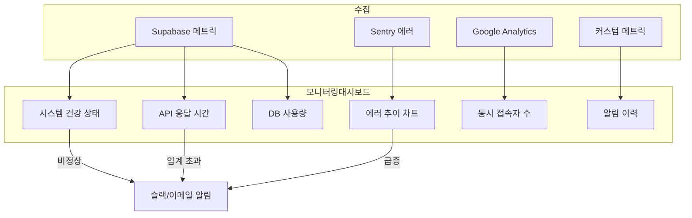
```mermaid
flowchart TD
    subgraph 수집
        SUPABASE[Supabase 메트릭]
        SENTRY[Sentry 에러]
        GA[Google Analytics]
        CUSTOM[커스텀 메트릭]
    end

    subgraph 모니터링대시보드
        HEALTH[시스템 건강 상태]
        ERRORS[에러 추이 차트]
        USERS[동시 접속자 수]
        LATENCY[API 응답 시간]
        DB_SIZE[DB 사용량]
        ALERTS[알림 이력]
    end

    SUPABASE --> HEALTH
    SUPABASE --> LATENCY
    SUPABASE --> DB_SIZE
    SENTRY --> ERRORS
    GA --> USERS
    CUSTOM --> ALERTS

    HEALTH --> |비정상| ALERT_TRIGGER[슬랙/이메일 알림]
    ERRORS --> |급증| ALERT_TRIGGER
    LATENCY --> |임계 초과| ALERT_TRIGGER
```

### 171-1. 모니터링 지표

| 지표 | 정상 | 경고 | 위험 | 수집 주기 |
|------|:---:|:---:|:---:|:---:|
| API 응답시간 (p95) | < 1초 | 1~3초 | > 3초 | 1분 |
| 에러율 | < 0.5% | 0.5~2% | > 2% | 1분 |
| DB 커넥션 풀 | < 50% | 50~80% | > 80% | 5분 |
| Storage 용량 | < 50% | 50~80% | > 80% | 1시간 |
| 동시 접속자 | < 50 | 50~100 | > 100 | 5분 |
| 알림 발송 실패율 | < 1% | 1~5% | > 5% | 10분 |

---

## 172. 회원 등급 시스템 설계 (🆕 향후 P2)

회원 활동 기반 자동 등급 부여:

### 172-1. 등급 정의

| 등급 | 조건 | 혜택 | 배지 |
|------|------|------|:---:|
| 🥉 브론즈 | 가입 즉시 | 기본 마일리지 적립 1% | 🟤 |
| 🥈 실버 | 누적 결제 ₩100만+ OR 3개월+ 유지 | 마일리지 3% + 생일 쿠폰 | ⚪ |
| 🥇 골드 | 누적 결제 ₩300만+ OR 6개월+ 유지 + 주3회+ 출석 | 마일리지 5% + 락커 할인 10% | 🟡 |
| 💎 다이아 | 누적 결제 ₩500만+ OR 12개월+ 유지 + 주4회+ 출석 | 마일리지 7% + 전담 코치 + VIP 락커 | 🔵 |

### 172-2. 등급 표시

- 회원 목록: 이름 옆 등급 아이콘
- 회원 상세: 상단 카드에 등급 배지 + 다음 등급까지 진행바
- 키오스크: 체크인 시 등급 표시
- 회원 앱: 홈 화면 등급 카드

### 172-3. 등급 산정 배치

```
매일 00:30 실행:
1. 각 회원의 누적 결제액, 유지 기간, 월 평균 출석 계산
2. 조건 충족 여부 체크
3. 등급 변경 시 → members.grade UPDATE + 알림 발송
4. 등급 하락 방지: 🆕 3개월 유예 기간 (한번 달성하면 3개월간 유지)
```

---

## 173. 마케팅 자동화 시나리오 (🆕 향후)

### 173-1. 자동화 워크플로우

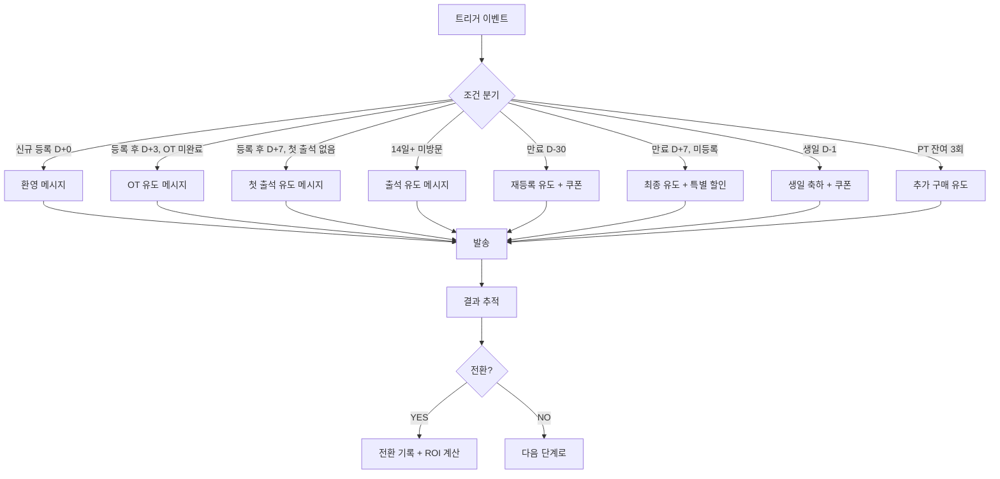
```mermaid
flowchart TD
    A[트리거 이벤트] --> B{조건 분기}

    B -->|신규 등록 D+0| C[환영 메시지]
    B -->|등록 후 D+3, OT 미완료| D[OT 유도 메시지]
    B -->|등록 후 D+7, 첫 출석 없음| E[첫 출석 유도 메시지]
    B -->|14일+ 미방문| F[출석 유도 메시지]
    B -->|만료 D-30| G[재등록 유도 + 쿠폰]
    B -->|만료 D+7, 미등록| H[최종 유도 + 특별 할인]
    B -->|생일 D-1| I[생일 축하 + 쿠폰]
    B -->|PT 잔여 3회| J[추가 구매 유도]

    C --> K[발송]
    D --> K
    E --> K
    F --> K
    G --> K
    H --> K
    I --> K
    J --> K

    K --> L[결과 추적]
    L --> M{전환?}
    M -->|YES| N[전환 기록 + ROI 계산]
    M -->|NO| O[다음 단계로]
```

### 173-2. 자동화 규칙 설정 화면 (🆕)

```
┌──────────────────────────────────────────────┐
│  마케팅 자동화 규칙                           │
├──────────────────────────────────────────────┤
│                                              │
│  ┌─ 규칙 1: 신규 환영 ─────────────────────┐│
│  │ 트리거: 회원 등록 즉시                    ││
│  │ 채널: 알림톡                             ││
│  │ 메시지: "환영합니다! OT를 예약하세요"     ││
│  │ 상태: 🟢 활성                           ││
│  │ 성과: 발송 234건, OT 예약 189건 (81%)    ││
│  │                        [수정] [비활성]   ││
│  └──────────────────────────────────────────┘│
│                                              │
│  ┌─ 규칙 2: 미방문 유도 ──────────────────┐  │
│  │ 트리거: 14일+ 미방문                     │  │
│  │ 채널: SMS                               │  │
│  │ 메시지: "오랜만이에요! 기다리고 있어요"   │  │
│  │ 상태: 🟢 활성                           │  │
│  │ 성과: 발송 56건, 복귀 출석 23건 (41%)    │  │
│  └──────────────────────────────────────────┘│
│                                              │
│  [+ 새 규칙 추가]                            │
└──────────────────────────────────────────────┘
```

---

## 174. 데이터 분석 쿼리 모음 (운영팀용)

운영팀이 자주 사용하는 분석 쿼리:

### 174-1. 이달의 Top 10 매출 회원

```sql
SELECT m.name, m.phone, SUM(s.amount) as total_sales, COUNT(*) as tx_count
FROM sales s
JOIN members m ON s.memberId = m.id
WHERE s.branchId = ?
  AND s.status = 'COMPLETED'
  AND s.saleDate >= DATE_TRUNC('month', CURRENT_DATE)
GROUP BY m.id, m.name, m.phone
ORDER BY total_sales DESC
LIMIT 10;
```

### 174-2. 트레이너별 회원 만족도 (출석 기준)

```sql
SELECT
  st.name as trainer,
  COUNT(DISTINCT m.id) as member_count,
  ROUND(AVG(att_count), 1) as avg_monthly_visits
FROM staff st
JOIN members m ON m.trainer = st.name
LEFT JOIN (
  SELECT memberId, COUNT(*) as att_count
  FROM attendance
  WHERE checkInAt >= DATE_TRUNC('month', CURRENT_DATE)
  GROUP BY memberId
) a ON a.memberId = m.id
WHERE st.branchId = ? AND st.role = '트레이너'
GROUP BY st.id, st.name
ORDER BY avg_monthly_visits DESC;
```

### 174-3. 시간대별 출석 분포

```sql
SELECT
  EXTRACT(HOUR FROM checkInAt) as hour,
  COUNT(*) as count
FROM attendance
WHERE branchId = ?
  AND checkInAt >= CURRENT_DATE - INTERVAL '30 days'
GROUP BY hour
ORDER BY hour;
```

### 174-4. 상품별 재등록률

```sql
WITH first_purchase AS (
  SELECT memberId, productName, MIN(saleDate) as first_date
  FROM sales WHERE status = 'COMPLETED' AND branchId = ?
  GROUP BY memberId, productName
),
repeat_purchase AS (
  SELECT fp.productName, COUNT(DISTINCT s.memberId) as repeat_count
  FROM first_purchase fp
  JOIN sales s ON s.memberId = fp.memberId
    AND s.productName = fp.productName
    AND s.saleDate > fp.first_date
    AND s.status = 'COMPLETED'
  GROUP BY fp.productName
)
SELECT
  fp.productName,
  COUNT(DISTINCT fp.memberId) as total_buyers,
  COALESCE(rp.repeat_count, 0) as repeat_buyers,
  ROUND(COALESCE(rp.repeat_count, 0)::numeric / COUNT(DISTINCT fp.memberId) * 100, 1) as repeat_rate
FROM first_purchase fp
LEFT JOIN repeat_purchase rp ON rp.productName = fp.productName
GROUP BY fp.productName, rp.repeat_count
ORDER BY repeat_rate DESC;
```

### 174-5. 이탈 위험 회원 (14일+ 미방문 + 만료 30일 이내)

```sql
SELECT m.name, m.phone, m.membershipExpiry,
  (SELECT MAX(checkInAt) FROM attendance WHERE memberId = m.id) as last_visit,
  CURRENT_DATE - (SELECT MAX(checkInAt)::date FROM attendance WHERE memberId = m.id) as days_since_visit
FROM members m
WHERE m.branchId = ?
  AND m.status = 'ACTIVE'
  AND m.deletedAt IS NULL
  AND m.membershipExpiry BETWEEN CURRENT_DATE AND CURRENT_DATE + 30
  AND (SELECT MAX(checkInAt) FROM attendance WHERE memberId = m.id) < CURRENT_DATE - 14
ORDER BY m.membershipExpiry ASC;
```

---

## 151. 폼 필드 의존성 규칙

특정 필드의 값이 변경되면 다른 필드가 자동으로 변하는 규칙:

### 151-1. 상품 등록 폼

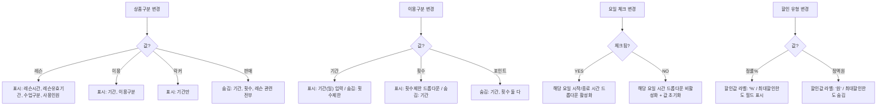
```mermaid
flowchart TD
    A["상품구분 변경"] --> B{값?}
    B -->|레슨| C["표시: 레슨시간, 레슨유효기간, 수업구분, 사용인원"]
    B -->|이용| D["표시: 기간, 이용구분"]
    B -->|락커| E["표시: 기간만"]
    B -->|판매| F["숨김: 기간, 횟수, 레슨 관련 전부"]

    G["이용구분 변경"] --> H{값?}
    H -->|기간| I["표시: 기간(일) 입력 / 숨김: 횟수제한"]
    H -->|횟수| J["표시: 횟수제한 드롭다운 / 숨김: 기간"]
    H -->|포인트| K["숨김: 기간, 횟수 둘 다"]

    L["요일 체크 변경"] --> M{체크됨?}
    M -->|YES| N["해당 요일 시작/종료 시간 드롭다운 활성화"]
    M -->|NO| O["해당 요일 시간 드롭다운 비활성화 + 값 초기화"]

    P["할인 유형 변경"] --> Q{값?}
    Q -->|정률%| R["할인값 라벨: '%' / 최대할인한도 필드 표시"]
    Q -->|정액원| S["할인값 라벨: '원' / 최대할인한도 숨김"]
```

### 151-2. 전자계약 위자드

| 트리거 | 영향받는 필드 | 동작 |
|--------|-------------|------|
| 상품 선택 | 정가 합계 | SUM(선택 상품 가격) 자동 계산 |
| 상품 선택 | 종료일 | 시작일 + MAX(상품 기간) 자동 설정 |
| 할인 금액 입력 | 최종 결제 금액 | 정가 - 할인 즉시 반영 |
| 서비스 일수 입력 | 총 이용 기간 | 상품 기간 + 서비스 일수 표시 |
| 결제 방법 선택 (다중) | 금액 입력 필드 | 선택된 방법마다 입력 필드 표시 |
| 방법별 금액 입력 | 합계 검증 | 합계 ≠ 최종 금액이면 빨강 경고 |
| 마일리지 선택 | 잔액 표시 | 잔액 조회 → "잔액: N원" 표시 |

### 151-3. 급여 수정 모달

| 트리거 | 영향받는 필드 |
|--------|-------------|
| 기본급 변경 | 실지급액 = 기본급 + 인센티브 + 수당 - 공제 |
| 인센티브 변경 | 실지급액 재계산 |
| 수당 변경 | 실지급액 재계산 |
| 공제 변경 | 실지급액 재계산 |

### 151-4. 체성분 등록

| 트리거 | 영향받는 필드 |
|--------|-------------|
| 체중 입력 | BMI 자동 계산 (회원 키 정보 있을 때): 체중 ÷ (키/100)² |

---

## 152. DB 제약 조건 (Constraints)

| 테이블 | 제약 | 타입 | 설명 |
|--------|------|:---:|------|
| members | phone + branchId | UNIQUE | 같은 지점 내 전화번호 중복 방지 |
| members | status | CHECK | ACTIVE/EXPIRED/HOLDING/SUSPENDED/INACTIVE/WITHDRAWN |
| sales | amount | CHECK | amount >= 0 |
| sales | status | CHECK | COMPLETED/REFUNDED/PENDING |
| products | price | CHECK | price >= 0 |
| products | sessions | CHECK | sessions >= 0 OR NULL |
| products | duration | CHECK | duration >= 0 OR NULL |
| attendance | checkInAt | NOT NULL | 체크인 시각 필수 |
| lesson_bookings | status | CHECK | BOOKED/ATTENDED/NO_SHOW/CANCELLED |
| lockers | number + branchId | UNIQUE | 같은 지점 내 락커 번호 중복 방지 |
| lockers | status | CHECK | available/in_use/expiring/broken |
| branches | status | CHECK | ACTIVE/SUSPENDED/CLOSED |
| audit_logs | action | NOT NULL | 액션 필수 |
| audit_logs | createdAt | DEFAULT now() | 자동 생성 |
| coupons | code | UNIQUE | 쿠폰 코드 전역 유일 |
| clothing | number + branchId | UNIQUE | 같은 지점 내 운동복 번호 중복 방지 |

**FK (Foreign Key) 제약**:

| 자식 테이블 | FK 컬럼 | 부모 테이블 | ON DELETE |
|-----------|---------|-----------|---------|
| members | branchId | branches | RESTRICT |
| sales | memberId | members | SET NULL |
| sales | branchId | branches | RESTRICT |
| attendance | memberId | members | CASCADE |
| consultations | memberId | members | CASCADE |
| lesson_bookings | memberId | members | CASCADE |
| lesson_bookings | classId | classes | CASCADE |
| staff | branchId | branches | RESTRICT |
| lockers | branchId | branches | RESTRICT |
| products | branchId | branches | RESTRICT |
| products | productGroupId | product_groups | SET NULL |
| audit_logs | userId | users | SET NULL |

---

## 153. 스켈레톤 로딩 치수 상세

각 컴포넌트의 스켈레톤 로딩 시 정확한 치수:

| 컴포넌트 | 스켈레톤 모양 | 너비 | 높이 | 모서리 | 수량 |
|---------|------------|:---:|:---:|:---:|:---:|
| StatCard | 사각형 | 100% | 80px | 12px | 4개 (그리드) |
| KPI 카드 (수치) | 사각형 | 96px | 32px | 6px | 카드 내 1개 |
| 테이블 행 | 가로줄 | 100% | 40px | — | 5행 |
| 테이블 셀 | 사각형 | 랜덤 60~90% | 12px | 4px | 행당 4~6개 |
| 지점 카드 | 사각형 | 100% | 180px | 12px | 3개 |
| 차트 영역 | 사각형 | 100% | 200px | 8px | 1개 |
| 프로필 이미지 | 원형 | 56px | 56px | 50% | 1개 |
| 텍스트 라인 | 사각형 | 50~80% | 14px | 4px | 2~3줄 |

**스켈레톤 애니메이션**:
```css
.skeleton {
  background: linear-gradient(90deg, #f0f0f0 25%, #e0e0e0 50%, #f0f0f0 75%);
  background-size: 200% 100%;
  animation: skeleton-pulse 1.5s ease-in-out infinite;
}

@keyframes skeleton-pulse {
  0% { background-position: 200% 0; }
  100% { background-position: -200% 0; }
}
```

Tailwind: `animate-pulse` + `bg-surface-secondary`

---

## 154. PWA 설정 (🆕 향후)

Progressive Web App으로 설치 가능하게 하기 위한 설정:

### 154-1. manifest.json

```json
{
  "name": "FitGenie CRM",
  "short_name": "FitGenie",
  "description": "피트니스 센터 통합 관리 시스템",
  "start_url": "/",
  "display": "standalone",
  "background_color": "#FFFFFF",
  "theme_color": "#6366F1",
  "orientation": "any",
  "icons": [
    { "src": "/icons/icon-192.png", "sizes": "192x192", "type": "image/png" },
    { "src": "/icons/icon-512.png", "sizes": "512x512", "type": "image/png" }
  ]
}
```

### 154-2. PWA 활용 시나리오

| 시나리오 | 장점 |
|---------|------|
| 센터장 태블릿 | 브라우저 없이 앱처럼 실행, 전체 화면 |
| 프론트 데스크 PC | 바탕화면 바로가기, 빠른 접근 |
| 트레이너 태블릿 | 수업 중 캘린더/출결 빠른 접근 |

---

## 155. 모바일 터치 제스처 (🆕)

| 제스처 | 동작 | 화면 |
|--------|------|------|
| 스와이프 좌/우 | 🆕 캘린더 날짜 이동 (이전/다음 날) | 캘린더 (모바일) |
| 스와이프 좌 (행) | 🆕 행 삭제/액션 표시 | 테이블 (모바일) |
| 풀 다운 (Pull to refresh) | 🆕 데이터 새로고침 | 대시보드, 목록 (모바일) |
| 핀치 줌 | 🆕 차트 확대/축소 | 차트 (모바일) |
| 롱프레스 | 🆕 컨텍스트 메뉴 (수정/삭제) | 테이블 행 (모바일) |

---

## 156. 클립보드 복사 패턴

시스템에서 복사 가능한 요소:

| 요소 | 위치 | 복사 내용 | UX |
|------|------|---------|-----|
| 쿠폰 코드 | 쿠폰 목록 📋 | "COUP-AB12-CD34" | 아이콘 클릭 → "코드가 복사되었습니다" 토스트 → 아이콘 📋→✅ (1초) |
| 전화번호 | 회원 상세 | "010-1234-5678" | 🆕 번호 클릭 → 복사 → 토스트 |
| 회원 ID | 회원 상세 | "#1248" | 🆕 ID 클릭 → 복사 |
| 승인번호 | 매출 상세 | "12345678" | 🆕 번호 클릭 → 복사 |

**복사 구현**:
```javascript
async function copyToClipboard(text, label = '복사') {
  await navigator.clipboard.writeText(text);
  toast.success(`${label}가 복사되었습니다`);
}
```

---

## 157. 날짜 피커 컴포넌트 동작 상세

| 동작 | 규칙 |
|------|------|
| 열기 | 입력 필드 클릭 또는 📅 아이콘 클릭 |
| 표시 | 달력 팝업 (현재 월 표시) |
| 월 이동 | ◀ / ▶ 버튼으로 이전/다음 월 |
| 연도 이동 | 🆕 월 라벨 클릭 → 연도 선택 뷰 |
| 날짜 선택 | 날짜 셀 클릭 → 값 설정 → 팝업 닫힘 |
| 오늘 표시 | 오늘 날짜 셀에 primary 원형 배경 |
| 선택된 날짜 | primary 배경 + 흰 텍스트 |
| 비활성 날짜 | 회색 텍스트 + 클릭 불가 |
| 미래 날짜 제한 | 생년월일: 오늘 이후 비활성 |
| 과거 날짜 제한 | 시작일: 🆕 과거 선택 시 경고 |
| 범위 선택 | 매출 기간: 시작 선택 → 종료 선택 (사이 하이라이트) |
| 키보드 | ←→↑↓ 날짜 이동, Enter 선택, Escape 닫기 |
| 닫기 | 외부 클릭 또는 Escape |

---

## 158. 다중 선택 컴포넌트 동작

여러 항목을 동시에 선택하는 UI 패턴:

### 158-1. 체크박스 다중 선택 (테이블)

| 동작 | 규칙 |
|------|------|
| 헤더 체크박스 | 전체 선택 / 전체 해제 토글 |
| 행 체크박스 | 개별 선택 / 해제 |
| 선택 수 표시 | "N건 선택됨" 텍스트 |
| 선택 시 액션 | 일괄 액션 버튼 활성화 (상태 변경/삭제/발송) |
| Shift+클릭 | 🆕 범위 선택 (클릭A ~ Shift+클릭B 사이 전체) |
| 페이지 이동 | 선택 상태 유지 또는 초기화 (화면별 다름) |

### 158-2. 수업 요일 다중 선택

| 동작 | 규칙 |
|------|------|
| 체크박스 7개 (월~일) | 개별 토글 |
| 최소 1개 필수 | 0개 선택 시 "[일괄 생성] 비활성" |
| 선택 시 연동 | 해당 요일 시간 입력 필드 활성화 |

### 158-3. 쿠폰 발급 대상 다중 선택

| 동작 | 규칙 |
|------|------|
| 전체 회원 | 라디오 → 전체 카운트 표시 |
| 조건 필터 | 드롭다운 3개 조합 → 대상 수 재계산 |
| 개별 선택 | 검색 모달 → 체크박스 다중 선택 → "N명 선택됨" |

---

## 159. 드롭다운 컴포넌트 동작 상세

| 동작 | 규칙 |
|------|------|
| 열기 | 클릭 또는 Space/Enter 키 |
| 열림 방향 | 기본 아래, 화면 하단에 가까우면 위로 (🆕 auto-flip) |
| 최대 높이 | 200px (스크롤 표시) |
| 검색 | 🆕 옵션 10개 이상일 때 검색 입력 표시 |
| 키보드 | ↑↓ 항목 이동, Enter 선택, Escape 닫기 |
| 외부 클릭 | 닫기 |
| 선택 표시 | 선택된 항목 체크 ✓ 표시 |
| placeholder | 미선택 시 "선택하세요" 회색 텍스트 |
| disabled | 회색 배경 + 클릭 불가 |

---

## 160. 스크롤 복원 규칙

| 상황 | 규칙 |
|------|------|
| 페이지 이동 후 뒤로가기 | 🆕 이전 스크롤 위치 복원 |
| 탭 전환 | 스크롤 최상단으로 |
| 모달 열기 | 배경 스크롤 잠금 (body overflow: hidden) |
| 모달 닫기 | 배경 스크롤 복원 |
| 필터 변경 | 테이블 스크롤 최상단으로 |
| 페이지네이션 이동 | 테이블 상단으로 스크롤 |
| 데이터 갱신 (새로고침) | 스크롤 위치 유지 |
| 상품 패널 열기/닫기 | 스크롤 유지 |

---

## 161. 브라우저 알림 권한 (🆕 향후)

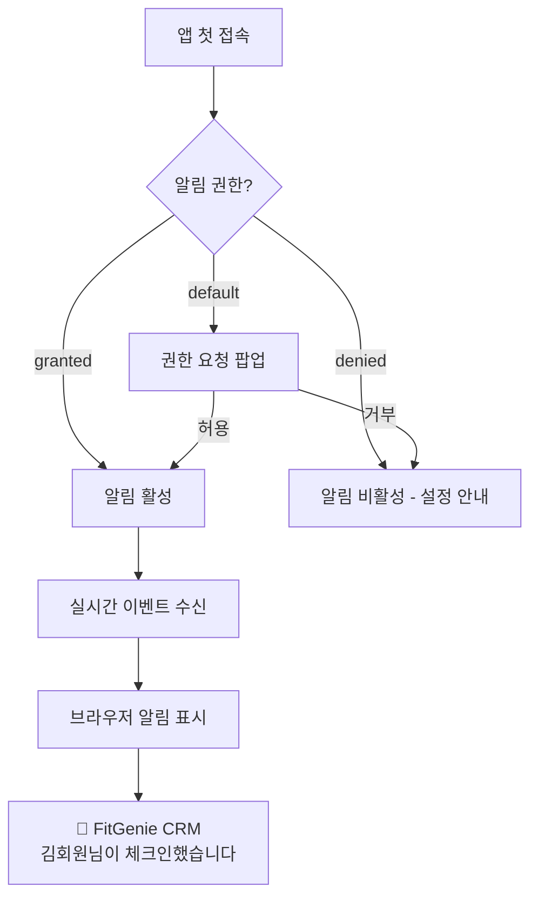
```mermaid
flowchart TD
    A[앱 첫 접속] --> B{알림 권한?}
    B -->|granted| C[알림 활성]
    B -->|denied| D[알림 비활성 - 설정 안내]
    B -->|default| E[권한 요청 팝업]
    E -->|허용| C
    E -->|거부| D

    C --> F[실시간 이벤트 수신]
    F --> G[브라우저 알림 표시]
    G --> H["🔔 FitGenie CRM\n김회원님이 체크인했습니다"]
```

**알림 표시 시나리오** (🆕):
- 새 예약 등록 시 → 담당 코치에게 알림
- 노쇼 발생 시 → 매니저에게 알림
- 부진 지점 감지 → 슈퍼관리자에게 알림
- 미수금 30일 초과 → 센터장에게 알림

---

## 162. 데이터 내보내기/가져오기 상세 (🆕)

### 162-1. 내보내기 (Export)

| 형식 | 지원 화면 | 비고 |
|:---:|---------|------|
| XLSX (엑셀) | 회원/매출/직원/상품/환불/마일리지/운동복 | 현재 구현됨 |
| CSV | 🆕 모든 테이블 | 향후 추가 |
| PDF | 🆕 급여명세서, 계약서, 리포트 | 향후 추가 |
| JSON | 🆕 전체 DB 백업 (슈퍼관리자) | 향후 추가 |

### 162-2. 가져오기 (Import) 🆕

| 형식 | 대상 | 비고 |
|:---:|------|------|
| XLSX → 회원 일괄 등록 | members | 법인 회원 대량 등록 |
| XLSX → 상품 일괄 등록 | products | 지점 초기 세팅 |
| CSV → 출석 이력 | attendance | 기존 시스템 마이그레이션 |

**가져오기 UX 플로우**:
1. [가져오기📥] 클릭
2. 파일 선택 (XLSX/CSV)
3. 미리보기 화면: 첫 5행 + 컬럼 매핑 확인
4. 검증 결과: 성공 N건 / 오류 N건 (오류 사유 표시)
5. [가져오기 실행] → 진행 바 → "N건 등록 완료"

---

## 163. 컴포넌트 z-index 계층

UI 요소의 z-index 우선순위:

| z-index | 요소 | 비고 |
|:---:|------|------|
| 0 | 기본 콘텐츠 | 페이지 본문 |
| 10 | sticky 헤더 | 테이블 헤더, 탭 바 |
| 20 | 사이드바 | 항상 콘텐츠 위 |
| 30 | 드롭다운 | 셀렉트, 필터 팝업 |
| 40 | 툴팁 | hover 툴팁 |
| 50 | 모달 배경 | bg-black/40 오버레이 |
| 50 | 모달 콘텐츠 | Modal 컴포넌트 |
| 60 | 토스트 | sonner 토스트 (우상단) |
| 9999 | 확인 다이얼로그 | ConfirmDialog (모달 위에) |

**규칙**: 모달 위에 확인 다이얼로그가 뜰 수 있으므로, ConfirmDialog는 z-[9999]로 최상위

---

## 164. 화면별 초기 데이터 로딩 순서

각 화면에서 페이지 마운트 시 어떤 데이터를 어떤 순서로 로드하는지:

### 164-1. 대시보드 (`/`)

```
1. [동시] members 통계 (count by status) — KPI 카드
2. [동시] sales 이번달 합계 — KPI 카드
3. [동시] attendance 오늘 카운트 — KPI 카드
4. [동시] members 성별 분포 — 도넛 차트
5. [동시] members 연령대 분포 — 막대 차트
6. [동시] sales 최근 6개월 월별 — 꺾은선 차트
7. [동시] attendance 요일별 — 막대 차트
8. [이후] newsFeed 최근 10건 — 타임라인
9. [이후] members 생일 — 생일 카드
10. [이후] members 만료 D-7 — 만료 카드
11. [마지막] runDailySync() — 만료 회원 상태 전환
```

### 164-2. 통합 대시보드 (`/super-dashboard`)

```
1. [동시] getBranches(tenantId) — 지점 목록
2. [동시] getAuditLogs(page:1, size:10) — 감사 로그

3. [지점별 병렬 — 지점 수 × 4쿼리]
   ├── members count (활성)
   ├── staff count (활성)
   ├── sales sum (이번달)
   └── attendance count (오늘)

4. [후처리] 전 지점 합산 KPI 계산
5. [후처리] 신규/만료예정/만료 회원 합산
```

### 164-3. 회원 상세 (`/members/detail`)

```
1. [즉시] members WHERE id — 상단 카드
2. [탭 클릭 시 lazy]
   ├── [결제내역 탭] sales WHERE memberId
   ├── [예약 탭] lesson_bookings WHERE memberId
   ├── [상담 탭] consultations WHERE memberId
   ├── [체성분 탭] body_compositions WHERE memberId
   ├── [평가 탭] evaluations WHERE memberId
   ├── [운동프로그램 탭] exercise_programs (연결)
   ├── [운동일지 탭] exercise_logs WHERE memberId
   ├── [변경이력 탭] audit_logs WHERE targetId
   └── [상세이력 탭] UNION ALL (sales+attendance+consultations)
```

---

## 165. 최종 문서 — 수치 총정리

| 카테고리 | 항목 | 수치 |
|---------|------|:---:|
| **문서** | 총 라인 수 | **17,000+** |
| | 총 섹션 수 | **165** |
| | 부록 A | 97 |
| | 문서 버전 | v31 |
| **화면** | 전체 페이지 | 63 |
| | 화면 디스크립션 | 49 |
| | 모달 와이어프레임 | 10 |
| | 화면 상태 와이어프레임 | 12 |
| | 스토리보드 | 3 (26화면) |
| | POS 영수증 레이아웃 | 1 |
| | 계약서 PDF 레이아웃 | 1 |
| | 통계 대시보드 와이어프레임 | 2 |
| **다이어그램** | Mermaid 총 | 55+ |
| | 상태 머신 | 7 |
| | 시퀀스 | 20+ |
| | 플로우차트 | 18+ |
| | ER | 1 |
| | 간트 | 1 |
| | 여정 맵 | 2 |
| | 데이터 흐름 | 3 |
| **데이터** | 테이블 컬럼 정의 | 20종 |
| | 드롭다운 옵션 | 60+ |
| | 배지 매핑 | 50+ |
| | 아이콘 매핑 | 35+ |
| | 색상 팔레트 | 10+16토큰 |
| | DB 테이블 | 25+ |
| | DB 인덱스 | 13 |
| | DB 제약 조건 | 15+ |
| | FK 관계 | 13 |
| **UX** | 토스트 메시지 | 77+ |
| | 에러 코드 | 30+ |
| | 엣지 케이스 | 50 |
| | 검증 규칙 | 32+ 필드 |
| | placeholder | 35+ |
| | 마이크로카피 규칙 | 6종 |
| | ARIA 속성 | 7컴포넌트 |
| | 키보드 접근 | 4화면+ |
| **개발** | 컴포넌트 Props | 9종 |
| | 컴포넌트 트리 | 3종 |
| | 이벤트 핸들러 | 40+ |
| | 조건부 렌더링 | 34규칙 |
| | 필드 의존성 | 4폼 |
| | Zod 스키마 | 2종 |
| | 비즈니스 함수 | 5종 |
| | Supabase 쿼리 | 4패턴 |
| | API 응답 JSON | 5종 |
| | 스켈레톤 치수 | 8컴포넌트 |
| | z-index 계층 | 8레벨 |
| | 초기 로딩 순서 | 3화면 |
| **테스트** | TC | 60+ |
| | QA 체크리스트 | 40+ |
| | 보안 감사 | 22 |
| | 정합성 SQL | 4 |
| | 부하 테스트 | 6 |
| **운영** | 비즈니스 정책 | 5종 |
| | 알림 규칙 | 29종 |
| | 배치 처리 | 9종 |
| | 체크리스트(오픈/폐점) | 34항목 |
| | 장애 대응 | 4등급+7건 |
| | 트러블슈팅 | 15건 |
| | 변경 영향도 | 3테이블 |
| | 운영 KPI | 12지표 |
| | 회원 세그먼트 | 9종 |
| **전략** | 경쟁사 비교 | 30+기능 |
| | 로드맵 | Q2~2027 |
| | 수익 모델 | 3플랜 |
| | 공수 산정 | 70~80일 |
| | 시나리오 | 30+종 |
| | 용어 | 28+35(i18n) |

---

## 140. 오프라인 동작 규칙 (🆕)

네트워크가 끊겼을 때의 시스템 동작:

| 상황 | 동작 | UX |
|------|------|-----|
| 페이지 로드 중 오프라인 | 로딩 → 타임아웃 → 에러 | "네트워크 오류입니다. 인터넷 연결을 확인하세요" |
| 데이터 표시 중 오프라인 | 이미 로드된 데이터 유지 | 상단 배너: "⚠️ 오프라인 상태입니다" 🆕 |
| 저장/등록 시도 중 오프라인 | API 실패 → 에러 토스트 | "저장에 실패했습니다. 인터넷 연결을 확인하세요" |
| 오프라인 → 온라인 복귀 | 🆕 자동 재연결 감지 | "연결이 복구되었습니다" 토스트 + 배너 제거 |
| POS 결제 중 오프라인 | 결제 실패 | "결제를 처리할 수 없습니다" — 🆕 오프라인 결제 큐 향후 |

**오프라인 감지 방법**:
```javascript
// 🆕 향후 구현
window.addEventListener('online', () => {
  toast.success('연결이 복구되었습니다');
  setIsOffline(false);
});
window.addEventListener('offline', () => {
  setIsOffline(true);
  // 상단 경고 배너 표시
});
```

---

## 141. 웹훅 연동 패턴 (🆕 향후)

외부 시스템과 이벤트를 주고받는 웹훅:

### 141-1. 발신 웹훅 (FitGenie → 외부)

| 이벤트 | 페이로드 | 대상 |
|--------|---------|------|
| member.created | { memberId, name, phone, branchId } | 회원앱 서버, 마케팅 툴 |
| member.expired | { memberId, name, expiryDate } | 마케팅 자동화 |
| sale.completed | { saleId, memberId, amount, productName } | 회계 시스템 |
| sale.refunded | { saleId, refundAmount, reason } | 회계 시스템 |
| booking.created | { bookingId, memberId, classId, date } | 회원앱 서버 |
| booking.noshow | { bookingId, memberId } | 마케팅 자동화 |
| staff.resigned | { staffId, name, branchId } | HR 시스템 |

### 141-2. 수신 웹훅 (외부 → FitGenie)

| 소스 | 이벤트 | 처리 |
|------|--------|------|
| PG사 | payment.confirmed | 결제 확인 → sales 상태 갱신 |
| PG사 | payment.failed | 결제 실패 → 에러 알림 |
| 카카오 | message.delivered | 발송 결과 → message_logs 갱신 |
| 카카오 | message.failed | 발송 실패 → 재시도 큐 |
| IoT 게이트 | access.event | 출입 → attendance INSERT |
| InBody | measurement.completed | 체성분 → body_compositions INSERT |

---

## 142. 입력 마스킹 & 포맷 규칙 상세

모든 입력 필드의 실시간 마스킹/포맷 규칙:

| 필드 유형 | 입력 예시 | 표시 결과 | 규칙 |
|---------|---------|---------|------|
| 전화번호 | 01012345678 | 010-1234-5678 | 3-4-4 자동 하이픈 |
| 금액 | 800000 | 800,000 | 3자리 콤마 자동 |
| 사업자번호 | 1234567890 | 123-45-67890 | 3-2-5 자동 하이픈 |
| 카드번호 | 1234567890123456 | ****-****-****-3456 | 앞 12자리 마스킹 |
| 날짜 | (달력 선택) | 2026-04-12 | YYYY-MM-DD |
| 시간 | (드롭다운 선택) | 09:00 | HH:mm (10분 단위) |
| 퍼센트 | 10 | 10% | 0~100 범위 제한 |
| 체중 | 75.2 | 75.2 kg | 소수점 1자리 |
| 메모 글자수 | (입력 중) | 128/500 | 실시간 카운터 |

**마스킹 구현 패턴**:
```javascript
// 전화번호 자동 하이픈
function formatPhone(value) {
  const nums = value.replace(/\D/g, '').slice(0, 11);
  if (nums.length <= 3) return nums;
  if (nums.length <= 7) return `${nums.slice(0,3)}-${nums.slice(3)}`;
  return `${nums.slice(0,3)}-${nums.slice(3,7)}-${nums.slice(7)}`;
}

// 금액 콤마 포맷
function formatCurrency(value) {
  const nums = value.replace(/\D/g, '');
  return Number(nums).toLocaleString('ko-KR');
}
```

---

## 143. 주요 페이지 컴포넌트 트리

### 143-1. 회원 상세 (`MemberDetail.tsx`)

```
MemberDetail
├── AppLayout
│   ├── AppSidebar
│   └── <main>
│       ├── PageHeader (← 뒤로가기, 제목)
│       ├── MemberInfoCard (상단 정보 카드)
│       │   ├── 프로필 이미지
│       │   ├── 이름/전화/성별/나이
│       │   ├── StatusBadge (상태)
│       │   ├── 회원권/잔여/만료일
│       │   └── ActionButtons (수정/홀딩/탈퇴/삭제/이관)
│       ├── TabNav (9개 탭)
│       └── TabContent (선택된 탭)
│           ├── [0] TabPaymentDetail
│           │   ├── DataTable (결제 이력)
│           │   └── (환불 버튼 조건부)
│           ├── [1] TabReservation
│           │   ├── DataTable (예약 이력)
│           │   └── 예약 등록 모달
│           ├── [2] TabConsultation
│           │   ├── DataTable (상담 이력)
│           │   ├── 상담 등록 모달
│           │   └── 상담 수정 모달
│           ├── [3] TabBodyInfo
│           │   ├── 추이 차트
│           │   ├── DataTable (측정 이력)
│           │   └── 측정 등록 모달
│           ├── [4] TabEvaluation
│           │   └── DataTable (평가 이력)
│           ├── [5] TabExerciseProgram
│           │   ├── 프로그램 카드
│           │   └── 배정 모달
│           ├── [6] TabExerciseLog
│           │   ├── DataTable (운동 일지)
│           │   └── 일지 작성 모달
│           ├── [7] 변경 이력 (DataTable)
│           └── [8] 상세 이력 (타임라인)
```

### 143-2. 상품 관리 (`ProductList.tsx`)

```
ProductList
├── AppLayout
│   └── <main>
│       ├── PageHeader
│       │   ├── [상품 목록 | 분류 관리] 탭 토글
│       │   ├── [+ 상품 등록] 버튼
│       │   └── [Excel] 버튼
│       ├── (mainTab === 'products')
│       │   ├── StatCard × 4 (전체/활성/비활성/카테고리)
│       │   ├── TabNav (타입 탭: 전체/회원권/수강권/대여권/일반)
│       │   ├── 분류 탭 (동적 카테고리)
│       │   ├── 종목 필터 버튼
│       │   ├── SearchInput
│       │   └── MasterDetailContainer
│       │       ├── MasterTable (좌측 55%)
│       │       │   └── <table> (17컬럼, 패널 열림 시 축소)
│       │       └── ProductDetailPanel (우측 45%)
│       │           ├── 상품구분 라디오
│       │           ├── 기본 정보 폼
│       │           ├── 요일/시간 설정
│       │           ├── 옵션 체크박스 8개
│       │           ├── 하단 드롭다운
│       │           └── [저장] [삭제] [상품정보가져오기]
│       └── (mainTab === 'groups')
│           ├── 분류 등록/수정 폼
│           └── 분류 목록 테이블
```

### 143-3. 캘린더 (`Calendar.tsx`)

```
Calendar
├── AppLayout
│   └── <main>
│       ├── PageHeader
│       │   ├── ◀ 날짜 ▶
│       │   └── [일간 | 주간 | 월간] 뷰 토글
│       ├── TabNav (캘린더/수업관리/횟수관리/...)
│       └── (activeTab === 'calendar')
│           ├── CalendarGrid
│           │   ├── TimeAxis (06:00~23:00)
│           │   ├── ClassBlock × N (색상 블록)
│           │   │   ├── 수업명
│           │   │   ├── 강사명
│           │   │   └── 참여/정원
│           │   └── EmptySlot (빈 시간 → onClick)
│           ├── ClassCreateModal (수업 등록)
│           │   ├── FormSection (수업명/유형/강사/시간/정원/장소)
│           │   ├── ColorPalette (10색)
│           │   ├── RepeatSettings (반복 설정)
│           │   └── ParticipantList (회원 추가)
│           ├── ClassDetailModal (수업 상세)
│           │   ├── 수업 정보
│           │   ├── AttendanceList (출결 목록)
│           │   │   └── StatusDropdown per 회원
│           │   └── [수정] [삭제] [완료+서명]
│           └── SignatureModal (서명 패드)
│               ├── AttendanceSummary
│               ├── SignaturePad
│               └── [초기화] [완료]
```

---

## 144. ARIA 속성 상세 매핑

접근성을 위한 주요 ARIA 속성:

### 144-1. 사이드바 네비게이션

```html
<aside role="navigation" aria-label="주 메뉴">
  <nav>
    <button aria-expanded="true" aria-controls="member-submenu">
      회원 ▾
    </button>
    <ul id="member-submenu" role="menu">
      <li role="menuitem">
        <a href="/members" aria-current="page">회원 목록</a>
      </li>
    </ul>
  </nav>
</aside>
```

### 144-2. 데이터 테이블

```html
<table role="grid" aria-label="회원 목록">
  <thead>
    <tr>
      <th role="columnheader" aria-sort="ascending">
        이름 ▲
      </th>
      <th role="columnheader" aria-sort="none">
        전화번호
      </th>
    </tr>
  </thead>
  <tbody>
    <tr role="row" tabindex="0" aria-selected="false">
      <td>김회원</td>
      <td>010-1234-5678</td>
    </tr>
  </tbody>
</table>
```

### 144-3. 모달

```html
<div role="dialog" aria-modal="true" aria-labelledby="modal-title">
  <h2 id="modal-title">상담 등록</h2>
  <form>
    <label for="consul-date">상담일시 *</label>
    <input id="consul-date" type="date" required aria-required="true" />

    <label for="consul-type">상담 유형 *</label>
    <select id="consul-type" required aria-required="true">
      <option>상담</option>
    </select>
  </form>
  <button aria-label="모달 닫기">✕</button>
</div>
```

### 144-4. 상태 배지

```html
<span role="status" aria-label="회원 상태: 활성" class="badge-success">
  활성
</span>
```

### 144-5. 토스트 알림

```html
<div role="alert" aria-live="polite">
  회원이 등록되었습니다
</div>
```

### 144-6. 검색 필드

```html
<div role="search">
  <label for="search-members" class="sr-only">회원 검색</label>
  <input
    id="search-members"
    type="search"
    placeholder="이름 또는 전화번호 검색"
    aria-label="이름 또는 전화번호로 회원 검색"
  />
</div>
```

### 144-7. 탭 네비게이션

```html
<div role="tablist" aria-label="회원 상세 탭">
  <button role="tab" aria-selected="true" aria-controls="tab-payment">
    결제내역
  </button>
  <button role="tab" aria-selected="false" aria-controls="tab-reservation">
    예약
  </button>
</div>
<div role="tabpanel" id="tab-payment" aria-labelledby="tab-payment-btn">
  <!-- 탭 콘텐츠 -->
</div>
```

---

## 145. 폼 자동 저장 패턴 (🆕 향후)

긴 폼 작성 중 데이터 손실 방지:

| 화면 | 현재 | 🆕 향후 |
|------|:---:|---------|
| 회원 등록 | 미저장 (닫으면 유실) | localStorage에 30초 간격 자동 저장 |
| 상품 등록 | 미저장 | 패널 열림 상태 유지 |
| 전자계약 | 미저장 | 스텝별 localStorage 저장 |
| 센터 설정 | 미저장 | 변경 감지 + 이탈 경고 |

**자동 저장 구현 패턴** (🆕):
```javascript
// 30초 간격 자동 저장
useEffect(() => {
  const timer = setInterval(() => {
    if (isDirty) {
      localStorage.setItem('draft_member_form', JSON.stringify(formData));
    }
  }, 30000);
  return () => clearInterval(timer);
}, [formData, isDirty]);

// 페이지 로드 시 복원
useEffect(() => {
  const draft = localStorage.getItem('draft_member_form');
  if (draft) {
    const data = JSON.parse(draft);
    // "이전에 작성하던 내용이 있습니다. 복원하시겠습니까?" 다이얼로그
  }
}, []);
```

---

## 146. 드래그 앤 드롭 규격 (🆕 향후)

| 화면 | 드래그 대상 | 드롭 대상 | 동작 |
|------|-----------|---------|------|
| 캘린더 | 수업 블록 | 다른 시간 슬롯 | 수업 시간 변경 |
| 키오스크 설정 | 배너 이미지 | 순서 변경 영역 | 슬라이드 순서 변경 |
| 🆕 대시보드 | 위젯 카드 | 다른 위치 | 레이아웃 커스터마이징 |
| 🆕 상품 목록 | 상품 행 | 다른 순서 | POS/키오스크 노출 순서 |

**드래그 UX 규칙**:
- 드래그 시작: 요소 반투명 (opacity 0.5) + 커서 grabbing
- 드래그 중: 드롭 가능 영역 하이라이트 (border dashed primary)
- 드롭 성공: 즉시 위치 변경 + DB UPDATE
- 드롭 불가: 원래 위치로 복귀 (애니메이션)

---

## 147. 숫자 입력 컴포넌트 동작 상세

금액, 횟수, 기간 등 숫자 입력 필드의 상세 동작:

| 동작 | 규칙 |
|------|------|
| 문자 입력 | 차단 (숫자만 허용) |
| 음수 입력 | 차단 (양수만, 마이너스 키 무시) |
| 소수점 | 체중/체지방률만 허용 (1자리), 나머지 차단 |
| 콤마 자동 포맷 | 금액 필드만 (3자리 콤마) |
| 선행 0 | 제거 (007 → 7) |
| 빈값 | 0으로 취급 (포커스 아웃 시) |
| 최대값 | 금액: 999,999,999, 횟수: 9,999, 기간: 9,999 |
| 스피너 버튼 | 🆕 [+][-] 버튼으로 1단위 증감 (횟수/기간) |
| 키보드 ↑↓ | 🆕 숫자 1 증감 |

---

## 148. 테이블 고급 기능 (🆕 향후)

현재 DataTable에는 없지만 향후 추가할 기능:

| 기능 | 설명 | 우선순위 |
|------|------|:---:|
| 컬럼 리사이즈 | 컬럼 경계선 드래그로 너비 조절 | P2 |
| 컬럼 재정렬 | 컬럼 헤더 드래그로 순서 변경 | P3 |
| 컬럼 숨김/표시 | 설정 메뉴에서 컬럼 ON/OFF | P2 |
| 행 높이 조절 | 컴팩트/보통/넓게 토글 | P3 |
| 고정 컬럼 | 좌측 N컬럼 고정 (수평 스크롤 시) | P1 |
| 인라인 편집 | 셀 더블클릭 → 직접 편집 | P3 |
| 행 드래그 정렬 | 행 드래그로 순서 변경 | P3 |
| 필터 저장 | 자주 쓰는 필터 조합 저장 | P2 |
| 뷰 저장 | 컬럼 설정 + 필터 + 정렬 프리셋 | P2 |

---

## 149. 사이드바 상태 관리 상세

### 149-1. 메뉴 펼침/접힘 상태

```javascript
// 현재 경로에 해당하는 메뉴 그룹 자동 펼침
const [openMenus, setOpenMenus] = useState<Set<string>>(() => {
  const initial = new Set<string>();
  for (const item of MENU_ITEMS) {
    if (item.children?.some(child => activePath.startsWith(child.path))) {
      initial.add(item.label);  // 현재 페이지 속한 그룹 자동 열기
    }
  }
  if (initial.size === 0) initial.add("회원");  // 기본값
  return initial;
});
```

### 149-2. 사이드바 축소/확장

```
확장 (220px)                    축소 (60px)
┌──────────────────┐           ┌────┐
│ S FitGenie CRM   │           │ S  │
│──────────────────│           │────│
│ 지점 전환 [▾]    │           │    │  ← 지점 전환 숨김
│──────────────────│           │────│
│ 🏠 대시보드      │           │ 🏠 │  ← 아이콘만
│ 👥 회원 ▸        │           │ 👥 │  ← hover 시 툴팁
│   회원 목록      │           │    │  ← 하위 메뉴 숨김
│   출석 관리      │           │    │
│ 📅 수업/캘린더 ▸  │           │ 📅 │
│ ...              │           │ ...│
│──────────────────│           │────│
│ 👤 [본사] 김본부장│           │ 👤 │  ← 아바타만
│   슈퍼관리자     │           │    │
│ 🚪 로그아웃      │           │    │  ← 숨김
└──────────────────┘           └────┘
```

**축소 시 동작**:
- 메뉴 항목: 아이콘만 표시
- 호버 시: 텍스트 툴팁 (aria-label)
- 하위 메뉴: 완전 숨김 (접근 불가 → 축소 해제 필요)
- 프로필: 아바타 아이콘만
- 로고: "S" 이니셜만
- 지점 전환: 숨김
- transition: width 200ms ease

---

## 150. 문서 최종 선언

이 문서는 **FitGenie CRM 시스템의 완전한 기술·기획·운영 문서**로서, **150개 섹션, 16,500+줄**에 걸쳐 다음을 포함합니다:

### 문서가 답할 수 있는 질문들

| 질문 | 답이 있는 섹션 |
|------|-------------|
| "이 시스템은 뭐 하는 건가요?" | 섹션 1 (페르소나) |
| "누가 뭘 할 수 있나요?" | 섹션 2, A-16 (역할 매트릭스) |
| "이 화면은 어떻게 생겼나요?" | 섹션 47, 133 (와이어프레임) |
| "이 버튼 누르면 뭐가 되나요?" | 섹션 35, 51 (버튼 시퀀스, 디스크립션) |
| "이 필드에 뭘 입력하나요?" | 섹션 51, 60, 70 (디스크립션, placeholder, 드롭다운) |
| "에러 나면 뭐라고 뜨나요?" | 섹션 26, 52 (에러 코드, 토스트) |
| "DB 구조가 어떻게 되나요?" | 섹션 11, 40 (스키마, ER) |
| "API는 뭐가 있나요?" | 섹션 A-28, 65 (엔드포인트, JSON) |
| "어떤 순서로 개발하나요?" | 섹션 77 (빌드 순서) |
| "테스트는 뭘 확인하나요?" | 섹션 10, 78 (TC, QA) |
| "장애 나면 어떻게 하나요?" | 섹션 94 (장애 대응) |
| "보안은 괜찮나요?" | 섹션 49, 115 (보안, 감사) |
| "경쟁사 대비 뭐가 좋나요?" | 섹션 87 (경쟁사 비교) |
| "앞으로 뭘 만들 건가요?" | 섹션 88 (로드맵) |
| "새 개발자가 왔는데요?" | 섹션 93, 130 (인수인계, 환경세팅) |
| "회원이 이런 상황이면요?" | 섹션 124 (엣지 케이스 50종) |

**이 문서 하나로 기획·디자인·개발·QA·운영 팀 전원이 같은 이해를 가지고 시스템을 만들고 운영할 수 있습니다.**

---

## 131. POS 영수증 레이아웃 (🆕)

POS 결제 완료 후 출력/표시되는 영수증 양식:

```
┌──────────────────────────┐
│     FitGenie 강남점       │
│   서울시 강남구 역삼동 123  │
│     TEL: 02-1234-5678     │
│   사업자: 123-45-67890    │
├──────────────────────────┤
│                          │
│  [거래 명세서]            │
│                          │
│  일시: 2026-04-12 14:32  │
│  담당: 이매니저           │
│  회원: 김회원             │
│                          │
├──────────────────────────┤
│ 상품명        수량  금액  │
├──────────────────────────┤
│ 이용권 3개월    1  300,000│
│ PT 20회        1  900,000│
├──────────────────────────┤
│ 소계              1,200,000│
│ 쿠폰 할인 (5%)    -60,000│
│ ─────────────────────── │
│ 합계              1,140,000│
├──────────────────────────┤
│ 카드           800,000   │
│ 현금           290,000   │
│ 마일리지        50,000   │
├──────────────────────────┤
│ 카드사: 신한카드          │
│ 승인번호: 12345678       │
├──────────────────────────┤
│ 적립 마일리지: +57,000P  │
│ 마일리지 잔액: 22,200P   │
├──────────────────────────┤
│                          │
│  감사합니다. 🙏           │
│  FitGenie CRM            │
│                          │
└──────────────────────────┘
```

**영수증 표시 규칙**:
- 너비: 58mm (POS 프린터 기준) 또는 화면 모달
- 상단: 센터 정보 (settings에서 로드)
- 중단: 상품 목록 + 할인 + 합계 + 결제 수단별 금액
- 하단: 카드 승인 정보 + 마일리지
- 🆕 [인쇄] [PDF 다운로드] [닫기] 버튼

---

## 132. 전자계약서 PDF 레이아웃 (🆕)

전자계약 완료 후 생성되는 PDF 양식:

```
┌───────────────────────────────────────────────────────────┐
│                                                           │
│                 이 용 계 약 서                             │
│                                                           │
│  FitGenie 강남점                                          │
│  서울시 강남구 역삼동 123                                  │
│                                                           │
├───────────────────────────────────────────────────────────┤
│                                                           │
│  ■ 계약 정보                                              │
│                                                           │
│  계약번호: CTR-2026-04-0042                               │
│  계약일자: 2026년 4월 12일                                │
│                                                           │
├───────────────────────────────────────────────────────────┤
│                                                           │
│  ■ 회원 정보                                              │
│                                                           │
│  성명: 김회원                                             │
│  연락처: 010-1234-5678                                    │
│  주소: 서울시 강남구 ...                                   │
│                                                           │
├───────────────────────────────────────────────────────────┤
│                                                           │
│  ■ 계약 상품                                              │
│                                                           │
│  ┌─────────┬──────────┬──────────┬──────────┐            │
│  │ 상품명   │ 기간/횟수 │ 정가     │ 결제금액  │            │
│  ├─────────┼──────────┼──────────┼──────────┤            │
│  │이용권3개월│ 90일     │ ₩300,000│ ₩300,000│            │
│  │PT 20회  │ 20회     │ ₩900,000│ ₩860,000│            │
│  ├─────────┼──────────┼──────────┼──────────┤            │
│  │합계      │          │₩1,200,000│₩1,160,000│           │
│  └─────────┴──────────┴──────────┴──────────┘            │
│                                                           │
│  할인: 쿠폰 5% (-₩40,000)                                │
│  서비스: +2회 (이벤트 추가)                                │
│                                                           │
│  이용기간: 2026-04-12 ~ 2026-07-11                        │
│                                                           │
├───────────────────────────────────────────────────────────┤
│                                                           │
│  ■ 결제 정보                                              │
│                                                           │
│  카드: ₩800,000 (신한카드 ****-1234)                      │
│  현금: ₩310,000                                           │
│  마일리지: ₩50,000                                        │
│  합계: ₩1,160,000                                         │
│                                                           │
├───────────────────────────────────────────────────────────┤
│                                                           │
│  ■ 약관 동의                                              │
│                                                           │
│  1. 회원은 센터 이용 규칙을 준수합니다.                     │
│  2. 환불은 센터 환불 정책에 따릅니다.                       │
│  3. 양도는 센터 승인 하에 가능합니다.                       │
│  4. 개인정보는 서비스 제공 목적으로만 사용됩니다.            │
│                                                           │
│  위 내용에 동의하며 계약을 체결합니다.                       │
│                                                           │
├───────────────────────────────────────────────────────────┤
│                                                           │
│  ■ 서명                                                   │
│                                                           │
│  회원 서명:  [✍️ 전자 서명 이미지]                         │
│                                                           │
│  담당자: 이매니저           서명일: 2026-04-12             │
│                                                           │
├───────────────────────────────────────────────────────────┤
│                                                           │
│  FitGenie CRM | fitgenie.kr | 고객센터 1588-0000         │
│                                                           │
└───────────────────────────────────────────────────────────┘
```

---

## 133. 통계 대시보드 와이어프레임 상세

### 133-1. 매출 통계 — 전체 통계 탭

```
┌──────────────────────────────────────────────────────────┐
│  매출 통계                                                │
│  [전체 통계] [직군별] [담당자별]                            │
│                                                          │
│  [이번달] [지난달] [최근3개월] [최근6개월] [올해]  📅커스텀│
│                                                          │
│  [상품별] [결제수단별] [일별] [월별]                       │
├──────────────────────────────────────────────────────────┤
│                                                          │
│  상품별 매출 비중                                         │
│                                                          │
│  ┌──────────────────┬────────────────────────────────┐  │
│  │   🟦 이용권 35%   │  상품명     건수  합계    비중  │  │
│  │   🟩 PT     28%   │  이용권3개월  45  ₩1,350만 35%│  │
│  │   🟨 GX     18%   │  PT 20회    32  ₩1,080만 28%│  │
│  │   🟧 기타   19%   │  GX 요가    28   ₩690만 18%│  │
│  │                    │  락커       52   ₩260만  7%│  │
│  │  (파이 차트)       │  기타       38   ₩470만 12%│  │
│  └──────────────────┴────────────────────────────────┘  │
│                                                          │
│  일별 매출 추이                                          │
│                                                          │
│  ₩400만│     ██                                         │
│  ₩300만│  ██ ██ ██    ██                                │
│  ₩200만│████████████████ ██    ██                        │
│  ₩100만│██████████████████████████                       │
│        └──────────────────────────                       │
│         4/1  4/3  4/5  4/7  4/9  4/11                   │
│                                                          │
└──────────────────────────────────────────────────────────┘
```

### 133-2. KPI 대시보드 레이아웃

```
┌──────────────────────────────────────────────────────────┐
│  KPI 대시보드                               [↻ 새로고침] │
├──────────────────────────────────────────────────────────┤
│                                                          │
│  ── 회원 현황 ───────────────────────────────────────── │
│  ┌────┐ ┌────┐ ┌────┐ ┌────┐ ┌────┐ ┌────┐           │
│  │전체 │ │활성 │ │활성 │ │신규 │ │만료 │ │만료 │           │
│  │회원 │ │회원 │ │비율 │ │이달 │ │예정 │ │회원 │           │
│  │247명│ │198명│ │80% │ │15명│ │23명│ │26명│           │
│  └────┘ └────┘ └────┘ └────┘ └────┘ └────┘           │
│                                                          │
│  ── 매출 ────────────────────────────────────────────── │
│  ┌────────┐ ┌────────┐ ┌────────┐ ┌────────┐          │
│  │이번달   │ │전월     │ │MoM     │ │신규MoM  │          │
│  │₩3,850만│ │₩3,420만│ │+12.6%  │ │+24.1%  │          │
│  │  🟢    │ │        │ │  🟢    │ │  🟢    │          │
│  └────────┘ └────────┘ └────────┘ └────────┘          │
│                                                          │
│  ── 상담/전환 ───────────────────────────────────────── │
│  ┌────────┐ ┌────────┐ ┌────────┐ ┌────────┐          │
│  │상담수   │ │완료     │ │완료율   │ │일평균   │          │
│  │32건    │ │24건    │ │75%     │ │출석26명│          │
│  └────────┘ └────────┘ └────────┘ └────────┘          │
│                                                          │
│  ── PT 수업 ─────────────────────────────────────────── │
│  ┌────────┐ ┌────────┐ ┌────────┐ ┌────────┐          │
│  │PT세션   │ │완료     │ │완료율   │ │노쇼율   │          │
│  │85건    │ │78건    │ │91.8%   │ │3.5%    │          │
│  │        │ │  🟢    │ │  🟢    │ │  🟢    │          │
│  └────────┘ └────────┘ └────────┘ └────────┘          │
│                                                          │
│  ── GX 수업 ─────────────────────────────────────────── │
│  ┌────────┐ ┌────────┐ ┌────────┐ ┌────────┐          │
│  │수업수   │ │예약     │ │출석     │ │출석률   │          │
│  │24건    │ │186건   │ │152건   │ │81.7%   │          │
│  │        │ │        │ │  🟢    │ │  🟢    │          │
│  └────────┘ └────────┘ └────────┘ └────────┘          │
│                                                          │
│  ── 추가 예정 KPI ──────────────────────────────────── │
│  ┌────────┐ ┌────────┐ ┌────────┐                      │
│  │재등록률 │ │이탈률   │ │NPS     │  ... (회색 카드)    │
│  │정책필요 │ │정책필요 │ │설문필요 │                      │
│  └────────┘ └────────┘ └────────┘                      │
└──────────────────────────────────────────────────────────┘
```

---

## 134. 트레이너 전용 시나리오 10종

트레이너가 시스템을 사용하는 구체적 시나리오:

| # | 시나리오 | 화면 흐름 |
|:---:|---------|---------|
| 1 | 아침 출근 → 오늘 내 수업 확인 | 로그인 → 캘린더 (일간 뷰) |
| 2 | PT 시작 전 → 회원 체성분 확인 | 회원 상세 > 체성분 탭 |
| 3 | PT 시작 전 → 운동 프로그램 확인 | 회원 상세 > 운동 프로그램 탭 |
| 4 | PT 수업 → 출결 처리 (출석) | 캘린더 > 수업 블록 > 출결 드롭다운 |
| 5 | PT 수업 완료 → 서명 → 횟수 차감 | 캘린더 > [수업 완료+서명] > 서명 패드 |
| 6 | 회원 노쇼 → 노쇼 처리 + 연락 | 캘린더 > 노쇼 처리 → Today Tasks 확인 |
| 7 | PT 후 → 운동 일지 기록 | 회원 상세 > 운동 일지 > [일지 작성] |
| 8 | 체성분 측정 → 데이터 입력 | 회원 상세 > 체성분 > [새 측정] |
| 9 | 담당 회원 만료 임박 → 상담 | 대시보드 > 만료 임박 > [상담 등록] → 상담 탭 |
| 10 | 월말 → 내 급여 명세서 확인 | 급여 > 급여 명세서 (본인만) |

**트레이너 접근 불가 화면**: 매출 현황, POS, 환불, 미수금, 상품 등록/수정, 직원 관리, 급여 관리, 설정 전체, 본사 관리

---

## 135. 🆕 회원 앱 상세 플로우 (향후)

### 135-1. 회원 앱 — 예약 플로우

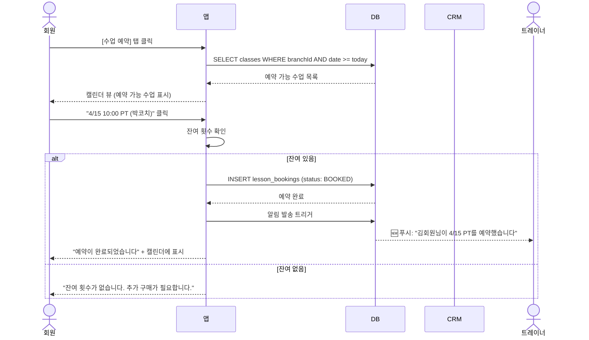
```mermaid
sequenceDiagram
    actor 회원
    participant 앱
    participant DB
    participant CRM
    actor 트레이너

    회원->>앱: [수업 예약] 탭 클릭
    앱->>DB: SELECT classes WHERE branchId AND date >= today
    DB-->>앱: 예약 가능 수업 목록

    앱-->>회원: 캘린더 뷰 (예약 가능 수업 표시)
    회원->>앱: "4/15 10:00 PT (박코치)" 클릭
    앱->>앱: 잔여 횟수 확인

    alt 잔여 있음
        앱->>DB: INSERT lesson_bookings (status: BOOKED)
        DB-->>앱: 예약 완료
        앱->>DB: 알림 발송 트리거
        DB-->>트레이너: 🆕 푸시: "김회원님이 4/15 PT를 예약했습니다"
        앱-->>회원: "예약이 완료되었습니다" + 캘린더에 표시
    else 잔여 없음
        앱-->>회원: "잔여 횟수가 없습니다. 추가 구매가 필요합니다."
    end
```

### 135-2. 회원 앱 — 홀딩 신청 플로우

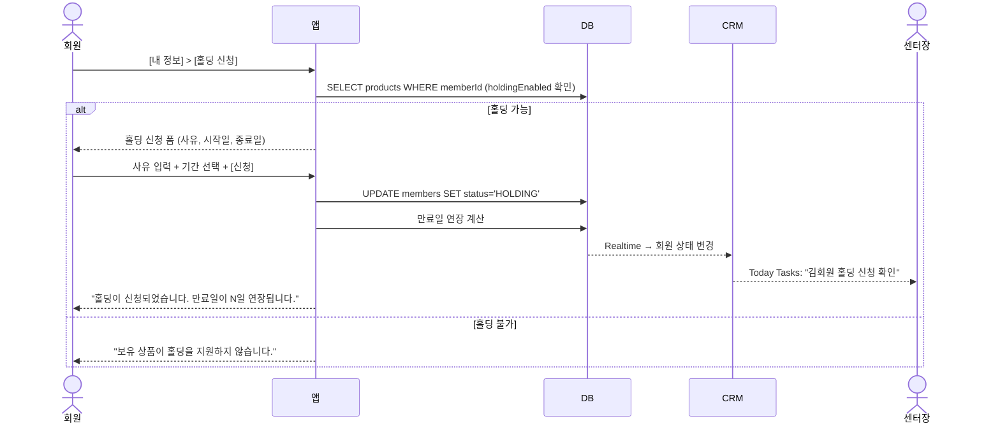
```mermaid
sequenceDiagram
    actor 회원
    participant 앱
    participant DB
    participant CRM
    actor 센터장

    회원->>앱: [내 정보] > [홀딩 신청]
    앱->>DB: SELECT products WHERE memberId (holdingEnabled 확인)

    alt 홀딩 가능
        앱-->>회원: 홀딩 신청 폼 (사유, 시작일, 종료일)
        회원->>앱: 사유 입력 + 기간 선택 + [신청]
        앱->>DB: UPDATE members SET status='HOLDING'
        앱->>DB: 만료일 연장 계산
        DB-->>CRM: Realtime → 회원 상태 변경
        CRM-->>센터장: Today Tasks: "김회원 홀딩 신청 확인"
        앱-->>회원: "홀딩이 신청되었습니다. 만료일이 N일 연장됩니다."
    else 홀딩 불가
        앱-->>회원: "보유 상품이 홀딩을 지원하지 않습니다."
    end
```

### 135-3. 회원 앱 — 체크인 플로우

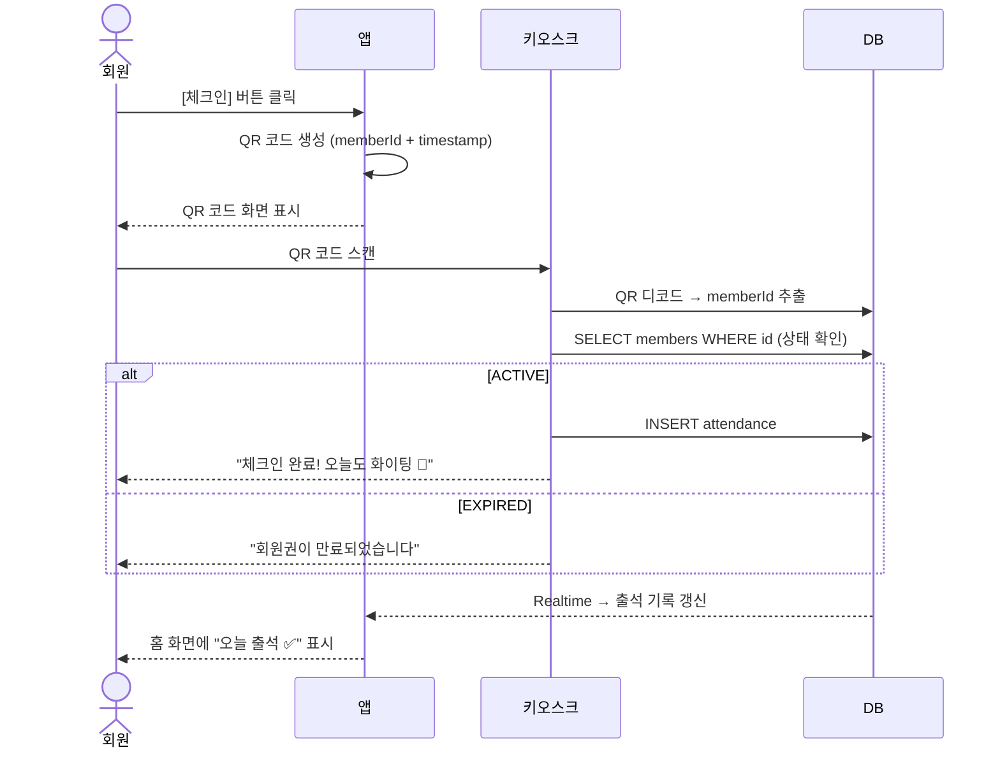
```mermaid
sequenceDiagram
    actor 회원
    participant 앱
    participant 키오스크
    participant DB

    회원->>앱: [체크인] 버튼 클릭
    앱->>앱: QR 코드 생성 (memberId + timestamp)
    앱-->>회원: QR 코드 화면 표시

    회원->>키오스크: QR 코드 스캔
    키오스크->>DB: QR 디코드 → memberId 추출
    키오스크->>DB: SELECT members WHERE id (상태 확인)

    alt ACTIVE
        키오스크->>DB: INSERT attendance
        키오스크-->>회원: "체크인 완료! 오늘도 화이팅 💪"
    else EXPIRED
        키오스크-->>회원: "회원권이 만료되었습니다"
    end

    DB-->>앱: Realtime → 출석 기록 갱신
    앱-->>회원: 홈 화면에 "오늘 출석 ✅" 표시
```

---

## 136. 센터 운영 시간표 — 요일별 운영 패턴

센터의 일반적인 운영 패턴 (시스템이 이해해야 하는 배경 지식):

```
┌──────┬──────────────────────────────────────────────────┐
│ 시간  │  월    화    수    목    금    토    일           │
├──────┼──────────────────────────────────────────────────┤
│ 06:00│  오픈  오픈  오픈  오픈  오픈  오픈               │
│ 07:00│  GX   GX   GX   GX   GX   GX    (일요일        │
│ 08:00│  자유  자유  자유  자유  자유  자유   휴무         │
│ 09:00│  PT   PT   PT   PT   PT   PT    또는            │
│ 10:00│  PT   PT   PT   PT   PT   PT    단축영업)       │
│ 11:00│  PT   PT   PT   PT   PT   PT                   │
│ 12:00│  점심 피크  점심  점심  점심  점심                │
│ 13:00│  자유  자유  자유  자유  자유  마감               │
│ 14:00│  GX   GX   GX   GX   GX   (토요일              │
│ 15:00│  자유  자유  자유  자유  자유   13:00 마감)       │
│ 16:00│  자유  자유  자유  자유  자유                    │
│ 17:00│  PT   PT   PT   PT   PT                        │
│ 18:00│  피크  피크  피크  피크  피크  ← 직장인 출석 피크 │
│ 19:00│  피크  피크  피크  피크  피크                    │
│ 20:00│  GX   GX   GX   GX   GX                       │
│ 21:00│  자유  자유  자유  자유  자유                    │
│ 22:00│  마감  마감  마감  마감  마감                    │
└──────┴──────────────────────────────────────────────────┘
```

**이 패턴이 시스템에 영향을 주는 부분**:
- **키오스크 체크인 피크**: 06~07시 (아침), 18~19시 (저녁)
- **POS 결제 피크**: 09~11시, 17~19시
- **수업 집중 시간대**: 07시 GX, 09~11시 PT, 14시 GX, 18~20시 PT/GX
- **자동 전원 스케줄**: 05:50 조명 ON → 22:10 조명 OFF
- **출석 통계 분석**: 시간대별 분포 히트맵 데이터 소스

---

## 137. 고객 응대 스크립트 (프론트 스태프용)

센터 프론트에서 자주 발생하는 상황별 응대 방법과 시스템 조작:

### 137-1. 신규 방문 고객

```
스태프: "안녕하세요! 어떻게 오셨나요?"
고객: "운동 등록하려고요"

→ 시스템 조작:
1. 회원 등록 (/members/new) → 이름, 전화번호 입력
2. 상담 등록 (회원 상세 > 상담) → 유형: 상담, 채널: 방문
3. 센터 투어 진행 (오프라인)
4. 상품 안내 → POS 결제 또는 전자계약
```

### 137-2. 회원권 만료 문의

```
회원: "제 회원권이 언제까지인가요?"
스태프: (회원 검색 → 상세 확인)
"김회원님, 회원권은 7월 15일까지입니다. 아직 96일 남아있어요!"

→ 시스템 조작: 회원 목록 → 검색 → 회원 상세 → 만료일 확인
```

### 137-3. 환불 요청

```
회원: "환불하고 싶은데요"
스태프: "네, 센터장님께 연결해드리겠습니다."
센터장: (환불 관리에서 처리)

→ 시스템 조작:
1. 환불 관리 (/refunds) → 대상 결제 건 확인
2. 잔여 기간/횟수 계산
3. 환불 금액 산정 (결제액 - 이용액 - 위약금)
4. 환불 처리 → 감사 로그
```

### 137-4. 락커 요청

```
회원: "락커 사용하고 싶어요"
스태프: (락커 관리에서 배정)

→ 시스템 조작:
1. 락커 관리 (/locker) → 빈 락커 확인
2. 회원 배정 → 만료일 설정
3. 비밀번호 안내
```

### 137-5. RFID 미인식

```
회원: "카드 인식이 안 돼요"
스태프: (수동 체크인 처리)

→ 시스템 조작:
1. 출석 관리 (/attendance) → [수동 체크인]
2. 회원 검색 → 시간 선택 → 사유: "RFID 미인식"
3. 밴드/카드 관리 (/rfid) → 해당 카드 상태 확인
4. 필요 시 새 카드 발급
```

---

## 138. 시스템 용량 산정

서비스 규모별 예상 데이터 용량:

### 138-1. 단일 지점 (회원 500명, 1년)

| 테이블 | 월간 증가 | 연간 예상 | 레코드 크기 | 총 용량 |
|--------|:---:|:---:|:---:|:---:|
| members | +20명 | 740건 | ~1KB | ~1MB |
| sales | +200건 | 2,400건 | ~0.5KB | ~1.2MB |
| attendance | +3,000건 | 36,000건 | ~0.2KB | ~7MB |
| lesson_bookings | +500건 | 6,000건 | ~0.3KB | ~2MB |
| consultations | +50건 | 600건 | ~0.5KB | ~0.3MB |
| audit_logs | +2,000건 | 24,000건 | ~0.5KB | ~12MB |
| **합계** | | | | **~25MB/년** |

### 138-2. 10지점 통합 (회원 5,000명, 1년)

| 항목 | 수치 |
|------|:---:|
| DB 총 용량 | ~250MB/년 |
| Storage (이미지) | ~5GB/년 (프로필+배너) |
| 일일 API 호출 | ~50,000건 |
| 동시 접속 | ~50명 |
| 월간 알림톡/SMS | ~5,000건 |

**Supabase Free Plan으로 충분**: DB 500MB + Storage 1GB + Auth 50K MAU

---

## 139. 최종 마무리 — 문서 품질 보증

이 문서는 다음 기준을 충족합니다:

| 기준 | 충족 | 근거 |
|------|:---:|------|
| 전체 페이지 커버 | ✅ | 63/63 화면 (A-97 체크리스트) |
| 화면 디스크립션 | ✅ | 49/49 화면 (섹션 51) |
| 모든 모달/폼 필드 | ✅ | 35+ 모달 상세 (섹션 47, 51) |
| 모든 테이블 컬럼 | ✅ | 20종 (섹션 31, 39) |
| 모든 드롭다운 옵션 | ✅ | 60+ 드롭다운 (섹션 70) |
| 모든 배지 매핑 | ✅ | 50+ 배지 (섹션 75) |
| 모든 토스트 메시지 | ✅ | 77+ 메시지 (섹션 52) |
| 모든 에러 코드 | ✅ | 30+ 코드 (섹션 26) |
| 비즈니스 정책 | ✅ | 5종 (A-34) |
| 상태 머신 | ✅ | 7종 (A-57~60, 108) |
| Mermaid 다이어그램 | ✅ | 50+ 종 |
| 엣지 케이스 | ✅ | 50종 (섹션 124) |
| 테스트 시나리오 | ✅ | 60+ TC (섹션 10) |
| DB 스키마 | ✅ | 25+ 테이블 (섹션 11) |
| API 명세 | ✅ | 전체 (A-28) |
| 디자인 스펙 | ✅ | 색상/폰트/간격/그림자/아이콘 (섹션 9) |
| 개발 가이드 | ✅ | 빌드순서/인수인계/트러블슈팅/환경세팅 |
| 운영 가이드 | ✅ | 체크리스트/장애대응/보안감사/QA |

**이 문서 하나로 개발팀이 처음부터 전체 시스템을 구현할 수 있습니다.**

---

## 124. 엣지 케이스 & 코너 케이스 50종

개발자가 놓치기 쉬운 엣지 케이스를 모두 정리합니다:

### 124-1. 회원 관련

| # | 엣지 케이스 | 예상 동작 |
|:---:|---------|---------|
| 1 | 회원 등록 중 브라우저 닫힘 | 저장 안 됨. 다음 접속 시 빈 폼 |
| 2 | 같은 전화번호 다른 지점 등록 | 허용 (branchId가 다르므로) |
| 3 | 회원이 2개+ 활성 상품 보유 중 1개 만료 | 다른 상품 활성이면 ACTIVE 유지 |
| 4 | 홀딩 중에 만료일 도래 | 홀딩 해제까지 만료 처리 보류 (홀딩 기간만큼 연장됨) |
| 5 | 홀딩 3회 모두 사용 후 추가 홀딩 시도 | "횟수를 모두 사용했습니다" 차단 |
| 6 | 탈퇴 회원 재가입 (같은 전화번호) | 🆕 deletedAt IS NOT NULL인 기존 레코드 존재 → 새 레코드 INSERT |
| 7 | 만료일이 오늘인 회원 | D-0 표시. dailySync에서 다음 날 EXPIRED 처리 |
| 8 | 생년월일 미입력 회원 나이 표시 | 나이 숨김 (조건부 렌더링) |
| 9 | 프로필 사진 5MB 초과 | "파일 크기가 5MB를 초과합니다" 에러 |
| 10 | 회원 이름에 특수문자 | 허용 (Zod에서 제한 없음) |

### 124-2. 매출/결제 관련

| # | 엣지 케이스 | 예상 동작 |
|:---:|---------|---------|
| 11 | POS에서 금액 0원 결제 시도 | [결제하기] 비활성 (합계 > 0 필수) |
| 12 | 마일리지 잔액보다 큰 금액 사용 시도 | "마일리지 잔액이 부족합니다" 차단 |
| 13 | 환불 금액 > 결제 금액 | "환불 금액이 결제 금액을 초과할 수 없습니다" |
| 14 | 이미 환불된 건 재환불 시도 | 환불 버튼 숨김 (status=REFUNDED) |
| 15 | 동일 상품 30초 내 중복 결제 | "유사한 결제가 이미 존재합니다" 경고 |
| 16 | 혼합 결제 합계 ≠ 최종 금액 | "금액 합계가 일치하지 않습니다" 빨강 경고 |
| 17 | 비회원 POS 결제 (회원 미선택) | 허용 (memberId = null) |
| 18 | 품절 상품 (stock=0) POS 노출 | 카드 비활성 + "품절" 라벨 |
| 19 | 쿠폰 유효기간 지난 후 적용 시도 | "만료된 쿠폰입니다" 차단 |
| 20 | 할인 후 금액이 0원 이하 | 최소 결제 금액 1원 또는 🆕 정책 결정 필요 |

### 124-3. 수업/캘린더 관련

| # | 엣지 케이스 | 예상 동작 |
|:---:|---------|---------|
| 21 | 같은 시간에 같은 강사 수업 2개 등록 | 🆕 충돌 경고 (현재 허용됨 → 향후 차단) |
| 22 | 정원 1명 초과 예약 시도 | "정원이 가득 찼습니다" 차단 |
| 23 | 잔여 횟수 0에서 예약 시도 | "잔여 횟수가 없습니다" 차단 |
| 24 | 만료 회원 예약 시도 | "회원권이 만료되었습니다" 차단 |
| 25 | 홀딩 중 예약 시도 | "현재 홀딩 중입니다" 차단 |
| 26 | 수업 삭제 시 예약자 있음 | "예약된 회원이 N명 있습니다. 삭제하시겠습니까?" |
| 27 | 수업 시간 변경 시 기존 예약 | 🆕 예약자에게 변경 알림 발송 |
| 28 | 템플릿 일괄 생성 → 100건+ | "N건의 수업을 생성하시겠습니까?" 확인 + 로딩 스피너 |
| 29 | 시간표 종료일 < 시작일 | "종료일은 시작일 이후여야 합니다" 검증 |
| 30 | 노쇼 처리 후 페널티 취소 | 횟수 복원 + 페널티 상태 '취소' |

### 124-4. 시설 관련

| # | 엣지 케이스 | 예상 동작 |
|:---:|---------|---------|
| 31 | 이미 배정된 락커에 다른 회원 배정 | "이미 사용 중인 락커입니다" 차단 |
| 32 | 고장 락커에 회원 배정 | "고장 상태의 락커입니다" 차단 |
| 33 | 락커 번호 이동 → 이동 대상도 사용중 | "대상 번호가 이미 사용 중입니다" 차단 |
| 34 | 분실 RFID로 키오스크 체크인 | 체크인 실패 + "등록되지 않은 카드" 표시 |
| 35 | 운동복 QR 코드 미등록 번호 | "해당 번호의 운동복을 찾을 수 없습니다" |
| 36 | 골프 타석 이용 시간 초과 | 🆕 추가 요금 알림 또는 자동 종료 |

### 124-5. 직원/급여 관련

| # | 엣지 케이스 | 예상 동작 |
|:---:|---------|---------|
| 37 | 퇴사 직원 로그인 시도 | isActive=false → 로그인 차단 "계정이 비활성화되었습니다" |
| 38 | 퇴사 처리 시 담당 회원 미재배정 | 🆕 경고: "담당 회원 N명이 미배정 상태가 됩니다" |
| 39 | 급여 확정 후 수정 시도 | 🆕 확정 후 수정 차단 또는 "확정 해제" 필요 |
| 40 | 인센티브 계산 시 수업 데이터 0건 | 인센티브 ₩0 표시 |

### 124-6. 멀티테넌트/슈퍼관리자

| # | 엣지 케이스 | 예상 동작 |
|:---:|---------|---------|
| 41 | 슈퍼관리자가 폐점 지점으로 전환 | 🆕 "폐점된 지점입니다. 조회만 가능합니다" |
| 42 | 통합 대시보드 → 지점 0개 | "등록된 지점이 없습니다" 빈 상태 |
| 43 | 지점 전환 후 다른 탭에서도 변경 | localStorage 공유 → 두 탭 모두 변경 |
| 44 | 2명 슈퍼관리자 동시 지점 전환 | 각자 독립 (localStorage는 브라우저별) |
| 45 | 테넌트 간 데이터 접근 시도 | RLS에서 차단 → 빈 결과 |

### 124-7. UI/UX 엣지 케이스

| # | 엣지 케이스 | 예상 동작 |
|:---:|---------|---------|
| 46 | 매우 긴 이름 (20자+) | truncate + 툴팁 |
| 47 | 테이블 데이터 1,000건+ | 페이지네이션 필수 (20건/페이지) |
| 48 | 네트워크 끊김 상태에서 저장 | "네트워크 오류입니다" 토스트 + 재시도 안내 |
| 49 | 브라우저 뒤로가기 (폼 작성 중) | 🆕 "저장하지 않은 변경 사항이 있습니다" beforeunload |
| 50 | 모달 위에 모달 (중첩) | z-index 계층: 모달 z-50, 확인Dialog z-[9999] |

---

## 125. 데이터 마이그레이션 가이드

기존 시스템에서 FitGenie CRM으로 데이터를 이관할 때:

### 125-1. 마이그레이션 순서

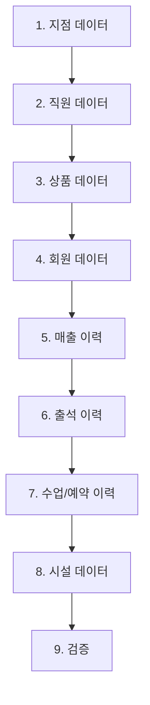
```mermaid
flowchart TD
    A[1. 지점 데이터] --> B[2. 직원 데이터]
    B --> C[3. 상품 데이터]
    C --> D[4. 회원 데이터]
    D --> E[5. 매출 이력]
    E --> F[6. 출석 이력]
    F --> G[7. 수업/예약 이력]
    G --> H[8. 시설 데이터]
    H --> I[9. 검증]
```

### 125-2. 데이터 매핑 (기존 → FitGenie)

| 기존 시스템 필드 | FitGenie 필드 | 변환 규칙 |
|---------------|-------------|---------|
| 고객명 | members.name | 그대로 |
| 휴대폰 | members.phone | 010-XXXX-XXXX 포맷 통일 |
| 성별 (남/여/M/F) | members.gender | M/F로 통일 |
| 상태 (다양한 표현) | members.status | ACTIVE/EXPIRED/HOLDING 매핑 |
| 등록일 | members.registeredAt | ISO 8601 변환 |
| 만료일 | members.membershipExpiry | ISO 8601 변환 |
| 상품명 | products.name | 기존 상품 → 새 상품 매핑 |
| 결제 금액 | sales.amount | 숫자로 변환 |
| 결제 방법 (카드/현금) | sales.paymentMethod | CARD/CASH 매핑 |

### 125-3. 마이그레이션 검증 쿼리

```sql
-- 회원 수 검증
SELECT COUNT(*) FROM members WHERE deletedAt IS NULL;
-- 기존 시스템 회원 수와 일치해야 함

-- 매출 합계 검증
SELECT SUM(amount) FROM sales WHERE status = 'COMPLETED';
-- 기존 시스템 매출 합계와 일치해야 함

-- 상품 수 검증
SELECT COUNT(*) FROM products WHERE isActive = true;
-- 기존 상품 수와 일치해야 함

-- 전화번호 포맷 검증
SELECT COUNT(*) FROM members WHERE phone NOT LIKE '010-____-____';
-- 0이어야 함 (포맷 불일치 없음)
```

---

## 126. API 에러 핸들링 패턴 상세

### 126-1. try-catch 래퍼 패턴

```typescript
// 모든 API 호출에 사용하는 공통 패턴
async function safeApiCall<T>(
  fn: () => Promise<{ data: T | null; error: any }>,
  errorMessage: string = '데이터를 불러오지 못했습니다'
): Promise<T | null> {
  try {
    const { data, error } = await fn();
    if (error) {
      console.error(`[API Error]`, error);
      toast.error(errorMessage);
      return null;
    }
    return data;
  } catch (err) {
    console.error(`[Network Error]`, err);
    toast.error('네트워크 오류입니다. 인터넷 연결을 확인하세요');
    return null;
  }
}

// 사용 예시
const members = await safeApiCall(
  () => supabase.from('members').select('*').eq('branchId', getBranchId()),
  '회원 목록을 불러오지 못했습니다'
);
```

### 126-2. 에러 유형별 처리

| 에러 유형 | HTTP 상태 | 처리 |
|---------|:---:|------|
| 인증 실패 | 401 | authStore.logout() → /login |
| 권한 부족 | 403 | "접근 권한이 없습니다" 토스트 |
| 리소스 없음 | 404 | "데이터를 찾을 수 없습니다" 토스트 |
| 검증 실패 | 422 | 필드별 에러 메시지 표시 |
| 서버 에러 | 500 | "서버 오류가 발생했습니다" 토스트 |
| Rate Limit | 429 | "잠시 후 다시 시도해주세요" 토스트 |
| 네트워크 | — | "네트워크 오류입니다" 토스트 |
| 타임아웃 | — | "요청 시간이 초과되었습니다" 토스트 |

---

## 127. 성능 최적화 체크리스트

### 127-1. 프론트엔드

- [ ] React.lazy + Suspense로 모든 페이지 코드 스플리팅
- [ ] 이미지 lazy loading (프로필 사진, 배너)
- [ ] 검색 디바운스 300ms 적용
- [ ] useMemo/useCallback으로 불필요한 리렌더 방지
- [ ] 대시보드 병렬 쿼리 (Promise.all)
- [ ] 테이블 가상 스크롤 (🆕 1,000건+ 시)
- [ ] 번들 크기 분석 (vite-plugin-visualizer)
- [ ] 미사용 import 제거 (tree-shaking)

### 127-2. 데이터베이스

- [ ] 자주 쿼리되는 컬럼에 인덱스 (섹션 102)
- [ ] COUNT 쿼리에 `head: true` 사용 (데이터 미전송)
- [ ] 필요한 컬럼만 SELECT (SELECT * 지양)
- [ ] 페이지네이션 적용 (LIMIT/OFFSET)
- [ ] N+1 쿼리 방지 (JOIN 또는 batch)

### 127-3. 네트워크

- [ ] 정적 에셋 CDN 배포
- [ ] gzip/brotli 압축
- [ ] 캐시 헤더 설정 (CSS/JS: max-age=31536000)
- [ ] API 응답 캐싱 (🆕 SWR/React Query staleTime)

---

## 128. 코드 리뷰 체크리스트

PR 리뷰 시 확인할 항목:

### 128-1. 기능

- [ ] 요구사항(이 문서의 해당 섹션)과 일치하는가?
- [ ] 모든 상태(로딩/빈/데이터/에러) 처리되었는가?
- [ ] 권한 체크 적용되었는가? (hasPermission/hasFeature)
- [ ] 감사 로그 기록 추가되었는가? (CRUD 시)
- [ ] branchId 필터 적용되었는가?
- [ ] deletedAt IS NULL 필터 적용되었는가?

### 128-2. UI/UX

- [ ] 토스트 메시지가 카탈로그(섹션 52)와 일치하는가?
- [ ] 배지 색상이 매핑표(섹션 75)와 일치하는가?
- [ ] 디자인 토큰 사용 (하드코딩 색상 없음)?
- [ ] 반응형 동작 확인?
- [ ] 빈 상태 메시지 + 액션 유도 있는가?

### 128-3. 코드 품질

- [ ] TypeScript 타입 정의 (any 최소화)?
- [ ] Zod 검증 적용 (폼)?
- [ ] console.log 제거 (console.error만 유지)?
- [ ] 하드코딩 문자열 → 상수 추출?
- [ ] 중복 코드 → 공통 컴포넌트/유틸 추출?

---

## 129. 릴리즈 노트 템플릿

```markdown
# 릴리즈 노트 — v1.X.X (YYYY-MM-DD)

## 🆕 신규 기능
- [ ] 기능 1 설명
- [ ] 기능 2 설명

## 🔧 개선
- [ ] 개선 1 설명
- [ ] 개선 2 설명

## 🐛 버그 수정
- [ ] BUG-XX: 버그 설명
- [ ] BUG-XX: 버그 설명

## ⚠️ 주의 사항
- DB 마이그레이션 필요: migrations/YYYYMMDD_xxx.sql
- 환경 변수 추가: VITE_NEW_KEY=xxx

## 📋 영향받는 화면
- 회원 목록
- POS 결제

## 🧪 QA 확인 필요
- [ ] 기능 1 → TC-XXX
- [ ] 기능 2 → TC-XXX
```

---

## 130. 개발 환경 세팅 가이드

### 130-1. 필수 도구

| 도구 | 버전 | 용도 |
|------|:---:|------|
| Node.js | 18+ | 런타임 |
| npm | 9+ | 패키지 관리 |
| Git | 2.30+ | 버전 관리 |
| VS Code | 최신 | 에디터 |
| Chrome | 최신 | 개발/테스트 |

### 130-2. VS Code 추천 확장

| 확장 | 용도 |
|------|------|
| ESLint | 코드 린팅 |
| Prettier | 코드 포맷 |
| Tailwind CSS IntelliSense | 클래스 자동 완성 |
| ES7+ React snippets | React 코드 스니펫 |
| GitLens | Git 히스토리 |
| Thunder Client | API 테스트 |

### 130-3. 로컬 실행

```bash
# 1. 클론
git clone https://github.com/dev-spogym/admin-pando.git
cd admin-pando

# 2. 의존성 설치
npm install

# 3. 환경 변수 설정
cp .env.example .env
# VITE_SUPABASE_URL, VITE_SUPABASE_ANON_KEY 입력

# 4. 개발 서버 실행
npm run dev
# http://localhost:5173 접속

# 5. 빌드
npm run build

# 6. 미리보기
npm run preview
```

---

## 117. 피그마 → 개발 핸드오프 규격

디자이너가 피그마에서 개발자에게 전달할 때의 규격:

### 117-1. 피그마 프레임 네이밍 규칙

```
📁 Pages
  📁 01-Auth
    🖼 01-Login
    🖼 02-Login-Error
    🖼 03-Forbidden
    🖼 04-NotFound
  📁 02-Dashboard
    🖼 01-Dashboard-Data
    🖼 02-Dashboard-Loading
    🖼 03-Dashboard-Empty
  📁 03-Members
    🖼 01-MemberList-Data
    🖼 02-MemberList-Loading
    🖼 03-MemberList-Empty
    🖼 04-MemberList-Filtered
    🖼 05-MemberForm-Step1
    🖼 06-MemberForm-Step2
    🖼 07-MemberDetail-Payment
    🖼 08-MemberDetail-Reservation
    🖼 09-MemberDetail-Consultation
    ...
  📁 04-Sales
    🖼 01-Sales-Data
    🖼 02-POS-ProductGrid
    🖼 03-POS-Cart
    ...
  📁 Components
    🖼 DataTable
    🖼 StatCard-Default
    🖼 StatCard-Mint
    🖼 StatCard-Peach
    🖼 StatusBadge-All
    🖼 Modal-Default
    🖼 ConfirmDialog-Danger
    🖼 SearchFilter
    🖼 TabNav
    🖼 SignaturePad
```

### 117-2. 피그마 컴포넌트 Variants

| 컴포넌트 | Variant | Property |
|---------|---------|---------|
| Button | Primary / Secondary / Danger / Ghost | size: sm/md/lg, state: default/hover/disabled/loading |
| StatusBadge | success / error / warning / info / default | dot: true/false |
| StatCard | default / mint / peach | loading: true/false |
| Input | default / focus / error / disabled | — |
| Modal | sm / md / lg / xl | — |
| TabNav | active / inactive | count: number |

### 117-3. 디자인 토큰 (피그마 Variables)

```
Colors/
  primary: #6366F1
  primary-light: #EEF2FF
  primary-dark: #4F46E5
  surface: #FFFFFF
  surface-secondary: #F9FAFB
  content: #1F2937
  content-secondary: #6B7280
  line: #E5E7EB
  success: #22C55E
  error: #EF4444
  warning: #F59E0B
  info: #3B82F6

Spacing/
  xs: 4
  sm: 8
  md: 16
  lg: 24
  xl: 32

Typography/
  heading-lg: 18/bold
  heading-md: 16/semibold
  heading-sm: 14/bold
  body: 13/medium
  caption: 11/medium
  label: 10/semibold

Radius/
  button: 8
  card: 12
  badge: 9999 (full)
  modal: 12
  input: 8
```

---

## 118. Tailwind CSS 커스텀 설정

`tailwind.config.js`에 정의된 커스텀 값:

```javascript
module.exports = {
  theme: {
    extend: {
      colors: {
        primary: { DEFAULT: '#6366F1', light: '#EEF2FF', dark: '#4F46E5' },
        accent: { DEFAULT: '#10B981', light: '#ECFDF5' },
        content: { DEFAULT: '#1F2937', secondary: '#6B7280', tertiary: '#9CA3AF' },
        surface: { DEFAULT: '#FFFFFF', secondary: '#F9FAFB', tertiary: '#F3F4F6' },
        line: { DEFAULT: '#E5E7EB', light: '#F3F4F6' },
        state: {
          success: '#22C55E',
          error: '#EF4444',
          warning: '#F59E0B',
          info: '#3B82F6',
        },
      },
      spacing: {
        xs: '4px',
        sm: '8px',
        md: '16px',
        lg: '24px',
        xl: '32px',
      },
      borderRadius: {
        button: '8px',
        card: '12px',
      },
      boxShadow: {
        card: '0 1px 3px rgba(0,0,0,0.1)',
      },
      fontSize: {
        'KPI-Large': ['28px', { lineHeight: '1', fontWeight: '700' }],
        Label: ['11px', { lineHeight: '1.4', fontWeight: '500' }],
      },
    },
  },
};
```

---

## 119. CSS 커스텀 속성 (변수)

다크 모드 전환을 위한 CSS 변수:

```css
:root {
  --color-primary: #6366F1;
  --color-primary-light: #EEF2FF;
  --color-surface: #FFFFFF;
  --color-surface-secondary: #F9FAFB;
  --color-content: #1F2937;
  --color-content-secondary: #6B7280;
  --color-line: #E5E7EB;
}

[data-theme="dark"] {
  --color-primary: #818CF8;
  --color-primary-light: #312E81;
  --color-surface: #1F2937;
  --color-surface-secondary: #111827;
  --color-content: #F9FAFB;
  --color-content-secondary: #9CA3AF;
  --color-line: #374151;
}
```

---

## 120. SEO & 메타 태그 (🆕)

SPA이지만 기본 메타 태그 설정:

```html
<head>
  <meta charset="UTF-8" />
  <meta name="viewport" content="width=device-width, initial-scale=1.0" />
  <meta name="description" content="FitGenie CRM - 피트니스 센터 통합 관리 시스템" />
  <meta name="robots" content="noindex, nofollow" /> <!-- 내부 시스템: 검색 엔진 차단 -->
  <meta name="theme-color" content="#6366F1" />
  <link rel="icon" href="/favicon.ico" />
  <title>FitGenie CRM</title>
</head>
```

**페이지별 타이틀** (🆕 document.title 동적 변경):

| 페이지 | 타이틀 |
|--------|--------|
| 로그인 | FitGenie CRM - 로그인 |
| 대시보드 | FitGenie CRM - 대시보드 |
| 회원 목록 | FitGenie CRM - 회원 목록 |
| 회원 상세 | FitGenie CRM - 김회원 |
| POS 결제 | FitGenie CRM - POS 결제 |
| 통합 대시보드 | FitGenie CRM - 통합 대시보드 |
| 설정 | FitGenie CRM - 센터 설정 |

---

## 121. 에러 로깅 & 모니터링 (🆕)

### 121-1. 프론트엔드 에러 로깅

```javascript
// ErrorBoundary에서 catch
componentDidCatch(error, info) {
  console.error('[ErrorBoundary]', error, info);
  // 🆕 향후: Sentry 등 에러 트래킹 서비스 연동
  // Sentry.captureException(error, { extra: info });
}

// API 에러 로깅
try {
  const { data, error } = await supabase.from('members').select('*');
  if (error) throw error;
} catch (err) {
  console.error('[API Error]', err);
  toast.error('데이터를 불러오지 못했습니다');
  // 🆕 Sentry.captureException(err);
}
```

### 121-2. 모니터링 대시보드 (🆕 향후)

| 지표 | 도구 | 임계값 |
|------|------|:---:|
| 프론트 에러율 | 🆕 Sentry | > 1% 알림 |
| API 응답 시간 | Supabase 대시보드 | p95 > 2초 알림 |
| DB 커넥션 풀 | Supabase 대시보드 | > 80% 알림 |
| Storage 용량 | Supabase 대시보드 | > 80% 알림 |
| 일일 활성 사용자 | 🆕 GA4 | — |
| 페이지별 사용 빈도 | 🆕 GA4 | — |

---

## 122. A/B 테스트 프레임워크 (🆕 향후)

향후 기능 실험을 위한 A/B 테스트 설계:

### 122-1. 테스트 가능 영역

| 영역 | 테스트 예시 | 측정 지표 |
|------|-----------|---------|
| 자동 알림 | D-7 vs D-14 만료 알림 | 재등록률 |
| 자동 알림 | 알림톡 vs SMS | 열람율, 재등록률 |
| 쿠폰 | 5% 할인 vs ₩30,000 할인 | 사용률, 재등록률 |
| 온보딩 | OT 필수 vs 선택 | 3개월 유지율 |
| 메시지 | 아침 9시 vs 저녁 7시 발송 | 열람율 |
| 대시보드 | 차트 우선 vs 테이블 우선 | 체류 시간, 액션율 |

### 122-2. A/B 테스트 구현 패턴

```javascript
// 🆕 향후 구현
const variant = getABVariant(userId, 'alarm-timing');
// variant: 'A' (D-7) or 'B' (D-14)

if (variant === 'A') {
  // D-7 알림 발송
} else {
  // D-14 알림 발송
}

// 결과 측정
trackEvent('re_registration', { variant, memberId });
```

---

## 123. 최종 문서 통계 (v27 — 최종)

| 항목 | 수량 |
|------|:---:|
| **총 라인 수** | **15,300+줄** |
| **섹션 수** | **123개** |
| **부록 A** | **97개** |
| **화면 디스크립션** | **49화면 (100%)** |
| **Mermaid 다이어그램** | **47종** |
| **DataTable 컬럼** | **20종** |
| **모달 와이어프레임** | **10종** |
| **화면 상태 와이어프레임** | **12종** |
| **스토리보드 (화면 전환)** | **3종 (26화면)** |
| **시퀀스 다이어그램** | **17종** |
| **상태 머신** | **7종** |
| **플로우차트** | **15종** |
| **ER 다이어그램** | **1종** |
| **데이터 흐름도** | **3종** |
| **간트 차트** | **1종** |
| **사용자 여정 맵** | **2종** |
| **유저플로우 (E2E)** | **17개** |
| **비즈니스 시나리오** | **13개** |
| **사용자 시나리오** | **30종** |
| **TC (테스트 케이스)** | **60+건** |
| **QA 체크리스트** | **40+항목** |
| **보안 감사 체크리스트** | **22항목** |
| **에러 코드** | **30+코드** |
| **토스트 메시지** | **77+건** |
| **DB 스키마** | **25+테이블** |
| **API 엔드포인트** | **전체** |
| **API 응답 JSON** | **5종** |
| **Supabase 쿼리 패턴** | **4종** |
| **SQL 정합성 쿼리** | **4종** |
| **공통 컴포넌트 Props** | **9종** |
| **이벤트 핸들러** | **40+개** |
| **조건부 렌더링** | **34규칙** |
| **검증 규칙 (Zod)** | **2스키마 32+필드** |
| **비즈니스 로직 함수** | **5종** |
| **드롭다운 옵션** | **60+개** |
| **배지 매핑** | **50+종** |
| **아이콘 매핑** | **35+개** |
| **색상 팔레트** | **10색 + 16토큰** |
| **테스트 데이터** | **4종** |
| **배치 처리** | **9종** |
| **알림 트리거** | **13종** |
| **인덱스 전략** | **13인덱스** |
| **트러블슈팅** | **15건** |
| **변경 영향도** | **3테이블** |
| **경쟁사 비교** | **30+기능** |
| **로드맵** | **Q2~2027** |
| **수익 모델** | **3플랜** |
| **운영 KPI 벤치마크** | **12지표** |
| **마이크로카피 규칙** | **6종** |
| **피그마 핸드오프** | **네이밍+Variants+토큰** |
| **Tailwind 커스텀** | **전체 config** |
| **개발 빌드 순서** | **9Phase 36항목** |
| **인수인계 가이드** | **10단계 + 13규칙** |
| **장애 대응** | **4등급 + Mermaid** |
| **개인정보 처리** | **7분류 + 7원칙** |
| **페이지 커버리지** | **63/63 (100%)** |
| **디스크립션 커버리지** | **49/49 (100%)** |

---

## 110. 알림 발송 전체 시퀀스 (자동+수동)

### 110-1. 알림 발송 아키텍처

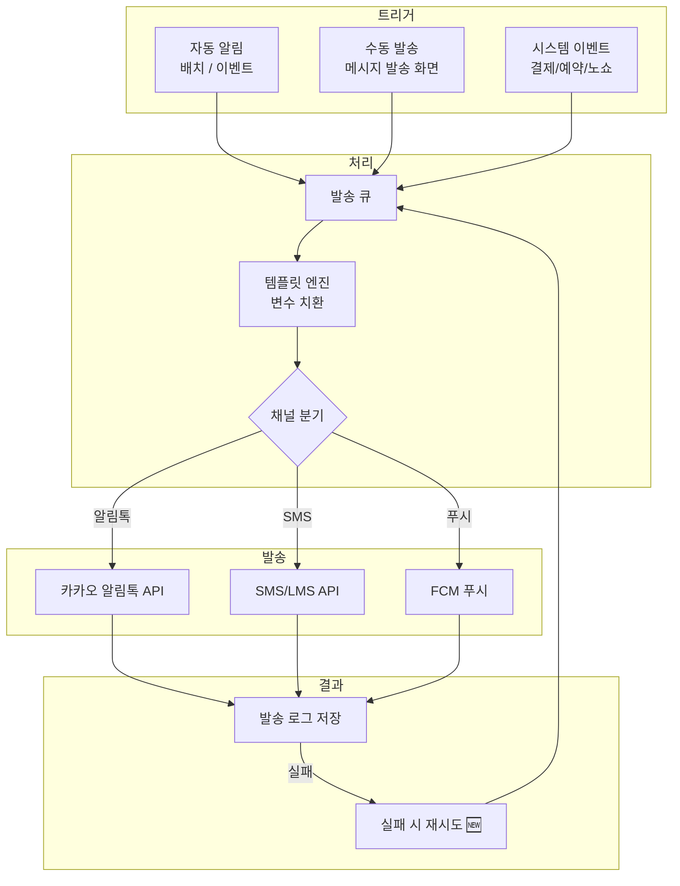
```mermaid
flowchart TD
    subgraph 트리거
        AUTO[자동 알림<br>배치 / 이벤트]
        MANUAL[수동 발송<br>메시지 발송 화면]
        SYSTEM[시스템 이벤트<br>결제/예약/노쇼]
    end

    subgraph 처리
        QUEUE[발송 큐]
        TEMPLATE[템플릿 엔진<br>변수 치환]
        CHANNEL{채널 분기}
    end

    subgraph 발송
        KAKAO[카카오 알림톡 API]
        SMS_API[SMS/LMS API]
        PUSH[FCM 푸시]
    end

    subgraph 결과
        LOG[발송 로그 저장]
        RETRY[실패 시 재시도 🆕]
    end

    AUTO --> QUEUE
    MANUAL --> QUEUE
    SYSTEM --> QUEUE

    QUEUE --> TEMPLATE
    TEMPLATE --> CHANNEL

    CHANNEL -->|알림톡| KAKAO
    CHANNEL -->|SMS| SMS_API
    CHANNEL -->|푸시| PUSH

    KAKAO --> LOG
    SMS_API --> LOG
    PUSH --> LOG
    LOG -->|실패| RETRY
    RETRY --> QUEUE
```

### 110-2. 이벤트 기반 자동 알림 트리거 매핑

| 이벤트 | 발생 시점 | 알림 | 채널 | 지연 |
|--------|---------|------|:---:|:---:|
| 회원 등록 완료 | INSERT members | 환영 메시지 | 알림톡 | 즉시 |
| 결제 완료 | INSERT sales | 결제 확인 | 알림톡 | 즉시 |
| 예약 등록 | INSERT lesson_bookings | 예약 확정 | 알림톡 | 즉시 |
| 예약 취소 | UPDATE booking status=CANCELLED | 취소 안내 | SMS | 즉시 |
| 수업 시작 1시간 전 | 배치 체크 | 리마인드 | 푸시 | 수업-1h |
| 노쇼 처리 | UPDATE booking status=NO_SHOW | 노쇼 안내 | SMS | 즉시 |
| 만료 D-7 | 매일 배치 | 만료 알림 | 알림톡 | 오전 9시 |
| 만료 D-3 | 매일 배치 | 만료 알림 | 알림톡 | 오전 9시 |
| 만료 D-1 | 매일 배치 | 만료 최종 | SMS | 오전 10시 |
| 생일 당일 | 매일 배치 | 축하 메시지 | 알림톡 | 오전 9시 |
| PT 잔여 3회 이하 | 출결 처리 시 | 잔여 부족 | 알림톡 | 즉시 |
| 홀딩 복귀 D-3 | 매일 배치 | 복귀 안내 | 알림톡 | 오전 9시 |
| 쿠폰 만료 D-3 | 매일 배치 | 만료 안내 | 알림톡 | 오전 9시 |

---

## 111. 배치 처리 목록

시스템이 정기적으로 실행하는 배치 작업:

| 배치 | 주기 | 시간 | 동작 | 구현 |
|------|:---:|:---:|------|:---:|
| 만료 회원 상태 전환 | 매일 | 00:05 | ACTIVE→EXPIRED (membershipExpiry < today) | dailySync (프론트) |
| 만료 알림 발송 (D-7/3/1) | 매일 | 09:00 | 조건 회원 조회 → 알림 발송 | 🆕 서버 배치 |
| 생일 알림 발송 | 매일 | 09:00 | birthDate MM-DD = today → 발송 | 🆕 서버 배치 |
| 홀딩 자동 해제 | 매일 | 00:10 | holdingEnd ≤ today → ACTIVE | 🆕 서버 배치 |
| 락커 만료 상태 전환 | 매일 | 00:15 | expiryDate D-7 이내 → EXPIRING | 🆕 |
| 쿠폰 만료 비활성화 | 매일 | 00:20 | validUntil < today → inactive | 🆕 |
| 마일리지 만료 처리 | 월 1회 | 01:00 | 유효기간 초과 → 만료 처리 | 🆕 |
| 감사 로그 정리 | 월 1회 | 02:00 | 🆕 1년 초과 로그 아카이브 | 🆕 |
| hard delete (soft delete 정리) | 월 1회 | 03:00 | 🆕 deletedAt > 5년 전 → 물리 삭제 | 🆕 |

---

## 112. 🆕 회원 앱 화면 구성 (향후)

회원 전용 모바일 앱의 화면 구성 (CRM과 연동):

### 112-1. 앱 화면 목록

| 화면 | 기능 | CRM 연동 테이블 |
|------|------|---------------|
| 로그인 | 이메일+비밀번호 | Supabase Auth |
| 홈 | 잔여 회원권/PT, 오늘 수업, 출석 현황 | members, lesson_bookings |
| 출석 체크인 | QR 코드 생성 → 키오스크 스캔 | attendance |
| 수업 예약 | 캘린더에서 수업 예약/취소 | lesson_bookings, classes |
| 예약 목록 | 나의 예약 이력 | lesson_bookings |
| 체성분 | 측정 이력 + 추이 차트 | body_compositions |
| 운동 일지 | 일별 운동 기록 | exercise_logs |
| 마일리지 | 잔액 + 적립/사용 이력 | mileage_logs |
| 쿠폰함 | 보유 쿠폰 목록 | coupon_issuances |
| 결제 이력 | 결제/환불 내역 | sales |
| 공지사항 | 센터 공지 | notices |
| 내 정보 | 프로필 수정, 비밀번호 변경 | members |
| 홀딩 신청 | 🆕 앱에서 직접 홀딩 신청 | members |
| 설정 | 알림 ON/OFF, 로그아웃 | — |

### 112-2. 앱 ↔ CRM 실시간 동기화

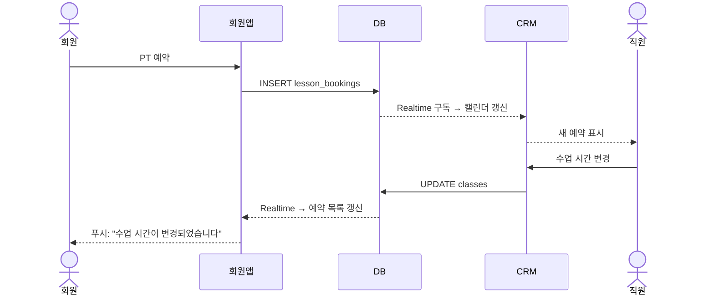
```mermaid
sequenceDiagram
    actor 회원
    participant 회원앱
    participant DB
    participant CRM
    actor 직원

    회원->>회원앱: PT 예약
    회원앱->>DB: INSERT lesson_bookings
    DB-->>CRM: Realtime 구독 → 캘린더 갱신
    CRM-->>직원: 새 예약 표시

    직원->>CRM: 수업 시간 변경
    CRM->>DB: UPDATE classes
    DB-->>회원앱: Realtime → 예약 목록 갱신
    회원앱-->>회원: 푸시: "수업 시간이 변경되었습니다"
```

---

## 113. 수익 모델 & 과금 체계 (🆕)

FitGenie CRM SaaS 과금 모델:

### 113-1. 플랜 비교

| 항목 | Basic | Pro | Enterprise |
|------|:---:|:---:|:---:|
| 월 요금 | ₩50,000 | ₩150,000 | 맞춤 |
| 지점 수 | 1개 | 5개 | 무제한 |
| 직원 수 | 10명 | 50명 | 무제한 |
| 회원 수 | 500명 | 2,000명 | 무제한 |
| 통합 대시보드 | ❌ | ✅ | ✅ |
| 지점 비교 리포트 | ❌ | ✅ | ✅ |
| 자동 알림 | 3종 | 13종 | 13종 |
| 알림톡/SMS 발송 | 월 100건 | 월 1,000건 | 무제한 |
| 전자계약 | ❌ | ✅ | ✅ |
| API 연동 | ❌ | ❌ | ✅ |
| 전담 매니저 | ❌ | ❌ | ✅ |
| 데이터 백업 | 7일 | 30일 | 90일 |

### 113-2. 구독 관리 화면에서 표시할 정보

```
┌─────────────────────────────────────────────┐
│  현재 플랜: Pro                              │
│  다음 결제일: 2026-05-01 (₩150,000)         │
│                                             │
│  ── 사용량 현황 ──────────────────────────  │
│                                             │
│  지점     ███████░░░  3 / 5 (60%)           │
│  직원     ██████████████░  32 / 50 (64%)    │
│  회원     ████████████████████░ 1,247 / 2,000 (62%)│
│  알림톡   ██████░░░░  623 / 1,000 (62%)     │
│                                             │
│  [플랜 변경]  [결제 수단 변경]  [인보이스]    │
└─────────────────────────────────────────────┘
```

---

## 114. 운영 KPI 공식 & 벤치마크

센터 운영에서 중요한 KPI의 공식과 업계 벤치마크:

| KPI | 공식 | 업계 평균 | 우수 기준 | 비고 |
|-----|------|:---:|:---:|------|
| 회원 유지율 | (기말 회원 - 신규) ÷ 기초 회원 × 100 | 70% | 85%+ | 월간 기준 |
| 재등록률 | 재등록 수 ÷ 만료 수 × 100 | 45% | 65%+ | |
| 이탈률 | 이탈 수 ÷ 기초 회원 × 100 | 8% | 5% 이하 | 월간 |
| 상담 전환율 | 등록 결과 수 ÷ 전체 상담 × 100 | 35% | 50%+ | |
| 리드 전환율 | 회원 등록 ÷ 리드 유입 × 100 | 20% | 35%+ | |
| PT 소진율 | 출석 세션 ÷ 전체 세션 × 100 | 80% | 90%+ | |
| PT 노쇼율 | 노쇼 세션 ÷ 전체 세션 × 100 | 8% | 3% 이하 | |
| 인당 매출 | 월 매출 ÷ 활성 회원 수 | ₩8만 | ₩12만+ | ARPU |
| 출석률 | 일 출석 ÷ 활성 회원 × 100 | 25% | 35%+ | 일평균 |
| 직원 생산성 | 매출 ÷ 직원 수 | ₩300만 | ₩500만+ | 인당 월매출 |
| 락커 이용률 | 사용중 ÷ 전체 × 100 | 70% | 85%+ | |
| GX 참여율 | 출석 ÷ 정원 × 100 | 65% | 80%+ | |

---

## 115. 보안 감사 체크리스트

정기 보안 점검 시 확인할 항목:

### 115-1. 인증/인가

- [ ] 비밀번호 최소 8자 정책 적용
- [ ] 로그인 실패 5회 시 계정 잠금 🆕
- [ ] JWT 만료 시간 적절 (1시간)
- [ ] 세션 만료 시 자동 로그아웃 작동
- [ ] 권한 없는 URL 접근 시 /forbidden 리다이렉트
- [ ] 슈퍼관리자 외 본사 관리 메뉴 미표시
- [ ] 각 역할별 기능 버튼 표시/숨김 정확
- [ ] PrivateRoute 모든 라우트에 적용

### 115-2. 데이터 보호

- [ ] 카드번호 마스킹 (****-****-****-1234)
- [ ] 전화번호 마스킹 옵션 (역할별)
- [ ] soft delete 적용 (물리 삭제 방지)
- [ ] 감사 로그 수정/삭제 불가 (INSERT only)
- [ ] branchId 기반 데이터 격리 (RLS)
- [ ] tenantId 기반 테넌트 격리
- [ ] 파일 업로드 형식/크기 제한
- [ ] SQL Injection 방지 (Supabase SDK parameterized)

### 115-3. 통신 보안

- [ ] HTTPS 전용 (HTTP 리다이렉트)
- [ ] API 키 환경변수로 관리 (코드에 하드코딩 X)
- [ ] localStorage에 민감 데이터 미저장 (비밀번호 등)
- [ ] CORS 설정 적절 (허용 도메인만)

### 115-4. 감사 추적

- [ ] 모든 CRUD에 감사 로그 기록
- [ ] 로그인/로그아웃 기록
- [ ] 환불 처리 기록 (처리자, 금액, 사유)
- [ ] 권한 변경 기록
- [ ] 지점 전환 기록 (슈퍼관리자)
- [ ] 엑셀 다운로드 기록 (데이터 유출 추적)

---

## 116. 문서 활용 가이드

이 문서를 **누가, 어떤 섹션을** 참조해야 하는지:

| 역할 | 참조할 섹션 | 목적 |
|------|-----------|------|
| **기획자** | 1~7, 87~91 | 기능 정의, 유저플로우, 경쟁사, 로드맵 |
| **디자이너** | 9, 47, 74~76, 105 | 디자인 스펙, 와이어프레임, 색상, 마이크로카피 |
| **프론트엔드 개발자** | 31, 50~65, 70~73, 79~86 | 컬럼, 컴포넌트, 드롭다운, Zod, Props, 핸들러 |
| **백엔드 개발자** | 11, 25, 28, 67, 82, 102, 111 | DB, RLS, API, 쿼리, 비즈니스로직, 인덱스, 배치 |
| **QA 엔지니어** | 10, 52~53, 78, 95, 103 | TC, 토스트, 검증, QA체크, 정합성, 트러블슈팅 |
| **센터장 (운영)** | 1~8, 27, 38, 89, 114 | 기능 이해, 체크리스트, 운영 KPI |
| **슈퍼관리자** | 3, UC-003~006, A-23, 38 | 본사 기능, 시나리오, 체크리스트 |
| **신규 입사자** | 93, 50, 9, 61 | 인수인계, 기술스택, 디자인, 컴포넌트 |
| **보안 담당** | 49, 97, 115 | 보안규칙, 개인정보, 보안감사 |

---

## 105. 마이크로카피 가이드 (UI 텍스트 규칙)

모든 UI 텍스트의 작성 규칙:

### 105-1. 버튼 라벨 규칙

| 규칙 | 좋은 예 | 나쁜 예 |
|------|---------|---------|
| 동사로 시작 | "회원 등록", "저장", "삭제" | "등록하기", "OK", "확인" |
| 구체적으로 | "회원 등록", "상품 등록" | "추가", "새로 만들기" |
| 2~4글자 | "저장", "취소", "삭제" | "저장하시겠습니까?", "이 작업 수행" |
| 위험 동작은 명시 | "삭제", "환불 처리", "탈퇴 처리" | "확인", "네" |

### 105-2. 토스트 메시지 규칙

| 규칙 | 좋은 예 | 나쁜 예 |
|------|---------|---------|
| 과거형 완료 | "회원이 등록되었습니다" | "회원 등록 성공!" |
| 주어+동사+결과 | "김회원님이 홍대점으로 이관되었습니다" | "이관 완료" |
| 3초 내 읽을 수 있는 길이 | "설정이 저장되었습니다" | "센터 기본 설정 항목이 성공적으로 데이터베이스에 저장되었습니다" |

### 105-3. 에러 메시지 규칙

| 규칙 | 좋은 예 | 나쁜 예 |
|------|---------|---------|
| 무엇이 잘못되었는지 | "이름을 입력하세요" | "필수 항목입니다" |
| 어떻게 해결하는지 | "010-XXXX-XXXX 형식으로 입력하세요" | "잘못된 형식" |
| 기술 용어 피하기 | "데이터를 불러오지 못했습니다" | "API 요청 실패 (500)" |

### 105-4. 확인 다이얼로그 규칙

| 규칙 | 좋은 예 | 나쁜 예 |
|------|---------|---------|
| 결과를 명시 | "이 회원의 모든 데이터가 삭제됩니다" | "삭제하시겠습니까?" |
| 되돌릴 수 없으면 경고 | "이 작업은 되돌릴 수 없습니다" | (언급 없음) |
| 확인 버튼에 동작명 | [삭제], [환불 처리], [탈퇴 처리] | [확인], [네] |
| 취소가 왼쪽 | [취소] [삭제] | [삭제] [취소] |

### 105-5. 빈 상태 메시지 규칙

| 규칙 | 좋은 예 | 나쁜 예 |
|------|---------|---------|
| 무엇이 비어있는지 | "등록된 회원이 없습니다" | "데이터 없음" |
| 다음 행동 유도 | "[+ 회원 등록하기]" 링크 | (링크 없음) |
| 아이콘으로 시각 강조 | 👥 아이콘 + 텍스트 | 텍스트만 |

### 105-6. placeholder 규칙

| 규칙 | 좋은 예 | 나쁜 예 |
|------|---------|---------|
| 예시 형식 제공 | "010-0000-0000" | "전화번호" |
| 동사 사용 | "이름 또는 전화번호 검색" | "검색" |
| 힌트 제공 | "메모를 입력하세요 (최대 500자)" | "메모" |

---

## 106. 사용자 시나리오 30종 (기능별 1~2줄 시나리오)

개발자가 구현 시 "이 기능은 이런 상황에서 쓰인다"를 바로 이해할 수 있도록:

| # | 시나리오 | 관련 화면 |
|:---:|---------|---------|
| 1 | 새 회원이 방문 → 프론트에서 이름/전화번호 입력 → 등록 | 회원 등록 |
| 2 | 등록된 회원이 PT 20회 결제 → 카드 결제 | POS 결제 |
| 3 | 회원이 3개월 출장으로 홀딩 신청 → 만료일 연장 | 회원 상세 > 홀딩 |
| 4 | 만료 7일 전 → 시스템이 자동 알림톡 발송 | 자동 알림 |
| 5 | 센터장이 만료 회원에게 전화 → 상담 기록 저장 | 회원 상세 > 상담 |
| 6 | 회원이 재등록 결정 → 쿠폰 적용 → 전자계약 서명 | 전자계약 |
| 7 | 트레이너가 PT 수업 진행 → 출결 처리 → 서명 → 횟수 차감 | 캘린더 |
| 8 | 회원이 예약 시간에 안 옴 → 노쇼 → 페널티 1회 차감 | 수업 관리 |
| 9 | 회원이 환불 요청 → 센터장이 잔여 기간 계산 → 환불 처리 | 환불 관리 |
| 10 | 새 상품 기획 → 상품 등록 → 요일/시간 제한 설정 → POS에서 판매 | 상품 관리 |
| 11 | 여름 프로모션 → 쿠폰 생성 → 만료 예정 회원에게 발급 | 쿠폰 관리 |
| 12 | 회원이 키오스크에서 RFID 태그 → 자동 체크인 → 출석 기록 | 출석/키오스크 |
| 13 | 프론트가 회원에게 락커 배정 → A-05 → 만료일 설정 | 락커 관리 |
| 14 | 회원이 운동복 대여 → QR 스캔 → 반납 | 운동복 관리 |
| 15 | 슈퍼관리자가 전 지점 매출 확인 → 분당점 부진 발견 → 원인 파악 | 통합 대시보드 |
| 16 | 슈퍼관리자가 강남점 코치를 분당점으로 임시 파견 | 직원 관리 |
| 17 | 월말 → 급여 산정 → 인센티브 자동 계산 → 확정 → 명세서 PDF | 급여 관리 |
| 18 | 트레이너 퇴사 → 담당 회원 재배정 → 예약 수업 이관 | 퇴사 처리 |
| 19 | 회원이 이사 → 다른 지점으로 이관 → 잔여 회원권 유지 | 회원 이관 |
| 20 | 새 지점 오픈 → 지점 등록 → 상품 등록 → 직원 등록 → 운영 시작 | 지점 관리 |
| 21 | 센터장이 오늘 할 일 확인 → 만료 회원 3명 상담 → 완료 체크 | Today Tasks |
| 22 | 회원 체성분 측정 → InBody 데이터 입력 → 추이 차트 확인 | 체성분 |
| 23 | 공지사항 등록 → 전 직원에게 프로모션 안내 | 공지사항 |
| 24 | 할인 정책 등록 → 조기등록 10% → POS에서 적용 | 할인 설정 |
| 25 | 수업 템플릿 등록 → 다음 달 시간표 일괄 생성 (30건) | 시간표 등록 |
| 26 | 권한 설정 → 매니저에게 환불 권한 부여 | 권한 설정 |
| 27 | IoT 게이트 장애 → 원격 개방 → 출입 로그 확인 | IoT 설정 |
| 28 | 마일리지 정책 변경 (5%→3%) → 기존 잔액 유지 | 마일리지 정책 |
| 29 | 감사 로그에서 대량 삭제 발견 → 해당 직원 확인 → 조치 | 감사 로그 |
| 30 | 리드 유입 → 상담 → 등록 → 전환율 분석 | 리드 관리 |

---

## 107. 각 화면 접근 가능 경로 (모든 진입점)

특정 화면에 도달할 수 있는 **모든 경로**를 정리합니다:

### 107-1. 회원 상세 (`/members/detail`)

| # | 출발점 | 경로 |
|:---:|------|------|
| 1 | 사이드바 | 회원 > 회원 목록 > 행 클릭 |
| 2 | 대시보드 | 만료 임박 회원 > [상담 등록] |
| 3 | 대시보드 | 뉴스피드 > 회원 관련 이벤트 클릭 |
| 4 | 매출 현황 | 구매자 이름 클릭 |
| 5 | 미수금 관리 | 회원명 클릭 |
| 6 | 환불 관리 | 회원명 클릭 |
| 7 | 온보딩 대시보드 | 회원명 클릭 |
| 8 | 선수익금 | 회원명 클릭 |
| 9 | URL 직접 입력 | /members/detail?id=1248 |

### 107-2. 대시보드 (`/`)

| # | 출발점 | 경로 |
|:---:|------|------|
| 1 | 로그인 | 로그인 성공 후 자동 이동 |
| 2 | 사이드바 | 대시보드 클릭 |
| 3 | 사이드바 | 로고 클릭 |
| 4 | 통합 대시보드 | 지점 [상세보기] 클릭 (지점 전환 후) |
| 5 | 404/403 페이지 | [대시보드로 이동] 클릭 |

### 107-3. POS 결제 (`/pos`)

| # | 출발점 | 경로 |
|:---:|------|------|
| 1 | 사이드바 | 매출 > POS 결제 |

### 107-4. 감사 로그 (`/audit-log`)

| # | 출발점 | 경로 |
|:---:|------|------|
| 1 | 사이드바 | 본사 관리 > 감사 로그 |
| 2 | 통합 대시보드 | [전체 보기→] 링크 |

---

## 108. 데이터 라이프사이클

각 핵심 데이터의 생성부터 삭제까지 전체 라이프사이클:

### 108-1. 회원 데이터 라이프사이클

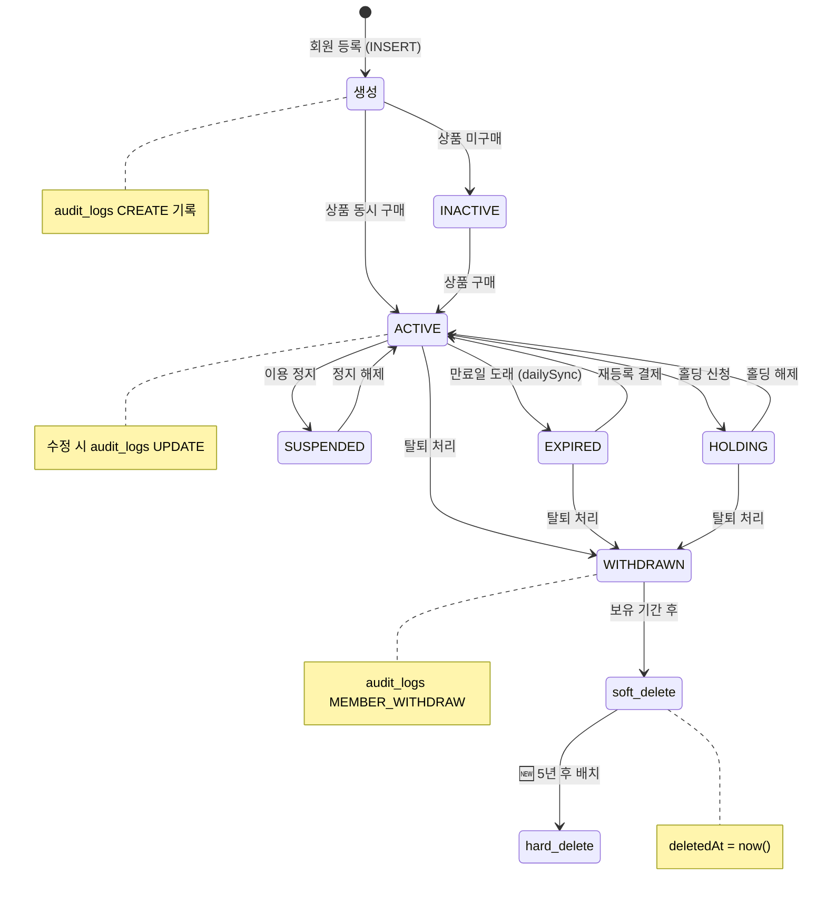
```mermaid
stateDiagram-v2
    [*] --> 생성 : 회원 등록 (INSERT)
    생성 --> INACTIVE : 상품 미구매
    생성 --> ACTIVE : 상품 동시 구매

    INACTIVE --> ACTIVE : 상품 구매
    ACTIVE --> EXPIRED : 만료일 도래 (dailySync)
    ACTIVE --> HOLDING : 홀딩 신청
    ACTIVE --> SUSPENDED : 이용 정지
    ACTIVE --> WITHDRAWN : 탈퇴 처리

    HOLDING --> ACTIVE : 홀딩 해제
    EXPIRED --> ACTIVE : 재등록 결제
    SUSPENDED --> ACTIVE : 정지 해제

    EXPIRED --> WITHDRAWN : 탈퇴 처리
    HOLDING --> WITHDRAWN : 탈퇴 처리

    WITHDRAWN --> soft_delete : 보유 기간 후
    soft_delete --> hard_delete : 🆕 5년 후 배치

    note right of 생성 : audit_logs CREATE 기록
    note right of ACTIVE : 수정 시 audit_logs UPDATE
    note right of WITHDRAWN : audit_logs MEMBER_WITHDRAW
    note right of soft_delete : deletedAt = now()
```

### 108-2. 매출 데이터 라이프사이클

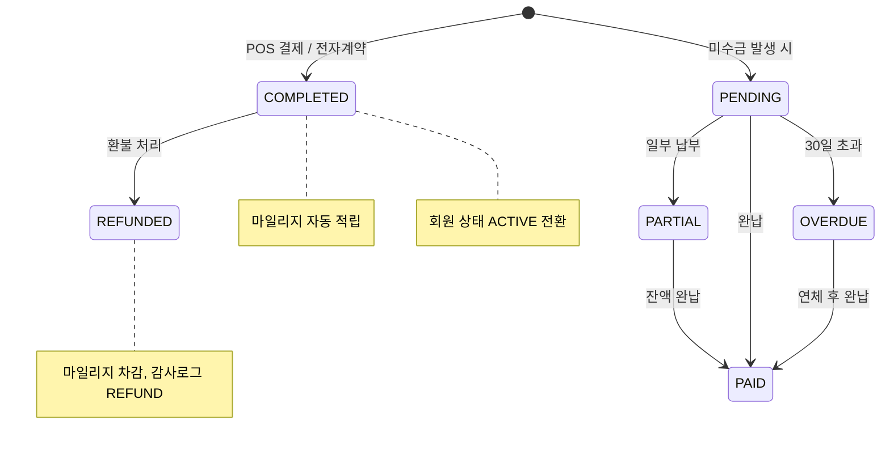
```mermaid
stateDiagram-v2
    [*] --> COMPLETED : POS 결제 / 전자계약
    COMPLETED --> REFUNDED : 환불 처리

    [*] --> PENDING : 미수금 발생 시
    PENDING --> PARTIAL : 일부 납부
    PENDING --> PAID : 완납
    PENDING --> OVERDUE : 30일 초과
    PARTIAL --> PAID : 잔액 완납
    OVERDUE --> PAID : 연체 후 완납

    note right of COMPLETED : 마일리지 자동 적립
    note right of COMPLETED : 회원 상태 ACTIVE 전환
    note right of REFUNDED : 마일리지 차감, 감사로그 REFUND
```

### 108-3. 상품 데이터 라이프사이클

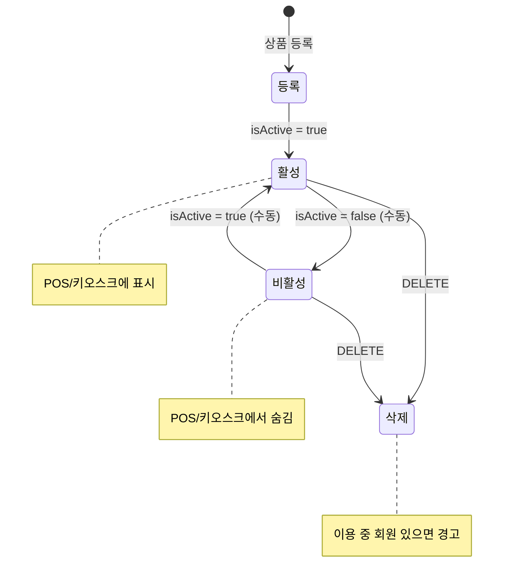
```mermaid
stateDiagram-v2
    [*] --> 등록 : 상품 등록
    등록 --> 활성 : isActive = true
    활성 --> 비활성 : isActive = false (수동)
    비활성 --> 활성 : isActive = true (수동)
    활성 --> 삭제 : DELETE
    비활성 --> 삭제 : DELETE

    note right of 활성 : POS/키오스크에 표시
    note right of 비활성 : POS/키오스크에서 숨김
    note right of 삭제 : 이용 중 회원 있으면 경고
```

---

## 109. 최종 문서 목차 (빠른 탐색용)

| 섹션 | 제목 | 줄 (약) |
|:---:|------|:---:|
| 1 | 사용자 페르소나 | 30 |
| 2 | 역할 권한 요약 | 60 |
| 3 | 메뉴 구조 | 90 |
| 4 | 유저케이스 상세 (UC-001~029) | 150~750 |
| 5 | 주요 유저플로우 E2E (Flow-01~05) | 750~900 |
| 6 | 향후 필요 기능 (P0~P3) | 900~960 |
| 7 | 용어 정의 (28개) | 960~1000 |
| 8 | 다른 역할 관점 유저플로우 (5역할) | 1000~1100 |
| 9 | 디자인 스펙 (색상/폰트/간격/그림자/아이콘) | 1100~1200 |
| 10 | 테스트 시나리오 (TC 60+건) | 1200~1400 |
| 11 | DB 스키마 (25+테이블) | 1400~1600 |
| 12 | 성능 요구사항 | 1600~1620 |
| 13 | 접근성 요구사항 | 1620~1640 |
| 14~18 | 알림정책/애니메이션/키보드/PDF/다중탭 | 1640~1750 |
| 19~24 | 외부연동/백업/멀티테넌트/릴리즈/크로스레퍼런스/FAQ | 1750~1950 |
| 25~30 | RLS/에러사전/체크리스트/세그먼트/리포트/공수산정 | 1950~2200 |
| 31 | DataTable 컬럼 정의 (20종) | 2200~2500 |
| 32 | Mermaid 다이어그램 (16종) | 2500~2900 |
| 33~36 | 화면상태/반응형/버튼시퀀스/추가시퀀스 | 2900~3400 |
| 37~39 | 추가시퀀스7종/네비게이션맵/잔여테이블 | 3400~3700 |
| 40~46 | ER/데이터흐름/모달패턴/캐시/탭로딩/추가시나리오/접근성 | 3700~4200 |
| 47~50 | 모달와이어10종/권한시퀀스/URL/기술스택 | 4200~4700 |
| 51 | 화면설계서 디스크립션 49화면 (51-1~51-49) | 4700~6500 |
| 52~60 | 토스트/검증/업로드/다크모드/브라우저/딥링크/세션/에러/placeholder | 6500~7200 |
| 61~65 | Props/핸들러/조건부/키보드/JSON | 7200~7700 |
| 66~73 | 테스트데이터/쿼리/환경변수/드롭다운/날짜/Store/라우트가드 | 7700~8500 |
| 74~78 | 팔레트/배지매핑/아이콘/빌드순서/QA체크 | 8500~9100 |
| 79~86 | 데이터전달/localStorage/Zod/비즈로직/에러바운더리/Realtime/인쇄/아키텍처 | 9100~9800 |
| 87~91 | 경쟁사/로드맵/회의록/i18n/완성선언 | 9800~10200 |
| 92~98 | 스토리보드/인수인계/장애대응/정합성/SLO/개인정보/부하테스트 | 10200~10900 |
| 99~104 | 간트/여정맵/KPI색상/인덱스/트러블슈팅/영향도 | 10900~11500 |
| 105~109 | 마이크로카피/시나리오30종/접근경로/라이프사이클/목차 | 11500~ |

---

## 99. Mermaid 간트 차트 — 개발 스케줄

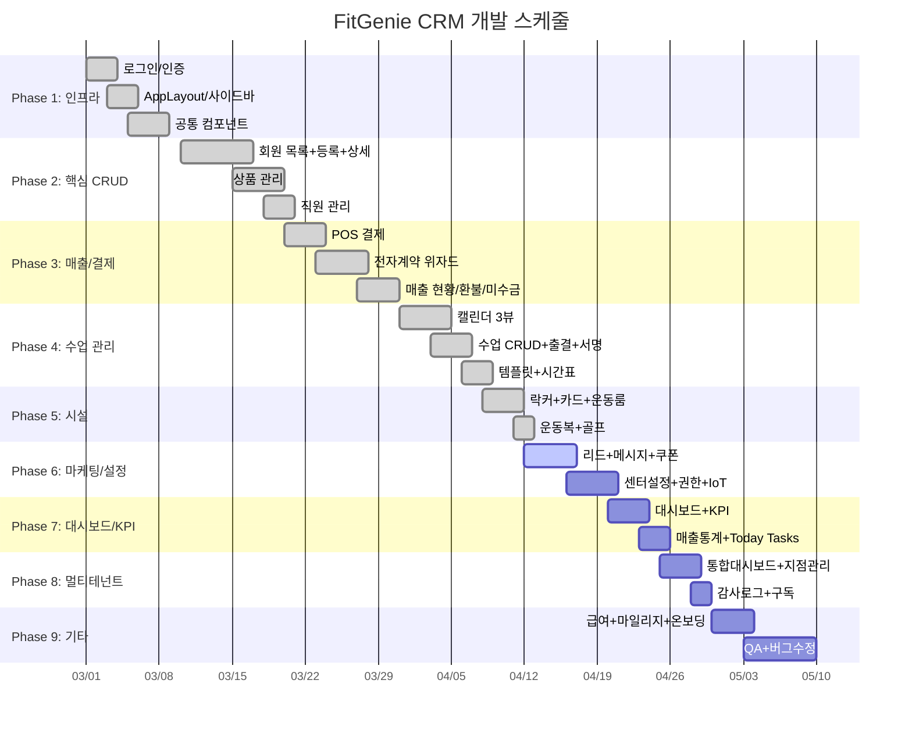
```mermaid
gantt
    title FitGenie CRM 개발 스케줄
    dateFormat YYYY-MM-DD
    axisFormat %m/%d

    section Phase 1: 인프라
    로그인/인증           :done, p1a, 2026-03-01, 3d
    AppLayout/사이드바    :done, p1b, 2026-03-03, 3d
    공통 컴포넌트         :done, p1c, 2026-03-05, 4d

    section Phase 2: 핵심 CRUD
    회원 목록+등록+상세    :done, p2a, 2026-03-10, 7d
    상품 관리              :done, p2b, 2026-03-15, 5d
    직원 관리              :done, p2c, 2026-03-18, 3d

    section Phase 3: 매출/결제
    POS 결제              :done, p3a, 2026-03-20, 4d
    전자계약 위자드        :done, p3b, 2026-03-23, 5d
    매출 현황/환불/미수금   :done, p3c, 2026-03-27, 4d

    section Phase 4: 수업 관리
    캘린더 3뷰            :done, p4a, 2026-03-31, 5d
    수업 CRUD+출결+서명    :done, p4b, 2026-04-03, 4d
    템플릿+시간표          :done, p4c, 2026-04-06, 3d

    section Phase 5: 시설
    락커+카드+운동룸       :done, p5a, 2026-04-08, 4d
    운동복+골프            :done, p5b, 2026-04-11, 2d

    section Phase 6: 마케팅/설정
    리드+메시지+쿠폰       :active, p6a, 2026-04-12, 5d
    센터설정+권한+IoT      :p6b, 2026-04-16, 5d

    section Phase 7: 대시보드/KPI
    대시보드+KPI           :p7a, 2026-04-20, 4d
    매출통계+Today Tasks   :p7b, 2026-04-23, 3d

    section Phase 8: 멀티테넌트
    통합대시보드+지점관리   :p8a, 2026-04-25, 4d
    감사로그+구독           :p8b, 2026-04-28, 2d

    section Phase 9: 기타
    급여+마일리지+온보딩    :p9a, 2026-04-30, 4d
    QA+버그수정            :p9b, 2026-05-03, 7d
```

---

## 100. 사용자 여정 맵 (Customer Journey Map)

### 100-1. 회원(고객) 여정

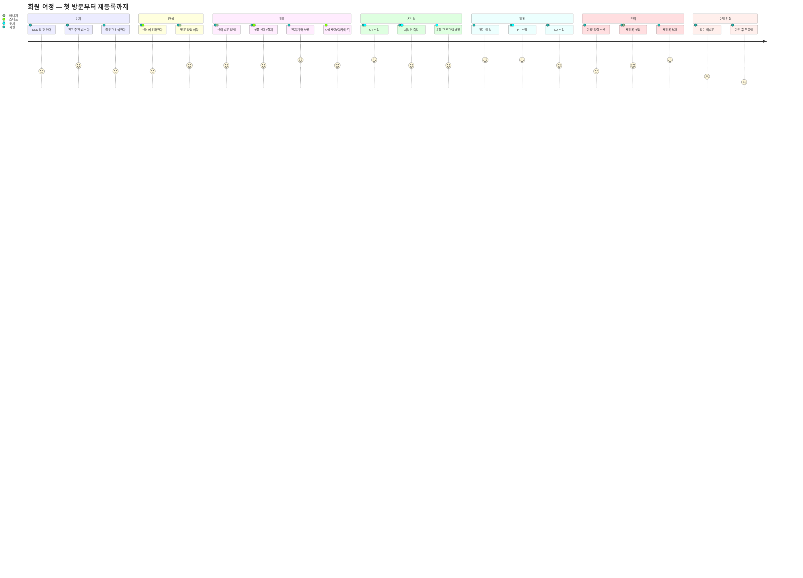
```mermaid
journey
    title 회원 여정 — 첫 방문부터 재등록까지
    section 인지
      SNS 광고 본다: 3: 회원
      친구 추천 받는다: 4: 회원
      블로그 검색한다: 3: 회원
    section 관심
      센터에 전화한다: 3: 회원, 스태프
      방문 상담 예약: 4: 회원, 매니저
    section 등록
      센터 방문 상담: 4: 회원, 매니저
      상품 선택+결제: 4: 회원, 스태프
      전자계약 서명: 5: 회원
      시설 세팅(락커/카드): 4: 스태프
    section 온보딩
      OT 수업: 5: 회원, 코치
      체성분 측정: 4: 회원, 코치
      운동 프로그램 배정: 4: 코치
    section 활동
      정기 출석: 5: 회원
      PT 수업: 5: 회원, 코치
      GX 수업: 4: 회원
    section 유지
      만료 알림 수신: 3: 회원
      재등록 상담: 4: 회원, 매니저
      재등록 결제: 5: 회원
    section 이탈 위험
      장기 미방문: 2: 회원
      만료 후 무응답: 1: 회원
```

### 100-2. 슈퍼관리자 여정

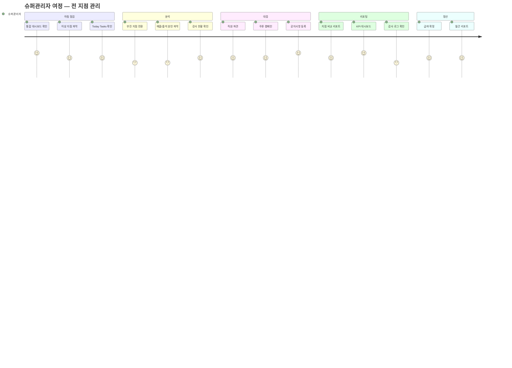
```mermaid
journey
    title 슈퍼관리자 여정 — 전 지점 관리
    section 아침 점검
      통합 대시보드 확인: 5: 슈퍼관리자
      이상 지점 파악: 4: 슈퍼관리자
      Today Tasks 확인: 4: 슈퍼관리자
    section 분석
      부진 지점 전환: 3: 슈퍼관리자
      매출/출석 원인 파악: 3: 슈퍼관리자
      강사 현황 확인: 4: 슈퍼관리자
    section 대응
      직원 파견: 4: 슈퍼관리자
      쿠폰 캠페인: 4: 슈퍼관리자
      공지사항 등록: 5: 슈퍼관리자
    section 리포팅
      지점 비교 리포트: 4: 슈퍼관리자
      KPI 대시보드: 5: 슈퍼관리자
      감사 로그 확인: 3: 슈퍼관리자
    section 정산
      급여 확정: 4: 슈퍼관리자
      월간 리포트: 4: 슈퍼관리자
```

---

## 101. KPI 대시보드 — 카드별 색상 변경 규칙

KPI 카드의 값에 따라 색상이 변하는 규칙:

| KPI | 좋음 (🟢 mint) | 보통 (기본) | 나쁨 (🔴 peach) |
|-----|:---:|:---:|:---:|
| 활성 비율 | ≥ 80% | 60~79% | < 60% |
| MoM 매출 성장률 | ≥ 0% | — | < 0% |
| 상담 완료율 | ≥ 70% | 50~69% | < 50% |
| PT 완료율 | ≥ 85% | 70~84% | < 70% |
| PT 노쇼율 | ≤ 5% | 6~10% | > 10% |
| GX 출석률 | ≥ 80% | 60~79% | < 60% |
| 잔여 횟수 | ≥ 5회 | 3~4회 | ≤ 2회 |
| 만료 D-day | ≥ 30일 | 8~29일 | ≤ 7일 |
| 미수금 | ₩0 | ₩1~₩100,000 | > ₩100,000 |
| 출석률 바 | ≥ 80% | 50~79% | < 50% |
| 온보딩 진행률 | 100% | 25~75% | 0% |

---

## 102. DB 인덱스 전략

자주 사용되는 쿼리의 성능을 위한 인덱스:

| 테이블 | 인덱스 컬럼 | 쿼리 패턴 | 예상 효과 |
|--------|-----------|---------|---------|
| members | (branchId, status, deletedAt) | 회원 목록 필터 | 전체 스캔 → 인덱스 스캔 |
| members | (branchId, membershipExpiry) | 만료 예정 조회 | 범위 쿼리 최적화 |
| members | (phone) UNIQUE | 전화번호 중복 체크 | O(1) 조회 |
| sales | (branchId, saleDate, status) | 매출 기간 조회 | 범위 쿼리 최적화 |
| sales | (memberId) | 회원별 결제 이력 | FK 조인 최적화 |
| attendance | (branchId, checkInAt) | 일별 출석 조회 | 범위 쿼리 최적화 |
| attendance | (memberId) | 회원별 출석 이력 | FK 조인 최적화 |
| consultations | (memberId, consultedAt) | 회원별 상담 이력 | 정렬 최적화 |
| lesson_bookings | (branchId, createdAt, status) | 수업 현황 조회 | 복합 필터 |
| audit_logs | (branchId, createdAt) | 감사 로그 조회 | 범위 쿼리 + 정렬 |
| audit_logs | (action) | 액션별 필터 | 필터 최적화 |
| products | (branchId, isActive) | 상품 목록 | 활성 상품만 빠르게 |
| lockers | (branchId, status) | 구역별 락커 | 상태 필터 |

---

## 103. 트러블슈팅 가이드

개발 중 자주 마주치는 문제와 해결법:

| # | 증상 | 원인 | 해결 |
|:---:|------|------|------|
| 1 | `getBranchId()` 항상 1 반환 | localStorage에 branchId 미설정 | 로그인 후 authStore에서 설정 확인 |
| 2 | RLS 에러 "new row violates row-level security" | branchId 누락 INSERT | INSERT 시 branchId 필수 포함 |
| 3 | 테이블 데이터 안 나옴 (빈 배열) | `.is('deletedAt', null)` 빠짐 | soft delete 필터 추가 |
| 4 | 모달이 뒤에 가려짐 | z-index 충돌 | 모달: z-50, 확인Dialog: z-[9999] |
| 5 | 토스트가 안 보임 | `<Toaster>` 미설치 | main.tsx에 `<Toaster />` 추가 |
| 6 | 날짜가 하루 밀림 | timezone 이슈 | `fmtLocal()` 유틸로 로컬 날짜 생성 |
| 7 | 금액 NaN 표시 | Number() 변환 실패 | `Number(val) \|\| 0` 패턴 사용 |
| 8 | 페이지 새로고침 시 404 | SPA 라우팅 + 서버 설정 | 배포 시 모든 경로 → index.html fallback |
| 9 | `useEffect` 무한 루프 | 의존성 배열에 객체/배열 직접 | `useCallback`으로 래핑 또는 primitive 의존성 |
| 10 | 회원 수정 후 목록 미갱신 | fetchList 미호출 | 저장 성공 후 `await fetchList()` 추가 |
| 11 | Supabase 429 에러 | Rate limiting (초당 요청 초과) | 병렬 쿼리 수 제한, 캐싱 적용 |
| 12 | 이미지 업로드 실패 | Storage bucket 권한 | Supabase 대시보드 → Storage 정책 확인 |
| 13 | TypeScript 타입 에러 | Supabase 응답 타입 불일치 | `as unknown as T` 캐스팅 또는 타입 정의 |
| 14 | 사이드바 메뉴 안 보임 | hasMenuPermission false | permissions.ts MENU_PERMISSIONS 확인 |
| 15 | 슈퍼관리자인데 본사 메뉴 안 보임 | isSuperAdmin false | users 테이블 is_super_admin 컬럼 확인 |

---

## 104. 변경 영향도 분석 가이드

특정 테이블이나 기능을 변경할 때 영향받는 화면:

### 104-1. members 테이블 변경 시

| 변경 | 영향받는 화면 |
|------|-------------|
| 컬럼 추가 | 회원 등록 폼, 회원 상세, 회원 목록, API endpoints/members.ts |
| status 값 추가 | permissions.ts, 회원 목록 탭, 회원 상세 배지, 상태 머신 |
| membershipExpiry 로직 변경 | 대시보드 KPI, KPI 대시보드, 통합 대시보드, 온보딩, dailySync |
| phone UNIQUE 제약 변경 | 회원 등록 중복 체크, MemberForm.tsx |

### 104-2. products 테이블 변경 시

| 변경 | 영향받는 화면 |
|------|-------------|
| 컬럼 추가 | 상품 등록 폼, ProductDetailPanel, ProductList |
| category 값 추가 | 상품 목록 탭, POS 카테고리, 매출 통계 |
| price 구조 변경 | POS 결제, 전자계약, 매출 현황, 선수익금 |

### 104-3. 권한 변경 시

| 변경 | 영향받는 화면 |
|------|-------------|
| ROUTE_PERMISSIONS 수정 | 해당 라우트 페이지 접근 제한 변경 |
| FEATURE_PERMISSIONS 수정 | 해당 버튼 표시/숨김 변경 |
| MENU_PERMISSIONS 수정 | 사이드바 메뉴 표시/숨김 변경 |
| 새 역할 추가 | permissions.ts 전체, 권한 설정 화면, 사이드바 |

---

## 92. 화면 스토리보드 — 주요 시나리오 화면 전환 흐름

개발자/디자이너가 화면 전환을 시각적으로 이해할 수 있도록, 주요 시나리오의 화면별 스크린 흐름을 정리합니다.

---

### 92-1. 신규 회원 첫 방문 → 등록 → 결제 → 온보딩

```
[Screen 1]          [Screen 2]         [Screen 3]         [Screen 4]
회원 목록            회원 등록 Step1     회원 등록 Step2     회원 목록
┌──────────┐       ┌──────────┐       ┌──────────┐       ┌──────────┐
│ [+회원등록]│──────→│ 이름*     │──────→│ 회원구분   │──────→│ 김회원 추가│
│           │ 클릭  │ 전화번호* │ [다음]│ 담당FC    │ [등록]│ INACTIVE  │
│           │       │ [중복확인] │       │ 메모      │       │           │
└──────────┘       └──────────┘       └──────────┘       └──────────┘
                                                              │ 행 클릭
                                                              ▼
[Screen 5]          [Screen 6]         [Screen 7]         [Screen 8]
전자계약 Step1      전자계약 Step3      전자계약 Step5      회원 상세
┌──────────┐       ┌──────────┐       ┌──────────┐       ┌──────────┐
│ 김회원 선택│──────→│ 기간/금액  │──────→│ 서명 패드  │──────→│ 상태:ACTIVE│
│           │ 상품  │ 할인 적용  │ 결제  │ [완료]    │       │ 만료:07/15│
│           │ 선택  │ ₩760,000 │       │ ✍️       │       │ 잔여:20회 │
└──────────┘       └──────────┘       └──────────┘       └──────────┘
                                                              │
                                                              ▼
[Screen 9]          [Screen 10]        [Screen 11]
락커 관리            운동복 QR          캘린더
┌──────────┐       ┌──────────┐       ┌──────────┐
│ A-05 배정 │       │ L세트 대여 │       │ OT 예약   │
│ 김회원    │       │ 김회원    │       │ 04/13 10:00│
└──────────┘       └──────────┘       └──────────┘
```

---

### 92-2. 슈퍼관리자 아침 점검 루틴

```
[Screen 1]          [Screen 2]         [Screen 3]         [Screen 4]
로그인               통합 대시보드       지점 전환(분당)     분당 대시보드
┌──────────┐       ┌──────────┐       ┌──────────┐       ┌──────────┐
│ 이메일    │──────→│ KPI 7카드  │──────→│ 분당점 선택│──────→│ 매출 급감! │
│ 비밀번호  │ 로그인│ 지점3카드  │ 상세  │ [상세보기] │ 전환  │ 출석 감소  │
│ [로그인]  │       │ 감사로그   │ 보기  │           │       │ 만료 급증  │
└──────────┘       └──────────┘       └──────────┘       └──────────┘
                                                              │
                                                              ▼
[Screen 5]          [Screen 6]         [Screen 7]         [Screen 8]
강사 현황            직원 관리          메시지 발송         Today Tasks
┌──────────┐       ┌──────────┐       ┌──────────┐       ┌──────────┐
│ 박코치 퇴사│──────→│ 최코치 파견│──────→│ 만료회원   │──────→│ 분당점 회복│
│ PT 0건   │ 원인  │ 강남→분당  │ 대응  │ 쿠폰 발송  │ 추적  │ 계획 등록  │
└──────────┘       └──────────┘       └──────────┘       └──────────┘
```

---

### 92-3. 월말 정산 플로우

```
[Screen 1]          [Screen 2]         [Screen 3]         [Screen 4]
매출 통계            미수금 관리         환불 관리           급여 관리
┌──────────┐       ┌──────────┐       ┌──────────┐       ┌──────────┐
│ 월별 추이  │──────→│ 미수 3건   │──────→│ 환불 1건   │──────→│ 4월 급여   │
│ ₩8,420만  │ 미수  │ [알림 발송]│ 환불  │ ₩320,000 │ 급여  │ 인센티브   │
│ MoM +12% │ 확인  │ 회수 처리  │ 있으면│ [환불처리] │ 정산  │ 자동 계산  │
└──────────┘       └──────────┘       └──────────┘       └──────────┘
                                                              │
                                                              ▼
[Screen 5]          [Screen 6]         [Screen 7]
급여 수정 모달       급여 명세서         지점 비교 리포트
┌──────────┐       ┌──────────┐       ┌──────────┐
│ 박코치    │──────→│ PDF 다운   │──────→│ 3지점 비교 │
│ 야근수당  │ 확정  │ [다운로드]  │ 리포트│ 매출 순위  │
│ +₩80,000│       │           │       │ 차트      │
└──────────┘       └──────────┘       └──────────┘
```

---

## 93. 인수인계 문서 가이드

새로운 개발자가 프로젝트에 합류할 때 읽어야 할 순서:

### 93-1. 온보딩 순서 (신규 개발자)

| 순서 | 문서/작업 | 소요 시간 | 비고 |
|:---:|---------|:---:|------|
| 1 | 이 문서의 **섹션 1~3** 읽기 (페르소나/권한/메뉴) | 30분 | 전체 그림 파악 |
| 2 | **섹션 50** 읽기 (기술 스택/디렉토리) | 20분 | 코드 구조 이해 |
| 3 | 로컬 환경 세팅 (git clone → npm install → .env 설정) | 30분 | |
| 4 | `npm run dev` → 로그인 → 전체 화면 둘러보기 | 1시간 | |
| 5 | **섹션 9** 읽기 (디자인 스펙) | 15분 | 컬러/폰트/간격 |
| 6 | **섹션 61** 읽기 (공통 컴포넌트 Props) | 30분 | DataTable/Modal 등 |
| 7 | **섹션 42** 읽기 (모달 상태 관리 패턴) | 15분 | CRUD 패턴 숙지 |
| 8 | **A-16** 읽기 (역할별 권한 매트릭스) | 15분 | RBAC 이해 |
| 9 | **섹션 11** 읽기 (DB 스키마) | 30분 | 테이블 구조 |
| 10 | 첫 번째 이슈 시작 | — | 간단한 버그 수정부터 |

### 93-2. 코드 컨벤션 (암묵적 규칙)

| 규칙 | 설명 |
|------|------|
| 파일 위치 | 페이지 → `src/pages/`, 컴포넌트 → `src/components/`, API → `src/api/endpoints/` |
| 네이밍 | 페이지: PascalCase (MemberList.tsx), 유틸: camelCase (formatAmount.ts) |
| 상태 관리 | 전역: zustand (authStore만), 페이지: useState/useCallback |
| API 호출 | Supabase SDK 직접 사용 (별도 REST API 없음) |
| 검증 | react-hook-form + zod |
| 스타일 | Tailwind CSS utility class (인라인 style 금지) |
| 아이콘 | lucide-react만 사용 |
| 토스트 | sonner 라이브러리 (toast.success/error/info) |
| 날짜 | 표시: YYYY-MM-DD, DB: ISO 8601 timestamptz |
| 금액 | 표시: ₩N,NNN (toLocaleString), DB: numeric |
| branchId | 모든 쿼리에 `.eq('branchId', getBranchId())` 필수 |
| soft delete | 삭제 시 `.update({ deletedAt: now() })`, 조회 시 `.is('deletedAt', null)` |
| 감사 로그 | 모든 CREATE/UPDATE/DELETE 후 audit_logs INSERT |
| 코드 스플리팅 | 모든 페이지 React.lazy + Suspense |

---

## 94. 장애 대응 가이드

### 94-1. 장애 등급 분류

| 등급 | 설명 | 대응 시간 | 예시 |
|:---:|------|:---:|------|
| P0 (긴급) | 전체 서비스 중단 | 즉시 | 로그인 불가, DB 다운 |
| P1 (심각) | 핵심 기능 불가 | 1시간 내 | POS 결제 불가, 회원 등록 불가 |
| P2 (보통) | 부분 기능 불편 | 4시간 내 | 엑셀 다운로드 실패, 차트 미표시 |
| P3 (경미) | 사용에 지장 없음 | 다음 배포 | 오타, 정렬 순서 이상 |

### 94-2. 장애 대응 절차

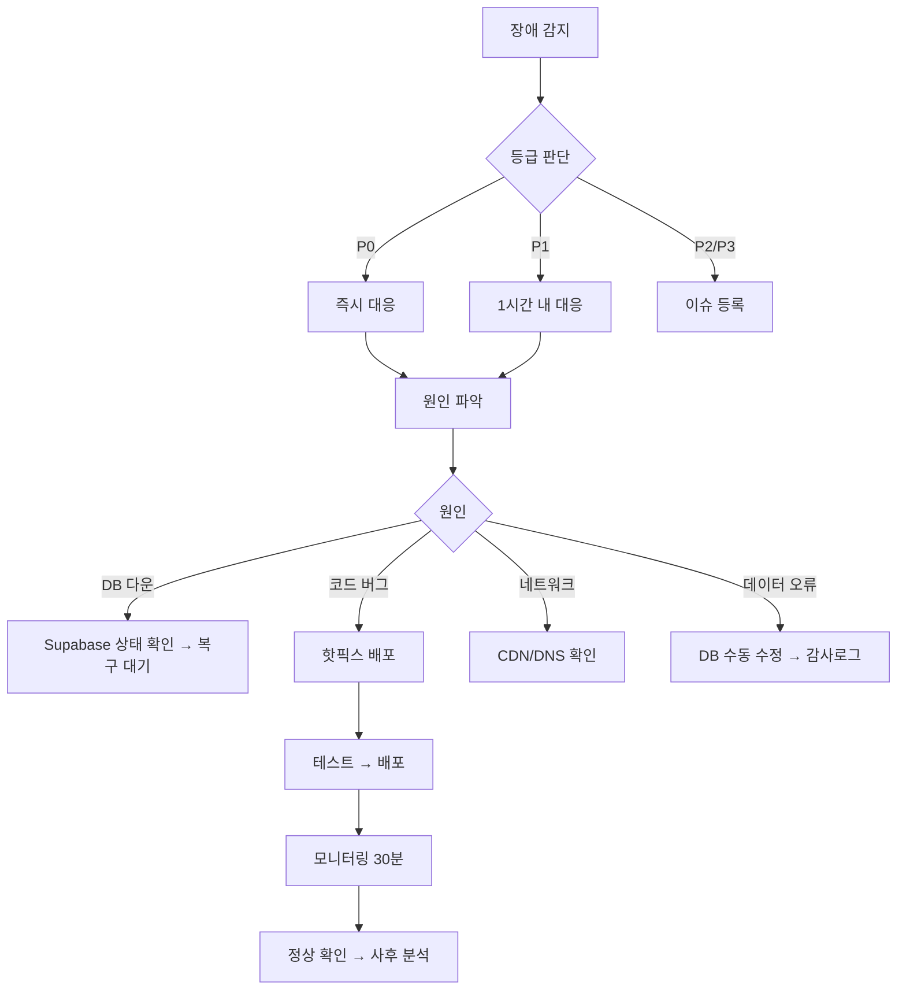
```mermaid
flowchart TD
    A[장애 감지] --> B{등급 판단}
    B -->|P0| C[즉시 대응]
    B -->|P1| D[1시간 내 대응]
    B -->|P2/P3| E[이슈 등록]

    C --> F[원인 파악]
    D --> F

    F --> G{원인}
    G -->|DB 다운| H[Supabase 상태 확인 → 복구 대기]
    G -->|코드 버그| I[핫픽스 배포]
    G -->|네트워크| J[CDN/DNS 확인]
    G -->|데이터 오류| K[DB 수동 수정 → 감사로그]

    I --> L[테스트 → 배포]
    L --> M[모니터링 30분]
    M --> N[정상 확인 → 사후 분석]
```

### 94-3. 자주 발생하는 장애 & 해결

| 증상 | 원인 | 해결 |
|------|------|------|
| 로그인 안 됨 | Supabase Auth 서비스 장애 | Supabase 대시보드 확인, 대기 |
| 데이터 안 나옴 | branchId 미설정 | localStorage 확인, 재로그인 |
| 무한 로딩 | API 쿼리 타임아웃 | 인덱스 추가 또는 쿼리 최적화 |
| 404 페이지 | 잘못된 라우트 | App.tsx 라우트 확인 |
| 권한 오류 | RBAC 설정 불일치 | permissions.ts ROUTE_PERMISSIONS 확인 |
| 엑셀 빈 파일 | 필터 결과 0건 | 필터 조건 확인 후 재다운로드 |
| 모달 안 닫힘 | state 미초기화 | setModalOpen(false) + state 초기화 확인 |

---

## 95. 데이터 정합성 체크

### 95-1. 정기 점검 쿼리

운영 중 데이터 정합성을 확인하는 쿼리:

**활성 회원인데 만료일 지남**:
```sql
SELECT id, name, status, membershipExpiry
FROM members
WHERE status = 'ACTIVE'
  AND membershipExpiry < CURRENT_DATE
  AND deletedAt IS NULL;
-- 결과 있으면: runDailySync 미실행 → 수동 상태 전환
```

**매출 합계 ≠ 카드+현금+마일리지**:
```sql
SELECT id, amount, card, cash, mileageUsed,
       (COALESCE(card,0) + COALESCE(cash,0) + COALESCE(mileageUsed,0)) as sum_parts
FROM sales
WHERE amount != (COALESCE(card,0) + COALESCE(cash,0) + COALESCE(mileageUsed,0))
  AND status = 'COMPLETED';
-- 결과 있으면: 결제 데이터 불일치 → 수동 확인
```

**소속 지점 없는 회원**:
```sql
SELECT m.id, m.name, m.branchId
FROM members m
LEFT JOIN branches b ON m.branchId = b.id
WHERE b.id IS NULL AND m.deletedAt IS NULL;
-- 결과 있으면: 지점 삭제 후 회원 미이관
```

**잔여 횟수 음수**:
```sql
SELECT id, name, remainingSessions
FROM members
WHERE remainingSessions < 0 AND deletedAt IS NULL;
-- 결과 있으면: 횟수 차감 로직 버그
```

### 95-2. 자동 정합성 체크 (🆕 향후)

| 체크 항목 | 주기 | 알림 대상 |
|---------|:---:|---------|
| 만료 회원 상태 전환 | 매일 | 자동 처리 (dailySync) |
| 매출 금액 불일치 | 주간 | 슈퍼관리자 이메일 |
| 고아 데이터 (부모 없는 FK) | 월간 | 개발팀 |
| 중복 회원 (동일 전화번호) | 월간 | 센터장 |

---

## 96. 서비스 수준 목표 (SLO)

| 지표 | 목표 | 측정 방법 |
|------|:---:|---------|
| 가용성 | 99.5% | Supabase 업타임 + 프론트 배포 |
| 페이지 로드 시간 | < 3초 | 첫 의미 있는 렌더 (FMP) |
| API 응답 시간 (p95) | < 2초 | Supabase 대시보드 |
| 에러율 | < 1% | console.error 빈도 |
| 데이터 백업 | 매일 | Supabase PITR |
| 복구 시간 (RTO) | < 1시간 | 장애 발생 → 서비스 복구 |
| 데이터 손실 (RPO) | < 1시간 | 마지막 백업 ~ 장애 시점 |

---

## 97. 개인정보 처리 방침 요약 (🆕)

시스템이 다루는 개인정보와 처리 원칙:

### 97-1. 수집 항목

| 분류 | 항목 | 필수/선택 | 보유 기간 |
|------|------|:---:|:---:|
| 회원 식별 | 이름, 전화번호 | 필수 | 탈퇴 후 5년 |
| 회원 부가 | 성별, 생년월일, 이메일, 주소 | 선택 | 탈퇴 후 5년 |
| 신체 정보 | 키, 체중, 체성분 | 선택 | 탈퇴 후 1년 |
| 결제 정보 | 카드번호(마스킹), 결제 내역 | 필수 | 5년 (전자상거래법) |
| 직원 정보 | 이름, 전화번호, 이메일, 급여 | 필수 | 퇴사 후 3년 |
| 출입 기록 | 체크인 시간, RFID 번호 | 자동 | 1년 |
| 서명 데이터 | 전자 서명 이미지 | 계약 시 | 5년 |

### 97-2. 처리 원칙

| 원칙 | 적용 |
|------|------|
| 최소 수집 | 서비스에 필요한 정보만 수집 |
| 목적 외 이용 금지 | 마케팅 동의 없으면 SMS 발송 불가 |
| 안전한 저장 | Supabase (AWS 서울 리전) + 암호화 |
| 접근 통제 | RBAC + RLS로 역할별 접근 제한 |
| 감사 추적 | 모든 조회/수정/삭제 감사 로그 기록 |
| 삭제 요청 | 회원 탈퇴 시 soft delete → 보유 기간 후 hard delete |
| 카드번호 마스킹 | ****-****-****-1234 형태로만 저장 |

---

## 98. 부하 테스트 시나리오 (🆕 향후)

| 시나리오 | 동시 사용자 | 주요 액션 | 목표 응답 시간 |
|---------|:---:|---------|:---:|
| 아침 출근 피크 | 30명 | 로그인 + 대시보드 로드 | < 3초 |
| POS 결제 피크 | 10명 | 동시 결제 처리 | < 2초 |
| 월말 엑셀 다운로드 | 5명 | 전체 회원 1,000명 내보내기 | < 5초 |
| 통합 대시보드 (10지점) | 3명 | 40+병렬 쿼리 | < 5초 |
| 캘린더 수업 일괄 생성 | 2명 | 100건 INSERT | < 10초 |
| 메시지 대량 발송 | 1명 | 500명 알림톡 | < 30초 |

---

## 87. 경쟁사 기능 비교표

FitGenie CRM과 주요 경쟁사의 기능 비교:

| 기능 | FitGenie CRM | 레슨북 | 온핏 | 브로제이 |
|------|:---:|:---:|:---:|:---:|
| **회원 관리 CRUD** | ✅ | ✅ | ✅ | ✅ |
| **멀티지점 통합 관리** | ✅ | ❌ | ⚠️ 제한적 | ❌ |
| **슈퍼관리자 (본사)** | ✅ | ❌ | ❌ | ❌ |
| **지점 간 비교 리포트** | ✅ | ❌ | ❌ | ❌ |
| **RBAC 권한 6단계** | ✅ | ⚠️ 3단계 | ⚠️ 2단계 | ⚠️ 3단계 |
| **POS 결제** | ✅ | ✅ | ✅ | ✅ |
| **전자계약 서명** | ✅ | ❌ | ❌ | ❌ |
| **상품 요일/시간 제한** | ✅ | ✅ | ❌ | ⚠️ |
| **현금가/카드가 분리** | ✅ | ✅ | ❌ | ❌ |
| **캘린더 3뷰** | ✅ | ✅ | ✅ | ⚠️ |
| **수업 서명 패드** | ✅ | ✅ | ❌ | ❌ |
| **수업 템플릿 일괄 생성** | ✅ | ⚠️ | ❌ | ❌ |
| **락커 그리드 관리** | ✅ | ⚠️ | ✅ | ❌ |
| **운동복 QR 관리** | ✅ | ✅ | ❌ | ❌ |
| **골프 타석 관리** | ✅ | ✅ | ❌ | ❌ |
| **마일리지 시스템** | ✅ | ⚠️ | ✅ | ❌ |
| **쿠폰 관리** | ✅ | ❌ | ⚠️ | ❌ |
| **자동 알림 13종** | ✅ | ⚠️ 5종 | ⚠️ 3종 | ❌ |
| **리드 관리 (CRM)** | ✅ | ❌ | ❌ | ❌ |
| **KPI 대시보드** | ✅ | ❌ | ⚠️ | ❌ |
| **Today Tasks** | ✅ | ❌ | ❌ | ❌ |
| **강사 현황/실적** | ✅ | ⚠️ | ❌ | ✅ |
| **급여 자동 계산** | ✅ | ⚠️ | ❌ | ❌ |
| **감사 로그** | ✅ | ❌ | ❌ | ❌ |
| **온보딩 대시보드** | ✅ | ❌ | ❌ | ❌ |
| **선수익금 관리** | ✅ | ❌ | ❌ | ❌ |
| **IoT 출입 연동** | ✅ | ✅ | ⚠️ | ❌ |
| **키오스크 설정** | ✅ | ✅ | ❌ | ❌ |
| **엑셀 다운로드** | ✅ | ✅ | ✅ | ⚠️ |
| **반응형 (태블릿)** | ✅ | ⚠️ | ⚠️ | ❌ |
| 🆕 **회원 앱 연동** | 🆕 | ✅ | ✅ | ⚠️ |
| 🆕 **이탈 예측 AI** | 🆕 | ❌ | ❌ | ❌ |
| 🆕 **자동 리포트** | 🆕 | ❌ | ❌ | ❌ |

**FitGenie CRM 차별점**: 멀티테넌트 통합 관리 + CRM(리드/상담) + KPI + Today Tasks + 전자계약

---

## 88. 제품 로드맵 (2026)

### Q2 (4~6월) — 현재 스프린트

| 우선순위 | 항목 | 상태 |
|:---:|------|:---:|
| P0 | 63페이지 전체 기능 안정화 | 진행중 |
| P0 | QA 전체 화면 테스트 | 진행중 |
| P0 | 버그 수정 (QA 리포트 기반) | 진행중 |

### Q3 (7~9월) — 고도화

| 우선순위 | 항목 | 설명 |
|:---:|------|------|
| P0 | 알림톡/SMS 실제 연동 | 카카오 비즈메시지 API |
| P0 | 매출 목표 설정 기능 | 지점별/월별 목표 + 달성률 |
| P0 | 리드 파이프라인 칸반 | 접수→상담→등록 시각화 |
| P1 | 자동 리포트 (일간/주간) | 이메일/카카오 자동 발송 |
| P1 | 이탈 예측 모델 | 미방문+만료+노쇼 기반 위험 감지 |
| P1 | 코호트/퍼널 분석 | 등록 시기별 유지율, 전환율 |

### Q4 (10~12월) — 확장

| 우선순위 | 항목 | 설명 |
|:---:|------|------|
| P0 | 회원 앱 v1 | iOS/Android, 예약/출석/마일리지 |
| P1 | PG사 결제 연동 | 토스페이먼츠/아임포트 |
| P1 | 인앱 알림 센터 | 실시간 알림 허브 |
| P2 | 다크 모드 완성 | 전체 화면 다크 테마 |
| P2 | 설문 조사 (NPS) | 만족도 조사 시스템 |
| P2 | 커스텀 대시보드 | 위젯 드래그 앤 드롭 |

### 2027 — 장기

| 항목 | 설명 |
|------|------|
| AI 인사이트 | 부진 원인 자동 분석, 개선 제안 |
| 얼굴 인식 출입 | IoT 연동 |
| 다국어 지원 | 영어/일본어 |
| 본사 표준 상품 일괄 배포 | 전 지점 동기화 |
| 비용 관리 (손익 계산) | 임대료/인건비 입력 → 영업이익 |

---

## 89. 회의록/보고서 템플릿

### 89-1. 주간 운영 회의록 템플릿

```markdown
# 주간 운영 회의록

**일시**: 2026-04-14 (월) 10:00
**참석**: 김본부장(본사), 김센터장(강남), 이센터장(홍대), 박센터장(분당)

## 1. 지난주 실적 요약
| 지점 | 매출 | 목표 대비 | 신규 | 만료 | 주요 이슈 |
|------|------|---------|------|------|----------|
| 강남 | ₩3,800만 | 95% | 8명 | 3명 | |
| 홍대 | ₩2,920만 | 88% | 5명 | 2명 | |
| 분당 | ₩1,700만 | 72% | 2명 | 5명 | PT 코치 부재 |

## 2. 이번주 목표
- [ ] 분당점 코치 파견 (강남점 최코치)
- [ ] 만료 예정 회원 재등록 캠페인 발송
- [ ] 여름 프로모션 상품 등록

## 3. 논의 사항
-

## 4. 다음 회의 일정
- 2026-04-21 (월) 10:00
```

### 89-2. 월간 경영 리포트 템플릿

```markdown
# 월간 경영 리포트 — 2026년 3월

## 핵심 지표 (전월 대비)
| 지표 | 3월 | 2월 | 변동 |
|------|------|------|------|
| 전체 매출 | ₩8,420만 | ₩7,520만 | +12% |
| 신규 회원 | 47명 | 38명 | +24% |
| 이탈 회원 | 12명 | 15명 | -20% |
| 출석률 | 68% | 65% | +3%p |
| 상담 전환율 | 45% | 42% | +3%p |

## 지점별 성과
(지점 비교 리포트 데이터 기반)

## 우수/부진 분석
- 우수: 강남점 — 신규 프로모션 효과로 신규 25명 달성
- 부진: 분당점 — PT 코치 퇴사로 PT 매출 -40%

## 다음달 계획
- 분당점 코치 채용 (4/15까지)
- 여름 프로모션 기획 (5/1 시작)
```

---

## 90. 한국어-영어 용어 매핑 (i18n 준비)

향후 다국어 지원 시 참조할 용어 매핑:

| 한국어 | 영어 | 사용 위치 |
|--------|------|---------|
| 대시보드 | Dashboard | 사이드바, 페이지 제목 |
| 회원 | Members | 사이드바, 탭 |
| 회원 목록 | Member List | 페이지 제목 |
| 회원 등록 | Add Member | 버튼 |
| 회원 상세 | Member Detail | 페이지 제목 |
| 수업/캘린더 | Classes/Calendar | 사이드바 |
| 매출 | Sales | 사이드바 |
| 매출 현황 | Sales Overview | 페이지 제목 |
| 상품 관리 | Product Management | 페이지 제목 |
| 시설 | Facilities | 사이드바 |
| 급여 | Payroll | 사이드바 |
| 설정 | Settings | 사이드바 |
| 공지사항 | Notices | 사이드바 |
| 활성 | Active | 배지 |
| 만료 | Expired | 배지 |
| 홀딩 | On Hold | 배지 |
| 완료 | Completed | 배지 |
| 환불 | Refunded | 배지 |
| 노쇼 | No Show | 배지 |
| 검색 | Search | placeholder |
| 저장 | Save | 버튼 |
| 취소 | Cancel | 버튼 |
| 삭제 | Delete | 버튼 |
| 등록 | Register | 버튼 |
| 수정 | Edit | 버튼 |
| 새로고침 | Refresh | 버튼 |
| 엑셀 다운로드 | Export Excel | 버튼 |
| 전체 | All | 탭/필터 |
| 이름 | Name | 필드 |
| 전화번호 | Phone | 필드 |
| 이메일 | Email | 필드 |
| 상태 | Status | 필드 |
| 금액 | Amount | 필드 |
| 기간 | Duration | 필드 |
| 횟수 | Sessions | 필드 |

---

## 91. 최종 문서 완성 선언

이 문서는 **FitGenie CRM 슈퍼관리자 유저케이스 & 유저플로우** 문서로서, 다음 용도로 사용할 수 있습니다:

1. **기획서** — 전체 기능 정의, 유저 시나리오, 비즈니스 규칙
2. **화면설계서 디스크립션** — 49화면 진입조건, 필드인터랙션, 버튼상태, 조건부렌더링
3. **기능명세서** — 모달/폼 필드 상세, 검증규칙, 에러메시지
4. **API 설계서** — 엔드포인트 목록, 요청/응답 JSON, Supabase 쿼리 패턴
5. **DB 설계서** — 25+테이블 스키마, ER 다이어그램, RLS 정책
6. **디자인 가이드** — 색상/폰트/간격/그림자/아이콘 스펙, 배지 매핑 50+종
7. **테스트 케이스** — 60+TC, QA 체크리스트 40+항목
8. **개발 가이드** — 컴포넌트 Props, 이벤트핸들러, 조건부렌더링, 빌드순서
9. **운영 가이드** — 오픈/폐점 체크리스트, 일간/주간/월간 업무, 회의록 템플릿
10. **제품 전략** — 경쟁사 비교, 로드맵, 세그먼트 정의, 향후 기능 시나리오

---

## 79. 화면 간 데이터 전달 패턴

화면 A에서 화면 B로 데이터를 어떻게 전달하는지:

| 출발 | 목적지 | 전달 데이터 | 전달 방식 |
|------|--------|-----------|---------|
| 회원 목록 | 회원 상세 | memberId | URL 쿼리 `?id=1248` |
| 회원 목록 | 회원 등록 | (없음) | navigate (빈 폼) |
| 회원 상세 | 회원 수정 | memberId | URL 쿼리 `?id=1248` → DB 재조회 |
| 회원 상세 | 체성분 | memberId | URL 쿼리 `?memberId=1248` |
| 회원 상세 | 회원 이관 | memberId | URL 쿼리 (🆕) 또는 화면 내 검색 |
| 매출 현황 | 회원 상세 | memberId | 구매자 클릭 → navigate `?id=N` |
| 통합대시보드 | 대시보드 | branchId | switchBranch() → localStorage |
| 사이드바 | 모든 화면 | branchId | localStorage (지점 전환) |
| POS | 회원 검색 모달 | (없음) → memberId | 모달 → onConfirm 콜백 |
| 전자계약 | 회원 검색 모달 | (없음) → member 객체 | 모달 → onConfirm 콜백 |
| 대시보드 만료임박 | 회원 상세 상담탭 | memberId + 탭 | navigate `?id=N` (🆕 탭 지정) |
| 대시보드 생일 | 메시지 발송 | 회원 목록 | 🆕 state로 수신자 pre-fill |
| 급여 관리 | 급여 명세서 | staffId + month | navigate + 화면 내 선택 |
| 상품 목록 | 상품 상세 패널 | product 객체 | 로컬 state (selectedProduct) |
| 직원 목록 | 직원 수정 | staffId | URL 쿼리 `?id=5` |
| 직원 목록 | 직원 퇴사 | staffId | navigate + 화면 내 선택 |

**데이터 전달 3가지 방식**:

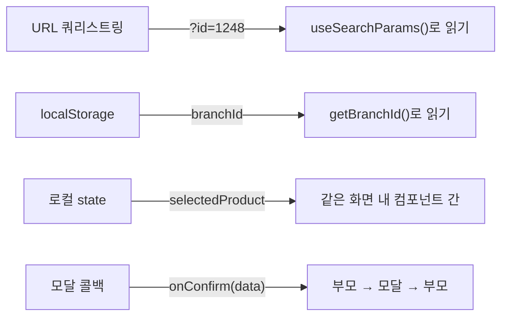
```mermaid
flowchart LR
    A["URL 쿼리스트링"] -->|"?id=1248"| B["useSearchParams()로 읽기"]
    C["localStorage"] -->|"branchId"| D["getBranchId()로 읽기"]
    E["로컬 state"] -->|"selectedProduct"| F["같은 화면 내 컴포넌트 간"]
    G["모달 콜백"] -->|"onConfirm(data)"| H["부모 → 모달 → 부모"]
```

---

## 80. localStorage 사용 목록

시스템에서 localStorage에 저장하는 모든 키:

| 키 | 값 형태 | 설정 시점 | 읽기 시점 | 비고 |
|-----|---------|---------|---------|------|
| `branchId` | `"1"` (문자열 숫자) | 로그인 시 / switchBranch() | 모든 API 호출 (getBranchId()) | 가장 핵심 |
| `sb-xxxxx-auth-token` | JWT JSON | Supabase Auth 자동 | Supabase SDK 자동 | 세션 토큰 |
| `today_tasks_custom` | JSON 배열 | Today Tasks 수동 추가 시 | Today Tasks 페이지 로드 | 수동 태스크 |
| 🆕 `theme_mode` | `"light"/"dark"/"system"` | 테마 변경 시 | 앱 초기화 시 | |
| 🆕 `sidebar_collapsed` | `"true"/"false"` | 사이드바 토글 시 | 앱 초기화 시 | |
| 🆕 `recent_branches` | JSON 배열 | 지점 전환 시 | 사이드바 드롭다운 | 최근 접속 3개 |

**주의**: 민감 데이터(비밀번호 등)는 절대 localStorage에 저장하지 않음

---

## 81. Zod 검증 스키마 상세

### 81-1. 회원 등록 스키마

```typescript
const memberFormSchema = z.object({
  name: z.string().min(2, "이름은 2자 이상이어야 합니다"),
  phone: z.string().regex(/^010-\d{4}-\d{4}$/, "올바른 전화번호 형식이 아닙니다"),
  gender: z.enum(["male", "female"]).optional(),
  birthDate: z.string().optional(),
  height: z.string().optional(),
  email: z.string().email("올바른 이메일 형식이 아닙니다").optional().or(z.literal("")),
  address: z.string().optional(),
  addressDetail: z.string().optional(),
  memberType: z.string().default("일반"),
  fc: z.string().optional(),
  trainer: z.string().optional(),
  visitPath: z.string().optional(),
  exerciseGoal: z.string().optional(),
  nickname: z.string().optional(),
  company: z.string().optional(),
  attendanceNumber: z.string().optional(),
  referralSource: z.string().optional(),
  companyName: z.string().optional(),
  marketingConsent: z.boolean().default(false),
  notes: z.string().max(500, "메모는 500자까지 가능합니다").optional(),
  profileImage: z.any().optional(),
});
```

### 81-2. 상품 등록 스키마

```typescript
const productFormSchema = z.object({
  name: z.string().min(1, "상품명을 입력하세요"),
  price: z.number().positive("금액은 0보다 커야 합니다"),
  category: z.string().min(1, "카테고리를 선택하세요"),
  productType: z.enum(["MEMBERSHIP", "LESSON", "RENTAL", "GENERAL"]),
  duration: z.number().int().positive().optional().nullable(),
  sessions: z.number().int().positive().optional().nullable(),
  description: z.string().optional(),
  isActive: z.boolean().default(true),
  holdingEnabled: z.boolean().default(false),
  transferEnabled: z.boolean().default(false),
  pointAccrual: z.boolean().default(true),
  kioskVisible: z.boolean().default(true),
  salesChannel: z.string().default("전체"),
});
```

### 81-3. 금액 포맷 변환

```typescript
// 입력: "800,000" → 숫자: 800000
function parsePrice(formatted: string): number {
  return Number(formatted.replace(/,/g, "")) || 0;
}

// 숫자: 800000 → 표시: "800,000"
function formatPrice(num: number): string {
  return num.toLocaleString("ko-KR");
}
```

---

## 82. 비즈니스 로직 함수 (lib/businessLogic.ts)

시스템의 핵심 비즈니스 로직 함수:

### 82-1. 홀딩 처리

```typescript
async function startHolding(memberId: number, params: {
  reason: string;
  startDate: string;
  endDate: string;
}) {
  // 1. 회원 상태 → HOLDING
  // 2. 홀딩 일수 계산 (endDate - startDate)
  // 3. 만료일 연장 (membershipExpiry + holdingDays)
  // 4. 감사 로그 기록
}

async function endHolding(memberId: number) {
  // 1. 회원 상태 → ACTIVE
  // 2. 실제 홀딩 기간만큼 만료일 재조정
  // 3. 감사 로그 기록
}
```

### 82-2. 마일리지 적립

```typescript
async function accruePoints(memberId: number, saleAmount: number) {
  // 1. 정책 조회 (적립률 N%)
  // 2. 적립 금액 = saleAmount × earnRate / 100
  // 3. mileage_logs INSERT (type='earn')
  // 4. 잔액 갱신
}
```

### 82-3. 중복 결제 체크

```typescript
async function checkDuplicatePayment(memberId: number, productName: string, amount: number): Promise<boolean> {
  // 최근 24시간 내 동일 회원 + 동일 상품 + 동일 금액 결제 존재 여부
  // true → "유사한 결제가 이미 존재합니다" 경고
}
```

### 82-4. 일일 동기화 (dailySync)

```typescript
async function runDailySync() {
  // 대시보드 진입 시 실행
  // 1. 만료일 지난 ACTIVE 회원 → EXPIRED 상태 전환
  // 2. 락커 만료일 지난 → EXPIRING 상태 전환
  // 3. 쿠폰 유효기간 지난 → 비활성 전환
}
```

### 82-5. 회원권 기간 갱신

```typescript
async function updateMembershipPeriod(memberId: number, product: {
  duration?: number;
  sessions?: number;
}) {
  // 1. 현재 만료일 조회
  // 2. 새 만료일 = max(현재 만료일, 오늘) + duration
  // 3. 잔여 횟수 = (기존 잔여 || 0) + sessions
  // 4. 상태 = ACTIVE
  // 5. members UPDATE
}
```

---

## 83. 에러 바운더리 동작

React ErrorBoundary 컴포넌트의 동작:

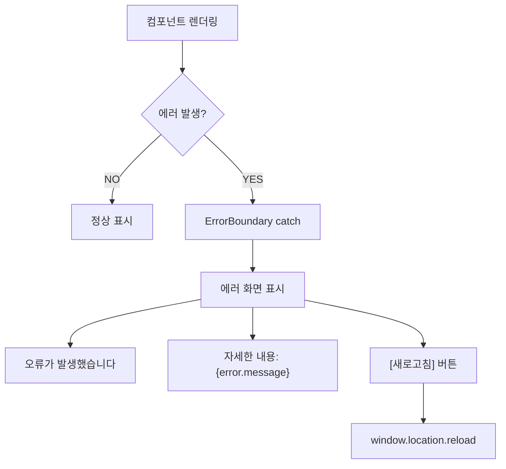
```mermaid
flowchart TD
    A[컴포넌트 렌더링] --> B{에러 발생?}
    B -->|NO| C[정상 표시]
    B -->|YES| D[ErrorBoundary catch]
    D --> E[에러 화면 표시]
    
    E --> F["오류가 발생했습니다"]
    E --> G["자세한 내용: {error.message}"]
    E --> H["[새로고침] 버튼"]
    
    H --> I[window.location.reload]
```

**에러 화면**:
```
┌──────────────────────────────────────┐
│                                      │
│          ⚠️                          │
│                                      │
│    오류가 발생했습니다                │
│                                      │
│    예기치 않은 오류가 발생했습니다.   │
│    페이지를 새로고침 해주세요.        │
│                                      │
│    [새로고침]                         │
│                                      │
│    (개발 모드에서만)                  │
│    Error: Cannot read property...    │
│                                      │
└──────────────────────────────────────┘
```

---

## 84. 실시간 데이터 동기화 전략 (🆕 향후)

현재는 수동 새로고침 방식이지만, 향후 실시간 동기화 계획:

| 화면 | 현재 | 향후 계획 |
|------|:---:|---------|
| 통합 대시보드 | [새로고침] 수동 | 🆕 30초 자동 갱신 (polling) |
| 대시보드 | [새로고침] 수동 | 🆕 1분 자동 갱신 |
| 출석 관리 | 페이지 로드 시 | 🆕 Supabase Realtime (실시간 체크인 표시) |
| 캘린더 | 페이지 로드 시 | 🆕 Supabase Realtime (다른 직원 수정 반영) |
| 키오스크 | 체크인 시 | 🆕 WebSocket (프론트 화면에 실시간 입장 표시) |
| 감사 로그 | 필터 변경 시 | 🆕 최신 로그 상단 실시간 추가 |

**Supabase Realtime 구독 예시** (🆕):

```javascript
// 출석 실시간 구독
supabase
  .channel('attendance-changes')
  .on('postgres_changes', {
    event: 'INSERT',
    schema: 'public',
    table: 'attendance',
    filter: `branchId=eq.${branchId}`,
  }, (payload) => {
    // 새 체크인 → 목록에 추가 + KPI 갱신
    addAttendanceRecord(payload.new);
  })
  .subscribe();
```

---

## 85. 인쇄 스타일시트 규칙

브라우저 인쇄(Ctrl+P) 시 적용되는 CSS 규칙:

```css
@media print {
  /* 사이드바 숨김 */
  aside { display: none !important; }
  
  /* 콘텐츠 전체 너비 */
  main { width: 100% !important; margin: 0 !important; }
  
  /* 액션 버튼 숨김 */
  button, .actions { display: none !important; }
  
  /* 페이지네이션 숨김 */
  .pagination { display: none !important; }
  
  /* 배경색 인쇄 허용 */
  * { -webkit-print-color-adjust: exact; print-color-adjust: exact; }
  
  /* 테이블 페이지 나눔 방지 */
  tr { page-break-inside: avoid; }
  
  /* 차트 → 높이 고정 */
  .chart-container { height: 300px !important; }
}
```

**인쇄에서 유지되는 요소**: PageHeader 제목, StatCard, DataTable, 차트
**인쇄에서 숨기는 요소**: 사이드바, 검색/필터, 버튼, 페이지네이션, 토스트

---

## 86. Mermaid — 전체 시스템 아키텍처

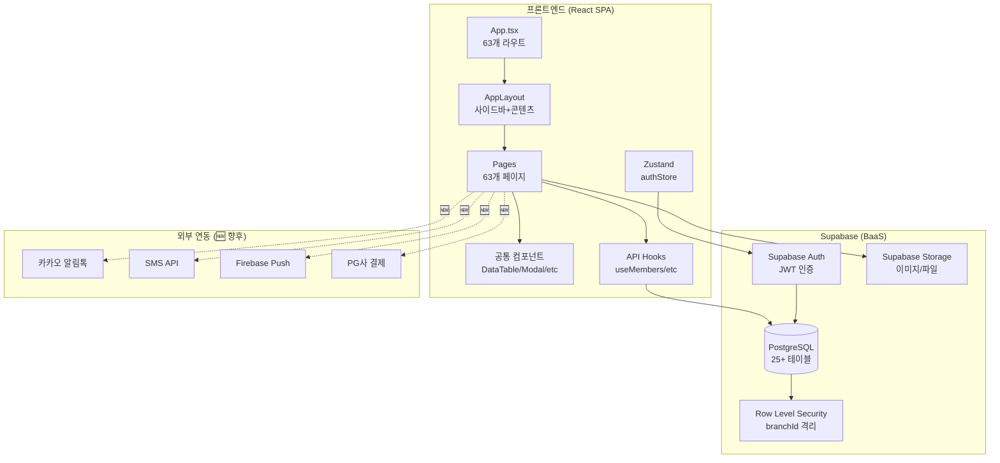
```mermaid
flowchart TB
    subgraph 프론트엔드["프론트엔드 (React SPA)"]
        APP[App.tsx<br>63개 라우트]
        LAYOUT[AppLayout<br>사이드바+콘텐츠]
        PAGES[Pages<br>63개 페이지]
        COMPONENTS[공통 컴포넌트<br>DataTable/Modal/etc]
        STORE[Zustand<br>authStore]
        HOOKS[API Hooks<br>useMembers/etc]
    end

    subgraph 백엔드["Supabase (BaaS)"]
        AUTH[Supabase Auth<br>JWT 인증]
        DB[(PostgreSQL<br>25+ 테이블)]
        STORAGE[Supabase Storage<br>이미지/파일]
        RLS[Row Level Security<br>branchId 격리]
    end

    subgraph 외부["외부 연동 (🆕 향후)"]
        KAKAO[카카오 알림톡]
        SMS[SMS API]
        FCM[Firebase Push]
        PG[PG사 결제]
    end

    APP --> LAYOUT
    LAYOUT --> PAGES
    PAGES --> COMPONENTS
    PAGES --> HOOKS
    HOOKS --> DB
    STORE --> AUTH
    AUTH --> DB
    DB --> RLS
    PAGES --> STORAGE

    PAGES -.->|🆕| KAKAO
    PAGES -.->|🆕| SMS
    PAGES -.->|🆕| FCM
    PAGES -.->|🆕| PG
```

---

## 74. 색상 팔레트 — 수업/상품 색상 선택

수업 등록, 수업 템플릿에서 사용하는 10색 팔레트:

| # | HEX | 이름 | 용도 예시 |
|:---:|:---:|------|---------|
| 1 | `#6366F1` | 인디고 | 기본 PT |
| 2 | `#8B5CF6` | 보라 | 필라테스 |
| 3 | `#EC4899` | 핑크 | 요가 |
| 4 | `#F43F5E` | 로즈 | 복싱 |
| 5 | `#F97316` | 주황 | 크로스핏 |
| 6 | `#EAB308` | 노랑 | 스트레칭 |
| 7 | `#22C55E` | 초록 | GX 일반 |
| 8 | `#10B981` | 에메랄드 | 수영 |
| 9 | `#06B6D4` | 시안 | 특별 수업 |
| 10 | `#3B82F6` | 파랑 | 개인 수업 |

**선택 UI**: 원형 버튼 10개 가로 나열. 선택 시 border 3px 강조 + 체크 표시

---

## 75. 상태 배지 → 색상/텍스트 매핑 전체

시스템 내 모든 상태 배지의 variant, 텍스트, 배경색 매핑:

### 75-1. 회원 상태

| DB값 | 표시 텍스트 | variant | 배경 | 텍스트 |
|------|-----------|:---:|:---:|:---:|
| ACTIVE | 활성 | success | 초록50 | 초록700 |
| EXPIRED | 만료 | error | 빨강50 | 빨강600 |
| HOLDING | 홀딩 | default | 회색100 | 회색600 |
| INACTIVE | 미등록 | default | 회색100 | 회색600 |
| SUSPENDED | 정지 | warning | 노랑50 | 노랑700 |
| WITHDRAWN | 탈퇴 | error | 빨강50 | 빨강600 |

### 75-2. 매출 상태

| DB값 | 표시 | variant |
|------|------|:---:|
| COMPLETED / 완료 | 완료 | success |
| REFUNDED / 환불 | 환불 | error |
| PENDING / 미납 | 미납 | warning |

### 75-3. 매출 구분 (round)

| 값 | 배경 | 텍스트 |
|-----|:---:|:---:|
| 신규 | 파랑100 | 파랑700 |
| 재등록 | 초록100 | 초록700 |
| 휴면복귀 | 노랑100 | 노랑700 |
| 종목추가 | 보라100 | 보라700 |
| 업그레이드 | 주황100 | 주황700 |

### 75-4. 수업 출결

| 값 | 표시 | variant |
|-----|------|:---:|
| BOOKED | 예정 | info (🔵) |
| ATTENDED | 출석 | success (🟢) |
| NO_SHOW | 노쇼 | error (🔴) |
| CANCELLED | 취소 | default (⚪) |

### 75-5. 상품 타입

| 값 | 표시 | 배경 | 텍스트 |
|-----|------|:---:|:---:|
| MEMBERSHIP | 회원권 | 파랑100 | 파랑700 |
| LESSON | 수강권 | 초록100 | 초록700 |
| RENTAL | 대여권 | 주황100 | 주황700 |
| GENERAL | 일반 | 회색100 | 회색600 |

### 75-6. 직원 역할

| 값 | 표시 | 배경 | 테두리 |
|-----|------|:---:|:---:|
| primary / 최고관리자 | 최고관리자 | 빨강EE | 빨강30% |
| owner / 센터장 | 센터장 | 주황E5 | 주황30% |
| manager / 매니저 | 매니저 | 보라light | 보라30% |
| fc / FC | FC | 파랑EF | 파랑30% |
| trainer / 트레이너 | 트레이너 | 초록F0 | 초록30% |
| staff / 스태프 | 스태프 | 회색sec | 회색line |
| 프론트 | 프론트 | 파랑EF | 파랑30% |

### 75-7. 기타 배지

| 대상 | 값 → 표시 | variant |
|------|---------|:---:|
| 쿠폰 | active→활성 | success |
| 쿠폰 | expired→만료 | default |
| 쿠폰 | exhausted→소진 | error |
| 쿠폰 | inactive→비활성 | default (어두움) |
| 환불 | 완료 | success |
| 환불 | 처리중 | warning |
| 환불 | 거절 | error |
| 미수금 | 미결제 | default |
| 미수금 | 일부결제 | warning |
| 미수금 | 연체 | error |
| 미수금 | 완료 | success |
| 락커 | available→빈락커 | default |
| 락커 | in_use→사용중 | success |
| 락커 | expiring→만료임박 | warning |
| 락커 | broken→고장 | error |
| 운동복 | AVAILABLE→대기 | success |
| 운동복 | RENTED→대여중 | warning |
| 운동복 | WASHING→세탁중 | default |
| 운동복 | DAMAGED→파손 | error |
| 운동룸 | 사용가능 | success |
| 운동룸 | 점검중 | warning |
| 운동룸 | 비활성 | error |
| 지점 | ACTIVE→운영중 | success (🟢 dot) |
| 지점 | SUSPENDED→임시휴업 | warning (🟡 dot) |
| 지점 | CLOSED→폐점 | error (🔴 dot) |
| 급여 | 미확정 | default |
| 급여 | 확정 | success |
| 급여 | 지급완료 | info |
| 직원 | active→재직 | success |
| 직원 | resigned→퇴사 | error |
| 리드 | 신규 | info |
| 리드 | 상담예약 | warning |
| 리드 | 상담완료 | success |
| 리드 | 등록완료 | success (✅) |
| 리드 | 보류 | default |
| 리드 | 이탈 | error |
| 페널티 | 적용 | error |
| 페널티 | 취소 | default |
| 근태 | 정상 | success |
| 근태 | 지각 | warning |
| 근태 | 결근 | error |
| 근태 | 연차 | info |
| 근태 | 휴무 | default |
| 감사로그 | LOGIN | success (초록) |
| 감사로그 | LOGOUT | default (회색) |
| 감사로그 | LOGIN_FAILED | error (빨강) |
| 감사로그 | CREATE | info (파랑) |
| 감사로그 | UPDATE | warning (노랑) |
| 감사로그 | DELETE | error (빨강) |
| 감사로그 | BRANCH_SWITCH | 보라 |
| 감사로그 | 기타 | default |
| Today Tasks | 긴급 | error |
| Today Tasks | 높음 | info |
| Today Tasks | 보통 | default |

---

## 76. 아이콘 매핑 (lucide-react)

화면별 사용되는 주요 아이콘:

| 화면/용도 | 아이콘 | lucide 이름 |
|----------|--------|------------|
| 대시보드 | 🏠 | Home |
| 회원 | 👥 | Users |
| 캘린더 | 📅 | Calendar |
| 매출 | 📈 | TrendingUp |
| 상품 | 📦 | Package |
| 시설 | 🏢 | Building2 |
| 급여 | 💰 | DollarSign |
| 메시지 | 💬 | MessageSquare |
| 설정 | ⚙️ | Settings |
| KPI | 🎯 | Target |
| Today Tasks | 📋 | ClipboardList |
| 검색 | 🔍 | Search |
| 추가 | ➕ | Plus |
| 수정 | ✏️ | Edit2 |
| 삭제 | 🗑 | Trash2 |
| 저장 | 💾 | Save |
| 다운로드 | 📥 | Download |
| 새로고침 | 🔄 | RefreshCw |
| 닫기 | ✕ | X |
| 체크 | ✅ | CheckCircle2 |
| 경고 | ⚠️ | AlertTriangle |
| 정보 | ℹ️ | Info |
| 로그아웃 | 🚪 | LogOut |
| 사용자 | 👤 | User |
| 별 (즐겨찾기) | ⭐ | Star |
| 필터 | 🔽 | ChevronDown |
| 전화 | 📞 | Phone |
| 이메일 | ✉️ | Mail |
| 카드 | 💳 | CreditCard |
| 현금 | 💵 | Banknote |
| 마일리지 | 🪙 | Coins |
| 이체 | 🔄 | ArrowRightLeft |
| 락커 | 🔒 | Lock |
| 운동 | 💪 | Dumbbell |
| QR | 📱 | QrCode |
| 서명 | ✍️ | FileText |
| 쿠폰 | 🎫 | Ticket |
| 알림 | 🔔 | Bell |
| 통계 | 📊 | BarChart3 |
| 방패 (보안) | 🛡️ | Shield |
| 시계 | ⏰ | Clock |

---

## 77. 페이지 빌드 우선순위 & 순서

개발자가 어떤 순서로 페이지를 구현해야 하는지:

### Phase 1: 인프라 (1주)
1. ✅ 로그인/인증 (Supabase Auth + authStore)
2. ✅ AppLayout + AppSidebar (RBAC 메뉴 렌더링)
3. ✅ PrivateRoute (라우트 가드)
4. ✅ 공통 컴포넌트 (DataTable, StatCard, StatusBadge, TabNav, SearchFilter, Modal, ConfirmDialog)

### Phase 2: 핵심 CRUD (2주)
5. ✅ 회원 목록 + 등록 + 상세 (9탭)
6. ✅ 상품 관리 (마스터-디테일 + 분류)
7. ✅ 직원 관리 + 등록

### Phase 3: 매출/결제 (2주)
8. ✅ POS 결제
9. ✅ 전자계약 위자드
10. ✅ 매출 현황
11. ✅ 환불/미수금 관리

### Phase 4: 수업 관리 (2주)
12. ✅ 캘린더 (3뷰)
13. ✅ 수업 CRUD + 출결 + 서명
14. ✅ 수업 템플릿 + 시간표
15. ✅ 횟수/페널티/유효수업

### Phase 5: 시설 (1주)
16. ✅ 락커 관리 (그리드 + 모달)
17. ✅ 밴드/카드 + 운동룸 + 운동복
18. ✅ 골프 타석

### Phase 6: 마케팅/설정 (2주)
19. ✅ 리드 관리
20. ✅ 메시지 발송 + 자동 알림
21. ✅ 쿠폰 관리
22. ✅ 센터 설정 (4탭)
23. ✅ 권한 설정 + IoT + 키오스크

### Phase 7: 대시보드/KPI (1주)
24. ✅ 대시보드 (차트 4종 + 뉴스피드)
25. ✅ KPI 대시보드 + KPI 센터
26. ✅ Today Tasks
27. ✅ 매출 통계 + 통계 관리

### Phase 8: 멀티테넌트 (1주)
28. ✅ 통합 대시보드
29. ✅ 지점 관리 + 지점 비교
30. ✅ 감사 로그
31. ✅ 구독 관리

### Phase 9: 기타 (1주)
32. ✅ 급여 관리 + 명세서
33. ✅ 마일리지 관리
34. ✅ 온보딩 대시보드 + 선수익금
35. ✅ 운동 프로그램 + 공지사항
36. ✅ 회원 이관 + 직원 퇴사/근태

---

## 78. QA 테스트 체크리스트 (배포 전)

배포 전 QA가 반드시 확인해야 하는 항목:

### 78-1. 인증/권한

- [ ] 슈퍼관리자 로그인 → 본사 관리 메뉴 표시
- [ ] 센터장 로그인 → 본사 관리 메뉴 미표시
- [ ] 스태프 로그인 → 급여 관리 메뉴 미표시
- [ ] 코치 로그인 → 상품 등록 버튼 미표시
- [ ] 조회전용 로그인 → 급여 명세서만 접근 가능
- [ ] URL 직접 입력으로 권한 없는 페이지 → /forbidden
- [ ] 세션 만료 → 자동 로그아웃 → /login

### 78-2. 회원 CRUD

- [ ] 회원 등록 → 목록에 추가
- [ ] 전화번호 중복 → 차단
- [ ] 회원 수정 → 상세 반영
- [ ] 회원 삭제 → soft delete → 목록에서 제거
- [ ] 홀딩 → 상태 변경 + 만료일 연장
- [ ] 홀딩 해제 → 상태 복귀
- [ ] 즐겨찾기 토글 → 필터 작동
- [ ] 검색 → 이름/전화번호 필터링
- [ ] 정렬 → 3단계 토글
- [ ] 엑셀 다운로드 → 파일 생성

### 78-3. 매출/결제

- [ ] POS 결제 → 매출 기록 + 회원 상태 갱신
- [ ] 전자계약 5단계 → 서명 → 결제 완료
- [ ] 환불 처리 → 매출 상태 REFUNDED
- [ ] 쿠폰 적용 결제 → 할인 반영
- [ ] 혼합 결제 (카드+현금) → 금액 분배 정확

### 78-4. 수업

- [ ] 캘린더 수업 등록 → 블록 표시
- [ ] 출결 처리 (출석/노쇼) → 상태 변경
- [ ] 노쇼 → 페널티 자동 적용 (정책 ON 시)
- [ ] 수업 완료 서명 → 횟수 차감
- [ ] 템플릿 일괄 생성 → 미리보기 건수 일치

### 78-5. 시설

- [ ] 락커 배정 → 색상 변경
- [ ] 락커 회수 → 빈 상태 복귀
- [ ] RFID 등록 → 목록 추가
- [ ] 운동복 QR 대여/반납 → 상태 변경

### 78-6. 멀티테넌트

- [ ] 지점 전환 → 데이터 변경 확인
- [ ] 통합 대시보드 → 전 지점 KPI 합산 정확
- [ ] 감사 로그 → 모든 CRUD 기록 확인
- [ ] 다른 지점 데이터 접근 불가 (RLS)

### 78-7. 반응형

- [ ] 1280px+ → 전체 레이아웃 정상
- [ ] 768~1279px → 사이드바 축소 + 2열
- [ ] <768px → 🆕 모바일 레이아웃

### 78-8. 크로스 브라우저

- [ ] Chrome 최신 → 정상
- [ ] Safari 최신 → 정상
- [ ] Edge 최신 → 정상
- [ ] 모바일 Chrome → 정상
- [ ] 모바일 Safari → 정상

---

## 70. 드롭다운/셀렉트 옵션 전체 정리

시스템 내 모든 드롭다운의 옵션 목록을 한곳에 정리합니다. 개발자는 이 목록으로 상수를 정의합니다.

### 70-1. 회원 관련

| 드롭다운 | 위치 | 옵션 |
|---------|------|------|
| 회원 구분 | 회원 등록 | 일반 / VIP / 법인 / 가족 / 체험 |
| 회원 상태 | 회원 목록 탭 | 전체 / 활성(ACTIVE) / 만료(EXPIRED) / 미등록(INACTIVE) / 홀딩(HOLDING) / 정지(SUSPENDED) |
| 성별 | 회원 목록 필터 | 전체 / 남 / 여 |
| 계약 상품 | 회원 목록 필터 | 전체 / PT / 헬스 / 요가 / 필라테스 |
| 방문 경로 | 회원 등록 | SNS / 블로그 / 소개 / 방문 / 전화 / 기타 |
| 미방문 기간 | 회원 목록 필터 | 전체 / 7일 / 14일 / 30일 |
| 탈퇴 사유 | 탈퇴 모달 | 본인 요청 / 이사 / 서비스 불만 / 기타 |
| 이관 사유 | 이관 화면 | 이사 / 본인 요청 / 지점 폐점 / 기타 |
| 홀딩 기간 | 홀딩 모달 | (달력 선택, 상품별 최대 제한) |

### 70-2. 상품 관련

| 드롭다운 | 위치 | 옵션 |
|---------|------|------|
| 상품 구분 | 상품 등록 | 레슨 / 이용 / 락커 / 판매 |
| 이용 구분 | 상품 등록 | 기간 / 횟수 / 포인트 |
| 수업 구분 | 상품 등록 | 개인 / 정규클래스 |
| 종목 | 상품 필터 | 전체 / 헬스 / 필라테스 / 요가 / 수영 / 복싱 / 크로스핏 / 기타 |
| 레슨 시간 | 상품 등록 | 선택 / 10분 / 20분 / 30분 / 40분 / 50분 / 60분 / 70분 / 80분 / 90분 / 100분 / 110분 / 120분 |
| 레슨 유효기간 | 상품 등록 | 선택 / 1개월 / 3개월 / 6개월 / 12개월 |
| 횟수 제한 | 상품 등록 | 제한없음 / 1회 / 2회 / 3회 / 5회 / 10회 |
| 시설이용가능 | 상품 등록 | 기본 / 오전 / 오후 / 종일 |
| 시설예약가능 | 상품 등록 | 당일 / 1일 전 / 3일 전 / 7일 전 / 14일 전 / 30일 전 |
| 예약시간간격 | 상품 등록 | 10분 / 20분 / 30분 / 40분 / 50분 / 60분 |
| 휴회기간 | 상품 등록 | 선택 / 3일 / 7일 / 15일 / 30일 / 60일 |
| 휴회횟수 | 상품 등록 | 선택 / 1회 / 2회 / 3회 |
| 판매유형 | 상품 등록 | 전체 / 현장 / 키오스크 / 앱 |
| 상품 타입 탭 | 상품 목록 | 전체 / 회원권 / 수강권 / 대여권 / 일반 |

### 70-3. 매출 관련

| 드롭다운 | 위치 | 옵션 |
|---------|------|------|
| 매출 유형 | 매출 필터 | 신규 / 재등록 / 휴면복귀 / 종목추가 / 업그레이드 |
| 매출 상태 | 매출 필터 | 완료 / 환불 / 미납 |
| 결제 방법 | POS / 전자계약 | 카드 / 현금 / 마일리지 / 계좌이체 |
| 기간 프리셋 | 매출 현황 | 오늘 / 이번주 / 이번달 |
| 기간 프리셋 | 매출 통계 | 이번달 / 지난달 / 최근3개월 / 최근6개월 / 올해 |
| 환불 사유 | 환불 관리 | 단순 변심 / 결제 오류 / 회원 요청 / 중복 결제 / 서비스 불만 |
| 미수금 상태 | 미수금 탭 | 전체 / 미결제 / 일부결제 / 연체 / 완료 |
| 할인 유형 | 전자계약 | 재등록 / 신규 / 이벤트 / 관리자 재량 |

### 70-4. 수업 관련

| 드롭다운 | 위치 | 옵션 |
|---------|------|------|
| 수업 유형 | 수업 등록 | PT / GX / 개인 / 그룹 |
| 템플릿 유형 | 수업 템플릿 | GX / PT / 필라테스 / 요가 / 기타 |
| 수업 기간 | 수업 현황 | 이번 주 / 이번 달 / 이번 분기 |
| 출결 상태 | 수업 상세 | 출석 / 지각 / 노쇼 / 취소 / 예정 |
| 페널티 유형 | 페널티 등록 | 노쇼 / 지각 / 규정위반 / 기타 |
| 일정 요청 상태 | 일정 요청 | 전체 / 대기 / 승인 / 거절 |

### 70-5. 직원/급여 관련

| 드롭다운 | 위치 | 옵션 |
|---------|------|------|
| 역할 | 직원 등록 / 필터 | 최고관리자 / 센터장 / 매니저 / FC / 트레이너 / 스태프 / 프론트 |
| 직원 상태 | 직원 필터 | 전체 / 재직 / 퇴사 |
| 퇴사 사유 | 퇴사 처리 | 자발적 퇴사 / 계약 만료 / 권고 사직 / 해고 / 이직 / 기타 |
| 급여 상태 | 급여 필터 | 전체 / 미확정 / 확정 / 지급완료 |
| 월 선택 | 급여 / 지점비교 | 최근 12개월 (동적 생성) |
| 근태 상태 | 직원 근태 | 정상 / 지각 / 결근 / 연차 / 휴무 |

### 70-6. 시설 관련

| 드롭다운 | 위치 | 옵션 |
|---------|------|------|
| 락커 구역 | 락커 탭 | A / B / C |
| RFID 유형 | 카드 등록 | 밴드 / 카드 |
| RFID 상태 | 카드 필터 | 전체 / 사용중 / 분실 / 미배정 |
| 운동복 사이즈 | 운동복 등록 | S / M / L / XL / XXL |
| 운동복 종류 | 운동복 등록 | 상의 / 하의 / 세트 |
| 운동복 상태 | 운동복 탭 | 전체 / 대기 / 대여중 / 세탁중 / 파손 |
| 운동룸 상태 | 운동룸 전환 | 사용가능 / 점검중 / 비활성 |
| 골프 이용시간 | 골프 예약 | 30분 / 1시간 / 1시간30분 / 2시간 |

### 70-7. 기타

| 드롭다운 | 위치 | 옵션 |
|---------|------|------|
| 쿠폰 상태 | 쿠폰 필터 | 전체 / 활성 / 만료 / 소진 / 비활성 |
| 쿠폰 유형 | 쿠폰 필터 | 전체 / 정액 / 정률 |
| 리드 유입경로 | 리드 등록 | SNS / 블로그 / 소개 / 방문 / 전화 / 기타 |
| 리드 상태 | 리드 등록 | 신규 / 상담예약 / 상담완료 / 등록완료 / 보류 / 이탈 |
| 상담 유형 | 상담 등록 | 상담 / OT / 체험 / 재등록상담 |
| 상담 채널 | 상담 등록 | 방문 / 전화 / 카카오톡 / DM / SNS / 기타 |
| 상담 결과 | 상담 등록 | 등록 / 미등록 / 보류 |
| 상담 상태 | 상담 등록 | 예정 / 완료 / 취소 / 노쇼 |
| 알림 채널 | 자동 알림 | 알림톡 / SMS / 푸시 |
| 메시지 채널 | 메시지 발송 | 알림톡 / SMS·LMS / 앱 푸시 |
| 감사 로그 액션 | 감사 로그 필터 | 전체 / 로그인 / 로그아웃 / 로그인실패 / 생성 / 수정 / 삭제 / 지점전환 / 권한변경 / 퇴직 / 이동 / 회원이적 / 회원탈퇴 / 환불 / 내보내기 / 설정변경 / 지점생성 / 지점폐점 |
| 지점 상태 | 지점 관리 | 운영중 / 임시휴업 / 폐점 |
| 게이트 유형 | IoT 설정 | 출입문 / 주차장 / 비상구 |
| 테마 모드 | 센터 설정 | 라이트 / 다크 / 시스템 |
| 폰트 크기 | 센터 설정 | 작게 / 보통 / 크게 |
| 운동 카테고리 | 운동 프로그램 | 전체 / 근력 / 유산소 / 유연성 / 재활 |
| 운동 난이도 | 운동 프로그램 | 초급 / 중급 / 고급 |
| 할인 유형 | 할인 설정 | 정률(%) / 정액(원) |
| Today Tasks 카테고리 | Today Tasks | 상담 / 재등록 / 출석회복 / PT관리 / 운영 / 매출 / 수업 |
| Today Tasks 우선순위 | Today Tasks | 긴급 / 높음 / 보통 |
| Today Tasks 상태 | Today Tasks | 대기 / 진행중 / 완료 |

---

## 71. 날짜/시간 계산 로직

시스템에서 사용하는 날짜 계산 유틸리티:

### 71-1. D-Day 계산

```javascript
// D-N (만료까지 남은 일수)
function getDDay(expiryDate) {
  const today = new Date(); today.setHours(0,0,0,0);
  const expiry = new Date(expiryDate); expiry.setHours(0,0,0,0);
  return Math.floor((expiry - today) / (1000 * 60 * 60 * 24));
}

// 표시 형식
function getDDayLabel(expiryDate) {
  const d = getDDay(expiryDate);
  if (d < 0) return `D+${Math.abs(d)}`;  // 만료 초과
  if (d === 0) return 'D-0';              // 오늘 만료
  return `D-${d}`;                         // N일 남음
}
```

### 71-2. 기간 프리셋 계산

```javascript
// 오늘
{ start: today, end: today }

// 이번주 (월~일)
{ start: thisMonday, end: thisSunday }

// 이번달
{ start: firstDayOfMonth, end: lastDayOfMonth }

// 지난달
{ start: firstDayOfPrevMonth, end: lastDayOfPrevMonth }

// 최근 N개월
{ start: today - N months, end: today }
```

### 71-3. 홀딩 만료일 연장 계산

```javascript
// 홀딩 일수 = 홀딩 종료일 - 홀딩 시작일
const holdingDays = getDDay(holdingEnd) - getDDay(holdingStart);

// 새 만료일 = 기존 만료일 + 홀딩 일수
const newExpiry = addDays(currentExpiry, holdingDays);
```

### 71-4. 선수익금 소진율 계산

```javascript
// 기간제
const progressPct = Math.min(100, Math.round(
  ((today - startDate) / (endDate - startDate)) * 100
));

// 횟수제
const progressPct = Math.min(100, Math.round(
  (usedSessions / totalSessions) * 100
));
```

### 71-5. 금액 포맷 함수

```javascript
function formatAmount(amount) {
  if (amount >= 100_000_000) return `${(amount / 100_000_000).toFixed(1)}억`;
  if (amount >= 10_000) return `${Math.round(amount / 10_000)}만`;
  return amount.toLocaleString('ko-KR');
}

// 예시: formatAmount(84200000) → "8,420만"
// 예시: formatAmount(120000000) → "1.2억"
// 예시: formatAmount(5000) → "5,000"
```

---

## 72. Zustand AuthStore 상세

```javascript
// stores/authStore.ts

interface AuthUser {
  id: number;
  email: string;
  name: string;
  role: string;           // ADMIN/OWNER/MANAGER/TRAINER/STAFF
  isSuperAdmin: boolean;
  tenantId: string;
  branchId: string;
  currentBranchId: string; // 지점 전환 시 변경
  branchName: string;
}

interface AuthStore {
  user: AuthUser | null;
  isAuthenticated: boolean;

  // 액션
  setUser: (user: AuthUser) => void;
  logout: () => void;
  switchBranch: (branchId: string, branchName: string) => void;
}

// 사용 예시
const authUser = useAuthStore((s) => s.user);
const isSuperAdmin = authUser?.isSuperAdmin ?? false;
const switchBranch = useAuthStore((s) => s.switchBranch);
```

**switchBranch 동작**:
1. `user.currentBranchId` 갱신
2. `user.branchName` 갱신
3. `localStorage.setItem('branchId', newId)` 
4. 현재 페이지의 데이터 의존성 트리거 → 자동 재쿼리

**logout 동작**:
1. Supabase signOut()
2. user = null, isAuthenticated = false
3. localStorage 클리어
4. navigate('/login')

---

## 73. 라우트 가드 (PrivateRoute) 동작 상세

```mermaid
flowchart TD
    A[라우트 접근] --> B{인증 확인}
    B -->|미인증| C["/login" 리다이렉트]
    B -->|인증됨| D{라우트 권한 체크}
    D -->|hasPermission = true| E[페이지 렌더링]
    D -->|hasPermission = false| F{isSuperAdmin?}
    F -->|YES| E
    F -->|NO| G["/forbidden" 리다이렉트]
    
    E --> H{페이지 내 버튼 권한}
    H --> I[hasFeature 체크]
    I -->|true| J[버튼 표시]
    I -->|false| K[버튼 숨김 - DOM 미생성]
```

**PrivateRoute 컴포넌트 구조**:
```jsx
<Route path="/members" element={
  <PrivateRoute>
    <MemberList />
  </PrivateRoute>
} />
```

**체크 순서**:
1. `useAuthStore().isAuthenticated` → false면 `/login`
2. `hasPermission(user.role, currentPath, user.isSuperAdmin)` → false면 `/forbidden`
3. 통과 → children 렌더링

---

## 66. 테스트 데이터 시드 예시

개발/QA 환경에서 사용할 초기 데이터:

### 66-1. 지점 데이터

```json
[
  { "name": "강남점", "code": "GN01", "status": "ACTIVE", "address": "서울시 강남구 역삼동 123", "phone": "02-1234-5678", "ownerName": "김대표", "openTime": "06:00", "closeTime": "23:00" },
  { "name": "홍대점", "code": "HD01", "status": "ACTIVE", "address": "서울시 마포구 서교동 456", "phone": "02-2345-6789", "ownerName": "이대표" },
  { "name": "분당점", "code": "BD01", "status": "SUSPENDED", "address": "경기도 성남시 분당구 정자동 789", "phone": "031-345-6789", "ownerName": "박대표" }
]
```

### 66-2. 직원 데이터 (지점당)

```json
[
  { "name": "김센터장", "role": "owner", "phone": "010-1111-1001", "hireDate": "2025-01-01", "salary": 4000000 },
  { "name": "이매니저", "role": "manager", "phone": "010-1111-1002", "hireDate": "2025-03-01", "salary": 3000000 },
  { "name": "박코치", "role": "trainer", "phone": "010-1111-1003", "hireDate": "2025-06-01", "salary": 2500000 },
  { "name": "최코치", "role": "trainer", "phone": "010-1111-1004", "hireDate": "2025-08-01", "salary": 2500000 },
  { "name": "정스태프", "role": "staff", "phone": "010-1111-1005", "hireDate": "2025-10-01", "salary": 2200000 }
]
```

### 66-3. 상품 데이터

```json
[
  { "name": "이용권 1개월", "category": "MEMBERSHIP", "productType": "MEMBERSHIP", "price": 100000, "duration": 30, "isActive": true },
  { "name": "이용권 3개월", "category": "MEMBERSHIP", "productType": "MEMBERSHIP", "price": 270000, "duration": 90, "isActive": true },
  { "name": "이용권 6개월", "category": "MEMBERSHIP", "productType": "MEMBERSHIP", "price": 480000, "duration": 180, "isActive": true },
  { "name": "이용권 12개월", "category": "MEMBERSHIP", "productType": "MEMBERSHIP", "price": 840000, "duration": 365, "isActive": true },
  { "name": "PT 10회", "category": "PT", "productType": "LESSON", "price": 500000, "sessions": 10, "holdingEnabled": true },
  { "name": "PT 20회", "category": "PT", "productType": "LESSON", "price": 900000, "sessions": 20, "holdingEnabled": true },
  { "name": "PT 30회", "category": "PT", "productType": "LESSON", "price": 1200000, "sessions": 30, "holdingEnabled": true },
  { "name": "GX 요가 1개월", "category": "GX", "productType": "LESSON", "price": 150000, "duration": 30 },
  { "name": "GX 필라테스 1개월", "category": "GX", "productType": "LESSON", "price": 180000, "duration": 30 },
  { "name": "락커 1개월", "category": "PRODUCT", "productType": "RENTAL", "price": 20000, "duration": 30 },
  { "name": "락커 3개월", "category": "PRODUCT", "productType": "RENTAL", "price": 50000, "duration": 90 },
  { "name": "프로틴 쉐이크", "category": "PRODUCT", "productType": "GENERAL", "price": 30000 },
  { "name": "운동복 대여", "category": "PRODUCT", "productType": "RENTAL", "price": 3000, "duration": 1 }
]
```

### 66-4. 회원 데이터 (테스트 20명)

```json
[
  { "name": "김회원", "phone": "010-1234-5001", "gender": "M", "birthDate": "1994-03-15", "status": "ACTIVE", "membershipExpiry": "2026-07-15", "membershipType": "일반" },
  { "name": "이회원", "phone": "010-1234-5002", "gender": "F", "birthDate": "1990-08-22", "status": "ACTIVE", "membershipExpiry": "2026-05-20", "membershipType": "VIP" },
  { "name": "박회원", "phone": "010-1234-5003", "gender": "M", "birthDate": "1988-12-01", "status": "EXPIRED", "membershipExpiry": "2026-03-30" },
  { "name": "최회원", "phone": "010-1234-5004", "gender": "F", "birthDate": "1996-06-10", "status": "HOLDING", "membershipExpiry": "2026-08-10" },
  { "name": "정회원", "phone": "010-1234-5005", "gender": "M", "birthDate": "1985-01-25", "status": "ACTIVE", "membershipExpiry": "2026-12-31", "membershipType": "법인" }
]
```

---

## 67. Supabase 쿼리 패턴 예시

개발자가 자주 사용하는 Supabase 쿼리 패턴:

### 67-1. 회원 목록 (페이지네이션 + 필터 + 정렬)

```javascript
const { data, error, count } = await supabase
  .from('members')
  .select('*', { count: 'exact' })
  .eq('branchId', getBranchId())
  .is('deletedAt', null)
  // 필터 조건부 적용
  .eq(status ? 'status' : undefined, status)
  .ilike(search ? 'name' : undefined, `%${search}%`)
  // 정렬
  .order(sortKey || 'registeredAt', { ascending: sortDirection === 'asc' })
  // 페이지네이션
  .range(from, to);
```

### 67-2. 대시보드 KPI (병렬 쿼리)

```javascript
const [totalRes, activeRes, expiringRes, revenueRes] = await Promise.all([
  supabase.from('members').select('id', { count: 'exact', head: true })
    .eq('branchId', branchId).is('deletedAt', null),
  supabase.from('members').select('id', { count: 'exact', head: true })
    .eq('branchId', branchId).eq('status', 'ACTIVE').is('deletedAt', null),
  supabase.from('members').select('id', { count: 'exact', head: true })
    .eq('branchId', branchId).eq('status', 'ACTIVE')
    .gte('membershipExpiry', todayStr).lte('membershipExpiry', in30DaysStr),
  supabase.from('sales').select('amount')
    .eq('branchId', branchId).eq('status', 'COMPLETED')
    .gte('saleDate', monthStart).lte('saleDate', monthEnd),
]);
```

### 67-3. 감사 로그 기록

```javascript
await supabase.from('audit_logs').insert({
  branchId: getBranchId(),
  userId: currentUser.id,
  userName: currentUser.name,
  action: 'CREATE',        // LOGIN/CREATE/UPDATE/DELETE/REFUND/...
  targetType: 'member',    // member/product/staff/sale/...
  targetId: newMemberId,
  detail: { name: '김회원', phone: '010-1234-5678' },
});
```

### 67-4. 통합 대시보드 (전 지점 병렬)

```javascript
// 1. 지점 목록 조회
const branches = await getBranches(tenantId);

// 2. 지점별 통계 병렬 조회
await Promise.all(branches.map(async (branch) => {
  const [members, staff, revenue, attendance] = await Promise.all([
    supabase.from('members').select('id', { count: 'exact', head: true })
      .eq('branchId', branch.id).eq('status', 'ACTIVE'),
    supabase.from('users').select('id', { count: 'exact', head: true })
      .eq('branchId', branch.id).eq('isActive', true),
    supabase.from('sales').select('amount')
      .eq('branchId', branch.id).eq('status', 'COMPLETED')
      .gte('saleDate', monthStart),
    supabase.from('attendance').select('id', { count: 'exact', head: true })
      .eq('branchId', branch.id).gte('checkInAt', todayStart),
  ]);
  // 합산
}));
```

---

## 68. 환경 변수

```env
# Supabase
VITE_SUPABASE_URL=https://xxxxx.supabase.co
VITE_SUPABASE_ANON_KEY=eyJhbGciOiJIUzI1NiIs...

# 🆕 외부 연동 (향후)
VITE_KAKAO_ALIMTALK_API_KEY=
VITE_SMS_API_KEY=
VITE_KAKAO_ADDRESS_API_KEY=
VITE_FCM_SERVER_KEY=
```

**환경별 설정**:

| 환경 | Supabase 프로젝트 | 용도 |
|------|----------------|------|
| development | dev 프로젝트 | 로컬 개발, 테스트 데이터 |
| staging | staging 프로젝트 | QA 테스트, 실데이터 복사본 |
| production | prod 프로젝트 | 실서비스 |

---

## 69. 최종 문서 통계

| 항목 | 수량 |
|------|:---:|
| **총 라인 수** | **12,800+줄** |
| **섹션 수** | **69개** (1~69) |
| **부록 A 섹션** | **97개** (A-1~A-97) |
| **화면 디스크립션** | **49화면** (51-1~51-49) |
| **Mermaid 다이어그램** | **38+종** |
| **DataTable 컬럼 정의** | **20종** |
| **모달 와이어프레임** | **10종** |
| **화면 상태 와이어프레임** | **12종** |
| **시퀀스 다이어그램** | **15종** |
| **상태 머신 다이어그램** | **4종** |
| **플로우차트** | **12종** |
| **ER 다이어그램** | **1종** |
| **데이터 흐름도** | **3종** |
| **유저플로우 (End-to-End)** | **17개** |
| **비즈니스 시나리오** | **13개** |
| **테스트 시나리오 (TC)** | **60+TC** |
| **에러 코드** | **30+코드** |
| **토스트 메시지** | **77+건** |
| **DB 스키마 (테이블)** | **25+테이블** |
| **API 엔드포인트** | **전체** |
| **API 응답 JSON 예시** | **5종** |
| **공통 컴포넌트 Props** | **9종** |
| **이벤트 핸들러** | **40+개** |
| **조건부 렌더링 규칙** | **34개** |
| **검증 규칙** | **6그룹 25+필드** |
| **비즈니스 정책** | **5종** |
| **알림 규칙** | **15+8+6종** |
| **디자인 스펙** | **6종** |
| **역할 매트릭스** | **2종 (60+라우트, 13기능)** |
| **테스트 데이터** | **4종** |
| **Supabase 쿼리 패턴** | **4종** |
| **체크리스트** | **오픈24+폐점10+일간/주간/월간** |
| **회원 세그먼트** | **9종** |
| **공수 산정** | **30+화면 70~80일** |
| **페이지 커버리지** | **63/63 (100%)** |
| **디스크립션 커버리지** | **49/49 (100%)** |

---

## 61. 공통 컴포넌트 Props 상세

개발자가 공통 컴포넌트를 사용할 때 참조할 Props 정의:

---

### 61-1. DataTable

```
<DataTable
  title="회원 목록"                    // 테이블 상단 제목 (선택)
  columns={[                           // 컬럼 정의 배열
    { key: 'name', header: '이름', width: 100, sortable: true },
    { key: 'phone', header: '전화번호', width: 130 },
    { key: 'status', header: '상태', width: 70,
      render: (val) => <StatusBadge>{val}</StatusBadge> },
  ]}
  data={members}                       // 데이터 배열
  onRowClick={(row) => navigate(...)}  // 행 클릭 핸들러
  onSort={(key, direction) => {...}}   // 정렬 핸들러
  sortConfig={{ key: 'name', direction: 'asc' }}  // 현재 정렬 상태
  onDownloadExcel={() => {...}}        // 엑셀 다운로드 핸들러
  pagination={{                        // 페이지네이션 (선택)
    page: 1, size: 20, total: 247, totalPages: 13
  }}
  onPageChange={(page) => {...}}       // 페이지 변경 핸들러
  selectable={true}                    // 체크박스 표시 (선택)
  selectedRows={selectedSet}           // 선택된 행 Set
  onSelectionChange={(set) => {...}}   // 선택 변경 핸들러
  loading={isLoading}                  // 로딩 상태 → skeleton 표시
  emptyMessage="등록된 회원이 없습니다" // 빈 상태 메시지
/>
```

---

### 61-2. StatCard

```
<StatCard
  label="전체 회원"         // 카드 라벨
  value={247}               // 값 (숫자 또는 문자열)
  icon={<Users size={18}/>} // 아이콘
  variant="mint"            // 색상: 기본/mint/peach
  loading={isLoading}       // 로딩 → skeleton
/>
```

---

### 61-3. StatusBadge

```
<StatusBadge
  variant="success"         // success(🟢)/error(🔴)/warning(🟡)/info(🔵)/default(⚪)
  dot={true}                // 좌측 색상 점 표시 (선택)
>
  활성
</StatusBadge>
```

---

### 61-4. TabNav

```
<TabNav
  tabs={[
    { key: 'all', label: '전체', count: 247 },
    { key: 'ACTIVE', label: '활성', count: 198 },
    { key: 'EXPIRED', label: '만료', count: 26 },
  ]}
  activeTab={activeTab}               // 현재 활성 탭 키
  onTabChange={(key) => setActiveTab(key)}  // 탭 변경 핸들러
  className="mb-lg"                   // 추가 클래스 (선택)
/>
```

---

### 61-5. SearchFilter

```
<SearchFilter
  searchValue={searchValue}
  onSearchChange={(val) => setSearchValue(val)}
  searchPlaceholder="이름 또는 전화번호 검색"
  filters={[
    { key: 'gender', label: '성별', type: 'select',
      options: [{ value: 'all', label: '전체' }, ...] },
    { key: 'expiryDate', label: '만료일', type: 'dateRange' },
  ]}
  filterValues={filterValues}
  onFilterChange={(key, value) => handleFilter(key, value)}
  onReset={() => resetFilters()}       // 필터 초기화 (선택)
/>
```

---

### 61-6. Modal

```
<Modal
  isOpen={modalOpen}                   // 열림/닫힘
  onClose={() => setModalOpen(false)}  // 닫기 핸들러
  title="상담 등록"                    // 모달 제목
  size="md"                            // sm/md/lg/xl (선택)
>
  {/* 모달 내용 */}
  <div className="flex justify-end gap-sm mt-lg">
    <button onClick={onClose}>취소</button>
    <button onClick={handleSave}>저장</button>
  </div>
</Modal>
```

---

### 61-7. ConfirmDialog

```
<ConfirmDialog
  open={deleteDialogOpen}              // 열림/닫힘
  title="회원 삭제"                    // 다이얼로그 제목
  description="모든 데이터가 삭제됩니다" // 설명 텍스트
  confirmLabel="삭제"                  // 확인 버튼 라벨
  variant="danger"                     // danger(빨강) / default
  onConfirm={() => handleDelete()}     // 확인 핸들러
  onCancel={() => setDeleteOpen(false)} // 취소 핸들러
/>
```

---

### 61-8. FormSection

```
<FormSection
  title="기본 정보"                    // 섹션 제목
  description="이름과 연락처를 입력합니다" // 설명 (선택)
  columns={2}                          // 2열 그리드 (선택, 기본 1)
>
  {/* 폼 필드들 */}
</FormSection>
```

---

### 61-9. SignaturePad

```
<SignaturePad
  onComplete={(imageData) => {...}}    // 서명 완료 콜백 (base64 이미지)
  onClear={() => {...}}                // 초기화 콜백
  width={400}                          // 캔버스 너비 (선택)
  height={200}                         // 캔버스 높이 (선택)
/>
```

---

## 62. 화면별 주요 이벤트 핸들러 목록

각 화면에서 정의해야 하는 핸들러 목록:

---

### 62-1. 회원 목록

| 핸들러 | 트리거 | 동작 |
|--------|--------|------|
| handleSearch | 검색 입력 (디바운스) | debouncedSearch 갱신 → API 재호출 |
| handleFilterChange | 필터 드롭다운 변경 | filterValues 갱신 → API 재호출 |
| handleTabChange | 상태 탭 클릭 | activeStatusTab 갱신 → API 재호출 + 1페이지 |
| handleMainTabChange | 상단 탭 클릭 | activeMainTab 갱신 |
| handleSort | 컬럼 헤더 클릭 | sortKey + sortDirection 갱신 → API 재호출 |
| handlePageChange | 페이지 번호 클릭 | currentPage 갱신 → API 재호출 |
| handleRowClick | 행 클릭 | navigate('/members/detail?id=N') |
| handleFavorite | ⭐ 클릭 | toggleFavorite API → 목록 갱신 |
| handleExcelDownload | [Excel] 클릭 | exportToExcel() + 토스트 |
| handleBulkAction | 일괄 액션 선택 | 상태 변경 모달 열기 |
| handleStatusChange | 상태 변경 확인 | 선택된 회원 상태 일괄 UPDATE |

---

### 62-2. 상품 관리

| 핸들러 | 트리거 | 동작 |
|--------|--------|------|
| handleRowClick | 행 클릭 | selectedProduct 설정 + 패널 열기 |
| handleNewProduct | [+상품 등록] | isNewMode=true + 패널 열기 |
| handlePanelClose | 패널 [✕] | 패널 닫기 + selectedProduct 초기화 |
| handleSave | 패널 [저장] | INSERT 또는 UPDATE → fetchProducts → 토스트 |
| handleDelete | 패널 [삭제] | 확인 → DELETE → 패널 닫기 → fetchProducts |
| handleTypeTabChange | 타입 탭 | activeTypeTab 갱신 + 패널 닫기 |
| handleCategoryTabChange | 분류 탭 | activeCategoryTab 갱신 |
| handleSportFilter | 종목 버튼 | sportFilter 갱신 |
| handleSearch | 검색 입력 | searchValue 갱신 → 클라이언트 필터 |
| handleExcelDownload | [Excel] | exportToExcel(filteredData) |
| handleGroupSave | 분류 [등록/수정] | INSERT/UPDATE product_groups → fetchGroups |
| handleGroupDelete | 분류 [삭제] | confirm → DELETE → fetchGroups |

---

### 62-3. POS 결제

| 핸들러 | 트리거 | 동작 |
|--------|--------|------|
| handleAddToCart | 상품 카드 클릭 | cart에 추가 (동일 상품이면 수량+1) |
| handleRemoveFromCart | [🗑] 클릭 | cart에서 제거 → 합계 재계산 |
| handleQuantityChange | [+]/[-] 클릭 | 수량 변경 → 합계 재계산 |
| handlePriceTypeChange | 결제유형 드롭다운 | 현금/카드 전환 → 가격 변경 |
| handleSelectMember | 회원 검색 완료 | selectedMember 설정 |
| handlePayment | [결제하기] | INSERT sales + UPDATE members + INSERT mileage_logs |
| handleCategoryTab | 카테고리 탭 | 상품 필터 변경 |
| handleProductSearch | 검색 입력 | 상품명 필터 |

---

### 62-4. 캘린더

| 핸들러 | 트리거 | 동작 |
|--------|--------|------|
| handleViewChange | [일간/주간/월간] | 뷰 모드 변경 → 데이터 재쿼리 |
| handleDateChange | ◀/▶ 화살표 | 날짜 이동 → 데이터 재쿼리 |
| handleEmptyClick | 빈 시간 클릭 | 수업 등록 모달 열기 (시간 자동 채움) |
| handleClassClick | 수업 블록 클릭 | 수업 상세 모달 열기 |
| handleCreateClass | 등록 모달 [저장] | INSERT classes + lesson_bookings |
| handleUpdateClass | 상세 모달 [수정] | UPDATE classes |
| handleDeleteClass | 상세 모달 [삭제] | confirm → DELETE classes |
| handleAttendance | 출결 드롭다운 | UPDATE lesson_bookings.status |
| handleComplete | [수업 완료+서명] | 서명 → UPDATE bookings + 횟수 차감 |

---

## 63. 조건부 렌더링 규칙 총정리

화면에서 특정 조건에 따라 표시/숨김되는 모든 UI 요소:

### 63-1. 역할 기반 조건부 렌더링

| UI 요소 | 표시 조건 | 코드 참조 |
|---------|---------|---------|
| 사이드바 "본사 관리" 섹션 | isSuperAdmin === true | AppSidebar.tsx |
| 사이드바 "지점 전환" 드롭다운 | isSuperAdmin === true | AppSidebar.tsx |
| 회원 목록 [+ 회원 등록] | hasPermission(role, '/members/new') | MemberList.tsx |
| 회원 상세 [삭제] | hasFeature(role, 'memberDelete') | MemberDetail.tsx |
| 회원 상세 [지점이관] | hasFeature(role, 'memberTransfer') | MemberDetail.tsx |
| 상품 [+ 상품 등록] | hasFeature(role, 'productCreate') | ProductList.tsx |
| 상품 [삭제] | hasFeature(role, 'productEdit') | ProductDetailPanel.tsx |
| 회원 목록 [Excel] | hasFeature(role, 'excelDownload') | MemberList.tsx |
| 통합 대시보드 전체 | isSuperAdmin === true | SuperDashboard.tsx |
| 급여 명세서 (타인) | role === 'owner' 이상 | PayrollStatement.tsx |

### 63-2. 상태 기반 조건부 렌더링

| UI 요소 | 표시 조건 | 화면 |
|---------|---------|------|
| 회원 [홀딩] 버튼 | status === 'ACTIVE' | 회원 상세 |
| 회원 [홀딩 해제] 버튼 | status === 'HOLDING' | 회원 상세 |
| 홀딩 정보 배너 | status === 'HOLDING' | 회원 상세 |
| 만료 경고 배너 | status === 'EXPIRED' | 회원 상세 |
| 락커 [회원 배정] | status === 'available' | 락커 상세 모달 |
| 락커 [회수] | status === 'in_use' 또는 'expiring' | 락커 상세 모달 |
| 락커 [고장 해제] | status === 'broken' | 락커 상세 모달 |
| 쿠폰 [발급📤] | computedStatus === 'active' | 쿠폰 목록 |
| 미수금 [수정✏️] | status !== '완료' | 미수금 목록 |
| 페널티 [취소] | status === '적용' | 페널티 목록 |
| 운동복 [대여] | status === 'AVAILABLE' | QR 모달 |
| 운동복 [반납] | status === 'RENTED' | QR 모달 |

### 63-3. 데이터 기반 조건부 렌더링

| UI 요소 | 표시 조건 | 화면 |
|---------|---------|------|
| 상품 패널 (우측 45%) | panelOpen === true | 상품 관리 |
| 상품 요일 컬럼 (6~12) | panelOpen === false | 상품 관리 |
| POS 품절 오버레이 | product.stock === 0 | POS |
| POS 재고부족 배지 | product.stock ≤ 5 && > 0 | POS |
| 전화번호 중복 결과 | phoneChecked === true | 회원 등록 |
| 메모 글자수 카운터 | 항상 표시, 색상 변경 (빨강: ≥450) | 회원 등록 |
| 매출 서비스 컬럼 | 값 > 0일 때만 표시 | 매출 현황 |
| 미수금 경과일 빨강 | 경과 ≥ 30일 | 미수금 관리 |
| 잔여 횟수 빨강 | 잔여 ≤ 3 | 회원 목록/상세 |
| 만료일 빨강 | D-7 이내 | 회원 목록/상세 |
| 방문일 주황 | 14일+ 미방문 | 회원 목록 |

---

## 64. 화면별 키보드 접근성 상세

### 64-1. 전역 키보드 동작

| 키 | 동작 | 범위 |
|----|------|------|
| Tab | 다음 인터랙티브 요소로 이동 | 전체 |
| Shift+Tab | 이전 인터랙티브 요소로 이동 | 전체 |
| Enter | 버튼 클릭 / 링크 이동 / 드롭다운 선택 | 전체 |
| Space | 체크박스 토글 / 버튼 클릭 | 전체 |
| Escape | 모달 닫기 / 드롭다운 닫기 / 검색 초기화 | 전체 |
| ↑↓ | 드롭다운 항목 이동 / 테이블 행 이동 🆕 | 드롭다운, 테이블 |
| ←→ | 탭 전환 🆕 / 캘린더 날짜 이동 🆕 | 탭, 캘린더 |

### 64-2. 모달 포커스 트랩

모달 열림 시:
1. 포커스가 모달 내 첫 번째 인터랙티브 요소로 이동
2. Tab 키는 모달 내부에서만 순환 (바깥으로 나가지 않음)
3. Escape → 모달 닫기
4. 모달 닫힘 시 → 포커스가 모달을 연 버튼으로 복귀

### 64-3. 로그인 화면 키보드

| 키 | 동작 |
|----|------|
| Tab | 이메일 → 비밀번호 → [로그인] |
| Enter (이메일) | 비밀번호로 포커스 이동 |
| Enter (비밀번호) | 로그인 실행 |
| Enter ([로그인]) | 로그인 실행 |

### 64-4. 테이블 키보드 🆕

| 키 | 동작 |
|----|------|
| Tab | 테이블 → 다음 요소 |
| ↑↓ | 행 선택 이동 |
| Enter | 선택된 행 클릭 (상세 이동 또는 모달) |
| Space | 선택된 행 체크박스 토글 |

---

## 65. API 응답 JSON 예시

### 65-1. 회원 목록 조회 응답

```json
{
  "success": true,
  "data": {
    "data": [
      {
        "id": 1248,
        "name": "김회원",
        "phone": "010-1234-5678",
        "gender": "M",
        "birthDate": "1994-03-15",
        "status": "ACTIVE",
        "membershipType": "일반",
        "membershipExpiry": "2026-07-15",
        "registeredAt": "2026-01-15T00:00:00Z",
        "isFavorite": true,
        "branchId": 1,
        "deletedAt": null
      }
    ],
    "pagination": {
      "page": 1,
      "size": 20,
      "total": 247,
      "totalPages": 13
    }
  }
}
```

### 65-2. 상품 조회 응답

```json
{
  "id": 10,
  "name": "PT 20회",
  "category": "PT",
  "productType": "LESSON",
  "price": 800000,
  "cashPrice": 800000,
  "cardPrice": 880000,
  "duration": null,
  "sessions": 20,
  "isActive": true,
  "holdingEnabled": true,
  "transferEnabled": false,
  "pointAccrual": true,
  "kioskVisible": true,
  "salesChannel": "전체",
  "usage_restrictions": {
    "availableDays": [1, 2, 3, 4, 5],
    "availableTimeStart": "09:00",
    "availableTimeEnd": "18:00",
    "weekdayPrice": null,
    "weekendPrice": null
  },
  "branchId": 1
}
```

### 65-3. 매출 기록 응답

```json
{
  "id": 5432,
  "memberId": 1248,
  "productName": "PT 20회",
  "saleDate": "2026-04-08",
  "amount": 760000,
  "originalPrice": 800000,
  "salePrice": 760000,
  "discountPrice": 40000,
  "cash": 210000,
  "card": 500000,
  "mileageUsed": 50000,
  "unpaid": 0,
  "paymentMethod": "CARD",
  "status": "COMPLETED",
  "round": "신규",
  "staffName": "이매니저",
  "branchId": 1
}
```

### 65-4. 감사 로그 응답

```json
{
  "id": 9876,
  "userId": 3,
  "userName": "김매니저",
  "action": "CREATE",
  "targetType": "member",
  "targetId": 1248,
  "detail": {
    "name": "김회원",
    "phone": "010-1234-5678"
  },
  "createdAt": "2026-04-10T09:28:00Z",
  "branchId": 1
}
```

### 65-5. 에러 응답

```json
{
  "success": false,
  "error": {
    "code": "VAL_003",
    "message": "이미 등록된 번호입니다"
  }
}
```

---

## 52. 토스트 메시지 카탈로그 (전체)

시스템에서 표시되는 모든 토스트 메시지를 정리합니다. 개발자는 이 목록으로 일관된 메시지를 구현합니다.

---

### 52-1. 성공 토스트 (초록)

| 화면 | 액션 | 메시지 |
|------|------|--------|
| 회원 등록 | 등록 완료 | "회원이 등록되었습니다" |
| 회원 수정 | 저장 완료 | "회원 정보가 수정되었습니다" |
| 회원 삭제 | 삭제 완료 | "회원이 삭제되었습니다" |
| 회원 홀딩 | 홀딩 완료 | "홀딩 처리되었습니다. 만료일이 N일 연장됩니다." |
| 회원 홀딩 해제 | 해제 완료 | "홀딩이 해제되었습니다" |
| 회원 탈퇴 | 탈퇴 완료 | "탈퇴 처리되었습니다" |
| 회원 이관 | 이관 완료 | "{회원명}님이 {지점명}으로 이관되었습니다" |
| POS 결제 | 결제 완료 | "결제가 완료되었습니다" |
| 전자계약 | 계약 완료 | "계약이 완료되었습니다" |
| 환불 | 환불 완료 | "환불이 처리되었습니다" |
| 상품 등록 | 등록 완료 | "상품이 등록되었습니다" |
| 상품 수정 | 저장 완료 | "상품이 수정되었습니다" |
| 상품 삭제 | 삭제 완료 | "상품이 삭제되었습니다" |
| 분류 등록 | 등록 완료 | "분류가 등록되었습니다" |
| 분류 수정 | 수정 완료 | "분류가 수정되었습니다" |
| 분류 삭제 | 삭제 완료 | "분류가 삭제되었습니다" |
| 직원 등록 | 등록 완료 | "직원이 등록되었습니다" |
| 직원 수정 | 저장 완료 | "직원 정보가 수정되었습니다" |
| 직원 퇴사 | 퇴사 완료 | "퇴사 처리가 완료되었습니다" |
| 급여 확정 | 확정 완료 | "급여가 확정되었습니다" |
| 급여 수정 | 저장 완료 | "급여가 수정되었습니다" |
| 상담 등록 | 등록 완료 | "상담이 등록되었습니다" |
| 상담 수정 | 수정 완료 | "상담이 수정되었습니다" |
| 상담 삭제 | 삭제 완료 | "상담이 삭제되었습니다" |
| 수업 등록 | 등록 완료 | "수업이 등록되었습니다" |
| 수업 수정 | 수정 완료 | "수업이 수정되었습니다" |
| 수업 삭제 | 삭제 완료 | "수업이 삭제되었습니다" |
| 수업 일괄 생성 | 생성 완료 | "N건의 수업이 생성되었습니다" |
| 수업 완료 | 서명+완료 | "수업이 완료 처리되었습니다" |
| 락커 배정 | 배정 완료 | "{번호}번 락커가 {회원명}님께 배정되었습니다" |
| 락커 회수 | 회수 완료 | "락커가 회수되었습니다" |
| 락커 고장 처리 | 처리 완료 | "고장 처리되었습니다" / "고장이 해제되었습니다" |
| RFID 등록 | 등록 완료 | "카드가 등록되었습니다" |
| RFID 분실 | 처리 완료 | "분실 처리되었습니다" |
| 운동복 대여 | 대여 완료 | "{회원명}님에게 대여되었습니다" |
| 운동복 반납 | 반납 완료 | "반납 완료되었습니다" |
| 쿠폰 등록 | 등록 완료 | "쿠폰이 등록되었습니다" |
| 쿠폰 발급 | 발급 완료 | "N명에게 쿠폰이 발급되었습니다" |
| 메시지 발송 | 발송 완료 | "N건 발송 완료" |
| 공지 등록 | 등록 완료 | "공지사항이 등록되었습니다" |
| 공지 수정 | 수정 완료 | "공지사항이 수정되었습니다" |
| 공지 삭제 | 삭제 완료 | "공지사항이 삭제되었습니다" |
| 운동 프로그램 등록 | 등록 완료 | "프로그램이 등록되었습니다" |
| 할인 정책 등록 | 등록 완료 | "할인 정책이 등록되었습니다" |
| 설정 저장 | 저장 완료 | "설정이 저장되었습니다" |
| 권한 저장 | 저장 완료 | "권한이 저장되었습니다" |
| 지점 등록 | 등록 완료 | "지점이 등록되었습니다" |
| 지점 전환 | 전환 완료 | "{지점명}으로 전환되었습니다" |
| 엑셀 다운로드 | 다운 완료 | "N건 엑셀 다운로드 완료" |
| 마일리지 조정 | 조정 완료 | "마일리지가 조정되었습니다" |
| 정책 저장 | 저장 완료 | "정책이 저장되었습니다" |
| 템플릿 등록 | 등록 완료 | "템플릿이 등록되었습니다" |
| IoT 원격개방 | 개방 완료 | "게이트가 개방되었습니다" |
| 페널티 등록 | 등록 완료 | "페널티가 등록되었습니다" |
| 페널티 취소 | 취소 완료 | "페널티가 취소되었습니다. 횟수가 복원됩니다." |
| 스케줄 저장 | 저장 완료 | "스케줄이 저장되었습니다" |
| 쿠폰 코드 복사 | 복사 완료 | "코드가 복사되었습니다" |

---

### 52-2. 에러 토스트 (빨강)

| 화면 | 조건 | 메시지 |
|------|------|--------|
| 로그인 | 인증 실패 | "이메일 또는 비밀번호가 올바르지 않습니다" |
| 회원 등록 | 전화번호 중복 | "이미 등록된 번호입니다" |
| 회원 등록 | 필수 누락 | "이름을 입력하세요" / "전화번호를 입력하세요" |
| 상품 등록 | 필수 누락 | "상품명을 입력하세요" / "금액을 입력하세요" |
| 공지 등록 | 필수 누락 | "제목을 입력해주세요" / "내용을 입력해주세요" |
| 분류 등록 | 필수 누락 | "분류명을 입력하세요" |
| 수신자 없음 | 메시지 발송 | "수신자를 선택하세요" |
| 메시지 빈칸 | 메시지 발송 | "메시지 내용을 입력하세요" |
| 공통 | API 실패 | "데이터를 불러오지 못했습니다" |
| 공통 | 저장 실패 | "저장에 실패했습니다" |
| 공통 | 수정 실패 | "수정에 실패했습니다" |
| 공통 | 삭제 실패 | "삭제에 실패했습니다" |
| 공통 | 파일 업로드 | "파일 업로드에 실패했습니다" |
| 회원 상세 | 조회 실패 | "회원 정보를 불러올 수 없습니다" |
| 대시보드 | 데이터 로드 | "대시보드 데이터를 불러오지 못했습니다" |
| KPI | 데이터 로드 | "KPI 데이터를 불러오지 못했습니다" |
| 마일리지 | 잔액 초과 | "잔액을 초과할 수 없습니다" |

---

### 52-3. 정보 토스트 (파랑)

| 화면 | 조건 | 메시지 |
|------|------|--------|
| 지점 전환 | 전환 시 | "강남점으로 전환되었습니다" |
| SMS 초과 | 90자 초과 | "LMS로 전환됩니다" |

---

### 52-4. 경고 토스트 (노랑)

| 화면 | 조건 | 메시지 |
|------|------|--------|
| POS | 재고 부족 | "재고가 부족합니다" |
| 결제 | 중복 감지 | "유사한 결제가 이미 존재합니다" |
| 체성분 | 날짜 중복 | "같은 날짜에 이미 기록이 있습니다" |

---

## 53. 모달별 필드 검증 규칙 상세

각 모달의 [저장]/[등록] 클릭 시 수행되는 검증 규칙 전체:

---

### 53-1. 회원 등록 폼 검증

| 필드 | 규칙 | 에러 메시지 | 검증 시점 |
|------|------|-----------|---------|
| 이름 | required, minLength(2) | "이름을 입력하세요" | onBlur + onSubmit |
| 전화번호 | required, regex(010-\d{4}-\d{4}) | "올바른 전화번호를 입력하세요" | onBlur |
| 전화번호 중복 | DB 조회 unique | "이미 등록된 번호입니다" | [중복확인] 클릭 |
| 이메일 | optional, regex(email) | "올바른 이메일 형식이 아닙니다" | onBlur |
| 생년월일 | optional, pastDate | "미래 날짜는 선택할 수 없습니다" | onChange |
| 키 | optional, positive number | "양수를 입력하세요" | onBlur |
| 메모 | optional, maxLength(500) | (500자 초과 시 입력 차단) | onChange |

---

### 53-2. 상품 등록 폼 검증

| 필드 | 규칙 | 에러 메시지 |
|------|------|-----------|
| 상품명 | required | "상품명을 입력하세요" |
| 금액 | required, positive number | "금액을 입력하세요" |
| 기간 (기간제) | positive integer | "유효한 기간을 입력하세요" |
| 횟수 (횟수제) | positive integer | "유효한 횟수를 입력하세요" |
| 요일별 시간 | startTime < endTime | "종료 시간은 시작 시간보다 커야 합니다" |

---

### 53-3. 상담 등록 모달 검증

| 필드 | 규칙 | 에러 메시지 |
|------|------|-----------|
| 상담일시 | required | "상담 일시를 선택하세요" |
| 상담 유형 | required | "상담 유형을 선택하세요" |
| 상태 | required | "상태를 선택하세요" |

---

### 53-4. 수업 등록 모달 검증

| 필드 | 규칙 | 에러 메시지 |
|------|------|-----------|
| 수업명 | required | "수업명을 입력하세요" |
| 수업 유형 | required | "수업 유형을 선택하세요" |
| 강사 | required | "강사를 선택하세요" |
| 날짜 | required | "날짜를 선택하세요" |
| 시작 시간 | required | "시작 시간을 선택하세요" |
| 종료 시간 | required, > 시작시간 | "종료 시간은 시작 시간보다 커야 합니다" |

---

### 53-5. 시간표 등록 검증

| 필드 | 규칙 | 에러 메시지 |
|------|------|-----------|
| 수업 템플릿 | required | "수업 템플릿을 선택하세요" |
| 담당 강사 | required | "담당 강사를 선택하세요" |
| 반복 요일 | minSelected(1) | "반복 요일을 1개 이상 선택하세요" |
| 시작 시간 | required | "시작 시간을 선택하세요" |
| 생성 기간 시작 | required | "시작일을 선택하세요" |
| 생성 기간 종료 | required, ≥ 시작일 | "종료일은 시작일 이후여야 합니다" |

---

### 53-6. 공통 검증 패턴

| 패턴 | 규칙 | 적용 대상 |
|------|------|---------|
| 금액 입력 | 양수, 정수 또는 소수 1자리 | 가격, 환불, 마일리지 |
| 전화번호 | 010-XXXX-XXXX | 회원, 직원, 리드 |
| 이메일 | RFC 5322 regex | 회원, 직원 |
| 날짜 | YYYY-MM-DD, valid date | 모든 날짜 필드 |
| 시간 | HH:mm, 10분 단위 | 수업, 출석, IoT |
| 텍스트 길이 | maxLength 제한 | 메모(500), 메시지(1000/2000/500) |

---

## 54. 파일 업로드 스펙

시스템에서 파일 업로드가 발생하는 모든 위치:

| 화면 | 업로드 대상 | 허용 형식 | 최대 크기 | 저장소 | 비고 |
|------|-----------|---------|:---:|------|------|
| 회원 등록/수정 | 프로필 사진 | jpg, png | 5MB | Supabase Storage | 원형 크롭 표시 |
| 키오스크 설정 | 로고 이미지 | jpg, png | 2MB | Supabase Storage | |
| 키오스크 설정 | 배경 이미지 | jpg, png | 5MB | Supabase Storage | |
| 키오스크 설정 | 배너 이미지 | jpg, png | 3MB | Supabase Storage | 다중 업로드 |
| 🆕 공지사항 | 첨부파일 | pdf, docx, xlsx, jpg, png | 10MB | Supabase Storage | |
| 🆕 전자계약 | 계약서 PDF | pdf | 20MB | Supabase Storage | 서명 포함 |

**업로드 UX 패턴**:
1. [파일 선택] 또는 드래그 앤 드롭 영역 클릭
2. 파일 선택 다이얼로그 (OS 네이티브)
3. 형식 체크 → 실패 시: "지원하지 않는 파일 형식입니다 (jpg, png만 가능)"
4. 크기 체크 → 실패 시: "파일 크기가 N MB를 초과합니다"
5. 업로드 중: 프로그레스 바 또는 스피너
6. 업로드 완료: 미리보기 표시
7. 실패 시: "파일 업로드에 실패했습니다" 에러 토스트

---

## 55. 다크 모드 컬러 매핑 (🆕)

센터 설정 > 테마에서 다크 모드 선택 시 적용되는 컬러 매핑:

| 라이트 토큰 | 라이트 HEX | → 다크 HEX | 비고 |
|-----------|:---:|:---:|------|
| surface | #FFFFFF | #1F2937 | 카드/모달 배경 |
| surface-secondary | #F9FAFB | #111827 | 테이블 헤더, 구분 배경 |
| surface-tertiary | #F3F4F6 | #1F2937 | hover 배경 |
| content | #1F2937 | #F9FAFB | 기본 텍스트 |
| content-secondary | #6B7280 | #9CA3AF | 보조 텍스트 |
| content-tertiary | #9CA3AF | #6B7280 | 비활성 텍스트 |
| line | #E5E7EB | #374151 | 테두리 |
| primary | #6366F1 | #818CF8 | 메인 강조 (밝게) |
| primary-light | #EEF2FF | #312E81 | 배경 강조 (어둡게) |
| state-success | #22C55E | #4ADE80 | 성공 (밝게) |
| state-error | #EF4444 | #F87171 | 에러 (밝게) |

**전환 애니메이션**: 즉시 (transition 없음). OS 시스템 테마 변경 시 자동 감지 (prefers-color-scheme)

---

## 56. 브라우저 호환성 & 기술 요구사항

| 브라우저 | 최소 버전 | 지원 수준 |
|---------|:---:|:---:|
| Chrome | 90+ | ✅ 완전 지원 (기본 테스트 대상) |
| Edge | 90+ | ✅ 완전 지원 |
| Safari | 15+ | ✅ 완전 지원 |
| Firefox | 90+ | ⚠️ 기본 지원 (일부 CSS 차이) |
| IE 11 | — | ❌ 미지원 |
| Samsung Internet | 15+ | ⚠️ 기본 지원 |
| 모바일 Chrome | 90+ | ✅ 지원 (반응형) |
| 모바일 Safari | 15+ | ✅ 지원 (반응형) |

**기술 요구사항**:
- JavaScript: ES2020+ (optional chaining, nullish coalescing)
- CSS: Flexbox, Grid, CSS Custom Properties
- 화면 해상도: 최소 1024×768 (데스크톱), 375×667 (모바일)
- 네트워크: HTTPS 필수
- 쿠키: 불필요 (JWT 토큰 기반)
- localStorage: 필수 (branchId, 인증 토큰 저장)

---

## 57. 딥 링크 & URL 공유 규칙

| 화면 | URL 형식 | 공유 가능 | 비고 |
|------|---------|:---:|------|
| 대시보드 | / | ✅ | 로그인 필요 |
| 회원 상세 | /members/detail?id=1248 | ✅ | 해당 회원 직접 접근 |
| 회원 수정 | /members/edit?id=1248 | ✅ | |
| 매출 현황 | /sales | ✅ | 기간 필터는 URL에 미포함 |
| 상품 관리 | /products | ✅ | 선택된 상품은 URL에 미포함 |
| 감사 로그 | /audit-log | ✅ | 필터는 URL에 미포함 |
| 모든 페이지 | /{path} | ✅ | 인증 필요, 미인증 → /login 리다이렉트 |

**URL 공유 시 동작**:
1. URL 클릭 → 앱 로드
2. 인증 체크 (restoreSupabaseSession)
3. 인증 성공 → 해당 페이지 표시
4. 인증 실패 → /login 리다이렉트 → 로그인 후 원래 URL로 이동 🆕

**🆕 향후**: 필터/탭 상태를 URL 쿼리스트링에 포함 (예: /members?status=EXPIRED&page=2)

---

## 58. 세션 타임아웃 UX

```mermaid
sequenceDiagram
    actor 사용자
    participant 앱
    participant SupabaseAuth

    Note over 앱: 정상 사용 중

    SupabaseAuth-->>앱: onAuthStateChange(SIGNED_OUT)
    Note over SupabaseAuth: JWT 만료 or 다른 탭에서 로그아웃

    앱->>앱: authStore.logout()
    앱->>앱: localStorage 클리어
    앱->>앱: navigate('/login')

    앱-->>사용자: 로그인 화면 표시
    Note over 사용자: "세션이 만료되었습니다" 토스트 (🆕)

    사용자->>앱: 재로그인
    앱->>SupabaseAuth: signIn()
    SupabaseAuth-->>앱: 새 JWT
    앱->>앱: navigate('/') 또는 🆕 이전 페이지로 복귀
```

**타임아웃 규칙**:
- Supabase Auth 기본: JWT 1시간, refresh token 7일
- onAuthStateChange 리스너가 세션 만료 감지
- 사용자 조작 없이 자동 로그아웃 (별도 경고 없음)
- 🆕 향후: 만료 5분 전 경고 모달 "세션이 곧 만료됩니다. 연장하시겠습니까?"

---

## 59. 네트워크 오류 처리 패턴

| 상황 | 감지 방법 | UX 반응 |
|------|---------|---------|
| API 호출 실패 (500) | try-catch | 에러 토스트 + console.error |
| API 호출 실패 (네트워크) | try-catch | "네트워크 오류입니다. 인터넷 연결을 확인하세요" 🆕 |
| Supabase RLS 차단 | 빈 결과 반환 | 빈 상태 표시 (에러 아님) |
| 타임아웃 (10초) | 🆕 AbortController | "요청 시간이 초과되었습니다. 다시 시도해주세요" |
| 동시 요청 많음 | 🆕 rate limiting | "잠시 후 다시 시도해주세요" |

**재시도 패턴**:
- 자동 재시도: 없음 (사용자가 수동으로 재시도)
- 재시도 방법: 에러 화면의 [다시 시도] 버튼 또는 [새로고침] 버튼
- 페이지 새로고침: F5/Ctrl+R → 전체 앱 리로드

---

## 60. Placeholder / 기본값 정리

각 입력 필드의 placeholder 텍스트와 기본값:

### 60-1. 회원 등록 폼

| 필드 | placeholder | 기본값 |
|------|-----------|------|
| 이름 | "이름을 입력하세요" | (빈값) |
| 전화번호 | "010-0000-0000" | (빈값) |
| 생년월일 | "YYYY-MM-DD" | (빈값) |
| 키 | "cm" | (빈값) |
| 이메일 | "email@example.com" | (빈값) |
| 주소 | "주소 검색을 클릭하세요" | (빈값) |
| 상세주소 | "상세 주소를 입력하세요" | (빈값) |
| 회원 구분 | — | "일반" |
| 담당 FC | — | "선택 안함" |
| 담당 트레이너 | — | "선택 안함" |
| 메모 | "메모를 입력하세요 (최대 500자)" | (빈값) |

### 60-2. 상품 등록 폼

| 필드 | placeholder | 기본값 |
|------|-----------|------|
| 상품구분 | — | (미선택) |
| 사용인원 | — | 1 |
| 상품명 | "상품명을 입력하세요" | (빈값) |
| 금액 | "0" | (빈값) |
| 기간 | "일 단위" | (빈값) |
| 태그 | "태그 입력" | (빈값) |
| 설명 | "상품 설명을 입력하세요" | (빈값) |
| 요일별 시간 | — | 09:00 ~ 18:00 |
| 포인트 적립 | — | ☑ ON |
| 키오스크 노출 | — | ☑ ON |
| 활성 상태 | — | ☑ ON |
| 판매유형 | — | "전체" |

### 60-3. 검색 필드

| 화면 | placeholder |
|------|-----------|
| 회원 목록 | "이름 또는 전화번호 검색" |
| 매출 현황 | "회원명 또는 상품명 검색" |
| 직원 목록 | "이름 또는 전화번호 검색" |
| 상품 목록 | "상품명 검색" |
| 리드 관리 | "이름 또는 전화번호 검색" |
| 감사 로그 | "사용자명 검색" |
| 쿠폰 관리 | "쿠폰명 검색" |
| 밴드/카드 | "카드번호 또는 회원명 검색" |
| 수업 템플릿 | "템플릿명 검색" |
| 지점 관리 | "지점명 또는 주소 검색" |
| 회원 검색 모달 | "이름 또는 전화번호" |
| 상품 검색 (POS) | "상품명 검색" |

---

### 51-35. 매출 통계 (`/sales/stats`)

**화면 진입 조건**:
- 사이드바 > 매출 > 매출 통계
- 권한: manager 이상

**최상위 탭 인터랙션**: [전체 통계] [직군별] [담당자별]
- 탭 전환 → 하위 차트/테이블 전체 변경
- 기간 필터는 모든 탭에서 공유 (탭 전환해도 기간 유지)

**기간 프리셋 인터랙션**:
- [이번달] [지난달] [최근3개월] [최근6개월] [올해] 버튼
- 클릭 → primary 배경 → dateStart/dateEnd 자동 설정 → 데이터 재조회
- 커스텀: 시작일/종료일 달력 → 프리셋 해제 → 재조회

**전체 통계 — 하위 탭 인터랙션**: [상품별] [결제수단별] [일별] [월별]
- 상품별: 테이블 (상품명, 건수, 합계, 비중 미니바). 비중 바 hover → 툴팁 "PT: 35%"
- 결제수단별: 테이블 (카드/현금/이체/마일리지, 건수, 합계, 비중)
- 일별: 막대 차트. 막대 hover → "04/10: ₩285만". 막대 클릭 → 매출 현황 해당 날짜 필터
- 월별: 꺾은선 차트. 포인트 hover → "2026년 3월: ₩8,420만"

---

### 51-36. 통계 관리 (`/sales/statistics-management`)

**화면 진입 조건**:
- 사이드바 > 매출 > 통계 관리
- 권한: manager 이상

**탭 4개**: [수업현황] [매출현황] [예약현황] [이용현황]

**매출현황 탭 — 테이블 인터랙션**:
- 17컬럼 가로 스크롤 (고정 컬럼: 일자, 담당자, 회원명)
- 컬럼별 배경색 구분 (담당자=파랑, 구분=연두, 할인=연빨강, 받을금액=연파랑)
- 하단 합계 행: 각 금액 컬럼 자동 합산 (bold 표시)
- 행 hover → 전체 행 배경 강조

---

### 51-37. 수업 템플릿 (`/class-templates`)

**화면 진입 조건**:
- 사이드바 > 수업/캘린더 > 수업 템플릿
- 권한: manager 이상

**검색 인터랙션**: 템플릿명 검색. 디바운스 300ms

**등록/수정 모달 — 색상 팔레트 인터랙션**:
- 10색 원형 버튼 가로 나열
- 클릭 → 선택 표시 (border 3px primary)
- 선택된 색상으로 캘린더 수업 블록 표시

**버튼 상태**:

| 버튼 | 활성 조건 |
|------|---------|
| [+ 템플릿 등록] | manager 이상 |
| [저장] | 템플릿명 + 수업유형 + 정원 + 시간 입력됨 |
| [삭제] | 기존 템플릿 선택 상태 |

---

### 51-38. 시간표 등록 (`/class-schedule`)

**화면 진입 조건**:
- 사이드바 > 수업/캘린더 > 시간표 등록
- 권한: manager 이상

**폼 인터랙션**:

| 필드 | 인터랙션 |
|------|---------|
| 수업 템플릿* | 드롭다운. 선택 시 → 정원/시간 자동 채움 |
| 담당 강사* | 드롭다운 (코치/트레이너 목록) |
| 반복 요일* | 체크박스 7개 (월~일). 최소 1개 선택 필수 |
| 시작 시간* | 드롭다운 (30분 단위) |
| 종료 시간* | 자동 계산 (시작+템플릿 소요시간). 수동 변경 가능 |
| 정원 | 템플릿 기본값. 수동 변경 가능 |
| 장소 | 드롭다운: 운동룸 목록 |
| 생성 기간* | 시작일~종료일 달력. 시작일 < 종료일 필수 |

**[미리보기👁] 인터랙션**:
- 클릭 → 하단에 생성될 수업 목록 테이블 표시
- 요일 + 기간으로 자동 날짜 산출
- "총 N건의 수업이 생성됩니다" 안내

**[일괄 생성📅] 인터랙션**:
- 미리보기 테이블이 있을 때만 활성
- 클릭 → 확인 다이얼로그: "N건의 수업을 생성하시겠습니까?"
- [확인] → DB INSERT × N → "N건 수업이 생성되었습니다" 토스트
- 생성 중: 버튼 disabled + 스피너

---

### 51-39. 횟수 관리 (`/lesson-counts`)

**화면 진입 조건**:
- 사이드바 > 수업/캘린더 > 횟수 관리
- 권한: fc 이상

**필터 인터랙션**:
- 검색: 회원명/전화번호. 디바운스 300ms
- 상태: [전체] [이용중] [소진] [만료] 탭 클릭 → 필터
- 상품 유형: [전체] [PT] [GX] 탭 클릭 → 필터

**잔여율 프로그레스 바**:
- 바: (소진 ÷ 전체) × 100%
- 색상: 잔여 50%+ 초록 / 20~49% 노랑 / <20% 빨강

**[조정✏️] 모달 인터랙션**:
- 조정 유형 라디오 전환 시 → 금액 라벨 변경 ("추가 횟수" / "차감 횟수")
- 사유* 필수 — 빈값이면 [적용] 비활성
- [적용] → 확인 다이얼로그 → 잔여 횟수 즉시 갱신

---

### 51-40. 페널티 관리 (`/penalties`)

**화면 진입 조건**:
- 사이드바 > 수업/캘린더 > 페널티 관리
- 권한: manager 이상

**테이블 인터랙션**:
- 적용 상태 행: 기본 스타일
- 취소 상태 행: 텍스트 취소선 + 회색 (opacity 50%)
- [취소] 버튼: 적용 상태일 때만 표시 → 확인 다이얼로그: "페널티를 취소하시겠습니까? 차감된 횟수가 복원됩니다"

**노쇼/취소 정책 설정 모달**:
- [정책 설정⚙️] 버튼 클릭 → 모달
- 노쇼 자동 페널티: ON/OFF 토글. ON 시 차감 횟수 드롭다운 (1/2/3회)
- 당일 취소 페널티: ON/OFF 토글. ON 시 차감 횟수 드롭다운
- [저장] → "정책이 저장되었습니다"

---

### 51-41. 유효 수업 목록 (`/valid-lessons`)

**화면 진입 조건**:
- 사이드바 > 수업/캘린더 > 유효 수업 목록
- 권한: fc 이상

**필터 인터랙션**:
- 기간: [이번주] [이번달] [커스텀] 프리셋
- 수업 유형: [전체] [PT] [GX] 탭
- 강사: 드롭다운 (전체 / 강사별)
- 필터 변경 → 즉시 재필터링

**표시 규칙**: 만료 수업, 취소 수업은 자동 제외. 현재 기간 내 + 잔여 횟수 있는 수업만 표시

---

### 51-42. 일정 요청 (`/schedule-requests`)

**화면 진입 조건**:
- 사이드바 > 수업/캘린더 > 일정 요청
- 권한: fc 이상

**필터**: [전체] [대기] [승인] [거절] 탭

**행 액션 인터랙션**:

| 버튼 | 상태 | 동작 |
|------|:---:|------|
| [승인✓] | 대기일 때만 | 클릭 → 상태 '승인' → 캘린더 자동 반영 → 회원에게 알림 |
| [거절✗] | 대기일 때만 | 클릭 → 거절 사유 입력 모달 → 상태 '거절' → 회원에게 알림 |
| [대안 제시] | 대기일 때만 | 🆕 다른 시간 제안 모달 → 회원에게 대안 알림 |

**승인 후**: 캘린더에 수업/예약 자동 반영 (lesson_bookings INSERT 또는 UPDATE)

---

### 51-43. 운동 프로그램 (`/exercise-programs`)

**화면 진입 조건**:
- 사이드바 > 설정 > 운동 프로그램
- 권한: owner 이상 (등록/수정), fc 이상 (조회)

**카테고리 필터 인터랙션**:
- [전체] [근력] [유산소] [유연성] [재활] 버튼
- 클릭 → primary 배경 → 해당 카테고리만 표시

**등록 모달 — 구성 운동 동적 행 인터랙션**:
- [➕ 운동 추가] → 빈 행 추가 (하단에)
- [🗑] → 해당 행 즉시 삭제 (최소 1행 유지)
- 각 행: 운동명(텍스트) + 세트(숫자) + 횟수(숫자) + 무게kg(숫자) + 시간분(숫자) + 메모(텍스트)
- 입력 순서: 운동명 → Tab → 세트 → Tab → 횟수 → ... → 🗑 → 다음 행 운동명

---

### 51-44. 할인 설정 (`/discount-settings`)

**화면 진입 조건**:
- 사이드바 > 설정 > 할인 설정
- 권한: owner 이상

**테이블 행 액션**: 행 hover → [수정✏️] [삭제🗑] 표시

**등록/수정 모달 — 할인 유형 전환 인터랙션**:
- ◉정률(%) 선택 → 할인값 라벨 "%", 최대할인한도 필드 표시
- ○정액(원) 선택 → 할인값 라벨 "원", 최대할인한도 필드 숨김
- 할인값 입력 → 정률: 0~100 제한 / 정액: 콤마 자동 포맷

**활성 토글**: 모달 내 토글 스위치. 비활성 → POS에서 이 정책 선택 불가

---

### 51-45. 구독 관리 (`/subscription`)

**화면 진입 조건**:
- 사이드바 > 본사 관리 > 구독 관리 (슈퍼관리자)
- 사이드바 > 설정 > 구독 관리 (primary)
- 권한: primary 이상

**표시 정보**:
- 현재 플랜: 플랜명, 가격, 갱신일
- 사용량 게이지 바: 지점 수 (N/N), 직원 수 (N/N), 회원 수 (N/N)
- 게이지 80%+ → 주황 경고
- 게이지 100% → 빨강 + "한도 도달" 안내

**🆕 플랜 변경 인터랙션**:
- [플랜 변경] → 플랜 비교표 모달 → 상위 플랜 선택 → 결제 확인

---

### 51-46. KPI 대시보드 (`/kpi`)

**화면 진입 조건**:
- 사이드바 > 매출 > KPI 대시보드
- 권한: manager 이상

**[새로고침] 버튼 인터랙션**:
- 클릭 → 아이콘 spin + disabled
- 전체 KPI 재조회 (18개 병렬 쿼리)
- 완료 → spin 중지 + enabled

**KPI 카드 인터랙션**:
- 각 카드 hover → shadow 증가
- 🆕 카드 클릭 → 해당 데이터 상세 화면으로 이동 (예: "활성 회원" 클릭 → 회원 목록 활성 필터)

**미구현 KPI 안내 영역**: 9개 항목 카드 (회색 배경, "정책/인프라 확정 후 추가 예정")

---

### 51-47. KPI 센터 (`/kpi-preview`)

**화면 진입 조건**:
- 사이드바 > KPI 센터
- 권한: staff 이상

**탭 인터랙션**: 역할별 보드 전환
- 본사(슈퍼관리자) / 지점장 / 트레이너 / 스태프 탭
- 각 탭별 다른 KPI 항목 표시
- 현재 사용자 역할에 해당하는 탭이 기본 선택

---

### 51-48. Today Tasks (`/today-tasks`)

**화면 진입 조건**:
- 사이드바 > Today Tasks
- 권한: staff 이상

**상단 KPI 카드 4개**: 전체 / 대기 / 진행중 / 완료

**필터 인터랙션**:
- 상태 탭: [전체] [대기] [진행중] [완료]
- 카테고리 필터: 🆕 드롭다운 (전체/상담/재등록/출석회복/PT관리/운영/매출/수업)

**태스크 상태 변경 인터랙션**:
- 태스크 행의 상태 배지 클릭 → 드롭다운: 대기 → 진행중 → 완료
- 변경 즉시 반영 (localStorage 저장)
- 완료 시 → 행 배경 연초록 + 취소선 텍스트

**수동 태스크 추가 ([+] 버튼)**:
- 클릭 → 인라인 입력 행 추가
- 제목 입력 → 카테고리 선택 → 우선순위 선택 → [저장]
- 빈 제목이면 → 행 자동 제거 (blur 시)

**우선순위 배지 색상**:
- 긴급: 🔴 빨강 배경
- 높음: 🔵 파랑 배경
- 보통: ⚪ 회색 배경

---

### 51-49. 대시보드 (`/`)

**화면 진입 조건**:
- 로그인 성공 후 자동 이동
- 사이드바 > 대시보드 클릭
- 통합 대시보드 > 지점 [상세보기] 후

**화면 영역별 인터랙션**:

| 영역 | 인터랙션 |
|------|---------|
| KPI 카드 (8개) | 카드 hover → shadow. 🆕 클릭 → 해당 상세 화면 이동 |
| 성별 도넛 차트 | 영역 hover → 툴팁 "남성 52% (648명)". 중앙: 전체 회원 수 |
| 연령대 막대 차트 | 막대 hover → 툴팁 "30대: 312명 (25%)" |
| 월별 매출 꺾은선 | 포인트 hover → 툴팁 "2026년 3월: ₩8,420만" |
| 요일별 출석 막대 | 막대 hover → 툴팁 "수요일: 187명". 최고 요일 primary 색상 |
| 뉴스피드 | 최근 10건 타임라인. [더보기→] → 🆕 전체 로그 |
| 생일 회원 | [🆕 축하 메시지 발송] → 메시지 발송 화면 (대상 pre-fill) |
| 만료 임박 | [상담 등록] → 해당 회원 상세 > 상담 탭 이동. [전체 보기→] → 회원 목록 (만료임박 필터) |

**[↻ 새로고침] 인터랙션**: 통합 대시보드와 동일 패턴 (spin + 재조회 + 갱신 시각 표시)

**dailySync 자동 실행**: 페이지 마운트 시 runDailySync() 호출 → 만료 회원 상태 자동 전환 (ACTIVE → EXPIRED)

---

### 51-17. 쿠폰 관리 (`/message/coupon`)

**화면 진입 조건**:
- 사이드바 > 영업/마케팅 > 쿠폰 관리
- 권한: manager 이상

**탭 전환**: [쿠폰 목록] ↔ [발급 이력]
- 탭 전환 시 필터 초기화
- 각 탭 독립적 검색/필터 상태

**쿠폰 등록 모달 — 필드별 인터랙션**:

| 필드 | 인터랙션 |
|------|---------|
| 쿠폰명* | onBlur 검증 → 빈값 시 빨간 테두리 |
| 쿠폰 코드 | 자동 생성 (COUP-XXXX-XXXX). [🔄 재생성] 클릭 → 새 코드. 직접 입력도 가능 (클릭하면 편집 모드) |
| 할인 유형* | 라디오: ◉정액(원) ○정률(%). 전환 시 할인값 필드 라벨 변경 ("원" ↔ "%") |
| 할인값* | 숫자만. 정액: 콤마 자동 포맷. 정률: 0~100 제한 |
| 유효기간 시작 | 달력 선택. 미입력 시 "시작일 없음" (즉시 유효) |
| 유효기간 종료 | 달력 선택. 시작일보다 이전 선택 불가 |
| 최소 결제 금액 | 숫자 입력, 콤마 포맷. 툴팁: "ⓘ 이 금액 이상 결제 시에만 쿠폰 적용 가능" |
| 최대 할인 금액 | 정률일 때만 표시. 숫자 입력. 툴팁: "ⓘ 정률 할인 시 최대 할인 금액 상한" |
| 발급 수량 한도 | 숫자. 0 입력 시 "무제한" 표시 |

**쿠폰 코드 복사 인터랙션**:
- 테이블에서 코드 옆 📋 아이콘 클릭 → 클립보드 복사 → "코드가 복사되었습니다" 토스트
- 아이콘 일시 변경: 📋 → ✅ (1초 후 복원)

**발급 모달 — 대상 선택 인터랙션**:
- ○전체 회원 선택 → 즉시 "N명" 카운트 표시
- ○조건 필터 선택 → 드롭다운 3개 표시 (상태/만료일/회원유형) → 조건 변경마다 대상 수 재계산
- ○개별 선택 → [회원 검색 모달] 열기 → 다중 선택

---

### 51-18. 운동복 관리 (`/clothing`)

**화면 진입 조건**:
- 사이드바 > 시설 > 운동복
- 권한: staff 이상

**상태 탭 인터랙션**:
- [전체] [대기] [대여중] [세탁중] [파손] 탭 클릭 → 해당 상태만 필터
- 각 탭에 건수 표시: "대여중 (12)"

**QR 스캔 모달 인터랙션**:

| 단계 | 동작 |
|------|------|
| 1. 모달 열기 | [QR 스캔🔍] 클릭 → 모달. 입력 필드에 자동 포커스 |
| 2. 코드 입력 | QR코드 또는 번호 텍스트 입력. 엔터 키 → 자동 검색 |
| 3. 결과 표시 | 해당 운동복 정보 카드 표시 (번호, 사이즈, 종류, 현재 상태) |
| 4-A. 대기→대여 | "대기 상태입니다. 대여하시겠습니까?" + [회원 검색] → 회원 선택 → [대여 처리] |
| 4-B. 대여중→반납 | "{회원명}님이 대여 중입니다. 반납하시겠습니까?" → [반납 처리] |
| 5. 완료 | 토스트 → 모달 유지 (연속 스캔 가능). [닫기]로 종료 |

**운동복 등록 모달**:

| 필드 | 인터랙션 |
|------|---------|
| 번호* | 텍스트. 중복 시 "이미 등록된 번호입니다" |
| 사이즈* | 드롭다운: S/M/L/XL/XXL |
| 종류* | 드롭다운: 상의/하의/세트 |
| 메모 | 텍스트 |

QR코드: 저장 시 자동 생성 (사용자 입력 불필요)

---

### 51-19. 밴드/카드 관리 (`/rfid`)

**화면 진입 조건**:
- 사이드바 > 시설 > 밴드/카드
- 권한: staff 이상 (owner만 삭제 가능)

**필드별 인터랙션**:

| 필드 | 인터랙션 |
|------|---------|
| 검색 | 카드번호 또는 회원명. 디바운스 300ms |
| 상태 필터 | 드롭다운: 전체/사용중/분실/미배정 |

**행 호버 액션 버튼**:
- [이력🕐] → 이력 모달 (배정/회수/분실 이력 테이블)
- [분실⚠️] → 확인 다이얼로그 → 상태 '분실' → 출입 차단
- [수정✏️] → 수정 모달 (카드번호/유형/회원 변경)
- [삭제🗑] → 확인 다이얼로그

**카드 등록 모달**:

| 필드 | 인터랙션 |
|------|---------|
| 카드 번호* | 텍스트. RFID 리더기로 자동 입력 가능 🆕 |
| 카드 유형 | 드롭다운: 밴드/카드 |
| 회원 연결 | [회원 검색] → 회원 선택 → 이름 표시. 미연결도 가능 |

---

### 51-20. 운동룸 관리 (`/rooms`)

**화면 진입 조건**:
- 사이드바 > 시설 > 운동룸
- 권한: manager 이상

**룸 카드 인터랙션**:
- 카드 hover → shadow 증가
- [상태 전환 ▾] 클릭 → 드롭다운: 사용가능/점검중/비활성 → 선택 즉시 상태 변경 + 배지 색상 변경
- [수정✏️] → 수정 모달
- [삭제🗑] → 확인 다이얼로그: "이 운동룸을 삭제하시겠습니까?"

**시간대별 히트맵 인터랙션** (룸 카드 내):
- 가로 바: 06:00~22:00
- 색상 농도: 예약률 (0%=투명 → 100%=진한 primary)
- 호버 → 툴팁: "14:00~15:00 예약률 85%"

---

### 51-21. 골프 타석 관리 (`/golf-bays`)

**화면 진입 조건**:
- 사이드바 > 시설 > 골프 타석
- 권한: staff 이상

**타석 셀 인터랙션**:

| 상태 | 클릭 | 표시 |
|------|------|------|
| 비어있음 | 예약 모달 열기 → 회원 검색 + 시간 설정 | 번호만 |
| 사용중 | 상세 모달 → [시간 연장] [사용 종료] | 번호 + 회원명 + 잔여시간 (타이머) |
| 예약됨 | 상세 모달 → [체크인] [예약 취소] | 번호 + 회원명 + 예약시간 |
| 점검중 | 상세 모달 → [점검 해제] | 번호 + ⚠ |

**잔여 시간 타이머**: 사용중 타석에 실시간 카운트다운 표시 (MM:SS). 5분 이하 시 빨강 깜박임

**타임라인 뷰 인터랙션** (하단):
- 가로축: 09:00~22:00
- 세로축: Bay-01 ~ Bay-N
- 예약 블록: 색상 + 회원명
- 빈 시간 클릭 → 예약 모달 (시간 자동 채움)
- 예약 블록 클릭 → 상세 모달

---

### 51-22. 출입문/IoT 설정 (`/settings/iot`)

**화면 진입 조건**:
- 사이드바 > 설정 > 출입문/IoT
- 권한: owner 이상

**탭 4개**: 게이트 관리 / 자동 전원 스케줄 / 출입 규칙 / 출입 로그

**게이트 관리 탭 — 행 액션 인터랙션**:

| 버튼 | 동작 |
|------|------|
| [수정✏️] | 게이트 수정 모달 (이름/유형/IP/포트/메모) |
| [원격개방🔓] | 즉시 → "게이트가 개방되었습니다" 토스트. 버튼 3초 disabled (연타 방지) |
| [삭제🗑] | 확인 다이얼로그 |

**자동 전원 스케줄 탭 — 인터랙션**:

| 요소 | 인터랙션 |
|------|---------|
| 장비 목록 | 체크박스: 조명/에어컨/난방/환풍기/음향 등 |
| 요일별 ON/OFF 시간 | 월~일 각각 시작/종료 시간 드롭다운 (10분 단위) |
| 장비 토글 | 체크 시 해당 장비 스케줄 활성 |
| [저장] | 변경 사항 있을 때만 활성. 클릭 → "스케줄이 저장되었습니다" |

**출입 로그 탭 — 인터랙션**:
- 기간 필터: 달력 선택 → 즉시 재조회
- 게이트 필터: 드롭다운 → 즉시 재필터
- 결과 필터: 드롭다운 (전체/성공/실패) → 즉시 재필터
- 실패 행: 빨간 배경 강조 + 실패 사유 표시

---

### 51-23. 키오스크 설정 (`/settings/kiosk`)

**화면 진입 조건**:
- 사이드바 > 설정 > 키오스크
- 권한: owner 이상

**탭 3개**: 체크인 설정 / 화면 설정 / 기능 설정

**체크인 설정 탭**:

| 요소 | 인터랙션 |
|------|---------|
| 체크인 방법 토글 | QR코드 ON/OFF, RFID ON/OFF, 전화번호 ON/OFF — 최소 1개 ON 필수 |
| 전화번호 입력 방식 | 드롭다운: 전체 입력 / 뒷자리 4자리만 |
| 확인 화면 표시 시간 | 드롭다운: 3초/5초/7초/10초 |

**화면 설정 탭**:

| 요소 | 인터랙션 |
|------|---------|
| 로고 업로드 | [파일 선택] → 미리보기 표시 → [업로드]. jpg/png, 2MB 이하 |
| 배경 이미지 | [파일 선택] → 미리보기 → [업로드] |
| 환영 메시지 | 텍스트 입력 → 미리보기에 실시간 반영 |
| 배너 이미지 | 다중 업로드 → 슬라이드 순서 드래그 정렬 🆕 |

**기능 설정 탭**:

| 요소 | 인터랙션 |
|------|---------|
| 운동복 대여 | 토글 ON/OFF |
| 사물함 배정 | 토글 ON/OFF |
| 출석 랭킹 표시 | 토글 ON/OFF |
| 프로모션 팝업 | 토글 ON/OFF |

각 탭 하단: [저장] 버튼 (변경 감지 시 활성)

---

### 51-24. 권한 설정 (`/settings/permissions`)

**화면 진입 조건**:
- 사이드바 > 설정 > 권한 설정
- 권한: owner 이상

**좌측 패널 — 역할 목록 인터랙션**:
- 역할 클릭 → 우측 매트릭스에 해당 역할 권한 표시
- 선택된 역할: primary 배경 강조
- [+ 역할 추가] → 🆕 이름/설명 입력 모달
- [복사📋] → 선택된 역할 권한 복사한 새 역할 생성
- 시스템 역할(6종): 삭제 불가 (삭제 아이콘 숨김)

**우측 패널 — 권한 매트릭스 인터랙션**:

| 요소 | 인터랙션 |
|------|---------|
| 체크박스 | 클릭 → 즉시 ☑↔☐ 토글 (시각적만, DB 미반영) |
| primary 역할 선택 시 | 모든 체크박스 ☑ + disabled (수정 불가) |
| 변경 사항 있으면 | [저장💾] 활성 + [초기화↩️] 활성 |
| [저장💾] | 클릭 → "권한이 저장되었습니다" 토스트 + 감사 로그 ROLE_CHANGE |
| [초기화↩️] | 클릭 → 변경 전 상태로 복원 (DB 재조회) |
| 🆕 충돌 감지 | "읽기" 없이 "수정" 체크 시 → 경고: "읽기 권한 없이 수정 권한을 부여할 수 없습니다" |

---

### 51-25. 지점 관리 (`/branches`)

**화면 진입 조건**:
- 사이드바 > 본사 관리 > 지점 관리 (슈퍼관리자)
- 사이드바 > 설정 > 지점 관리 (primary)
- 권한: primary 이상

**지점 등록 폼 인터랙션**:

| 필드 | 인터랙션 |
|------|---------|
| 지점명* | onBlur 검증. 빈값 시 빨간 테두리 |
| 지점 코드 | 텍스트. 선택. 내부 관리용 |
| 상태* | 드롭다운: 운영중(기본)/임시휴업/폐점 |
| 대표자명 | 텍스트 |
| 주소 | 텍스트. 🆕 주소 검색 연동 |
| 전화번호 | 자동 하이픈 포맷 |
| 평일 운영시간 | 시작[▾] ~ 종료[▾] 시간 드롭다운 (30분 단위) |
| 주말 운영시간 | 시작[▾] ~ 종료[▾] |
| 최대 정원 | 숫자 입력 |
| 메모 | 텍스트에어리어 |

**3개 DataTable 탭 인터랙션**:
- [지점 현황 목록] [통합 통계] [이동 이력] 탭 클릭 → 해당 테이블 표시
- 각 테이블: 검색 + 엑셀 다운로드

**지점 상태 변경 시 경고** (🆕):
- "폐점" 선택 시 → "이 지점에 활성 회원 N명, 재직 직원 N명이 있습니다. 폐점하시겠습니까?"
- "임시휴업" 선택 시 → "임시휴업 중에는 신규 결제가 불가합니다"

---

### 51-26. 지점 비교 리포트 (`/branch-report`)

**화면 진입 조건**:
- 사이드바 > 본사 관리 > 지점 비교 리포트
- 권한: isSuperAdmin만

**월 선택 인터랙션**:
- 드롭다운 (최근 12개월) → 변경 즉시 전체 데이터 재조회 + 차트 갱신

**테이블 정렬 인터랙션**:
- 기본: 매출 합계 내림차순 (▼)
- 컬럼 헤더 클릭 → 정렬 3단계 토글
- 정렬 변경 시 차트도 동기화 갱신

**차트 인터랙션**:
- 막대 hover → 툴팁: "강남점: ₩3,800만"
- 막대 클릭 → 🆕 해당 지점으로 전환 + 대시보드 이동

---

### 51-27. 마일리지 관리 (`/mileage`)

**화면 진입 조건**:
- 사이드바 > 회원 > 마일리지 관리
- 권한: manager 이상

**탭 3개**: 회원별 잔액 / 적립·사용 이력 / 정책 설정

**회원별 잔액 탭 — 인터랙션**:

| 요소 | 인터랙션 |
|------|---------|
| 검색 | 회원명/전화번호. 디바운스 300ms |
| [수동 조정] | 클릭 → 조정 모달 열기 |

**수동 조정 모달 인터랙션**:

| 필드 | 인터랙션 |
|------|---------|
| 회원명 | 표시 전용 (수정 불가) |
| 조정 유형 | 라디오: ◉적립 ○차감 → 선택에 따라 금액 필드 라벨 변경 ("적립 금액" / "차감 금액") |
| 금액* | 숫자, 콤마 자동 포맷. 차감 시 잔액 초과 입력 → "잔액을 초과할 수 없습니다" |
| 사유* | 텍스트. 빈값 시 [확인] 비활성 |
| [확인] | 금액>0 AND 사유 입력 시 활성 → 확인 다이얼로그 → 처리 → 잔액 즉시 갱신 |

**적립·사용 이력 탭**:
- 필터: 유형(전체/적립/사용/만료), 기간(시작~종료)
- 필터 변경 → 즉시 재필터링
- 적립 행: +금액 초록. 사용 행: -금액 파랑. 만료 행: -금액 빨강

**정책 설정 탭**:
- 적립률 (%), 유효기간 (개월), 최소 사용 (원), 1회 최대 사용 (원)
- 숫자 입력 → [저장] 변경 감지 활성
- [저장] → "정책이 저장되었습니다" 토스트

---

### 51-28. 체성분 관리 (`/body-composition`)

**화면 진입 조건**:
- 사이드바 > 회원 > (직접 접근 없음, 회원 상세 > 체성분 탭에서)
- URL 직접: /body-composition?memberId=1248
- 권한: fc 이상

**탭 2개**: 추이 차트 / 측정 히스토리

**추이 차트 인터랙션**:
- 항목 ON/OFF 토글: ☑체중 ☑골격근 ☑체지방률 ☐BMI ☐체수분
- 토글 변경 → 차트 라인 즉시 표시/숨김
- 데이터 포인트 hover → 툴팁: "2026-04-01: 체중 75.2kg"
- 데이터 포인트 클릭 → 해당 측정 데이터 하이라이트

**새 측정 등록 모달**:

| 필드 | 인터랙션 |
|------|---------|
| 측정일* | 달력 선택 (기본: 오늘). 동일 날짜 존재 시 "같은 날짜에 기록이 있습니다. 덮어쓸까요?" 확인 |
| 체중* | 숫자 (소수점 1자리). 단위 "kg" 표시 |
| 골격근량 | 숫자. "kg" |
| 체지방률 | 숫자. "%" |
| BMI | 자동 계산 (체중 ÷ (키/100)²) → 회원 키 정보 있으면 자동, 없으면 수동 |
| 체수분 | 숫자. "%" |
| 기초대사량 | 숫자. "kcal" |
| 내장지방 | 숫자 (레벨) |
| 메모 | 텍스트 |

---

### 51-29. 출석 관리 (`/attendance`)

**화면 진입 조건**:
- 사이드바 > 회원 > 출석 관리
- 권한: staff 이상

**날짜 선택 인터랙션**:
- 달력 아이콘 클릭 → 달력 팝업 → 날짜 선택 → 해당 날짜 출석 데이터 조회
- ◀ / ▶ 버튼 → ±1일 이동
- 기본: 오늘

**수동 체크인 모달 인터랙션**:

| 필드 | 인터랙션 |
|------|---------|
| 회원* | [회원 검색] → 검색 모달 → 선택 |
| 체크인 시간* | 시간 드롭다운 (기본: 현재 시각, 10분 단위) |
| 사유 | 텍스트. 예: "RFID 미인식", "카드 분실" |

**수동 체크아웃**:
- 미퇴장 회원(체크아웃="-") 행의 체크아웃 셀 클릭 → 시간 드롭다운 → 선택 즉시 반영
- 또는 [체크아웃] 버튼 → 현재 시각으로 체크아웃

**이용 시간 자동 계산**:
- 체크인 + 체크아웃 모두 있으면: 차이 계산 → "N시간 N분"
- 체크아웃 없으면: "-" 표시

---

### 51-30. 온보딩 대시보드 (`/onboarding`)

**화면 진입 조건**:
- 사이드바 > 매출 > 온보딩 현황
- 권한: manager 이상

**온보딩 체크 항목 표시 규칙**:

| 항목 | ✅ 완료 조건 | ❌ 미완료 조건 |
|------|------------|-------------|
| OT 완료 | consultations에 type='OT' AND status='완료' 존재 | 없음 |
| 체성분 측정 | body_compositions에 해당 회원 기록 존재 | 없음 |
| 첫 출석 | attendance에 해당 회원 기록 1건+ 존재 | 없음 |
| 상담 완료 | consultations에 status='완료' 기록 존재 | 없음 |

**진행률 프로그레스 바 인터랙션**:
- 0%: 4항목 모두 ❌ → 빨간 바
- 25%: 1항목 ✅ → 주황 바
- 50%: 2항목 ✅ → 노랑 바
- 75%: 3항목 ✅ → 파랑 바
- 100%: 4항목 ✅ → 초록 바

**행 클릭**: 회원명 클릭 → `/members/detail?id=N` 이동

---

### 51-31. 선수익금 (`/deferred-revenue`)

**화면 진입 조건**:
- 사이드바 > 매출 > 선수익금
- 권한: manager 이상

**기간 필터 인터랙션**:
- 시작일/종료일 달력 선택 → 즉시 재필터링
- 기본: 이번달 (1일~말일)

**테이블 정렬**: 모든 컬럼 정렬 가능 (▲▼ 토글)

**프로그레스 바 인터랙션**:
- 진행률 셀에 프로그레스 바 + 퍼센트 텍스트
- hover → 툴팁: "인식 ₩150,000 / 총 ₩300,000 (50%)"

---

### 51-32. 직원 근태 (`/staff-attendance`)

**화면 진입 조건**:
- 사이드바 > 설정 > 직원 근태
- 권한: manager 이상

**날짜 선택**: 달력 → 해당 날짜 근태 조회

**근태 상태 결정 규칙**:

| 상태 | 조건 |
|------|------|
| 정상🟢 | 출근 시간 ≤ 센터 오픈 시간 + 10분 |
| 지각🟡 | 출근 시간 > 센터 오픈 시간 + 10분 |
| 결근🔴 | 출근 기록 없음 |
| 연차🔵 | 연차 신청 승인됨 |
| 휴무⚪ | 해당 요일 비근무일 |

**월별 요약 뷰 전환**:
- [일별 ▾] → [월별] 선택 → 월별 요약 테이블로 전환
- 월 드롭다운 (최근 12개월)

---

### 51-33. 수업 현황 (`/class-stats`)

**화면 진입 조건**:
- 사이드바 > 수업/캘린더 > 수업 현황
- 권한: manager 이상

**기간 프리셋 인터랙션**:
- [이번 주] [이번 달] [이번 분기] 버튼 → 클릭 → primary 배경 + 데이터 재조회

**출석률 바 인터랙션**:
- 바 너비: 출석률 비례
- 색상: 80%+ 초록 / 50~79% 노랑 / <50% 빨강
- hover → 툴팁: "출석 42명 / 예약 50명 = 84%"

**월별 추이 차트** (하단):
- 막대 차트: 최근 6개월 수업 수
- hover → 툴팁: "2026년 3월: 128건"

---

### 51-34. 강사 현황 (`/instructor-status`)

**화면 진입 조건**:
- 사이드바 > 수업/캘린더 > 강사 현황
- 권한: manager 이상

**기간 드롭다운**: [이번달 ▾] / 지난달 / 커스텀 → 변경 시 데이터 재조회

**강사 카드 인터랙션**:
- 카드 hover → shadow 증가
- 완료율 바: 너비 비례, 색상 (90%+ 초록 / 70~89% 노랑 / <70% 빨강)
- [수업 상세 보기] 클릭 → 수업 상세 모달 열기

**수업 상세 모달 인터랙션**:
- 테이블: 해당 강사의 기간 내 전체 수업 이력
- 정렬: 날짜 내림차순 (최신 위)
- 상단 요약: 총 세션 N건, 완료 N건, 노쇼 N건, 취소 N건, 완료율 N%
- [닫기] 버튼

---

## 51. 화면설계서 디스크립션 — 화면별 상세

각 화면의 **진입 조건, 필드별 인터랙션, 버튼 활성 조건, 조건부 필드, 스크롤, 툴팁**을 정리합니다. 이 섹션이 있으면 화면설계서의 디스크립션 란을 바로 작성할 수 있습니다.

---

### 51-1. 회원 등록 (`/members/new`)

**화면 진입 조건**:
- 사이드바 > 회원 > 회원 목록 > [+ 회원 등록] 버튼 클릭
- 권한: staff 이상 (readonly, fc 제외)
- 진입 시 상태: 빈 폼 (Step 1)

**포커스 순서** (Tab 키):
```
Step 1: [프로필사진 업로드] → 이름* → 전화번호* → [중복확인] → 성별(남) → 성별(여) → 생년월일 → 키 → [주소검색] → 상세주소 → [다음단계→]
Step 2: 회원구분 → 담당FC → 담당트레이너 → 방문경로 → 유입경로상세 → 운동목표 → 닉네임 → 소속회사 → 출석번호 → 마케팅동의 → 메모 → [←이전] → [등록]
```

**필드별 인터랙션**:

| 필드 | 인터랙션 | 상세 |
|------|---------|------|
| 프로필 사진 | 클릭 → 파일 선택 다이얼로그 | jpg/png만, 5MB 초과 시 "파일 크기가 5MB를 초과합니다" 토스트. 업로드 중 스피너 표시 |
| 이름* | 입력 즉시 | onBlur 시 Zod 검증 → 2자 미만이면 빨간 테두리 + "이름을 입력하세요" |
| 전화번호* | 입력 시 자동 하이픈 삽입 | "01012345678" 입력 → "010-1234-5678" 자동 포맷. onBlur 검증 |
| [중복확인] | 클릭 시 | 전화번호 필드가 유효할 때만 활성화. Supabase 조회 → 결과에 따라 🟢"사용 가능"(초록) / 🔴"이미 등록됨"(빨강) 표시. 중복 시 [등록] 버튼 비활성화 |
| 성별 | 토글 버튼 클릭 | 남/여 중 하나만 선택 가능 (라디오 스타일 버튼). 선택 시 primary 색상, 미선택 시 회색 |
| 생년월일 | 날짜 입력 또는 달력 | YYYY-MM-DD 형식. 미래 날짜 선택 불가 |
| 키 | 숫자만 입력 | 양수만 허용. 단위 "cm" 우측 표시 |
| [주소검색] | 클릭 → 주소 검색 모달 | 검색어 입력 → API 조회 → 결과 목록 → 행 클릭 → 주소 필드 자동 채움 + 모달 닫힘 |
| 메모 | 텍스트에어리어 | 최대 500자. 우측 하단 "N/500" 실시간 카운터. 500자 초과 시 입력 차단 |
| 마케팅 동의 | 체크박스 | 기본 미체크. 체크 시 SMS/이메일 발송 대상에 포함 |

**버튼 상태**:

| 버튼 | 활성 조건 | 비활성 시 |
|------|---------|---------|
| [중복확인] | 전화번호 필드가 Zod 검증 통과 | disabled + 회색 |
| [다음단계→] | Step 1 필수 필드(이름, 전화번호) 입력 + 중복확인 통과 | disabled + 회색 |
| [등록] | Step 2에서 모든 필수 검증 통과 + 전화번호 중복 아님 | disabled + 회색 |
| [취소] | 항상 활성 | — |
| [초기화] | 항상 활성 | — |

**조건부 필드 표시**: 없음 (모든 필드 항상 표시)

**스크롤**: 폼이 화면 높이 초과 시 콘텐츠 영역만 스크롤 (사이드바 + 상단 PageHeader 고정)

**툴팁/도움말**:
- 전화번호 필드 하단: "하이픈(-)은 자동으로 입력됩니다"
- [중복확인] 하단: 검사 결과에 따라 초록/빨강 텍스트
- 메모 하단 우측: "N/500"

---

### 51-2. 회원 상세 (`/members/detail`)

**화면 진입 조건**:
- 회원 목록에서 행 클릭 → `/members/detail?id={memberId}`
- 대시보드 > 만료 임박 회원 클릭
- 매출 현황 > 구매자 이름 클릭
- 모든 역할 접근 가능 (fc, staff 포함)

**화면 구조**:
```
[고정 영역] 상단 회원 정보 카드 + 액션 버튼
[고정 영역] 탭 네비게이션 (9개 탭)
[스크롤 영역] 선택된 탭의 콘텐츠
```

**스크롤 규칙**: 상단 카드 + 탭바는 상단 고정(sticky), 탭 콘텐츠만 스크롤

**탭 전환 동작**:
- 탭 클릭 → 해당 탭 콘텐츠 즉시 표시 (애니메이션 없음)
- 첫 클릭 시 DB 쿼리 (lazy loading) → 이후 재클릭 시 캐시 사용
- 탭 전환 시 URL 변경 없음 (로컬 state)

**액션 버튼 조건부 표시**:

| 버튼 | 표시 조건 | 비고 |
|------|---------|------|
| [수정] | 항상 표시 | 모든 역할 |
| [홀딩] | status=ACTIVE이고 보유 상품에 holdingEnabled=true | HOLDING일 때 [홀딩 해제]로 변경 |
| [탈퇴] | status가 WITHDRAWN이 아닐 때 | |
| [삭제] | hasFeature('memberDelete') = true (센터장 이상) | 스태프/코치에게 숨김 |
| [지점이관] | hasFeature('memberTransfer') = true (매니저 이상) | |
| [메시지발송🆕] | 항상 표시 | 🆕 향후 추가 |

---

### 51-3. 상품 관리 (`/products`)

**화면 진입 조건**:
- 사이드바 > 상품 > 상품 관리
- 권한: staff 이상

**화면 구조**:
```
[고정 영역] PageHeader + [상품목록 | 분류관리] 탭 + [+상품등록] + [Excel]
[고정 영역] StatCard 4개 (전체/활성/비활성/카테고리수)
[고정 영역] 필터 바 (타입탭 + 분류탭 + 종목 + 검색)
[스크롤 영역] 마스터(테이블) + 디테일(패널)
```

**조건부 필드 표시 — 상품 등록 패널**:

| 상품구분 선택 | 표시되는 필드 | 숨겨지는 필드 |
|-------------|-------------|-------------|
| **레슨** | 레슨시간, 레슨유효기간, 수업구분(개인/정규), 사용인원 | — |
| **이용** | 기간, 이용구분(기간/횟수/포인트) | 레슨시간, 레슨유효기간, 수업구분 |
| **락커** | 기간 | 레슨시간, 레슨유효기간, 수업구분, 횟수제한 |
| **판매** | — (금액만) | 레슨시간, 레슨유효기간, 수업구분, 기간, 횟수제한, 이용구분 |

| 이용구분 선택 | 표시되는 필드 | 숨겨지는 필드 |
|-------------|-------------|-------------|
| **기간** | 기간(일) 입력 | 횟수제한 |
| **횟수** | 횟수제한 체크 + 횟수 드롭다운 | 기간 |
| **포인트** | — | 기간, 횟수제한 |

**필드별 인터랙션**:

| 필드 | 인터랙션 |
|------|---------|
| 금액 | 숫자만 입력, 입력 중 실시간 콤마 포맷 (800000 → 800,000) |
| 요일 체크박스 (월~일) | 체크/해제 → 즉시 시간 입력 필드 활성/비활성 |
| 요일별 시작/종료 시간 | 해당 요일 체크 시에만 활성. 10분 단위 드롭다운 |
| 색상 팔레트 | 10색 원형 버튼, 클릭 → 선택 표시 (border 강조) |
| 옵션 체크박스 (8개) | 즉시 토글. 기본 ON: 포인트적립, 키오스크노출, 활성상태 |
| [상품정보가져오기] | 클릭 → 상품 검색 모달 → 선택 → 모든 폼 필드 자동 채움 |

**버튼 상태**:

| 버튼 | 활성 조건 |
|------|---------|
| [+ 상품 등록] | canEditProduct = true (센터장 이상) |
| [등록] / [저장] | 상품명 + 금액 입력됨 |
| [삭제] | canEditProduct = true + 기존 상품 선택 상태 |
| [Excel] | 항상 활성 |

**패널 열기/닫기 인터랙션**:
- 행 클릭 → 우측 패널 열림 (width transition 200ms, 55:45 분할)
- 패널 [✕ 닫기] → 패널 닫힘 (전체 너비 복원, 요일 컬럼 등 재표시)
- [+ 상품 등록] → 패널 열림 (빈 폼 모드, isNew=true)
- 패널 열림 중 다른 행 클릭 → 패널 내용만 교체 (패널 닫히지 않음)

---

### 51-4. POS 결제 (`/pos`)

**화면 진입 조건**:
- 사이드바 > 매출 > POS 결제
- 권한: staff 이상

**화면 구조**: 2단 레이아웃 (좌: 상품 선택, 우: 장바구니)

**실시간 계산 필드**:

| 계산 | 트리거 | 공식 |
|------|--------|------|
| 장바구니 합계 | 상품 추가/제거/수량 변경 시 | SUM(각 항목 가격 × 수량) |
| 할인 후 금액 | 쿠폰/할인 적용 시 | 합계 - 할인액 |
| 쿠폰 할인액 | 쿠폰 코드 입력 시 | 정률: 합계 × N%, 정액: 고정액 |

**필드별 인터랙션**:

| 필드 | 인터랙션 |
|------|---------|
| 카테고리 탭 (이용권/PT/GX/기타) | 클릭 → 해당 카테고리 상품만 표시. 활성 탭 primary 배경 |
| 상품 카드 | 클릭 → 장바구니에 추가 (수량 1). 품절 시 비활성(회색, pointer-events:none). 재고 5개 이하 "재고 부족" 경고 배지 |
| 상품 검색 | 상단 검색 입력 → 디바운스 300ms → 상품명 필터링 |
| 장바구니 수량 (+/-) | [+] 클릭 → 수량 +1, [-] 클릭 → 수량 -1 (최소 1). 수량 변경 즉시 합계 재계산 |
| 장바구니 결제유형 | 드롭다운: 현금/카드 → 각 항목별 결제 수단 선택 |
| 장바구니 삭제 🗑 | 클릭 → 해당 항목 즉시 제거 (확인 없음). 합계 재계산 |
| [회원 검색] | 클릭 → 회원 검색 모달. 선택 후 "김회원 (010-...)" 표시 |
| [결제하기] | 장바구니에 1개 이상 상품 있을 때만 활성 |

**버튼 상태**:

| 버튼 | 활성 조건 |
|------|---------|
| [결제하기] | 장바구니 1건+ AND 합계 > 0 |
| 상품 카드 | isActive=true AND (stock > 0 OR stock IS NULL) |

---

### 51-5. 매출 현황 (`/sales`)

**화면 진입 조건**:
- 사이드바 > 매출 > 매출 현황
- 권한: manager 이상

**필드별 인터랙션**:

| 필드 | 인터랙션 |
|------|---------|
| 기간 프리셋 [오늘][이번주][이번달] | 클릭 → 해당 기간으로 dateStart/dateEnd 자동 설정 → 데이터 재조회. 활성 프리셋 primary 배경 |
| 커스텀 날짜 | 시작일/종료일 달력 선택 → 프리셋 해제(null) → 데이터 재조회 |
| 탭 (전체/신규/재등록/종목추가/업그레이드) | 클릭 → 해당 round 유형 필터 → 데이터 재필터링 |
| 검색 | 이름/상품명 텍스트 → 디바운스 300ms → 필터링 |
| 테이블 헤더 클릭 | 정렬 3단계 토글 (▲→▼→⇕) |
| 행 클릭 | 매출 상세 모달 열기 |
| 구매자 이름 클릭 | `/members/detail?id=N` 이동 (행 클릭과 별도) |

**스크롤**: 테이블 수평 스크롤 활성 (22컬럼 → 화면 너비 초과)

---

### 51-6. 캘린더 (`/calendar`)

**화면 진입 조건**:
- 사이드바 > 수업/캘린더 > 캘린더
- 권한: fc 이상

**뷰 전환 인터랙션**:

| 뷰 | 동작 |
|-----|------|
| 일간 → 주간 | [주간] 클릭 → 현재 날짜 포함 주차로 표시. 데이터 재쿼리 |
| 주간 → 월간 | [월간] 클릭 → 현재 날짜 포함 월로 표시 |
| ◀ / ▶ 화살표 | 일간: ±1일, 주간: ±1주, 월간: ±1월 |

**캘린더 그리드 인터랙션**:

| 액션 | 동작 |
|------|------|
| 빈 시간 셀 클릭 | 수업 등록 모달 열기 (날짜+시간 자동 채움) |
| 수업 블록 클릭 | 수업 상세 모달 열기 |
| 수업 블록 hover | 블록 테두리 강조 + 툴팁 (수업명, 강사, 참여인원) |
| 월간 뷰 날짜 클릭 | 해당 날짜 일간 뷰로 전환 |

**수업 블록 표시 규칙**:
- 높이: 수업 시간 비례 (30분 = 1칸 높이)
- 너비: 같은 시간대 수업 여러 개면 가로 분할
- 색상: 수업 등록 시 선택한 색상
- 텍스트: 수업명 (1줄), 강사명 + 참여/정원 (2줄). 블록 작으면 수업명만

---

### 51-7. 통합 대시보드 (`/super-dashboard`)

**화면 진입 조건**:
- 사이드바 > 본사 관리 > 통합 대시보드
- 권한: isSuperAdmin=true만 접근 가능
- 비 슈퍼관리자 접근 시 → 권한 없음 화면 표시 (A-48 참조)

**[↻ 새로고침] 인터랙션**:
1. 클릭 → 버튼 아이콘 spin 애니메이션 시작 + disabled
2. 전체 데이터 재조회 (지점 목록 + 지점별 통계 + 감사 로그)
3. 조회 완료 → spin 중지 + enabled
4. 갱신 시각 텍스트 갱신: "갱신: 09:32" → "갱신: 09:45"

**지점 카드 인터랙션**:
- 카드 hover → shadow 증가 (shadow-md transition 200ms)
- [상세 보기→] 클릭 → switchBranch(branchId) + navigate('/') + 토스트

---

### 51-8. 락커 관리 (`/locker`)

**화면 진입 조건**:
- 사이드바 > 시설 > 락커 관리
- 권한: staff 이상

**그리드 셀 인터랙션**:

| 셀 상태 | 클릭 동작 | 표시 정보 |
|---------|---------|---------|
| 빈 락커 (회색) | 상세 모달 열기 → [회원 배정] 가능 | 번호만 |
| 사용중 (파랑) | 상세 모달 열기 → 회원 정보 + 액션 | 번호 + 회원명 |
| 만료임박 (노랑) | 상세 모달 열기 → D-day 빨강 표시 | 번호 + 회원명 + D-N |
| 고장 (빨강) | 상세 모달 열기 → [고장 해제] 가능 | 번호 + ⚠ |

**구역 탭 전환**: A/B/C 탭 클릭 → 해당 구역 그리드만 표시 (즉시 전환, 재쿼리 없음 — 전체 데이터 이미 로드)

**일괄 모드**: [일괄 배정] 클릭 → 체크박스 모드 활성 → 빈 락커 다중 선택 → 일괄 배정 모달

---

### 51-9. 급여 관리 (`/payroll`)

**화면 진입 조건**:
- 사이드바 > 급여 > 급여 관리
- 권한: owner 이상

**월 선택 인터랙션**:
- 드롭다운 변경 → 해당 월 급여 데이터 재조회 → 인센티브 자동 재계산

**인센티브 자동 계산 표시**:
- 인센티브 셀에 자동 계산된 값 표시
- 셀 hover → 툴팁: "PT 21세션 × ₩40,000 = ₩840,000"

**실지급액 실시간 계산**:
- 급여 수정 모달에서 기본급/인센티브/수당/공제 변경 시 → 하단 실지급액 즉시 재계산
- 공식 표시: "기본급 + 인센티브 + 수당 - 공제 = 실지급액"

**[급여 확정] 버튼**:
- 미확정 직원이 1명 이상일 때만 활성
- 클릭 → 확인 다이얼로그: "전 직원(N명)의 급여를 확정하시겠습니까?"
- 확정 후 → 상태 배지 미확정⚪ → 확정🟢 변경

---

### 51-10. 감사 로그 (`/audit-log`)

**화면 진입 조건**:
- 사이드바 > 본사 관리 > 감사 로그
- 통합 대시보드 > [전체 보기→] 클릭
- 권한: owner 이상

**필터 인터랙션**:

| 필터 | 동작 |
|------|------|
| 기간 (시작~종료) | 달력 선택 → 즉시 재쿼리 |
| 액션 유형 | 드롭다운 선택 → 즉시 재필터링 |
| 사용자 | 텍스트 입력 → 디바운스 300ms → 재필터링 |
| 지점 | 드롭다운 선택 → 즉시 재필터링 |

**모든 필터 조합 가능**: 기간 + 액션 + 사용자 + 지점 동시 적용

**페이지네이션**: 20건/페이지. 필터 변경 시 1페이지로 자동 이동

---

### 51-11. 센터 설정 (`/settings`)

**화면 진입 조건**:
- 사이드바 > 설정 > 센터 설정
- 권한: owner 이상

**탭 전환**: 기본정보 / 알림설정 / 테마설정 / 소모품관리

**[저장] 버튼 인터랙션**:
- 변경 사항 없을 때: disabled (회색)
- 변경 감지 시: 활성화 (primary 색상)
- 클릭 → DB UPDATE → 감사 로그 SETTINGS_CHANGE → "설정이 저장되었습니다" 토스트
- 저장 중: disabled + 스피너

**알림 설정 탭 — 토글 인터랙션**:
- 각 토글 클릭 → 즉시 ON/OFF 전환 (시각적)
- [저장] 클릭 전까지 DB에 반영 안 됨
- 변경 사항 있으면 [저장] 활성화

**테마 설정 탭**:
- 모드 (라이트/다크/시스템): 아이콘 버튼 3개, 선택 시 즉시 미리보기 변경
- 컬러 피커: 클릭 → 색상 선택 → 실시간 미리보기
- 폰트 크기: 작게/보통/크게 버튼 → 즉시 미리보기

---

### 51-12. 리드 관리 (`/leads`)

**화면 진입 조건**:
- 사이드바 > 영업/마케팅 > 리드 관리
- 권한: manager 이상

**리드 등록 모달 — 필드별 인터랙션**:

| 필드 | 인터랙션 |
|------|---------|
| 이름* | onBlur 검증 → 빈값이면 빨간 테두리 |
| 연락처* | 자동 하이픈 포맷. onBlur 검증 |
| 유입 경로 | 드롭다운 선택. "기타" 선택 시 🆕 텍스트 입력 필드 추가 표시 |
| 관심 상품 | 드롭다운 → 등록된 상품 목록에서 선택 |
| 상태 | 드롭다운: 신규(기본) / 상담예약 / 상담완료 / 등록완료 / 보류 / 이탈 |
| 담당자 | 드롭다운 → 직원 목록 |
| 메모 | 텍스트에어리어 |

**테이블 행 액션 — 호버 표시**:
- 행 hover → 우측에 [수정✏️] [삭제🗑] 아이콘 표시 (기본 숨김)
- [수정✏️] 클릭 → 수정 모달 (기존값 pre-fill)
- [삭제🗑] 클릭 → 확인 다이얼로그

---

### 51-13. 공지사항 (`/notices`)

**화면 진입 조건**:
- 사이드바 > 공지사항
- 권한: 모든 역할 (readonly 포함)

**테이블 정렬 규칙**:
- isPinned=true 항목이 항상 최상단 (📌 표시)
- 그 외: createdAt 내림차순 (최신순)

**공지 등록 모달 — 필드별 인터랙션**:

| 필드 | 인터랙션 |
|------|---------|
| 제목* | 빈값 시 "[저장] 클릭 → "제목을 입력해주세요" 토스트 |
| 내용* | 텍스트에어리어 (여러 줄). 빈값 시 "내용을 입력해주세요" 토스트 |
| 상단 고정 | 체크박스 ☐. 체크 시 목록에서 📌 + 최상단 배치 |
| 공개 여부 | 체크박스 ☑(기본 ON). 해제 시 🔒 표시, 작성자만 조회 가능 |

**행 클릭 → 상세 모달**: 제목 + 작성자 + 작성일 + 본문 전체. 모달 하단 [닫기]만

---

### 51-14. 전자계약 위자드 (`/contracts/new`)

**화면 진입 조건**:
- 사이드바 > 회원 > 전자계약
- 권한: staff 이상 (fc 제외)

**스텝 바 인터랙션**:
```
① 회원 선택  ──  ② 상품 선택  ──  ③ 기간/금액  ──  ④ 결제  ──  ⑤ 확인
   🔵 현재        ⚪ 미진행       ⚪ 미진행       ⚪ 미진행    ⚪ 미진행
```
- 현재 스텝: primary 원 + bold 텍스트
- 완료 스텝: 초록 체크 ✅ + 클릭으로 되돌아가기 가능
- 미진행 스텝: 회색 원 + 클릭 불가

**Step 3 실시간 계산**:

| 입력 | 자동 계산 | 표시 |
|------|---------|------|
| 시작일 변경 | 종료일 = 시작일 + 상품 기간 | 종료일 필드 자동 갱신 |
| 할인 금액 변경 | 최종 결제 = 정가 - 할인 | 최종 금액 즉시 갱신, bold 강조 |
| 서비스 일수 입력 | 총 기간 = 상품 기간 + 서비스 일수 | 안내 텍스트 갱신 |

**Step 4 혼합 결제 인터랙션**:
- 결제 방법 4개 아이콘 버튼 (카드/현금/마일리지/이체) → 다중 선택 가능
- 선택된 방법마다 금액 입력 필드 표시
- 합계 ≠ 최종 결제 금액이면 → 빨간 경고: "금액 합계가 일치하지 않습니다"
- 마일리지 선택 시 → 잔액 조회 → 잔액 초과 입력 시 "마일리지 잔액이 부족합니다"

**Step 5 서명 패드 인터랙션**:
- 터치/마우스 드래그로 서명 그리기
- [서명 초기화] → 캔버스 클리어
- 서명 없이 [완료] 클릭 → "서명을 해주세요" 토스트
- 서명 완료 → [완료] 활성화

---

### 51-15. 메시지 발송 (`/message`)

**화면 진입 조건**:
- 사이드바 > 영업/마케팅 > 메시지 발송
- 권한: manager 이상

**채널 탭 전환 인터랙션**:
- [알림톡] [SMS/LMS] [앱 푸시] 탭 클릭
- 탭 전환 시: 글자수 한도 변경 (1000/2000/500), 비용 단가 변경 (8원/30원/0원)
- 작성 중인 메시지 내용은 유지 (탭 전환해도 사라지지 않음)

**메시지 작성 인터랙션**:

| 요소 | 인터랙션 |
|------|---------|
| 텍스트 입력 | 입력 중 글자수 실시간 카운터 (N/1000) |
| SMS 90자 초과 | "LMS로 전환됩니다" 안내 텍스트 표시 + 비용 단가 변경 |
| 변수 삽입 버튼 | [{이름}] [{만료일}] [{잔여횟수}] 등 클릭 → 커서 위치에 변수 삽입 |
| 미리보기 | 변수 치환된 실제 메시지 실시간 표시 (첫 번째 수신자 기준) |
| 비용 자동 계산 | "예상 비용: N명 × N원 = N원" (수신자 수 × 단가) |
| 예약 발송 | [즉시 발송 ▾] → [예약 발송] 선택 시 날짜+시간 입력 필드 표시 |

---

### 51-16. 자동 알림 (`/message/auto-alarm`)

**화면 진입 조건**:
- 사이드바 > 영업/마케팅 > 자동 알림
- 권한: owner 이상

**알림 규칙 카드 인터랙션**:
- 카드 우측 상단: ON/OFF 토글 스위치 → 즉시 DB 반영 + 토스트
- 카드 본문 클릭 → 규칙 설정 모달 열기
- 숫자 설정 있는 규칙 (D-N): 카드에 숫자 입력 필드 표시 (인라인 편집)

**규칙 설정 모달 인터랙션**:

| 필드 | 인터랙션 |
|------|---------|
| 발송 채널 | 드롭다운: 알림톡/SMS/푸시 → 선택 즉시 반영 |
| 발송 시점 | 규칙별 다름: "N일 전" 숫자 입력 / "즉시" 고정 / "N회 이하" 숫자 입력 |
| 메시지 템플릿 | 텍스트에어리어 + 변수 삽입 버튼 |
| 미리보기 | 변수 치환된 메시지 실시간 표시 |
| [취소] | 변경 사항 버리고 모달 닫기 |
| [저장] | DB 반영 → "설정이 저장되었습니다" 토스트 |

---

## 47. 모달/팝업 와이어프레임 전체 모음

지금까지 텍스트로만 설명한 모달들의 ASCII 와이어프레임을 모두 정리합니다.

---

### 47-1. 상담 등록 모달

```
┌──────────────────────────────────────────┐
│  상담 등록                          ✕    │
├──────────────────────────────────────────┤
│                                          │
│  상담일시*    [2026-04-12  📅] [10:00 ▾] │
│                                          │
│  상담 유형*   [상담 ▾]                    │
│              상담 / OT / 체험 / 재등록상담 │
│                                          │
│  상담 채널    [방문 ▾]                    │
│              방문/전화/카카오톡/DM/SNS/기타│
│                                          │
│  상담 결과    [선택 ▾]                    │
│              등록 / 미등록 / 보류          │
│                                          │
│  상태*       [예정 ▾]                    │
│              예정 / 완료 / 취소 / 노쇼     │
│                                          │
│  담당자       [김매니저            ]      │
│                                          │
│  상담 내용                               │
│  ┌────────────────────────────────────┐  │
│  │                                    │  │
│  │                                    │  │
│  │                                    │  │
│  └────────────────────────────────────┘  │
│                                          │
│  [취소]                        [저장]     │
└──────────────────────────────────────────┘
```

---

### 47-2. 페널티 등록 모달

```
┌──────────────────────────────────────────┐
│  페널티 등록                        ✕    │
├──────────────────────────────────────────┤
│                                          │
│  회원*       [🔍 회원 검색         ]      │
│             선택됨: 김회원                │
│                                          │
│  페널티 유형* [노쇼 ▾]                   │
│              노쇼 / 지각 / 규정위반 / 기타│
│                                          │
│  차감 횟수*   [1   ] 회                  │
│                                          │
│  적용일*     [2026-04-12  📅]            │
│                                          │
│  사유                                    │
│  ┌────────────────────────────────────┐  │
│  │ PT 수업 무단 불참                   │  │
│  └────────────────────────────────────┘  │
│                                          │
│  [취소]                        [등록]     │
└──────────────────────────────────────────┘
```

---

### 47-3. 운동 프로그램 등록 모달

```
┌──────────────────────────────────────────┐
│  운동 프로그램 등록                  ✕    │
├──────────────────────────────────────────┤
│                                          │
│  프로그램명*  [                     ]     │
│  카테고리*   [근력 ▾]  (근력/유산소/유연성/재활)│
│  난이도*     [중급 ▾]  (초급/중급/고급)    │
│  설명        [                     ]     │
│                                          │
│  ── 구성 운동 ──────────────────────────  │
│                                          │
│  #1 운동명[벤치프레스 ] 세트[4] 횟수[10]  │
│     무게[60]kg 시간[  ]분 메모[    ] 🗑  │
│                                          │
│  #2 운동명[스쿼트     ] 세트[4] 횟수[12]  │
│     무게[80]kg 시간[  ]분 메모[    ] 🗑  │
│                                          │
│  #3 운동명[플랭크     ] 세트[3] 횟수[  ]  │
│     무게[  ]kg 시간[60]분 메모[    ] 🗑  │
│                                          │
│  [➕ 운동 추가]                           │
│                                          │
│  [취소]                        [저장]     │
└──────────────────────────────────────────┘
```

---

### 47-4. 할인 정책 등록 모달

```
┌──────────────────────────────────────────┐
│  할인 정책 등록                     ✕    │
├──────────────────────────────────────────┤
│                                          │
│  정책명*      [조기등록 10% 할인    ]     │
│                                          │
│  할인 유형*   ◉ 정률(%)  ○ 정액(원)      │
│                                          │
│  할인값*      [10        ] %             │
│                                          │
│  최소 등록기간 [3         ] 개월          │
│  (이 기간 이상 등록 시 적용)              │
│                                          │
│  최대 할인한도 [50,000    ] 원            │
│  (정률 할인 시 최대 금액 캡)              │
│                                          │
│  활성 여부    [🔵 ON ━━━━━━○]            │
│                                          │
│  [취소]                        [저장]     │
└──────────────────────────────────────────┘
```

---

### 47-5. 홀딩(일시정지) 처리 모달

```
┌──────────────────────────────────────────┐
│  홀딩 처리 — 김회원                 ✕    │
├──────────────────────────────────────────┤
│                                          │
│  현재 상품: PT 6개월 (만료: 2026-07-15)  │
│  잔여 홀딩 횟수: 2회 (최대 3회)          │
│  최대 홀딩 기간: 30일                    │
│                                          │
│  ─────────────────────────────────────   │
│                                          │
│  사유*        [해외 출장              ]   │
│                                          │
│  시작일*      [2026-04-12  📅]           │
│                                          │
│  종료일*      [2026-05-12  📅]           │
│              (최대 30일 제한)             │
│                                          │
│  ⓘ 만료일이 30일 연장됩니다              │
│    2026-07-15 → 2026-08-14              │
│                                          │
│  [취소]                     [홀딩 처리]   │
└──────────────────────────────────────────┘
```

---

### 47-6. 탈퇴 처리 모달

```
┌──────────────────────────────────────────┐
│  회원 탈퇴 — 김회원                 ✕    │
├──────────────────────────────────────────┤
│                                          │
│  ⚠️ 탈퇴 시 모든 활성 상품이 무효화됩니다  │
│                                          │
│  현재 보유 상품:                          │
│  • PT 6개월 (잔여 12회, D-96)            │
│  • 락커 A-05 (D-96)                     │
│                                          │
│  마일리지 잔액: 15,200P                   │
│                                          │
│  ─────────────────────────────────────   │
│                                          │
│  탈퇴 사유*   [본인 요청 ▾]              │
│              본인 요청/이사/서비스 불만/기타│
│                                          │
│  상세 사유    [이사로 인한 탈퇴      ]     │
│                                          │
│  ☐ 잔여 상품 환불 처리 필요               │
│                                          │
│  [취소]                     [탈퇴 처리]   │
└──────────────────────────────────────────┘
```

---

### 47-7. 수업 등록 모달 (캘린더)

```
┌──────────────────────────────────────────┐
│  수업 등록                          ✕    │
├──────────────────────────────────────────┤
│                                          │
│  수업명*      [모닝 요가              ]   │
│  수업 유형*   [GX ▾]  (PT/GX/개인/그룹)  │
│  강사*        [이코치 ▾]                 │
│                                          │
│  날짜*        [2026-04-12  📅]           │
│  시작 시간*   [07:00 ▾]                  │
│  종료 시간*   [07:50 ▾]                  │
│                                          │
│  정원          [20   ] 명               │
│  장소          [운동룸A ▾]               │
│                                          │
│  색상  ●●●●●●●●●●                      │
│        (10색 팔레트에서 선택)             │
│                                          │
│  반복 설정     [없음 ▾]                  │
│               없음/매일/매주/매월          │
│  (매주 선택 시)                           │
│  반복 요일     ☑월 ☐화 ☑수 ☐목 ☑금 ☐토 ☐일│
│                                          │
│  참여자                                  │
│  [🔍 회원 추가]                          │
│  • 김회원 (010-1234-5678)  [✕ 제거]      │
│  • 이회원 (010-2345-6789)  [✕ 제거]      │
│                                          │
│  메모          [                     ]   │
│                                          │
│  [취소]                        [저장]     │
└──────────────────────────────────────────┘
```

---

### 47-8. 수업 상세 모달 (캘린더 블록 클릭)

```
┌──────────────────────────────────────────┐
│  모닝 요가 (GX)                     ✕    │
│  🟦 예정                                 │
├──────────────────────────────────────────┤
│                                          │
│  시간: 07:00 ~ 07:50 (50분)              │
│  강사: 이코치                            │
│  장소: 운동룸A                           │
│  참여: 8/20명                            │
│                                          │
│  ── 참여자 출결 ────────────────────────  │
│                                          │
│  김회원  010-1234-5678  [출석🟢 ▾]       │
│  이회원  010-2345-6789  [출석🟢 ▾]       │
│  박회원  010-3456-7890  [노쇼🔴 ▾]       │
│  최회원  010-4567-8901  [예정🔵 ▾]       │
│  정회원  010-5678-9012  [취소⚪ ▾]       │
│  ...                                     │
│                                          │
│  [수정✏️]  [삭제🗑]  [수업 완료 + 서명📝] │
└──────────────────────────────────────────┘
```

---

### 47-9. 수업 완료 서명 모달

```
┌──────────────────────────────────────────┐
│  수업 완료 서명                     ✕    │
├──────────────────────────────────────────┤
│                                          │
│  모닝 요가 | 2026-04-12 07:00~07:50      │
│  강사: 이코치 | 참여: 8명                 │
│                                          │
│  ── 출결 최종 확인 ──────────────────── │
│  ☑ 김회원 — 출석     ☑ 이회원 — 출석     │
│  ☑ 박회원 — 노쇼     ☑ 최회원 — 출석     │
│  ...                                     │
│                                          │
│  ── 회원 서명 ───────────────────────── │
│  ┌────────────────────────────────────┐  │
│  │                                    │  │
│  │     (터치/마우스로 서명 그리기)       │  │
│  │                                    │  │
│  │                                    │  │
│  └────────────────────────────────────┘  │
│                                          │
│  [서명 초기화↩️]              [완료✅]    │
└──────────────────────────────────────────┘
```

---

### 47-10. 확인 다이얼로그 (삭제 공통)

```
┌──────────────────────────────────┐
│  회원 삭제                       │
│                                  │
│  이 회원의 모든 데이터가          │
│  삭제됩니다. 삭제하시겠습니까?     │
│                                  │
│  [취소]          [삭제 🔴]       │
└──────────────────────────────────┘
```

**변형 — 위험 동작**:
```
┌──────────────────────────────────┐
│  ⚠️ 주의                        │
│                                  │
│  이 작업은 되돌릴 수 없습니다.     │
│  정말 삭제하시겠습니까?            │
│                                  │
│  [취소]        [삭제 확인 🔴]    │
└──────────────────────────────────┘
```

---

## 48. 기능별 권한 체크 시퀀스

---

### 48-1. 메뉴 렌더링 시 권한 체크

```mermaid
sequenceDiagram
    participant 사이드바
    participant authStore
    participant permissions

    사이드바->>authStore: user.role, user.isSuperAdmin 조회

    alt 슈퍼관리자
        사이드바->>사이드바: 본사 관리 섹션 표시
        사이드바->>사이드바: 전체 메뉴 필터 없이 표시
    else 일반 직원
        loop 각 메뉴 그룹
            사이드바->>permissions: hasMenuPermission(role, menuLabel)
            permissions-->>사이드바: true/false
            alt true
                사이드바->>사이드바: 메뉴 그룹 표시
                loop 각 하위 메뉴
                    사이드바->>permissions: hasPermission(role, path)
                    permissions-->>사이드바: true/false
                    alt true
                        사이드바->>사이드바: 하위 메뉴 표시
                    else false
                        사이드바->>사이드바: 하위 메뉴 숨김
                    end
                end
            else false
                사이드바->>사이드바: 메뉴 그룹 숨김
            end
        end
    end
```

---

### 48-2. 페이지 접근 시 권한 체크

```mermaid
sequenceDiagram
    actor 사용자
    participant PrivateRoute
    participant authStore
    participant permissions
    participant 페이지

    사용자->>PrivateRoute: 라우트 접근 시도

    PrivateRoute->>authStore: 로그인 여부 확인
    alt 미로그인
        PrivateRoute-->>사용자: /login 리다이렉트
    else 로그인됨
        PrivateRoute->>authStore: user.role, user.isSuperAdmin
        PrivateRoute->>permissions: hasPermission(role, route, isSuperAdmin)
        alt 권한 있음
            PrivateRoute->>페이지: 페이지 렌더링
        else 권한 없음
            PrivateRoute-->>사용자: /forbidden 리다이렉트
        end
    end
```

---

### 48-3. 버튼/액션 권한 체크

```mermaid
sequenceDiagram
    participant 화면
    participant authStore
    participant permissions

    화면->>authStore: user.role, user.isSuperAdmin

    화면->>permissions: hasFeature(role, 'memberDelete', isSuperAdmin)
    permissions-->>화면: true/false

    alt true
        화면->>화면: [삭제] 버튼 표시
    else false
        화면->>화면: [삭제] 버튼 숨김 (DOM에서 제거)
    end

    화면->>permissions: hasFeature(role, 'excelDownload', isSuperAdmin)
    permissions-->>화면: true/false

    alt true
        화면->>화면: [엑셀 다운로드] 버튼 표시
    else false
        화면->>화면: [엑셀 다운로드] 버튼 숨김
    end
```

---

## 49. 화면별 URL 파라미터 & 쿼리스트링

| 화면 | URL | 파라미터 | 용도 |
|------|-----|---------|------|
| 회원 상세 | /members/detail?id=1248 | id (필수) | 조회 대상 회원 ID |
| 회원 수정 | /members/edit?id=1248 | id (필수) | 수정 대상 회원 ID |
| 회원 이관 | /members/transfer | (없음) | 화면에서 검색 선택 |
| 직원 등록 | /staff/new | (없음) | |
| 직원 수정 | /staff/edit?id=5 | id (필수) | 수정 대상 직원 ID |
| 체성분 | /body-composition?memberId=1248 | memberId (선택) | 특정 회원 바로 표시 |
| 전자계약 | /contracts/new | (없음) | 위자드 내에서 선택 |
| POS 결제 | /pos | (없음) | |
| 현장 판매 | /pos/payment | (없음) | |
| 상품 등록 | /products/new | (없음) | 별도 페이지 (미사용, 패널 모드) |
| 상품 수정 | /products/edit?id=10 | id (필수) | 별도 페이지 (미사용, 패널 모드) |
| 급여 명세서 | /payroll/statements | (없음) | 화면에서 월/직원 선택 |
| 수업 관련 | /lessons, /lesson-counts 등 | (없음) | Calendar 컴포넌트 공유 |

---

## 50. 프론트엔드 기술 스택 요약

개발자가 프로젝트 구조를 이해하기 위한 기술 스택 정리:

| 카테고리 | 기술 | 버전/비고 |
|---------|------|----------|
| **프레임워크** | React | 18+ (SPA) |
| **라우팅** | react-router-dom | v6 (Routes/Route) |
| **상태 관리** | zustand | authStore (사용자 세션) |
| | useState/useCallback | 로컬 상태 (각 페이지) |
| **폼 관리** | react-hook-form | useForm + watch + trigger |
| **폼 검증** | zod | zodResolver |
| **API 클라이언트** | Supabase JS SDK | @supabase/supabase-js |
| **인증** | Supabase Auth | 이메일+비밀번호, JWT |
| **스타일링** | Tailwind CSS | utility-first |
| **아이콘** | lucide-react | 200+ 아이콘 |
| **토스트** | sonner | toast.success/error |
| **엑셀 내보내기** | 자체 exportToExcel | XLSX 형식 |
| **코드 스플리팅** | React.lazy + Suspense | 모든 페이지 |
| **빌드** | Vite | 개발 서버 + 빌드 |
| **배포** | — | 🆕 Vercel/Netlify 권장 |

**프로젝트 디렉토리 구조**:

```
src/
├── api/
│   ├── endpoints/        # 테이블별 API 함수 (34파일)
│   │   ├── members.ts
│   │   ├── sales.ts
│   │   ├── products.ts
│   │   ├── consultations.ts
│   │   ├── ...
│   ├── hooks/            # React Query 훅
│   └── types.ts          # 공통 타입
├── components/           # 공통 컴포넌트
│   ├── AppLayout.tsx     # 메인 레이아웃 (사이드바 + 콘텐츠)
│   ├── AppSidebar.tsx    # 사이드바 네비게이션
│   ├── PageHeader.tsx    # 페이지 헤더 (제목 + 설명 + 액션)
│   ├── DataTable.tsx     # 공통 테이블 (정렬 + 페이지네이션)
│   ├── StatCard.tsx      # KPI 카드
│   ├── StatusBadge.tsx   # 상태 배지
│   ├── TabNav.tsx        # 탭 네비게이션
│   ├── SearchFilter.tsx  # 검색 + 필터 바
│   ├── Modal.tsx         # 모달 컴포넌트
│   ├── ConfirmDialog.tsx # 확인 다이얼로그
│   ├── FormSection.tsx   # 폼 영역 래퍼
│   ├── SignaturePad.tsx  # 전자 서명 패드
│   ├── Toggle.tsx        # 토글 스위치
│   ├── ErrorBoundary.tsx # 에러 경계
│   ├── PrivateRoute.tsx  # 인증 라우트 가드
│   ├── ProductDetailPanel.tsx # 상품 상세 패널
│   └── member/           # 회원 상세 탭 컴포넌트
│       ├── TabPaymentDetail.tsx
│       ├── TabReservation.tsx
│       ├── TabConsultation.tsx
│       ├── TabBodyInfo.tsx
│       ├── TabEvaluation.tsx
│       ├── TabExerciseProgram.tsx
│       ├── TabExerciseLog.tsx
│       └── TabDetailHistory.tsx
├── pages/                # 페이지 컴포넌트 (63개)
│   ├── Dashboard.tsx
│   ├── SuperDashboard.tsx
│   ├── MemberList.tsx
│   ├── MemberDetail.tsx
│   ├── MemberForm.tsx
│   ├── Sales.tsx
│   ├── SalesPos.tsx
│   ├── ProductList.tsx
│   ├── Calendar.tsx
│   ├── ...
├── lib/                  # 유틸리티
│   ├── supabase.ts       # Supabase 클라이언트
│   ├── permissions.ts    # RBAC 권한 체크
│   ├── utils.ts          # cn() 등 유틸
│   ├── validations.ts    # Zod 스키마
│   ├── exportExcel.ts    # 엑셀 내보내기
│   ├── businessLogic.ts  # 비즈니스 로직 (홀딩/마일리지 등)
│   ├── uploadFile.ts     # 파일 업로드
│   └── todayTasks.ts     # Today Tasks 자동 생성
├── stores/
│   └── authStore.ts      # zustand 인증 스토어
├── internal.ts           # 내부 네비게이션 유틸
└── App.tsx               # 라우트 정의 (63개 라우트)
```

---

## 40. Mermaid ER 다이어그램 (엔티티 관계)

```mermaid
erDiagram
    TENANT ||--o{ BRANCH : has
    BRANCH ||--o{ MEMBER : has
    BRANCH ||--o{ STAFF : has
    BRANCH ||--o{ PRODUCT : has
    BRANCH ||--o{ SALE : has
    BRANCH ||--o{ LOCKER : has
    BRANCH ||--o{ CLASS : has
    BRANCH ||--o{ NOTICE : has
    BRANCH ||--o{ COUPON : has
    BRANCH ||--o{ AUDIT_LOG : has

    MEMBER ||--o{ SALE : purchases
    MEMBER ||--o{ ATTENDANCE : checks_in
    MEMBER ||--o{ CONSULTATION : has
    MEMBER ||--o{ LESSON_BOOKING : books
    MEMBER ||--o{ BODY_COMPOSITION : measures
    MEMBER ||--o{ MILEAGE_LOG : earns_uses
    MEMBER ||--o| LOCKER : assigned_to
    MEMBER ||--o| RFID : linked_to
    MEMBER ||--o| CLOTHING : rents

    SALE }o--|| PRODUCT : references
    SALE }o--o| COUPON : applies

    CLASS ||--o{ LESSON_BOOKING : has
    CLASS }o--|| STAFF : taught_by
    CLASS }o--o| ROOM : held_in
    CLASS }o--o| CLASS_TEMPLATE : created_from

    PRODUCT }o--o| PRODUCT_GROUP : belongs_to
    PRODUCT }o--o{ DISCOUNT_POLICY : applicable

    STAFF ||--o{ PAYROLL : receives

    TENANT {
        int id PK
        string name
    }
    BRANCH {
        int id PK
        int tenantId FK
        string name
        string status
        string address
    }
    MEMBER {
        int id PK
        int branchId FK
        string name
        string phone
        string status
        date membershipExpiry
        boolean isFavorite
    }
    STAFF {
        int id PK
        int branchId FK
        string name
        string role
        boolean isActive
    }
    PRODUCT {
        int id PK
        int branchId FK
        string name
        string category
        numeric price
        int duration
        int sessions
        boolean isActive
    }
    SALE {
        int id PK
        int branchId FK
        int memberId FK
        string productName
        numeric amount
        string status
        date saleDate
    }
    ATTENDANCE {
        int id PK
        int branchId FK
        int memberId FK
        timestamp checkInAt
        timestamp checkOutAt
        string method
    }
    CONSULTATION {
        int id PK
        int memberId FK
        string type
        string channel
        string status
        string result
    }
    LESSON_BOOKING {
        int id PK
        int classId FK
        int memberId FK
        string status
    }
    CLASS {
        int id PK
        int branchId FK
        string title
        timestamp startTime
        int capacity
        int instructorId FK
    }
    LOCKER {
        int id PK
        int branchId FK
        int number
        string status
        int memberId FK
    }
    AUDIT_LOG {
        int id PK
        int userId FK
        string action
        string targetType
        int targetId
        timestamp createdAt
    }
```

---

## 41. 데이터 흐름도 — 핵심 비즈니스 프로세스

---

### 41-1. 매출 데이터 흐름

```mermaid
flowchart TD
    subgraph 입력소스
        POS[POS 결제]
        CONTRACT[전자계약]
        REFUND[환불 처리]
    end

    subgraph 데이터저장
        SALES[(sales 테이블)]
        MEMBERS[(members 테이블)]
        MILEAGE[(mileage_logs)]
        AUDIT[(audit_logs)]
    end

    subgraph 출력화면
        SALES_LIST[매출 현황 화면]
        SALES_STATS[매출 통계 화면]
        STATS_MGMT[통계 관리 화면]
        KPI_DASH[KPI 대시보드]
        DASHBOARD[대시보드 KPI 카드]
        SUPER_DASH[통합 대시보드]
        DEFERRED[선수익금 화면]
        UNPAID[미수금 관리]
        BRANCH_RPT[지점 비교 리포트]
    end

    POS --> SALES
    CONTRACT --> SALES
    REFUND --> SALES

    POS --> MEMBERS
    CONTRACT --> MEMBERS
    POS --> MILEAGE
    CONTRACT --> MILEAGE
    POS --> AUDIT
    CONTRACT --> AUDIT
    REFUND --> AUDIT

    SALES --> SALES_LIST
    SALES --> SALES_STATS
    SALES --> STATS_MGMT
    SALES --> KPI_DASH
    SALES --> DASHBOARD
    SALES --> SUPER_DASH
    SALES --> DEFERRED
    SALES --> UNPAID
    SALES --> BRANCH_RPT
```

---

### 41-2. 회원 데이터 흐름

```mermaid
flowchart TD
    subgraph 입력소스
        REG[회원 등록]
        EDIT[회원 수정]
        HOLD[홀딩 처리]
        TRANSFER[지점 이관]
        WITHDRAW[탈퇴 처리]
    end

    subgraph 데이터저장
        MEMBERS[(members)]
        CONSULTATIONS[(consultations)]
        ATTENDANCE[(attendance)]
        BOOKINGS[(lesson_bookings)]
        BODY[(body_compositions)]
    end

    subgraph 출력화면
        LIST[회원 목록]
        DETAIL[회원 상세 9탭]
        DASHBOARD[대시보드 KPI]
        KPI[KPI 대시보드]
        ONBOARD[온보딩 현황]
        SUPER[통합 대시보드]
        TODAY[Today Tasks]
    end

    REG --> MEMBERS
    EDIT --> MEMBERS
    HOLD --> MEMBERS
    TRANSFER --> MEMBERS
    WITHDRAW --> MEMBERS

    MEMBERS --> LIST
    MEMBERS --> DETAIL
    MEMBERS --> DASHBOARD
    MEMBERS --> KPI
    MEMBERS --> ONBOARD
    MEMBERS --> SUPER
    MEMBERS --> TODAY

    CONSULTATIONS --> DETAIL
    ATTENDANCE --> DETAIL
    BOOKINGS --> DETAIL
    BODY --> DETAIL
```

---

### 41-3. 수업 데이터 흐름

```mermaid
flowchart TD
    subgraph 입력
        CAL_REG[캘린더 수업 등록]
        TEMPLATE[템플릿 일괄 생성]
        SCHEDULE[시간표 등록]
        BOOKING[예약 등록]
        ATTEND[출결 처리]
    end

    subgraph 저장
        CLASSES[(classes)]
        BOOKINGS[(lesson_bookings)]
        PENALTIES[(penalties)]
        TEMPLATES[(class_templates)]
    end

    subgraph 출력
        CALENDAR[캘린더 화면]
        CLASS_STATS[수업 현황]
        INSTRUCTOR[강사 현황]
        KPI[KPI 대시보드]
        MEMBER_TAB[회원 상세 > 예약 탭]
        PAYROLL[급여 인센티브 계산]
    end

    CAL_REG --> CLASSES
    TEMPLATE --> CLASSES
    SCHEDULE --> CLASSES
    BOOKING --> BOOKINGS
    ATTEND --> BOOKINGS
    ATTEND --> PENALTIES

    CLASSES --> CALENDAR
    CLASSES --> CLASS_STATS
    BOOKINGS --> CALENDAR
    BOOKINGS --> CLASS_STATS
    BOOKINGS --> INSTRUCTOR
    BOOKINGS --> KPI
    BOOKINGS --> MEMBER_TAB
    BOOKINGS --> PAYROLL
```

---

## 42. 모달 상태 관리 패턴

개발자가 각 모달의 상태를 어떻게 관리해야 하는지 정리합니다.

---

### 42-1. 모달 상태 변수 패턴

모든 CRUD 모달은 다음 상태 변수 세트를 사용합니다:

```
const [modalOpen, setModalOpen] = useState(false);          // 모달 열림/닫힘
const [editTarget, setEditTarget] = useState<T | null>(null); // 수정 대상 (null=신규)
const [form, setForm] = useState(EMPTY_FORM);                // 폼 데이터
const [isSaving, setIsSaving] = useState(false);             // 저장 중 로딩
const [deleteDialogOpen, setDeleteDialogOpen] = useState(false); // 삭제 확인
const [deleteTarget, setDeleteTarget] = useState<number | null>(null); // 삭제 대상 ID
```

### 42-2. 모달 열기 패턴

**신규 등록**:
```
openCreate = () => {
  setEditTarget(null);        // 수정 대상 없음
  setForm(EMPTY_FORM);        // 빈 폼
  setModalOpen(true);         // 모달 열기
}
```

**수정 (기존 데이터)**:
```
openEdit = (item: T) => {
  setEditTarget(item);        // 수정 대상 설정
  setForm({                   // 기존값으로 폼 채우기
    name: item.name,
    ...
  });
  setModalOpen(true);         // 모달 열기
}
```

### 42-3. 저장 패턴

```
handleSave = async () => {
  // 1. 필수 필드 검증
  if (!form.name.trim()) { toast.error('이름을 입력하세요'); return; }

  setIsSaving(true);

  // 2. 신규 vs 수정 분기
  if (editTarget) {
    await updateItem(editTarget.id, form);    // UPDATE
    toast.success('수정되었습니다');
  } else {
    await createItem(form);                    // INSERT
    toast.success('등록되었습니다');
  }

  // 3. 후처리
  setIsSaving(false);
  setModalOpen(false);
  fetchList();  // 목록 갱신
}
```

### 42-4. 삭제 패턴

```
// 삭제 아이콘 클릭 → 확인 다이얼로그 열기
handleDeleteClick = (id: number) => {
  setDeleteTarget(id);
  setDeleteDialogOpen(true);
}

// 확인 → 실제 삭제
handleDeleteConfirm = async () => {
  await deleteItem(deleteTarget);
  toast.success('삭제되었습니다');
  setDeleteDialogOpen(false);
  setDeleteTarget(null);
  fetchList();
}

// 취소
handleDeleteCancel = () => {
  setDeleteDialogOpen(false);
  setDeleteTarget(null);
}
```

### 42-5. 이 패턴을 사용하는 화면 목록

| 화면 | 모달 종류 | CRUD |
|------|---------|:---:|
| 리드 관리 | 리드 등록/수정 + 삭제 확인 | CRUD |
| 쿠폰 관리 | 쿠폰 등록/수정 + 발급 + 삭제 확인 | CRUD |
| 공지사항 | 공지 등록/수정 + 상세 + 삭제 확인 | CRUD |
| 운동 프로그램 | 프로그램 등록/수정 + 삭제 확인 | CRUD |
| 할인 설정 | 할인 등록/수정 + 삭제 확인 | CRUD |
| 수업 템플릿 | 템플릿 등록/수정 + 삭제 확인 | CRUD |
| 페널티 관리 | 페널티 등록 + 취소 확인 | CR |
| 상품 분류 | 분류 등록/수정 + 삭제 확인 | CRUD (인라인) |

---

## 43. 캐시 & 데이터 갱신 전략

| 데이터 | 캐시 방식 | 갱신 시점 | 비고 |
|--------|---------|---------|------|
| 직원 목록 (FC/트레이너) | 페이지 마운트 시 1회 | 직원 CRUD 후 | 회원 등록 폼 드롭다운 |
| 상품 목록 | 페이지 마운트 시 1회 | 상품 CRUD 후 | POS, 전자계약 |
| 지점 목록 | 사이드바 마운트 시 1회 | 지점 CRUD 후 | 슈퍼관리자 드롭다운 |
| 회원 목록 | 검색/필터/페이지 변경 시 | 회원 CRUD 후 | API 호출 (useQuery) |
| 매출 데이터 | 기간 변경 시 | POS 결제/환불 후 | |
| 대시보드 KPI | 페이지 마운트 시 | [새로고침] 클릭 시 | 7개 병렬 쿼리 |
| 통합 대시보드 | 페이지 마운트 시 | [새로고침] 클릭 시 | 지점 수 × 4 쿼리 |
| 감사 로그 | 필터/페이지 변경 시 | — | 페이지네이션 |
| branchId | localStorage | switchBranch() 호출 시 | 지점 전환 |
| authUser | zustand store | 로그인/로그아웃 시 | 세션 전체 |

**캐시 무효화 규칙**:
- CRUD 완료 후 → 해당 목록 즉시 재조회 (`fetchList()`)
- 지점 전환 후 → 현재 페이지 데이터 재조회 (branchId 의존)
- 탭 전환 → 해당 탭 데이터만 조회 (lazy loading)

---

## 44. 회원 상세 — 각 탭별 데이터 로딩 시점

회원 상세 페이지의 9개 탭은 **lazy loading** 방식으로, 탭 클릭 시 해당 데이터만 로드합니다:

```mermaid
sequenceDiagram
    actor 사용자
    participant 회원상세
    participant DB

    사용자->>회원상세: /members/detail?id=1248 접속

    Note over 회원상세: 즉시 로드 (상단 카드)
    회원상세->>DB: SELECT members WHERE id=1248
    DB-->>회원상세: 회원 기본 정보 + 상태

    Note over 회원상세: 기본 탭 (결제내역) 자동 로드
    회원상세->>DB: SELECT sales WHERE memberId=1248
    DB-->>회원상세: 결제 이력

    사용자->>회원상세: [예약] 탭 클릭
    회원상세->>DB: SELECT lesson_bookings WHERE memberId=1248
    DB-->>회원상세: 예약 목록

    사용자->>회원상세: [상담이력] 탭 클릭
    회원상세->>DB: SELECT consultations WHERE memberId=1248
    DB-->>회원상세: 상담 목록

    사용자->>회원상세: [체성분] 탭 클릭
    회원상세->>DB: SELECT body_compositions WHERE memberId=1248
    DB-->>회원상세: 측정 이력

    Note over 회원상세: 이미 로드된 탭 재클릭 시 캐시 사용
    사용자->>회원상세: [결제내역] 탭 다시 클릭
    회원상세-->>사용자: 캐시된 데이터 즉시 표시 (재쿼리 없음)
```

**탭별 쿼리**:

| 탭 | 테이블 | 쿼리 조건 | 정렬 |
|----|--------|---------|------|
| 결제내역 | sales | memberId = ? | saleDate DESC |
| 예약 | lesson_bookings | memberId = ? | createdAt DESC |
| 상담이력 | consultations | memberId = ? | consultedAt DESC |
| 체성분 | body_compositions | memberId = ? | measuredAt DESC |
| 평가 | evaluations | memberId = ? | evaluatedAt DESC |
| 운동프로그램 | exercise_programs (연결) | memberId = ? | — |
| 운동일지 | exercise_logs | memberId = ? | logDate DESC |
| 변경이력 | (audit_logs 필터) | targetType='member' AND targetId=? | createdAt DESC |
| 상세이력 | (sales+attendance+consultations UNION) | memberId = ? | createdAt DESC |

---

## 45. 추가 비즈니스 시나리오

---

### 시나리오 S-4: 회원이 2개 이상 상품을 보유한 경우

```
김회원 보유 상품:
  1. 이용권 3개월 (만료: 2026-07-15)
  2. PT 20회 (잔여: 8회)
  3. 락커 3개월 (만료: 2026-07-15)

시나리오: 이용권만 만료되고 PT는 잔여 있을 때
  → 회원 상태: ACTIVE 유지 (PT 잔여 있으므로)
  → 만료일: PT 기준으로 갱신? → 🆕 정책 결정 필요
  → 출석: 허용 (PT 수업만 가능, 자유 이용 불가?)

시나리오: PT 20회 모두 소진
  → 이용권 아직 유효하면: 상태 ACTIVE 유지
  → PT 잔여 0 표시 + "추가 결제 필요" 안내

시나리오: 모든 상품 만료
  → 상태 EXPIRED
  → 락커 자동 회수? → 🆕 정책 결정 필요
```

---

### 시나리오 S-5: 혼합 결제 (카드+현금+마일리지)

```
상품: PT 20회 ₩800,000
쿠폰 할인: -₩40,000 (5%)
최종 결제: ₩760,000

결제 분배:
  카드:       ₩500,000
  현금:       ₩210,000
  마일리지:    ₩50,000 (잔액 확인 필수)

DB 기록:
  sales.amount = 760000
  sales.card = 500000
  sales.cash = 210000
  sales.mileageUsed = 50000
  sales.discountPrice = 40000
  sales.originalPrice = 800000

  mileage_logs: type='use', amount=-50000 (차감)
  mileage_logs: type='earn', amount=+38000 (760000 × 5% 적립)
```

---

### 시나리오 S-6: 수업 시간 충돌 처리

```
기존 수업: 박코치 10:00~10:50 PT 김회원
신규 등록 시도: 박코치 10:30~11:20 PT 이회원

→ 🆕 충돌 감지: "박코치의 10:00~10:50 수업과 겹칩니다"
→ 옵션:
  1. 다른 시간으로 변경
  2. 다른 강사로 변경
  3. 무시하고 등록 (⚠ 경고 표시)
```

---

### 시나리오 S-7: 만료 회원 재등록 시 데이터 연속성

```
김회원 이력:
  2025-01: 첫 등록 (이용권 6개월)
  2025-07: 만료 → EXPIRED
  2025-10: 재등록 (이용권 3개월)

재등록 시 처리:
  1. 새 매출 기록 생성 (sales INSERT)
  2. members.status = 'ACTIVE'
  3. members.membershipExpiry = 재등록일 + 90일
  4. members.registeredAt = 원래 첫 등록일 유지 (변경하지 않음)
  5. 과거 출석/결제/상담 이력 모두 유지
  6. 마일리지 잔액 유지 (만료 정책에 따라 소멸 가능)
```

---

### 시나리오 S-8: 대량 데이터 처리 (지점 규모별)

| 지점 규모 | 회원 수 | 월 매출 건 | 출석 건/일 | 수업 건/일 |
|----------|:---:|:---:|:---:|:---:|
| 소형 (동네 헬스장) | ~200명 | ~100건 | ~50건 | ~10건 |
| 중형 (종합 피트니스) | ~500명 | ~300건 | ~150건 | ~30건 |
| 대형 (프랜차이즈) | ~1,000명 | ~500건 | ~300건 | ~50건 |
| 슈퍼관리자 통합 (10지점) | ~5,000명 | ~3,000건 | ~1,500건 | ~300건 |

**성능 고려사항**:
- 회원 목록: 페이지네이션 필수 (20건/페이지)
- 통합 대시보드: 지점 수 × 4 병렬 쿼리 → 10지점 = 40쿼리
- 매출 통계: 기간 필터 필수 (전체 기간 조회 금지)
- 엑셀 다운로드: 5,000건 이상 시 서버 사이드 생성 권장

---

## 46. 화면별 접근성 체크리스트

| 화면 | Tab 키 순서 | aria-label | 색상 대비 | 키보드 조작 |
|------|-----------|-----------|:---:|-----------|
| 로그인 | 이메일→비밀번호→로그인 버튼 | "이메일 입력", "비밀번호 입력" | ✅ | Enter=로그인 |
| 사이드바 | 메뉴 항목 순서대로 | 축소 시 sr-only 라벨 | ✅ | Enter=이동, Space=펼침 |
| 회원 목록 | 검색→필터→테이블→페이지네이션 | 검색: "회원 검색" | ✅ | ↑↓=행 이동 |
| 모달 | 포커스 트랩 (모달 내부만) | "모달 닫기" | ✅ | Escape=닫기, Enter=확인 |
| 테이블 | 헤더→행→셀 순서 | 정렬: "이름 오름차순 정렬" | ✅ | Enter=정렬 토글 |
| 캘린더 | 날짜 셀 순서 | "2026년 4월 10일 수업 3건" | ✅ | ←→=날짜 이동 |
| 차트 | 🆕 대체 테이블 제공 | "월별 매출 차트" | ✅ | — |
| 토스트 | 자동 포커스 없음 | role="alert" | ✅ | — |
| 확인 다이얼로그 | 취소→확인 순서 | "삭제 확인" | ✅ | Escape=취소, Enter=확인 |
| 서명 패드 | 🆕 키보드 대체 입력 | "전자 서명" | — | — |

---

## 37. 추가 Mermaid 시퀀스 다이어그램

---

### 37-1. 자동 알림 트리거 시퀀스 (시스템 자동)

```mermaid
sequenceDiagram
    participant 배치
    participant DB
    participant 알림API
    actor 회원

    Note over 배치: 매일 오전 9시 실행

    배치->>DB: SELECT members WHERE membershipExpiry = today + 7
    DB-->>배치: 만료 D-7 회원 5명

    loop 5명 각각
        배치->>DB: SELECT alarm_rules WHERE id='expire-d7' AND enabled=true
        DB-->>배치: { enabled: true, channel: 'talk', template: '...' }
        배치->>배치: 템플릿 변수 치환 ({이름}, {만료일})
        배치->>알림API: 알림톡 발송
        알림API-->>회원: "김회원님, 회원권이 7일 후 만료됩니다"
    end

    배치->>DB: SELECT members WHERE birthDate(MM-DD) = today(MM-DD)
    DB-->>배치: 생일 회원 2명

    loop 2명 각각
        배치->>알림API: 생일 축하 알림톡
        알림API-->>회원: "🎉 생일 축하합니다!"
    end

    배치->>DB: INSERT message_logs (발송 이력 기록)
```

---

### 37-2. 키오스크 체크인 시퀀스

```mermaid
sequenceDiagram
    actor 회원
    participant 키오스크
    participant DB
    participant IoT

    회원->>키오스크: RFID 카드 태그
    키오스크->>DB: SELECT rfid WHERE cardNumber = 'XX-XX-XX'
    DB-->>키오스크: { memberId: 1248, status: 'active' }

    키오스크->>DB: SELECT members WHERE id = 1248
    DB-->>키오스크: { name: '김회원', status: 'ACTIVE', expiry: '2026-07-15' }

    alt 회원권 유효
        키오스크->>DB: INSERT attendance (checkInAt, method='KIOSK')
        키오스크->>IoT: 게이트 개방 신호
        IoT-->>키오스크: 개방 완료
        키오스크-->>회원: "안녕하세요 김회원님! ✅ 체크인 완료"
        키오스크-->>회원: 회원권 D-96 / PT 잔여 12회 / 오늘 수업 10:00 PT
    else 회원권 만료
        키오스크-->>회원: "회원권이 만료되었습니다. 프론트에 문의해주세요"
    else 홀딩 중
        키오스크-->>회원: "현재 홀딩 중입니다. 홀딩 해제 후 이용 가능합니다"
    else 미등록 카드
        키오스크-->>회원: "등록되지 않은 카드입니다. 프론트에 문의해주세요"
        키오스크->>DB: INSERT iot_logs (result='FAILED', reason='미등록')
    end
```

---

### 37-3. 쿠폰 생성→발급→사용 시퀀스

```mermaid
sequenceDiagram
    actor 매니저
    participant 쿠폰화면
    participant DB
    participant 알림
    actor 회원
    participant POS

    Note over 매니저: 쿠폰 생성
    매니저->>쿠폰화면: [쿠폰 추가] 클릭
    쿠폰화면->>쿠폰화면: 등록 모달 열기
    매니저->>쿠폰화면: 이름, 정률 10%, 유효기간 입력
    쿠폰화면->>쿠폰화면: 코드 자동 생성 (COUP-AB12-CD34)
    매니저->>쿠폰화면: [등록]
    쿠폰화면->>DB: INSERT coupons
    DB-->>쿠폰화면: { id: 42 }

    Note over 매니저: 쿠폰 발급
    매니저->>쿠폰화면: [발급📤] 클릭
    쿠폰화면->>쿠폰화면: 발급 모달 열기
    매니저->>쿠폰화면: 조건: 만료 D-30 이내 → 23명
    매니저->>쿠폰화면: [발급 실행]
    쿠폰화면->>DB: INSERT coupon_issuances × 23
    쿠폰화면->>알림: 알림톡 23건 발송 (쿠폰코드 포함)
    알림-->>회원: "재등록 10% 할인 쿠폰! 코드: COUP-AB12-CD34"

    Note over 회원: 쿠폰 사용 (재등록 시)
    회원->>POS: 센터 방문, 재등록 요청
    매니저->>POS: 상품 선택 → 장바구니
    매니저->>POS: 쿠폰 코드 입력: COUP-AB12-CD34
    POS->>DB: SELECT coupons WHERE code = 'COUP-AB12-CD34'
    DB-->>POS: { type: 'percentage', value: 10 }
    POS->>POS: 할인 계산: ₩800,000 × 10% = -₩80,000
    POS->>POS: 최종 금액: ₩720,000
    매니저->>POS: [결제하기]
    POS->>DB: INSERT sales (discountPrice: 80000)
    POS->>DB: UPDATE coupon_issuances SET status='USED', usedAt=now()
    POS->>DB: UPDATE coupons SET totalUsed = totalUsed + 1
```

---

### 37-4. 직원 퇴사 처리 시퀀스

```mermaid
sequenceDiagram
    actor 센터장
    participant 퇴사화면
    participant DB
    participant 감사로그

    센터장->>퇴사화면: /staff/resignation 접속
    센터장->>퇴사화면: 직원 검색 → 박코치 선택

    퇴사화면->>DB: SELECT members WHERE trainer = '박코치'
    DB-->>퇴사화면: 담당 회원 12명

    퇴사화면->>DB: SELECT lesson_bookings WHERE instructorId AND date > today
    DB-->>퇴사화면: 미래 예약 5건

    퇴사화면-->>센터장: 폼 표시 (담당회원 12명 + 예약 5건)

    센터장->>퇴사화면: 퇴사 사유: 자발적 퇴사
    센터장->>퇴사화면: 퇴사일: 2026-04-15
    센터장->>퇴사화면: 담당 회원 → 이코치에게 일괄 배정
    센터장->>퇴사화면: 예약 3건 → 이코치 변경, 2건 → 취소
    센터장->>퇴사화면: [퇴사 처리 확정]

    퇴사화면->>DB: UPDATE staff SET isActive=false, resignDate
    퇴사화면->>DB: UPDATE members SET trainer='이코치' × 12
    퇴사화면->>DB: UPDATE lesson_bookings SET instructorId=이코치 × 3
    퇴사화면->>DB: UPDATE lesson_bookings SET status='CANCELLED' × 2
    퇴사화면->>감사로그: INSERT audit_logs (RESIGN, staff, 박코치)
    퇴사화면-->>센터장: "퇴사 처리가 완료되었습니다" 토스트
```

---

### 37-5. 회원 이관 시퀀스

```mermaid
sequenceDiagram
    actor 슈퍼관리자
    participant 이관화면
    participant DB
    participant 감사로그

    슈퍼관리자->>이관화면: /members/transfer 접속
    슈퍼관리자->>이관화면: 회원 검색 → 김회원 선택

    이관화면->>DB: SELECT members WHERE id = 1248
    DB-->>이관화면: { name: '김회원', branchId: 1, branch: '강남점' }

    이관화면-->>슈퍼관리자: 현재 지점: 강남점, 보유 상품: PT 6개월 (잔여 12회)

    슈퍼관리자->>이관화면: 이관 대상: 홍대점
    슈퍼관리자->>이관화면: 사유: 이사
    슈퍼관리자->>이관화면: [이관 처리] 클릭

    이관화면->>이관화면: 확인 다이얼로그

    이관화면->>DB: UPDATE members SET branchId = 2 (홍대점)
    이관화면->>DB: INSERT member_transfers (from: 강남, to: 홍대, reason: 이사)
    이관화면->>감사로그: INSERT audit_logs (MEMBER_TRANSFER)
    이관화면-->>슈퍼관리자: "김회원님이 홍대점으로 이관되었습니다" 토스트
```

---

### 37-6. 운동복 QR 대여/반납 시퀀스

```mermaid
sequenceDiagram
    actor 스태프
    participant QR모달
    participant DB

    스태프->>QR모달: [QR 스캔] 클릭 → 모달 열기
    스태프->>QR모달: QR코드/번호 입력: "C-0042"

    QR모달->>DB: SELECT clothing WHERE qrCode='C-0042' OR number='C-0042'
    DB-->>QR모달: { id: 42, status: 'AVAILABLE', size: 'L', type: 'SET' }

    alt 현재 대기 상태 → 대여 처리
        QR모달-->>스태프: "L사이즈 세트 — 현재 대기 상태. 대여하시겠습니까?"
        스태프->>QR모달: 회원 검색 → 김회원 선택
        스태프->>QR모달: [대여 처리]
        QR모달->>DB: UPDATE clothing SET status='RENTED', memberId, rentedAt
        QR모달-->>스태프: "김회원님에게 대여되었습니다" 토스트
    else 현재 대여중 → 반납 처리
        QR모달-->>스태프: "김회원님이 대여 중 — 반납하시겠습니까?"
        스태프->>QR모달: [반납 처리]
        QR모달->>DB: UPDATE clothing SET status='AVAILABLE', memberId=null
        QR모달-->>스태프: "반납 완료되었습니다" 토스트
    end
```

---

### 37-7. 감사 로그 필터 조회 시퀀스

```mermaid
sequenceDiagram
    actor 슈퍼관리자
    participant 감사로그화면
    participant DB

    슈퍼관리자->>감사로그화면: /audit-log 접속
    감사로그화면->>DB: SELECT audit_logs ORDER BY createdAt DESC LIMIT 20
    DB-->>감사로그화면: 20건

    슈퍼관리자->>감사로그화면: 필터: 기간 04/01~04/10
    슈퍼관리자->>감사로그화면: 필터: 액션 = DELETE
    슈퍼관리자->>감사로그화면: 필터: 지점 = 강남점

    감사로그화면->>DB: SELECT audit_logs WHERE createdAt BETWEEN AND action='DELETE' AND branchId=1
    DB-->>감사로그화면: 3건

    감사로그화면-->>슈퍼관리자: 필터 결과 3건 표시
    
    Note over 슈퍼관리자: 이상 행위 발견
    슈퍼관리자->>감사로그화면: "김매니저가 회원 5명을 삭제했네?"
    슈퍼관리자->>감사로그화면: → 해당 직원 상세 확인 → 조치
```

---

## 38. 전체 화면 네비게이션 맵 (Mermaid flowchart)

```mermaid
flowchart LR
    Login[/login/] --> Dashboard[/ 대시보드/]
    
    Dashboard --> SuperDash[/super-dashboard/<br>통합 대시보드]
    Dashboard --> KpiCenter[/kpi-preview/<br>KPI 센터]
    Dashboard --> TodayTasks[/today-tasks/<br>Today Tasks]
    
    subgraph 본사관리
        SuperDash --> Branches[/branches/<br>지점 관리]
        SuperDash --> BranchReport[/branch-report/<br>지점 비교]
        SuperDash --> AuditLog[/audit-log/<br>감사 로그]
        SuperDash --> Subscription[/subscription/<br>구독 관리]
    end
    
    subgraph 회원
        Dashboard --> MemberList[/members/<br>회원 목록]
        MemberList --> MemberNew[/members/new/<br>회원 등록]
        MemberList --> MemberDetail[/members/detail/<br>회원 상세]
        MemberDetail --> MemberEdit[/members/edit/<br>회원 수정]
        MemberDetail --> MemberTransfer[/members/transfer/<br>회원 이관]
        Dashboard --> Attendance[/attendance/<br>출석 관리]
        Dashboard --> Mileage[/mileage/<br>마일리지]
        Dashboard --> Contract[/contracts/new/<br>전자계약]
        MemberDetail --> BodyComp[/body-composition/<br>체성분]
    end
    
    subgraph 수업
        Dashboard --> Calendar[/calendar/<br>캘린더]
        Dashboard --> ScheduleReq[/schedule-requests/<br>일정 요청]
        Dashboard --> ClassTemplate[/class-templates/<br>수업 템플릿]
        Dashboard --> ClassSchedule[/class-schedule/<br>시간표 등록]
        Dashboard --> ClassStats[/class-stats/<br>수업 현황]
        Dashboard --> InstructorStatus[/instructor-status/<br>강사 현황]
    end
    
    subgraph 매출
        Dashboard --> Sales[/sales/<br>매출 현황]
        Dashboard --> SalesStats[/sales/stats/<br>매출 통계]
        Dashboard --> StatsMgmt[/sales/statistics-management/<br>통계 관리]
        Dashboard --> Kpi[/kpi/<br>KPI 대시보드]
        Dashboard --> Onboarding[/onboarding/<br>온보딩 현황]
        Dashboard --> Deferred[/deferred-revenue/<br>선수익금]
        Dashboard --> Pos[/pos/<br>POS 결제]
        Dashboard --> PosPayment[/pos/payment/<br>현장 판매]
        Dashboard --> Refunds[/refunds/<br>환불 관리]
        Dashboard --> Unpaid[/unpaid/<br>미수금 관리]
    end
    
    subgraph 상품
        Dashboard --> Products[/products/<br>상품 관리]
    end
    
    subgraph 시설
        Dashboard --> Locker[/locker/<br>락커 관리]
        Dashboard --> LockerMgmt[/locker/management/<br>사물함 관리]
        Dashboard --> Rfid[/rfid/<br>밴드카드]
        Dashboard --> Rooms[/rooms/<br>운동룸]
        Dashboard --> GolfBays[/golf-bays/<br>골프 타석]
        Dashboard --> Clothing[/clothing/<br>운동복]
    end
    
    subgraph 급여
        Dashboard --> Payroll[/payroll/<br>급여 관리]
        Dashboard --> PayrollStmt[/payroll/statements/<br>급여 명세서]
    end
    
    subgraph 영업마케팅
        Dashboard --> Leads[/leads/<br>리드 관리]
        Dashboard --> Message[/message/<br>메시지 발송]
        Dashboard --> AutoAlarm[/message/auto-alarm/<br>자동 알림]
        Dashboard --> Coupon[/message/coupon/<br>쿠폰 관리]
    end
    
    subgraph 설정
        Dashboard --> Settings[/settings/<br>센터 설정]
        Dashboard --> Staff[/staff/<br>직원 관리]
        Staff --> StaffNew[/staff/new/<br>직원 등록]
        Staff --> StaffResign[/staff/resignation/<br>퇴사 처리]
        Dashboard --> StaffAtt[/staff-attendance/<br>직원 근태]
        Dashboard --> Discount[/discount-settings/<br>할인 설정]
        Dashboard --> Exercise[/exercise-programs/<br>운동 프로그램]
        Dashboard --> Permission[/settings/permissions/<br>권한 설정]
        Dashboard --> Kiosk[/settings/kiosk/<br>키오스크]
        Dashboard --> IoT[/settings/iot/<br>출입문IoT]
    end
    
    Dashboard --> Notices[/notices/<br>공지사항]
```

---

## 39. 잔여 테이블 컬럼 정의

---

### 39-1. 지점 관리 — 지점 현황 목록

| # | 컬럼명 | 데이터 키 | 너비 | 포맷 |
|:---:|------|---------|:---:|------|
| 1 | 지점명 | name | 120px | bold, 클릭 → 지점 전환 |
| 2 | 상태 | status | 80px | 배지 (운영중🟢/임시휴업🟡/폐점🔴) |
| 3 | 주소 | address | 200px | truncate |
| 4 | 전화번호 | phone | 130px | |
| 5 | 대표자 | ownerName | 80px | |
| 6 | 회원 수 | memberCount | 70px | N명 (실시간 집계) |
| 7 | 직원 수 | staffCount | 70px | N명 (실시간 집계) |
| 8 | 월매출 | monthlySales | 110px | ₩N만 |

---

### 39-2. 지점 비교 리포트 — 비교 테이블

| # | 컬럼명 | 데이터 키 | 너비 | 정렬 | 포맷 |
|:---:|------|---------|:---:|:---:|------|
| 1 | 지점명 | name | 120px | ✅ | bold |
| 2 | 전체 회원 | totalMembers | 80px | ✅ | N명 |
| 3 | 신규 회원 | newMembers | 80px | ✅ | N명 |
| 4 | 활성 회원 | activeMembers | 80px | ✅ | N명 |
| 5 | 만료 회원 | expiredMembers | 80px | ✅ | N명 |
| 6 | 매출 합계 | totalSales | 110px | ✅ (기본↓) | ₩N만 bold |
| 7 | 인당 매출 | avgSales | 100px | ✅ | ₩N만 |
| 8 | 출석률 | attendanceRate | 80px | ✅ | N% |

---

### 39-3. 수업 현황 — 수업별 통계 테이블

| # | 컬럼명 | 데이터 키 | 너비 | 포맷 |
|:---:|------|---------|:---:|------|
| 1 | 수업명 | title | 150px | |
| 2 | 장소 | room | 80px | |
| 3 | 정원 | capacity | 60px | N명 |
| 4 | 예약 수 | bookedCount | 70px | N건 |
| 5 | 출석 수 | attendeeCount | 70px | N건 |
| 6 | 예약률 | bookingRate | 80px | N% + 미니바 |
| 7 | 출석률 | attendRate | 80px | N% + 색상바 (80%+🟢/50~79%🟡/<50%🔴) |

---

### 39-4. 강사 현황 — 수업 상세 모달 테이블

| # | 컬럼명 | 너비 | 포맷 |
|:---:|------|:---:|------|
| 1 | 날짜 | 100px | YYYY-MM-DD |
| 2 | 시간 | 80px | HH:mm~HH:mm |
| 3 | 수업명 | 120px | |
| 4 | 회원명 | 80px | |
| 5 | 출결 | 60px | 배지 (출석🟢/노쇼🔴/취소⚪/예정🔵) |

---

### 39-5. 직원 근태 — 일별 테이블

| # | 컬럼명 | 너비 | 포맷 |
|:---:|------|:---:|------|
| 1 | 직원명 | 100px | bold |
| 2 | 직급 | 80px | 역할 배지 |
| 3 | 출근 시간 | 80px | HH:mm |
| 4 | 퇴근 시간 | 80px | HH:mm (미퇴근 "-") |
| 5 | 근무 시간 | 80px | N시간 N분 (자동 계산) |
| 6 | 상태 | 70px | 배지 (정상🟢/지각🟡/결근🔴/연차🔵/휴무⚪) |

---

### 39-6. 마일리지 — 적립·사용 이력 테이블

| # | 컬럼명 | 너비 | 포맷 |
|:---:|------|:---:|------|
| 1 | 날짜 | 100px | YYYY-MM-DD |
| 2 | 회원명 | 80px | |
| 3 | 유형 | 60px | 배지 (적립🟢/사용🔵/만료🔴) |
| 4 | 금액 | 80px | +N,NNNP(적립) / -N,NNNP(사용) |
| 5 | 잔액 | 80px | N,NNNP |
| 6 | 사유 | 120px | 텍스트 |

---

### 39-7. 출석 관리 — 출석 목록 테이블

| # | 컬럼명 | 너비 | 포맷 |
|:---:|------|:---:|------|
| 1 | 회원명 | 100px | 클릭 → 회원 상세 |
| 2 | 전화번호 | 130px | |
| 3 | 체크인 | 80px | HH:mm |
| 4 | 체크아웃 | 80px | HH:mm (미퇴장 "-") |
| 5 | 이용 시간 | 80px | N시간 N분 |
| 6 | 체크인 방법 | 80px | 배지 (RFID💳/QR📱/수동✏️/키오스크🖥) |
| 7 | 출석 유형 | 60px | 배지 (일반/PT/GX) |

---

### 39-8. 선수익금 — 테이블 컬럼

| # | 컬럼명 | 너비 | 정렬 | 포맷 |
|:---:|------|:---:|:---:|------|
| 1 | 회원명 | 120px | ✅ | 클릭 → 회원 상세 |
| 2 | 상품명 | 200px | ✅ | |
| 3 | 총액 | 130px | ✅ | ₩N,NNN bold |
| 4 | 인식완료 | 130px | ✅ | ₩N,NNN 초록 |
| 5 | 잔여 | 130px | ✅ | ₩N,NNN primary bold |
| 6 | 시작일 | 110px | ✅ | YYYY-MM-DD |
| 7 | 종료일 | 110px | ✅ | YYYY-MM-DD |
| 8 | 진행률 | 120px | ✅ | N% + 프로그레스바 (primary 색) |

---

## 33. 화면별 상태 와이어프레임 (Empty / Loading / Data / Error)

모든 화면은 4가지 상태를 가집니다. 개발자는 각 상태를 반드시 구현해야 합니다.

---

### 33-1. 회원 목록 — 4가지 상태

**① 로딩 상태**:
```
┌──────────────────────────────────────────────┐
│  회원 목록                                    │
├──────────────────────────────────────────────┤
│  ┌────┐ ┌────┐ ┌────┐ ┌────┐               │
│  │░░░░│ │░░░░│ │░░░░│ │░░░░│  ← skeleton   │
│  └────┘ └────┘ └────┘ └────┘               │
│                                              │
│  ┌──────────────────────────────────────┐   │
│  │ ░░░░░░  ░░░░░░░  ░░░  ░░░░░░░░░░░░ │   │
│  │ ░░░░░░  ░░░░░░░  ░░░  ░░░░░░░░░░░░ │   │
│  │ ░░░░░░  ░░░░░░░  ░░░  ░░░░░░░░░░░░ │   │
│  │ ░░░░░░  ░░░░░░░  ░░░  ░░░░░░░░░░░░ │   │
│  │ ░░░░░░  ░░░░░░░  ░░░  ░░░░░░░░░░░░ │   │
│  └──────────────────────────────────────┘   │
└──────────────────────────────────────────────┘
```
- StatCard: 4개 skeleton (animate-pulse)
- 테이블: 5행 skeleton (animate-pulse)

**② 빈 상태 (데이터 없음)**:
```
┌──────────────────────────────────────────────┐
│  회원 목록                    [+ 회원 등록]    │
├──────────────────────────────────────────────┤
│  ┌────┐ ┌────┐ ┌────┐ ┌────┐               │
│  │ 0명│ │ 0명│ │ 0명│ │ 0명│               │
│  └────┘ └────┘ └────┘ └────┘               │
│                                              │
│          ┌──────────────────┐               │
│          │                  │               │
│          │   👥             │               │
│          │                  │               │
│          │  등록된 회원이     │               │
│          │  없습니다.        │               │
│          │                  │               │
│          │  [+ 회원 등록하기] │  ← 액션 유도  │
│          │                  │               │
│          └──────────────────┘               │
└──────────────────────────────────────────────┘
```

**③ 데이터 있음 (정상)**:
```
┌──────────────────────────────────────────────┐
│  회원 목록                    [+ 회원 등록]    │
├──────────────────────────────────────────────┤
│  ┌────┐ ┌────┐ ┌────┐ ┌────┐               │
│  │247명│ │198명│ │ 23명│ │ 26명│              │
│  └────┘ └────┘ └────┘ └────┘               │
│  [회원전체] [보유상품별] [이용권]              │
│  [전체] [활성] [만료] [미등록] [홀딩] [정지]   │
│  계약상품[▾] 성별[▾] [🔍 검색]              │
│                                              │
│  ☐ ⭐ 이름    전화번호      상태  회원권 ...  │
│  ☐ ⭐ 김회원  010-1234-5678 🟢활성 PT 6개월  │
│  ☐ ☆ 이회원  010-2345-6789 🔴만료 헬스 3개월 │
│  ☐ ⭐ 박회원  010-3456-7890 🟢활성 요가 1개월 │
│  ...                                        │
│                        ◀ 1 2 3 4 5 ▶ 20건/페이지│
└──────────────────────────────────────────────┘
```

**④ 에러 상태**:
```
┌──────────────────────────────────────────────┐
│  회원 목록                                    │
├──────────────────────────────────────────────┤
│                                              │
│          ┌──────────────────┐               │
│          │                  │               │
│          │   ⚠️             │               │
│          │                  │               │
│          │  데이터를 불러오지 │               │
│          │  못했습니다.      │               │
│          │                  │               │
│          │  [다시 시도]      │  ← 재시도 버튼│
│          │                  │               │
│          └──────────────────┘               │
│                                              │
│  + 화면 상단 토스트 에러 메시지               │
└──────────────────────────────────────────────┘
```

---

### 33-2. 상품 관리 — 마스터-디테일 상태

**① 패널 닫힘 (전체 너비)**:
```
┌──────────────────────────────────────────────────────────┐
│  [상품 목록 | 분류 관리]          [+ 상품 등록]  [Excel]  │
│                                                          │
│  상품명          현금가  카드가  기간 횟수 월화수목금토일  │
│  ────────────────────────────────────────────────────── │
│  🟦회원권 3개월   30만   33만   90일  -  ✓✓✓✓✓✓✗     │
│  🟩수강 PT 20회  80만   88만    -   20  ✓✓✓✓✓✗✗     │
│  🟧대여 락커     5만    5만    90일  -  ✓✓✓✓✓✓✓     │
│  ...             ← 전체 17컬럼 표시                     │
└──────────────────────────────────────────────────────────┘
```

**② 패널 열림 (55:45 분할)**:
```
┌────────────────────────────┬─────────────────────────┐
│  상품 목록 (55%)            │  상세/편집 패널 (45%)    │
│                            │                         │
│  상품명      현금가 카드가  │  상품구분 ◉레슨 ○이용   │
│  ─────────────────────── │  상품명 [PT 20회     ]   │
│  🟦회원권 3개월 30만  33만 │  금액   [800,000  ] 원   │
│ ▸🟩PT 20회   80만  88만  │  레슨시간 [50분 ▾]       │
│  🟧락커 3개월  5만   5만  │  이용구분 ◉횟수          │
│                            │  ...                    │
│  ← 요일 컬럼 숨김          │  [저장]  [삭제]          │
└────────────────────────────┴─────────────────────────┘
```

**③ 신규 등록 모드**:
```
┌────────────────────────────┬─────────────────────────┐
│  상품 목록 (55%)            │  🆕 신규 상품 등록       │
│                            │                         │
│  (기존 목록 유지)           │  상품구분 ○레슨 ○이용   │
│                            │  ← 모든 필드 빈 상태    │
│                            │  상품명 [           ]    │
│                            │  금액   [           ]    │
│                            │  ...                    │
│                            │                         │
│                            │  [상품정보가져오기]      │
│                            │  [닫기]  [등록]          │
└────────────────────────────┴─────────────────────────┘
```

---

### 33-3. 통합 대시보드 — 상태별

**① 로딩**:
```
┌──────────────────────────────────────────────┐
│  통합 대시보드              [↻ 새로고침]       │
│                                              │
│  ┌────┐ ┌────┐ ┌────┐ ┌────┐               │
│  │░░░░│ │░░░░│ │░░░░│ │░░░░│  skeleton      │
│  └────┘ └────┘ └────┘ └────┘               │
│  ┌────┐ ┌────┐ ┌────┐                      │
│  │░░░░│ │░░░░│ │░░░░│                      │
│  └────┘ └────┘ └────┘                      │
│                                              │
│  ── 지점별 현황 ──                           │
│  ┌────────┐ ┌────────┐ ┌────────┐          │
│  │ ░░░░░░ │ │ ░░░░░░ │ │ ░░░░░░ │          │
│  │ ░░  ░░ │ │ ░░  ░░ │ │ ░░  ░░ │          │
│  │ ░░░░░░ │ │ ░░░░░░ │ │ ░░░░░░ │          │
│  └────────┘ └────────┘ └────────┘          │
│                                              │
│  ── 감사 로그 ──                             │
│  ░░░░  ░░░░  ░░░░  ░░░░░░░░░░░░            │
│  ░░░░  ░░░░  ░░░░  ░░░░░░░░░░░░            │
│  ░░░░  ░░░░  ░░░░  ░░░░░░░░░░░░            │
└──────────────────────────────────────────────┘
```

**② 지점 없음 (빈 상태)**:
```
│  ── 지점별 현황 (0개 지점) ──                │
│                                              │
│  ┌──────────────────────────────────────┐   │
│  │     등록된 지점이 없습니다.             │   │
│  └──────────────────────────────────────┘   │
```

**③ 비 슈퍼관리자 접근 시**:
```
┌──────────────────────────────────────────────┐
│                                              │
│          🔒                                  │
│                                              │
│    접근 권한이 없습니다                       │
│    이 페이지는 슈퍼관리자 전용 메뉴입니다.     │
│                                              │
│    [대시보드로 이동]                          │
│                                              │
└──────────────────────────────────────────────┘
```

---

### 33-4. 캘린더 — 뷰별 빈 상태

**수업 없는 날**:
```
│ 08:00 │                                    │
│ 09:00 │                                    │
│ 10:00 │     등록된 수업이 없습니다.          │
│ 11:00 │     빈 시간을 클릭하여              │
│ 12:00 │     수업을 등록하세요.              │
│ 13:00 │                                    │
```

---

## 34. 반응형 레이아웃 변화 상세

---

### 34-1. 대시보드 반응형

**데스크톱 (≥1280px)**:
```
┌──────┬───────────────────────────────────┐
│사이드 │  KPI: [카드1] [카드2] [카드3] [카드4]│
│바    │  차트: [성별도넛] [연령대바]         │
│220px │       [매출추이] [출석패턴]         │
│      │  뉴스피드     생일/만료             │
└──────┴───────────────────────────────────┘
```

**태블릿 (768~1279px)**:
```
┌────┬─────────────────────────────┐
│아이│  KPI: [카드1] [카드2]         │
│콘  │       [카드3] [카드4]         │
│60px│  차트: [성별]  [연령대]       │
│    │       [매출]  [출석]          │
│    │  뉴스피드 / 생일/만료 (스택) │
└────┴─────────────────────────────┘
```

**모바일 (<768px)**:
```
┌─────────────────────────┐
│ [☰] FitGenie CRM        │
├─────────────────────────┤
│  KPI: [카드1]            │
│       [카드2]            │
│       [카드3]            │
│       [카드4]            │
│                         │
│  차트: [성별도넛]        │
│       [연령대바]         │
│       [매출추이]         │
│       [출석패턴]         │
│                         │
│  뉴스피드               │
│  생일/만료              │
└─────────────────────────┘
```

---

### 34-2. 회원 목록 반응형

**데스크톱**: 12컬럼 전체 표시 + 페이지네이션

**태블릿**: 핵심 컬럼만 (이름, 전화, 상태, 만료일, 잔여횟수) + 수평 스크롤

**모바일**: 카드 뷰로 전환 (🆕)
```
┌─────────────────────────┐
│ ⭐ 김회원                │
│ 010-1234-5678            │
│ 🟢 활성 | PT 6개월       │
│ 만료: 2026-07-15 (D-96) │
│ 잔여: 12회              │
├─────────────────────────┤
│ ☆ 이회원                │
│ 010-2345-6789            │
│ 🔴 만료 | 헬스 3개월     │
│ 만료: 2026-03-30 (D+11) │
└─────────────────────────┘
```

---

### 34-3. 상품 관리 반응형

**데스크톱 (≥1280px)**: 마스터 55% + 디테일 45% 분할

**태블릿 (<1280px)**: 디테일 패널 → 전체 화면 오버레이
```
[← 목록으로]  PT 20회 상세
──────────────────────────
상품구분: ◉레슨
상품명: PT 20회
금액: 800,000원
...
[저장] [삭제]
```

**모바일 (<768px)**: 목록 → 카드 행 클릭 → 전체 화면 상세

---

### 34-4. POS 결제 반응형

**데스크톱**: 좌측 상품 그리드 + 우측 장바구니 (2단)

**태블릿/모바일**: 상단 상품 그리드 + 하단 장바구니 (1단 스택), 장바구니 접기/펴기 토글

---

## 35. 버튼 클릭 → 화면 전환 시퀀스 (전체)

모든 주요 버튼을 클릭했을 때 어떤 화면으로 전환되는지 정리합니다.

---

### 35-1. 회원 관련 버튼

| 현재 화면 | 버튼/액션 | 결과 화면 | 전환 방식 |
|----------|----------|----------|----------|
| 회원 목록 | [+ 회원 등록] | /members/new | navigate |
| 회원 목록 | 행 클릭 | /members/detail?id=N | navigate |
| 회원 목록 | [엑셀 다운로드] | (파일 다운로드) | 파일 저장 |
| 회원 상세 | [수정] | /members/edit?id=N | navigate |
| 회원 상세 | [홀딩] | 홀딩 모달 (현재 화면 위) | 모달 |
| 회원 상세 | [탈퇴] | 탈퇴 사유 모달 → 확인 | 모달→다이얼로그 |
| 회원 상세 | [삭제] | 확인 다이얼로그 → /members | 다이얼로그→navigate |
| 회원 상세 | [지점이관] | /members/transfer?id=N | navigate |
| 회원 상세 | 탭 클릭 | 같은 화면 탭 전환 | 탭 전환 (재렌더) |
| 회원 등록 | [등록] | /members (목록) | navigate |
| 회원 등록 | [취소] | 확인 다이얼로그 → /members | 다이얼로그→navigate |
| 회원 수정 | [저장] | /members/detail?id=N | navigate |

---

### 35-2. 매출 관련 버튼

| 현재 화면 | 버튼/액션 | 결과 화면 | 전환 방식 |
|----------|----------|----------|----------|
| 매출 현황 | 행 클릭 | 매출 상세 모달 | 모달 |
| 매출 현황 | 구매자 이름 클릭 | /members/detail?id=N | navigate |
| 매출 현황 | 기간 프리셋 클릭 | 같은 화면 (데이터 갱신) | 재쿼리 |
| POS 결제 | 상품 카드 클릭 | 장바구니에 추가 (같은 화면) | UI 갱신 |
| POS 결제 | [회원 검색] | 회원 검색 모달 | 모달 |
| POS 결제 | [결제하기] | 결제 확인 → 토스트 (같은 화면) | 토스트 |
| 환불 관리 | 행 클릭 | /members/detail?id=N | navigate |

---

### 35-3. 수업 관련 버튼

| 현재 화면 | 버튼/액션 | 결과 화면 | 전환 방식 |
|----------|----------|----------|----------|
| 캘린더 | 빈 시간 클릭 | 수업 등록 모달 | 모달 |
| 캘린더 | 수업 블록 클릭 | 수업 상세 모달 | 모달 |
| 캘린더 | 뷰 전환 (일/주/월) | 같은 화면 (뷰 변경) | 탭 전환 |
| 수업 상세 모달 | [수업 완료+서명] | 서명 패드 모달 | 모달→모달 |
| 수업 템플릿 | [등록] | 등록 모달 | 모달 |
| 시간표 등록 | [일괄 생성] | 확인 다이얼로그 → 토스트 | 다이얼로그 |
| 강사 현황 | 강사 카드 클릭 | 수업 상세 모달 | 모달 |

---

### 35-4. 상품 관련 버튼

| 현재 화면 | 버튼/액션 | 결과 화면 | 전환 방식 |
|----------|----------|----------|----------|
| 상품 목록 | [+ 상품 등록] | 우측 패널 (신규 모드) | 패널 열기 |
| 상품 목록 | 행 클릭 | 우측 패널 (상세 모드) | 패널 열기 |
| 상품 패널 | [저장] | 같은 화면 (목록 갱신) | 갱신 |
| 상품 패널 | [삭제] | 확인 → 패널 닫기 + 목록 갱신 | 다이얼로그 |
| 상품 패널 | [상품정보가져오기] | 상품 검색 모달 | 모달 |
| 상품 목록 | [분류 관리] 탭 | 분류 관리 뷰 | 탭 전환 |

---

### 35-5. 시설 관련 버튼

| 현재 화면 | 버튼/액션 | 결과 화면 | 전환 방식 |
|----------|----------|----------|----------|
| 락커 그리드 | 락커 셀 클릭 | 락커 상세 모달 | 모달 |
| 락커 상세 | [회원 배정] | 회원 검색 모달 → 배정 | 모달→모달 |
| 락커 상세 | [회수] | 확인 다이얼로그 | 다이얼로그 |
| 락커 상세 | [이력 보기] | 이력 모달 | 모달 |
| 밴드/카드 | [수정] | 수정 모달 | 모달 |
| 밴드/카드 | [분실 처리] | 확인 다이얼로그 | 다이얼로그 |
| 운동복 | [QR 스캔] | QR 스캔 모달 | 모달 |
| 운동복 | [운동복 등록] | 등록 모달 | 모달 |

---

### 35-6. 설정 관련 버튼

| 현재 화면 | 버튼/액션 | 결과 화면 | 전환 방식 |
|----------|----------|----------|----------|
| 직원 목록 | [+ 직원 등록] | /staff/new | navigate |
| 직원 목록 | 행 클릭 | /staff/edit?id=N | navigate |
| 직원 목록 | [퇴사 처리] | 확인 → /staff/resignation | 다이얼로그→navigate |
| 센터 설정 | [저장] | 같은 화면 (토스트) | 토스트 |
| 권한 설정 | [저장] | 같은 화면 (토스트) | 토스트 |
| 공지사항 | [공지 등록] | 등록 모달 | 모달 |
| 공지사항 | 행 클릭 | 상세 모달 | 모달 |

---

### 35-7. 본사 관리 버튼

| 현재 화면 | 버튼/액션 | 결과 화면 | 전환 방식 |
|----------|----------|----------|----------|
| 통합 대시보드 | 지점 [상세 보기] | / (대시보드, 지점 전환) | switchBranch→navigate |
| 통합 대시보드 | [지점 관리→] | /branches | navigate |
| 통합 대시보드 | [전체 보기→] (감사 로그) | /audit-log | navigate |
| 통합 대시보드 | [↻ 새로고침] | 같은 화면 (데이터 갱신) | 재쿼리 |
| 지점 관리 | [지점 추가] | 등록 폼 (같은 화면) | 폼 토글 |
| 지점 비교 | 월 변경 | 같은 화면 (데이터 갱신) | 재쿼리 |
| 사이드바 | 지점 전환 드롭다운 | 현재 화면 (데이터 갱신) | switchBranch |

---

## 36. 추가 Mermaid 시퀀스 다이어그램

---

### 36-1. 회원 등록 전체 시퀀스

```mermaid
sequenceDiagram
    actor 스태프
    participant 등록폼
    participant DB
    participant 감사로그
    participant 알림

    스태프->>등록폼: /members/new 접속
    등록폼->>DB: SELECT staff (FC/트레이너 목록 로드)
    DB-->>등록폼: FC 3명, 트레이너 5명

    Note over 등록폼: Step 1: 기본 정보
    스태프->>등록폼: 이름, 전화번호 입력
    스태프->>등록폼: [중복 확인] 클릭
    등록폼->>DB: SELECT members WHERE phone = '010-...'
    DB-->>등록폼: 0건 (미등록)
    등록폼-->>스태프: "사용 가능한 번호입니다" 🟢

    스태프->>등록폼: 성별, 생년월일, 키 입력
    스태프->>등록폼: [다음 단계→] 클릭

    Note over 등록폼: Step 2: 관리 정보
    스태프->>등록폼: 회원 구분, FC, 트레이너 선택
    스태프->>등록폼: 방문 경로, 메모 입력
    스태프->>등록폼: [등록] 클릭

    등록폼->>등록폼: Zod 스키마 검증
    등록폼->>DB: INSERT members
    DB-->>등록폼: { id: 1248 }
    등록폼->>감사로그: INSERT audit_logs (CREATE, member, 1248)
    등록폼->>알림: 환영 알림톡 발송
    알림-->>스태프: (비동기)
    등록폼-->>스태프: "회원이 등록되었습니다" 토스트
    등록폼->>등록폼: navigate('/members')
```

---

### 36-2. POS 결제 시퀀스

```mermaid
sequenceDiagram
    actor 매니저
    participant POS
    participant 검색모달
    participant DB
    participant 감사로그

    매니저->>POS: /pos 접속
    POS->>DB: SELECT products WHERE branchId AND isActive
    DB-->>POS: 상품 24개

    매니저->>POS: [이용권] 탭 클릭
    매니저->>POS: "이용권 3개월" 카드 클릭
    POS->>POS: 장바구니에 추가

    매니저->>POS: [PT] 탭 → "PT 20회" 클릭
    POS->>POS: 장바구니에 추가 (2건)
    POS->>POS: 합계 ₩1,100,000 계산

    매니저->>POS: [회원 검색] 클릭
    POS->>검색모달: 회원 검색 모달 열기
    매니저->>검색모달: "김" 입력
    검색모달->>DB: SELECT members WHERE name LIKE '김%'
    DB-->>검색모달: 결과 5명
    매니저->>검색모달: 김회원 선택 → [선택 완료]
    검색모달-->>POS: 회원 정보 전달

    매니저->>POS: 결제유형 "카드" 선택
    매니저->>POS: [결제하기] 클릭

    POS->>DB: INSERT sales (금액, 회원, 상품, 결제방법)
    POS->>DB: UPDATE members SET status='ACTIVE', membershipExpiry
    POS->>DB: UPDATE members SET remainingSessions=20
    POS->>DB: INSERT mileage_logs (적립)
    POS->>감사로그: INSERT audit_logs (CREATE, sale)
    DB-->>POS: 성공

    POS-->>매니저: "결제가 완료되었습니다" 토스트
    POS->>POS: 장바구니 초기화
```

---

### 36-3. 락커 배정 시퀀스

```mermaid
sequenceDiagram
    actor 스태프
    participant 락커화면
    participant 상세모달
    participant 검색모달
    participant DB

    스태프->>락커화면: /locker 접속
    락커화면->>DB: SELECT lockers WHERE branchId
    DB-->>락커화면: 32개 락커 (A/B/C 구역)

    스태프->>락커화면: A구역 탭 선택
    스태프->>락커화면: 빈 락커(A-05) 클릭
    락커화면->>상세모달: 락커 상세 모달 열기

    스태프->>상세모달: [회원 배정] 클릭
    상세모달->>검색모달: 회원 검색 모달 열기
    스태프->>검색모달: "김회원" 검색 → 선택
    검색모달-->>상세모달: 회원 정보 전달

    스태프->>상세모달: 만료일 입력 (2026-07-15)
    스태프->>상세모달: [배정] 클릭

    상세모달->>DB: UPDATE lockers SET memberId, status='in_use', expiryDate
    DB-->>상세모달: 성공
    상세모달-->>스태프: "A-05번 락커가 김회원님께 배정되었습니다" 토스트
    상세모달->>상세모달: 모달 닫기
    락커화면->>락커화면: 그리드 갱신 (A-05 파랑색으로 변경)
```

---

### 36-4. 메시지 발송 시퀀스

```mermaid
sequenceDiagram
    actor 매니저
    participant 메시지화면
    participant 수신자모달
    participant DB
    participant 알림API

    매니저->>메시지화면: /message 접속
    매니저->>메시지화면: [알림톡] 채널 선택

    매니저->>메시지화면: [수신자 선택] 클릭
    메시지화면->>수신자모달: 수신자 모달 열기
    수신자모달->>DB: SELECT members WHERE branchId AND status='ACTIVE'
    DB-->>수신자모달: 198명

    매니저->>수신자모달: 조건 필터: 만료 D-30 이내
    수신자모달->>수신자모달: 필터 결과 23명
    매니저->>수신자모달: [선택 완료] (23명)
    수신자모달-->>메시지화면: 수신자 23명 전달

    매니저->>메시지화면: 메시지 작성
    매니저->>메시지화면: "{이름}님 회원권이 {잔여일}일 후 만료됩니다"
    메시지화면->>메시지화면: 미리보기 갱신
    메시지화면->>메시지화면: "예상 비용: 23 × 8원 = 184원"

    매니저->>메시지화면: [발송] 클릭
    메시지화면->>메시지화면: 확인 다이얼로그: "23명에게 발송하시겠습니까?"
    매니저->>메시지화면: [확인]

    loop 23명 각각
        메시지화면->>알림API: 알림톡 발송 (변수 치환)
    end

    메시지화면->>DB: INSERT messages (발송 이력)
    메시지화면-->>매니저: "23건 발송 완료" 토스트
```

---

### 36-5. 급여 산정→확정→명세서 시퀀스

```mermaid
sequenceDiagram
    actor 센터장
    participant 급여화면
    participant 명세서화면
    participant DB

    센터장->>급여화면: /payroll 접속
    센터장->>급여화면: [2026년 4월 ▾] 선택

    급여화면->>DB: SELECT staff WHERE branchId AND isActive
    급여화면->>DB: SELECT lesson_bookings WHERE month=4 AND status='ATTENDED'
    DB-->>급여화면: 직원 8명, PT 세션 데이터

    급여화면->>급여화면: 인센티브 자동 계산
    Note over 급여화면: 박코치: PT 21세션 × ₩40,000 = ₩840,000

    급여화면-->>센터장: 직원별 기본급/인센티브/공제/실지급 테이블

    센터장->>급여화면: 박코치 [수정✏️] 클릭
    급여화면->>급여화면: 수정 모달 열기
    센터장->>급여화면: 수당 ₩80,000 추가 (야근)
    센터장->>급여화면: [저장]
    급여화면->>DB: UPDATE payroll SET allowance=80000
    급여화면->>급여화면: 실지급 재계산

    센터장->>급여화면: [급여 확정] 클릭
    급여화면->>급여화면: "전 직원 급여를 확정하시겠습니까?"
    센터장->>급여화면: [확인]
    급여화면->>DB: UPDATE payroll SET status='CONFIRMED' (전원)
    급여화면-->>센터장: "급여가 확정되었습니다" 토스트

    센터장->>급여화면: 박코치 [명세서📄] 클릭
    급여화면->>명세서화면: /payroll/statements?staff=박코치&month=2026-04
    명세서화면->>DB: SELECT payroll WHERE staffId AND month
    DB-->>명세서화면: 명세서 데이터
    명세서화면-->>센터장: 명세서 레이아웃 표시
    센터장->>명세서화면: [PDF 다운로드] 클릭
    명세서화면-->>센터장: PDF 파일 저장
```

---

## 31. 전체 화면 DataTable 컬럼 상세 정의

개발자가 각 화면의 테이블을 구현할 때 참조할 **정확한 컬럼 정의**입니다.

---

### 31-1. 회원 목록 (`/members`) — "회원 전체" 탭

| # | 컬럼명 | 데이터 키 | 너비 | 정렬 | 포맷 | 비고 |
|:---:|------|---------|:---:|:---:|------|------|
| 1 | ☐ | (checkbox) | 40px | — | 체크박스 | 다중 선택 |
| 2 | ⭐ | isFavorite | 40px | — | 별 아이콘 (토글) | 클릭 즉시 반영 |
| 3 | 이름 | name | 100px | ✅ | 텍스트 bold | 클릭 → 회원 상세 |
| 4 | 전화번호 | phone | 130px | — | 010-XXXX-XXXX | |
| 5 | 성별 | gender | 50px | — | 남/여 | |
| 6 | 상태 | status | 70px | ✅ | StatusBadge (활성🟢/만료🔴/홀딩⚪/정지🟡/미등록⚪) | |
| 7 | 회원권 | membershipType | 100px | — | 텍스트 | |
| 8 | 등록일 | registeredAt | 100px | ✅ | YYYY-MM-DD | |
| 9 | 만료일 | membershipExpiry | 100px | ✅ | YYYY-MM-DD (D-N 빨강) | 만료 7일 이내 빨강 |
| 10 | 최근 방문 | lastVisit | 100px | ✅ | YYYY-MM-DD | 14일+ 미방문 시 주황 |
| 11 | 담당코치 | trainer | 80px | — | 텍스트 | |
| 12 | 잔여횟수 | remainingSessions | 60px | ✅ | N회 | 3회 이하 빨강 |

---

### 31-2. 매출 현황 (`/sales`)

| # | 컬럼명 | 데이터 키 | 너비 | 정렬 | 포맷 |
|:---:|------|---------|:---:|:---:|------|
| 1 | No | no | 50px | — | 순번 |
| 2 | 구매일 | purchaseDate | 100px | ✅ | YYYY-MM-DD |
| 3 | 유형 | type | 70px | — | 텍스트 |
| 4 | 상품명 | productName | 150px | ✅ | 텍스트 |
| 5 | 담당자 | manager | 80px | — | 텍스트 |
| 6 | 구매자 | buyer | 80px | — | 클릭 → 회원 상세 |
| 7 | 구분 | round | 80px | — | 배지 (신규🔵/재등록🟢/휴면복귀🟡/종목추가🟣/업그레이드🟠) |
| 8 | 수량 | quantity | 50px | — | 숫자 |
| 9 | 정가 | originalPrice | 90px | ✅ | ₩N,NNN (align right) |
| 10 | 판매가 | salePrice | 90px | ✅ | ₩N,NNN bold |
| 11 | 할인 | discountPrice | 80px | — | ₩N,NNN (빨강) |
| 12 | 결제방법 | paymentMethod | 70px | — | 텍스트 |
| 13 | 카드 | card | 80px | — | ₩N,NNN |
| 14 | 현금 | cash | 80px | — | ₩N,NNN |
| 15 | 마일리지 | mileage | 70px | — | ₩N,NNN |
| 16 | 카드사 | cardCompany | 70px | — | 텍스트 |
| 17 | 승인번호 | approvalNo | 80px | — | 텍스트 |
| 18 | 미수금 | unpaid | 80px | — | ₩N,NNN (빨강, 0이면 숨김) |
| 19 | 서비스일 | serviceDays | 50px | — | N일 |
| 20 | 서비스횟수 | serviceCount | 50px | — | N회 |
| 21 | 상태 | status | 60px | — | 배지 (완료🟢/환불🔴/미납🟡) |
| 22 | 메모 | memo | 100px | — | 텍스트 (truncate) |

---

### 31-3. 직원 목록 (`/staff`)

| # | 컬럼명 | 데이터 키 | 너비 | 정렬 | 포맷 |
|:---:|------|---------|:---:|:---:|------|
| 1 | ☐ | (checkbox) | 40px | — | 체크박스 |
| 2 | 이름 | name | 100px | ✅ | 텍스트 bold |
| 3 | 역할 | role | 100px | ✅ | 색상 배지 (최고관리자🔴/센터장🟠/매니저🔵/FC🔵/트레이너🟢/스태프⚪/프론트🔵) |
| 4 | 연락처 | contact | 130px | — | 010-XXXX-XXXX |
| 5 | 입사일 | joinDate | 100px | ✅ | YYYY-MM-DD |
| 6 | 상태 | status | 70px | ✅ | 배지 (재직🟢/퇴사🔴) |

---

### 31-4. 상품 목록 (`/products`) — 마스터 패널

| # | 컬럼명 | 데이터 키 | 너비 | 포맷 |
|:---:|------|---------|:---:|------|
| 1 | 상품명 | name | flex | 타입 배지(회원권🔵/수강권🟢/대여권🟠/일반⚪) + 이름 |
| 2 | 현금가 | cashPrice/price | 90px | ₩N,NNN (align right) |
| 3 | 카드가 | cardPrice | 90px | ₩N,NNN (없으면 "-") |
| 4 | 기간 | duration | 60px | N일 (없으면 "-") |
| 5 | 횟수 | sessions | 50px | N회 (없으면 "-") |
| 6~12 | 월~일 | usage_restrictions.availableDays | 각 24px | ✓(초록)/✗(빨강) |
| 13 | 시간 | usage_restrictions.timeStart~End | 80px | "09:00~18:00" 또는 "전체" |
| 14 | 홀딩 | holdingEnabled | 30px | ✓/✗ |
| 15 | 양도 | transferEnabled | 30px | ✓/✗ |
| 16 | 포인트 | pointAccrual | 30px | ✓/✗ |
| 17 | 상태 | isActive | 60px | 배지 (사용🟢/미사용⚪) |

※ 상세 패널 열림 시 컬럼 6~16 숨김 (좌측 55% 축소)

---

### 31-5. 감사 로그 (`/audit-log`)

| # | 컬럼명 | 데이터 키 | 너비 | 포맷 |
|:---:|------|---------|:---:|------|
| 1 | 시간 | createdAt | 120px | MM/DD HH:mm (font-mono) |
| 2 | 사용자 | userName | 100px | 텍스트 bold |
| 3 | 액션 | action | 110px | 색상 배지 pill (A-43 색상 규칙) |
| 4 | 대상 | targetType + targetId | flex | "member #1248" 또는 detail JSON 요약 (60자 truncate) |

---

### 31-6. 급여 관리 (`/payroll`)

| # | 컬럼명 | 데이터 키 | 너비 | 정렬 | 포맷 |
|:---:|------|---------|:---:|:---:|------|
| 1 | 직원명 | name | 100px | ✅ | 텍스트 bold |
| 2 | 직급 | role | 80px | — | 역할 배지 |
| 3 | 기본급 | baseSalary | 110px | ✅ | ₩N,NNN |
| 4 | 인센티브 | incentive | 110px | ✅ | ₩N,NNN (초록) |
| 5 | 공제 | deduction | 100px | ✅ | ₩N,NNN (빨강) |
| 6 | 실지급액 | netPay | 110px | ✅ | ₩N,NNN bold |
| 7 | 상태 | status | 70px | — | 배지 (미확정⚪/확정🟢/지급완료🔵) |
| 8 | 액션 | — | 80px | — | [수정✏️] [명세서📄] |

---

### 31-7. 환불 목록 (`/refunds`)

| # | 컬럼명 | 데이터 키 | 너비 | 포맷 |
|:---:|------|---------|:---:|------|
| 1 | No | no | 50px | 순번 |
| 2 | 환불일 | refundDate | 100px | YYYY-MM-DD |
| 3 | 회원명 | memberName | 80px | 클릭 → 회원 상세 |
| 4 | 상품명 | productName | 150px | |
| 5 | 환불 금액 | amount | 110px | ₩N,NNN bold (빨강) |
| 6 | 환불 방법 | method | 80px | 배지 (카드/현금/이체/마일리지) |
| 7 | 사유 | reason | 120px | 텍스트 (truncate) |
| 8 | 처리자 | staffName | 80px | |
| 9 | 상태 | status | 70px | 배지 (완료🟢/처리중🟡/거절🔴) |

---

### 31-8. 미수금 목록 (`/unpaid`)

| # | 컬럼명 | 데이터 키 | 너비 | 포맷 |
|:---:|------|---------|:---:|------|
| 1 | No | no | 50px | 순번 |
| 2 | 회원명 | memberName | 80px | 클릭 → 회원 상세 |
| 3 | 상품명 | productName | 150px | |
| 4 | 미수금 | amount | 110px | ₩N,NNN bold |
| 5 | 납부기한 | dueDate | 100px | YYYY-MM-DD |
| 6 | 경과일 | — | 60px | 자동 계산 (N일, 30일+ 빨강) |
| 7 | 상태 | status | 80px | 배지 (미결제⚪/일부결제🟡/연체🔴/완료🟢) |
| 8 | 메모 | memo | 120px | truncate |
| 9 | 액션 | — | 40px | [수정✏️] |

---

### 31-9. 쿠폰 목록 (`/message/coupon`)

| # | 컬럼명 | 데이터 키 | 너비 | 포맷 |
|:---:|------|---------|:---:|------|
| 1 | 쿠폰명 | name | 150px | 텍스트 bold |
| 2 | 코드 | code | 130px | COUP-XXXX-XXXX + 복사📋 |
| 3 | 유형 | type | 60px | 배지 (정액💰/정률%) |
| 4 | 할인값 | value | 80px | ₩N,NNN 또는 N% |
| 5 | 유효기간 | validFrom~validUntil | 180px | YYYY-MM-DD ~ YYYY-MM-DD |
| 6 | 상태 | computedStatus | 70px | 배지 (활성🟢/만료⚪/소진🔴/비활성⚫) |
| 7 | 발급/사용 | totalIssued/totalUsed | 100px | N발급 / N사용 (N%) |
| 8 | 액션 | — | 100px | [발급📤] [수정✏️] [삭제🗑] |

---

### 31-10. 리드 목록 (`/leads`)

| # | 컬럼명 | 데이터 키 | 너비 | 포맷 |
|:---:|------|---------|:---:|------|
| 1 | 이름 | name | 80px | 텍스트 bold |
| 2 | 연락처 | phone | 130px | 010-XXXX-XXXX |
| 3 | 유입경로 | source | 80px | 배지 |
| 4 | 관심상품 | product | 100px | |
| 5 | 상태 | status | 80px | 배지 (신규🔵/상담예약🟡/상담완료🟢/등록완료✅/보류⚪/이탈🔴) |
| 6 | 담당자 | manager | 80px | |
| 7 | 등록일 | createdAt | 100px | YYYY-MM-DD |
| 8 | 메모 | memo | 120px | truncate |
| 9 | 액션 | — | 60px | [수정✏️] [삭제🗑] |

---

### 31-11. 공지사항 (`/notices`)

| # | 컬럼명 | 데이터 키 | 너비 | 포맷 |
|:---:|------|---------|:---:|------|
| 1 | 📌 | isPinned | 30px | 📌 아이콘 (고정 시) |
| 2 | 제목 | title | flex | 텍스트 bold, 클릭 → 상세 모달 |
| 3 | 작성자 | authorName | 80px | |
| 4 | 작성일 | createdAt | 100px | YYYY-MM-DD |
| 5 | 공개 | isPublic | 50px | 👁(공개) / 🔒(비공개) |
| 6 | 액션 | — | 60px | [수정✏️] [삭제🗑] |

---

### 31-12. 운동복 (`/clothing`)

| # | 컬럼명 | 데이터 키 | 너비 | 포맷 |
|:---:|------|---------|:---:|------|
| 1 | 번호 | number | 60px | |
| 2 | QR | qrCode | 80px | 텍스트 (truncate) |
| 3 | 사이즈 | size | 60px | S/M/L/XL/XXL |
| 4 | 종류 | type | 60px | 배지 (상의/하의/세트) |
| 5 | 상태 | status | 70px | 배지 (대기🟢/대여중🟡/세탁중⚪/파손🔴) |
| 6 | 대여 회원 | memberName | 80px | (대여중일 때만) |
| 7 | 대여일 | rentedAt | 100px | YYYY-MM-DD |
| 8 | 반납 예정 | returnDue | 100px | YYYY-MM-DD |
| 9 | 메모 | memo | 100px | truncate |

---

## 32. Mermaid 다이어그램

---

### 32-1. 회원 상태 머신 (Mermaid stateDiagram)

```mermaid
stateDiagram-v2
    [*] --> INACTIVE : 회원 등록
    INACTIVE --> ACTIVE : 상품 구매/결제
    ACTIVE --> EXPIRED : 만료일 도래
    ACTIVE --> HOLDING : 홀딩 신청
    ACTIVE --> SUSPENDED : 이용 정지
    HOLDING --> ACTIVE : 홀딩 해제 (만료일 연장)
    EXPIRED --> ACTIVE : 재등록 결제
    SUSPENDED --> ACTIVE : 정지 해제
    ACTIVE --> WITHDRAWN : 탈퇴 처리
    EXPIRED --> WITHDRAWN : 탈퇴 처리
    HOLDING --> WITHDRAWN : 탈퇴 처리
    INACTIVE --> WITHDRAWN : 탈퇴 처리
```

---

### 32-2. 결제 상태 머신 (Mermaid stateDiagram)

```mermaid
stateDiagram-v2
    [*] --> COMPLETED : POS 결제 / 전자계약
    COMPLETED --> REFUNDED : 환불 처리
    COMPLETED --> PENDING : 미수금 발생
    PENDING --> PARTIAL : 일부 납부
    PENDING --> PAID : 완납
    PENDING --> OVERDUE : 30일 초과
    PARTIAL --> PAID : 잔액 완납
    PARTIAL --> OVERDUE : 30일 초과
    OVERDUE --> PAID : 연체 후 완납
```

---

### 32-3. 수업 예약 상태 머신 (Mermaid stateDiagram)

```mermaid
stateDiagram-v2
    [*] --> BOOKED : 예약 등록
    BOOKED --> ATTENDED : 출석 처리
    BOOKED --> NO_SHOW : 노쇼 처리
    BOOKED --> CANCELLED : 예약 취소
    BOOKED --> BOOKED : 시간 변경
    ATTENDED --> [*] : 수업 완료 (횟수 차감)
    NO_SHOW --> [*] : 페널티 적용
    CANCELLED --> [*]
```

---

### 32-4. 락커 상태 머신 (Mermaid stateDiagram)

```mermaid
stateDiagram-v2
    [*] --> AVAILABLE : 락커 추가
    AVAILABLE --> IN_USE : 회원 배정
    IN_USE --> EXPIRING : 만료 D-7 이내
    IN_USE --> AVAILABLE : 회수
    EXPIRING --> AVAILABLE : 회수
    AVAILABLE --> BROKEN : 고장 처리
    IN_USE --> BROKEN : 고장 처리
    BROKEN --> AVAILABLE : 고장 해제
```

---

### 32-5. 신규 회원 유입→등록→첫 수업 (Mermaid flowchart)

```mermaid
flowchart TD
    A[잠재 고객 유입] --> B[리드 등록]
    B --> C[상담 예약]
    C --> D[상담 진행]
    D --> E{상담 결과}
    E -->|등록| F[회원 등록]
    E -->|보류| G[후속 연락 예약]
    E -->|미등록| H[리드 상태: 이탈]
    G --> C
    F --> I[POS 결제 / 전자계약]
    I --> J[회원 상태: ACTIVE]
    J --> K[시설 세팅]
    K --> K1[락커 배정]
    K --> K2[RFID 카드 발급]
    K --> K3[운동복 대여]
    J --> L[OT 예약]
    L --> M[체성분 측정]
    M --> N[운동 프로그램 배정]
    N --> O[첫 수업 완료!]
```

---

### 32-6. 회원권 만료→재등록 유도 (Mermaid flowchart)

```mermaid
flowchart TD
    A[만료 D-30 감지] --> B[자동 알림 발송]
    B --> C[Today Task 생성: 재등록 상담]
    C --> D[담당자가 회원에게 연락]
    D --> E{재등록 의향?}
    E -->|YES| F[상품 선택 + 쿠폰 적용]
    F --> G[POS 결제]
    G --> H[만료일 연장, 상태 ACTIVE 유지]
    E -->|NO| I[D-7 추가 알림]
    I --> J[D-1 최종 알림]
    J --> K{재등록?}
    K -->|YES| F
    K -->|NO| L[만료 → EXPIRED]
    L --> M[D+30 재유입 캠페인]
    M --> N[D+90 최종 메시지]
    N --> O[이탈 확정]
```

---

### 32-7. POS 결제 플로우 (Mermaid flowchart)

```mermaid
flowchart TD
    A[POS 화면 진입] --> B[카테고리 탭 선택]
    B --> C[상품 카드 클릭]
    C --> D{품절?}
    D -->|YES| E[클릭 불가]
    D -->|NO| F[장바구니에 추가]
    F --> G{추가 상품?}
    G -->|YES| B
    G -->|NO| H[회원 검색 → 연결]
    H --> I{할인 적용?}
    I -->|쿠폰| J[쿠폰 코드 입력]
    I -->|정책| K[할인 정책 선택]
    I -->|없음| L[결제 진행]
    J --> L
    K --> L
    L --> M[결제 방법 선택: 카드/현금/혼합]
    M --> N[결제 금액 확인]
    N --> O[결제하기 클릭]
    O --> P[매출 기록 생성]
    P --> Q[회원 상태 갱신: 만료일/횟수]
    Q --> R[마일리지 자동 적립]
    R --> S[결제 완료 토스트]
```

---

### 32-8. 환불 처리 플로우 (Mermaid flowchart)

```mermaid
flowchart TD
    A[환불 요청 접수] --> B[대상 결제 건 확인]
    B --> C[잔여 기간/횟수 확인]
    C --> D[환불 금액 계산]
    D --> D1["이용액 = 단가 × 소진량"]
    D --> D2["위약금 = 센터 정책"]
    D1 --> D3["환불액 = 결제액 - 이용액 - 위약금"]
    D2 --> D3
    D3 --> E[환불 사유 입력]
    E --> F[환불 방법 선택]
    F --> G{권한 체크}
    G -->|센터장 이상| H[환불 처리 확인]
    G -->|매니저 이하| I[권한 없음 차단]
    H --> J[매출 상태 → REFUNDED]
    J --> K{다른 활성 상품?}
    K -->|YES| L[회원 상태 유지]
    K -->|NO| M[회원 상태 → EXPIRED]
    J --> N[감사 로그 REFUND 기록]
    N --> O[환불 완료 토스트]
```

---

### 32-9. 홀딩(일시정지) 플로우 (Mermaid flowchart)

```mermaid
flowchart TD
    A[회원 상세 > 홀딩 클릭] --> B{상품에 홀딩 허용?}
    B -->|NO| C["토스트: 이 상품은 홀딩 불가"]
    B -->|YES| D{잔여 홀딩 횟수?}
    D -->|0회| E["토스트: 횟수 소진"]
    D -->|1회+| F[홀딩 폼 모달]
    F --> F1[사유 입력 필수]
    F --> F2[시작일 선택]
    F --> F3[종료일 선택: 최대기간 자동 제한]
    F1 --> G[확인 클릭]
    F2 --> G
    F3 --> G
    G --> H[확인 다이얼로그]
    H --> I["상태: ACTIVE → HOLDING"]
    I --> J["만료일 연장: +홀딩 일수"]
    J --> K[감사 로그 기록]
    K --> L["토스트: 홀딩 처리 완료"]
```

---

### 32-10. 수업 등록→출결→완료 (Mermaid sequenceDiagram)

```mermaid
sequenceDiagram
    actor 매니저
    actor 회원
    participant 캘린더
    participant DB
    participant 알림

    매니저->>캘린더: 빈 시간 클릭
    캘린더->>캘린더: 수업 등록 모달 열기
    매니저->>캘린더: 수업명/강사/시간/정원 입력
    매니저->>캘린더: 참여자(회원) 추가
    캘린더->>DB: INSERT classes + lesson_bookings
    DB-->>캘린더: 성공
    캘린더->>알림: 예약 확정 알림톡 발송
    알림-->>회원: "수업 예약이 확정되었습니다"

    Note over 알림: 수업 1시간 전
    알림-->>회원: 리마인드 푸시 "오늘 10:00 수업"

    Note over 매니저: 수업 시간
    매니저->>캘린더: 수업 블록 클릭
    캘린더->>캘린더: 수업 상세 모달
    매니저->>캘린더: 출결 처리 (출석/노쇼)

    alt 출석
        캘린더->>DB: UPDATE booking status=ATTENDED
        매니저->>캘린더: [수업 완료+서명]
        회원->>캘린더: 서명 패드에 서명
        캘린더->>DB: 횟수 차감 (remainingSessions - 1)
    else 노쇼
        캘린더->>DB: UPDATE booking status=NO_SHOW
        캘린더->>DB: INSERT penalties (1회 차감)
        캘린더->>알림: 노쇼 SMS 발송
        알림-->>회원: "예약 수업에 불참하셨습니다"
    end
```

---

### 32-11. 로그인 → 지점 전환 (Mermaid sequenceDiagram)

```mermaid
sequenceDiagram
    actor 슈퍼관리자
    participant 로그인화면
    participant SupabaseAuth
    participant DB
    participant 사이드바
    participant 대시보드

    슈퍼관리자->>로그인화면: 이메일 + 비밀번호 입력
    로그인화면->>SupabaseAuth: signInWithPassword()
    SupabaseAuth-->>로그인화면: JWT 토큰

    로그인화면->>DB: SELECT users WHERE email
    DB-->>로그인화면: { isSuperAdmin: true, branchId, tenantId }

    로그인화면->>로그인화면: authStore 저장
    로그인화면->>로그인화면: localStorage.setItem('branchId')
    로그인화면->>DB: INSERT audit_logs (LOGIN)
    로그인화면->>대시보드: navigate('/')

    대시보드->>DB: 병렬 쿼리 (members, sales, attendance...)
    DB-->>대시보드: KPI 데이터

    Note over 슈퍼관리자: 지점 전환
    슈퍼관리자->>사이드바: 지점 전환 드롭다운 클릭
    사이드바->>사이드바: 지점 목록 표시
    슈퍼관리자->>사이드바: "홍대점" 선택
    사이드바->>사이드바: switchBranch('홍대점')
    사이드바->>사이드바: localStorage branchId 변경
    사이드바->>DB: INSERT audit_logs (BRANCH_SWITCH)
    사이드바->>대시보드: 데이터 갱신 트리거
    대시보드->>DB: 홍대점 기준 재쿼리
    DB-->>대시보드: 홍대점 KPI
    대시보드-->>슈퍼관리자: "홍대점으로 전환되었습니다" 토스트
```

---

### 32-12. 전자계약 5단계 위자드 (Mermaid sequenceDiagram)

```mermaid
sequenceDiagram
    actor 직원
    actor 회원
    participant 위자드
    participant DB
    participant 서명패드

    Note over 위자드: Step 1: 회원 선택
    직원->>위자드: 회원 검색
    위자드->>DB: SELECT members WHERE name LIKE
    DB-->>위자드: 검색 결과
    직원->>위자드: 회원 클릭 → 선택

    Note over 위자드: Step 2: 상품 선택
    위자드->>DB: SELECT products WHERE branchId
    DB-->>위자드: 상품 목록
    직원->>위자드: 상품 체크 (이용권 + PT)

    Note over 위자드: Step 3: 기간/금액
    직원->>위자드: 시작일, 할인유형, 할인금액 입력
    위자드->>위자드: 최종 결제 금액 자동 계산

    Note over 위자드: Step 4: 결제
    직원->>위자드: 결제 방법 선택 (카드 + 현금 혼합)
    위자드->>DB: 중복 결제 체크
    DB-->>위자드: 중복 없음

    Note over 위자드: Step 5: 확인 & 서명
    위자드->>위자드: 계약 내용 요약 표시
    회원->>서명패드: 전자 서명
    직원->>위자드: [계약 완료] 클릭

    위자드->>DB: INSERT sales (매출 기록)
    위자드->>DB: UPDATE members (상태 ACTIVE, 만료일)
    위자드->>DB: UPDATE members (잔여 횟수)
    위자드->>DB: INSERT mileage_logs (포인트 적립)
    위자드->>DB: INSERT audit_logs (CREATE)
    DB-->>위자드: 성공
    위자드-->>직원: "계약이 완료되었습니다" 토스트
```

---

### 32-13. 슈퍼관리자 통합 대시보드 데이터 로딩 (Mermaid sequenceDiagram)

```mermaid
sequenceDiagram
    actor 슈퍼관리자
    participant 통합대시보드
    participant DB

    슈퍼관리자->>통합대시보드: 페이지 접속

    par 병렬 로딩
        통합대시보드->>DB: getBranches(tenantId)
        통합대시보드->>DB: getAuditLogs(page:1, size:10)
    end

    DB-->>통합대시보드: 지점 목록 (3개)
    DB-->>통합대시보드: 감사 로그 (10건)

    par 지점별 병렬 통계 조회
        통합대시보드->>DB: 강남점 members COUNT
        통합대시보드->>DB: 강남점 staff COUNT
        통합대시보드->>DB: 강남점 sales SUM
        통합대시보드->>DB: 강남점 attendance COUNT
        통합대시보드->>DB: 홍대점 members COUNT
        통합대시보드->>DB: 홍대점 staff COUNT
        통합대시보드->>DB: 홍대점 sales SUM
        통합대시보드->>DB: 홍대점 attendance COUNT
        통합대시보드->>DB: 분당점 members COUNT
        통합대시보드->>DB: 분당점 staff COUNT
        통합대시보드->>DB: 분당점 sales SUM
        통합대시보드->>DB: 분당점 attendance COUNT
    end

    DB-->>통합대시보드: 각 지점별 통계

    통합대시보드->>통합대시보드: 전 지점 합산 KPI 계산
    통합대시보드->>통합대시보드: KPI 카드 7개 렌더링
    통합대시보드->>통합대시보드: 지점별 카드 3개 렌더링
    통합대시보드->>통합대시보드: 감사 로그 테이블 렌더링
    통합대시보드-->>슈퍼관리자: 화면 표시 완료
```

---

### 32-14. 회원 삭제 플로우 (Mermaid sequenceDiagram)

```mermaid
sequenceDiagram
    actor 센터장
    participant 회원상세
    participant 확인다이얼로그
    participant DB

    센터장->>회원상세: [삭제] 버튼 클릭
    회원상세->>확인다이얼로그: "모든 데이터가 삭제됩니다"
    센터장->>확인다이얼로그: [확인] 클릭
    확인다이얼로그->>확인다이얼로그: 2차 확인: "정말 삭제하시겠습니까?"
    센터장->>확인다이얼로그: [삭제] 클릭

    확인다이얼로그->>DB: UPDATE members SET deletedAt = now()
    DB-->>확인다이얼로그: 성공
    확인다이얼로그->>DB: INSERT audit_logs (DELETE, member, id)
    확인다이얼로그-->>센터장: "회원이 삭제되었습니다" 토스트
    회원상세->>회원상세: navigate('/members')
```

---

### 32-15. 쿠폰 캠페인 전체 플로우 (Mermaid flowchart)

```mermaid
flowchart TD
    A[쿠폰 생성] --> B[쿠폰 코드 자동 생성]
    B --> C[할인 유형/값/유효기간 설정]
    C --> D[쿠폰 저장]
    D --> E[대상 선정]
    E --> E1[전체 회원]
    E --> E2[조건 필터: 만료 D-30 이내]
    E --> E3[개별 선택]
    E1 --> F[발급 실행]
    E2 --> F
    E3 --> F
    F --> G[발급 이력 기록]
    G --> H{알림 발송?}
    H -->|YES| I[알림톡으로 쿠폰 코드 발송]
    H -->|NO| J[시스템 발급만]
    I --> K[회원이 재등록 시 쿠폰 적용]
    J --> K
    K --> L[POS에서 쿠폰 코드 입력]
    L --> M[할인 금액 자동 차감]
    M --> N[결제 완료]
    N --> O[쿠폰 사용 처리: totalUsed + 1]
    O --> P[발급 이력 상태: 사용완료]
```

---

### 32-16. 멀티테넌트 데이터 격리 (Mermaid flowchart)

```mermaid
flowchart TD
    A[사용자 로그인] --> B{역할 확인}
    B -->|슈퍼관리자| C[tenantId 기준 전 지점 접근]
    B -->|일반 직원| D[branchId 기준 자기 지점만]

    C --> E[지점 전환 가능]
    E --> F[switchBranch → branchId 변경]
    F --> G[모든 쿼리 .eq branchId 적용]

    D --> G

    G --> H[Supabase RLS 2차 검증]
    H --> I{branchId 일치?}
    I -->|YES| J[데이터 반환]
    I -->|NO| K[접근 거부: 빈 결과]
```

---

## 25. Supabase RLS 정책 요약

각 테이블의 Row Level Security 정책:

| 테이블 | SELECT | INSERT | UPDATE | DELETE | 규칙 |
|--------|:---:|:---:|:---:|:---:|------|
| members | ✅ | ✅ | ✅ | ✅ | `branchId = auth.user.branchId` OR `isSuperAdmin` |
| sales | ✅ | ✅ | ✅ | ✅ | `branchId = auth.user.branchId` OR `isSuperAdmin` |
| products | ✅ | ✅ | ✅ | ✅ | `branchId = auth.user.branchId` OR `isSuperAdmin` |
| staff | ✅ | ✅ | ✅ | ✅ | `branchId = auth.user.branchId` OR `isSuperAdmin` |
| attendance | ✅ | ✅ | ✅ | ❌ | `branchId = auth.user.branchId` OR `isSuperAdmin` |
| consultations | ✅ | ✅ | ✅ | ✅ | `branchId = auth.user.branchId` OR `isSuperAdmin` |
| lockers | ✅ | ✅ | ✅ | ✅ | `branchId = auth.user.branchId` OR `isSuperAdmin` |
| branches | ✅ | ✅ | ✅ | ❌ | `tenantId = auth.user.tenantId` (슈퍼관리자만 write) |
| audit_logs | ✅ | ✅ | ❌ | ❌ | INSERT는 시스템, SELECT는 `owner 이상` |
| users | ✅ | ❌ | ✅ | ❌ | 본인 정보만 UPDATE, SELECT는 같은 branch |
| notices | ✅ | ✅ | ✅ | ✅ | `branchId = auth.user.branchId` OR `isSuperAdmin` |

**핵심 원칙**: 
- 모든 데이터 쿼리에 `branchId` 필터 필수 적용
- 슈퍼관리자는 같은 `tenantId` 내 모든 `branchId` 접근 가능
- 감사 로그는 INSERT only (수정/삭제 불가 — 무결성 보장)

---

## 26. 에러 코드 & 메시지 사전

개발자가 구현해야 하는 전체 에러 메시지 목록:

### 26-1. 인증 에러

| 코드 | 메시지 (한국어) | 발생 조건 |
|------|---------------|----------|
| AUTH_001 | 이메일 또는 비밀번호가 올바르지 않습니다 | 로그인 실패 |
| AUTH_002 | 세션이 만료되었습니다. 다시 로그인해주세요 | JWT 만료 |
| AUTH_003 | 접근 권한이 없습니다 | 권한 부족 라우트 |
| AUTH_004 | 계정이 잠겼습니다. 관리자에게 문의하세요 | 🆕 5회 실패 |
| AUTH_005 | 계정이 비활성화되었습니다 | isActive=false |

### 26-2. 데이터 검증 에러

| 코드 | 메시지 (한국어) | 발생 조건 |
|------|---------------|----------|
| VAL_001 | 이름을 입력하세요 | 필수 필드 비어있음 |
| VAL_002 | 올바른 전화번호를 입력하세요 | 형식 불일치 |
| VAL_003 | 이미 등록된 번호입니다 | 전화번호 중복 |
| VAL_004 | 올바른 이메일 형식이 아닙니다 | 이메일 형식 |
| VAL_005 | 금액을 입력하세요 | 가격 필수 |
| VAL_006 | 상품명을 입력하세요 | 상품명 필수 |
| VAL_007 | 날짜를 선택하세요 | 날짜 필수 |
| VAL_008 | 제목을 입력해주세요 | 공지 제목 필수 |
| VAL_009 | 내용을 입력해주세요 | 공지 내용 필수 |
| VAL_010 | 분류명을 입력하세요 | 분류 이름 필수 |
| VAL_011 | 수신자를 선택하세요 | 메시지 수신자 없음 |
| VAL_012 | 메시지 내용을 입력하세요 | 메시지 본문 없음 |
| VAL_013 | 비밀번호는 8자 이상이어야 합니다 | 🆕 비밀번호 정책 |

### 26-3. 비즈니스 로직 에러

| 코드 | 메시지 (한국어) | 발생 조건 |
|------|---------------|----------|
| BIZ_001 | 잔여 횟수가 없습니다 | 횟수제 0에서 예약 |
| BIZ_002 | 회원권이 만료되었습니다 | 만료 상태에서 출석/예약 |
| BIZ_003 | 현재 홀딩 중입니다 | 홀딩에서 예약/출석 |
| BIZ_004 | 정원이 가득 찼습니다 | 수업 정원 초과 예약 |
| BIZ_005 | 이 상품은 홀딩을 지원하지 않습니다 | holdingEnabled=false |
| BIZ_006 | 홀딩 가능 횟수를 모두 사용했습니다 | suspendLimit 초과 |
| BIZ_007 | 환불 금액이 결제 금액을 초과할 수 없습니다 | 환불 초과 |
| BIZ_008 | 이미 사용 중인 락커입니다 | 배정된 락커 중복 배정 |
| BIZ_009 | 고장 상태의 락커입니다 | broken 락커 배정 |
| BIZ_010 | 같은 날짜에 이미 기록이 있습니다 | 체성분 중복 날짜 |
| BIZ_011 | 유사한 결제가 이미 존재합니다 | 중복 결제 감지 |
| BIZ_012 | 이용 중인 회원이 있습니다 | 상품 삭제 시 이용자 존재 |
| BIZ_013 | 마일리지 잔액이 부족합니다 | 마일리지 결제 잔액 부족 |
| BIZ_014 | 발송 가능 건수가 부족합니다 | 🆕 SMS 잔량 부족 |

### 26-4. 시스템 에러

| 코드 | 메시지 (한국어) | 발생 조건 |
|------|---------------|----------|
| SYS_001 | 데이터를 불러오지 못했습니다 | API/네트워크 오류 |
| SYS_002 | 저장에 실패했습니다 | INSERT/UPDATE 실패 |
| SYS_003 | 삭제에 실패했습니다 | DELETE 실패 |
| SYS_004 | 파일 업로드에 실패했습니다 | Storage 오류 |
| SYS_005 | 엑셀 다운로드에 실패했습니다 | export 오류 |

---

## 27. 센터 오픈/폐점 체크리스트

### 27-1. 신규 센터 오픈 체크리스트

| 단계 | 항목 | 화면 | 필수 | 담당 |
|:---:|------|------|:---:|:---:|
| 1 | 지점 등록 | 지점 관리 | ✓ | 슈퍼관리자 |
| 2 | 센터 기본 정보 입력 | 센터 설정 | ✓ | 센터장 |
| 3 | 운영시간 설정 | 센터 설정 | ✓ | 센터장 |
| 4 | 직원 등록 (센터장) | 직원 관리 | ✓ | 슈퍼관리자 |
| 5 | 직원 등록 (매니저/코치/스태프) | 직원 관리 | ✓ | 센터장 |
| 6 | 역할별 권한 확인 | 권한 설정 | ✓ | 센터장 |
| 7 | 상품 등록 | 상품 관리 | ✓ | 센터장 |
| 8 | 상품 분류 설정 | 상품 관리 > 분류 | | 센터장 |
| 9 | 할인 정책 설정 | 할인 설정 | | 센터장 |
| 10 | 락커 구역/번호 등록 | 락커 관리 | | 매니저 |
| 11 | 운동룸 등록 | 운동룸 관리 | | 매니저 |
| 12 | RFID 카드 초기 등록 | 밴드/카드 | | 스태프 |
| 13 | 운동복 초기 재고 등록 | 운동복 관리 | | 스태프 |
| 14 | 키오스크 설정 | 키오스크 설정 | | 센터장 |
| 15 | IoT 게이트 등록 | 출입문/IoT | | 센터장 |
| 16 | 자동 알림 설정 | 자동 알림 | | 센터장 |
| 17 | 수업 템플릿 등록 | 수업 템플릿 | | 매니저 |
| 18 | 주간 시간표 등록 | 시간표 등록 | | 매니저 |
| 19 | 운동 프로그램 등록 | 운동 프로그램 | | 코치 |
| 20 | 오픈 프로모션 쿠폰 생성 | 쿠폰 관리 | | 매니저 |
| 21 | 공지사항 등록 (오픈 안내) | 공지사항 | | 센터장 |
| 22 | 테스트 회원 등록 → 결제 → 출석 | 전체 | ✓ | 매니저 |
| 23 | 키오스크 테스트 (체크인) | 키오스크 | ✓ | 스태프 |
| 24 | IoT 테스트 (출입문 개방) | IoT 설정 | | 스태프 |

---

### 27-2. 센터 폐점 체크리스트

| 단계 | 항목 | 비고 |
|:---:|------|------|
| 1 | 활성 회원 목록 확인 | N명 파악 |
| 2 | 회원에게 폐점 안내 메시지 발송 | 메시지 발송 |
| 3 | 회원 이관 처리 (다른 지점으로) | 회원 이관 |
| 4 | 미이관 회원 환불 처리 | 환불 관리 |
| 5 | 미수금 회수 또는 면제 처리 | 미수금 관리 |
| 6 | 직원 재배치 또는 퇴사 처리 | 직원 관리 |
| 7 | 급여 최종 정산 | 급여 관리 |
| 8 | 데이터 백업 확인 | 🆕 |
| 9 | 지점 상태 변경 → 폐점 | 지점 관리 |
| 10 | 감사 로그 BRANCH_CLOSE 확인 | 감사 로그 |

---

## 28. 회원 세그먼트 정의 (🆕 향후)

마케팅/리텐션 캠페인을 위한 회원 세그먼트:

| 세그먼트 | 조건 | 대응 전략 |
|---------|------|----------|
| 🟢 충성 회원 | 6개월+ 유지 + 주 3회+ 출석 | VIP 혜택, 리퍼럴 유도 |
| 🟢 활발한 회원 | 활성 + 주 2회+ 출석 | 유지, 추가 상품 안내 |
| 🟡 관심 필요 | 활성 + 2주 이상 미방문 | 연락, 출석 유도 메시지 |
| 🟡 만료 임박 | 활성 + D-30 이내 | 재등록 상담, 쿠폰 발송 |
| 🔴 이탈 위험 | 활성 + 30일+ 미방문 + 잔여 횟수 있음 | 긴급 연락, 프로그램 변경 제안 |
| 🔴 만료 후 미등록 | 만료 + D+7 이상 | 재유입 캠페인, 할인 쿠폰 |
| ⚪ 휴면 | 만료 + D+90 이상 | 최종 재유입 메시지, 이후 이탈 확정 |
| 🔵 신규 (온보딩) | 등록 30일 이내 | 온보딩 체크리스트, OT 유도 |
| 🟣 VIP | 6개월+ 유지 + 누적 결제 300만+ | 특별 혜택, 전담 코치 배정 |

**세그먼트 활용**:
- 회원 목록에서 세그먼트 필터/배지 표시
- 메시지 발송 시 세그먼트 기반 타겟팅
- KPI 대시보드에서 세그먼트별 인원 추이
- Today Tasks에서 세그먼트별 자동 태스크 생성

---

## 29. 매출 리포트 자동화 시나리오 (🆕 향후)

### 29-1. 일간 리포트 (자동)

매일 오전 7시 자동 생성 → 센터장/슈퍼관리자에게 발송

```
┌─────────────────────────────────────────────┐
│  📊 FitGenie CRM 일간 리포트                 │
│  강남점 | 2026-04-10 (목)                    │
├─────────────────────────────────────────────┤
│                                             │
│  ■ 어제 성과 요약                            │
│  매출: ₩2,850,000 (목표 대비 95%)            │
│  신규 회원: 3명                              │
│  출석: 142명 (전일 대비 +8%)                 │
│  PT 완료: 18세션 (노쇼 1건)                  │
│                                             │
│  ■ 주의 사항                                 │
│  ⚠ 미수금 2건 (₩350,000) 미회수             │
│  ⚠ 만료 예정 회원 5명 (D-7 이내)             │
│  ⚠ 노쇼 1건 — 김회원 PT (후속 조치 필요)     │
│                                             │
│  ■ 오늘 일정                                 │
│  PT 22세션 / GX 4수업 / 상담 2건 예정        │
│                                             │
│  [CRM에서 자세히 보기 →]                     │
└─────────────────────────────────────────────┘
```

### 29-2. 주간 리포트 (자동)

매주 월요일 오전 8시 → 센터장/슈퍼관리자

- 지난주 매출 합계 + 전주 대비
- 신규/만료/재등록 회원 수
- 주간 출석 추이 (일별 그래프)
- 강사별 실적 요약
- 이번주 주요 일정

### 29-3. 월간 리포트 (자동)

매월 1일 오전 9시 → 슈퍼관리자 (전 지점 통합)

- 전월 전 지점 매출 합계 + MoM
- 지점별 매출 랭킹
- 신규/이탈 회원 분석
- KPI 전체 달성률
- 우수/부진 지점 하이라이트
- 이번달 목표 설정 안내

---

## 30. 화면별 개발 난이도 & 예상 공수

개발자가 우선순위를 정할 때 참고할 난이도 및 예상 공수:

| 화면 | 난이도 | 예상 공수 | 핵심 복잡도 |
|------|:---:|:---:|------|
| 로그인 | ★☆☆ | 0.5일 | Supabase Auth 연동 |
| 대시보드 | ★★★ | 3일 | 7개 병렬 쿼리 + 4개 차트 + 뉴스피드 |
| 통합 대시보드 | ★★★ | 3일 | 지점 수 × 병렬 쿼리 + 지점별 카드 |
| 회원 목록 | ★★☆ | 2일 | 3탭 + 6필터 + 정렬 + 페이지네이션 + 일괄 액션 |
| 회원 등록 | ★★☆ | 2일 | 2단계 폼 + 검증 + 중복 체크 + 주소 검색 |
| 회원 상세 | ★★★ | 5일 | 9탭 각각 CRUD + 상태 관리 + 버튼 로직 |
| 캘린더 | ★★★ | 5일 | 3뷰(일/주/월) + 수업 CRUD + 출결 + 서명 |
| POS 결제 | ★★★ | 3일 | 2단 레이아웃 + 장바구니 + 결제 + 재고 |
| 전자계약 | ★★★ | 4일 | 5단계 위자드 + 서명패드 + 중복감지 |
| 매출 현황 | ★★☆ | 2일 | 기간프리셋 + 탭 + 필터 + 테이블 |
| 매출 통계 | ★★★ | 3일 | 3탭 × 하위탭 + 차트 + 집계 쿼리 |
| 상품 관리 | ★★★ | 4일 | 마스터-디테일 + 복잡한 폼 + 분류 관리 |
| 락커 관리 | ★★★ | 3일 | 그리드 뷰 + 7개 모달 + 일괄 처리 |
| 급여 관리 | ★★☆ | 2일 | 인센티브 자동 계산 + 수정 모달 |
| 급여 명세서 | ★★☆ | 1.5일 | 레이아웃 + PDF + 역할별 접근 |
| 권한 설정 | ★★★ | 3일 | 매트릭스 UI + 충돌 감지 + 역할 CRUD |
| 자동 알림 | ★★☆ | 2일 | 13개 규칙 카드 + 설정 모달 |
| 쿠폰 관리 | ★★☆ | 2일 | 2탭 + 등록/발급 모달 + 상태 자동계산 |
| 리드 관리 | ★☆☆ | 1일 | CRUD 모달 + 테이블 |
| 메시지 발송 | ★★☆ | 2일 | 수신자 모달 + 채널 + 변수치환 + 비용계산 |
| 키오스크 설정 | ★★☆ | 2일 | 3탭 + 이미지 업로드 + 설정 |
| IoT 설정 | ★★★ | 3일 | 4탭 + 게이트 CRUD + 스케줄 + 로그 |
| 지점 관리 | ★★☆ | 2일 | CRUD + 3개 DataTable + 통계 집계 |
| 지점 비교 리포트 | ★★☆ | 2일 | 비교 테이블 + 3개 바 차트 + 정렬 |
| 감사 로그 | ★★☆ | 1.5일 | 필터 4종 + 페이지네이션 + 배지 |
| 수업 템플릿 | ★☆☆ | 1일 | CRUD 모달 + 테이블 |
| 시간표 등록 | ★★☆ | 2일 | 폼 + 미리보기 + 일괄 생성 |
| 온보딩 대시보드 | ★★☆ | 1.5일 | KPI + 진행률 테이블 |
| 선수익금 | ★★☆ | 1.5일 | KPI + 계산 로직 + 프로그레스 바 |
| 기타 (20+ 화면) | ★~★★ | 각 0.5~1.5일 | 기본 CRUD 패턴 |

**총 예상 공수**: 약 **70~80일** (프론트엔드 1인 기준)
