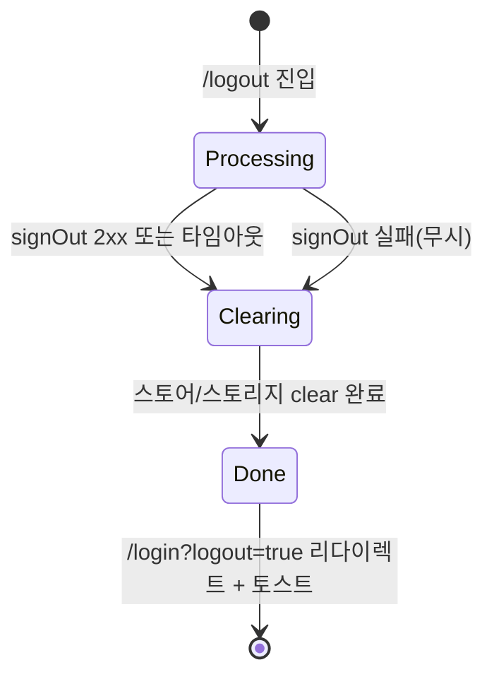

# SCR-109 로그아웃 — 기본화면 (마스터)

> 이 문서는 **화면 마스터 스펙**입니다. `01~03` 상태 문서는 이 문서를 상속(override/delta)합니다.
> 로그아웃은 별도 UI 페이지라기보다 **처리 전이 화면 + 토스트 후 /login 리다이렉트** 구조. DLG-001 확인 → 이 화면의 상태들을 순차 통과.

---

## 0. 메타 & 원천 참조

| 항목 | 값 |
|------|----|
| 화면 ID | SCR-109 |
| 화면명 | 로그아웃 |
| 도메인 | D01-공통 |
| 경로 | `/logout` (transient, 300~800ms 유지) → `/login?logout=true` 로 즉시 리다이렉트 |
| Next.js Route Group | `(auth)` |
| 파일 경로 | `src/app/(auth)/logout/page.tsx` + `src/hooks/useLogout.ts` |
| 페이지 컴포넌트 | `LogoutPage` (세션 클리어 진행 화면) |
| 역할 | all (로그인 모든 역할) |
| 우선순위 | P0 |
| 플랫폼 | 데스크톱 / 태블릿 / 모바일 |
| i18n | ko-KR |
| 연관 DLG | `DLG-001` (로그아웃 확인), `DLG-000` (세션만료 자동) |

### 원천 문서 링크
| 문서 종류 | 경로 | 참조 섹션 |
|---|---|---|
| 화면설계서 (공통) | `docs/화면설계서/공통.md` | §5.1 사이드바 로그아웃, §16 감사로그(LOGOUT) |
| 상태전이도 | `docs/상태전이도.md` | §세션 상태 → 로그아웃 전이 |
| 에러코드정의서 | `docs/에러코드정의서.md` | §공통 E500001 (로그아웃 API 실패) |
| 다이어그램 F1 진입 | `docs/다이어그램/D01_공통/SCR-109_로그아웃/F1_진입.md` | 사이드바/헤더/세션만료/강제 |
| 다이어그램 F2 메인 | `docs/다이어그램/D01_공통/SCR-109_로그아웃/F2_메인.md` | logout API → clear → redirect |
| 다이어그램 F3 버튼액션 | `docs/다이어그램/D01_공통/SCR-109_로그아웃/F3_버튼액션.md` | 3개 트리거 위치 |
| 다이어그램 F6 상태별 | `docs/다이어그램/D01_공통/SCR-109_로그아웃/F6_상태별.md` | 처리중/클리어중/완료 |
| 다이어그램 F7 권한 | `docs/다이어그램/D01_공통/SCR-109_로그아웃/F7_권한.md` | 역할 무관 공통 |
| DLG-001 마스터 | `docs/화면설계서-상태별/D01-공통/DLG-001-로그아웃확인/00-기본화면.md` | 확인 모달 (이 화면의 진입 전 단계) |
| DLG-000 마스터 | `docs/화면설계서-상태별/D01-공통/DLG-000-세션만료/00-기본화면.md` | 자동 로그아웃 시 |
| 권한 매트릭스 | `docs/다이어그램/10_권한매트릭스/R1_역할화면_매트릭스.md` | 전 역할 |

---

## 1. 화면 목적 (Why)

사용자가 로그아웃을 의도한 순간(DLG-001 "확인" 클릭 또는 세션 자동 만료)부터 **안전한 로그인 화면 복귀까지의 전이 상태**를 UX 깜빡임 없이 시각화.
- 서버 세션 무효화(`POST /auth/logout`)와 클라이언트 정리(Zustand/localStorage)를 순서대로 실행.
- 실패해도 클라이언트 클리어는 **best-effort 강제 진행** → 보안 우선.
- 최종 `/login?logout=true` 리다이렉트 + 완료 토스트 표시.

---

## 2. 화면 레이아웃 (Wireframe)

### 2.1 풀뷰 와이어프레임 (데스크톱 1440px 기준)

```
┌──────────────────────────────────────────────────────────────────┐
│                                                                  │
│                     [  (no AppLayout)  ]                         │
│                                                                  │
│              bg-gradient (gray-50 → blue-50)                     │
│                                                                  │
│                    ┌────────────────────────┐                    │
│                    │                        │                    │
│                    │       ⟳ (spin)         │  ← Spinner (48px)  │
│                    │                        │                    │
│                    │  로그아웃 중입니다...    │  ← Title (18/26)   │
│                    │                        │                    │
│                    │  세션을 안전하게        │  ← Subtitle (14/20)│
│                    │  종료하고 있습니다.     │                    │
│                    │                        │                    │
│                    │  ──────────────────    │                    │
│                    │  ● 세션 무효화          │  ← Step indicator  │
│                    │  ○ 로컬 데이터 정리     │                    │
│                    │  ○ 로그인 화면 이동     │                    │
│                    │                        │                    │
│                    └────────────────────────┘                    │
│                                                                  │
│             © 2026 FitGenie CRM · 안전한 로그아웃                 │
└──────────────────────────────────────────────────────────────────┘
```

### 2.2 영역별 치수 / 역할 표

| 영역 | 위치 | 치수 | 역할 |
|------|------|------|------|
| Viewport BG | 전체 | `min-h-screen` | 배경 그라디언트 |
| Logout Card | 중앙 | `max-w-sm` × auto | 전이 상태 컨테이너 |
| Spinner | Card 최상단 | 48×48 | 진행 표시 (`Loader2` 또는 커스텀 ring) |
| Title | Spinner 아래 16px | 18/26 semibold | 현재 단계 타이틀 |
| Subtitle | Title 아래 8px | 14/20 regular | 보조 설명 |
| Divider | Sub 아래 20px | 1px gray-200 | 구분선 |
| Steps | Divider 아래 12px | auto | 3단계 체크리스트 |
| Footer | Viewport 하단 | 48px | "© 2026 FitGenie CRM" |

### 2.3 상태별 미묘한 차이 (완료 상태)

```
  ✓ (체크 아이콘, green)
  로그아웃 완료
  잠시 후 로그인 화면으로 이동합니다

  ● 세션 무효화
  ● 로컬 데이터 정리
  ● 로그인 화면 이동    ← 이동 직전
```

---

## 3. 디자인 토큰

### 3.1 색상 (Tailwind 토큰 매핑)
| 역할 | 클래스 | Hex | 용도 |
|------|--------|-----|------|
| bg.page | `bg-gradient-to-br from-gray-50 to-blue-50` | — | 배경 |
| bg.card | `bg-white` | #FFFFFF | 카드 |
| card.shadow | `shadow-xl ring-1 ring-gray-100` | — | 엘리베이션 |
| spinner | `text-blue-500` | #3B82F6 | 진행 스피너 |
| spinner.done | `text-emerald-500` | #10B981 | 완료 체크 |
| title.fg | `text-gray-900` | #111827 | 타이틀 |
| body.fg | `text-gray-600` | #4B5563 | 본문 |
| step.done.bullet | `bg-blue-600` | #2563EB | 완료 단계 원형 |
| step.active.bullet | `bg-blue-400 animate-pulse` | #60A5FA | 진행 중 단계 |
| step.pending.bullet | `bg-gray-300` | #D1D5DB | 미시작 단계 |
| step.text | `text-gray-700` | #374151 | 단계 텍스트 |
| footer.fg | `text-gray-400 text-xs` | #9CA3AF | 푸터 |

### 3.2 타이포그래피
| 토큰 | 스타일 | 용도 |
|------|--------|------|
| title | `text-lg font-semibold tracking-tight text-gray-900` | 제목 |
| subtitle | `text-sm text-gray-600 leading-relaxed` | 부제 |
| step.label | `text-xs text-gray-700` | 단계 라벨 |
| footer | `text-xs text-gray-400` | 푸터 |

### 3.3 간격 / 반경 / 그림자
| 토큰 | 값 |
|------|----|
| radius.card | `rounded-2xl` (16px) |
| shadow.card | `shadow-xl` |
| spacing.card | `p-8` |
| spacing.stack | `space-y-4` |
| step.gap | `space-y-2` |

### 3.4 모션 / 포커스
| 토큰 | 값 |
|------|----|
| spinner.spin | `animate-spin` (Loader2) |
| bullet.pulse | `animate-pulse` |
| check.enter | `animate-[scaleIn_200ms_ease-out]` (완료 체크 등장) |
| reduced | `motion-reduce:animate-none` (스피너는 대체 텍스트로 공지) |

---

## 4. 반응형 규칙

| 브레이크포인트 | 폭 | 카드 폭 | 패딩 | Spinner | 특이사항 |
|---|---|---|---|---|---|
| Mobile <640 | 100% | `max-w-xs w-[calc(100%-32px)]` | `p-6` | 40px | 카드 상하 `py-8` |
| Tablet 640~1024 | center | `max-w-sm` | `p-8` | 48px | 중앙 정렬 |
| Desktop ≥1024 | center | `max-w-sm` | `p-8` | 48px | Footer 고정 하단 |

모바일 키보드 오픈 케이스 없음(입력 필드 없음). landscape 대응 `py-4`.

---

## 5. 🔐 역할별(RBAC) 매트릭스

> 모든 로그인 역할이 동일 플로우. 멀티테넌트에 따른 분기 없음.

| 요소 | superAdmin | primary | owner | manager | fc | trainer | staff | front |
|---|:---:|:---:|:---:|:---:|:---:|:---:|:---:|:---:|
| 화면 진입 | ● | ● | ● | ● | ● | ● | ● | ● |
| 처리 중 스피너 노출 | ● | ● | ● | ● | ● | ● | ● | ● |
| 로컬 데이터 클리어 | ● | ● | ● | ● | ● | ● | ● | ● |
| /login 리다이렉트 | ● | ● | ● | ● | ● | ● | ● | ● |
| 감사로그 AUDIT.LOGOUT | ● | ● | ● | ● | ● | ● | ● | ● |
| branchId 컨텍스트 클리어 | ● | ● | ● | ● | ● | ● | ● | ● |

### 5.1 멀티테넌트
- `branchId` localStorage 값을 **전체 클리어** 대상 (super/primary도 예외 없음).
- 지점 전환 상태(`useBranchStore`) 리셋.
- 다음 로그인 시 사용자 기본 지점으로 재초기화.

---

## 6. 컴포넌트 트리

```
<LogoutLayout>                                   (no AppLayout, Auth 전용)
  <AuthBackground />                             bg-gradient
  <LogoutCard maxW="sm">                         src/components/auth/LogoutCard.tsx
    <LogoutSpinner done={step === 'done'} />     (Loader2 → CheckCircle 전환)
    <LogoutTitle step={step}>{TITLE[step]}</LogoutTitle>
    <LogoutSubtitle>{SUBTITLE[step]}</LogoutSubtitle>
    <Divider />
    <StepList>
      <StepItem label="세션 무효화"     status={statusOf(1)} />
      <StepItem label="로컬 데이터 정리" status={statusOf(2)} />
      <StepItem label="로그인 화면 이동" status={statusOf(3)} />
    </StepList>
  </LogoutCard>
  <LogoutFooter />
</LogoutLayout>
```

### 컴포넌트 명세
| 컴포넌트 | Props | 재사용 여부 |
|---|---|---|
| `LogoutPage` | (쿼리 `?reason=user|session|force` 읽음) | 전용 |
| `LogoutSpinner` | `{ done: boolean }` | 전용 |
| `StepList` | `{ steps: Array<{label, status}> }` | 공용 (위자드 스타일) |
| `StepItem` | `{ label: string; status: 'done'|'active'|'pending' }` | 전용 |
| `AuthBackground` | — | 공용 (SCR-100, SCR-106 과 공유) |

---

## 7. 데이터 계약

### 7.1 훅: `useLogout`

```ts
// src/hooks/useLogout.ts (SCR-109 + DLG-001 공유)
import { supabase } from '@/lib/supabase';
import { useAuthStore } from '@/stores/authStore';
import { useBranchStore } from '@/stores/branchStore';
import { useRouter } from 'next/navigation';

export function useLogout() {
  const router = useRouter();
  return async (reason: 'user' | 'session' | 'force' = 'user') => {
    // 1) 세션 무효화 (best-effort, timeout 2s)
    try {
      await Promise.race([
        supabase.auth.signOut(),
        new Promise((_, rej) => setTimeout(() => rej(new Error('timeout')), 2000)),
      ]);
    } catch (e) {
      // 무시. 클라이언트 클리어는 계속 진행
    }
    // 2) 클라이언트 상태/스토리지 클리어
    useAuthStore.getState().clear();
    useBranchStore.getState().clear();
    ['authToken','refreshToken','branchId','lastBranchId'].forEach(k => localStorage.removeItem(k));
    sessionStorage.clear();
    // 3) 멀티탭 broadcast (옵션)
    try { localStorage.setItem('logout_broadcast', String(Date.now())); } catch {}
    // 4) 리다이렉트
    router.replace(`/login?logout=true${reason !== 'user' ? `&reason=${reason}` : ''}`);
  };
}
```

### 7.2 API 계약

| 항목 | 값 |
|---|---|
| 엔드포인트 | `POST /auth/logout` (Supabase Auth signOut 래핑) |
| 요청 | `{}` (쿠키/토큰 기반) |
| 성공(204) | `{}` |
| 실패 | 무시 (best-effort) → 클라이언트 클리어 진행 |
| 타임아웃 | 2초 → 무시 |

### 7.3 상태 관리

```ts
// src/app/(auth)/logout/page.tsx 내부
type LogoutStep = 'processing' | 'clearing' | 'done';
const [step, setStep] = useState<LogoutStep>('processing');

useEffect(() => {
  (async () => {
    setStep('processing');
    try { await Promise.race([supabase.auth.signOut(), timeout(2000)]); } catch {}
    setStep('clearing');
    useAuthStore.getState().clear();
    useBranchStore.getState().clear();
    ['authToken','refreshToken','branchId'].forEach(k => localStorage.removeItem(k));
    setStep('done');
    toast.success('로그아웃되었습니다');
    setTimeout(() => router.replace('/login?logout=true'), 400);
  })();
}, []);
```

### 7.4 쿼리 파라미터

| 파라미터 | 값 | 의미 |
|---|---|---|
| `?reason=user` | 기본 | DLG-001 확인 후 사용자 의도 |
| `?reason=session` | 자동 | 세션 만료 (DLG-000 경유) |
| `?reason=force` | 강제 | 타 기기 로그인 감지, 관리자 강제 로그아웃 |

---

## 8. 비즈니스 룰

1. **진입 경로 3가지**: (a) DLG-001 확인 → 이 페이지, (b) DLG-000 자동 클리어 직후 → 이 페이지 스킵 가능, (c) 관리자 강제 로그아웃 → 서버 push + 이 페이지.
2. **최소 표시 시간 300ms**: 너무 빨리 리다이렉트되면 사용자 혼란. `Math.max(300, elapsed)` 보장.
3. **타임아웃 2초**: `supabase.auth.signOut()` 2초 초과 시 무시하고 다음 단계 진행.
4. **강제 진행 원칙**: 서버 실패/네트워크 단절 시에도 클라이언트 클리어는 반드시 실행 → 보안 우선.
5. **감사 로그**: 클라이언트 성공 시 `AUDIT.LOGOUT` 로컬 기록 → 다음 로그인에 batch 업로드. 서버가 204 를 주면 그 시점에 서버도 기록.
6. **멀티탭 동기화**: `localStorage.setItem('logout_broadcast', ts)` → 다른 탭 `storage` 이벤트 수신 → DLG-000 자동 오픈 (또는 즉시 클리어).
7. **이중 진입 방지**: 이미 `/logout` 경로에 있으면 추가 트리거 무시.
8. **Dirty 상태 무시**: 로그아웃 플로우는 DLG-002 이탈 경고를 **표시하지 않음** (공통.md §5.2). 로그아웃 의도가 우선.
9. **back 키 차단**: `/logout` 에서 뒤로가기 → 바로 `/login` 으로.
10. **세션 쿠키 정리**: Supabase SSR 쿠키(`sb-access-token`, `sb-refresh-token`) 서버에서 `Set-Cookie: ...; Max-Age=0` 으로 제거.

---

## 9. 상태 목록

| 파일 | 상태 코드 | 한글 | 트리거 |
|---|---|---|---|
| `01-처리중.md` | `logout-processing` | 처리 중 | 진입 직후 + `supabase.auth.signOut()` 호출 중 |
| `02-클리어중.md` | `logout-clearing` | 클리어 중 | 서버 응답 후 Zustand/localStorage 정리 중 |
| `03-완료.md` | `logout-done` | 완료 | 클리어 끝 + `/login?logout=true` 리다이렉트 직전 |

상태 전이: `01 → 02 → 03 → /login`. API 실패 시에도 동일 순서 강제 진행.

---

## 10. 에러 코드 매핑

| errorCode | 시나리오 | 표시 | 추가 액션 |
|---|---|---|---|
| (none) 정상 | signOut 204 | 각 상태 정상 진행 | `/login?logout=true` |
| E500001 | signOut 500 | 내부 콘솔 로그만, 화면은 정상 진행 | 클라이언트 클리어 강제 |
| NETWORK | 네트워크 단절 | 내부 무시 | 클라이언트 클리어 강제 |
| Timeout 2s | 응답 지연 | 내부 무시 | 클라이언트 클리어 강제 |
| E401002 | 이미 세션 만료 | DLG-000 로 리다이렉트 대신, 이 화면 유지 → 클리어만 진행 | `/login?reason=session` |

---

## 11. 접근성 (WCAG 2.1 AA)

| 항목 | 요구사항 |
|---|---|
| 의미 구조 | `<main role="main">` + `<h1>` 타이틀, 단계 리스트는 `<ol>` |
| 라이브 리전 | 현재 단계 표시 `aria-live="polite" aria-atomic="true"` — 스크린리더에 진행 상황 공지 |
| 스피너 | `role="status" aria-label="로그아웃 처리 중"` |
| 포커스 | 사용자 입력 없음 — 자동 리다이렉트이므로 포커스 강제 이동 불필요 |
| 키보드 | 어떤 키 입력도 플로우 방해 금지. `Esc` 도 취소 불가 (이미 시작됨) |
| 대비 | 본문 4.5:1, 체크 아이콘 3:1 이상 |
| 모션 감소 | `prefers-reduced-motion:reduce` → `animate-spin` 제거, 대체 텍스트 "처리 중..." 반복 표시 |
| 색상 의존 금지 | 완료 단계는 색상(green) + 아이콘(`CheckCircle`) 병행 |

---

## 12. 진입/이탈 연결

### 진입
- DLG-001 "로그아웃" 확정 → `router.replace('/logout')`
- DLG-000 "로그인 화면으로" 확정 → 직접 로그아웃 훅 호출 (이 페이지 스킵 가능) / 또는 `/logout?reason=session`
- 관리자 강제 로그아웃 (서버 푸시) → `/logout?reason=force`
- 타 기기 로그인 감지 → `/logout?reason=force`

### 이탈
| 단계 | 목적지 |
|---|---|
| `01-처리중` → `02-클리어중` | 자동 (signOut 응답 or timeout) |
| `02-클리어중` → `03-완료` | 자동 (스토어 clear 완료) |
| `03-완료` → `/login?logout=true` | 자동 (400ms 지연 후 replace) |
| (비정상) 사용자가 URL 변경 | `/login` 으로 강제 redirect (페이지 guard) |

---

## 13. 다이어그램 통합 뷰



참조: `docs/다이어그램/D01_공통/SCR-109_로그아웃/F6_상태별.md`

---

## 14. 🧩 바이브코딩 프롬프트 (마스터)

```
Next.js 15 App Router + TypeScript + Tailwind + Supabase + Zustand 기반
'use client' 로그아웃 전이 페이지를 작성하라.

━━ 파일 구성 ━━
src/app/(auth)/logout/page.tsx
src/hooks/useLogout.ts
src/components/auth/LogoutCard.tsx
src/components/auth/StepList.tsx

━━ 훅 (DLG-001 과 공유) ━━
// src/hooks/useLogout.ts
import { supabase } from '@/lib/supabase';
import { useAuthStore } from '@/stores/authStore';
import { useBranchStore } from '@/stores/branchStore';
import { useRouter } from 'next/navigation';

export function useLogout() {
  const router = useRouter();
  return async (reason: 'user' | 'session' | 'force' = 'user') => {
    try {
      await Promise.race([
        supabase.auth.signOut(),
        new Promise((_, rej) => setTimeout(() => rej(new Error('timeout')), 2000)),
      ]);
    } catch {}
    useAuthStore.getState().clear();
    useBranchStore.getState().clear();
    ['authToken','refreshToken','branchId','lastBranchId'].forEach(k => localStorage.removeItem(k));
    sessionStorage.clear();
    try { localStorage.setItem('logout_broadcast', String(Date.now())); } catch {}
    router.replace(`/login?logout=true${reason !== 'user' ? `&reason=${reason}` : ''}`);
  };
}

━━ LogoutPage ━━
'use client';
import { useEffect, useState } from 'react';
import { useRouter, useSearchParams } from 'next/navigation';
import { Loader2, Check } from 'lucide-react';
import { supabase } from '@/lib/supabase';
import { useAuthStore } from '@/stores/authStore';
import { useBranchStore } from '@/stores/branchStore';
import { toast } from 'sonner';

type LogoutStep = 'processing' | 'clearing' | 'done';
const TITLE: Record<LogoutStep, string> = {
  processing: '로그아웃 중입니다...',
  clearing:   '로컬 데이터를 정리하고 있습니다',
  done:       '로그아웃 완료',
};
const SUBTITLE: Record<LogoutStep, string> = {
  processing: '세션을 안전하게 종료하고 있습니다.',
  clearing:   '저장된 정보를 정리하고 있습니다.',
  done:       '잠시 후 로그인 화면으로 이동합니다.',
};

export default function LogoutPage() {
  const router = useRouter();
  const sp = useSearchParams();
  const reason = (sp.get('reason') ?? 'user') as 'user' | 'session' | 'force';
  const [step, setStep] = useState<LogoutStep>('processing');

  useEffect(() => {
    let cancelled = false;
    (async () => {
      const started = Date.now();
      // 1) 서버 세션 무효화 (best-effort + 2s timeout)
      try {
        await Promise.race([
          supabase.auth.signOut(),
          new Promise((_,rej) => setTimeout(() => rej(new Error('timeout')), 2000)),
        ]);
      } catch {}
      if (cancelled) return;
      setStep('clearing');
      // 2) 클리어
      useAuthStore.getState().clear();
      useBranchStore.getState().clear();
      ['authToken','refreshToken','branchId','lastBranchId'].forEach(k => localStorage.removeItem(k));
      sessionStorage.clear();
      try { localStorage.setItem('logout_broadcast', String(Date.now())); } catch {}
      // 3) 최소 300ms 유지
      const elapsed = Date.now() - started;
      const remain = Math.max(0, 300 - elapsed);
      await new Promise(r => setTimeout(r, remain));
      if (cancelled) return;
      setStep('done');
      toast.success('로그아웃되었습니다');
      setTimeout(() => {
        router.replace(`/login?logout=true${reason !== 'user' ? `&reason=${reason}` : ''}`);
      }, 400);
    })();
    return () => { cancelled = true; };
  }, [router, reason]);

  const statusOf = (n: 1 | 2 | 3): 'done' | 'active' | 'pending' => {
    if (step === 'processing') return n === 1 ? 'active' : 'pending';
    if (step === 'clearing')   return n <= 1 ? 'done' : n === 2 ? 'active' : 'pending';
    return 'done';
  };

  return (
    <main role="main"
          className="min-h-screen flex items-center justify-center
                     bg-gradient-to-br from-gray-50 to-blue-50 px-4 py-8">
      <section aria-labelledby="logout-title"
               className="w-full max-w-sm bg-white rounded-2xl shadow-xl ring-1 ring-gray-100 p-8 space-y-4 text-center
                          motion-reduce:animate-none animate-[fadeInUp_200ms_ease-out]">
        <div className="mx-auto size-12 grid place-items-center" role="status" aria-label={TITLE[step]}>
          {step === 'done'
            ? <Check className="size-10 text-emerald-500 motion-reduce:animate-none animate-[scaleIn_200ms_ease-out]" aria-hidden />
            : <Loader2 className="size-10 text-blue-500 animate-spin motion-reduce:animate-none" aria-hidden />}
        </div>
        <h1 id="logout-title" className="text-lg font-semibold tracking-tight text-gray-900">
          {TITLE[step]}
        </h1>
        <p className="text-sm text-gray-600 leading-relaxed">{SUBTITLE[step]}</p>
        <div className="h-px bg-gray-200" />
        <ol className="space-y-2 text-left" aria-live="polite" aria-atomic="true">
          {[
            { n: 1 as const, label: '세션 무효화' },
            { n: 2 as const, label: '로컬 데이터 정리' },
            { n: 3 as const, label: '로그인 화면 이동' },
          ].map(({ n, label }) => {
            const s = statusOf(n);
            return (
              <li key={n} className="flex items-center gap-3 text-xs text-gray-700">
                <span className={
                  s === 'done'    ? 'size-2 rounded-full bg-blue-600'
                  : s === 'active' ? 'size-2 rounded-full bg-blue-400 animate-pulse motion-reduce:animate-none'
                  :                  'size-2 rounded-full bg-gray-300'
                } aria-hidden />
                <span className={s === 'done' ? 'text-gray-900' : s === 'active' ? 'text-gray-900 font-medium' : 'text-gray-500'}>
                  {label}
                </span>
              </li>
            );
          })}
        </ol>
      </section>
      <footer className="fixed bottom-4 left-0 right-0 text-center text-xs text-gray-400">
        © 2026 FitGenie CRM · 안전한 로그아웃
      </footer>
    </main>
  );
}

━━ 디자인 토큰 (정확히) ━━
wrap:       min-h-screen flex items-center justify-center bg-gradient-to-br from-gray-50 to-blue-50 px-4 py-8
card:       w-full max-w-sm bg-white rounded-2xl shadow-xl ring-1 ring-gray-100 p-8 space-y-4 text-center
spinner:    size-10 text-blue-500 animate-spin
check.done: size-10 text-emerald-500
title:      text-lg font-semibold tracking-tight text-gray-900
subtitle:   text-sm text-gray-600 leading-relaxed
divider:    h-px bg-gray-200
step.active.dot: size-2 rounded-full bg-blue-400 animate-pulse
step.done.dot:   size-2 rounded-full bg-blue-600
step.pending.dot: size-2 rounded-full bg-gray-300
footer:     fixed bottom-4 text-xs text-gray-400

━━ 가드 ━━
// middleware 또는 페이지 가드: 이미 인증 없음 + /logout 진입 시 바로 /login 이동
// src/middleware.ts (선택)
// ...

━━ QA 체크 ━━
- DLG-001 확정 → /logout 경유 → /login?logout=true 이동
- 3단계 step UI 순차 업데이트
- signOut timeout 2s 초과 시 강제 진행
- Zustand/localStorage 모두 클리어
- aria-live 로 단계별 공지
- 모션 감소 설정 시 spin 제거
- 뒤로가기 시 /login 으로
- reason=session / reason=force 쿼리 반영
```

---

## 15. QA 체크리스트 (수용 기준)

- [ ] DLG-001 "로그아웃" 클릭 → `/logout` 이동 → 300~800ms 유지 → `/login?logout=true` 로 리다이렉트
- [ ] `01-처리중` → `02-클리어중` → `03-완료` 순차 렌더
- [ ] `supabase.auth.signOut()` 2초 초과 시 강제 진행
- [ ] `useAuthStore.clear()`, `useBranchStore.clear()` 호출
- [ ] `localStorage` 에서 `authToken/refreshToken/branchId` 제거
- [ ] `sessionStorage.clear()` 호출
- [ ] `logout_broadcast` localStorage key 세팅 → 다른 탭 수신
- [ ] 토스트 "로그아웃되었습니다" 표시 (`/login` 도착 후)
- [ ] `?reason=session` 시 로그인 화면에서 세션 만료 안내
- [ ] `?reason=force` 시 로그인 화면에서 강제 로그아웃 안내
- [ ] 스피너 `role="status"` + `aria-label`
- [ ] 단계 리스트 `aria-live="polite"` 공지
- [ ] 모바일 360px 가독성
- [ ] 뒤로가기 시 `/login` 으로
- [ ] 이중 진입 방지 (이미 `/logout` 이면 무시)
- [ ] 감사로그 `AUDIT.LOGOUT` 기록 (서버/클라)
- [ ] 색상 의존 없이 아이콘+텍스트로 완료 표시
- [ ] prefers-reduced-motion 준수 (spin 제거)
