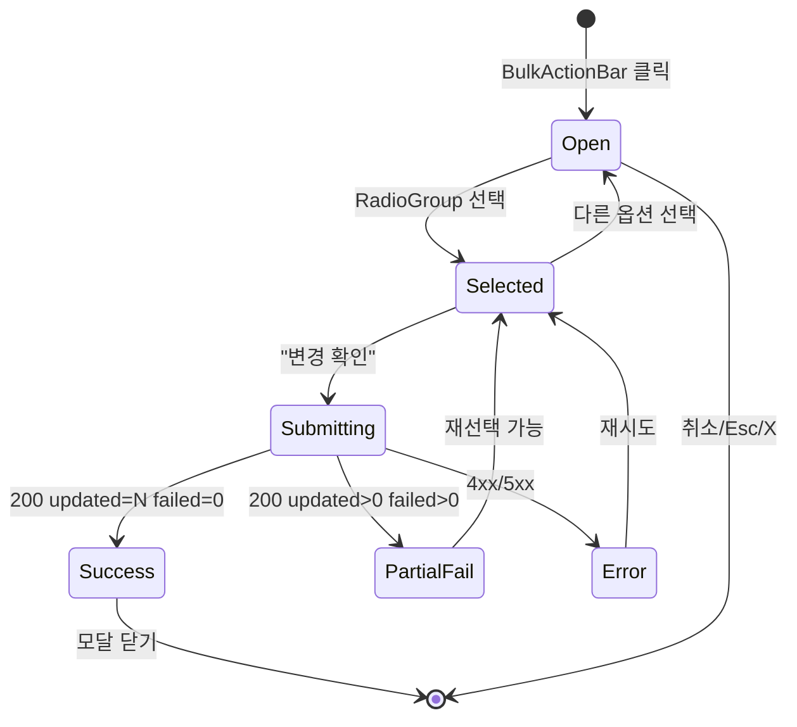

# DLG-M001 상태 일괄 변경 — 기본화면 (마스터)

> 이 문서는 **다이얼로그 마스터 스펙**입니다. `01~04` 상태 문서는 이 문서를 상속(override/delta)합니다.
> 🚨 **Destructive 레벨**: warn (상태 일괄 변경은 되돌릴 수 있으나 다수 회원 영향) — 복수 명시적 확인 필요.
> 🏢 **멀티테넌트**: `branchId` 강제 적용. 서버는 jwt의 branchId 범위 외 회원 변경 거부.

---

## 0. 메타 & 원천 참조

| 항목 | 값 |
|------|----|
| 다이얼로그 ID | DLG-M001 |
| 다이얼로그명 | 상태 일괄 변경 (Bulk Status Change) |
| 도메인 | D02-회원관리 |
| 부모 화면 (트리거) | SCR-M001 회원목록 `/members` BulkActionBar |
| 라우트 (무변경) | `/members` (오버레이) |
| 파일 경로 | `src/components/members/BulkStatusChangeDialog.tsx` |
| 컴포넌트 | `BulkStatusChangeDialog` |
| 역할 | `superAdmin`, `primary`, `owner`, `manager` (중대 운영 권한) |
| 우선순위 | P1 |
| 확인 레벨 | `warn` (destructive 아님, 되돌릴 수 있음) |
| 서버 blocking | ✅ Yes (PATCH `/members/bulk-status` 완료 전까지 모달 유지) |
| Esc 동작 | 모달 닫기 (제출 중 제외) |
| 포커스 트랩 | ✅ Radix Dialog 기본 제공 |
| 트리거 조건 | `selectedRows.size > 0` AND `hasFeature(role, 'memberBulkStatus')` |

### 원천 문서 링크
| 문서 | 경로 | 섹션 |
|---|---|---|
| 화면설계서 | `docs/화면설계서/회원관리.md` | §DLG-M001 상태 변경 다이얼로그 (L2123~2159) |
| 기능명세서 | `docs/기능명세서/회원관리.md` | §회원 상태 CRUD |
| 상태전이도 | `docs/상태전이도.md` | §1. 회원 상태 (ACTIVE↔HOLDING↔SUSPENDED↔INACTIVE) |
| 에러코드정의서 | `docs/에러코드정의서.md` | §4.2 회원 관리 (E409101, E422100, E422101, E403001) |
| 다이어그램 M1 생명주기 | `docs/다이어그램/D02_회원관리/DLG/DLG-M001_상태변경/M1_생명주기.md` | 열림→선택중→제출중→닫힘 |
| 다이어그램 M2 필드검증 | `docs/다이어그램/D02_회원관리/DLG/DLG-M001_상태변경/M2_필드검증.md` | 상태 전이 규칙 |
| 다이어그램 M3 결과분기 | `docs/다이어그램/D02_회원관리/DLG/DLG-M001_상태변경/M3_결과분기.md` | 성공/부분성공/실패 |
| 권한 매트릭스 | `docs/다이어그램/10_권한매트릭스/R1_역할화면_매트릭스.md` | 회원 상태 변경 권한 |

---

## 1. 화면 목적 (Why)

회원 목록에서 **다수 회원(N명)** 을 선택 후, 한 번의 조작으로 회원 상태를 일괄 전환한다.
- 대상: `ACTIVE`, `EXPIRED`, `HOLDING`, `INACTIVE`, `WITHDRAWN`, `SUSPENDED` 중 선택
- 복수 회원 운영 효율(만료 회원 일괄 비활성 등) 향상 목적
- 서버는 jwt 역할·branchId로 범위 강제. 잘못된 상태 전이(예: WITHDRAWN → ACTIVE)는 거부
- 일괄 처리 중 일부 실패 허용(부분 성공 응답)

---

## 2. 화면 레이아웃 (Wireframe)

### 2.1 모달 구조 (Radix Dialog + Tailwind, max-w-sm)

```
┌────────────────────────────────────────────────┐ ← Overlay (bg-black/40 backdrop-blur-sm)
│                                                │
│         ┌───────────────────────────────┐     │
│         │ 상태 일괄 변경             [X] │ ← Header (h-14, border-b)
│         ├───────────────────────────────┤
│         │ 선택한 <b>12</b>명의 상태를    │ ← Subtitle (text-sm text-gray-600)
│         │ 변경합니다.                   │
│         │                               │
│         │ ◉ 활성 (정상 이용 중)          │ ← RadioGroup
│         │ ○ 홀딩 (일시 정지)             │    item h-11, border, rounded-lg
│         │ ○ 정지 (이용 제한)             │    gap-2, px-3
│         │ ○ 만료 (이용권 종료)           │
│         │ ○ 비활성                      │
│         │ ○ 탈퇴 (⚠ 되돌릴 수 없음)      │ ← WARN 행: text-red-600 + icon
│         │                               │
│         │ ┌───────────────────────┐     │ ← 경고 배너 (상태 선택에 따라)
│         │ │ ⚠ WITHDRAWN 으로 전환 │     │    bg-amber-50 border-amber-200
│         │ │   시 개인정보 마스킹   │     │
│         │ └───────────────────────┘     │
│         │                               │
│         │ 선택 사유 (선택)               │ ← textarea (2행)
│         │ ┌───────────────────────┐     │
│         │ │                       │     │
│         │ └───────────────────────┘     │
│         ├───────────────────────────────┤
│         │              [취소] [변경 확인]│ ← Footer (h-16, justify-end, gap-2)
│         └───────────────────────────────┘
│                                                │
└────────────────────────────────────────────────┘
```

### 2.2 영역별 치수
| 영역 | 치수 | 스타일 |
|---|---|---|
| Overlay | viewport 전체 | `fixed inset-0 bg-black/40 backdrop-blur-sm z-50` |
| Content | `max-w-sm` (384px) `w-[92vw]` | `bg-white rounded-xl shadow-xl ring-1 ring-gray-200` |
| Header | `h-14 px-5 py-3 border-b` | `flex items-center justify-between` |
| Body | `p-5 space-y-4` | 스크롤 `max-h-[70vh] overflow-y-auto` |
| Footer | `h-16 px-5 border-t` | `flex items-center justify-end gap-2` |
| RadioItem | `h-11` | `flex items-center gap-3 px-3 rounded-lg hover:bg-gray-50` |

---

## 3. 디자인 토큰

### 3.1 색상 (확인 레벨 warn)
| 토큰 | 클래스 | 용도 |
|---|---|---|
| overlay | `bg-black/40 backdrop-blur-sm` | 모달 오버레이 |
| content | `bg-white rounded-xl shadow-xl ring-1 ring-gray-200` | 모달 본체 |
| title | `text-lg font-semibold text-gray-900` | 제목 |
| subtitle | `text-sm text-gray-600` | 설명 |
| radio.default | `border-gray-300` | 라디오 기본 |
| radio.checked | `border-blue-600 bg-blue-50` | 선택됨 |
| radio.danger | `border-red-300 bg-red-50 text-red-700` | WITHDRAWN/SUSPENDED |
| warn.banner | `bg-amber-50 border-amber-200 text-amber-800` | 경고 |
| btn.cancel | `bg-white text-gray-700 ring-1 ring-gray-300 hover:bg-gray-50` | 취소 |
| btn.primary | `bg-blue-600 hover:bg-blue-700 text-white` | 변경 확인 |
| btn.primary.loading | `bg-blue-400 cursor-wait` | 제출 중 |

### 3.2 타이포그래피
| 토큰 | 스타일 |
|---|---|
| title | `text-lg font-semibold text-gray-900` |
| subtitle | `text-sm text-gray-600` |
| radio.label | `text-sm font-medium text-gray-900` |
| radio.desc | `text-xs text-gray-500` |
| warn.text | `text-sm text-amber-800` |

### 3.3 간격/반경/그림자/모션
| 토큰 | 값 |
|---|---|
| radius.content | `rounded-xl` (12px) |
| radius.radio | `rounded-lg` (8px) |
| shadow.content | `shadow-xl` |
| spacing.body | `p-5 space-y-4` |
| motion.enter | `data-[state=open]:animate-[contentIn_160ms_ease-out]` |
| motion.exit | `data-[state=closed]:animate-[contentOut_120ms_ease-in]` |

---

## 4. 반응형 규칙

| BP | 폭 | 모달 폭 | 동작 |
|---|---|---|---|
| Mobile <640 | 100% | `w-[92vw] max-w-sm` | 하단 고정 시트 옵션(`sm:bottom-auto`) |
| Tablet 640~1024 | 100% | `max-w-sm` (384px) | 중앙 정렬 |
| Desktop ≥1024 | — | `max-w-sm` | 중앙 정렬 |

- 모바일에서 키보드 오픈 시 `Footer sticky bottom-0 bg-white`

---

## 5. 🔐 역할별(RBAC) 매트릭스

| 요소 | superAdmin | primary | owner | manager | fc | trainer | staff | front |
|---|:---:|:---:|:---:|:---:|:---:|:---:|:---:|:---:|
| 트리거 버튼 노출 (BulkActionBar) | ● | ● | ● | ● | — | — | — | — |
| 다이얼로그 열기 | ● | ● | ● | ● | — | — | — | — |
| 상태 ACTIVE로 변경 | ● | ● | ● | ● | — | — | — | — |
| 상태 HOLDING로 변경 | ● | ● | ● | ● | — | — | — | — |
| 상태 SUSPENDED로 변경 | ● | ● | ● | ○(요청만) | — | — | — | — |
| 상태 WITHDRAWN로 변경 | ● | ● | ● | — (OWNER 이상만) | — | — | — | — |
| 상태 INACTIVE로 변경 | ● | ● | ● | ● | — | — | — | — |
| "선택 사유" 입력 | ● | ● | ● | ● | — | — | — | — |

**역할별 옵션 필터**: `manager`에게는 `WITHDRAWN` 라디오 옵션 자체 비표시.
**branchId 강제**: `selectedRows`의 모든 회원이 `user.branchId`에 속해야 함(서버 이중 검증).

---

## 6. 컴포넌트 트리

```tsx
<Dialog open={isOpen} onOpenChange={setIsOpen}>
  <DialogOverlay className="fixed inset-0 bg-black/40 backdrop-blur-sm z-50" />
  <DialogContent className="fixed left-1/2 top-1/2 -translate-x-1/2 -translate-y-1/2
                             w-[92vw] max-w-sm bg-white rounded-xl shadow-xl ring-1 ring-gray-200 z-50">
    <DialogHeader className="h-14 px-5 py-3 border-b flex items-center justify-between">
      <DialogTitle className="text-lg font-semibold text-gray-900">
        상태 일괄 변경
      </DialogTitle>
      <DialogClose className="rounded-md p-1 hover:bg-gray-100" aria-label="닫기">
        <X size={16} />
      </DialogClose>
    </DialogHeader>

    <div className="p-5 space-y-4 max-h-[70vh] overflow-y-auto">
      <p className="text-sm text-gray-600">
        선택한 <b className="text-gray-900">{selectedRows.size}</b>명의 상태를 변경합니다.
      </p>

      <RadioGroup value={status} onValueChange={setStatus} className="space-y-2">
        {STATUS_OPTIONS.filter(o => canSelect(o.value, role)).map(opt => (
          <RadioGroupItem
            key={opt.value}
            value={opt.value}
            className={cn(
              'flex items-center gap-3 h-11 px-3 rounded-lg border cursor-pointer',
              status === opt.value
                ? opt.danger ? 'border-red-300 bg-red-50' : 'border-blue-600 bg-blue-50'
                : 'border-gray-200 hover:bg-gray-50'
            )}>
            <RadioIndicator />
            <div className="flex-1">
              <div className={cn('text-sm font-medium', opt.danger ? 'text-red-700' : 'text-gray-900')}>
                {opt.label}
              </div>
              <div className="text-xs text-gray-500">{opt.desc}</div>
            </div>
          </RadioGroupItem>
        ))}
      </RadioGroup>

      {status === 'WITHDRAWN' && (
        <div role="alert" className="bg-amber-50 border border-amber-200 rounded-lg p-3 text-sm text-amber-800">
          ⚠ 탈퇴로 전환 시 개인정보가 30일 후 자동 마스킹됩니다.
        </div>
      )}

      <div>
        <label htmlFor="bulk-reason" className="block text-sm font-medium text-gray-700 mb-1">
          변경 사유 (선택)
        </label>
        <textarea id="bulk-reason" rows={2}
          value={reason} onChange={e => setReason(e.target.value)}
          className="w-full rounded-lg border border-gray-300 px-3 py-2 text-sm
                     focus:ring-2 focus:ring-blue-500 focus:border-blue-500"
          placeholder="감사 로그에 기록됩니다" />
      </div>

      {errorCode && <ErrorBanner code={errorCode} />}
    </div>

    <DialogFooter className="h-16 px-5 border-t flex items-center justify-end gap-2">
      <Button variant="outline" onClick={handleClose} disabled={isSubmitting}>
        취소
      </Button>
      <Button variant="primary" onClick={handleSubmit}
              disabled={!status || isSubmitting}
              loading={isSubmitting}>
        {isSubmitting ? '변경 중...' : '변경 확인'}
      </Button>
    </DialogFooter>
  </DialogContent>
</Dialog>
```

### 6.1 핵심 컴포넌트
| 컴포넌트 | 파일 | Props |
|---|---|---|
| `BulkStatusChangeDialog` | `src/components/members/BulkStatusChangeDialog.tsx` | `{ open, onOpenChange, selectedIds, onSuccess }` |
| `RadioGroup`/`RadioGroupItem` | `@radix-ui/react-radio-group` | — |
| `Dialog` | `@radix-ui/react-dialog` | — |
| `ErrorBanner` | `src/components/ui/ErrorBanner.tsx` | `{ code, message }` |

---

## 7. 데이터 계약

### 7.1 폼 스키마 (Zod)
```ts
// src/schemas/members.ts
export const bulkStatusChangeSchema = z.object({
  memberIds: z.array(z.string().uuid()).min(1, '대상 회원이 없습니다'),
  status: z.enum(['ACTIVE', 'HOLDING', 'SUSPENDED', 'INACTIVE', 'EXPIRED', 'WITHDRAWN']),
  reason: z.string().max(500).optional(),
});
export type BulkStatusChange = z.infer<typeof bulkStatusChangeSchema>;
```

### 7.2 API 계약

| 항목 | 값 |
|---|---|
| 엔드포인트 | `PATCH /api/members/bulk-status` |
| 요청 body | `{ memberIds: string[], status: MemberStatus, reason?: string, branchId: string }` |
| 성공 (200) | `{ success: true, data: { updated: number, failed: Array<{id, errorCode}> } }` |
| 실패 (403) | E403001 권한 없음 |
| 실패 (409) | E409101 회원 상태 충돌 |
| 실패 (422) | E422101 탈퇴 회원 작업 불가 |
| 실패 (500) | E500001 |

### 7.3 상태 관리
- **로컬**: `useState<MemberStatus | undefined>(undefined)` (초기 미선택)
- **제출**: `useMutation` (React Query), `onSuccess → refetch members + close dialog`
- **감사 로그**: 성공 시 `AUDIT.MEMBER_BULK_STATUS_CHANGE` 자동 기록

---

## 8. 비즈니스 룰

1. **트리거**: `selectedRows.size > 0` 일 때만 버튼 활성. 다이얼로그 내부에서도 `memberIds.length >= 1` 재검증.
2. **초기값**: `status = undefined` (선택 강제). 확인 버튼 `disabled` until 선택.
3. **전이 규칙** (상태전이도 §1.3 준수):
   - ACTIVE ↔ HOLDING ↔ SUSPENDED ↔ INACTIVE 자유
   - ACTIVE → WITHDRAWN 가능 (OWNER 이상)
   - WITHDRAWN → * **불가** (서버 E422101)
   - EXPIRED → ACTIVE 불가 (재구매 필요)
4. **부분 성공 허용**: 일부 회원이 상태 전이 위반 시, 성공 수·실패 수 분리 응답. 토스트에 요약.
5. **중복 제출 방지**: `isSubmitting=true` 동안 버튼 `disabled`, 모달 닫기 차단.
6. **Esc 제한**: `isSubmitting=true`면 Esc 무시 (포커스 트랩 유지).
7. **감사 로그**: `reason` 포함 `AUDIT.MEMBER_BULK_STATUS` 기록.
8. **멀티테넌트**: `branchId` 서버 검증. URL 조작 등으로 타 지점 회원 포함 시 403.

---

## 9. 상태 목록

| 파일 | 상태 코드 | 한글 | 트리거 |
|---|---|---|---|
| `01-열림.md` | `open` | 열림 (초기, 미선택) | BulkActionBar "상태 변경" 클릭 |
| `02-선택중.md` | `selected` | 상태 선택 완료 | 라디오 선택 |
| `03-제출중.md` | `submitting` | 서버 제출 중 | "변경 확인" 클릭 |
| `04-성공또는실패.md` | `done` | 성공/부분실패/실패 | API 응답 수신 |

상태 전이 그래프: `docs/다이어그램/D02_회원관리/DLG/DLG-M001_상태변경/M1_생명주기.md`

---

## 10. 에러 코드 매핑

| errorCode | HTTP | 메시지 | UI 대응 |
|---|---|---|---|
| E403001 | 403 | 접근 권한이 없습니다 | 토스트 + 모달 닫기 |
| E409101 | 409 | 현재 상태에서는 해당 작업을 수행할 수 없습니다 | 인라인 배너 + 부분 성공 결과 |
| E422100 | 422 | 기간정지 가능 횟수를 초과했습니다 | 인라인 배너 (HOLDING만) |
| E422101 | 422 | 탈퇴한 회원에 대해서는 해당 작업을 수행할 수 없습니다 | 인라인 배너 + 실패 목록 |
| E500001 | 500 | 일시적인 오류가 발생했습니다 | 토스트 + 재시도 버튼 |
| NETWORK | — | 네트워크 연결을 확인해주세요 | 재시도 버튼 |

---

## 11. 접근성 (WCAG 2.1 AA)

| 항목 | 요구사항 |
|---|---|
| Dialog 구조 | `role="dialog" aria-modal="true" aria-labelledby="dlg-title"` |
| 포커스 트랩 | Radix 기본 (Tab/Shift+Tab 순환) |
| 초기 포커스 | 첫 RadioItem |
| 포커스 복귀 | 모달 닫힘 시 트리거 버튼으로 복귀 |
| 라디오 그룹 | `role="radiogroup" aria-labelledby` + 방향키 이동 |
| 에러 전달 | `role="alert" aria-live="assertive"` |
| Esc | 모달 닫기 (제출 중 제외) |
| 대비비 | 본문 4.5:1, 버튼 4.5:1 |
| 스크린 리더 | "N명의 회원 상태를 {label}로 변경" 요약 발화 |

---

## 12. 진입/이탈 연결

### 진입
- SCR-M001 BulkActionBar "상태 변경" (`selectedRows.size > 0`)

### 이탈
| 액션 | 목적지 |
|---|---|
| 취소/Esc/X | 모달 닫기, SCR-M001 유지 (selectedRows 보존) |
| 변경 확인 성공 | 모달 닫기 + 토스트 + 목록 refetch + selectedRows 초기화 |
| 부분 실패 | 모달 유지(실패 회원 강조 배너) 또는 닫기(설정) |
| 전체 실패 | 모달 유지 + 에러 배너 + 재시도 가능 |

---

## 13. 다이어그램 통합 뷰



---

## 14. 🧩 바이브코딩 프롬프트 마스터

```
Next.js 15 App Router + TypeScript + Tailwind + Radix UI + React Query + Supabase 기반
'use client' 다이얼로그 컴포넌트를 작성하라.

━━ 화면: DLG-M001 상태 일괄 변경 (Bulk Status Change) ━━
파일: src/components/members/BulkStatusChangeDialog.tsx
부모: src/app/(dashboard)/members/page.tsx (SCR-M001)

━━ Props ━━
interface Props {
  open: boolean;
  onOpenChange: (open: boolean) => void;
  selectedIds: string[];
  branchId: string;
  onSuccess?: (result: { updated: number; failed: number }) => void;
}

━━ 상태 옵션 ━━
const STATUS_OPTIONS = [
  { value: 'ACTIVE',     label: '활성',   desc: '정상 이용 중', danger: false },
  { value: 'HOLDING',    label: '홀딩',   desc: '일시 정지 중', danger: false },
  { value: 'SUSPENDED',  label: '정지',   desc: '이용 제한',    danger: true  },
  { value: 'EXPIRED',    label: '만료',   desc: '이용권 종료',  danger: false },
  { value: 'INACTIVE',   label: '비활성', desc: '미등록/비활동', danger: false },
  { value: 'WITHDRAWN',  label: '탈퇴',   desc: '⚠ 개인정보 마스킹', danger: true },
] as const;

━━ 권한 필터 ━━
const canSelect = (status: MemberStatus, role: Role) => {
  if (status === 'WITHDRAWN') return ['superAdmin','primary','owner'].includes(role);
  return ['superAdmin','primary','owner','manager'].includes(role);
};

━━ 레이아웃 ━━
<Dialog.Root open={open} onOpenChange={onOpenChange}>
  <Dialog.Portal>
    <Dialog.Overlay className="fixed inset-0 bg-black/40 backdrop-blur-sm z-50
                               data-[state=open]:animate-[fadeIn_150ms]" />
    <Dialog.Content className="fixed left-1/2 top-1/2 -translate-x-1/2 -translate-y-1/2
                                w-[92vw] max-w-sm bg-white rounded-xl shadow-xl
                                ring-1 ring-gray-200 z-50
                                data-[state=open]:animate-[contentIn_160ms_ease-out]"
                    onEscapeKeyDown={(e) => { if (isSubmitting) e.preventDefault(); }}
                    onPointerDownOutside={(e) => { if (isSubmitting) e.preventDefault(); }}>
      <div className="h-14 px-5 py-3 border-b flex items-center justify-between">
        <Dialog.Title className="text-lg font-semibold text-gray-900">
          상태 일괄 변경
        </Dialog.Title>
        <Dialog.Close className="rounded-md p-1 hover:bg-gray-100 disabled:opacity-50"
                      disabled={isSubmitting} aria-label="닫기">
          <X size={16} />
        </Dialog.Close>
      </div>
      <div className="p-5 space-y-4 max-h-[70vh] overflow-y-auto">
        <p className="text-sm text-gray-600">
          선택한 <b className="text-gray-900">{selectedIds.length}</b>명의 상태를 변경합니다.
        </p>
        <RadioGroup.Root value={status} onValueChange={setStatus} className="space-y-2">
          {STATUS_OPTIONS.filter(o => canSelect(o.value, role)).map(opt => (
            <RadioGroup.Item key={opt.value} value={opt.value}
              className={cn(
                'flex w-full items-center gap-3 h-11 px-3 rounded-lg border cursor-pointer transition-colors',
                status === opt.value
                  ? opt.danger ? 'border-red-300 bg-red-50' : 'border-blue-600 bg-blue-50'
                  : 'border-gray-200 hover:bg-gray-50'
              )}>
              <RadioGroup.Indicator asChild>
                <span className="size-4 rounded-full border border-current flex items-center justify-center">
                  <span className="size-2 rounded-full bg-current" />
                </span>
              </RadioGroup.Indicator>
              <div className="flex-1 text-left">
                <div className={cn('text-sm font-medium', opt.danger ? 'text-red-700' : 'text-gray-900')}>
                  {opt.label}
                </div>
                <div className="text-xs text-gray-500">{opt.desc}</div>
              </div>
            </RadioGroup.Item>
          ))}
        </RadioGroup.Root>

        {status === 'WITHDRAWN' && (
          <div role="alert" className="bg-amber-50 border border-amber-200 rounded-lg p-3
                                         text-sm text-amber-800 flex items-start gap-2">
            <AlertTriangle size={16} className="mt-0.5 shrink-0" />
            <span>탈퇴 처리 후 30일 경과 시 개인정보가 자동 마스킹됩니다.</span>
          </div>
        )}

        <div>
          <label htmlFor="bulk-reason" className="block text-sm font-medium text-gray-700 mb-1">
            변경 사유 (선택)
          </label>
          <textarea id="bulk-reason" rows={2}
            value={reason} onChange={e => setReason(e.target.value)}
            maxLength={500}
            className="w-full rounded-lg border border-gray-300 px-3 py-2 text-sm
                       focus:ring-2 focus:ring-blue-500 focus:border-blue-500 resize-none"
            placeholder="감사 로그에 기록됩니다" />
        </div>

        {errorCode && (
          <div role="alert" aria-live="assertive"
               className="bg-red-50 border border-red-200 rounded-lg p-3 text-sm text-red-700">
            {ERROR_MAP[errorCode] ?? '오류가 발생했습니다'}
          </div>
        )}
      </div>
      <div className="h-16 px-5 border-t flex items-center justify-end gap-2">
        <button onClick={() => onOpenChange(false)} disabled={isSubmitting}
                className="h-10 px-4 rounded-lg ring-1 ring-gray-300 bg-white text-gray-700
                           hover:bg-gray-50 text-sm disabled:opacity-50">
          취소
        </button>
        <button onClick={handleSubmit} disabled={!status || isSubmitting}
                className="h-10 px-4 rounded-lg bg-blue-600 hover:bg-blue-700 text-white text-sm font-medium
                           disabled:bg-blue-400 disabled:cursor-not-allowed flex items-center gap-2">
          {isSubmitting && <Loader2 size={14} className="animate-spin" />}
          {isSubmitting ? '변경 중...' : '변경 확인'}
        </button>
      </div>
    </Dialog.Content>
  </Dialog.Portal>
</Dialog.Root>

━━ Mutation ━━
const mutation = useMutation({
  mutationFn: async () => {
    const { data, error } = await supabase.rpc('bulk_update_member_status', {
      p_member_ids: selectedIds,
      p_status: status,
      p_reason: reason || null,
      p_branch_id: branchId,
    });
    if (error) throw error;
    return data as { updated: number; failed: Array<{id:string; errorCode:string}> };
  },
  onSuccess: (data) => {
    if (data.failed.length === 0) {
      toast.success(`${data.updated}명의 상태를 '${LABELS[status]}'(으)로 변경했습니다.`);
    } else {
      toast.warning(`${data.updated}명 성공 / ${data.failed.length}명 실패`);
    }
    queryClient.invalidateQueries({ queryKey: ['members', branchId] });
    onOpenChange(false);
    onSuccess?.({ updated: data.updated, failed: data.failed.length });
  },
  onError: (err) => setErrorCode(err.code ?? 'E500001'),
});

━━ 디자인 토큰 (정확히) ━━
overlay:    fixed inset-0 bg-black/40 backdrop-blur-sm z-50
content:    w-[92vw] max-w-sm bg-white rounded-xl shadow-xl ring-1 ring-gray-200
header:     h-14 px-5 py-3 border-b
footer:     h-16 px-5 border-t flex items-center justify-end gap-2
radio.default: border-gray-200 hover:bg-gray-50
radio.selected: border-blue-600 bg-blue-50
radio.danger:   border-red-300 bg-red-50 text-red-700
warn.banner:    bg-amber-50 border border-amber-200 text-amber-800
btn.primary:    h-10 px-4 rounded-lg bg-blue-600 hover:bg-blue-700 text-white text-sm font-medium
                disabled:bg-blue-400 disabled:cursor-not-allowed
btn.outline:    h-10 px-4 rounded-lg ring-1 ring-gray-300 bg-white text-gray-700 hover:bg-gray-50

━━ 접근성 ━━
- Dialog.Content: role="dialog" aria-modal="true"
- Dialog.Title: id 자동 주입 → aria-labelledby
- RadioGroup: role="radiogroup" aria-labelledby
- onEscapeKeyDown: isSubmitting 중 preventDefault()
- onPointerDownOutside: isSubmitting 중 preventDefault()
- 초기 포커스: 첫 RadioItem (Radix autoFocus)
- 포커스 복귀: Radix 기본 (트리거로 복귀)

━━ 반응형 ━━
- 모바일(<640): w-[92vw], 하단 고정 시트 옵션 가능
- 태블릿/데스크톱: 중앙 정렬 max-w-sm 유지

━━ 에지 케이스 ━━
- selectedIds.length === 0: 렌더 시 즉시 onOpenChange(false) + toast.error
- WITHDRAWN + manager: 옵션 자체 미노출
- 네트워크 단절: 재시도 버튼 노출
- 부분 실패: 성공 토스트 + 실패 목록은 목록 화면 인디케이터로
```

---

## 15. QA 체크리스트 (수용 기준)

- [ ] selectedRows.size=0에서 버튼 클릭 차단
- [ ] 열림 시 첫 RadioItem에 포커스
- [ ] WITHDRAWN 선택 시 경고 배너 노출
- [ ] manager 역할에게 WITHDRAWN 옵션 비노출
- [ ] 선택 없이 "변경 확인" 버튼 disabled
- [ ] 제출 중 모든 버튼 disabled + 스피너
- [ ] 제출 중 Esc/Overlay 클릭 차단
- [ ] 성공 시 토스트 + selectedRows 초기화 + 목록 refetch
- [ ] 부분 실패 시 성공·실패 요약 토스트
- [ ] 403 수신 시 토스트 + 모달 닫기
- [ ] 422(WITHDRAWN 회원 대상) 수신 시 인라인 배너
- [ ] Tab 순서: 닫기X → 라디오 → textarea → 취소 → 변경 확인
- [ ] 모달 닫힘 시 트리거 버튼으로 포커스 복귀
- [ ] 모바일 키보드 오픈 시 Footer sticky 유지
- [ ] reduced-motion: 진입 애니메이션 제거
