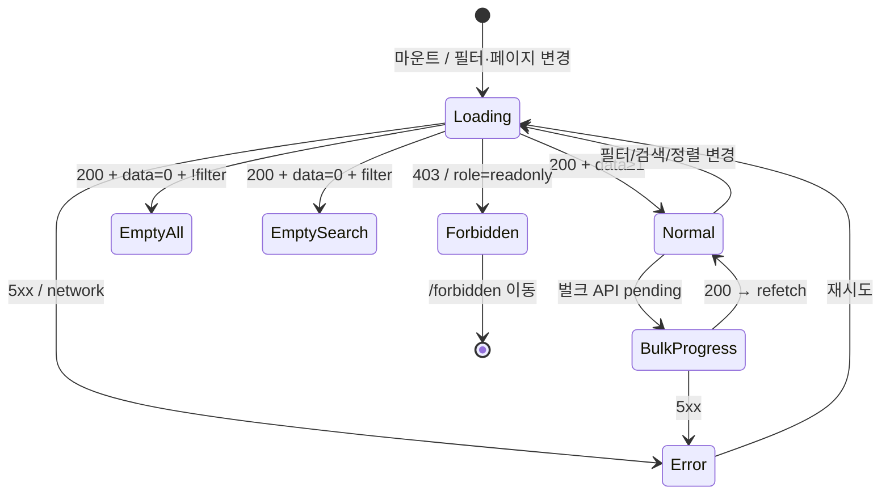

# SCR-M001 회원 목록 — 기본화면 (마스터)

> 이 문서는 **화면 마스터 스펙**입니다. `01~07` 상태 문서는 이 문서를 상속(override/delta)합니다.
> 상태별 파일은 "변경점(델타)만" 기술하며, 이 문서에 정의된 레이아웃/토큰/컴포넌트/데이터/권한/접근성은 **기본값**으로 적용됩니다.

---

## 0. 메타 & 원천 참조

| 항목 | 값 |
|------|----|
| 화면 ID | SCR-M001 |
| 화면명 | 회원 목록 |
| 도메인 | D02-회원관리 |
| 경로 | `/members` |
| Next.js Route Group | `(dashboard)` |
| 파일 경로 | `src/app/(dashboard)/members/page.tsx` |
| 페이지 컴포넌트 | `MembersPage` |
| pageId(legacy) | 967 |
| 역할 | `superAdmin`, `primary`, `owner`, `manager`, `fc`, `trainer`, `staff`, `front` (뷰 차등) |
| 우선순위 | P0 |
| 플랫폼 | 데스크톱(우선) / 태블릿 / 모바일 |
| 멀티테넌트 | ✅ `branchId` 강제 스코프 |
| i18n | ko-KR |

### 원천 문서 링크
| 문서 | 경로 | 섹션 |
|---|---|---|
| 화면설계서 | `docs/화면설계서/회원관리.md` | §SCR-M001 §부록 A/B/C/D |
| 기능명세서 | `docs/기능명세서/회원관리.md` | §1. 회원 목록 (A~P) |
| 공통 UI 패턴 | `docs/화면설계서/공통.md` | §2 권한, §3 공통 UI |
| 상태전이도 | `docs/상태전이도.md` | §1 회원 상태 |
| 에러코드정의서 | `docs/에러코드정의서.md` | §4.2 회원 (E4xx100~199) |
| KPI 정의서 | `docs/KPI_정의서.md` | 신규 안정 / 충성고객 / 재구매 & LTV |
| 권한 매트릭스 | `docs/다이어그램/10_권한매트릭스/R1_역할화면_매트릭스.md` | `/members` 역할 |
| 다이어그램 F1 진입 | `docs/다이어그램/D02_회원관리/SCR-M001_회원목록/F1_진입.md` | 세션→fetch 초기화 |
| 다이어그램 F2 메인 | `docs/다이어그램/D02_회원관리/SCR-M001_회원목록/F2_메인.md` | 필터/검색/정렬 플로우 |
| 다이어그램 F3 버튼액션 | `docs/다이어그램/D02_회원관리/SCR-M001_회원목록/F3_버튼액션.md` | 엑셀/추가/벌크 |
| 다이어그램 F5 모달 | `docs/다이어그램/D02_회원관리/SCR-M001_회원목록/F5_모달트리거.md` | DLG-M001 |
| 다이어그램 F6 상태별 | `docs/다이어그램/D02_회원관리/SCR-M001_회원목록/F6_상태별.md` | 로딩/정상/빈/에러/권한 |
| 다이어그램 F7 권한 | `docs/다이어그램/D02_회원관리/SCR-M001_회원목록/F7_권한.md` | 역할 × 기능 |
| 다이어그램 F8 에러 | `docs/다이어그램/D02_회원관리/SCR-M001_회원목록/F8_에러.md` | API 실패 분기 |

---

## 1. 화면 목적 (Why)

센터에 등록된 전체 회원을 한눈에 조회하고, 필터/검색/정렬/세그먼트로 원하는 회원을 찾아 **상세 페이지로 이동**하거나 **일괄 작업(상태 변경·메시지 발송·출석 처리·관심회원)**을 수행하는 **회원관리 도메인의 허브 화면**.

사용 시나리오:
- FC가 오늘 만료 예정 회원을 검색하여 리텐션 상담
- 매니저가 30일 이상 미방문 회원에게 일괄 메시지 발송
- 센터장이 전체 회원 엑셀 다운로드

---

## 2. 화면 레이아웃 (Wireframe)

```
┌─────────────────────────────────────────────────────────────────────┐
│ AppLayout (Sidebar + TopBar)                                        │
├─────────────────────────────────────────────────────────────────────┤
│ PageHeader                                                          │
│   제목: "회원 목록"                                                   │
│   설명: "센터의 전체 회원 정보를 조회하고 관리합니다."                   │
│   액션: [엑셀 다운로드] [회원 추가]                                    │
├─────────────────────────────────────────────────────────────────────┤
│ StatCardGrid (4열)                                                  │
│  [전체회원 1,248] [활성 924] [만료예정 D-30: 48] [이번달 만료 12]       │
├─────────────────────────────────────────────────────────────────────┤
│ MainTab: [회원 전체] [보유상품별] [이용권 목록]                         │
├─────────────────────────────────────────────────────────────────────┤
│ ┌──────── (회원 전체 탭 활성 시) ────────┐                           │
│ │ StatusTab 전체·활성·만료·미등록·홀딩·정지  pill 배지 카운트           │
│ ├─────────────────────────────────────────┤                         │
│ │ SearchFilter (상단)                                                │
│ │ [🔍 회원명/연락처…] [계약상품▼] [성별▼] [최종만료일] [최근방문일]    │
│ │ 추가필터:  ☑관심회원만  미방문[전체▼]  회원구분[전체▼]              │
│ │           유입경로[전체▼]  ☐만료숨기기                              │
│ ├─────────────────────────────────────────┤                         │
│ │ (selected > 0) BulkActionBar (sticky bottom)                      │
│ │  "3명 선택됨" [상태 변경] [전송하기] [출석 처리] [관심회원] [선택취소]│
│ ├─────────────────────────────────────────┤                         │
│ │ DataTable (서버 페이지네이션)                                       │
│ │  □ │ ★ │ 상태 │ 세그 │ 회원명 │ 성별 │ 생년월일 │ 연락처 │ 이용권 │ │
│ │    만료일 │ 등록일  (클릭: /members/detail?id=…)                   │
│ ├─────────────────────────────────────────┤                         │
│ │ Pagination: [‹] 1 2 3 … [›]   Page Size [20|50|100]               │
│ └─────────────────────────────────────────┘                         │
│                                                                     │
│ 보유상품별 탭 → membershipType 그룹 카드 + 드롭다운 필터 + 테이블       │
│ 이용권 목록 탭 → 이용권 중심 테이블(회원명·이용권·시작·만료·D-Day·상태) │
└─────────────────────────────────────────────────────────────────────┘
```

### 2.2 영역 치수 / 그리드

| 영역 | 그리드 | 치수/패딩 |
|---|---|---|
| PageHeader | `flex items-end justify-between` | `px-6 lg:px-8 pt-6 pb-4` |
| StatCardGrid | `grid grid-cols-2 md:grid-cols-4 gap-4` | 카드 `p-5`, `h-[96px]` |
| MainTab | `border-b border-gray-200` | `h-12`, 탭 `px-4` |
| StatusTab | `flex gap-2 flex-wrap` | `h-9` pill |
| SearchFilter | `grid grid-cols-1 md:grid-cols-5 gap-3` | `h-11` input |
| BulkActionBar | `fixed bottom-4 left-1/2 -translate-x-1/2` | `rounded-full shadow-lg px-4 h-12` |
| DataTable | `w-full overflow-x-auto` | row `h-12` |

---

## 3. 디자인 토큰

### 3.1 색상 (Tailwind)
| 역할 | 클래스 | 용도 |
|---|---|---|
| bg.page | `bg-gray-50` | 페이지 배경 |
| bg.card | `bg-white rounded-xl shadow-sm ring-1 ring-gray-100` | StatCard/패널 |
| stat.default | `text-gray-900` | 전체 회원 |
| stat.mint | `bg-emerald-50 text-emerald-700 ring-emerald-100` | 활성 |
| stat.peach | `bg-orange-50 text-orange-700 ring-orange-100` | 만료예정 |
| stat.amber | `bg-amber-50 text-amber-800 ring-amber-200` | 이번달만료 |
| badge.ACTIVE | `bg-emerald-100 text-emerald-800` | 상태 dot |
| badge.HOLDING | `bg-purple-100 text-purple-800` | 상태 dot |
| badge.EXPIRED | `bg-red-100 text-red-800` | 상태 dot |
| badge.INACTIVE | `bg-gray-100 text-gray-700` | 상태 dot |
| badge.SUSPENDED | `bg-orange-100 text-orange-800` | 상태 dot |
| seg.new | `bg-blue-100 text-blue-700` | 신규 세그먼트 |
| seg.risk | `bg-red-100 text-red-700` | 이탈 위험 |
| seg.imminent | `bg-yellow-100 text-yellow-700` | 만료 임박 |
| seg.loyal | `bg-green-100 text-green-700` | 충성 |
| btn.primary | `bg-blue-600 hover:bg-blue-700 text-white` | 회원 추가 |
| btn.secondary | `bg-white border border-gray-300 hover:bg-gray-50 text-gray-700` | 엑셀 다운로드 |
| btn.danger | `bg-red-600 hover:bg-red-700 text-white` | 삭제 |
| favorite.on | `text-yellow-400` | ★ filled |
| favorite.off | `text-gray-300` | ☆ outline |

### 3.2 타이포그래피
| 토큰 | 클래스 |
|---|---|
| page.title | `text-2xl font-bold tracking-tight text-gray-900` |
| page.desc | `text-sm text-gray-500` |
| stat.label | `text-xs uppercase tracking-wide font-medium text-gray-500` |
| stat.value | `text-3xl font-bold tabular-nums text-gray-900` |
| th | `text-xs font-medium text-gray-500 uppercase tracking-wide` |
| td | `text-sm text-gray-900` |
| td.mono | `text-sm tabular-nums text-gray-700` |

### 3.3 간격/반경/그림자
| 토큰 | 값 |
|---|---|
| card.radius | `rounded-xl` |
| input.radius | `rounded-lg` |
| page.padding | `p-6 lg:p-8` |
| section.gap | `space-y-6` |
| table.row.hover | `hover:bg-gray-50` |
| shadow.dropdown | `shadow-lg ring-1 ring-black/5` |

### 3.4 모션
- 행 hover: `transition-colors duration-100`
- 체크박스 선택 시 BulkActionBar: `animate-[slideUp_180ms_ease-out]`
- 스켈레톤: `animate-pulse`
- prefers-reduced-motion: 애니메이션 제거

---

## 4. 반응형 규칙

| BP | 폭 | StatCard | SearchFilter | Table |
|---|---|---|---|---|
| Mobile <640 | 100% | 2열 | 1열 세로 | 가로 스크롤 (`overflow-x-auto`), 핵심 컬럼만 |
| Tablet 640~1024 | 100% | 4열 | 2~3열 | 가로 스크롤 허용 |
| Desktop ≥1024 | sidebar+main | 4열 | 5열 | 풀 너비, 모든 컬럼 |
| XL ≥1440 | max `container` | 4열 | 5열 + 추가필터 동일행 | max-w-[1440px] |

모바일에선 벌크 액션은 bottom sheet로 전환. 필터는 "필터" 버튼 → 슬라이드 패널.

---

## 5. 🔐 역할별(RBAC) 매트릭스

> ●=전체 사용, ○=읽기만, —=미표시/차단. 기능명세서 §M, 부록 C 반영.

### 5.1 역할 × 요소

| 요소 | superAdmin/primary | owner | manager | fc | trainer | staff | front | readonly |
|---|:---:|:---:|:---:|:---:|:---:|:---:|:---:|:---:|
| 페이지 접근 | ● | ● | ● | ● | ○(담당) | ● | ○ | — |
| 지점 전환 드롭다운(헤더) | ● (전지점) | ● (소속 브랜드) | — | — | — | — | — | — |
| 엑셀 다운로드 | ● | ● | ● | — | — | — | — | — |
| 회원 추가 (CTA→/members/new) | ● | ● | ● | — | — | ● | — | — |
| StatCard 클릭(서브탭 전환) | ● | ● | ● | ● | ○ | ● | ○ | — |
| 체크박스 선택 | ● | ● | ● | ● | — | ● | — | — |
| 벌크: 상태 변경 (DLG-M001) | ● | ● | ● | — | — | — | — | — |
| 벌크: 전송하기 | ● | ● | ● | ● | — | ● | — | — |
| 벌크: 출석 처리 | ● | ● | ● | ● | — | ● | ● | — |
| 벌크: 관심회원 | ● | ● | ● | ● | — | ● | — | — |
| 벌크: 삭제 (🆕) | ● | ● | — | — | — | — | — | — |
| ★ 관심회원 토글 | ● | ● | ● | ● | — | ● | — | — |
| 회원명 클릭 → 상세 | ● | ● | ● | ● | ●(담당) | ● | ○ | — |
| 필터: 담당 FC | ● | ● | ● | ●(자기 기본) | ●(담당) | — | — | — |
| 데이터 범위 | 전지점(브랜드) | 소속 브랜드 지점 | 본인 지점 | 본인 지점(+담당 우선) | 담당 회원 | 본인 지점 | 본인 지점 | 차단 |

### 5.2 역할별 뷰 요약
- **superAdmin/primary**: 지점 전환 드롭다운 노출. 전지점 집계 또는 선택 지점 스코프.
- **owner**: 소속 브랜드 범위. 매출/미수금 칼럼 노출.
- **manager**: 본인 지점 고정. 삭제 버튼만 비노출(`canDelete=false`).
- **fc**: 조회+벌크 메시지/출석/관심. 등록/수정/삭제/엑셀 차단. `?assignedTo=me` 기본 필터.
- **trainer**: `/members?view=my`로 진입 시 본인 담당만. 기본은 `/calendar`로 리다이렉트.
- **staff**: 등록/수정/조회/벌크(관심/메시지/출석). 삭제/엑셀 차단.
- **front**: 읽기 전용 + 출석 처리만 허용. 회원명 클릭으로 상세 조회.
- **readonly**: 페이지 접근 차단 → `/forbidden`.

### 5.3 서버 스코프 강제
```ts
// 서버 미들웨어 (JWT role/branchId로 스코프 강제)
if (role === 'owner' || role === 'manager' || role === 'staff' || role === 'front') {
  q = q.eq('branchId', user.branchId);
}
if (role === 'fc') {
  q = q.eq('branchId', user.branchId);
  if (params.onlyMyAssigned) q = q.eq('staffId', user.id);
}
if (role === 'trainer') q = q.eq('primaryTrainerId', user.id);
if (role === 'readonly') throw E403001;
```

---

## 6. 컴포넌트 트리

```tsx
<AppLayout role={user.role}>
  <PageHeader
    title="회원 목록"
    description="센터의 전체 회원 정보를 조회하고 관리합니다."
    actions={
      <>
        {canExcel(role) && <Button variant="secondary" icon={<Download/>}>엑셀 다운로드</Button>}
        {canAddMember(role) && <Button variant="primary" icon={<UserPlus/>}>회원 추가</Button>}
      </>
    }
  />

  <StatCardGrid cols={4}>
    <StatCard label="전체 회원" value={stats.total} icon={<Users/>} variant="default"
              onClick={() => setStatusTab('all')} />
    <StatCard label="활성 회원" value={stats.active} icon={<UserCheck/>} variant="mint"
              onClick={() => setStatusTab('ACTIVE')} />
    <StatCard label="만료 예정 (D-30)" value={stats.expiringCount} icon={<Clock/>} variant="peach"
              onClick={() => applyExpiringFilter()} />
    <StatCard label="이번달 만료" value={stats.expiredThisMonth} icon={<AlertTriangle/>} variant="amber"
              onClick={() => setStatusTab('EXPIRED')} />
  </StatCardGrid>

  <MainTab
    tabs={[
      { key: 'members', label: '회원 전체' },
      { key: 'product', label: '보유상품별' },
      { key: 'pass',    label: '이용권 목록' },
    ]}
    value={mainTab}
    onChange={setMainTab}
  />

  {mainTab === 'members' && (
    <>
      <StatusTab value={statusTab} onChange={setStatusTab} counts={stats} />

      <SearchFilter
        search={{ value: search, onChange: setSearch, placeholder: '회원명, 연락처 검색...' }}
        filters={[
          { key: 'product', label: '계약상품', options: PRODUCT_OPTIONS },
          { key: 'gender',  label: '성별',     options: GENDER_OPTIONS },
          { key: 'expiryDate', label: '최종만료일', type: 'dateRange' },
          { key: 'visitDate',  label: '최근방문일', type: 'dateRange' },
        ]}
        extra={
          <>
            <Checkbox label="관심회원만" checked={onlyFavorite} onChange={setOnlyFavorite} />
            <Select label="미방문" value={daysNoVisit} options={NO_VISIT_OPTIONS} />
            <Select label="회원구분" value={memberType} options={MEMBER_TYPE_OPTIONS} />
            <Select label="유입경로" value={referralSource} options={REFERRAL_OPTIONS} />
            <Checkbox label="만료 숨기기" checked={hideExpired} onChange={setHideExpired} />
          </>
        }
      />

      {selectedRows.size > 0 && (
        <BulkActionBar count={selectedRows.size}>
          {canBulkStatus(role) && <Button icon={<Settings/>} onClick={openDLG_M001}>상태 변경</Button>}
          <Button icon={<Send/>}    onClick={goToMessageSend}>전송하기</Button>
          <Button icon={<CheckCircle/>} onClick={bulkAttend}>출석 처리</Button>
          <Button icon={<Star/>}    onClick={bulkFavorite}>관심회원</Button>
          {canDelete(role) && <Button variant="danger" icon={<Trash2/>} onClick={openDLG_M002Bulk}>삭제</Button>}
          <Button variant="ghost" onClick={clearSelection}>선택 취소</Button>
        </BulkActionBar>
      )}

      <DataTable
        columns={MEMBER_COLUMNS}
        data={members}
        loading={isLoading}
        selected={selectedRows}
        onSelect={toggleRow}
        onRowClick={goToMemberDetail}
        sort={{ key: sortKey, direction: sortDir, onSort: handleSort }}
        emptyMessage={getEmptyMessage(search, activeFilters)}
      />

      <Pagination
        page={page}
        pageSize={pageSize}
        totalCount={totalCount}
        pageSizeOptions={[20, 50, 100]}
        onPageChange={setPage}
        onPageSizeChange={setPageSize}
      />
    </>
  )}

  {mainTab === 'product' && <ProductGroupView {...} />}
  {mainTab === 'pass'    && <PassListView {...} />}

  {/* 모달 */}
  <BulkStatusChangeModal {...} />  {/* DLG-M001 */}
  <BulkDeleteConfirmModal {...} /> {/* DLG-M002 (bulk) */}
</AppLayout>
```

### 6.1 핵심 컴포넌트
| 컴포넌트 | 파일 | 주요 Props |
|---|---|---|
| `PageHeader` | `src/components/common/PageHeader.tsx` | `title, description, actions` |
| `StatCardGrid`/`StatCard` | `src/components/common/StatCard.tsx` | `label, value, icon, variant, onClick` |
| `MainTab`/`StatusTab` | `src/components/common/Tab.tsx` | `tabs, value, onChange` |
| `SearchFilter` | `src/components/members/SearchFilter.tsx` | `search, filters, extra` |
| `BulkActionBar` | `src/components/members/BulkActionBar.tsx` | `count, children` |
| `DataTable` | `src/components/common/DataTable.tsx` | `columns, data, selected, onRowClick, sort` |
| `StatusBadge` | `src/components/common/StatusBadge.tsx` | `status, dot` |
| `SegmentBadge` | `src/components/members/SegmentBadge.tsx` | `segment` (getMemberSegment 결과) |
| `FavoriteStar` | `src/components/members/FavoriteStar.tsx` | `on, onToggle` |
| `Pagination` | `src/components/common/Pagination.tsx` | `page, pageSize, totalCount` |

---

## 7. 데이터 계약

### 7.1 타입
```ts
// src/types/member.ts
export type MemberStatus = 'ACTIVE'|'INACTIVE'|'EXPIRED'|'HOLDING'|'SUSPENDED'|'WITHDRAWN'|'DORMANT'|'TRANSFERRED';
export type Gender = 'M'|'F';

export interface Member {
  id: number;
  name: string;
  phone: string;
  email: string | null;
  gender: Gender;
  birthDate: string | null;       // YYYY-MM-DD
  profileImage: string | null;
  registeredAt: string;
  membershipType: string;
  membershipStart: string | null;
  membershipExpiry: string | null;
  status: MemberStatus;
  mileage: number;
  memo: string | null;
  height: number | null;
  staffId: number | null;         // 담당 FC
  deletedAt: string | null;
  branchId: number;
  createdAt: string;
  updatedAt: string | null;
  isFavorite: boolean;
  lastVisitAt: string | null;
  memberType: '일반'|'기명법인'|'무기명법인'|null;
  referralSource: string | null;
  companyName: string | null;
}

export interface MemberStats {
  total: number;
  active: number;
  inactive: number;
  expired: number;
  holding: number;
  suspended: number;
  expiredThisMonth: number;
  newThisMonth: number;
  expiringCount: number;
}

export interface MemberListParams {
  branchId: number | null;
  page: number;
  size: 20 | 50 | 100;
  search?: string;
  status?: MemberStatus | 'all';
  gender?: 'M'|'F'|'all';
  product?: string;
  sortKey?: 'name'|'membershipExpiry'|'registeredAt'|'createdAt';
  sortDirection?: 'asc'|'desc';
  isFavorite?: boolean;
  daysNoVisit?: 0|7|14|30;
  memberType?: string;
  referralSource?: string;
  hideExpired?: boolean;
  staffId?: number; // fc 자기 필터
}
```

### 7.2 API 엔드포인트
| 함수 | Method | 엔드포인트 | 파라미터 | 반환 | 호출 시점 |
|---|---|---|---|---|---|
| `getMembers` | GET | `/members` | `MemberListParams` | `PaginatedResponse<Member>` | 마운트·필터·정렬·페이지 변경 |
| `getMemberStats` | GET | `/members/stats` | `{branchId}` | `MemberStats` | 마운트·필터 변경 |
| `toggleFavorite` | PATCH | `/members/:id/favorite` | `{isFavorite}` | `ApiResponse<null>` | ★ 토글 |
| `bulkUpdateStatus` | PATCH | `/members/bulk/status` | `{ids, status}` | `ApiResponse<{count}>` | DLG-M001 확인 |
| `bulkAttend` | POST | `/attendance/bulk` | `{memberIds, type:'MANUAL'}` | `ApiResponse<{count}>` | 벌크 출석 |
| `bulkFavorite` | PATCH | `/members/bulk/favorite` | `{ids, isFavorite:true}` | `ApiResponse<{count}>` | 벌크 관심회원 |
| `bulkSoftDelete` | DELETE | `/members/bulk` | `{ids}` | `ApiResponse<{count}>` | DLG-M002 (bulk) |
| `exportMembersExcel` | GET | `/members/export` | 현재 필터 | `Blob` | 엑셀 다운로드 |

### 7.3 상태 관리
- **Store**: `useAuthStore`(user/role/branchId)
- **Fetching**: React Query `useMembers`, `useMemberStats`
  - staleTime: 30_000ms, refetchOnWindowFocus: true
  - optimistic update: toggleFavorite
- **Local state**: `search(debounced 300ms)`, `filters`, `selectedRows:Set<number>`, `statusTab`, `sort`, `page`, `pageSize`
- **URL sync**: 주요 필터는 query string에 반영 (`?status=ACTIVE&page=2&q=김`) — 뒤로가기 복원
- **세그먼트 계산**: 클라이언트 `getMemberSegment(member)` (priority 8단계)

### 7.4 세그먼트 판정 (클라이언트)
```ts
function getMemberSegment(m: Member, now = new Date()): Segment {
  const days = (a: string) => (+now - +new Date(a)) / 86400000;
  if (m.registeredAt && days(m.registeredAt) <= 30) return 'NEW';
  if (m.status === 'EXPIRED') return 'EXPIRED_UNREG';
  if (m.status === 'ACTIVE' && m.lastVisitAt && days(m.lastVisitAt) >= 30) return 'CHURN_RISK';
  if (m.status === 'ACTIVE' && m.membershipExpiry && daysTo(m.membershipExpiry) <= 30) return 'EXPIRING';
  if (m.status === 'ACTIVE' && m.lastVisitAt && days(m.lastVisitAt) >= 14) return 'ATTENTION';
  if (m.status === 'ACTIVE' && days(m.registeredAt) >= 180 && days(m.lastVisitAt) <= 7) return 'LOYAL';
  if (m.status === 'ACTIVE' && days(m.lastVisitAt) <= 14) return 'ACTIVE_USER';
  return 'NONE';
}
```

---

## 8. 비즈니스 룰

1. **멀티테넌트 강제**: 서버는 JWT role/branchId로 스코프 강제. 클라 필터는 UX용.
2. **검색 디바운스**: 300ms. Enter 즉시 실행.
3. **필터 조합**: AND. 모든 필터는 서버사이드로 전달.
4. **정렬**: 서버사이드 `.order(col, {ascending})`. 기본 `createdAt DESC`.
5. **페이지네이션**: 서버사이드 `.range(from, to)`. 기본 size 20.
6. **세그먼트**: 클라이언트 계산. (§7.4)
7. **관심회원 토글**: optimistic update. 실패 시 롤백 + toast.
8. **벌크 액션 가드**: `selectedRows.size > 0`이 아니면 toast.warning("회원을 먼저 선택해주세요.").
9. **상태 일괄 변경(DLG-M001)**: 허용 전이만 허용. WITHDRAWN은 복구 불가 — DLG에 경고 표시.
10. **엑셀 다운로드**: 서버에서 전체 조회 후 xlsx 스트림. 10만건 초과 시 chunk 비동기 처리 + "생성 중" toast.
11. **세션 만료**: 401 → `/login?redirect=/members` 자동 이동.
12. **URL 복원**: 새로고침해도 `?status=`, `?q=`, `?page=` 복원.
13. **FC 기본 필터**: role=fc면 `?assignedTo=me` 자동 적용 (사용자 토글로 해제 가능).
14. **라벨**: 상태 한글 매핑: `ACTIVE='활성'`, `HOLDING='홀딩'`, `EXPIRED='만료'`, `INACTIVE='미등록'`, `SUSPENDED='정지'`, `WITHDRAWN='탈퇴'`.
15. **접근성**: 테이블 `role="grid"`, BulkActionBar `role="toolbar"` + `aria-live`.

---

## 9. 상태 목록

| 파일 | 상태 코드 | 한글 | 트리거 |
|---|---|---|---|
| `01-로딩.md` | `list-loading` | 로딩 | 마운트/필터/페이지 변경 → fetch 중 |
| `02-정상목록.md` | `list-normal` | 정상 목록 | 200 + 데이터 ≥ 1건 |
| `03-빈상태-검색.md` | `list-empty-search` | 빈 상태(검색 결과 없음) | 200 + 데이터 0건 + 필터/검색 적용 중 |
| `04-빈상태-전체.md` | `list-empty-all` | 빈 상태(전체) | 200 + 데이터 0건 + 필터 없음 |
| `05-에러.md` | `list-error` | 에러 | 5xx/네트워크 실패 |
| `06-권한없음.md` | `list-forbidden` | 권한 없음 | 403 또는 role=readonly |
| `07-부분로딩-벌크액션.md` | `list-bulk-progress` | 벌크 액션 진행 | 벌크 API pending |

---

## 10. 에러 코드 매핑

| errorCode | HTTP | 시나리오 | UI 대응 |
|---|---|---|---|
| E401001 | 401 | 세션 만료 | `/login?redirect=/members` 리다이렉트 |
| E401002 | 401 | 토큰 만료 | 동일 |
| E403001 | 403 | 권한 없음 | `06-권한없음` 화면 |
| E403003 | 403 | 지점 접근 제한 | toast "해당 지점에 대한 접근 권한이 없습니다" + `/forbidden` |
| E404001 | 404 | 리소스 없음 | 빈상태 처리 |
| E409100 | 409 | (벌크 상태 변경 중) 전화 중복 | toast error |
| E409101 | 409 | 상태 전이 충돌 | toast "현재 상태에서 해당 작업을 수행할 수 없습니다" |
| E422101 | 422 | 탈퇴 회원 작업 불가 | toast "탈퇴한 회원은 작업할 수 없습니다" |
| E500001 | 500 | 서버 오류 | `05-에러` + 재시도 버튼 |
| NETWORK | — | 네트워크 단절 | `05-에러` + offline 배너 |

---

## 11. 접근성 (WCAG 2.1 AA)

| 항목 | 요구사항 |
|---|---|
| DataTable | `role="grid"`, 헤더 `scope="col"`, `aria-sort` |
| 행 선택 | 체크박스 + `aria-label="{name} 선택"` |
| 세그먼트 배지 | `aria-label="세그먼트: 이탈 위험"` |
| 관심회원 | `aria-pressed`, `aria-label="관심회원 등록/해제"` |
| BulkActionBar | `role="toolbar" aria-live="polite"` — "3명 선택됨" |
| 정렬 헤더 | 버튼, `aria-sort="ascending"\|"descending"\|"none"` |
| 페이지네이션 | 버튼 `aria-label="다음 페이지"`, 현재 페이지 `aria-current="page"` |
| 키보드 | Tab 흐름, 체크박스 Space 토글, 행 Enter → 상세 |
| 포커스 링 | `focus-visible:ring-2 ring-blue-500 ring-offset-2` |
| 모션 감소 | `prefers-reduced-motion`: 진입 애니메이션 제거 |
| 대비 | 본문/버튼 4.5:1 이상, placeholder 3:1 이상 |

---

## 12. 진입 / 이탈

### 진입
- 사이드바 "회원 관리 > 회원 목록"
- 대시보드 StatCard 클릭 (만료 예정 등)
- KPI 센터 드릴다운
- 회원 등록/수정 완료 후 리다이렉트

### 이탈
| 액션 | 목적지 |
|---|---|
| 회원명 클릭 | `/members/detail?id={id}` (SCR-M004) |
| 회원 추가 | `/members/new` (SCR-M002) |
| 엑셀 다운로드 | Blob 다운로드 (페이지 유지) |
| 벌크 상태 변경 | DLG-M001 → refetch |
| 벌크 전송하기 | `/messages/send?target=selected` |
| 벌크 출석 처리 | 페이지 유지 + refetch |
| 벌크 삭제 | DLG-M002(bulk) → refetch |
| 지점 전환 | `?branch={id}` 갱신 + refetch |

---

## 13. 다이어그램 통합 뷰



---

## 14. 🧩 바이브코딩 프롬프트 (마스터)

```
Next.js 15 App Router + TypeScript + Tailwind + Supabase + React Query + react-hook-form 기반
'use client' 컴포넌트를 작성하라.

━━ 화면: SCR-M001 회원 목록 (마스터) ━━
파일: src/app/(dashboard)/members/page.tsx
보조:
- src/components/members/SearchFilter.tsx
- src/components/members/BulkActionBar.tsx
- src/components/members/SegmentBadge.tsx
- src/components/members/FavoriteStar.tsx
- src/components/members/BulkStatusChangeModal.tsx (DLG-M001)
- src/components/common/{PageHeader, StatCard, DataTable, Pagination, StatusBadge, MainTab, StatusTab}.tsx
- src/hooks/useMembers.ts, useMemberStats.ts
- src/lib/member-access.ts (canExcel, canAddMember, canDelete, canBulkStatus)
- src/lib/member-segment.ts (getMemberSegment)
- src/lib/api/members.ts (getMembers, toggleFavorite, bulkUpdateStatus, …)

━━ 레이아웃 ━━
<AppLayout role={user.role}>
  <main className="p-6 lg:p-8 space-y-6 bg-gray-50 min-h-screen">
    <PageHeader ... />
    <StatCardGrid cols={4}>...</StatCardGrid>
    <MainTab ... />
    {mainTab === 'members' && (
      <section className="bg-white rounded-xl shadow-sm ring-1 ring-gray-100 p-5 space-y-4">
        <StatusTab ... />
        <SearchFilter ... />
        {selected.size>0 && <BulkActionBar ... />}
        <DataTable ... />
        <Pagination ... />
      </section>
    )}
  </main>
</AppLayout>

━━ 디자인 토큰 (정확히 적용) ━━
bg.page:  bg-gray-50
card:     bg-white rounded-xl shadow-sm ring-1 ring-gray-100 p-5
th:       text-xs font-medium text-gray-500 uppercase tracking-wide py-2
td:       text-sm text-gray-900 py-3
td.mono:  text-sm tabular-nums text-gray-700
row.hover:hover:bg-gray-50 cursor-pointer transition-colors
btn.primary:  h-10 px-4 bg-blue-600 hover:bg-blue-700 text-white rounded-lg
btn.secondary:h-10 px-4 border border-gray-300 bg-white hover:bg-gray-50 rounded-lg
input:    h-11 rounded-lg border-gray-300 focus:ring-2 focus:ring-blue-500 focus:border-blue-500
badge.ACTIVE:   inline-flex items-center gap-1 bg-emerald-100 text-emerald-800 text-xs px-2 py-0.5 rounded-full
badge.HOLDING:  bg-purple-100 text-purple-800 ...
badge.EXPIRED:  bg-red-100 text-red-800 ...
badge.INACTIVE: bg-gray-100 text-gray-700 ...
badge.SUSPENDED:bg-orange-100 text-orange-800 ...
seg.NEW:         bg-blue-100 text-blue-700
seg.RISK:        bg-red-100 text-red-700
seg.IMMINENT:    bg-yellow-100 text-yellow-700
seg.LOYAL:       bg-green-100 text-green-700
favorite.on:     text-yellow-400 fill-current
favorite.off:    text-gray-300

━━ 컬럼 정의 (DataTable.columns) ━━
[
  { key:'check', header:'', width:40, render: r => <Checkbox checked={selected.has(r.id)} onChange={()=>toggleRow(r.id)} aria-label={`${r.name} 선택`} /> },
  { key:'fav',   header:'★', width:44, render: r => <FavoriteStar on={r.isFavorite} onToggle={()=>toggleFav(r.id)} /> },
  { key:'status',header:'상태', width:90, render: r => <StatusBadge status={r.status} dot /> },
  { key:'seg',   header:'세그먼트', width:110, render: r => <SegmentBadge segment={getMemberSegment(r)} /> },
  { key:'name',  header:'회원명', width:110, sortable:true, render: r => <button className="text-blue-600 hover:underline" onClick={()=>goToDetail(r.id)}>{r.name}</button> },
  { key:'gender',header:'성별', width:60, render: r => r.gender==='M'?'남':r.gender==='F'?'여':'-' },
  { key:'birthDate',header:'생년월일', width:110, className:'tabular-nums', render: r => r.birthDate ?? '-' },
  { key:'phone',header:'연락처', width:130, className:'tabular-nums' },
  { key:'membershipType',header:'이용권', width:120, render: r => MEMBERSHIP_LABEL[r.membershipType] ?? r.membershipType },
  { key:'membershipExpiry',header:'만료일', width:110, sortable:true, className:'tabular-nums', render: r => r.membershipExpiry?.slice(0,10) ?? '-' },
  { key:'registeredAt',header:'등록일', width:110, sortable:true, className:'tabular-nums', render: r => r.registeredAt.slice(0,10) },
]

━━ 데이터 훅 ━━
useMembers({ branchId, page, pageSize, search, status, gender, product,
             sortKey, sortDirection, isFavorite, daysNoVisit,
             memberType, referralSource, hideExpired, staffId })
  → { data:Member[], totalCount, isLoading, isError, refetch }
useMemberStats({ branchId })
  → { total, active, inactive, expired, holding, suspended, expiringCount, expiredThisMonth, newThisMonth }

━━ 인터랙션 ━━
- StatCard click → setStatusTab(target) (또는 applyExpiringFilter)
- StatusTab change → setStatus + 페이지 1로 리셋 + refetch
- 검색 input change → debounce 300ms → setSearch → 페이지 1 리셋
- 컬럼 헤더 클릭(sortable) → toggle sortDirection
- 체크박스 click → toggleRow, BulkActionBar 표시
- "선택 취소" → clearSelection
- 상태 변경 → openDLG_M001, 확인 시 bulkUpdateStatus
- 전송하기 → sessionStorage.setItem('messageTargets', ids) + router.push('/messages/send')
- 출석 처리 → bulkAttend → toast.success
- 관심회원 → bulkFavorite(true) → toast.success
- 삭제(canDelete) → DLG-M002(bulk) → bulkSoftDelete
- 엑셀 다운로드 → exportMembersExcel(filters) → blob download
- 행 click → router.push(`/members/detail?id=${r.id}`)
- 페이지네이션 → setPage, setPageSize

━━ 빈/에러 상태 ━━
- 로딩: TableSkeleton (10행)
- 빈-전체:  "등록된 회원이 없습니다." + [회원 추가] CTA (권한 있을 때)
- 빈-검색:  "검색 결과가 없습니다." + [필터 초기화] 링크
- 에러:     "데이터를 불러오는 중 오류가 발생했습니다." + [다시 시도]
- 권한:     ForbiddenView / redirect

━━ URL 동기화 ━━
useSearchParams로 status, q, page, sort, branch 복원.
filter 변경 시 router.replace(`?${qs}`).

━━ 접근성 ━━
- table role="grid", thead scope="col"
- 체크박스 aria-label, 세그먼트 aria-label, ★ aria-pressed
- BulkActionBar role="toolbar" aria-live="polite"
- 정렬 버튼 aria-sort
- ESC: BulkActionBar 선택 해제

━━ 반응형 ━━
- Mobile: StatCard 2열, 테이블 가로스크롤, 핵심 컬럼만(★·이름·상태·만료일)
- Tablet: StatCard 4열, 2~3열 필터, 가로스크롤
- Desktop: StatCard 4열, 5열 필터, 모든 컬럼
```

---

## 15. QA 체크리스트 (수용 기준)

- [ ] 역할별 진입 시 권한 매트릭스 §5.1과 동일한 기능 노출
- [ ] 페이지 로드 시 `useMembers`, `useMemberStats` 병렬 호출
- [ ] 검색 디바운스 300ms 동작
- [ ] 필터 6종 + 추가필터 5종 조합 AND 적용
- [ ] 세그먼트 8단계 우선순위 판정 정확
- [ ] ★ 클릭 시 optimistic 반영 후 API 실패 시 롤백
- [ ] 체크박스 선택 시 BulkActionBar 슬라이드 업
- [ ] 상태 변경 DLG-M001에서 5개 옵션 중 1개 선택 후 저장 → toast + refetch
- [ ] WITHDRAWN 포함 전환 시 경고 안내
- [ ] 벌크 출석 처리 시 attendance 테이블 type='MANUAL' 일괄 insert
- [ ] 벌크 관심회원 시 isFavorite=true 일괄 업데이트
- [ ] 벌크 삭제(canDelete)는 primary/owner만 노출
- [ ] 엑셀 다운로드: 권한 있는 역할만, 전체 필터 적용
- [ ] 빈상태(전체) vs 빈상태(검색) 구분 메시지
- [ ] 403 → `/forbidden`, 401 → `/login?redirect=/members`
- [ ] URL ?status=, ?q=, ?page= 복원
- [ ] 키보드만으로 탐색/선택/상세 이동 가능
- [ ] SR로 "3명 선택됨" 공지
- [ ] 모바일 가로스크롤 OK, sticky header
- [ ] prefers-reduced-motion 준수
- [ ] 서버 스코프: 다른 지점 id 조작 시 403
