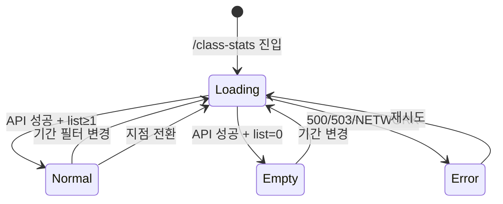

# SCR-C005 그룹수업 현황 — 기본화면 (마스터)

> 이 문서는 **화면 마스터 스펙**입니다. `01~04` 상태 문서는 이 문서를 상속(override/delta)합니다.
> 🚨 **예약률·출석률 실시간 대시보드**: manager 이상 전체 조회, **trainer는 본인 수업만**, fc/staff/front 차단. GX/그룹수업 운영 효율성과 KPI(수업 출석률·참여율)를 시각화.

---

## 0. 메타 & 원천 참조

| 항목 | 값 |
|------|----|
| 화면 ID | SCR-C005 |
| 화면명 | 그룹수업 현황 |
| 도메인 | D04-수업관리 |
| 경로 | `/class-stats` |
| Next.js Route Group | `(classes)` |
| 파일 경로 | `src/app/(classes)/class-stats/page.tsx` |
| 페이지 컴포넌트 | `ClassStatsPage` |
| 역할 | `superAdmin/primary` (전 지점) · `owner/manager` (본 지점 전체) · `trainer` (본인 수업) · `fc/staff/front` (차단) · `readonly` (조회만) |
| 우선순위 | P1 (KPI 대시보드) |
| 플랫폼 | 데스크톱(우선) / 태블릿 |
| 멀티테넌트 | ✅ `branchId` 강제 |

### 원천 문서 링크
| 문서 | 경로 | 섹션 |
|---|---|---|
| 화면설계서 | `docs/화면설계서/수업관리.md` | §SCR-C005 그룹수업 현황 |
| 기능명세서 | `docs/기능명세서/수업관리.md` | §4 수업 현황 (`/class-stats`) |
| 에러코드정의서 | `docs/에러코드정의서.md` | §4.6 수업/스케줄 |
| KPI 정의서 | `docs/KPI_정의서.md` | §GX 수업 출석률(13), §수업 대기자 발생률 |
| 권한 매트릭스 | `docs/다이어그램/10_권한매트릭스/R1_역할화면_매트릭스.md` | `/class-stats` |
| 다이어그램 F1 | `docs/다이어그램/D04_수업관리/SCR-C005_그룹수업현황/F1_진입.md` | 진입 → 기간 집계 |
| 다이어그램 F2 | `docs/다이어그램/D04_수업관리/SCR-C005_그룹수업현황/F2_메인.md` | StatCards + 차트 + 테이블 |
| 다이어그램 F3 | `docs/다이어그램/D04_수업관리/SCR-C005_그룹수업현황/F3_버튼액션.md` | 기간 필터 Btn |
| 다이어그램 F4 | `docs/다이어그램/D04_수업관리/SCR-C005_그룹수업현황/F4_필터검색.md` | 기간 프리셋 |
| 다이어그램 F6 | `docs/다이어그램/D04_수업관리/SCR-C005_그룹수업현황/F6_상태별.md` | loading/normal/empty/error |
| 다이어그램 F7 | `docs/다이어그램/D04_수업관리/SCR-C005_그룹수업현황/F7_권한.md` | 역할별 스코프 |

---

## 1. 화면 목적 (Why)

GX·필라테스·그룹수업의 **운영 효율성**을 시각화하고 KPI를 추적:
- 5개 StatCards(총수업/총예약/총출석/평균예약률/평균출석률)
- 기간 필터(이번 주/이번 달/이번 분기) + 월별 트렌드 바 차트(최근 6개월)
- 수업별 예약률·출석률 테이블(프로그레스 바 색상 코딩)
- trainer는 본인 수업만, manager 이상은 지점 전체, super/primary는 지점 전환.

---

## 2. 화면 레이아웃 (Wireframe)

### 2.1 풀뷰 와이어프레임

```
┌──────────────────────────────────────────────────────────────────────┐
│ PageHeader                                                            │
│  "그룹수업 현황"                                                       │
│  "수업별 출석률과 월별 트렌드를 확인합니다."                             │
├──────────────────────────────────────────────────────────────────────┤
│ StatCardGrid (5열)                                                    │
│ ┌──────┐ ┌──────┐ ┌──────┐ ┌──────┐ ┌──────┐                        │
│ │총수업│ │총예약│ │총출석│ │평균예약│ │평균출석│                       │
│ │ N    │ │ N명  │ │ N명  │ │ N%    │ │ N%    │                       │
│ └──────┘ └──────┘ └──────┘ └──────┘ └──────┘                        │
├──────────────────────────────────────────────────────────────────────┤
│ 기간 필터: [이번 주] [이번 달●] [이번 분기]                             │
├──────────────────────────────────────────────────────────────────────┤
│ 월별 트렌드 바 차트 (최근 6개월)                                       │
│  ┌────────────────────────────────────────────────────────┐           │
│  │ ██ ██ ██ ██ ██ ██   예약률 / 출석률 그룹드 바           │           │
│  │ 11  12  01  02  03  04                                 │           │
│  └────────────────────────────────────────────────────────┘           │
├──────────────────────────────────────────────────────────────────────┤
│ 수업별 출석 현황 테이블                                                │
│ ┌──┬──────────┬────┬────┬──────┬───────────┬──────┬───────────┐      │
│ │No│수업명     │장소│정원│예약자│예약률      │출석자│출석률      │      │
│ │  │필라테스    │1실 │14  │12    │[██████] 86%│10    │[█████ ] 83%│      │
│ └──┴──────────┴────┴────┴──────┴───────────┴──────┴───────────┘      │
└──────────────────────────────────────────────────────────────────────┘
```

### 2.2 영역 그리드
| 영역 | 그리드 | 비고 |
|---|---|---|
| StatCardGrid | `grid grid-cols-1 md:grid-cols-3 lg:grid-cols-5 gap-4` | 5카드 |
| 기간 필터 | `flex gap-2` | ButtonGroup segmented |
| 트렌드 차트 카드 | `bg-white rounded-xl ring-1 ring-gray-100 p-4 h-72` | Recharts |
| 테이블 카드 | `bg-white rounded-xl ring-1 ring-gray-100 overflow-hidden` | pagination 없음 |

---

## 3. 디자인 토큰

### 3.1 색상
| 역할 | 클래스 | 용도 |
|---|---|---|
| bg.page | `bg-gray-50` | 전체 |
| bg.card | `bg-white rounded-xl shadow-sm ring-1 ring-gray-100` | 섹션 |
| stat.default | `text-gray-500` | |
| stat.mint | `text-emerald-600 bg-emerald-50` | 예약/좋은 수치 |
| stat.peach | `text-rose-500 bg-rose-50` | |
| bar.high (≥80) | `bg-emerald-500` | |
| bar.mid (≥50 <80) | `bg-amber-500` | |
| bar.low (<50, 출석) | `bg-rose-500` | |
| bar.low (<50, 예약) | `bg-gray-400` | |
| chart.bar.book | `#3B82F6` | 예약률 |
| chart.bar.attend | `#10B981` | 출석률 |
| filter.active | `bg-blue-600 text-white` | |
| filter.idle | `bg-white border border-gray-300 hover:bg-gray-50 text-gray-700` | |

### 3.2 타이포그래피
| 토큰 | 스타일 |
|---|---|
| stat.value | `text-2xl font-bold tabular-nums` |
| stat.label | `text-sm text-gray-500` |
| chart.title | `text-base font-semibold text-gray-900` |
| table.name | `text-sm font-medium text-gray-900` |
| table.cell | `text-sm tabular-nums text-gray-700` |
| progress.label | `text-xs tabular-nums text-gray-600` |

### 3.3 간격/반경
| 토큰 | 값 |
|---|---|
| page.padding | `p-4 md:p-6 lg:p-8` |
| card.padding | `p-4 md:p-5` |
| progress.bar | `h-2 rounded-full` |
| filter.btn | `h-9 px-3 rounded-lg text-sm font-medium` |

---

## 4. 반응형 규칙

| BP | StatCardGrid | 차트 | 테이블 |
|---|---|---|---|
| Mobile <640 | 1열 | 높이 200px, X축 축약 | 주요 3컬럼(수업명/예약률/출석률) |
| Tablet 640~1024 | 3열 | 높이 240px | 정상 |
| Desktop ≥1024 | 5열 | 높이 288px | 정상 |

---

## 5. 🔐 역할별(RBAC) 매트릭스

> `●` 전체 지점/본 지점 전체, `◐` 본인 수업만, `○` 조회만, `—` 차단

| 요소 | super/primary | owner | manager | fc | trainer | staff | front | readonly |
|---|:---:|:---:|:---:|:---:|:---:|:---:|:---:|:---:|
| **페이지 접근** | ● (전 지점) | ● | ● | — | ◐ (본인 수업) | — | — | ○ |
| StatCards | ● | ● | ● | — | ◐ | — | — | ○ |
| 기간 필터 | ● | ● | ● | — | ● | — | — | ● |
| 트렌드 차트 | ● | ● | ● | — | ◐ | — | — | ○ |
| 수업별 테이블 | ● | ● | ● | — | ◐ (본인 수업만) | — | — | ○ |
| 지점 전환 | ● | ● (브랜드) | — | — | — | — | — | — |
| Export(CSV, Phase 2) | ● | ● | ● | — | — | — | — | — |

### 5.1 trainer 스코프
- 서버에서 `instructor_id = user.id` 강제 필터.
- StatCards는 본인 수업만으로 재집계: "총 수업 = 본인 담당 수업 수".

### 5.2 역할 판별
```ts
const canViewClassStats = (r: Role) => ['superAdmin','primary','owner','manager','trainer','readonly'].includes(r);
const isTrainerScope = (r: Role) => r === 'trainer';
```

---

## 6. 컴포넌트 트리

```tsx
<AppLayout role={user.role}>
  <Guard allow={canViewClassStats(role)}>
    <div className="p-4 md:p-6 lg:p-8 space-y-4">
      <PageHeader
        title="그룹수업 현황"
        subtitle="수업별 출석률과 월별 트렌드를 확인합니다."
      />

      <StatCardGrid stats={[
        { label: '총 수업 수', value: totalClasses, icon: <CalendarCheck />, variant: 'default' },
        { label: '총 예약자', value: `${totalBooked}명`, icon: <Users />, variant: 'mint' },
        { label: '총 출석자', value: `${totalAttendees}명`, icon: <Users />, variant: 'default' },
        { label: '평균 예약률', value: `${avgBookingRate}%`, icon: <TrendingUp />, variant: 'peach' },
        { label: '평균 출석률', value: `${avgAttendRate}%`, icon: <BarChart3 />, variant: 'default' },
      ]} />

      <PeriodFilter value={period} onChange={setPeriod} options={[
        { value: 'week', label: '이번 주' },
        { value: 'month', label: '이번 달' },
        { value: 'quarter', label: '이번 분기' },
      ]} />

      <Card>
        <h2 className="text-base font-semibold text-gray-900 mb-3">월별 트렌드 (최근 6개월)</h2>
        <MonthlyTrendBarChart data={trendData} />
      </Card>

      <DataTable
        columns={classStatsColumns}
        rows={classStats}
        loading={isLoading}
        emptyState={<EmptyState icon={<BarChart3 />} message="해당 기간의 수업 데이터가 없습니다." />}
        rowKey="classId"
      />
    </div>
  </Guard>
</AppLayout>
```

### 6.1 핵심 컴포넌트
| 컴포넌트 | 파일 | Props |
|---|---|---|
| `PeriodFilter` | `src/components/common/PeriodFilter.tsx` | `{value, onChange, options}` ButtonGroup |
| `MonthlyTrendBarChart` | `src/components/class/MonthlyTrendBarChart.tsx` | `{data: TrendPoint[]}` Recharts BarChart |
| `ProgressBar` | `src/components/ui/ProgressBar.tsx` | `{value, tone: 'high'|'mid'|'low'}` |

### 6.2 컬럼
```ts
const classStatsColumns: Column<ClassStat>[] = [
  { key:'no', label:'No', width:50, align:'center', render:(_,__,i)=>i+1 },
  { key:'title', label:'수업명', align:'left',
    render: v => <span className="font-medium text-gray-900">{v}</span> },
  { key:'room', label:'장소', width:100, align:'left', render: v => v ?? '-' },
  { key:'capacity', label:'정원', width:70, align:'center', render: v => `${v}명` },
  { key:'bookedCount', label:'예약자', width:70, align:'center', render: v => `${v}명` },
  { key:'bookingRate', label:'예약률', width:140, align:'center',
    render: (v, row) => (
      <div className="flex items-center gap-2">
        <ProgressBar value={v} tone={v>=80?'high':v>=50?'mid':'bookingLow'} />
        <span className="text-xs tabular-nums text-gray-600 w-10 text-right">{v}%</span>
      </div>
    )},
  { key:'attendeeCount', label:'출석자', width:70, align:'center', render: v => `${v}명` },
  { key:'attendRate', label:'출석률', width:140, align:'center',
    render: (v) => (
      <div className="flex items-center gap-2">
        <ProgressBar value={v} tone={v>=80?'high':v>=50?'mid':'low'} />
        <span className="text-xs tabular-nums text-gray-600 w-10 text-right">{v}%</span>
      </div>
    )},
];
```

---

## 7. 데이터 계약

### 7.1 타입
```ts
export type Period = 'week' | 'month' | 'quarter';

export interface ClassStat {
  classId: number;
  branchId: number;
  title: string;
  room?: string;
  capacity: number;
  bookedCount: number;
  attendeeCount: number;
  bookingRate: number;  // 0~100
  attendRate: number;   // 0~100
  instructorId?: number;
}

export interface TrendPoint {
  month: string;         // '2026-04'
  bookingRate: number;   // 예약률 평균
  attendRate: number;    // 출석률 평균
}

export interface ClassStatsSummary {
  totalClasses: number;
  totalBooked: number;
  totalAttendees: number;
  avgBookingRate: number;
  avgAttendRate: number;
}
```

### 7.2 API 엔드포인트
| 엔드포인트 | 메서드 | 파라미터 | 반환 |
|---|---|---|---|
| `GET /class-stats/summary` | GET | `{branchId, period, instructorId?}` | `ClassStatsSummary` |
| `GET /class-stats/trend` | GET | `{branchId, months=6, instructorId?}` | `TrendPoint[]` |
| `GET /class-stats/list` | GET | `{branchId, period, instructorId?}` | `ClassStat[]` |

**권한별 스코프**:
- super/primary: `branchId` 선택, 미지정 시 전 지점 집계
- owner/manager: `branchId = user.branchId`
- trainer: 서버 강제 `instructorId = user.id`
- fc/staff/front: 401/403

### 7.3 상태 관리
- React Query keys:
  - `['class-stats-summary', branchId, period, instructorFilter]`
  - `['class-stats-trend', branchId, 6, instructorFilter]`
  - `['class-stats-list', branchId, period, instructorFilter]`
- `staleTime: 60_000`, `refetchOnWindowFocus: true`
- 실시간: window focus refetch로 근실시간 반영 (Phase 2: Supabase Realtime)

---

## 8. 비즈니스 룰

### 8.1 기간 프리셋
- `week`: 이번 주 월~일 (ISO week, Asia/Seoul)
- `month`: 1일~말일
- `quarter`: 현재 분기 시작~종료

### 8.2 집계 규칙
- `bookingRate = round(bookedCount / capacity * 100, 0)` (0 정원 방어)
- `attendRate = round(attendeeCount / bookedCount * 100, 0)` (0 예약 방어 → '-')
- `avgBookingRate = round(sum(booked) / sum(capacity) * 100)` (단순 평균 아님, 가중)
- `avgAttendRate = round(sum(attendees) / sum(booked) * 100)`

### 8.3 색상 임계값
| 지표 | ≥80 | ≥50 | <50 |
|---|---|---|---|
| 예약률 | emerald (여유 있음) | amber | gray (비인기) |
| 출석률 | emerald | amber | rose (문제) |

### 8.4 trainer 스코프
- 클라이언트는 `user.role==='trainer'`일 때 query param에 `instructorId=user.id`를 **붙이지 않음** (서버 강제).
- 서버는 role이 trainer이면 `instructor_id = user.id` RLS 강제.

### 8.5 멀티테넌트
- super/primary: URL `?branch=<id>` 허용.
- 기타 역할: 서버가 `branchId` 강제.

### 8.6 KPI 연계
- `수업 출석률` (KPI-13) 목표: 80%+. 80 미만 수업은 rose 하이라이트.
- `수업 대기자 발생률` (KPI): 예약률 100% 초과 수업 → 대기열 분석 연계(Phase 2).

---

## 9. 상태 목록

| 파일 | 상태 코드 | 한글 | 트리거 |
|---|---|---|---|
| `01-로딩.md` | `class-stats-loading` | 로딩 | 진입, 기간 변경 |
| `02-정상.md` | `class-stats-normal` | 정상 | 성공 + list.length≥1 |
| `03-빈상태.md` | `class-stats-empty` | 빈 상태 | 해당 기간 수업 없음 |
| `04-에러.md` | `class-stats-error` | 에러 | 500/503/NETWORK |

---

## 10. 에러 코드 매핑

| errorCode | 시나리오 | 표시 | 대응 |
|---|---|---|---|
| E500001 | 서버 오류 | 04-에러 | 재시도 |
| E503001 | 점검 | 04-에러 warn | 대기 |
| E401 | 세션 만료 | `/login?redirect=/class-stats` | 자동 |
| E403 | 권한 없음 | `/forbidden` | 즉시 |
| E404500 | 기간 내 수업 0건 | 03-빈상태 (에러 아님) | — |
| NETWORK | 오프라인 | 04-에러 offline | 네트워크 확인 |

---

## 11. 접근성 (WCAG 2.1 AA)

| 항목 | 요구사항 |
|---|---|
| StatCards | `role="group" aria-label="그룹수업 요약 지표"`, 각 카드 `<dl>` 구조 |
| 기간 필터 | `role="tablist"`, `aria-selected` |
| 차트 | `role="img" aria-label="월별 예약률/출석률 트렌드"` + 표 대체 텍스트 |
| ProgressBar | `role="progressbar" aria-valuenow aria-valuemin aria-valuemax aria-label` |
| 테이블 | `<caption>` "수업별 출석 현황" |
| 색상 의미 | 색상 단독 금지 — 수치 동반 |
| 포커스 | 필터 → 차트 → 테이블 순 |
| 모션 감소 | 차트 애니메이션 off |

---

## 12. 진입 / 이탈

### 진입
- 사이드바 > 수업/캘린더 > 수업 현황
- SCR-C006 강사 현황 > 특정 강사 수업 링크

### 이탈
| 액션 | 목적지 |
|---|---|
| 수업 행 클릭 | SCR-C001 `/calendar?classId=X` (Phase 2) |
| 기간 필터 변경 | 같은 경로, refetch |
| 지점 전환(super/primary) | refetch |

---

## 13. 다이어그램 통합 뷰



---

## 14. 🧩 바이브코딩 프롬프트 (마스터)

```
Next.js 15 App Router + TypeScript + Tailwind v4 + React Query + Recharts + Supabase
'use client' 컴포넌트를 작성하라.

━━ 화면: SCR-C005 그룹수업 현황 (trainer 본인, manager+ 전체) ━━
파일: src/app/(classes)/class-stats/page.tsx
보조:
- src/components/class/MonthlyTrendBarChart.tsx (Recharts)
- src/components/common/{PeriodFilter, StatCardGrid, DataTable, ProgressBar}.tsx
- src/hooks/useClassStats.ts (summary/trend/list)
- src/types/class-stats.ts
- src/lib/period.ts (getPeriodRange)

━━ 권한 ━━
const canViewClassStats = (r: Role) => ['superAdmin','primary','owner','manager','trainer','readonly'].includes(r);
if (!canViewClassStats(role)) redirect('/forbidden');
// trainer는 서버가 instructor_id=user.id 강제

━━ 레이아웃 ━━
<AppLayout role={role}>
  <div className="p-4 md:p-6 lg:p-8 space-y-4">
    <PageHeader title="그룹수업 현황" subtitle="수업별 출석률과 월별 트렌드를 확인합니다." />
    <StatCardGrid
      className="grid grid-cols-1 md:grid-cols-3 lg:grid-cols-5 gap-4"
      stats={[
        { label:'총 수업 수', value:summary.totalClasses, icon:<CalendarCheck/>, variant:'default' },
        { label:'총 예약자', value:`${summary.totalBooked}명`, icon:<Users/>, variant:'mint' },
        { label:'총 출석자', value:`${summary.totalAttendees}명`, icon:<Users/>, variant:'default' },
        { label:'평균 예약률', value:`${summary.avgBookingRate}%`, icon:<TrendingUp/>, variant:'peach' },
        { label:'평균 출석률', value:`${summary.avgAttendRate}%`, icon:<BarChart3/>, variant:'default' },
      ]} />
    <PeriodFilter value={period} onChange={setPeriod} options={PERIOD_OPTIONS} />
    <div className="bg-white rounded-xl shadow-sm ring-1 ring-gray-100 p-4 md:p-5">
      <h2 className="text-base font-semibold text-gray-900 mb-3">월별 트렌드 (최근 6개월)</h2>
      <MonthlyTrendBarChart data={trend} />
    </div>
    <DataTable columns={classStatsColumns} rows={list} loading={isLoading}
      emptyState={<EmptyState icon={<BarChart3/>} message="해당 기간의 수업 데이터가 없습니다." />}
      rowKey="classId" />
  </div>
</AppLayout>

━━ 디자인 토큰 ━━
filter.active: h-9 px-3 rounded-lg bg-blue-600 text-white
filter.idle:   h-9 px-3 rounded-lg bg-white border border-gray-300 hover:bg-gray-50 text-gray-700
progress.high: bg-emerald-500
progress.mid:  bg-amber-500
progress.low:  bg-rose-500
progress.bookingLow: bg-gray-400
chart.book:    #3B82F6
chart.attend:  #10B981

━━ 데이터 ━━
React Query:
  useQuery(['class-stats-summary', branchId, period], () =>
    GET `/class-stats/summary?branchId=${branchId}&period=${period}`);
  useQuery(['class-stats-trend', branchId, 6], () =>
    GET `/class-stats/trend?branchId=${branchId}&months=6`);
  useQuery(['class-stats-list', branchId, period], () =>
    GET `/class-stats/list?branchId=${branchId}&period=${period}`);

trainer 스코프:
  서버가 role=trainer이면 자동으로 instructor_id=user.id 필터 적용.
  클라이언트는 추가 파라미터 없이 요청.

Recharts:
  <ResponsiveContainer width="100%" height={220}>
    <BarChart data={trend}>
      <XAxis dataKey="month" />
      <YAxis domain={[0,100]} tickFormatter={v => `${v}%`} />
      <Tooltip />
      <Legend />
      <Bar dataKey="bookingRate" name="예약률" fill="#3B82F6" radius={[4,4,0,0]} />
      <Bar dataKey="attendRate" name="출석률" fill="#10B981" radius={[4,4,0,0]} />
    </BarChart>
  </ResponsiveContainer>

━━ 인터랙션 ━━
- 기간 필터 클릭 → setPeriod → 3쿼리 모두 invalidate
- 행 클릭 → router.push(`/calendar?classId=${row.classId}`) (Phase 2)
- super/primary BranchSwitcher 변경 → branchId state 갱신 → refetch
- 프로그레스 바 hover → 툴팁 "예약 N/M명 (X%)"

━━ 접근성 ━━
- 차트 role="img" aria-label="월별 예약률과 출석률 비교 바 차트"
- 차트 아래 시각장애인용 요약 표 (<details><summary>수치 표>)
- ProgressBar role="progressbar" aria-valuenow, aria-valuemin=0, aria-valuemax=100
- 기간 필터 role="tablist" aria-selected
- 테이블 caption "수업별 출석 현황"
- prefers-reduced-motion: 차트 애니메이션 비활성

━━ 반응형 ━━
모바일: StatCardGrid 1열, 차트 높이 200, 테이블 주요 컬럼(수업명/예약률/출석률)
태블릿: StatCardGrid 3열, 차트 높이 240
데스크톱: 5열, 차트 높이 288

━━ 에러/부분실패 ━━
- 3쿼리 중 1개만 실패 → 해당 블록에 인라인 에러 + 재시도 버튼
- 모두 실패 → 04-에러 전면 화면
- 401/403 → 전역 인터셉터
- NETWORK → 04-에러 offline
- 빈 데이터 → 03-빈상태 (각 블록별 EmptyState)
```

---

## 15. QA 체크리스트 (수용 기준)

- [ ] trainer는 본인 수업만 집계(서버 강제)
- [ ] manager 이상 지점 전체 조회
- [ ] super/primary BranchSwitcher 전환 시 전체 refetch
- [ ] fc/staff/front URL 직접 접근 시 `/forbidden`
- [ ] StatCards 5카드 정확 집계(가중 평균)
- [ ] 기간 필터 3개 정상 작동(이번 주/달/분기)
- [ ] 월별 트렌드 바 차트: 최근 6개월, 예약률/출석률 2-bar
- [ ] 차트는 `role="img"` + 시각장애인용 요약 표 제공
- [ ] 프로그레스 바 색상: ≥80 emerald, ≥50 amber, <50 rose(출석) / <50 gray(예약)
- [ ] 빈 기간 → 03-빈상태
- [ ] 500/503 → 04-에러, 재시도 동작
- [ ] NETWORK → 04-에러 offline 톤
- [ ] ProgressBar `role="progressbar"` + aria 속성
- [ ] 테이블 `<caption>` 제공
- [ ] 모바일 축약 레이아웃
- [ ] `prefers-reduced-motion`: 차트 애니메이션 비활성
- [ ] 멀티테넌트 데이터 누수 없음
