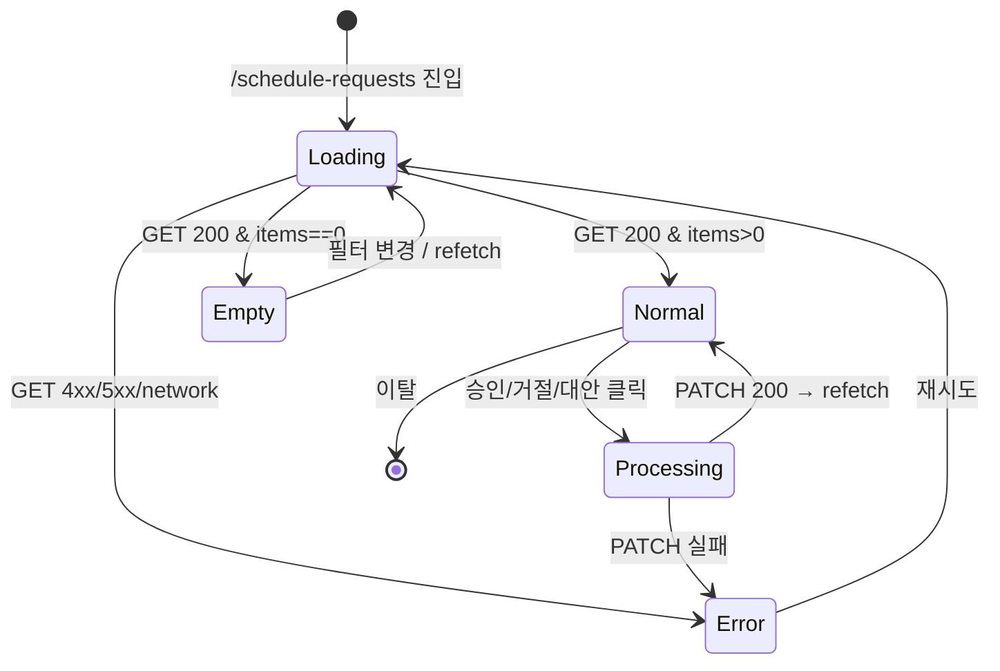

# SCR-C009 일정 요청 처리 — 기본화면 (마스터)

> 이 문서는 **화면 마스터 스펙**입니다. `01~04` 상태 문서는 이 문서를 상속(override/delta)합니다.
> 상태별 파일은 "변경점(델타)만" 기술하며, 이 문서에 정의된 레이아웃/토큰/컴포넌트/데이터/권한/접근성은 **기본값**으로 적용됩니다.

---

## 0. 메타 & 원천 참조

| 항목 | 값 |
|------|----|
| 화면 ID | SCR-C009 |
| 화면명 | 일정 요청 처리 |
| 도메인 | D04-수업관리 |
| 경로 | `/schedule-requests` |
| Next.js Route Group | `(classes)` |
| 파일 경로 | `src/app/(classes)/schedule-requests/page.tsx` |
| 페이지 컴포넌트 | `ScheduleRequestsPage` |
| 역할 | `superAdmin`, `primary`, `owner`, `manager`, `fc`, `trainer`(본인 대상), `front` |
| 우선순위 | P1 (운영 필수) |
| 플랫폼 | 데스크톱(우선) / 태블릿 / 모바일(제한) |
| 멀티테넌트 | ✅ `branchId` 강제 |

### 원천 문서 링크
| 문서 | 경로 | 섹션 |
|---|---|---|
| 화면설계서 | `docs/화면설계서/수업관리.md` | §[SCR-C009] 일정 요청 처리 (line 1443~1558) |
| 기능명세서 | `docs/기능명세서/수업관리.md` | §수업관리 > 일정 승인/거절/대안 |
| 에러코드정의서 | `docs/에러코드정의서.md` | §4.6 수업/스케줄 E400500~E422500 |
| 상태전이도 | `docs/상태전이도.md` | §수업 예약 상태 (pending → approved/rejected/alternative) |
| 다이어그램 F1 진입 | `docs/다이어그램/D04_수업관리/SCR-C009_일정요청처리/F1_진입.md` | 목록 로드 |
| 다이어그램 F2 메인 | `docs/다이어그램/D04_수업관리/SCR-C009_일정요청처리/F2_메인.md` | 승인/거절/대안 플로우 |
| 다이어그램 F3 버튼액션 | `docs/다이어그램/D04_수업관리/SCR-C009_일정요청처리/F3_버튼액션.md` | BTN_APPROVE, BTN_REJECT, BTN_ALTERNATIVE |
| 다이어그램 F4 필터검색 | `docs/다이어그램/D04_수업관리/SCR-C009_일정요청처리/F4_필터검색.md` | 유형/기간 필터 |
| 다이어그램 F5 모달트리거 | `docs/다이어그램/D04_수업관리/SCR-C009_일정요청처리/F5_모달트리거.md` | DLG-C016 |
| 다이어그램 F6 상태별 | `docs/다이어그램/D04_수업관리/SCR-C009_일정요청처리/F6_상태별.md` | LOADING/NORMAL/EMPTY/ERROR |
| 다이어그램 F7 권한 | `docs/다이어그램/D04_수업관리/SCR-C009_일정요청처리/F7_권한.md` | **역할별 처리 가능 범위** |
| 다이어그램 F8 에러 | `docs/다이어그램/D04_수업관리/SCR-C009_일정요청처리/F8_에러.md` | 중복 처리/권한 초과/네트워크 |
| 다이어그램 F9 토스트 | `docs/다이어그램/D04_수업관리/SCR-C009_일정요청처리/F9_토스트.md` | 승인/거절/대안 성공/실패 토스트 |
| 권한 매트릭스 | `docs/다이어그램/10_권한매트릭스/R1_역할화면_매트릭스.md` | `/schedule-requests` 행 |

---

## 1. 화면 목적 (Why)

회원 앱에서 요청된 **방문/OT/상담/수업/PT** 일정 요청을 담당 직원이 확인하고 **승인·거절·대안 제시** 3단 의사결정을 신속히 수행하는 **업무 큐 화면**.

- 매일 오전 운영 루틴의 1차 관문 — 미승인 건이 쌓이면 회원 앱 UX가 훼손되므로 SLA(당일 처리)가 부여됨.
- 트레이너는 **본인 대상** 요청만 처리하며, 매니저/프론트는 지점 내 전체를 처리한다.
- 대안 일정 제시는 거절과 승인의 중간 경로로, 회원-직원 간 일정 조율을 유연화한다.

---

## 2. 화면 레이아웃 (Wireframe)

### 2.1 풀뷰 와이어프레임 (데스크톱 1440px 기준)

```
┌────────────────────────────────────────────────────────────────────────┐
│ AppLayout                                                                │
│ ┌──Sidebar──┐ ┌──MainContent(p-6 lg:p-8 space-y-4)───────────────────┐│
│ │            │ │ ┌── PageHeader ─────────────────────────────────────┐││
│ │  수업/캘   │ │ │ 일정 요청 처리                          [🔄 새로고침]││
│ │  린더      │ │ │ 회원 앱에서 요청된 일정을 승인·거절합니다            │││
│ │   ▸ 일정   │ │ └──────────────────────────────────────────────────┘││
│ │     요청   │ │ ┌── §A. 미승인 배너 (pendingCount > 0) ─────────────┐││
│ │            │ │ │ 🔔 처리 대기 중인 일정 요청 12건                    │││
│ │            │ │ │   (bg-amber-50 border-amber-200 text-amber-800)    │││
│ │            │ │ └──────────────────────────────────────────────────┘││
│ │            │ │ ┌── §B. 필터 바 ────────────────────────────────────┐││
│ │            │ │ │ [전체][방문][OT][상담][체성분][수업][PT][기타]     │││
│ │            │ │ │ 기간: [2026-04-01]~[2026-04-30] [초기화]           │││
│ │            │ │ └──────────────────────────────────────────────────┘││
│ │            │ │ ┌── §C. DataTable ──────────────────────────────────┐││
│ │            │ │ │┌─┬────┬────┬────┬────┬──────┬──────┬────┬──────┐│││
│ │            │ │ ││N│요청일│대상│유형│분류│일시  │요청내│상태│처리  ││││
│ │            │ │ ││o│    │    │    │    │      │용    │    │      ││││
│ │            │ │ │├─┼────┼────┼────┼────┼──────┼──────┼────┼──────┤│││
│ │            │ │ ││1│04-20│김회│PT │GX  │10:00 │몸살로│pen │[승][대││││
│ │            │ │ ││ │     │원  │   │    │~11   │변경  │ding│][거] ││││
│ │            │ │ │└─┴────┴────┴────┴────┴──────┴──────┴────┴──────┘│││
│ │            │ │ │ Pagination: 1 2 3 ... [20건/페이지 ▼]              │││
│ │            │ │ └──────────────────────────────────────────────────┘││
│ └────────────┘ └──────────────────────────────────────────────────┘│
└────────────────────────────────────────────────────────────────────────┘
```

### 2.2 영역별 치수/역할 표

| 영역 | 위치 | 치수 | 역할 |
|---|---|---|---|
| PageHeader | 상단 | `h-16` | 제목/설명/새로고침 |
| §A 미승인 배너 | header 아래 | `w-full h-14` | pending 건수 강조 |
| §B 필터 바 | 배너 아래 | `h-24` (2줄) | Pill 필터 + 기간 |
| §C DataTable | 필터 아래 | `flex-1 min-h-[480px]` | 요청 목록 + 액션 |
| Pagination | Table 하단 | `h-12` | 페이지 제어 |

---

## 3. 디자인 토큰

### 3.1 색상
| 역할 | 클래스 | Hex | 용도 |
|---|---|---|---|
| bg.page | `bg-gray-50` | #F9FAFB | 배경 |
| bg.card | `bg-white rounded-xl shadow-sm ring-1 ring-gray-100` | — | 카드/테이블 |
| banner.pending | `bg-amber-50 border-amber-200 text-amber-800` | — | 미승인 배너 |
| banner.pending.icon | `text-amber-500` | #F59E0B | Bell 아이콘 |
| pill.active | `bg-blue-600 text-white shadow-sm` | #2563EB | 선택된 필터 |
| pill.idle | `bg-white text-gray-700 ring-1 ring-gray-200` | — | 비선택 필터 |
| pill.hover | `hover:bg-gray-50` | — | — |
| badge.pending | `bg-amber-100 text-amber-800` | — | 상태 pending |
| badge.approved | `bg-green-100 text-green-700` | — | 상태 approved |
| badge.rejected | `bg-red-100 text-red-700` | — | 상태 rejected |
| badge.alternative | `bg-indigo-100 text-indigo-700` | — | 상태 alternative |
| type.visit | `bg-sky-100 text-sky-700` | — | 방문 유형 |
| type.ot | `bg-purple-100 text-purple-700` | — | OT 유형 |
| type.consult | `bg-cyan-100 text-cyan-700` | — | 상담 유형 |
| type.body | `bg-teal-100 text-teal-700` | — | 체성분 유형 |
| type.class | `bg-emerald-100 text-emerald-700` | — | 수업 유형 |
| type.pt | `bg-orange-100 text-orange-700` | — | PT 유형 |
| btn.approve | `bg-emerald-600 hover:bg-emerald-700 text-white` | — | 승인 버튼 |
| btn.alternative | `bg-blue-600 hover:bg-blue-700 text-white` | — | 대안 버튼 |
| btn.reject | `bg-red-600 hover:bg-red-700 text-white` | — | 거절 버튼 |
| btn.disabled | `bg-gray-200 text-gray-400 cursor-not-allowed` | — | 처리 완료 후 |

### 3.2 타이포그래피
| 토큰 | 스타일 | 용도 |
|---|---|---|
| page.title | `text-2xl font-bold tracking-tight text-gray-900` | "일정 요청 처리" |
| page.subtitle | `text-sm text-gray-500` | 보조 설명 |
| banner.title | `text-sm font-semibold` | 배너 본문 |
| banner.count | `text-base font-bold tabular-nums` | 건수 강조 |
| table.th | `text-xs font-medium text-gray-500 uppercase` | 컬럼 헤더 |
| table.td | `text-sm text-gray-900` | 셀 내용 |
| table.mono | `font-mono tabular-nums text-xs text-gray-700` | 일자/시간 |
| table.memo | `text-sm text-gray-700 line-clamp-1` | 요청 내용 |
| badge | `text-xs font-medium px-2 py-0.5 rounded-full` | 상태·유형 배지 |
| btn.sm | `text-xs font-medium px-3 h-7 rounded-md` | 액션 3버튼 |

### 3.3 간격/반경/그림자
| 토큰 | 값 |
|---|---|
| card.radius | `rounded-xl` (12px) |
| card.padding | `p-4 md:p-6` |
| section.gap | `space-y-4` |
| filter.gap | `gap-2` (필터 pill 간) |
| action.gap | `gap-1.5` (액션 버튼 간) |

### 3.4 모션
- 행 hover: `hover:bg-gray-50 transition-colors duration-100`
- 배너 진입: `animate-[fadeInDown_150ms_ease-out]`
- 액션 실행 중: 해당 버튼 `opacity-60 cursor-wait` + Loader2 스핀
- `prefers-reduced-motion`: 애니메이션 제거

---

## 4. 반응형 규칙

| BP | 폭 | §A 배너 | §B 필터 | §C 테이블 |
|---|---|---|---|---|
| Mobile <640 | 100% | 카드 내부 배치 | Pill 가로 스크롤 + 기간 세로 | 가로 스크롤 (주요 컬럼 3~4) |
| Tablet 640~1024 | 100% | full | Pill 2줄 + 기간 1줄 | 6~7 컬럼 |
| Desktop ≥1024 | sidebar+main | full | 1줄 | 전체 컬럼 |
| XL ≥1440 | max container | full | 1줄 | 전체 컬럼 + 여백 |

---

## 5. 🔐 역할별(RBAC) 매트릭스

> `●` = 표시+CRUD/이동 가능, `○` = 표시만(읽기), `—` = 미표시
> 멀티테넌트 범위: primary/super는 전 지점, 그 외는 `branchId` 고정

### 5.1 역할 × 요소 매트릭스

| 요소 | primary/super | owner | manager | fc | trainer | staff | front | readonly |
|---|:---:|:---:|:---:|:---:|:---:|:---:|:---:|:---:|
| **페이지 접근** | ● | ● | ● | ● | ●(본인대상만) | ○ | ● | — |
| 지점 전환 드롭다운 | ● | ●(소속 브랜드) | — | — | — | — | — | — |
| §A 미승인 배너 | ● | ● | ● | ● | ●(본인 건수) | ○ | ● | — |
| **§B 필터** | | | | | | | | |
| 유형 필터 | ● | ● | ● | ● | ● | ● | ● | — |
| 기간 필터 | ● | ● | ● | ● | ● | ● | ● | — |
| **§C 테이블** | | | | | | | | |
| 전체 요청 목록 | ● | ● | ● | ● | ○(본인 외 회색) | ○ | ● | — |
| 본인 담당 요청 | ● | ● | ● | ● | ● | ○ | ● | — |
| **액션(pending만)** | | | | | | | | |
| 승인 버튼 | ● | ● | ● | ● | ●(본인만) | — | ● | — |
| 대안 제시 버튼 | ● | ● | ● | ● | ●(본인만) | — | ● | — |
| 거절 버튼 | ● | ● | ● | ● | ●(본인만) | — | ● | — |
| 대상 회원 상세 이동 | ● | ● | ● | ● | ●(본인담당) | ○ | ● | — |
| CSV 내보내기 | ● | ● | ● | — | — | — | — | — |

### 5.2 권한 판별 코드

```ts
export const canApproveRequest = (r: Role, req: ScheduleRequest, uid: number) =>
  ['superAdmin','primary','owner','manager','fc','front'].includes(r)
  || (r === 'trainer' && req.targetStaffId === uid);
export const canExportCSV = (r: Role) =>
  ['superAdmin','primary','owner','manager'].includes(r);
```

---

## 6. 컴포넌트 트리

```
<AppLayout role={user.role}>
  <div className="p-6 lg:p-8 space-y-4">
    <PageHeader title="일정 요청 처리" subtitle="회원 앱에서 요청된 일정을 승인·거절합니다.">
      <RefreshButton onClick={refetch} loading={isFetching} />
    </PageHeader>

    {pendingCount > 0 && (
      <PendingBanner count={pendingCount} />       /* §A */
    )}

    <Card className="p-4 space-y-4">              /* §B */
      <TypePillGroup value={typeFilter} onChange={setType}
        options={TYPE_OPTIONS} />
      <DateRangePicker start={startDate} end={endDate}
        onChange={setRange} onReset={resetRange} />
    </Card>

    <Card className="p-0">                         /* §C */
      <DataTable
        columns={REQUEST_COLUMNS(role, userId)}
        data={requests}
        loading={isLoading}
        sort={sort} onSortChange={setSort}
        pagination={{ page, pageSize: 20, total }}
        onPageChange={setPage}
        emptyState={<EmptyState />}
      />
    </Card>

    {alternativeTarget && (
      <DLG-C016 AlternativeScheduleDialog        /* 모달 */
        target={alternativeTarget}
        onSubmit={submitAlternative}
        onClose={() => setAlternativeTarget(null)} />
    )}
  </div>
</AppLayout>
```

### 6.1 핵심 컴포넌트

| 컴포넌트 | 파일 | Props |
|---|---|---|
| `PendingBanner` | `src/components/schedule/PendingBanner.tsx` | `{count:number}` |
| `TypePillGroup` | `src/components/ui/PillGroup.tsx` | `{value, onChange, options}` |
| `DateRangePicker` | `src/components/ui/DateRangePicker.tsx` | `{start,end,onChange,onReset}` |
| `DataTable` | `src/components/ui/DataTable.tsx` | 전역 공용 |
| `RequestActionCell` | `src/components/schedule/RequestActionCell.tsx` | `{req, canAct, onApprove, onAlternative, onReject, loading}` |
| `StatusBadge` | `src/components/ui/StatusBadge.tsx` | `{variant, label, dot?}` |
| `AlternativeScheduleDialog` (DLG-C016) | `src/components/schedule/AlternativeScheduleDialog.tsx` | `{target, onSubmit, onClose}` |

---

## 7. 데이터 계약

### 7.1 타입

```ts
// src/types/schedule-request.ts
export type RequestType = 'visit'|'ot'|'consult'|'body'|'class'|'pt'|'etc';
export type RequestStatus = 'pending'|'approved'|'rejected'|'alternative'|'expired';

export interface ScheduleRequest {
  id: number;
  branchId: number;
  memberId: number;
  memberName: string;
  targetStaffId: number;       // 트레이너 본인 필터용
  targetStaffName: string;
  type: RequestType;
  scheduleCategory: string;    // '근력','유산소' 등
  startTime: string;           // ISO
  endTime: string;             // ISO
  memo: string | null;
  status: RequestStatus;
  alternativeDate?: string;
  alternativeTime?: string;
  alternativeMemo?: string;
  rejectReason?: string;
  createdAt: string;           // ISO, 요청일
  updatedAt: string;
  updatedBy?: string;
}
```

### 7.2 API

| 엔드포인트 | 메서드 | 파라미터/바디 | 반환 |
|---|---|---|---|
| `/api/schedule-requests` | GET | `{branchId, type?, from?, to?, status?, page=1, pageSize=20, staffId?}` | `{ items: ScheduleRequest[], total:number, pendingCount:number }` |
| `/api/schedule-requests/:id/approve` | PATCH | `{}` | `{ success, data: ScheduleRequest }` |
| `/api/schedule-requests/:id/reject` | PATCH | `{reason?:string}` | `{ success, data: ScheduleRequest }` |
| `/api/schedule-requests/:id/alternative` | PATCH | `{alternativeDate, alternativeTime, memo?}` | `{ success, data: ScheduleRequest }` |
| `/api/schedule-requests/export` | GET | `{from,to,type?}` | CSV 파일 |

### 7.3 상태 관리
- **Fetching**: React Query `useQuery(['schedule-requests', filter], fetchFn)`; staleTime 30s.
- **Mutations**: approve/reject/alternative 각 `useMutation` — 성공 시 목록 invalidate + toast.
- **Filter state**: URL searchParams `?type=&from=&to=&page=` 동기화.
- **Server scope**: jwt 기반 branchId·role 강제. trainer는 서버가 `targetStaffId=user.id` 강제.

---

## 8. 비즈니스 룰

1. **목록 정렬**: 기본 `createdAt DESC`. 페이지 사이즈 20.
2. **미승인 배너**: `pendingCount` = 현재 지점의 `status='pending'` 전체(필터 미적용). 0건이면 배너 미표시.
3. **기간 기본값**: 이번달 1일 ~ 말일 (KST).
4. **처리 Idempotency**: 같은 요청에 동시에 승인·거절 버튼이 빠르게 연달아 클릭되는 것을 방지(mutation pending 동안 버튼 disabled).
5. **승인 후 처리**: `class` / `pt` 유형은 자동으로 `classes` 테이블에 INSERT(정원 검증 포함). 실패 시 `status='pending'` 롤백.
6. **대안 제시 후 상태**: `status='alternative'`, 회원 앱에서 수락/거절 시 재처리.
7. **권한**: trainer는 `targetStaffId !== userId` 행에서 액션 버튼 숨김·회원명 회색 처리.
8. **감사 로그**: 승인/거절/대안 각각 `AUDIT.SCHEDULE_APPROVE / REJECT / ALTERNATIVE` 기록(scheduleId, memberId, staffId, branchId).
9. **중복 처리 방지**: 서버에서 `status != pending` 요청 처리 시 409 + `E409500`(코드 추가 필요) → "이미 처리된 요청입니다" 토스트.
10. **정원 초과 승인 실패**: E400502 토스트 + 대기열(SCR-C012) 안내 링크.
11. **만료**: 요청 시점으로부터 48시간 지나면 서버 스케줄러가 `status='expired'`로 자동 전환.

---

## 9. 상태 목록

| 파일 | 상태 코드 | 한글 | 트리거 |
|---|---|---|---|
| `01-로딩.md` | `loading` | 로딩(스켈레톤) | 진입 직후, GET pending |
| `02-정상.md` | `normal` | 정상 | 목록 수신 완료 |
| `03-빈상태.md` | `empty` | 빈 상태 | `items.length === 0` (필터 적용 여부 구분) |
| `04-에러.md` | `error` | 에러 | API/네트워크 실패 |

상태 전이: `docs/다이어그램/D04_수업관리/SCR-C009_일정요청처리/F6_상태별.md`.

---

## 10. 에러 코드 매핑

| errorCode | HTTP | 시나리오 | 사용자 메시지 | UI 대응 |
|---|---|---|---|---|
| E400500 | 400 | 승인 시 필수값 누락 | "수업 정보를 입력해주세요" | 토스트 + 원인 필드 힌트 |
| E400501 | 400 | 승인 시 시간 충돌 | "해당 시간에 이미 수업이 등록되어 있습니다" | 토스트 + 캘린더 열기 제안 |
| E400502 | 400 | 정원 초과 | "수업 정원이 초과되었습니다" | 토스트 + 대기열 전환 안내 |
| E404500 | 404 | 요청 ID 없음 | "요청을 찾을 수 없습니다" | 목록 refetch + 토스트 |
| E409500 | 409 | 이미 처리됨 | "이미 처리된 요청입니다" | 행만 refetch |
| E422500 | 422 | 잔여 횟수 부족 | "수강 가능한 잔여 횟수가 없습니다" | 토스트 + 회원 상세 링크 |
| E401001 | 401 | 세션 만료 | — | 로그인 리다이렉트 |
| E500001 | 500 | 서버 오류 | "서버 오류가 발생했습니다" | 에러 상태(04) 전환 |
| NETWORK | — | 네트워크 | "네트워크 연결을 확인해주세요" | 재시도 버튼 |

---

## 11. 접근성 (WCAG 2.1 AA)

| 항목 | 요구사항 |
|---|---|
| 랜드마크 | `<main role="main">`, 섹션별 `aria-label` |
| 테이블 | `<table>` + `<caption class="sr-only">일정 요청 목록</caption>` |
| 상태 배지 | `aria-label`에 한국어 상태 명시 (예: "상태: 대기중") |
| 액션 버튼 | 각 `aria-label="${memberName}님의 요청 승인"` 등 맥락 포함 |
| 배너 | `role="status" aria-live="polite"` (새 요청 도착 시 카운트 업데이트 공지) |
| 필터 | Pill 그룹 `role="group" aria-labelledby="filter-type-label"`, 선택 시 `aria-pressed="true"` |
| 포커스 | Tab: 새로고침 → 필터 → 기간 → 행별 액션. `focus-visible:ring-2 ring-blue-500` |
| 모션 | `prefers-reduced-motion`: 행 hover 배경 전환만 허용 |
| 토스트 | `sonner` / `role="status"` 자동 |

---

## 12. 진입 / 이탈

### 진입
- 사이드바 "수업/캘린더 > 일정 요청" 클릭
- 회원 앱 푸시 알림(신규 요청) → 딥링크 `/schedule-requests?highlight={id}`
- SCR-C001 수업캘린더 상단 "미승인 N건" 배지 클릭

### 이탈
| 액션 | 목적지 |
|---|---|
| 회원명 클릭 | `/members/detail?id=${memberId}` |
| 승인 성공 (class/pt) | (선택) `/calendar?date=${startTime}` 이동 옵션 |
| 대안 제시 | DLG-C016 모달 내 완료 → 토스트만 |
| 사이드바 메뉴 | 타 화면 |

---

## 13. 다이어그램 통합 뷰



---

## 14. 🧩 바이브코딩 프롬프트 (마스터)

```
Next.js 15 App Router + TypeScript + Tailwind v4 + React Query + Supabase 기반
'use client' 컴포넌트를 작성하라.

━━ 화면: SCR-C009 일정 요청 처리 (멀티테넌트, RBAC) ━━
파일: src/app/(classes)/schedule-requests/page.tsx
보조:
- src/components/schedule/PendingBanner.tsx
- src/components/schedule/RequestActionCell.tsx
- src/components/schedule/AlternativeScheduleDialog.tsx   // DLG-C016
- src/hooks/useScheduleRequests.ts
- src/lib/role-access.ts (canApproveRequest)
- src/types/schedule-request.ts

━━ 레이아웃 ━━
<AppLayout role={user.role}>
  <main className="p-6 lg:p-8 space-y-4 bg-gray-50 min-h-screen">
    <PageHeader
      title="일정 요청 처리"
      subtitle="회원 앱에서 요청된 일정을 승인·거절합니다.">
      <RefreshButton onClick={refetch} loading={isFetching} />
    </PageHeader>

    {pendingCount > 0 && (
      <div role="status" aria-live="polite"
           className="flex items-center gap-2 rounded-xl border border-amber-200
                      bg-amber-50 px-4 py-3 text-sm text-amber-800
                      animate-[fadeInDown_150ms_ease-out]">
        <BellIcon className="size-5 text-amber-500" />
        <span>처리 대기 중인 일정 요청 <b className="tabular-nums">{pendingCount}</b>건</span>
      </div>
    )}

    <section className="bg-white rounded-xl shadow-sm ring-1 ring-gray-100 p-4 space-y-3">
      <div role="group" aria-label="유형 필터"
           className="flex flex-wrap gap-2">
        {TYPE_OPTIONS.map(opt => (
          <button key={opt.value}
            aria-pressed={typeFilter === opt.value}
            onClick={() => setType(opt.value)}
            className={cn(
              'h-8 px-3 rounded-full text-xs font-medium transition-colors',
              typeFilter === opt.value
                ? 'bg-blue-600 text-white shadow-sm'
                : 'bg-white text-gray-700 ring-1 ring-gray-200 hover:bg-gray-50'
            )}>
            {opt.label}
          </button>
        ))}
      </div>
      <div className="flex items-center gap-2 text-sm">
        <span className="text-gray-500">기간</span>
        <DateInput value={start} onChange={setStart} />
        <span className="text-gray-400">~</span>
        <DateInput value={end} onChange={setEnd} />
        <button onClick={resetRange}
          className="h-8 px-3 text-xs rounded-md border border-gray-200 text-gray-600 hover:bg-gray-50">
          초기화
        </button>
      </div>
    </section>

    <section className="bg-white rounded-xl shadow-sm ring-1 ring-gray-100 overflow-hidden">
      <DataTable
        columns={columns}
        data={items}
        loading={isLoading}
        pagination={{ page, pageSize: 20, total }}
        onPageChange={setPage}
        emptyState={<EmptyState icon={<BellIcon/>} text="처리 대기 중인 일정 요청이 없습니다." />}
      />
    </section>
  </main>
</AppLayout>

━━ 컬럼 정의 ━━
const columns = [
  { key:'no', header:'No', width:50, align:'center', render:(_,i)=>i+1 },
  { key:'createdAt', header:'요청일', width:120,
    render:v => <span className="font-mono tabular-nums text-xs">{formatDate(v,'YYYY-MM-DD')}</span> },
  { key:'memberName', header:'대상', width:140,
    render:(v,row) => (
      <button className="text-sm font-medium text-gray-900 hover:text-blue-600"
              onClick={()=>goMember(row.memberId)}>{v}</button>
    ) },
  { key:'type', header:'유형', width:80, align:'center',
    render:v => <StatusBadge variant={TYPE_VARIANT[v]} label={TYPE_LABEL[v]} /> },
  { key:'scheduleCategory', header:'분류', width:90, align:'center',
    render:v => <StatusBadge variant="default" label={v} /> },
  { key:'startTime', header:'일시', width:180,
    render:(v,row) => (
      <div className="flex items-center gap-1 text-sm text-gray-700">
        <ClockIcon className="size-3.5 text-gray-400" />
        <span className="font-mono tabular-nums">
          {formatKst(v,'MM-DD HH:mm')} ~ {formatKst(row.endTime,'HH:mm')}
        </span>
      </div>
    ) },
  { key:'memo', header:'요청 내용', render:v =>
      <p className="text-sm text-gray-700 line-clamp-1 max-w-[240px]">{v ?? '-'}</p> },
  { key:'status', header:'상태', width:90, align:'center',
    render:v => <StatusBadge variant={STATUS_VARIANT[v]} label={STATUS_LABEL[v]} dot /> },
  { key:'actions', header:'처리', width:200, align:'center',
    render:(_,row) => (
      <RequestActionCell req={row}
        canAct={canApproveRequest(role, row, userId) && row.status==='pending'}
        loading={mutatingId===row.id}
        onApprove={() => approve.mutate(row.id)}
        onAlternative={() => setAlternativeTarget(row)}
        onReject={() => confirmReject(row.id)} />
    ) },
];

━━ 훅 ━━
useScheduleRequests(filter) = useQuery({
  queryKey: ['schedule-requests', filter],
  queryFn: () => api.get('/api/schedule-requests', filter),
  staleTime: 30_000,
});
useApproveMutation / useRejectMutation / useAlternativeMutation
 각 → onSuccess: queryClient.invalidateQueries(['schedule-requests']) + toast.success()

━━ 권한 ━━
import { canApproveRequest } from '@/lib/role-access';
- trainer: req.targetStaffId === userId 일 때만 액션 3버튼 렌더
- staff / readonly: 액션 컬럼 자체 빈 칸
- super/primary: BranchSwitcher 노출

━━ 인터랙션 ━━
- 필터 pill 클릭: setType + URL 갱신
- 기간 변경: 디바운스 300ms 후 refetch
- 승인: 낙관 업데이트 없이 PATCH → onSuccess refetch + toast.success("일정이 승인되었습니다.")
- 거절: confirmDialog("일정 요청을 거절하시겠습니까?") → PATCH → toast
- 대안: DLG-C016 모달. 날짜/시간 필수, 빈값시 "대안 날짜와 시간을 입력해주세요." 토스트
- 행 hover: bg-gray-50

━━ 디자인 토큰 (정확히 적용) ━━
bg.page: bg-gray-50
card: bg-white rounded-xl shadow-sm ring-1 ring-gray-100
banner.pending: bg-amber-50 border border-amber-200 text-amber-800 rounded-xl px-4 py-3
pill.active: bg-blue-600 text-white shadow-sm
pill.idle:   bg-white text-gray-700 ring-1 ring-gray-200 hover:bg-gray-50
badge.pending: bg-amber-100 text-amber-800
badge.approved: bg-green-100 text-green-700
badge.rejected: bg-red-100 text-red-700
badge.alternative: bg-indigo-100 text-indigo-700
btn.approve: h-7 px-3 text-xs bg-emerald-600 hover:bg-emerald-700 text-white rounded-md
btn.alternative: h-7 px-3 text-xs bg-blue-600 hover:bg-blue-700 text-white rounded-md
btn.reject: h-7 px-3 text-xs bg-red-600 hover:bg-red-700 text-white rounded-md

━━ 접근성 ━━
- <main role="main">
- 배너: role="status" aria-live="polite"
- pill: aria-pressed + group aria-label
- 액션 버튼: aria-label="{memberName}님의 요청 승인/거절/대안제시"
- 테이블 caption sr-only

━━ 반응형 ━━
- 모바일: 필터 pill 가로 스크롤, 테이블 가로 스크롤, 컬럼 3~4개만 노출
- 태블릿: 필터 2줄, 테이블 6~7컬럼
- 데스크톱: 전체 컬럼

━━ 에러 처리 ━━
- approve 409(E409500): 행 refetch + toast.warning("이미 처리된 요청입니다")
- approve 400(E400501): toast.error + "캘린더 열기" 액션
- approve 400(E400502): toast.error + "대기열로 이동" 액션 (SCR-C012)
- 네트워크: 토스트 + 재시도 버튼
```

---

## 15. QA 체크리스트 (수용 기준)

- [ ] 진입 시 React Query pending → 스켈레톤 표시
- [ ] pendingCount > 0 시 상단 amber 배너 노출, 0이면 미노출
- [ ] 유형 필터 pill 클릭 시 URL `?type=` 동기화
- [ ] 기간 필터 변경 시 디바운스 후 refetch
- [ ] 승인 PATCH 성공 → 목록 리프레시 + "일정이 승인되었습니다." 토스트
- [ ] 거절 PATCH 전 confirm → 성공 → "일정이 거절되었습니다." 토스트
- [ ] 대안 제시 모달에서 날짜/시간 빈값 시 제출 불가 + 토스트
- [ ] 대안 제출 성공 시 `대안 일정(YYYY-MM-DD HH:mm)을 제시했습니다.` 토스트
- [ ] 중복 처리 시 E409500 → 행 refetch
- [ ] 정원 초과 E400502 → 대기열 링크 안내
- [ ] trainer는 본인 대상 아닌 행의 액션 버튼 미렌더
- [ ] staff/readonly는 액션 컬럼 빈 칸
- [ ] primary/super는 지점 전환 가능
- [ ] 키보드만으로 pill → 기간 → 테이블 → 액션 진입 가능
- [ ] SR이 배너 카운트 변화 공지
- [ ] prefers-reduced-motion: 배너 진입 애니 제거
- [ ] 네트워크 단절 시 04-에러 상태 + 재시도 버튼
