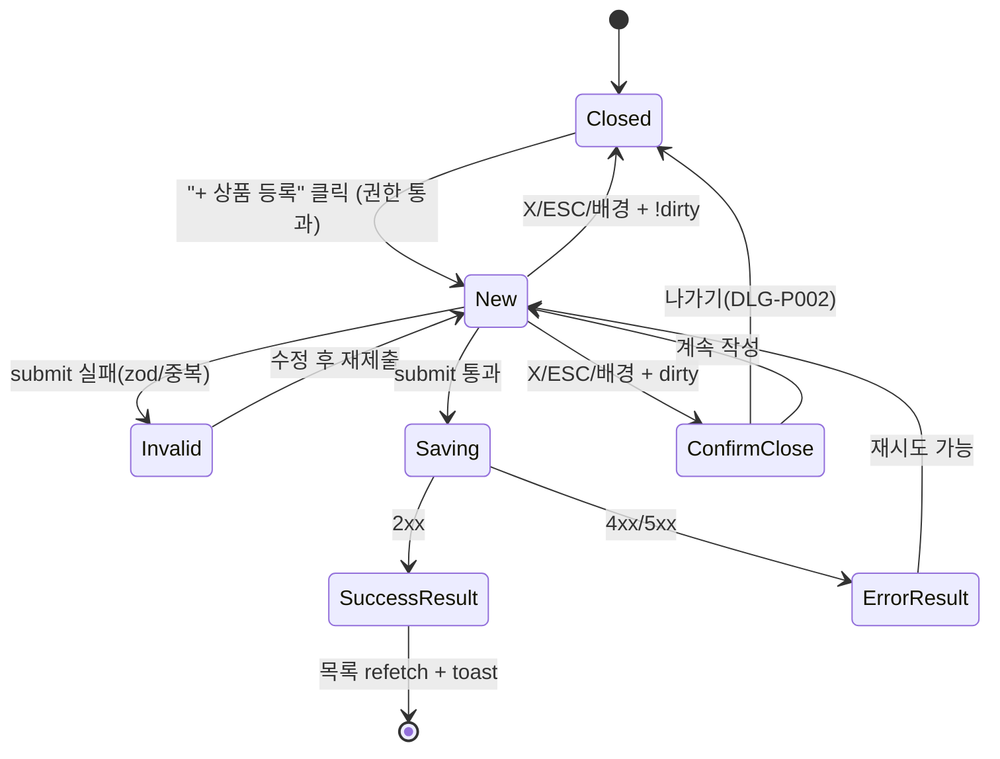

# DLG-P001 상품 등록 모달 — 기본화면 (마스터)

> 이 문서는 **다이얼로그 마스터 스펙**입니다. `01~03` 상태 문서는 이 문서를 상속(override/delta)합니다.
> 🎯 **생성 액션(create)**: 상품 신규 등록을 위한 입력 전용 모달. SCR-P003 상품 상세 패널의 "신규 모드"와 동일 폼을 공용한다.

---

## 0. 메타 & 원천 참조

| 항목 | 값 |
|------|----|
| 다이얼로그 ID | DLG-P001 |
| 다이얼로그명 | 상품 등록 모달 |
| 도메인 | D05-상품관리 |
| 부모 화면 | SCR-P001 상품 관리 (`/products`) |
| 트리거 조건 | "+ 상품 등록" 버튼 클릭 (`canEditProduct === true`) |
| 확인 레벨 | L1 (생성) |
| 서버 호출 | ✅ `INSERT products` + `INSERT audit_log`(가격 기록) |
| 닫기 옵션 | 🟡 X/ESC/배경 = `DLG-P002 작업취소확인` 오픈 (dirty 시) |
| 역할 | superAdmin, primary, owner, manager |
| 파일 경로 | `src/components/product/ProductDetailPanel.tsx` (mode='new') |
| 우선순위 | P0 |

### 원천 문서 링크

| 문서 | 경로 | 섹션 |
|---|---|---|
| 화면설계서 | `docs/화면설계서/상품관리.md` | §SCR-P003 필드정의 / §DLG-P001 |
| 기능명세서 | `docs/기능명세서/상품관리.md` | §2 상품 상세 패널 (products 테이블, ProductRow, 패키지 JSON) |
| 에러코드정의서 | `docs/에러코드정의서.md` | §4.4 매출/결제 E404301(상품없음), §4.1 공통 E400001/E403001 |
| 다이어그램 | `docs/다이어그램/D05_상품관리/DLG/DLG-P001_상품등록모달/F1~F9_*.md` | 진입/메인/버튼/모달/상태/권한/에러 |
| 권한 매트릭스 | `docs/다이어그램/10_권한매트릭스/R1_역할화면_매트릭스.md` | 상품관리 `productEdit` feature |

---

## 1. 다이얼로그 목적 (Why)

센터 운영자가 신규 상품(이용권/PT/GX/기타)을 **한 번의 모달 플로우**에서 등록하도록 한다.
- 마스터-디테일 패널의 "신규 모드"를 중첩 모달로 제공(독립 라우트 없이 `/products` 오버레이).
- 필수 필드 + 선택 옵션 + 요일/시간 + 옵션 체크박스 + 패키지 구성까지 단일 폼에서 완결.
- 저장 성공 시 목록 자동 refetch, 실패 시 인라인/토스트 에러 표시.
- 입력 중 이탈 시 DLG-P002를 통한 안전한 취소 흐름을 제공.

---

## 2. 화면 레이아웃 (Wireframe)

### 2.1 데스크톱 (1440px) 기본 레이아웃

```
  backdrop: fixed inset-0 bg-black/50 z-40
  ┌──────────────────────────────────────────────────────┐
  │ ┌────────────────────────────────────────────────┐   │
  │ │ 📦  상품 등록                             [X]  │   │ ← Header h56
  │ │ ────────────────────────────────────────────── │   │
  │ │ 상품구분  ●레슨 ○이용 ○락커 ○판매  사용인원▼│   │
  │ │ 상품명*   [                              ]     │   │
  │ │ 현금가*   [      원]   카드가  [      원]     │   │
  │ │ ┌─레슨/이용 조건부 필드──────────────────────┐ │   │
  │ │ │ 레슨시간▼  유효기간▼  수업구분 ○개인 ○정규  │ │   │
  │ │ │ 이용구분 ○기간 ○횟수 ○포인트   기간/횟수[]  │ │   │
  │ │ │ 횟수제한 ☐  [1회 ▼]                          │ │   │
  │ │ └─────────────────────────────────────────────┘ │   │
  │ │ 태그 [         ]   설명 [                   ]   │   │
  │ │ ┌─요일/시간(파란박스)──┬─옵션(파란박스)──────┐ │   │
  │ │ │ ☑월 09:00~18:00       │ ☑예약가능           │ │   │
  │ │ │ ☑화 09:00~18:00       │ ☑시설이용가능       │ │   │
  │ │ │ ☑수 ...               │ ☑홀딩가능           │ │   │
  │ │ │ ☐토 ☐일               │ ☑활성 상태          │ │   │
  │ │ └────────────────────────┴─────────────────────┘ │   │
  │ │ 예약시간간격▼  휴회기간▼  판매유형▼            │   │
  │ │ ┌─패키지 구성 (접기/펼치기)──────────────────┐ │   │
  │ │ │ ☐ 이 상품을 패키지로 등록                    │ │   │
  │ │ │ [상품선택 ▼][추가]    합산 정가: N원         │ │   │
  │ │ └─────────────────────────────────────────────┘ │   │
  │ │ ────────────────────────────────────────────── │   │
  │ │                            [취소]  [등록]      │   │ ← Footer h64
  │ └────────────────────────────────────────────────┘   │
  └──────────────────────────────────────────────────────┘
```

### 2.2 영역 / 치수 표

| 영역 | 위치 | 치수 | 역할 |
|---|---|---|---|
| Backdrop | `fixed inset-0 bg-black/50 z-40` | 전체 | 배경 차단 + 포커스 트랩 |
| Modal | `w-[min(960px,94vw)] max-h-[92vh]` | 960×auto | 스크롤 컨테이너 |
| Header | 56px | X + 아이콘 + 타이틀 |
| Body | scroll | 폼 필드 + 섹션 |
| Footer | 64px | [취소] [등록] (sticky) |

---

## 3. 디자인 토큰

### 3.1 색상
| 토큰 | 클래스 | 용도 |
|---|---|---|
| backdrop | `fixed inset-0 bg-black/50 z-40` | 배경 |
| card | `bg-white rounded-2xl shadow-xl ring-1 ring-gray-100` | 모달 |
| accent.bar | `h-[3px] bg-blue-600 rounded-t-2xl` | 상단 액센트 |
| icon.create.wrap | `bg-blue-50 rounded-full size-10` | Package 아이콘 |
| icon.create | `text-blue-600` | Lucide `Package` |
| section.box | `rounded-xl border border-blue-200 bg-blue-50/30 p-4` | 요일/옵션 박스 |
| input.default | `h-10 w-full rounded-lg border border-gray-300 px-3 text-sm focus:ring-2 focus:ring-blue-500` | |
| input.error | `border-rose-300 focus:ring-rose-500` | |
| input.disabled | `bg-gray-50 text-gray-400 cursor-not-allowed` | |
| suffix | `absolute right-3 text-xs text-gray-500` | "원" |
| btn.cancel | `border border-gray-300 bg-white hover:bg-gray-50 text-gray-700` | |
| btn.primary | `bg-blue-600 hover:bg-blue-700 text-white` | |
| toggle.on | `bg-blue-600` | |
| badge.required | `text-rose-500 text-xs ml-1` | "*" |

### 3.2 타이포
| 토큰 | 값 |
|---|---|
| title | `text-lg font-semibold text-gray-900` |
| label | `text-sm font-medium text-gray-700` |
| hint | `text-xs text-gray-500` |
| error | `text-xs text-rose-600 mt-1` |
| section.title | `text-sm font-semibold text-blue-700` |

### 3.3 간격/반경/모션
- radius: `rounded-2xl` (카드), `rounded-lg` (인풋/버튼), `rounded-xl` (섹션 박스)
- padding: `px-6 py-5` 헤더/바디, `px-6 py-4` 푸터
- gap: `space-y-4` 필드, `gap-3` 인라인, `gap-2` 버튼
- enter: `motion-reduce:animate-none animate-[fadeInUp_160ms_ease-out]`

---

## 4. 반응형 규칙

| BP | 폭 | 레이아웃 |
|---|---|---|
| Mobile <640 | `max-w-[calc(100%-24px)]` | 1열, 요일/옵션 박스 세로, 푸터 sticky |
| Tablet 640~1024 | `max-w-[720px]` | 레슨/이용 조건부 섹션 2열 |
| Desktop ≥1024 | `max-w-[960px]` | 요일/옵션 2열, 일반 필드 2~3열 |

---

## 5. 🔐 역할별(RBAC) 매트릭스

> 버튼/필드 노출 = 부모 SCR-P001의 `canEditProduct = hasFeature(role,'productEdit', isSuperAdmin)`에 의존.

| 요소 | superAdmin | primary | owner | manager | fc | trainer | staff | front | readonly |
|---|:---:|:---:|:---:|:---:|:---:|:---:|:---:|:---:|:---:|
| 페이지 "+상품 등록" 버튼 | ● | ● | ● | ● | — | — | — | — | — |
| 모달 오픈 자체 | ● | ● | ● | ● | — | — | — | — | — |
| 상품명/금액 입력 | ● | ● | ● | ● | — | — | — | — | — |
| 판매유형 `KIOSK` 설정 | ● | ● | ● | ● | — | — | — | — | — |
| 패키지 구성 등록 | ● | ● | ● | ● | — | — | — | — | — |
| 활성 상태 토글 | ● | ● | ● | ● | — | — | — | — | — |
| 취소(X/ESC/배경) | ● | ● | ● | ● | — | — | — | — | — |
| "등록" 버튼 | ● | ● | ● | ● | — | — | — | — | — |

### 멀티테넌트
- 서버는 `branchId = getBranchId()` 강제 삽입. URL/Store의 `branchId` 기준.
- super/primary는 상단 BranchSwitcher 값으로 삽입될 `branchId` 결정. 다른 지점 branchId 조작 시 403 → 토스트 후 닫기.

---

## 6. 컴포넌트 트리

```tsx
<Dialog open={isOpen} onOpenChange={handleClose} aria-labelledby="pcm-title">
  <DialogPortal>
    <DialogOverlay className="fixed inset-0 z-40 bg-black/50" />
    <DialogContent className="fixed left-1/2 top-1/2 z-50 -translate-x-1/2 -translate-y-1/2
                               w-[min(960px,94vw)] max-h-[92vh] overflow-hidden
                               rounded-2xl bg-white shadow-xl ring-1 ring-gray-100">
      <div className="h-[3px] bg-blue-600 rounded-t-2xl" />
      <DialogHeader className="flex items-center gap-3 px-6 py-4 border-b">
        <span className="flex size-10 items-center justify-center rounded-full bg-blue-50">
          <Package className="size-5 text-blue-600" aria-hidden />
        </span>
        <DialogTitle id="pcm-title" className="text-lg font-semibold text-gray-900">
          상품 등록
        </DialogTitle>
        <DialogClose onClick={requestClose} aria-label="닫기"
          className="ml-auto size-8 rounded-md hover:bg-gray-100 text-gray-500">
          <X className="size-4" />
        </DialogClose>
      </DialogHeader>
      <form onSubmit={handleSubmit(onSubmit)}
            className="overflow-y-auto px-6 py-5 space-y-4 max-h-[calc(92vh-56px-64px)]">
        <ProductKindRow register={register} />
        <BasicFields register={register} errors={errors} />
        <ConditionalFields watch={watch} register={register} />
        <WeekdayTimeBox fields={fields} />
        <OptionToggleBox register={register} />
        <FacilityAndReservationBox register={register} />
        <PackageSection packageItems={packageItems} onAdd={addPackage} />
      </form>
      <DialogFooter className="flex items-center justify-end gap-2 px-6 py-4 border-t bg-white">
        <button type="button" onClick={requestClose}
          className="h-10 px-4 rounded-lg border border-gray-300 bg-white hover:bg-gray-50 text-sm font-medium text-gray-700">
          취소
        </button>
        <button type="submit" disabled={saving}
          className="h-10 px-4 rounded-lg bg-blue-600 hover:bg-blue-700 text-white text-sm font-medium disabled:bg-blue-300">
          {saving ? <Loader2 className="size-4 animate-spin mr-1 inline" /> : null}
          {saving ? '저장 중...' : '등록'}
        </button>
      </DialogFooter>
    </DialogContent>
  </DialogPortal>
</Dialog>
```

### 컴포넌트 명세
| 컴포넌트 | Props | 재사용 |
|---|---|---|
| `Dialog/DialogContent/...` | Radix Dialog | 전역 공용 (`src/components/ui/dialog.tsx`) |
| `ProductDetailPanel` | `{ mode:'new', onClose, onSaved }` | SCR-P003과 공용 |
| `PackageSection` | `{ items, onAdd, onRemove, selectableProducts }` | 전용 |
| `ConfirmDialog` (DLG-P002) | `{ variant:'warning', title, onConfirm }` | 전역 공용 |

---

## 7. 데이터 계약

### 7.1 타입 (from 기능명세서 §2 ProductRow)
```ts
interface ProductForm {
  productKind: '레슨' | '이용' | '락커' | '판매';
  occupancy?: number;           // 사용인원
  name: string;                 // 필수
  cashPrice: number;            // 필수
  cardPrice?: number;
  lessonTime?: number;          // 분
  lessonValidity?: number;      // 개월
  classMode?: '개인' | '정규클래스';
  useType?: '기간' | '횟수' | '포인트';
  useAmount?: number;
  limitEnabled?: boolean;
  limitCount?: number;
  duration?: number;            // 일
  sessions?: number;            // 횟수
  tag?: string;
  description?: string;
  weekdayRows: Array<{ day:'MON'|'TUE'|'WED'|'THU'|'FRI'|'SAT'|'SUN'; enabled:boolean; start?:string; end?:string }>;
  reservationAvailable?: boolean;
  facilityAvailable?: boolean;
  holdingEnabled?: boolean;
  transferEnabled?: boolean;
  pointAccrual?: boolean;
  memberPauseEnabled?: boolean;
  kioskVisible?: boolean;
  isActive: boolean;
  facilityUseTime?: string;
  reservationOpenDate?: string;
  pauseCount?: number;
  reservationInterval?: number;
  pausePeriod?: number;
  salesChannel?: 'ALL'|'COUNTER'|'KIOSK'|'ONLINE';
  isPackage?: boolean;
  packageItems?: Array<{ productId:number; productName:string; price:number }>;
}
```

### 7.2 Zod 스키마
```ts
// src/schemas/product.ts
export const productCreateSchema = z.object({
  name: z.string().min(1, '상품명을 입력하세요.').max(100),
  cashPrice: z.number({ required_error: '금액을 입력하세요.' }).int().min(1, '금액은 1원 이상이어야 합니다.'),
  productKind: z.enum(['레슨','이용','락커','판매']),
  // ... 조건부 union
});
export type ProductCreateForm = z.infer<typeof productCreateSchema>;
```

### 7.3 API
| 항목 | 값 |
|---|---|
| INSERT | `supabase.from('products').insert({ ...form, branchId, category, productType })` |
| 중복 체크 | `SELECT id FROM products WHERE branchId=? AND name=?` (저장 직전) |
| 감사로그 | `createAuditLog({ targetType:'product', targetId:id, action:'CREATE', before:null, after:payload })` |
| 성공 | `toast.success('상품이 등록되었습니다.')` + 목록 invalidate |
| 실패 | `toast.error(message ?? '등록에 실패했습니다.')` |

카테고리 자동 매핑(`productKind → category → productType`):
- 레슨 → `PT` → `LESSON`
- 이용 → `이용권` → `MEMBERSHIP`
- 락커 → `기타` → `GENERAL`
- 판매 → `기타` → `GENERAL`

### 7.4 상태 관리
- `react-hook-form` + `zodResolver(productCreateSchema)`
- `useMutation` → `onSuccess` invalidate `['products', branchId]`
- dirty 추적(`formState.isDirty`) → 취소 시 DLG-P002 오픈 여부 결정

### 7.5 상태 전이
```
closed → open(01-신규모드) → (submit) → saving
                            ↳ (invalid) → 01-유효성에러 오버레이
saving → 03-저장결과(성공) → closed + refetch
saving → 03-저장결과(실패) → 01-신규모드 유지 (toast)
```

---

## 8. 비즈니스 룰

1. **권한 가드**: 모달 진입 전 `canEditProduct` 체크. false 시 오픈 차단.
2. **dirty 취소**: `isDirty=true`일 때 X/ESC/배경 → DLG-P002. false면 즉시 닫기.
3. **중복 상품명**: `branchId+name` 중복 시 `E409300 유사` 매핑 → "같은 이름의 상품이 이미 있습니다".
4. **카테고리 자동 매핑**: 저장 직전 `productKind → category/productType` 변환.
5. **패키지 저장**: `isPackage=true`면 `description` 컬럼에 JSON 직렬화(`packageItems`, `packagePrice`, `originalDescription`).
6. **가격 감사로그**: 등록 시 최초 가격을 `audit_log.after.price`로 기록.
7. **멀티테넌트**: `branchId`는 서버에서 JWT로 강제. 클라이언트는 `useAuthStore.branchId`만 참조.
8. **제출 직후 한번만**: `isSubmitting` 동안 Primary `disabled`.
9. **필드 숨김**: 레슨이 아니면 `lessonTime/lessonValidity/classMode` 숨김. 이용이 아니면 `useType/useAmount` 숨김.
10. **배경 스크롤 락**: 오픈 동안 `body.style.overflow='hidden'`.

---

## 9. 상태 목록

| 파일 | 상태 코드 | 한글 | 트리거 |
|---|---|---|---|
| `01-신규모드.md` | `product-create-new` | 신규 모드(초기) | 모달 오픈 |
| `02-유효성에러.md` | `product-create-invalid` | 유효성 에러 | 제출 시 zod 실패 or 중복 |
| `03-저장결과.md` | `product-create-result` | 저장 결과(성공/실패) | INSERT 응답 |

상태 전이 그래프: `docs/다이어그램/D05_상품관리/DLG/DLG-P001_상품등록모달/M1_생명주기.md`.

---

## 10. 에러 코드 매핑

| errorCode | HTTP | 시나리오 | 표시 | 다음 상태 |
|---|---|---|---|---|
| E400001 | 400 | 필수값 누락 | 필드 인라인 | `02-유효성에러` |
| E400002 | 400 | 형식 오류(금액) | 필드 인라인 | `02-유효성에러` |
| E403001 | 403 | 권한 없음 | 토스트 + 모달 닫기 | closed |
| E403003 | 403 | 지점 접근 | 토스트 + 모달 닫기 | closed |
| E404301 | 404 | 패키지 상품 없음 | 토스트 | `01-신규모드` 유지 |
| E409300 (유사) | 409 | 상품명 중복 | 토스트 "같은 이름의 상품이 이미 있습니다" | `01-신규모드` 유지 |
| E500001 | 500 | 서버 오류 | 토스트 | `01-신규모드` 유지 + 재시도 |
| E401002 | 401 | 세션 만료 | DLG-000 우선 | 모달 자동 정리 |
| NETWORK | — | 네트워크 단절 | 토스트 + 모달 유지 | `01-신규모드` |

---

## 11. 접근성 (WCAG 2.1 AA)

| 항목 | 요구사항 |
|---|---|
| role | `role="dialog"` (생성 액션) |
| 라벨 | `aria-labelledby="pcm-title"`, `aria-describedby` (에러 배너 있을 때) |
| 기본 포커스 | 오픈 시 "상품명" 인풋 autoFocus |
| 포커스 트랩 | Radix Dialog 기본 동작 (Tab 순환) |
| 키보드 | `Esc`=취소(dirty면 DLG-P002), `Enter`=제출(포커스 필드 기준), `Ctrl+Enter`=강제 제출 옵션 |
| 필수 필드 | `aria-required="true"` + label에 `*` 표시 |
| 에러 | `aria-invalid`, `aria-describedby="err-{field}"`, 배너 `role="alert"` |
| 모션 감소 | `motion-reduce:animate-none` |
| 모바일 | 360px 가독성, 키보드 오픈 시 스크롤 허용 |

---

## 12. 진입 / 이탈 연결

### 진입
- SCR-P001 상품 관리 `+ 상품 등록` 버튼
- SCR-P001 빈 상태 "첫 상품 등록하기"
- 키보드 단축키 `Alt+N` (선택)

### 이탈
| 액션 | 목적지 |
|---|---|
| 취소(X/ESC/배경) + dirty | DLG-P002 → 확인 후 closed 또는 유지 |
| 취소 + !dirty | closed (SCR-P001) |
| 등록 성공 | closed + 목록 refetch + toast |
| 등록 실패(치명) | `01-신규모드` 유지 + toast |
| 세션 만료 | DLG-000 오픈, 모달 닫기 |

---

## 13. 다이어그램 통합 뷰



---

## 14. 🧩 바이브코딩 프롬프트 (마스터)

```
Next.js 15 App Router + TypeScript + Tailwind + Radix Dialog + react-hook-form + zod + Supabase 기반
'use client' 상품 등록 모달을 작성하라.

━━ 화면: DLG-P001 상품 등록 모달 (마스터) ━━
파일: src/components/product/ProductCreateModal.tsx
보조:
- src/components/ui/dialog.tsx (Radix Dialog 래퍼)
- src/components/product/ProductDetailPanel.tsx (mode='new' 공용)
- src/components/product/PackageSection.tsx
- src/schemas/product.ts (productCreateSchema)
- src/hooks/useProductMutation.ts
- src/lib/productMapping.ts (productKind→category/productType)

━━ 레이아웃 (정확히) ━━
<Dialog.Root open={open} onOpenChange={handleOpenChange}>
  <Dialog.Portal>
    <Dialog.Overlay className="fixed inset-0 z-40 bg-black/50" />
    <Dialog.Content
      className="fixed left-1/2 top-1/2 z-50 -translate-x-1/2 -translate-y-1/2
                 w-[min(960px,94vw)] max-h-[92vh] overflow-hidden
                 rounded-2xl bg-white shadow-xl ring-1 ring-gray-100
                 motion-reduce:animate-none animate-[fadeInUp_160ms_ease-out]"
      aria-labelledby="pcm-title">
      <div className="h-[3px] bg-blue-600 rounded-t-2xl" />
      <header className="flex items-center gap-3 px-6 py-4 border-b border-gray-100">
        <span className="flex size-10 items-center justify-center rounded-full bg-blue-50">
          <Package className="size-5 text-blue-600" aria-hidden />
        </span>
        <Dialog.Title id="pcm-title" className="text-lg font-semibold text-gray-900">상품 등록</Dialog.Title>
        <Dialog.Close asChild>
          <button onClick={requestClose} aria-label="닫기"
            className="ml-auto size-8 grid place-items-center rounded-md hover:bg-gray-100 text-gray-500">
            <X className="size-4" />
          </button>
        </Dialog.Close>
      </header>
      <form onSubmit={handleSubmit(onSubmit)}
            className="overflow-y-auto px-6 py-5 space-y-4 max-h-[calc(92vh-56px-64px)]">
        {/* 상품구분/상품명/금액 */}
        <div className="grid grid-cols-1 lg:grid-cols-3 gap-4">
          <FormField label="상품구분" required>
            <RadioGroup options={['레슨','이용','락커','판매']} {...register('productKind')} />
          </FormField>
          <FormField label="상품명" required error={errors.name?.message}>
            <input autoFocus className="h-10 w-full rounded-lg border border-gray-300 px-3 text-sm
                    focus:outline-none focus:ring-2 focus:ring-blue-500 focus:border-blue-500"
                   aria-invalid={!!errors.name} aria-required="true" {...register('name')} />
          </FormField>
          <FormField label="현금가" required error={errors.cashPrice?.message}>
            <div className="relative">
              <input type="number" className="h-10 w-full rounded-lg border border-gray-300 pl-3 pr-8 text-sm
                                              focus:outline-none focus:ring-2 focus:ring-blue-500"
                     {...register('cashPrice', { valueAsNumber: true })} />
              <span className="absolute right-3 top-1/2 -translate-y-1/2 text-xs text-gray-500">원</span>
            </div>
          </FormField>
        </div>

        {/* 레슨 조건부 */}
        {watch('productKind') === '레슨' && (
          <section className="rounded-xl border border-blue-200 bg-blue-50/30 p-4 space-y-3">
            <h3 className="text-sm font-semibold text-blue-700">레슨 설정</h3>
            <div className="grid grid-cols-2 lg:grid-cols-4 gap-3">
              <SelectField label="레슨시간" {...register('lessonTime')} options={LESSON_TIMES} />
              <SelectField label="유효기간(개월)" {...register('lessonValidity')} options={VALIDITY} />
              <RadioField label="수업구분" options={['개인','정규클래스']} {...register('classMode')} />
            </div>
          </section>
        )}

        {/* 이용 조건부 */}
        {watch('productKind') === '이용' && (
          <section className="rounded-xl border border-blue-200 bg-blue-50/30 p-4 space-y-3">
            <h3 className="text-sm font-semibold text-blue-700">이용 설정</h3>
            <RadioField label="이용구분" options={['기간','횟수','포인트']} {...register('useType')} />
            <input type="number" placeholder={watch('useType')==='기간'?'기간(일)':'횟수'} className="h-10 ..." {...register('useAmount',{valueAsNumber:true})} />
            {watch('useType')==='횟수' && (
              <label className="flex items-center gap-2 text-sm">
                <input type="checkbox" {...register('limitEnabled')} /> 횟수 제한
                <select {...register('limitCount',{valueAsNumber:true})}>
                  <option value={1}>1회</option><option value={2}>2회</option><option value={3}>3회</option>
                  <option value={5}>5회</option><option value={10}>10회</option>
                </select>
              </label>
            )}
          </section>
        )}

        {/* 요일/시간 + 옵션 2열 */}
        <div className="grid grid-cols-1 lg:grid-cols-2 gap-4">
          <WeekdayTimeBox fields={fields} register={register} />
          <OptionToggleBox register={register} />
        </div>

        {/* 고급 옵션 */}
        <div className="grid grid-cols-2 lg:grid-cols-4 gap-3">
          <SelectField label="시설이용시간" {...register('facilityUseTime')} options={['기본','오전','오후','종일']} />
          <SelectField label="시설예약가능일" {...register('reservationOpenDate')} options={['당일','1일전','3일전','7일전','14일전','30일전']} />
          <SelectField label="예약시간간격" {...register('reservationInterval',{valueAsNumber:true})} options={[10,20,30,40,50,60]} />
          <SelectField label="판매유형" {...register('salesChannel')} options={['ALL','COUNTER','KIOSK','ONLINE']} />
        </div>

        {/* 패키지 섹션 (접기/펼치기) */}
        <PackageSection packageItems={packageItems} onAdd={addPackage} onRemove={removePackage}
          isPackage={watch('isPackage')} toggle={()=>setValue('isPackage', !watch('isPackage'))} />

        {errorBanner && (
          <div role="alert" className="rounded-md bg-rose-50 border border-rose-200 p-3 text-sm text-rose-700">
            {errorBanner}
          </div>
        )}
      </form>

      <footer className="sticky bottom-0 flex items-center justify-end gap-2 px-6 py-4 border-t border-gray-100 bg-white">
        <button type="button" onClick={requestClose}
          className="h-10 px-4 rounded-lg border border-gray-300 bg-white hover:bg-gray-50 text-sm font-medium text-gray-700">
          취소
        </button>
        <button type="submit" disabled={saving}
          className="h-10 px-4 rounded-lg bg-blue-600 hover:bg-blue-700 disabled:bg-blue-300 text-white text-sm font-medium inline-flex items-center gap-2">
          {saving && <Loader2 className="size-4 animate-spin" aria-hidden />}
          {saving ? '저장 중...' : '등록'}
        </button>
      </footer>
    </Dialog.Content>
  </Dialog.Portal>
</Dialog.Root>

━━ 디자인 토큰 (정확히) ━━
backdrop:     fixed inset-0 z-40 bg-black/50
card:         w-[min(960px,94vw)] max-h-[92vh] rounded-2xl bg-white shadow-xl ring-1 ring-gray-100
accent.bar:   h-[3px] bg-blue-600 rounded-t-2xl
header:       px-6 py-4 border-b border-gray-100
footer:       px-6 py-4 border-t border-gray-100 bg-white
input:        h-10 w-full rounded-lg border border-gray-300 px-3 text-sm focus:ring-2 focus:ring-blue-500 focus:border-blue-500
input.error:  border-rose-300 focus:ring-rose-500
label:        text-sm font-medium text-gray-700
hint:         text-xs text-gray-500
error:        text-xs text-rose-600 mt-1
section.box:  rounded-xl border border-blue-200 bg-blue-50/30 p-4
btn.cancel:   h-10 px-4 rounded-lg border border-gray-300 bg-white hover:bg-gray-50 text-sm font-medium text-gray-700
btn.primary:  h-10 px-4 rounded-lg bg-blue-600 hover:bg-blue-700 disabled:bg-blue-300 text-white text-sm font-medium

━━ 데이터 계약 ━━
스키마: productCreateSchema (zod)
  name: 1~100자 필수
  cashPrice: 1원 이상 정수
  productKind: enum
useForm<ProductCreateForm>({
  resolver: zodResolver(productCreateSchema),
  defaultValues: { productKind:'레슨', isActive:true, salesChannel:'ALL', weekdayRows:DEFAULT_WEEKDAYS },
  mode: 'onBlur'
})
onSubmit:
  1) branchId+name 중복 check (supabase select)
  2) productKind→category/productType 변환
  3) isPackage면 description에 JSON.stringify
  4) supabase.from('products').insert({...payload, branchId}).select().single()
  5) createAuditLog({targetType:'product', targetId:id, action:'CREATE', after:{price:cashPrice}})
  6) toast.success('상품이 등록되었습니다.')
  7) onSaved(id) → queryClient.invalidateQueries({queryKey:['products',branchId]})
  8) onClose()

━━ 인터랙션 ━━
- 오픈 시 "상품명" autoFocus
- 상품구분 변경 시 레슨/이용 조건부 섹션 토글 (하위 필드 초기화)
- 패키지 체크 해제 시 packageItems 초기화
- Footer 버튼만 sticky, 본문 스크롤 독립
- X/ESC/배경 + isDirty → DLG-P002 오픈 (옵션으로 "나가기" 선택 시 닫기)
- 제출 중 모달 닫기 차단 (onOpenChange guard: !saving)
- 세션 만료 시 DLG-000 우선, 이 모달 자동 언마운트

━━ 접근성 ━━
- Radix Dialog Root/Portal/Overlay/Content/Title/Close 사용 (포커스 트랩/ESC/aria-modal 자동)
- aria-labelledby="pcm-title"
- 필수 필드 aria-required, 에러 aria-invalid + aria-describedby="err-{field}"
- 금액 suffix "원"은 aria-hidden
- prefers-reduced-motion:reduce 시 animate- 제거

━━ 반응형 ━━
Mobile <640: 카드 max-w-[calc(100%-24px)], 단일 컬럼, 푸터 sticky, 인풋 h-11
Tablet: 요일/옵션 박스 1~2열 혼합
Desktop ≥1024: 2열(요일/옵션), 상단 필드 3열

━━ QA 체크 ━━
- 오픈 시 autoFocus: 상품명
- 필수 필드 미입력 제출 → 인라인 에러 + 상단 배너 요약
- 동일 branchId+name 상품 존재 → 토스트 "같은 이름의 상품이 이미 있습니다"
- 성공 → 목록 refetch + 모달 닫기 + toast
- dirty + X → DLG-P002 확인
- 키보드만으로 전체 입력/제출 가능
- prefers-reduced-motion 준수
```

---

## 15. QA 체크리스트 (수용 기준)

- [ ] 권한 없는 역할은 "+상품 등록" 버튼 미노출
- [ ] 모달 오픈 시 "상품명" autoFocus
- [ ] 상품명 1자 이상 + 금액 1원 이상 필수 검증
- [ ] 동일 branchId+name 중복 시 토스트 + 모달 유지
- [ ] 레슨 선택 시 레슨 섹션 표시, 이용 선택 시 이용 섹션 표시
- [ ] 패키지 체크 시 상품 선택/합산정가 영역 표시
- [ ] 성공 시 목록 자동 refetch + 모달 닫기 + toast.success
- [ ] dirty 상태에서 X/ESC/배경 클릭 시 DLG-P002 오픈
- [ ] saving 중 모달 닫기/제출 차단
- [ ] 세션 만료 시 DLG-000 우선
- [ ] 모바일 360px 가독성
- [ ] 스크린리더 role=dialog 공지
- [ ] prefers-reduced-motion 애니메이션 비활성
- [ ] 감사로그 `AUDIT.CREATE product` 서버 기록 확인
