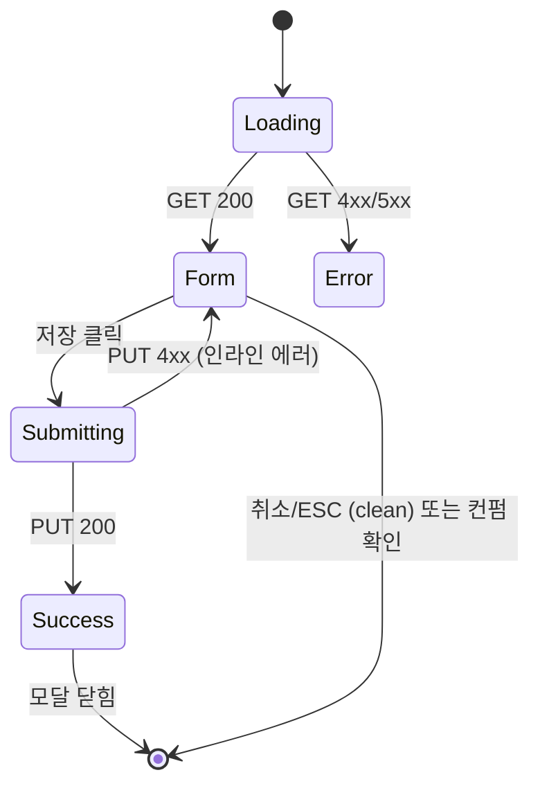

# DLG-P010 카탈로그 설정 — 기본화면 (마스터)

> 이 문서는 **다이얼로그 마스터 스펙**입니다. `01~03` 상태 문서는 이 문서를 상속(override/delta)합니다.
> ⚙️ **센터 카탈로그 글로벌 설정**: 제목/설명/로고/테마 색상/결제/문의 전화번호 등. owner 이상만 편집 가능.
> 부모 화면은 `SCR-P005 상품 카탈로그(/catalog)`.

---

## 0. 메타 & 원천 참조

| 항목 | 값 |
|------|----|
| 다이얼로그 ID | DLG-P010 |
| 다이얼로그명 | 카탈로그 설정 |
| 도메인 | D05-상품관리 |
| 부모 화면 | SCR-P005 상품 카탈로그 (`/catalog`) |
| 트리거 | PageHeader "카탈로그 설정" 버튼 클릭 |
| 확인 레벨 | L1 (폼 저장) |
| 서버 호출 | ✅ `GET/PUT /catalog/settings` |
| 닫기 옵션 | X · 취소 · ESC · 배경 클릭 (dirty 상태 이탈 시 컨펌) |
| 역할 | superAdmin, primary, owner, manager (편집) / 나머지 비노출 |
| 파일 경로 | `src/components/dialogs/CatalogSettingsDialog.tsx` |
| 우선순위 | P1 |

### 원천 문서 링크
| 문서 | 경로 | 섹션 |
|---|---|---|
| 상품관리 화면설계서 | `docs/화면설계서/상품관리.md` | §DLG-P010 카탈로그 설정 |
| 상품관리 기능명세서 | `docs/기능명세서/상품관리.md` | 카탈로그 부록 |
| 에러코드정의서 | `docs/에러코드정의서.md` | §4.1 공통, §4.4 상품 |
| 다이어그램 M1 | `docs/다이어그램/D05_상품관리/DLG/DLG-P010_카탈로그설정/M1_모달생명주기.md` | — |
| 다이어그램 M2 | `docs/다이어그램/D05_상품관리/DLG/DLG-P010_카탈로그설정/M2_필드검증.md` | — |
| 다이어그램 M3 | `docs/다이어그램/D05_상품관리/DLG/DLG-P010_카탈로그설정/M3_결과분기.md` | — |
| 권한 매트릭스 | `docs/다이어그램/10_권한매트릭스/R1_역할화면_매트릭스.md` | SCR-P005 |

---

## 1. 다이얼로그 목적 (Why)

- 회원 앱/키오스크/공개 카탈로그 페이지의 **지점 브랜딩 설정**을 일괄 관리한다.
- 로고/테마색/문의 전화 등 고객 접점 메타 정보를 중앙화하여 일관된 체험 제공.
- 가격 표시 on/off, 온라인 결제 링크 노출 등 **영업 정책 토글** 제공.

---

## 2. 화면 레이아웃 (Wireframe)

```
  ┌────────────────────────────────────────────────────┐
  │  ⚙  카탈로그 설정                              [×] │  ← Header 56px
  ├────────────────────────────────────────────────────┤
  │                                                    │
  │  카탈로그 제목          [상품 안내            ]    │
  │  카탈로그 설명          [                    ]    │
  │                         [                    ]    │
  │                                                    │
  │  센터 로고              [📷 업로드] 160×60 권장    │
  │  (프리뷰 썸네일)                                   │
  │                                                    │
  │  테마 색상              [🎨 #4F46E5    ]          │
  │                                                    │
  │  가격 표시              [●○] ON                    │
  │  온라인 결제 링크       [○●] OFF                   │
  │  문의 전화번호          [02-1234-5678 ]           │
  │                                                    │
  ├────────────────────────────────────────────────────┤
  │                              [취소]    [저장]      │  ← Footer 56px
  └────────────────────────────────────────────────────┘
```

### 영역 치수표

| 영역 | 위치 | 치수 | 역할 |
|---|---|---|---|
| Backdrop | 전역 | `fixed inset-0 z-50 bg-black/50 backdrop-blur-sm` | 배경 |
| Modal | 중앙 | `max-w-[480px] w-[calc(100%-32px)] max-h-[90vh]` | 카드 |
| Header | 상단 | 56px h | 타이틀 + X |
| Body | 본문 | auto, `overflow-y-auto` | 폼 필드 |
| Footer | 하단 | 56px h | 취소 + 저장 |

---

## 3. 디자인 토큰

### 3.1 색상
| 토큰 | 클래스 |
|---|---|
| card | `bg-white rounded-2xl shadow-2xl ring-1 ring-gray-100` |
| header.fg | `text-gray-900` |
| label | `text-sm font-medium text-gray-700` |
| input | `h-10 px-3 rounded-lg border border-gray-300 focus:border-blue-500 focus:ring-1 focus:ring-blue-500` |
| textarea | `min-h-[72px] px-3 py-2 rounded-lg border border-gray-300` |
| toggle.on | `bg-blue-600` |
| toggle.off | `bg-gray-200` |
| btn.primary | `bg-blue-600 hover:bg-blue-700 text-white` |
| btn.secondary | `border border-gray-300 text-gray-700 hover:bg-gray-50` |
| error.text | `text-xs text-red-600 mt-1` |
| upload.dropzone | `border-2 border-dashed border-gray-300 rounded-xl bg-gray-50` |

### 3.2 타이포
| 토큰 | 값 |
|---|---|
| title | `text-lg font-semibold tracking-tight` |
| label | `text-sm font-medium` |
| hint | `text-xs text-gray-500` |

### 3.3 간격/반경
| 토큰 | 값 |
|---|---|
| modal.radius | `rounded-2xl` |
| body.padding | `px-6 py-5` |
| field.gap | `space-y-4` |

### 3.4 모션
| 토큰 | 값 |
|---|---|
| modal.enter | `animate-[fadeInUp_160ms_ease-out]` |
| toggle.switch | `transition-transform duration-150` |
| motion.reduced | `motion-reduce:animate-none` |

---

## 4. 반응형 규칙

| BP | 폭 | 비고 |
|---|---|---|
| Mobile <640 | `w-[calc(100%-32px)]` | Body는 스크롤. Footer sticky |
| Tablet 640~1024 | `max-w-md` | 기본 |
| Desktop ≥1024 | `max-w-[480px]` | 기본 |

---

## 5. 🔐 역할별(RBAC) 매트릭스

| 요소 | superAdmin | primary | owner | manager | fc | trainer | staff | front | readonly |
|---|:---:|:---:|:---:|:---:|:---:|:---:|:---:|:---:|:---:|
| 버튼 노출 (부모 헤더) | ● | ● | ● | ● | — | — | — | — | — |
| 모달 오픈 | ● | ● | ● | ● | — | — | — | — | — |
| 제목/설명 편집 | ● | ● | ● | ● | — | — | — | — | — |
| 로고 업로드/삭제 | ● | ● | ● | ● | — | — | — | — | — |
| 테마 색상 변경 | ● | ● | ● | ● | — | — | — | — | — |
| 가격 표시 토글 | ● | ● | ● | ● | — | — | — | — | — |
| 온라인 결제 링크 토글 | ● | ● | ● | — | — | — | — | — | — |
| 문의 전화번호 편집 | ● | ● | ● | ● | — | — | — | — | — |
| 저장 실행 | ● | ● | ● | ● | — | — | — | — | — |

> **manager 제한**: 결제 링크 토글은 `owner` 이상만. manager UI에서는 비활성 `disabled` + 툴팁 "owner 이상의 권한이 필요합니다".

### 5.1 멀티테넌트
- owner/manager: `branchId = useBranchStore().currentBranchId` 강제.
- superAdmin/primary: 상단 지점 드롭다운으로 대상 지점 선택 후 저장.
- `catalog_settings` 테이블은 `branch_id` unique로 upsert (`ON CONFLICT (branch_id) DO UPDATE`).

---

## 6. 컴포넌트 트리

```tsx
<Dialog.Root open={open} onOpenChange={handleClose}>
  <Dialog.Overlay className="fixed inset-0 z-50 bg-black/50 backdrop-blur-sm" />
  <Dialog.Content
    role="dialog" aria-labelledby="catalog-settings-title"
    className="fixed left-1/2 top-1/2 -translate-x-1/2 -translate-y-1/2
               w-[min(calc(100%-32px),480px)] max-h-[90vh]
               bg-white rounded-2xl shadow-2xl ring-1 ring-gray-100
               flex flex-col overflow-hidden">
    <Header onClose={handleClose} />
    <form onSubmit={handleSubmit(onSave)} className="flex-1 overflow-y-auto px-6 py-5 space-y-4">
      <Field label="카탈로그 제목"><Input {...register('title')}/></Field>
      <Field label="카탈로그 설명"><Textarea {...register('description')}/></Field>
      <Field label="센터 로고"><LogoUploader value={logo} onChange={setLogo}/></Field>
      <Field label="테마 색상"><ColorPicker {...register('themeColor')}/></Field>
      <ToggleRow label="가격 표시" {...register('showPrice')}/>
      <ToggleRow label="온라인 결제 링크" disabled={!canEditPayment} {...register('enablePayment')}/>
      <Field label="문의 전화번호"><Input inputMode="tel" {...register('phone')}/></Field>
    </form>
    <Footer isDirty={isDirty} isSubmitting={mutation.isPending}
            onCancel={handleClose} onSave={handleSubmit(onSave)} />
  </Dialog.Content>
</Dialog.Root>
```

### 컴포넌트 명세
| 컴포넌트 | Props | 재사용 |
|---|---|---|
| `CatalogSettingsDialog` | `{ isOpen, onClose, initialBranchId? }` | D05 전용 |
| `LogoUploader` | `{ value, onChange, maxBytes=2_000_000 }` | 공용 |
| `ColorPicker` | `{ value, onChange }` | 공용 |
| `ToggleRow` | `{ label, checked, onChange, disabled? }` | 공용 |
| `Field` | `{ label, hint?, error? }` children | 공용 |

---

## 7. 데이터 계약

### 7.1 스키마 (Zod)
```ts
export const CatalogSettingsSchema = z.object({
  branchId: z.string().uuid(),
  title: z.string().max(40).default('상품 안내'),
  description: z.string().max(200).nullable(),
  logoUrl: z.string().url().nullable(),
  themeColor: z.string().regex(/^#[0-9a-fA-F]{6}$/).default('#4F46E5'),
  showPrice: z.boolean().default(true),
  enablePayment: z.boolean().default(false),
  phone: z.string().regex(/^[0-9\-+\s]+$/).max(20).nullable(),
});
export type CatalogSettings = z.infer<typeof CatalogSettingsSchema>;
```

### 7.2 API
| 메소드 | 엔드포인트 | 권한 | 설명 |
|---|---|---|---|
| GET | `/catalog/settings?branchId=...` | owner+ | 현재 설정 조회 |
| PUT | `/catalog/settings` | owner+ (결제 링크는 owner 이상) | upsert |
| POST | `/catalog/logo` (multipart) | owner+ | 로고 업로드 → url 반환 |

### 7.3 테이블 (Supabase `catalog_settings`)
```
branch_id        uuid PK
title            text not null default '상품 안내'
description      text
logo_url         text
theme_color      text default '#4F46E5'
show_price       boolean default true
enable_payment   boolean default false
phone            text
updated_at       timestamptz default now()
updated_by       uuid references users(id)
```

---

## 8. 비즈니스 룰

1. **upsert**: `branch_id`가 존재하면 UPDATE, 없으면 INSERT.
2. **로고 용량**: 2MB 초과 시 "이미지 크기가 2MB를 초과합니다." 에러.
3. **로고 포맷**: `image/jpeg|png|webp` 만 허용.
4. **테마 색상**: HEX 6자리. 대비 AA 미달 경고 (경고만, 저장 허용).
5. **결제 링크 토글**: owner 이상만 변경 가능. manager 접속 시 `disabled`.
6. **dirty 이탈**: form dirty 시 ESC/배경/X로 닫기 시 "변경사항이 저장되지 않습니다. 닫으시겠습니까?" 컨펌.
7. **저장 성공 후**: `catalog-preview`, `catalog-settings` 쿼리 invalidate.
8. **optimistic UI 금지**: 서버 200 OK 이후 상태 반영 (데이터 유실 방지).
9. **감사로그**: `AUDIT.CATALOG_SETTINGS_UPDATE` (변경 전/후 diff).
10. **멀티테넌트**: super가 다른 지점 설정 수정 시 `X-Branch-Id` 헤더 동봉 + 감사로그에 operator/target 기록.

---

## 9. 상태 목록

| 파일 | 상태 코드 | 한글 | 트리거 |
|---|---|---|---|
| `01-로딩.md` | `settings-loading` | 로딩 | 모달 오픈 직후 GET 요청 중 |
| `02-설정폼.md` | `settings-form` | 설정 폼 | 로드 완료, 입력/편집 중 (유효성 에러 포함) |
| `03-저장결과.md` | `settings-result` | 저장 결과 | PUT 요청 이후 (성공/실패) |

상태 전이: `01-로딩` → `02-설정폼` → (저장) → `03-저장결과` → (성공) Closed / (실패) `02-설정폼`

---

## 10. 에러 코드 매핑

| errorCode | HTTP | 시나리오 | 표시 |
|---|---|---|---|
| E400001 | 400 | 유효성 실패 (title 길이 등) | 인라인 에러 |
| E400302 | 400 | 로고 용량 초과(프론트 사전 검증) | 토스트 "이미지 크기가 2MB를 초과합니다." |
| E403001 | 403 | 권한 부족 (manager가 결제링크 변경 시도) | 토스트 + 필드 reset |
| E409001 | 409 | 동시편집 충돌 (updated_at 비교) | "다른 사용자가 먼저 수정했습니다. 다시 로드하세요." |
| E5xx001 | 500 | 서버 오류 | 토스트 "설정 저장에 실패했습니다." |

---

## 11. 접근성

| 항목 | 요구사항 |
|---|---|
| role/aria | `role="dialog"` + `aria-modal="true"` + `aria-labelledby` |
| 포커스 | 오픈 시 첫 입력 필드 오토포커스 |
| 포커스 트랩 | 모달 내 Tab 순환 |
| 키보드 | `Esc`=닫기(dirty 컨펌), `Ctrl+S`/`Cmd+S`=저장 |
| 에러 표시 | 필드 하단 `role="alert"` |
| 대비 | 입력 필드 4.5:1 |
| ColorPicker | 직접 HEX 입력 가능 (색 장애 접근성) |

---

## 12. 진입 / 이탈 연결

### 진입
- SCR-P005 PageHeader "카탈로그 설정" 클릭
- DLG-P009 공개상품없음 상태에서 "카탈로그 설정" 클릭 (owner+)

### 이탈
| 액션 | 목적지 |
|---|---|
| 저장 성공 | Closed + 토스트 "카탈로그 설정이 저장되었습니다." |
| 취소/ESC/X (clean) | Closed |
| 취소/ESC/X (dirty) | 컨펌 → 확인 → Closed / 취소 → 유지 |

---

## 13. 다이어그램 통합 뷰



참조: `docs/다이어그램/D05_상품관리/DLG/DLG-P010_카탈로그설정/M1_모달생명주기.md`

---

## 14. 🧩 바이브코딩 프롬프트 (마스터)

```
Next.js 15 + TS + Tailwind + Radix Dialog + react-hook-form + zod + TanStack Query + Supabase

━━ 다이얼로그: DLG-P010 카탈로그 설정 ━━
파일:
  src/components/dialogs/CatalogSettingsDialog.tsx
  src/api/endpoints/catalogSettings.ts
  src/api/hooks/useCatalogSettings.ts
  src/lib/schemas/catalogSettings.ts

━━ Schema ━━
import { z } from 'zod';
export const CatalogSettingsSchema = z.object({
  branchId: z.string().uuid(),
  title: z.string().min(1, '제목은 필수입니다').max(40, '최대 40자'),
  description: z.string().max(200, '최대 200자').nullable().optional(),
  logoUrl: z.string().url().nullable().optional(),
  themeColor: z.string().regex(/^#[0-9a-fA-F]{6}$/, 'HEX 6자리'),
  showPrice: z.boolean(),
  enablePayment: z.boolean(),
  phone: z.string().max(20).regex(/^[0-9\-+\s]+$/, '숫자/- 만').nullable().optional(),
});
export type CatalogSettings = z.infer<typeof CatalogSettingsSchema>;

━━ Hook ━━
export function useCatalogSettings(branchId: string | null, isOpen: boolean) {
  return useQuery({
    queryKey: ['catalog-settings', branchId],
    queryFn: () => api.get('/catalog/settings', { params: { branchId }}).then(r => CatalogSettingsSchema.parse(r.data)),
    enabled: isOpen && Boolean(branchId),
  });
}
export function useUpdateCatalogSettings() {
  const qc = useQueryClient();
  return useMutation({
    mutationFn: (payload: CatalogSettings) => api.put('/catalog/settings', payload),
    onSuccess: (_, v) => {
      qc.invalidateQueries({ queryKey: ['catalog-settings', v.branchId] });
      qc.invalidateQueries({ queryKey: ['catalog-preview', v.branchId] });
      toast.success('카탈로그 설정이 저장되었습니다.');
    },
    onError: (e: any) => {
      const code = e?.response?.data?.errorCode;
      if (code === 'E409001') toast.error('다른 사용자가 먼저 수정했습니다. 다시 로드하세요.');
      else if (code === 'E403001') toast.error('이 설정을 변경할 권한이 없습니다.');
      else toast.error('설정 저장에 실패했습니다.');
    },
  });
}

━━ Dialog ━━
'use client';
import * as Dialog from '@radix-ui/react-dialog';
import { useForm } from 'react-hook-form';
import { zodResolver } from '@hookform/resolvers/zod';
import { X, Upload } from 'lucide-react';
import { useCatalogSettings, useUpdateCatalogSettings } from '@/api/hooks/useCatalogSettings';
import { useAuthStore } from '@/stores/authStore';
import { useBranchStore } from '@/stores/branchStore';

export default function CatalogSettingsDialog({ isOpen, onClose, initialBranchId }: Props) {
  const role = useAuthStore(s => s.user?.role);
  const defaultBranch = useBranchStore(s => s.currentBranchId);
  const branchId = initialBranchId ?? defaultBranch;
  const canEditPayment = role === 'superAdmin' || role === 'primary' || role === 'owner';

  const { data, isPending } = useCatalogSettings(branchId, isOpen);
  const mutation = useUpdateCatalogSettings();

  const { register, handleSubmit, formState: { errors, isDirty }, reset, watch, setValue } =
    useForm<CatalogSettings>({ resolver: zodResolver(CatalogSettingsSchema) });

  useEffect(() => { if (data) reset(data); }, [data, reset]);

  const onSave = handleSubmit(async (v) => { await mutation.mutateAsync(v); onClose(); });
  const tryClose = () => {
    if (isDirty && !confirm('변경사항이 저장되지 않습니다. 닫으시겠습니까?')) return;
    onClose();
  };

  return (
    <Dialog.Root open={isOpen} onOpenChange={(o) => !o && tryClose()}>
      <Dialog.Portal>
        <Dialog.Overlay className="fixed inset-0 z-50 bg-black/50 backdrop-blur-sm" />
        <Dialog.Content
          className="fixed left-1/2 top-1/2 z-50 -translate-x-1/2 -translate-y-1/2
                     w-[min(calc(100%-32px),480px)] max-h-[90vh]
                     bg-white rounded-2xl shadow-2xl ring-1 ring-gray-100
                     flex flex-col overflow-hidden">
          <header className="h-14 px-6 flex items-center justify-between border-b border-gray-100">
            <Dialog.Title className="text-lg font-semibold text-gray-900">카탈로그 설정</Dialog.Title>
            <button onClick={tryClose} aria-label="닫기"
              className="h-9 w-9 grid place-items-center rounded-lg hover:bg-gray-100">
              <X className="size-4" />
            </button>
          </header>

          <form onSubmit={onSave} className="flex-1 overflow-y-auto px-6 py-5 space-y-4">
            <Field label="카탈로그 제목" error={errors.title?.message}>
              <input {...register('title')} autoFocus placeholder="상품 안내"
                className="w-full h-10 px-3 rounded-lg border border-gray-300
                           focus:border-blue-500 focus:ring-1 focus:ring-blue-500 outline-none" />
            </Field>
            <Field label="카탈로그 설명" error={errors.description?.message}>
              <textarea {...register('description')} rows={3}
                className="w-full px-3 py-2 rounded-lg border border-gray-300
                           focus:border-blue-500 focus:ring-1 focus:ring-blue-500 outline-none" />
            </Field>
            <Field label="센터 로고" hint="160×60 권장 · 2MB 이하 (jpg/png/webp)">
              <LogoUploader value={watch('logoUrl')} onChange={(url) => setValue('logoUrl', url, { shouldDirty: true })} />
            </Field>
            <Field label="테마 색상" error={errors.themeColor?.message}>
              <div className="flex items-center gap-2">
                <input type="color" {...register('themeColor')}
                  className="h-10 w-14 rounded-lg border border-gray-300" />
                <input {...register('themeColor')}
                  className="flex-1 h-10 px-3 rounded-lg border border-gray-300 font-mono
                             focus:border-blue-500 focus:ring-1 focus:ring-blue-500 outline-none" />
              </div>
            </Field>
            <ToggleRow label="가격 표시" {...register('showPrice')} />
            <ToggleRow label="온라인 결제 링크" {...register('enablePayment')}
              disabled={!canEditPayment}
              hint={!canEditPayment ? 'owner 이상의 권한이 필요합니다' : undefined} />
            <Field label="문의 전화번호" error={errors.phone?.message}>
              <input inputMode="tel" {...register('phone')} placeholder="02-1234-5678"
                className="w-full h-10 px-3 rounded-lg border border-gray-300
                           focus:border-blue-500 focus:ring-1 focus:ring-blue-500 outline-none" />
            </Field>
          </form>

          <footer className="h-14 px-6 flex items-center justify-end gap-2 border-t border-gray-100">
            <button onClick={tryClose}
              className="h-10 px-4 rounded-lg border border-gray-300 text-gray-700 text-sm font-medium hover:bg-gray-50">
              취소
            </button>
            <button onClick={onSave} disabled={!isDirty || mutation.isPending}
              className="h-10 px-5 rounded-lg bg-blue-600 hover:bg-blue-700 disabled:bg-blue-300
                         text-white text-sm font-medium
                         focus:outline-none focus:ring-2 focus:ring-offset-2 focus:ring-blue-500">
              {mutation.isPending ? '저장 중…' : '저장'}
            </button>
          </footer>
        </Dialog.Content>
      </Dialog.Portal>
    </Dialog.Root>
  );
}

━━ LogoUploader ━━
function LogoUploader({ value, onChange }: { value?: string | null; onChange: (url: string | null) => void }) {
  const [uploading, setUploading] = useState(false);
  const onFile = async (f: File) => {
    if (f.size > 2_000_000) { toast.error('이미지 크기가 2MB를 초과합니다.'); return; }
    if (!['image/jpeg','image/png','image/webp'].includes(f.type)) {
      toast.error('jpg/png/webp만 업로드할 수 있습니다.'); return;
    }
    setUploading(true);
    try {
      const form = new FormData(); form.append('file', f);
      const { data } = await api.post('/catalog/logo', form, { headers: { 'Content-Type': 'multipart/form-data' }});
      onChange(data.url);
    } finally { setUploading(false); }
  };
  return (
    <div className="flex items-center gap-3">
      {value && }
      <label className="inline-flex items-center gap-2 h-10 px-3 rounded-lg border border-gray-300 hover:bg-gray-50 cursor-pointer text-sm">
        <Upload className="size-4" /> {uploading ? '업로드 중…' : '업로드'}
        <input type="file" accept="image/jpeg,image/png,image/webp" className="hidden"
               onChange={(e) => e.target.files?.[0] && onFile(e.target.files[0])} />
      </label>
      {value && <button type="button" onClick={() => onChange(null)}
        className="text-xs text-red-600 underline">삭제</button>}
    </div>
  );
}

━━ 디자인 토큰 (정확히) ━━
input:      h-10 px-3 rounded-lg border border-gray-300 focus:border-blue-500 focus:ring-1 focus:ring-blue-500
textarea:   px-3 py-2 rounded-lg border border-gray-300
toggle.on:  bg-blue-600; toggle.off: bg-gray-200
btn.primary:h-10 px-5 rounded-lg bg-blue-600 hover:bg-blue-700 text-white text-sm font-medium
btn.sec:    h-10 px-4 rounded-lg border border-gray-300 hover:bg-gray-50
error:      text-xs text-red-600 mt-1
hint:       text-xs text-gray-500 mt-1

━━ QA ━━
- owner/manager만 버튼 노출
- manager는 결제링크 토글 disabled
- dirty 상태에서 ESC/배경 → 컨펌 프롬프트
- 저장 성공 시 catalog-preview/catalog-settings invalidate
- 409 충돌 → "다시 로드" 메시지
- 로고 2MB 초과/잘못된 포맷 → 프론트 사전 검증
- Ctrl/Cmd+S 저장 단축키
```

---

## 15. QA 체크리스트

- [ ] 역할 매트릭스: manager 결제 토글 비활성, trainer 버튼 비노출
- [ ] dirty 상태 이탈 시 컨펌 다이얼로그
- [ ] 로고 업로드 2MB 초과 에러
- [ ] 로고 jpg/png/webp 외 거부
- [ ] Color Picker + HEX 입력 상호 동기화
- [ ] HEX 유효성 (#4F46E5 패턴) 검증
- [ ] 저장 성공 → 토스트 + catalog-preview 무효화
- [ ] 저장 실패(E409001) → "다시 로드" 문구
- [ ] GET 실패 → 로딩 대신 에러 UI (04-에러 스테이트 혹은 토스트)
- [ ] Ctrl/Cmd+S 작동
- [ ] 포커스 트랩 + Tab 순환
- [ ] aria-label 모든 버튼 적용
- [ ] 모바일 360px 레이아웃 유지
