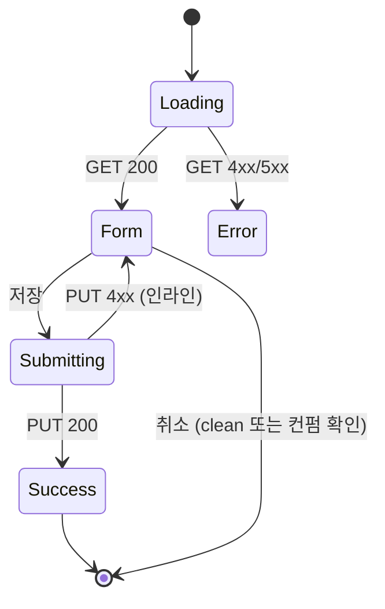

# DLG-P011 카탈로그 편집 — 기본화면 (마스터)

> 이 문서는 **다이얼로그 마스터 스펙**입니다. `01~03` 상태 문서는 이 문서를 상속(override/delta)합니다.
> 📝 **상품별 카탈로그 콘텐츠 편집**: 이미지/제목/한줄설명/상세설명/혜택/추천대상/공개 토글.
> 부모 화면은 `SCR-P005 상품 카탈로그(/catalog)` 카드 그리드.

---

## 0. 메타 & 원천 참조

| 항목 | 값 |
|------|----|
| 다이얼로그 ID | DLG-P011 |
| 다이얼로그명 | 카탈로그 편집 |
| 도메인 | D05-상품관리 |
| 부모 화면 | SCR-P005 상품 카탈로그 (`/catalog`) |
| 트리거 | 카드 "편집" 버튼 클릭 (product_catalog.product_id 전달) |
| 확인 레벨 | L1 (폼 저장) |
| 서버 호출 | ✅ `GET /catalog/:productId`, `PUT /catalog/:productId`, `POST /catalog/:productId/images` |
| 닫기 옵션 | X · 취소 · ESC · 배경 클릭 (dirty 컨펌) |
| 역할 | superAdmin, primary, owner, manager (편집) / 기타 readonly |
| 파일 경로 | `src/components/dialogs/CatalogEditDialog.tsx` |
| 우선순위 | P1 |

### 원천 문서 링크
| 문서 | 경로 | 섹션 |
|---|---|---|
| 상품관리 화면설계서 | `docs/화면설계서/상품관리.md` | §DLG-P011 카탈로그 편집 |
| 상품관리 기능명세서 | `docs/기능명세서/상품관리.md` | 카탈로그 부록 |
| 에러코드정의서 | `docs/에러코드정의서.md` | §4.1, §4.4 |
| 다이어그램 M1 | `docs/다이어그램/D05_상품관리/DLG/DLG-P011_카탈로그편집/M1_모달생명주기.md` | — |
| 다이어그램 M2 | `docs/다이어그램/D05_상품관리/DLG/DLG-P011_카탈로그편집/M2_필드검증.md` | — |
| 다이어그램 M3 | `docs/다이어그램/D05_상품관리/DLG/DLG-P011_카탈로그편집/M3_결과분기.md` | — |

---

## 1. 다이얼로그 목적 (Why)

- 상품의 CRM 기본 정보와 별도로, **고객 노출용 콘텐츠(이미지/카피/혜택)**을 편집한다.
- 카탈로그 카드에서 즉시 접근하여 빠르게 이미지/설명을 갱신.
- 공개/비공개 토글과 `catalogOrder`는 카드 드래그에서, 콘텐츠는 본 모달에서 담당.

---

## 2. 화면 레이아웃 (Wireframe)

```
  ┌──────────────────────────────────────────────────────────┐
  │  📝 카탈로그 편집 · "PT 12주 패키지"                 [×] │  ← Header 56px
  ├──────────────────────────────────────────────────────────┤
  │                                                          │
  │  대표 이미지 (최대 3장)                                   │
  │   ┌──┐ ┌──┐ ┌──┐                                         │
  │   │🖼│ │🖼│ │+ │   1:1 권장 · 각 2MB                    │
  │   └──┘ └──┘ └──┘                                         │
  │                                                          │
  │  카탈로그 제목            [PT 12주 패키지        ]       │
  │  한줄 설명                [3개월 집중 PT      100/100 ]  │
  │  상세 설명 (리치텍스트)                                    │
  │   ┌────────────────────────────────────────────────┐    │
  │   │ [B][I][U] [H2] [•] [1.]                        │    │
  │   │ 상품의 자세한 설명을 입력하세요.                │    │
  │   └────────────────────────────────────────────────┘    │
  │  혜택/특전                                                │
  │   [  12주 집중관리        ×] [+ 추가]                    │
  │   [  체성분 분석 4회 포함 ×]                             │
  │  추천 대상                [예: 다이어트 초보자   ]       │
  │                                                          │
  │  카탈로그 공개            [●○] ON                         │
  │                                                          │
  ├──────────────────────────────────────────────────────────┤
  │  ℹ 저장 시 회원 앱에 즉시 반영됩니다.   [취소]  [저장]    │  ← Footer 56px
  └──────────────────────────────────────────────────────────┘
```

### 영역 치수표

| 영역 | 치수 | 역할 |
|---|---|---|
| Modal | `max-w-[560px] w-[calc(100%-32px)] max-h-[90vh]` | 카드 |
| Header | 56px | 타이틀 (상품명 포함) + X |
| Body | auto, scroll | 폼 필드 (섹션 구분) |
| Footer | 56px | 힌트 + 취소 + 저장 |

---

## 3. 디자인 토큰

### 3.1 색상
| 토큰 | 클래스 |
|---|---|
| card | `bg-white rounded-2xl shadow-2xl ring-1 ring-gray-100` |
| image.tile | `rounded-xl ring-1 ring-gray-200 aspect-square` |
| image.add | `border-2 border-dashed border-gray-300 bg-gray-50 text-gray-400` |
| image.remove | `bg-black/60 text-white` (hover 노출) |
| input | `h-10 px-3 rounded-lg border border-gray-300` |
| chip | `h-8 px-3 rounded-full bg-gray-100 text-gray-700 text-sm` |
| chip.remove | `text-gray-400 hover:text-red-500` |
| toggle.on | `bg-blue-600`; off: `bg-gray-200` |
| counter.ok | `text-gray-400`; over: `text-red-500` |

### 3.2 타이포
| 토큰 | 값 |
|---|---|
| title | `text-lg font-semibold tracking-tight` |
| section.label | `text-sm font-medium text-gray-700` |
| hint | `text-xs text-gray-500` |

### 3.3 간격
| 토큰 | 값 |
|---|---|
| body.padding | `px-6 py-5` |
| section.gap | `space-y-5` |
| image.grid | `grid grid-cols-3 gap-3` |

---

## 4. 반응형 규칙

| BP | 폭 | 이미지 그리드 |
|---|---|---|
| Mobile <640 | `w-[calc(100%-24px)]` | 3열 유지 (아이템 w 축소) |
| Tablet 640~1024 | `max-w-lg` | 3열 |
| Desktop ≥1024 | `max-w-[560px]` | 3열 |

---

## 5. 🔐 역할별(RBAC) 매트릭스

| 요소 | superAdmin | primary | owner | manager | fc | trainer | staff | front | readonly |
|---|:---:|:---:|:---:|:---:|:---:|:---:|:---:|:---:|:---:|
| 카드 "편집" 버튼 노출 | ● | ● | ● | ● | — | — | — | — | — |
| 모달 오픈 | ● | ● | ● | ● | — | — | — | — | — |
| 이미지 업로드/삭제 | ● | ● | ● | ● | — | — | — | — | — |
| 제목/설명/혜택 편집 | ● | ● | ● | ● | — | — | — | — | — |
| 공개 토글 | ● | ● | ● | ● | — | — | — | — | — |
| 저장 실행 | ● | ● | ● | ● | — | — | — | — | — |
| 본사 상품(brandProductId) 편집 | ● | ● | ○ | ○ | — | — | — | — | — |

> **본사 배포 상품**: `brandProductId` 존재 시 owner/manager는 "본사 상품 — 콘텐츠 편집만 가능"(가격·명칭 잠금) 배너 노출.

### 5.1 멀티테넌트
- owner/manager: 본인 지점 상품만 편집 (`branchId` 강제 필터).
- super/primary: 지점 선택 드롭다운 (부모 헤더에서 승계).

---

## 6. 컴포넌트 트리

```tsx
<Dialog.Root open={open} onOpenChange={tryClose}>
  <Dialog.Overlay ... />
  <Dialog.Content>
    <Header productName={product.name} onClose={tryClose} />
    <form className="flex-1 overflow-y-auto px-6 py-5 space-y-5" onSubmit={handleSubmit(onSave)}>
      <ImageUploader value={images} onChange={setImages} max={3} />
      <Field label="카탈로그 제목"><Input {...register('catalogTitle')}/></Field>
      <Field label="한줄 설명" hint={`${watch('oneLine')?.length ?? 0}/100`}>
        <Input {...register('oneLine', { maxLength: 100 })}/>
      </Field>
      <Field label="상세 설명"><RichTextEditor value={detail} onChange={setDetail} /></Field>
      <BenefitChipList value={benefits} onChange={setBenefits} />
      <Field label="추천 대상"><Input {...register('recommendFor')}/></Field>
      <ToggleRow label="카탈로그 공개" {...register('catalogVisible')} />
    </form>
    <Footer onCancel={tryClose} onSave={handleSubmit(onSave)} isDirty={isDirty} pending={mutation.isPending} />
  </Dialog.Content>
</Dialog.Root>
```

### 컴포넌트 명세
| 컴포넌트 | Props | 재사용 |
|---|---|---|
| `CatalogEditDialog` | `{ productId, isOpen, onClose }` | D05 전용 |
| `ImageUploader` | `{ value: string[], onChange, max }` | 공용 |
| `RichTextEditor` | `{ value, onChange }` (Tiptap) | 공용 |
| `BenefitChipList` | `{ value: string[], onChange }` | D05 전용 |
| `ToggleRow` | `{ label, checked, onChange }` | 공용 |

---

## 7. 데이터 계약

### 7.1 스키마 (Zod)
```ts
export const CatalogEditSchema = z.object({
  productId: z.string().uuid(),
  images: z.array(z.string().url()).max(3),
  catalogTitle: z.string().min(1, '제목은 필수').max(40),
  oneLine: z.string().max(100).nullable(),
  detailHtml: z.string().max(10_000).nullable(),
  benefits: z.array(z.string().max(30)).max(10),
  recommendFor: z.string().max(60).nullable(),
  catalogVisible: z.boolean(),
});
export type CatalogEdit = z.infer<typeof CatalogEditSchema>;
```

### 7.2 API
| 메소드 | 엔드포인트 | 설명 |
|---|---|---|
| GET | `/catalog/:productId` | 상품 카탈로그 단건 |
| PUT | `/catalog/:productId` | 업데이트 |
| POST | `/catalog/:productId/images` (multipart) | 이미지 업로드 → URL 배열 추가 |
| DELETE | `/catalog/:productId/images/:imageId` | 이미지 삭제 |

### 7.3 테이블 (`product_catalog`)
```
product_id        uuid PK (FK products)
branch_id         uuid
catalog_title     text
one_line          text
detail_html       text
images            jsonb[]   -- [{ id, url, order }]
benefits          text[]
recommend_for     text
catalog_visible   boolean default true
catalog_order     int
updated_at        timestamptz
```

---

## 8. 비즈니스 룰

1. **이미지 최대 3장**: 4번째 업로드 시도 시 툴팁 "최대 3장까지 가능합니다." 또는 첫 번째 이미지 대체 모드.
2. **이미지 용량**: 각 2MB 이하, jpg/png/webp. 초과 시 에러.
3. **드래그 정렬**: 이미지 드래그로 순서 변경 (첫 번째 = 대표).
4. **한줄 설명 100자**: 실시간 카운터, 초과 시 red + 저장 blocked.
5. **상세 설명 리치텍스트**: Bold/Italic/Underline/H2/List만 허용. 이미지 삽입은 대표 이미지 업로더 사용.
6. **혜택 chip**: 30자 이하, 최대 10개. Enter 또는 `,` 로 추가.
7. **공개 토글 저장**: true ↔ false 변경 시 `catalog-preview` 쿼리 invalidate.
8. **본사 배포 상품 보호**: `brandProductId` 존재 시 `catalogTitle`은 읽기전용 (brand title 보존).
9. **dirty 이탈**: ESC/배경/X 누르면 컨펌.
10. **감사로그**: `AUDIT.CATALOG_ITEM_UPDATE` (productId, diff, actor).

---

## 9. 상태 목록

| 파일 | 상태 코드 | 한글 | 트리거 |
|---|---|---|---|
| `01-로딩.md` | `edit-loading` | 로딩 | 오픈 직후 GET |
| `02-편집폼.md` | `edit-form` | 편집 폼 | 데이터 로드 완료, 편집 중 (유효성 포함) |
| `03-저장결과.md` | `edit-result` | 저장 결과 | PUT 응답 후 |

상태 전이: `01-로딩` → `02-편집폼` → `03-저장결과` → (성공) Closed / (실패) `02-편집폼`

---

## 10. 에러 코드 매핑

| errorCode | HTTP | 시나리오 | 표시 |
|---|---|---|---|
| E400001 | 400 | 한줄 설명 100자 초과 | 인라인 에러 |
| E400302 | 400 | 이미지 용량 초과 | 토스트 |
| E404301 | 404 | 상품 없음 | 토스트 "상품을 찾을 수 없습니다." + 닫기 |
| E403001 | 403 | 본사 상품 차단 필드 편집 시도 | 인라인 에러 |
| E409001 | 409 | 동시 편집 충돌 | "다른 사용자가 먼저 수정했습니다." |
| E5xx001 | 500 | 서버 오류 | 토스트 |

---

## 11. 접근성

| 항목 | 요구사항 |
|---|---|
| role/aria | `role="dialog"` + `aria-modal="true"` + `aria-labelledby` |
| 포커스 | 제목 input 오토포커스 |
| 이미지 업로더 | 키보드 업로드 (Space/Enter), 이미지별 삭제 버튼 `aria-label="이미지 N 삭제"` |
| 리치텍스트 | 각 툴바 버튼 `aria-label`, `aria-pressed` |
| 카운터 | `aria-live="polite"` 변경 시 SR 공지 |
| 포커스 트랩 | Tab 순환 |

---

## 12. 진입 / 이탈 연결

### 진입
- SCR-P005 카드 "편집" 버튼 (manager 이상)
- 키보드 단축키 `E` (카드 선택 후, manager+)

### 이탈
| 액션 | 목적지 |
|---|---|
| 저장 성공 | Closed + 토스트 "카탈로그 정보가 저장되었습니다." |
| 취소/ESC/X (clean) | Closed |
| 취소/ESC/X (dirty) | 컨펌 → 확인/취소 |

---

## 13. 다이어그램 통합 뷰



---

## 14. 🧩 바이브코딩 프롬프트 (마스터)

```
Next.js 15 + TS + Tailwind + Radix Dialog + RHF + Zod + TanStack Query + Tiptap + Supabase

━━ 다이얼로그: DLG-P011 카탈로그 편집 ━━
파일:
  src/components/dialogs/CatalogEditDialog.tsx
  src/components/catalog/ImageUploader.tsx
  src/components/catalog/RichTextEditor.tsx
  src/components/catalog/BenefitChipList.tsx
  src/api/endpoints/catalogItem.ts
  src/lib/schemas/catalogEdit.ts

━━ Schema ━━
import { z } from 'zod';
export const CatalogEditSchema = z.object({
  productId: z.string().uuid(),
  images: z.array(z.string().url()).max(3, '최대 3장'),
  catalogTitle: z.string().min(1, '제목은 필수').max(40, '최대 40자'),
  oneLine: z.string().max(100, '최대 100자').nullable().optional(),
  detailHtml: z.string().max(10_000).nullable().optional(),
  benefits: z.array(z.string().max(30)).max(10, '최대 10개'),
  recommendFor: z.string().max(60).nullable().optional(),
  catalogVisible: z.boolean(),
});
export type CatalogEdit = z.infer<typeof CatalogEditSchema>;

━━ Hooks ━━
export const useCatalogItem = (productId: string, isOpen: boolean) => useQuery({
  queryKey: ['catalog-item', productId],
  queryFn: () => api.get(`/catalog/${productId}`).then(r => CatalogEditSchema.parse(r.data)),
  enabled: isOpen && Boolean(productId),
});

export const useUpdateCatalogItem = (productId: string, branchId?: string) => {
  const qc = useQueryClient();
  return useMutation({
    mutationFn: (v: CatalogEdit) => api.put(`/catalog/${productId}`, v),
    onSuccess: () => {
      qc.invalidateQueries({ queryKey: ['catalog-items', branchId] });
      qc.invalidateQueries({ queryKey: ['catalog-item', productId] });
      qc.invalidateQueries({ queryKey: ['catalog-preview', branchId] });
      toast.success('카탈로그 정보가 저장되었습니다.');
    },
    onError: (e: any) => {
      const code = e?.response?.data?.errorCode;
      if (code === 'E409001') toast.error('다른 사용자가 먼저 수정했습니다.');
      else if (code === 'E404301') toast.error('상품을 찾을 수 없습니다.');
      else toast.error('저장에 실패했습니다.');
    },
  });
};

━━ Dialog ━━
'use client';
import * as Dialog from '@radix-ui/react-dialog';
import { useForm, Controller } from 'react-hook-form';
import { zodResolver } from '@hookform/resolvers/zod';
import { X, Info } from 'lucide-react';

export default function CatalogEditDialog({ productId, isOpen, onClose }: Props) {
  const { data, isPending } = useCatalogItem(productId, isOpen);
  const product = data;
  const mutation = useUpdateCatalogItem(productId, product?.branchId);
  const { register, handleSubmit, control, watch, formState: { errors, isDirty } } =
    useForm<CatalogEdit>({ resolver: zodResolver(CatalogEditSchema), defaultValues: data });

  const onSave = handleSubmit((v) => mutation.mutateAsync(v).then(() => onClose()));
  const tryClose = () => {
    if (isDirty && !confirm('변경사항이 저장되지 않습니다. 닫으시겠습니까?')) return;
    onClose();
  };
  const oneLineLen = watch('oneLine')?.length ?? 0;

  return (
    <Dialog.Root open={isOpen} onOpenChange={(o) => !o && tryClose()}>
      <Dialog.Portal>
        <Dialog.Overlay className="fixed inset-0 z-50 bg-black/50 backdrop-blur-sm" />
        <Dialog.Content className="fixed left-1/2 top-1/2 z-50 -translate-x-1/2 -translate-y-1/2
                     w-[min(calc(100%-24px),560px)] max-h-[90vh]
                     bg-white rounded-2xl shadow-2xl ring-1 ring-gray-100
                     flex flex-col overflow-hidden">
          <header className="h-14 px-6 flex items-center justify-between border-b border-gray-100">
            <Dialog.Title className="text-lg font-semibold text-gray-900 truncate">
              카탈로그 편집 · <span className="text-gray-500">{product?.productName}</span>
            </Dialog.Title>
            <button onClick={tryClose} aria-label="닫기" className="h-9 w-9 grid place-items-center rounded-lg hover:bg-gray-100">
              <X className="size-4" />
            </button>
          </header>

          <form onSubmit={onSave} className="flex-1 overflow-y-auto px-6 py-5 space-y-5">
            <Controller name="images" control={control}
              render={({ field }) => <ImageUploader value={field.value} onChange={field.onChange} max={3} />} />
            <Field label="카탈로그 제목" error={errors.catalogTitle?.message}>
              <input {...register('catalogTitle')} autoFocus
                className="w-full h-10 px-3 rounded-lg border border-gray-300 focus:border-blue-500 focus:ring-1 focus:ring-blue-500 outline-none" />
            </Field>
            <Field label="한줄 설명"
              hint={<span className={oneLineLen > 100 ? 'text-red-500' : 'text-gray-400'}>{oneLineLen}/100</span>}
              error={errors.oneLine?.message}>
              <input {...register('oneLine')} placeholder="상품의 핵심 특징을 한줄로 작성하세요"
                className="w-full h-10 px-3 rounded-lg border border-gray-300 focus:border-blue-500 focus:ring-1 focus:ring-blue-500 outline-none" />
            </Field>
            <Field label="상세 설명">
              <Controller name="detailHtml" control={control}
                render={({ field }) => <RichTextEditor value={field.value ?? ''} onChange={field.onChange} />} />
            </Field>
            <Field label="혜택/특전" hint="엔터 또는 쉼표로 추가">
              <Controller name="benefits" control={control}
                render={({ field }) => <BenefitChipList value={field.value} onChange={field.onChange} />} />
            </Field>
            <Field label="추천 대상" error={errors.recommendFor?.message}>
              <input {...register('recommendFor')} placeholder="예: 다이어트 초보자"
                className="w-full h-10 px-3 rounded-lg border border-gray-300 focus:border-blue-500 focus:ring-1 focus:ring-blue-500 outline-none" />
            </Field>
            <ToggleRow label="카탈로그 공개" {...register('catalogVisible')} />
          </form>

          <footer className="h-14 px-6 flex items-center justify-between border-t border-gray-100">
            <p className="text-xs text-gray-500 flex items-center gap-1"><Info className="size-3.5" /> 저장 시 회원 앱에 즉시 반영됩니다.</p>
            <div className="flex items-center gap-2">
              <button onClick={tryClose}
                className="h-10 px-4 rounded-lg border border-gray-300 text-gray-700 text-sm font-medium hover:bg-gray-50">
                취소
              </button>
              <button onClick={onSave} disabled={!isDirty || mutation.isPending}
                className="h-10 px-5 rounded-lg bg-blue-600 hover:bg-blue-700 disabled:bg-blue-300
                           text-white text-sm font-medium
                           focus:outline-none focus:ring-2 focus:ring-offset-2 focus:ring-blue-500">
                {mutation.isPending ? '저장 중…' : '저장'}
              </button>
            </div>
          </footer>
        </Dialog.Content>
      </Dialog.Portal>
    </Dialog.Root>
  );
}

━━ ImageUploader ━━
// value: string[]  (url array, order=index)
// onChange: new array
// 기능: 드래그 정렬, 썸네일, 업로드/삭제, 2MB 검증, jpg/png/webp

━━ BenefitChipList ━━
const [draft, setDraft] = useState('');
const add = (s: string) => {
  const v = s.trim(); if (!v || v.length > 30) return;
  if (value.length >= 10) { toast.warning('최대 10개'); return; }
  if (value.includes(v)) return;
  onChange([...value, v]); setDraft('');
};
return (
  <div className="flex flex-wrap gap-2 p-2 rounded-lg border border-gray-300 min-h-[44px]">
    {value.map((b, i) => (
      <span key={i} className="h-8 inline-flex items-center gap-1 px-3 rounded-full bg-gray-100 text-gray-700 text-sm">
        {b}
        <button type="button" onClick={() => onChange(value.filter((_, j) => j !== i))}
          aria-label={`${b} 삭제`} className="text-gray-400 hover:text-red-500">×</button>
      </span>
    ))}
    <input value={draft} onChange={(e) => setDraft(e.target.value)}
      onKeyDown={(e) => { if (['Enter',','].includes(e.key)) { e.preventDefault(); add(draft); }}}
      placeholder={value.length ? '' : '혜택 추가…'}
      className="flex-1 min-w-[120px] outline-none text-sm" />
  </div>
);

━━ 디자인 토큰 ━━
image.tile: rounded-xl ring-1 ring-gray-200 aspect-square
chip: h-8 px-3 rounded-full bg-gray-100 text-gray-700 text-sm
counter.over: text-red-500
hint.info: text-xs text-gray-500 with <Info size-3.5/>
toggle.on/off: bg-blue-600 / bg-gray-200

━━ QA ━━
- 이미지 3장 초과 방지
- 각 이미지 2MB 이하
- 드래그 정렬 (첫 번째 = 대표)
- 한줄설명 100자 초과 시 red + 저장 blocked
- benefits Enter/','로 추가, 10개 제한
- 본사상품은 catalogTitle 읽기전용
- 저장 후 catalog-preview/catalog-items 무효화
- dirty 상태 컨펌
```

---

## 15. QA 체크리스트

- [ ] 역할: manager 이상만 "편집" 버튼 노출
- [ ] 이미지 업로드 3장 초과 방지
- [ ] 이미지 각 2MB 초과 차단 + 토스트
- [ ] 드래그 정렬 → 첫 번째가 대표 이미지
- [ ] 한줄 설명 실시간 카운터 0~100 (100 초과 red)
- [ ] RichText Bold/Italic/H2/List만 허용
- [ ] 혜택 chip Enter/',' 추가, 10개 제한
- [ ] 본사 상품 `catalogTitle` readOnly 배너 노출
- [ ] 공개 토글 저장 시 catalog-preview invalidate
- [ ] 저장 성공 토스트
- [ ] dirty 상태 이탈 시 컨펌
- [ ] 동시편집 409 처리
- [ ] 포커스 트랩 + Tab 순환
