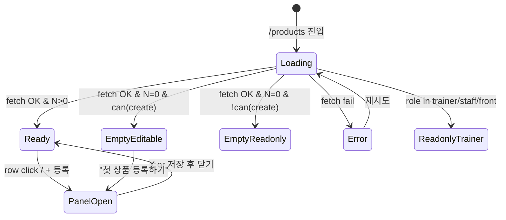

# SCR-P001 상품 관리 — 기본화면 (마스터)

> 이 문서는 **화면 마스터 스펙**입니다. `01~07` 상태 문서는 이 문서를 상속(override/delta)합니다.
> 🚨 **권한 경계**: 상품 등록/수정/삭제·전지점배포는 **owner 이상**만 가능(브랜드 규칙 D05 권한 매트릭스). manager 는 조회/필터만, trainer/staff/front/readonly 는 읽기 전용.
> 🚨 **멀티테넌트**: super/primary = 전 지점 또는 브랜드 하위 범위. owner 이하는 `branchId` 강제.

---

## 0. 메타 & 원천 참조

| 항목 | 값 |
|------|----|
| 화면 ID | SCR-P001 |
| 화면명 | 상품 관리 |
| 도메인 | D05-상품관리 |
| 경로 | `/products` |
| Next.js Route Group | `(dashboard)` |
| 파일 경로 | `src/app/products/page.tsx` |
| 페이지 컴포넌트 | `ProductList` |
| 역할 | `superAdmin/primary/owner`(●) · `manager`(조회·필터) · `fc/trainer/staff/front/readonly`(읽기) |
| 우선순위 | P0 (핵심 영업 자산) |
| 플랫폼 | 데스크톱(우선) / 태블릿 / 모바일 |
| 멀티테넌트 | ✅ `branchId` 강제 필터 |

### 원천 문서 링크
| 문서 | 경로 | 참조 |
|---|---|---|
| 화면설계서 | `docs/화면설계서/상품관리.md` | §SCR-P001 |
| 기능명세서 | `docs/기능명세서/상품관리.md` | §1 상품 목록 |
| 상태전이도 | `docs/상태전이도.md` | 상품: 판매중/판매중지/폐기 |
| 에러코드정의서 | `docs/에러코드정의서.md` | E500xxx, E403xxx |
| 권한 매트릭스 | `docs/다이어그램/10_권한매트릭스/R1_역할화면_매트릭스.md` | SCR-040 라인 |
| F1 진입 | `docs/다이어그램/D05_상품관리/SCR-P001_상품관리/F1_진입.md` | 권한 체크·초기 fetch |
| F2 메인 | `docs/다이어그램/D05_상품관리/SCR-P001_상품관리/F2_메인인터랙션.md` | 마스터-디테일 |
| F3 버튼액션 | `docs/다이어그램/D05_상품관리/SCR-P001_상품관리/F3_버튼액션.md` | 전지점배포·Excel·등록 |
| F4 필터 | `docs/다이어그램/D05_상품관리/SCR-P001_상품관리/F4_필터검색정렬.md` | 3단 필터 + 검색 |
| F5 모달트리거 | `docs/다이어그램/D05_상품관리/SCR-P001_상품관리/F5_모달트리거.md` | DLG-P001~P008 |
| F6 상태별 | `docs/다이어그램/D05_상품관리/SCR-P001_상품관리/F6_상태별화면.md` | 로딩·정상·빈·에러·패널 |
| F7 권한 | `docs/다이어그램/D05_상품관리/SCR-P001_상품관리/F7_권한RBAC.md` | 8역할 매트릭스 |
| F8 에러 | `docs/다이어그램/D05_상품관리/SCR-P001_상품관리/F8_에러예외복구.md` | 부분장애·네트워크 |
| F9 토스트 | `docs/다이어그램/D05_상품관리/SCR-P001_상품관리/F9_토스트피드백.md` | 저장·삭제·엑셀 토스트 |

---

## 1. 화면 목적 (Why)

센터가 판매하는 모든 상품(이용권·PT/GX 수강권·대여권·일반 상품)을 **마스터-디테일 레이아웃**으로 조회/관리하는 화면.
- 좌측 테이블 = 마스터, 우측 ProductDetailPanel = 상세/등록/수정 (SCR-P003).
- 3단 필터(타입 → 카테고리 → 종목) + 검색으로 대량 상품을 빠르게 탐색.
- 최상위 탭에서 **상품 목록** ↔ **분류 관리**(product_groups) 전환.
- 슈퍼관리자는 **전 지점 배포**, 브랜드 소유자는 **지점 간 복제**, 그 외 역할은 조회 중심.

---

## 2. 화면 레이아웃 (Wireframe)

### 2.1 풀뷰 와이어프레임 (데스크톱 1440px)

```
┌────────────────────────────────────────────────────────────────────────────┐
│ AppLayout                                                                   │
│ ┌Sidebar─┐ ┌Main──────────────────────────────────────────────────────────┐│
│ │        │ │ PageHeader: "상품 관리"                                        ││
│ │ 로고   │ │ "센터에서 판매하는 이용권, PT, GX 및 기타 상품을 관리합니다."  ││
│ │        │ │ actions: [목록|분류] [🌐전지점배포*] [+상품등록*] [Excel]       ││
│ │ 메뉴   │ ├──────────────────────────────────────────────────────────────┤│
│ │        │ │ StatCardGrid (4열)                                            ││
│ │        │ │ [전체 N] [활성 N] [비활성 N] [카테고리 N]                       ││
│ │        │ ├──────────────────────────────────────────────────────────────┤│
│ │        │ │ 타입 TabNav:  [전체(N)][회원권][수강권][대여권][일반]           ││
│ │        │ │ 분류 filter:  [전체][이용권(N)][PT(N)][GX(N)][기타(N)] ...     ││
│ │        │ │ 종목 filter:  [전체][헬스][필라테스][요가][수영]...  [🔍검색]   ││
│ │        │ ├──────────────────────────────────────────────────────────────┤│
│ │        │ │ ┌ 좌측 목록(55% or 100%) ─────┬ 우측 ProductDetailPanel ─────┐││
│ │        │ │ │ 총 {N}개 상품                │ (panelOpen 일 때만)          │││
│ │        │ │ │ ┌────────────────────────┐   │ ← SCR-P003 참조              │││
│ │        │ │ │ │타입배지│상품명│현금가│..│   │                              │││
│ │        │ │ │ │...    │...  │...   │..│   │                              │││
│ │        │ │ │ └────────────────────────┘   │                              │││
│ │        │ │ └──────────────────────────────┴──────────────────────────────┘││
│ └────────┘ └──────────────────────────────────────────────────────────────┘│
└────────────────────────────────────────────────────────────────────────────┘
```

### 2.2 분류 관리 탭 와이어프레임

```
┌──────────────────────────────────────────────────┐
│ 분류 등록/수정 폼                                 │
│ [분류명*] [정렬순서] [✓활성]  [저장] [취소]        │
├──────────────────────────────────────────────────┤
│ SimpleTable                                      │
│ 분류명 │ 정렬순서 │ 상태(배지) │ [✏][🗑]          │
└──────────────────────────────────────────────────┘
```

### 2.3 영역별 치수/역할

| 영역 | 그리드 | 비고 |
|---|---|---|
| StatCardGrid | `grid grid-cols-2 md:grid-cols-4 gap-3` | 4개 카드 |
| Type TabNav | `flex gap-1 border-b border-gray-200` | 5탭 + count |
| 카테고리 pill | `flex flex-wrap gap-2` | 동적 |
| 종목 pill + 검색 | `flex items-center justify-between` | 우측 검색 200px |
| 마스터 테이블 | `w-full` (panelOpen 시 `w-[55%]`) | sticky header |
| DetailPanel | `w-[45%] hidden lg:block` | 패널 열림 시만 |

---

## 3. 디자인 토큰

### 3.1 색상 (Tailwind 토큰)
| 역할 | 클래스 | 용도 |
|---|---|---|
| bg.page | `bg-gray-50` | 전체 배경 |
| bg.card | `bg-white rounded-xl shadow-sm ring-1 ring-gray-100` | StatCard/테이블 컨테이너 |
| badge.MEMBERSHIP | `bg-blue-100 text-blue-700` | 회원권 |
| badge.LESSON | `bg-green-100 text-green-700` | 수강권 |
| badge.RENTAL | `bg-orange-100 text-orange-700` | 대여권 |
| badge.GENERAL | `bg-gray-100 text-gray-600` | 일반 |
| badge.PACKAGE | `bg-amber-100 text-amber-700` | 📦 패키지 |
| status.active | `bg-emerald-50 text-emerald-700 ring-1 ring-emerald-100` | 사용 (mint) |
| status.inactive | `bg-gray-100 text-gray-500 ring-1 ring-gray-200` | 미사용 (default) |
| stock.low | `bg-amber-50 text-amber-800 ring-amber-200` | 재고 부족 |
| stock.out | `bg-rose-50 text-rose-700 ring-rose-200` | 재고 소진 |
| check.true | `text-emerald-600` | ✓ |
| check.false | `text-rose-500` | ✗ |
| table.row.hover | `hover:bg-gray-50` | 행 호버 |
| table.row.selected | `bg-blue-50 ring-1 ring-blue-200` | 선택된 행 |
| text.primary | `text-gray-900` | 제목/본문 |
| text.secondary | `text-gray-600` | 보조 |
| text.muted | `text-gray-400` | 플레이스홀더 |

### 3.2 타이포그래피
| 토큰 | 스타일 | 용도 |
|---|---|---|
| page.title | `text-xl font-bold text-gray-900` | "상품 관리" |
| page.subtitle | `text-sm text-gray-500` | 설명 |
| stat.label | `text-xs uppercase tracking-wide text-gray-500` | 카드 라벨 |
| stat.value | `text-2xl font-bold tabular-nums` | 카드 값 |
| table.header | `text-xs font-semibold text-gray-600 uppercase` | 컬럼 헤더 |
| table.cell | `text-[12px] text-gray-900` | 셀 |
| table.cell.center | `text-[11px] text-gray-700 text-center` | 중앙 정렬 |
| badge | `text-[9px] font-medium rounded px-1.5 py-0.5` | 타입 배지 |

### 3.3 간격/반경/그림자
| 토큰 | 값 |
|---|---|
| card.radius | `rounded-xl` (12px) |
| card.padding | `p-4` |
| button.radius | `rounded-lg` (8px) |
| page.padding | `p-6 lg:p-8` |
| section.gap | `space-y-4` |
| shadow.card | `shadow-sm ring-1 ring-gray-100` |

### 3.4 모션
- 행 클릭 → 패널 슬라이드: `transition-[width] duration-200 ease-out`
- 스켈레톤: `animate-pulse`
- 스피너: `animate-spin`
- 배지 새로고침: `animate-[pulse_1.5s_ease-in-out_infinite]`
- `prefers-reduced-motion`: transition 제거

---

## 4. 반응형 규칙

| BP | 폭 | StatCards | 타입 탭 | 마스터/패널 | 사이드바 |
|---|---|---|---|---|---|
| Mobile <640 | 100% | 2열 | 스크롤 | 패널이 모달(bottom sheet) | 드로어 |
| Tablet 640~1024 | 100% | 4열 | 정상 | 패널이 슬라이드-오버(Drawer) | 축약 |
| Desktop ≥1024 | sidebar+main | 4열 | 정상 | 55%/45% split | 펼침 240px |
| XL ≥1440 | 1440 max | 4열 | 정상 | 55/45 유지 | 펼침 260px |

---

## 5. 🔐 역할별(RBAC) 매트릭스

> `●` = 표시+수행, `○` = 표시만(읽기), `—` = 미표시
> 브랜드 규칙(D05): 상품 관리/할인/전지점배포는 **owner 이상**. manager는 조회 중심.

### 5.1 역할 × 요소 매트릭스

| 요소 | super/primary | owner | manager | fc | trainer | staff | front | readonly |
|---|:---:|:---:|:---:|:---:|:---:|:---:|:---:|:---:|
| **페이지 접근** | ● | ● | ● | ● | ● | ● | ● | ○ |
| 탭: 상품 목록 | ● | ● | ● | ● | ● | ● | ● | ○ |
| 탭: 분류 관리 | ● | ● | ○ | — | — | — | — | — |
| **PageHeader 액션** | | | | | | | | |
| 🌐 전지점 배포 | ● | ●(브랜드 하위) | — | — | — | — | — | — |
| + 상품 등록 | ● | ● | — | — | — | — | — | — |
| Excel 내보내기 | ● | ● | ● | ● | ● | ● | ● | — |
| **StatCardGrid (전체/활성/비활성/카테고리)** | ● | ● | ● | ● | ○ | ○ | ○ | ○ |
| **필터/검색/정렬** | ● | ● | ● | ● | ● | ● | ● | ● |
| **행 클릭 → 상세 패널** | ● | ● | ● | ● | ●(읽기) | ●(읽기) | ●(읽기) | ●(읽기) |
| **패널 내 저장** | ● | ● | — | — | — | — | — | — |
| **패널 내 복사** | ● | ● | — | — | — | — | — | — |
| **패널 내 삭제** | ● | ● | — | — | — | — | — | — |
| **가격 이력(DLG-P003/008)** | ● | ● | ○ | ○ | ○ | — | — | — |
| **분류 CRUD** | ● | ● | — | — | — | — | — | — |
| **첫 상품 등록하기 링크(빈)** | ● | ● | — | — | — | — | — | — |

### 5.2 역할별 화면 요약

```
── super/primary ──
모든 액션 ● + 전 지점 배포 + 지점 전환 드롭다운(옵션)
── owner ──
본인 지점 기본, 브랜드 전지점배포(소속 지점 한정)
── manager ──
조회/필터/엑셀 ○, 상품 CRUD 차단, 우측 패널 readonly
── fc / trainer / staff / front ──
조회만 (읽기 전용), 필터/검색 가능, 패널도 readonly
── readonly ──
공지·재고배지만 보이는 최소뷰
```

### 5.3 권한 판정 스니펫
```ts
// src/lib/permissions/product.ts
export type ProductAction =
  | 'view' | 'filter' | 'export'
  | 'create' | 'edit' | 'delete'
  | 'deployAllBranches' | 'manageCategory'
  | 'viewPriceHistory';

export const can = (role: Role, action: ProductAction) => {
  switch (action) {
    case 'view': case 'filter': case 'export':
      return role !== 'readonly' || action === 'view';
    case 'create': case 'edit': case 'delete': case 'manageCategory':
      return ['superAdmin','primary','owner'].includes(role);
    case 'deployAllBranches':
      return ['superAdmin','primary','owner'].includes(role);
    case 'viewPriceHistory':
      return ['superAdmin','primary','owner','manager','fc','trainer'].includes(role);
  }
};
```

---

## 6. 컴포넌트 트리

```tsx
<AppLayout role={user.role}>
  <PageHeader title="상품 관리"
              description="센터에서 판매하는 이용권, PT, GX 및 기타 상품을 관리합니다."
              actions={
                <>
                  <TabToggle value={mainTab} onChange={setMainTab}
                             options={[{k:'products',icon:LayoutList,label:'상품 목록'},
                                       {k:'groups',  icon:LayoutGrid,label:'분류 관리'}]} />
                  {can(role,'deployAllBranches') &&
                    <Button variant="outline" size="sm" icon={<Globe/>}
                            onClick={handleOpenDeployModal}>전 지점 배포</Button>}
                  {can(role,'create') &&
                    <Button variant="primary" size="sm" icon={<Plus/>}
                            onClick={handleNewProduct}>상품 등록</Button>}
                  <Button variant="outline" size="sm"
                          onClick={handleExcelExport}>Excel</Button>
                </>} />

  {mainTab === 'products' && (
    <>
      <StatCardGrid>
        <StatCard label="전체 상품" value={products.length} variant="peach" icon={Package}/>
        <StatCard label="활성 상품" value={activeCount}   variant="mint"  icon={CheckCircle}/>
        <StatCard label="비활성"    value={inactiveCount} variant="default" icon={XCircle}/>
        <StatCard label="카테고리"  value={categoryCount} variant="default" icon={LayoutGrid}/>
      </StatCardGrid>

      <TabNav value={activeTypeTab} onChange={setActiveTypeTab}
              options={PRODUCT_TYPE_TABS_WITH_COUNT(products)} />

      <PillFilter value={activeCategoryTab} onChange={setActiveCategoryTab}
                  options={['all', ...dynamicCategories]} />

      <div className="flex items-center justify-between">
        <PillFilter value={sportFilter} onChange={setSportFilter} options={SPORT_TYPES} />
        <SearchInput value={searchValue} onChange={setSearchValue}
                     placeholder="상품명 검색" className="w-[200px]" />
      </div>

      <div className={panelOpen ? 'grid grid-cols-[55%_45%] gap-4' : 'w-full'}>
        <AsyncBoundary isLoading={loading}
                       empty={<EmptyProducts canCreate={can(role,'create')}/>}>
          <ProductTable rows={filteredData}
                        selectedId={selectedProduct?.id}
                        panelOpen={panelOpen}
                        onRowClick={handleRowClick}
                        salesCountMap={salesCountMap}
                        readOnly={!can(role,'edit')} />
        </AsyncBoundary>
        {panelOpen && <ProductDetailPanel .../>}
      </div>
    </>
  )}

  {mainTab === 'groups' && (
    <>
      <ProductGroupForm value={groupForm} onChange={setGroupForm}
                        onSave={handleGroupSave} onCancel={handleGroupCancel}
                        editing={editingGroupId !== null}
                        disabled={!can(role,'manageCategory')} />
      <SimpleTable columns={groupCols} rows={groups}
                   emptyMessage="등록된 분류가 없습니다."
                   onEdit={can(role,'manageCategory') ? handleGroupEdit : undefined}
                   onDelete={can(role,'manageCategory') ? handleGroupDelete : undefined} />
    </>
  )}

  {showDeployModal  && <DeployAllBranchesModal ... />    /* DLG-P001-전지점배포 */}
  {showDeployConfirm && <ConfirmFlow ...  />             /* F5 */}
</AppLayout>
```

### 6.1 핵심 컴포넌트
| 컴포넌트 | 파일 | 핵심 Props |
|---|---|---|
| `PageHeader` | `src/components/layout/PageHeader.tsx` | `{title, description, actions}` |
| `StatCardGrid` / `StatCard` | `src/components/common/*` | `{label, value, variant, icon}` |
| `TabNav` | `src/components/ui/TabNav.tsx` | `{value, options:[{k,label,count}], onChange}` |
| `PillFilter` | `src/components/ui/PillFilter.tsx` | `{value, options, onChange}` |
| `SearchInput` | `src/components/ui/SearchInput.tsx` | `{value, onChange, placeholder, debounce=200}` |
| `ProductTable` | `src/components/products/ProductTable.tsx` | `{rows, selectedId, panelOpen, onRowClick, salesCountMap, readOnly}` |
| `ProductDetailPanel` | `src/components/products/ProductDetailPanel.tsx` | 상세 패널 (SCR-P003) |
| `AsyncBoundary` | `src/components/common/AsyncBoundary.tsx` | `{isLoading, empty, error, children}` |
| `ProductGroupForm` | `src/components/products/ProductGroupForm.tsx` | `{value, onChange, onSave, onCancel, editing, disabled}` |
| `DeployAllBranchesModal` | `src/components/products/DeployAllBranchesModal.tsx` | DLG-P001-전지점배포 |
| `ConfirmFlow` | `src/components/ui/ConfirmFlow.tsx` | `{isOpen, steps, isLoading, onConfirm}` |

---

## 7. 데이터 계약

### 7.1 타입 (TypeScript)
```ts
// src/types/product.ts
export type ProductType = 'MEMBERSHIP' | 'LESSON' | 'RENTAL' | 'GENERAL';
export type ProductStatus = 'SELLING' | 'STOPPED' | 'DISCARDED';  // 판매중/판매중지/폐기

export interface UsageRestrictions {
  availableDays: number[];         // 0=일, 1=월, ... 6=토
  availableTimeStart: string;      // HH:MM
  availableTimeEnd: string;        // HH:MM
  weekdayPrice: number | null;
  weekendPrice: number | null;
}

export interface ProductRow {
  id: number;
  branchId: number;
  name: string;
  category: 'MEMBERSHIP'|'PT'|'GX'|'PRODUCT'|'SERVICE'|'ETC';
  productType: ProductType | null;
  price: number;
  cashPrice: number | null;
  cardPrice: number | null;
  duration: number | null;
  sessions: number | null;
  totalCount: number | null;
  description: string | null;
  tag: string | null;
  sportType: '헬스'|'필라테스'|'요가'|'수영'|'복싱'|'크로스핏'|'기타'|null;
  isActive: boolean;
  kioskVisible: boolean | null;
  classType: '개인'|'정규클래스'|null;
  deductionType: '기간'|'횟수'|'포인트'|null;
  suspendLimit: number | null;
  dailyUseLimit: number | null;
  productGroupId: number | null;
  holdingEnabled: boolean | null;
  transferEnabled: boolean | null;
  pointAccrual: boolean | null;
  salesChannel: 'ALL'|'COUNTER'|'KIOSK'|'ONLINE'|null;
  usage_restrictions?: UsageRestrictions | null;
  createdAt?: string;
}

export interface ProductGroup {
  id: number;
  branchId: number;
  name: string;
  sortOrder: number;
  isActive: boolean;
}

export interface PackageItem { productId: number; productName: string; price: number; }
```

### 7.2 API 계약
| 엔드포인트 | 메서드 | 권한 | 설명 |
|---|---|---|---|
| `products?branchId` | GET | 전 역할 | 지점 상품 조회 |
| `sales?branchId&status=COMPLETED` | GET | 전 역할 | salesCountMap 빌드 |
| `product_groups?branchId` | GET | 전 역할 | 분류 조회 |
| `product_groups` | POST/PATCH/DELETE | owner+ | 분류 CRUD |
| `products` | POST/PATCH | owner+ | 상품 CRUD (패널) |
| `products/deploy` | POST | owner+ | 전지점 배포 (이중 루프 insert) |
| `branches` | GET | owner+ | 배포 대상 지점 로드 |
| `product_price_history?productId` | GET | manager+ | 가격 이력 |

### 7.3 상태 관리
- **Store**: `useAuthStore` (user.role, branchId, isSuperAdmin)
- **Fetching**: 마운트 1회 병렬 `useQueries([products, sales, groups, branches])` (React Query)
- **Local state**: `mainTab, activeTypeTab, activeCategoryTab, sportFilter, searchValue(debounced 200ms), selectedProduct, isNewMode, panelOpen, salesCountMap, showDeployModal/Confirm`
- **Cache**: `staleTime: 60_000`, invalidate on CRUD

### 7.4 멀티테넌트 규칙
1. `branchId = useAuthStore.branchId`를 서버가 JWT 기반 강제 필터.
2. super/primary 는 `?branch=<id>` 쿼리로 전환 가능, 클라 스토어 갱신.
3. URL 조작 시 서버 403 → `/forbidden`.

---

## 8. 비즈니스 룰

1. **필터링 순서**: type → category → sport → 검색어. AND 결합.
2. **분류 동적 목록**: `product_groups` 활성 + 실제 `products.category` Set. `toCategoryKo()` 한글화.
3. **가격 포맷**: `formatKRW(n)` → `1,234,000원`. cashPrice null 이면 price 대체.
4. **상품 타입 배지**: MEMBERSHIP/LESSON/RENTAL/GENERAL 색상 고정.
5. **패키지 배지**: description JSON 파싱하여 `isPackage===true` 일 때만 📦 배지.
6. **행 클릭** → 우측 패널 열림(width 55/45 split), 다시 클릭 or X = 닫힘.
7. **+ 상품 등록** → 신규 모드 패널 오픈, `isNewMode=true`, `selectedProduct=null`.
8. **Excel** → `exportToExcel(filteredData, cols, {filename:'상품목록'})` + 토스트 `${N}건 엑셀 다운로드 완료`.
9. **전지점 배포** → 모달 오픈 → 상품/지점 선택 → ConfirmFlow → 이중 loop insert, 중복(`name` 기준)은 skip, `${success}건 추가, ${skip}건 건너뜀` 토스트.
10. **분류 CRUD** → 저장 시 `window.confirm` 대신 인라인 버튼 액션. 삭제는 네이티브 `window.confirm`.
11. **상태 전이**: `isActive` 토글 시 활성 회원 결제 존재 → DLG-P004 안내. 판매중지 → `status=STOPPED`. 폐기는 별도 명시.
12. **캐시 무효화**: CRUD 성공 시 products 리스트 invalidate + 상세 패널 닫기.
13. **읽기 전용**: `!can(role,'edit')`이면 패널 버튼 hidden, 인풋 `readOnly`, 저장 버튼 숨김.

---

## 9. 상태 목록

| 파일 | 상태 코드 | 한글 | 트리거 |
|---|---|---|---|
| `01-로딩.md` | `products-loading` | 로딩(스켈레톤) | 마운트 직후 |
| `02-정상-데이터있음.md` | `products-ready` | 정상(목록 렌더) | fetch 성공 & N>0 |
| `03-빈상태-편집가능.md` | `products-empty-editable` | 빈상태(등록 가능) | N=0 & can(create) |
| `04-빈상태-읽기전용.md` | `products-empty-readonly` | 빈상태(조회만) | N=0 & !can(create) |
| `05-에러.md` | `products-error` | 에러 | fetch 실패 |
| `06-패널열림.md` | `products-panel-open` | 마스터-디테일 패널 | 행 클릭 or + 상품등록 |
| `07-읽기전용-trainer.md` | `products-readonly-trainer` | 읽기 전용(trainer/front 등) | role 검사 |

상태 전이 그래프: `docs/다이어그램/D05_상품관리/SCR-P001_상품관리/F6_상태별화면.md`

---

## 10. 에러 코드 매핑

| errorCode | 시나리오 | 표시 | 대응 |
|---|---|---|---|
| 401 | 만료 | 전역 인터셉터 → `/login?redirect=/products` | 자동 |
| 403 | 잘못된 branchId 접근 | `/forbidden` | 리다이렉트 |
| E500001 | products fetch 실패 | 에러 카드 + 재시도 | `05-에러` |
| E500002 | product_groups 실패 | 분류 탭 에러 박스 | 부분 실패 |
| E500003 | sales fetch 실패 | salesCountMap=empty, 판매 컬럼 `-` 표시 | 관대 처리 |
| E503001 | 점검 | 전체 점검 배너 | 자동 |
| E409001 | 상품명 중복(배포) | toast 스킵 카운트 | 정상 흐름 |
| NETWORK | 오프라인 | 오프라인 배너 + 캐시 fallback | - |

---

## 11. 접근성 (WCAG 2.1 AA)

- `<main role="main">` + 각 section `aria-label`.
- 테이블 `<table>` 구조, `<th scope="col">` + `<caption class="sr-only">상품 목록</caption>`.
- 행 클릭: `<tr role="button" tabIndex={0} onKeyDown={Enter/Space}>`.
- 선택된 행 `aria-selected="true"`.
- 필터 pill: `role="tab" aria-selected`.
- 검색 인풋: `aria-label="상품명 검색"`, 초기화 X `aria-label="검색어 지우기"`.
- 스켈레톤: `role="status" aria-live="polite" aria-label="상품 목록을 불러오는 중"`.
- 빈 상태: `role="status"`.
- 배지/체크: sr-only 텍스트("이용 가능 ✓" = "이용 가능").
- 포커스 링 `focus-visible:ring-2 ring-blue-500 ring-offset-2`.
- `prefers-reduced-motion`: 패널 슬라이드 즉시 전환.
- 모든 아이콘 버튼 `aria-label`.

---

## 12. 진입 / 이탈

### 진입
- 사이드바 `상품 > 상품 관리` 클릭
- POS(`/pos`) 상단 "상품 등록" 클릭 → `?new=true` 로 진입
- 대시보드 `상품 바로가기` 카드

### 이탈
| 액션 | 목적지 |
|---|---|
| 행 클릭 | 우측 패널 (상태 `06-패널열림`) |
| + 상품 등록 | 패널 신규 모드 |
| 전 지점 배포 | DLG-P001-전지점배포 |
| Excel | 로컬 다운로드, 페이지 유지 |
| 분류 관리 탭 | 상태 유지, 뷰만 전환 |
| 가격 이력 링크(패널) | DLG-P003-가격이력 / DLG-P008-가격이력조회 |
| 상품 이미지 업로드 | DLG-P007-상품이미지업로드 |
| 상품 가져오기 | DLG-P005-상품가져오기 |

---

## 13. 다이어그램 통합 뷰



---

## 14. 🧩 바이브코딩 프롬프트 (마스터)

```
Next.js 15 App Router + TypeScript + Tailwind v4 + Supabase + React Query 기반
'use client' 컴포넌트를 작성하라.

━━ 화면: SCR-P001 상품 관리 (마스터-디테일, 멀티테넌트, 역할별 뷰) ━━
파일: src/app/products/page.tsx
보조:
- src/components/products/ProductTable.tsx
- src/components/products/ProductDetailPanel.tsx (SCR-P003 전용)
- src/components/products/DeployAllBranchesModal.tsx (DLG-P001-전지점배포)
- src/components/products/ProductGroupForm.tsx
- src/hooks/useProducts.ts (React Query)
- src/lib/permissions/product.ts (can())
- src/utils/formatKRW.ts

━━ 레이아웃 (정확히 이 구조) ━━
<AppLayout role={user.role}>
  <div className="p-6 lg:p-8 space-y-4">
    <PageHeader title="상품 관리"
                description="센터에서 판매하는 이용권, PT, GX 및 기타 상품을 관리합니다."
                actions={<HeaderActions/>} />

    {mainTab === 'products' && <>
      <StatCardGrid className="grid grid-cols-2 md:grid-cols-4 gap-3">
        <StatCard label="전체 상품" value={products.length} variant="peach" icon={Package}/>
        <StatCard label="활성 상품" value={activeCount}   variant="mint"  icon={CheckCircle}/>
        <StatCard label="비활성"    value={inactiveCount} variant="default" icon={XCircle}/>
        <StatCard label="카테고리"  value={categoryCount} variant="default" icon={LayoutGrid}/>
      </StatCardGrid>

      <nav role="tablist" className="flex gap-1 border-b border-gray-200">
        {PRODUCT_TYPE_TABS.map(t => <TabButton .../>)}
      </nav>

      <div role="tablist" aria-label="카테고리 분류" className="flex flex-wrap gap-2">
        <Pill active={activeCategoryTab==='all'}>전체</Pill>
        {dynamicCategories.map(c => <Pill ...>{toCategoryKo(c)}</Pill>)}
      </div>

      <div className="flex items-center justify-between">
        <div role="tablist" aria-label="종목" className="flex flex-wrap gap-2">
          {SPORT_TYPES.map(s => <Pill ...>{s}</Pill>)}
        </div>
        <div className="relative w-[200px]">
          <Search className="absolute left-3 top-1/2 -translate-y-1/2" size={14}/>
          <input aria-label="상품명 검색"
                 className="h-8 w-full rounded-lg border border-gray-300 pl-8 pr-8 text-sm
                            focus:ring-2 focus:ring-blue-500 focus:border-blue-500"
                 placeholder="상품명 검색"
                 value={searchValue} onChange={...} />
          {searchValue && <button aria-label="검색어 지우기" onClick={()=>setSearchValue('')}>×</button>}
        </div>
      </div>

      <div className={panelOpen ? "grid grid-cols-[55%_45%] gap-4" : "w-full"}>
        <div className="bg-white rounded-xl shadow-sm ring-1 ring-gray-100 overflow-hidden">
          <AsyncBoundary isLoading={loading}
                         emptyMessage={filteredData.length===0 ? 'no-data' : undefined}>
            <table className="w-full text-[12px]">...</table>
          </AsyncBoundary>
        </div>
        {panelOpen && <ProductDetailPanel product={selectedProduct} isNew={isNewMode}
                                          onClose={handleClosePanel} onSaved={handleSaved}/>}
      </div>
    </>}

    {mainTab === 'groups' && <ProductGroupsView .../>}
  </div>

  {showDeployModal && <DeployAllBranchesModal ... />}
</AppLayout>

━━ 디자인 토큰 (정확히 적용) ━━
bg.page: bg-gray-50
card: bg-white rounded-xl shadow-sm ring-1 ring-gray-100 p-4
page.title: text-xl font-bold text-gray-900
page.subtitle: text-sm text-gray-500
stat.label: text-xs uppercase tracking-wide text-gray-500
stat.value: text-2xl font-bold tabular-nums text-gray-900
badge.MEMBERSHIP: bg-blue-100 text-blue-700 text-[9px] rounded px-1.5 py-0.5
badge.LESSON: bg-green-100 text-green-700 text-[9px] rounded px-1.5 py-0.5
badge.RENTAL: bg-orange-100 text-orange-700 text-[9px] rounded px-1.5 py-0.5
badge.GENERAL: bg-gray-100 text-gray-600 text-[9px] rounded px-1.5 py-0.5
badge.PACKAGE: bg-amber-100 text-amber-700 text-[9px] rounded px-1.5 py-0.5
status.active: bg-emerald-50 text-emerald-700 ring-1 ring-emerald-100
status.inactive: bg-gray-100 text-gray-500 ring-1 ring-gray-200
table.row.selected: bg-blue-50 ring-1 ring-blue-200
table.header: text-xs font-semibold text-gray-600 uppercase bg-gray-50 sticky top-0
check.true: text-emerald-600
check.false: text-rose-500

━━ 권한 (정확히 적용) ━━
import { can } from '@/lib/permissions/product';
const role = user.role;  // 'superAdmin'|'primary'|'owner'|'manager'|'fc'|'trainer'|'staff'|'front'|'readonly'
- can(role,'deployAllBranches') : superAdmin/primary/owner
- can(role,'create'|'edit'|'delete'|'manageCategory') : superAdmin/primary/owner
- can(role,'viewPriceHistory') : manager 이상 + fc/trainer
- 그 외: readOnly 모드 (패널 폼 readOnly, 버튼 숨김)

━━ 데이터 훅 ━━
const { data: products = [], isLoading, refetch } = useProductsQuery(branchId);
const salesCountMap = useSalesCountMap(branchId);
const { data: groups = [] } = useProductGroupsQuery(branchId);
const dynamicCategories = buildDynamicCategories(groups, products);

━━ 필터링 로직 ━━
const filteredData = products.filter(p =>
  (activeTypeTab==='all'     || p.productType===activeTypeTab) &&
  (activeCategoryTab==='all' || toCategoryKo(p.category)===activeCategoryTab) &&
  (sportFilter==='전체'      || p.sportType===sportFilter) &&
  p.name.toLowerCase().includes(searchValueDebounced.toLowerCase())
);

━━ 인터랙션 ━━
- 행 클릭: setSelectedProduct(row); setIsNewMode(false); setPanelOpen(true);
- + 상품 등록: setSelectedProduct(null); setIsNewMode(true); setPanelOpen(true);
- X (패널): handleClosePanel() → setPanelOpen(false);
- 전 지점 배포 클릭: setShowDeployModal(true);
  모달 → 상품/지점 Set 관리 → 확인 → ConfirmFlow → handleDeploy()
- Excel: exportToExcel(filteredData, COLS, { filename:'상품목록' });
  성공 토스트: `${filteredData.length}건 엑셀 다운로드 완료`
- 분류 등록: createProductGroup(groupForm) → toast.success('분류가 등록되었습니다.') + refetchGroups
- 분류 삭제: window.confirm('이 분류를 삭제하시겠습니까?') → deleteProductGroup(id)

━━ 접근성 ━━
- 모든 section에 aria-label
- <table> + <th scope="col"> + <caption class="sr-only">
- <tr role="button" tabIndex={0} onKeyDown={Enter/Space 처리}>
- Pill: role="tab" aria-selected
- SearchInput: aria-label + 지우기 버튼 aria-label
- AsyncBoundary loading: role="status" aria-live="polite"
- 배지: aria-label로 의미 제공(예: aria-label="회원권 타입")

━━ 반응형 ━━
모바일: StatCardGrid 2열, 탭바 가로 스크롤, 패널은 bottom-sheet 모달
태블릿: StatCardGrid 4열, 패널은 Drawer (우측에서 슬라이드)
데스크톱: 55/45 split, 사이드바 펼침

━━ 에러/부분실패 ━━
- products 실패 → '05-에러' 전체 에러 UI + 재시도
- sales 실패 → 관대 처리 (판매 컬럼 '-'), 콘솔 warn
- groups 실패 → 분류 탭 전용 에러 박스, 상품 탭은 정상

━━ 토스트 ━━
import { toast } from '@/components/ui/toast';
- 분류 등록 성공: toast.success('분류가 등록되었습니다.')
- 분류 수정 성공: toast.success('분류가 수정되었습니다.')
- 분류 삭제 성공: toast.success('분류가 삭제되었습니다.')
- 분류명 미입력: toast.error('분류명을 입력하세요.')
- 등록/수정/삭제 실패: toast.error('등록에 실패했습니다.') (분기)
- 배포 완료: toast.success(`배포 완료: ${successCount}건 추가, ${skipCount}건 건너뜀`)
- 엑셀 완료: toast.success(`${N}건 엑셀 다운로드 완료`)
```

---

## 15. QA 체크리스트 (수용 기준)

- [ ] 역할별 버튼 노출 정확 (super/primary/owner: 전체, manager: 조회, 그 외: 읽기)
- [ ] 3단 필터 조합 AND 동작
- [ ] 검색 debounce 200ms
- [ ] 행 클릭 → 패널 55/45 split, 테이블 컬럼 축소 렌더
- [ ] + 상품 등록 → 신규 패널 (`selectedProduct=null, isNewMode=true`)
- [ ] 패널 X 클릭 → 닫힘, 폼 더티 시 DLG-P002-작업취소확인 오픈
- [ ] 전지점 배포: 상품 0개 또는 지점 0개 에러 토스트
- [ ] 배포 성공/건너뜀 카운트 토스트
- [ ] Excel 다운로드 성공 토스트 + 파일명 "상품목록.xlsx"
- [ ] 분류 CRUD 전 플로우
- [ ] 비활성화 시 DLG-P004-비활성화안내 트리거 (활성 판매 존재 시)
- [ ] 부분 실패 허용(sales/groups 실패해도 상품 렌더)
- [ ] 오프라인 배너 + 캐시 fallback
- [ ] 읽기전용 역할: 행 클릭은 허용, 패널 저장/삭제/복사 숨김
- [ ] Tab 순서: 탭 → 필터 → 검색 → 테이블 행 → 패널
- [ ] SR: 로딩/빈/에러 라이브 공지
- [ ] `prefers-reduced-motion`: 패널 transition 즉시
